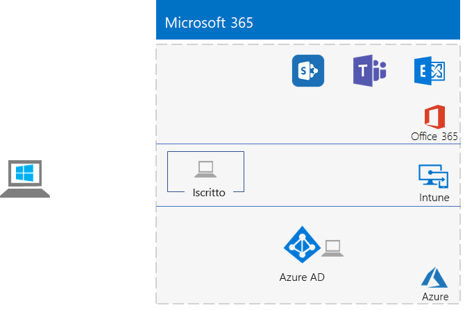
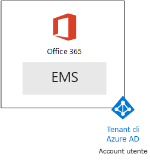

# <a name="the-lightweight-base-configuration"></a><span data-ttu-id="e1d7a-103">La configurazione di base</span><span class="sxs-lookup"><span data-stu-id="e1d7a-103">The lightweight base configuration</span></span>

<span data-ttu-id="e1d7a-104">Questo articolo fornisce istruzioni dettagliate su come creare un ambiente semplificato con un abbonamento Microsoft 365 E5 e un computer che esegue Windows 10 Enterprise.</span><span class="sxs-lookup"><span data-stu-id="e1d7a-104">This article provides you with step-by-step instructions to create a simplified environment with a Microsoft 365 E5 subscription and a computer running Windows 10 Enterprise.</span></span> 



<span data-ttu-id="e1d7a-106">Utilizzare l'ambiente risultante per testare le funzionalità di [Microsoft 365 Enterprise](https://www.microsoft.com/microsoft-365/enterprise).</span><span class="sxs-lookup"><span data-stu-id="e1d7a-106">Use the resulting environment to test the features and functionality of [Microsoft 365 Enterprise](https://www.microsoft.com/microsoft-365/enterprise).</span></span>


  
> [!TIP]
> <span data-ttu-id="e1d7a-108">Fare clic [qui](https://aka.ms/m365etlgstack) per consultare una mappa di tutti gli articoli relativi alla guida al lab test di Microsoft 365 Enterprise.</span><span class="sxs-lookup"><span data-stu-id="e1d7a-108">Click [here](https://aka.ms/m365etlgstack) for a visual map to all the articles in the Microsoft 365 Enterprise Test Lab Guide stack.</span></span>

## <a name="phase-1-create-your-office-365-e5-subscription"></a><span data-ttu-id="e1d7a-109">Fase 1: creare la sottoscrizione di Office 365 E5</span><span class="sxs-lookup"><span data-stu-id="e1d7a-109">Phase 1: Create your Office 365 E5 subscription</span></span>

<span data-ttu-id="e1d7a-110">Seguire i passaggi della fase 2 e della fase 3 dell'[ambiente di sviluppo/test di Office 365](https://docs.microsoft.com/office365/enterprise/office-365-dev-test-environment) per creare un ambiente di sviluppo/test semplificato di Office 365.</span><span class="sxs-lookup"><span data-stu-id="e1d7a-110">Follow the steps in Phase 2 and Phase 3 of the [Office 365 dev/test environment](https://docs.microsoft.com/office365/enterprise/office-365-dev-test-environment) to create a lightweight Office 365 dev/test environment.</span></span>

>[!Note]
><span data-ttu-id="e1d7a-111">È stato creato un abbonamento di valutazione a Office 365 in modo che l'ambiente di sviluppo/test includa un tenant di Azure AD diverso da quelli a pagamento attualmente in uso.</span><span class="sxs-lookup"><span data-stu-id="e1d7a-111">We have you create a trial subscription of Office 365 so that your dev/test environment has a separate Azure AD tenant from any paid subscriptions you currently have.</span></span> <span data-ttu-id="e1d7a-112">Questa separazione indica che è possibile aggiungere e rimuovere utenti e gruppi nel tenant di test senza influire sugli abbonamenti di produzione.</span><span class="sxs-lookup"><span data-stu-id="e1d7a-112">This separation means you can add and remove users and groups in the test tenant without affecting your production subscriptions.</span></span>
>
  
## <a name="phase-2-add-a-microsoft-365-e5-trial-subscription"></a><span data-ttu-id="e1d7a-113">Fase 2: Aggiungere un abbonamento di valutazione a Microsoft 365 E5</span><span class="sxs-lookup"><span data-stu-id="e1d7a-113">Phase 2: Add a Microsoft 365 E5 trial subscription</span></span>

<span data-ttu-id="e1d7a-114">In questa fase è possibile sottoscrivere un abbonamento di valutazione a Microsoft 365 E5 e aggiungerlo alla stessa organizzazione dell'abbonamento di valutazione a Office 365 E5.</span><span class="sxs-lookup"><span data-stu-id="e1d7a-114">In this phase, you sign up for the Microsoft 365 E5 trial subscription and add it to the same organization as your Office 365 E5 trial subscription.</span></span>
  
<span data-ttu-id="e1d7a-115">Aggiungere prima l'abbonamento di valutazione a Microsoft 365 E5 e assegnare una licenza di Microsoft 365 all'account di amministratore globale.</span><span class="sxs-lookup"><span data-stu-id="e1d7a-115">First, add the Microsoft 365 E5 trial subscription and assign a Microsoft 365 license to your global administrator account.</span></span>
  
1. <span data-ttu-id="e1d7a-116">Con un'istanza privata di un browser Internet, accedere all'interfaccia di amministrazione di Microsoft 365 all'indirizzo [http://admin.microsoft.com](http://admin.microsoft.com) con le credenziali dell'account di amministratore globale.</span><span class="sxs-lookup"><span data-stu-id="e1d7a-116">With a private instance of an Internet browser, sign in to the Microsoft 365 admin center at [http://admin.microsoft.com](http://admin.microsoft.com) with your global administrator account credentials.</span></span>
    
2. <span data-ttu-id="e1d7a-117">Nella pagina dell'**interfaccia di amministrazione di Microsoft 365** fare clic su **Fatturazione > Acquisto di servizi** nella barra di spostamento sinistra.</span><span class="sxs-lookup"><span data-stu-id="e1d7a-117">On the **Microsoft 365 admin center** page, in the left navigation, click **Billing > Purchase services**.</span></span>
    
3. <span data-ttu-id="e1d7a-118">Nella pagina **Acquisto di servizi** individuare la voce **Microsoft 365 E5**.</span><span class="sxs-lookup"><span data-stu-id="e1d7a-118">On the **Purchase services** page, find the **Microsoft 365 E5** item.</span></span> <span data-ttu-id="e1d7a-119">Posizionare il puntatore del mouse su di essa e fare clic su **Avvia valutazione gratuita**.</span><span class="sxs-lookup"><span data-stu-id="e1d7a-119">Hover your mouse pointer over it and click **Start free trial**.</span></span>

4. <span data-ttu-id="e1d7a-120">Nella pagina **Valutazione di Microsoft 365 E5** scegliere di ricevere una chiamata o un SMS, immettere il numero di telefono, quindi fare clic su **Inviami un SMS** o **Chiamami**.</span><span class="sxs-lookup"><span data-stu-id="e1d7a-120">On the **Microsoft 365 E5 Trial** page, choose to receive a text or a call, enter your phone number, then click **Text me** or **Call me**.</span></span>

5. <span data-ttu-id="e1d7a-121">Nella pagina **Conferma l'ordine**, fare clic su **Prova adesso**.</span><span class="sxs-lookup"><span data-stu-id="e1d7a-121">On the **Confirm your order** page, click **Try now**.</span></span>

6. <span data-ttu-id="e1d7a-122">Nella pagina **Ricevuta ordine**, fare clic su **Continua**.</span><span class="sxs-lookup"><span data-stu-id="e1d7a-122">On the **Order receipt** page, click **Continue**.</span></span>

7. <span data-ttu-id="e1d7a-123">Nell'interfaccia di amministrazione di Microsoft 365 fare clic su **Utenti attivi**, quindi sull'account dell'amministratore.</span><span class="sxs-lookup"><span data-stu-id="e1d7a-123">In the Microsoft 365 admin center, click **Active users**, and then your administrator account.</span></span>

8. <span data-ttu-id="e1d7a-124">Per **Licenze di prodotti** fare clic su **Modifica**.</span><span class="sxs-lookup"><span data-stu-id="e1d7a-124">Click **Edit** for **Product licenses**.</span></span>

9. <span data-ttu-id="e1d7a-125">Disattivare la licenza per Office 365 Enterprise E5 e attivare la licenza per Microsoft 365 E5.</span><span class="sxs-lookup"><span data-stu-id="e1d7a-125">Turn off the license for Office 365 Enterprise E5 and turn on the license for Microsoft 365 E5.</span></span>

10. <span data-ttu-id="e1d7a-126">Fare clic su **Salva > Chiudi > Chiudi**.</span><span class="sxs-lookup"><span data-stu-id="e1d7a-126">Click **Save > Close > Close**.</span></span>

<span data-ttu-id="e1d7a-127">In seguito, ***se è stata completata la fase 3 dell'***[ambiente di sviluppo/test di Office 365](https://docs.microsoft.com/office365/enterprise/office-365-dev-test-environment), ripetere i passaggi da 8 a 11 della procedura precedente per tutti gli altri account (Utente 2, Utente 3, Utente 4 e Utente 5).</span><span class="sxs-lookup"><span data-stu-id="e1d7a-127">Next, ***if you completed Phase 3 of the*** [Office 365 dev/test environment](https://docs.microsoft.com/office365/enterprise/office-365-dev-test-environment), repeat steps 8 through 11 of the previous procedure for all of your other accounts (User 2, User 3, User 4, and User 5).</span></span>
  
> [!NOTE]
> <span data-ttu-id="e1d7a-128">L'abbonamento di valutazione a Microsoft 365 E5 dura 30 giorni.</span><span class="sxs-lookup"><span data-stu-id="e1d7a-128">The Microsoft 365 E5 trial subscription is 30 days.</span></span> <span data-ttu-id="e1d7a-129">Per un ambiente di test permanente, convertire questo abbonamento di valutazione in uno a pagamento con un numero limitato di licenze.</span><span class="sxs-lookup"><span data-stu-id="e1d7a-129">For a permanent test environment, convert this trial subscription to a paid subscription with a small number of licenses.</span></span> 
  
<span data-ttu-id="e1d7a-130">A questo punto, l'ambiente di test include:</span><span class="sxs-lookup"><span data-stu-id="e1d7a-130">Your test environment now has:</span></span>
  
- <span data-ttu-id="e1d7a-131">Un abbonamento di valutazione a Microsoft 365 E5.</span><span class="sxs-lookup"><span data-stu-id="e1d7a-131">A Microsoft 365 E5 trial subscription.</span></span>
- <span data-ttu-id="e1d7a-132">Tutti gli account utente appropriati (solo l'amministratore globale o tutti e cinque gli account utente) sono abilitati per l'uso di Microsoft 365 E5.</span><span class="sxs-lookup"><span data-stu-id="e1d7a-132">All your appropriate user accounts (either just the global administrator or all five user accounts) are enabled to use Microsoft 365 E5.</span></span>
    
<span data-ttu-id="e1d7a-133">La figura 1 mostra la configurazione risultante che consente di aggiungere Microsoft 365 E5 e include sia Office 365 che Enterprise Security + Management (EMS).</span><span class="sxs-lookup"><span data-stu-id="e1d7a-133">Figure 1 shows your resulting configuration, which adds Microsoft 365 E5, which includes both Office 365 and Enterprise Security + Management (EMS).</span></span>
  
<span data-ttu-id="e1d7a-134">**Figura 1: aggiunta dell'abbonamento di valutazione a Microsoft 365**</span><span class="sxs-lookup"><span data-stu-id="e1d7a-134">**Figure 1: Adding the Microsoft 365 trial subscription**</span></span>


  
## <a name="phase-3-create-a-windows-10-enterprise-computer"></a><span data-ttu-id="e1d7a-136">Fase 3: creare un computer con Windows 10 Enterprise</span><span class="sxs-lookup"><span data-stu-id="e1d7a-136">Phase 3: Create a Windows 10 Enterprise computer</span></span>

<span data-ttu-id="e1d7a-137">In questa fase è necessario creare un computer autonomo con sistema operativo Windows 10 Enterprise, come un computer fisico, una macchina virtuale o una macchina virtuale di Azure.</span><span class="sxs-lookup"><span data-stu-id="e1d7a-137">In this phase, you create a standalone computer running Windows 10 Enterprise as either a physical computer, a virtual machine, or an Azure virtual machine.</span></span>
  
### <a name="physical-computer"></a><span data-ttu-id="e1d7a-138">Computer fisico</span><span class="sxs-lookup"><span data-stu-id="e1d7a-138">Physical computer</span></span>

<span data-ttu-id="e1d7a-p104">Procurarsi un personal computer e installarvi Windows 10 Enterprise. È possibile scaricare la versione di valutazione di Windows 10 Enterprise [qui](https://www.microsoft.com/evalcenter/evaluate-windows-10-enterprise).</span><span class="sxs-lookup"><span data-stu-id="e1d7a-p104">Obtain a personal computer and install Windows 10 Enterprise on it. You can download the Windows 10 Enterprise trial [here](https://www.microsoft.com/evalcenter/evaluate-windows-10-enterprise).</span></span>
  
### <a name="virtual-machine"></a><span data-ttu-id="e1d7a-141">Macchina virtuale</span><span class="sxs-lookup"><span data-stu-id="e1d7a-141">Virtual machine</span></span>

<span data-ttu-id="e1d7a-p105">Creare una macchina virtuale utilizzando l'hypervisor scelto e installarvi Windows 10 Enterprise. È possibile scaricare la versione di valutazione di Windows 10 Enterprise [qui](https://www.microsoft.com/evalcenter/evaluate-windows-10-enterprise).</span><span class="sxs-lookup"><span data-stu-id="e1d7a-p105">Create a virtual machine using the hypervisor of your choice and install Windows 10 Enterprise on it. You can download the Windows 10 Enterprise trial [here](https://www.microsoft.com/evalcenter/evaluate-windows-10-enterprise).</span></span>
  
### <a name="virtual-machine-in-azure"></a><span data-ttu-id="e1d7a-144">Macchina virtuale in Azure</span><span class="sxs-lookup"><span data-stu-id="e1d7a-144">Virtual machine in Azure</span></span>

<span data-ttu-id="e1d7a-p106">Per creare una macchina virtuale con Windows 10 in Microsoft Azure, ***è necessario disporre di una sottoscrizione basata su Visual Studio***, che abbia accesso all'immagine per Windows 10 Enterprise. Altri tipi di sottoscrizioni di Azure, ad esempio le sottoscrizioni di valutazione e quelle a pagamento, non hanno accesso a tale immagine. Per le informazioni più aggiornate, vedere [Utilizzare un client Windows in Azure per gli scenari di sviluppo/test](https://docs.microsoft.com/azure/virtual-machines/windows/client-images).</span><span class="sxs-lookup"><span data-stu-id="e1d7a-p106">To create a Windows 10 virtual machine in Microsoft Azure, ***you must have a Visual Studio-based subscription***, which has access to the image for Windows 10 Enterprise. Other types of Azure subscriptions, such as trial and paid subscriptions, do not have access to this image. For the latest information, see [Use Windows client in Azure for dev/test scenarios](https://docs.microsoft.com/azure/virtual-machines/windows/client-images).</span></span>
  
> [!NOTE]
> <span data-ttu-id="e1d7a-p107">I seguenti comandi consentono di utilizzare la versione più recente di Azure PowerShell. Vedere [Panoramica dei cmdlet di Azure PowerShell](https://docs.microsoft.com/powershell/azureps-cmdlets-docs/). Questi set di comandi creano una macchina virtuale con Windows 10 Enterprise denominata WIN10 e tutte le infrastrutture relative necessarie, tra cui un gruppo di risorse, un account di archiviazione e una rete virtuale. Se si ha già familiarità con i servizi di infrastruttura di Azure, si consiglia di adattare queste istruzioni all’infrastruttura attualmente implementata.</span><span class="sxs-lookup"><span data-stu-id="e1d7a-p107">The following command sets use the latest version of Azure PowerShell. See [Get started with Azure PowerShell cmdlets](https://docs.microsoft.com/powershell/azureps-cmdlets-docs/). These command sets build a Windows 10 Enterprise virtual machine named WIN10 and all of its required infrastructure, including a resource group, a storage account, and a virtual network. If you are already familiar with Azure infrastructure services, please adapt these instructions to suit your currently deployed infrastructure.</span></span> 
  
<span data-ttu-id="e1d7a-152">Innanzitutto, avviare un prompt di Microsoft PowerShell.</span><span class="sxs-lookup"><span data-stu-id="e1d7a-152">First, start a Microsoft PowerShell prompt.</span></span>
  
<span data-ttu-id="e1d7a-153">Accedere al proprio account Azure con il seguente comando.</span><span class="sxs-lookup"><span data-stu-id="e1d7a-153">Sign in to your Azure account with the following command.</span></span>
  
```
Connect-AzAccount
```

<span data-ttu-id="e1d7a-154">Ottenere il nome della sottoscrizione utilizzando il comando seguente.</span><span class="sxs-lookup"><span data-stu-id="e1d7a-154">Get your subscription name using the following command.</span></span>
  
```
Get-AzSubscription | Sort Name | Select Name
```

<span data-ttu-id="e1d7a-p108">Impostare la sottoscrizione di Azure. Sostituire tutto il testo racchiuso tra virgolette, compresi i caratteri \< e >, con il nome corretto.</span><span class="sxs-lookup"><span data-stu-id="e1d7a-p108">Set your Azure subscription. Replace everything within the quotes, including the \< and > characters, with the correct name.</span></span>
  
```
$subscr="<subscription name>"
Get-AzSubscription -SubscriptionName $subscr | Select-AzSubscription
```

<span data-ttu-id="e1d7a-p109">Quindi, creare un nuovo gruppo di risorse. Per definire un nome del gruppo di risorse univoco, utilizzare questo comando per creare un elenco di gruppi di risorse esistenti.</span><span class="sxs-lookup"><span data-stu-id="e1d7a-p109">Next, create a new resource group. To determine a unique resource group name, use this command to list your existing resource groups.</span></span>
  
```
Get-AzResourceGroup | Sort ResourceGroupName | Select ResourceGroupName
```

<span data-ttu-id="e1d7a-p110">Creare il nuovo gruppo di risorse con questi comandi. Sostituire tutto il testo racchiuso tra virgolette, compresi i caratteri \< e >, con i nomi corretti.</span><span class="sxs-lookup"><span data-stu-id="e1d7a-p110">Create your new resource group with these commands. Replace everything within the quotes, including the \< and > characters, with the correct names.</span></span>
  
```
$rgName="<resource group name>"
$locName="<location name, such as West US>"
New-AzResourceGroup -Name $rgName -Location $locName
```

<span data-ttu-id="e1d7a-p111">Successivamente, creare una nuova rete virtuale e la macchina virtuale con WIN10 con questi comandi. Quando richiesto, fornire il nome e la password dell'account Administrator locale per WIN10 e archiviare questi elementi in un luogo sicuro.</span><span class="sxs-lookup"><span data-stu-id="e1d7a-p111">Next, you create a new virtual network and the WIN10 virtual machine with these commands. When prompted, provide the name and password of the local administrator account for WIN10 and store these in a secure location.</span></span>
  
```
$corpnetSubnet=New-AzVirtualNetworkSubnetConfig -Name Corpnet -AddressPrefix 10.0.0.0/24
New-AzVirtualNetwork -Name "M365Ent-TestLab" -ResourceGroupName $rgName -Location $locName -AddressPrefix 10.0.0.0/8 -Subnet $corpnetSubnet
$rule1=New-AzNetworkSecurityRuleConfig -Name "RDPTraffic" -Description "Allow RDP to all VMs on the subnet" -Access Allow -Protocol Tcp -Direction Inbound -Priority 100 -SourceAddressPrefix Internet -SourcePortRange * -DestinationAddressPrefix * -DestinationPortRange 3389
New-AzNetworkSecurityGroup -Name Corpnet -ResourceGroupName $rgName -Location $locName -SecurityRules $rule1
$vnet=Get-AzVirtualNetwork -ResourceGroupName $rgName -Name "M365Ent-TestLab"
$nsg=Get-AzNetworkSecurityGroup -Name Corpnet -ResourceGroupName $rgName
Set-AzVirtualNetworkSubnetConfig -VirtualNetwork $vnet -Name Corpnet -AddressPrefix "10.0.0.0/24" -NetworkSecurityGroup $nsg
$vnet | Set-AzVirtualNetwork
$pip=New-AzPublicIpAddress -Name WIN10-PIP -ResourceGroupName $rgName -Location $locName -AllocationMethod Dynamic
$nic=New-AzNetworkInterface -Name WIN10-NIC -ResourceGroupName $rgName -Location $locName -SubnetId $vnet.Subnets[0].Id -PublicIpAddressId $pip.Id
$vm=New-AzVMConfig -VMName WIN10 -VMSize Standard_D1_V2
$cred=Get-Credential -Message "Type the name and password of the local administrator account for WIN10."
$vm=Set-AzVMOperatingSystem -VM $vm -Windows -ComputerName WIN10 -Credential $cred -ProvisionVMAgent -EnableAutoUpdate
$vm=Set-AzVMSourceImage -VM $vm -PublisherName MicrosoftWindowsDesktop -Offer Windows-10 -Skus RS3-Pro -Version "latest"
$vm=Add-AzVMNetworkInterface -VM $vm -Id $nic.Id
$vm=Set-AzVMOSDisk -VM $vm -Name WIN10-TestLab-OSDisk -DiskSizeInGB 128 -CreateOption FromImage
New-AzVM -ResourceGroupName $rgName -Location $locName -VM $vm
```

## <a name="phase-4-join-your-windows-10-computer-to-azure-ad"></a><span data-ttu-id="e1d7a-163">Fase 4: aggiungere il proprio computer con Windows 10 ad Azure AD</span><span class="sxs-lookup"><span data-stu-id="e1d7a-163">Phase 4: Join your Windows 10 computer to Azure AD</span></span>

<span data-ttu-id="e1d7a-164">Dopo che la macchina virtuale o fisica con Windows 10 Enterprise è stata creata, accedere con un account amministratore locale.</span><span class="sxs-lookup"><span data-stu-id="e1d7a-164">After the physical or virtual machine with Windows 10 Enterprise is created, sign in with a local administrator account.</span></span>
  
> [!NOTE]
> <span data-ttu-id="e1d7a-165">Per una macchina virtuale in Azure, connettersi seguendo [queste istruzioni](https://docs.microsoft.com/azure/virtual-machines/windows/connect-logon).</span><span class="sxs-lookup"><span data-stu-id="e1d7a-165">For a virtual machine in Azure, connect to it using [these instructions](https://docs.microsoft.com/azure/virtual-machines/windows/connect-logon).</span></span>
  
<span data-ttu-id="e1d7a-166">Successivamente, aggiungere il computer WIN10 al tenant di Azure AD dell'abbonamento a Microsoft 365 E5.</span><span class="sxs-lookup"><span data-stu-id="e1d7a-166">Next, join the WIN10 computer to the Azure AD tenant of your Microsoft 365 E5 subscription.</span></span>
  
1. <span data-ttu-id="e1d7a-167">Nel desktop del computer WIN10, fare clic su **Start > Impostazioni > Account > Accedi all'azienda o all'istituto di istruzione > Connetti**.</span><span class="sxs-lookup"><span data-stu-id="e1d7a-167">At the desktop of the WIN10 computer, click **Start > Settings > Accounts > Access work or school > Connect**.</span></span>
    
2. <span data-ttu-id="e1d7a-168">Nella finestra di dialogo **Configura un account aziendale o dell'istituto di istruzione**, fare clic su **Aggiungi il dispositivo ad Azure Active Directory**.</span><span class="sxs-lookup"><span data-stu-id="e1d7a-168">In the **Set up a work or school account** dialog box, click **Join this device to Azure Active Directory**.</span></span>
    
3. <span data-ttu-id="e1d7a-169">In **Account aziendale o dell'istituto di istruzione** digitare il nome dell'account di amministratore globale dell'abbonamento a Microsoft 365, quindi fare clic su **Avanti**.</span><span class="sxs-lookup"><span data-stu-id="e1d7a-169">In **Work or school account**, type the global administrator account name of your Microsoft 365 E5 subscription, and then click **Next**.</span></span>
    
4. <span data-ttu-id="e1d7a-170">In **Immettere la password**, digitare la password dell’account Administrator locale, quindi fare clic su **Accedi**.</span><span class="sxs-lookup"><span data-stu-id="e1d7a-170">In **Enter password**, type the password for your global administrator account, and then click **Sign in**.</span></span>
    
5. <span data-ttu-id="e1d7a-171">Quando viene richiesto di verificare che l’organizzazione sia la propria, fare clic su **Aggiungi**, quindi fare clic su **Fatto**.</span><span class="sxs-lookup"><span data-stu-id="e1d7a-171">When prompted to make sure this is your organization, click **Join**, and then click **Done**.</span></span>
    
6. <span data-ttu-id="e1d7a-172">Chiudere la finestra delle impostazioni.</span><span class="sxs-lookup"><span data-stu-id="e1d7a-172">Close the settings window.</span></span>
    
<span data-ttu-id="e1d7a-173">Successivamente, installare Office 365 ProPlus nel computer WIN10</span><span class="sxs-lookup"><span data-stu-id="e1d7a-173">Next, install Office 365 ProPlus on the WIN10 computer.</span></span>
  
1. <span data-ttu-id="e1d7a-174">Aprire il browser Microsoft Edge e accedere al portale di Office con le credenziali dell'account di amministratore globale.</span><span class="sxs-lookup"><span data-stu-id="e1d7a-174">Open the Microsoft Edge browser and sign in to the Office portal with your global administrator account credentials.</span></span> <span data-ttu-id="e1d7a-175">Per informazioni, vedere [Dove accedere a Office 365](https://support.office.com/Article/Where-to-sign-in-to-Office-365-e9eb7d51-5430-4929-91ab-6157c5a050b4).</span><span class="sxs-lookup"><span data-stu-id="e1d7a-175">For help, see [Where to sign in to Office 365](https://support.office.com/Article/Where-to-sign-in-to-Office-365-e9eb7d51-5430-4929-91ab-6157c5a050b4).</span></span>
    
2. <span data-ttu-id="e1d7a-176">Nella scheda **Microsoft Office Home** fare clic su **Installa Office**.</span><span class="sxs-lookup"><span data-stu-id="e1d7a-176">On the **Microsoft Office Home** tab, click **Install Office**.</span></span>
    
3. <span data-ttu-id="e1d7a-177">Quando viene richiesto di eseguire operazioni, fare clic su **Esegui**, quindi fare clic su **Sì** per **Controllo dell'account utente**.</span><span class="sxs-lookup"><span data-stu-id="e1d7a-177">When prompted with what to do, click **Run**, and then click **Yes** for **User Account Control**.</span></span>
    
4. <span data-ttu-id="e1d7a-p113">Attendere che l’installazione di Office venga completata. Quando viene visualizzato **La configurazione è completata**, fare clic su **Chiudi** due volte.</span><span class="sxs-lookup"><span data-stu-id="e1d7a-p113">Wait for Office to complete its installation. When you see **You're all set!**, click **Close** twice.</span></span>
    
<span data-ttu-id="e1d7a-180">La figura 3 mostra l'ambiente risultante che include il computer WIN10 il quale:</span><span class="sxs-lookup"><span data-stu-id="e1d7a-180">Figure 3 shows your resulting environment, which includes the WIN10 computer that has:</span></span>

- <span data-ttu-id="e1d7a-181">È stato aggiunto al tenant di Azure AD dell'abbonamento a Microsoft 365 E5.</span><span class="sxs-lookup"><span data-stu-id="e1d7a-181">Joined the Azure AD tenant of your Microsoft 365 E5 subscription.</span></span>
- <span data-ttu-id="e1d7a-182">È stato registrato come dispositivo Azure AD in Microsoft Intune (EMS).</span><span class="sxs-lookup"><span data-stu-id="e1d7a-182">Enrolled as an Azure AD device in Microsoft Intune (EMS).</span></span>
- <span data-ttu-id="e1d7a-183">Include l'installazione di Office 365 ProPlus.</span><span class="sxs-lookup"><span data-stu-id="e1d7a-183">Has Office 365 ProPlus installed.</span></span>
  
<span data-ttu-id="e1d7a-184">**Figura 2: configurazione finale dell'ambiente di testing di Microsoft 365**</span><span class="sxs-lookup"><span data-stu-id="e1d7a-184">**Figure 2: The final configuration of the Microsoft 365 test environment**</span></span>


  
<span data-ttu-id="e1d7a-186">A questo punto è possibile sperimentare le funzionalità aggiuntive di [Microsoft 365 Enterprise](https://www.microsoft.com/microsoft-365/enterprise).</span><span class="sxs-lookup"><span data-stu-id="e1d7a-186">You are now ready to experiment with additional features of [Microsoft 365 Enterprise](https://www.microsoft.com/microsoft-365/enterprise).</span></span>
  
## <a name="next-steps"></a><span data-ttu-id="e1d7a-187">Passaggi successivi</span><span class="sxs-lookup"><span data-stu-id="e1d7a-187">Next steps</span></span>

<span data-ttu-id="e1d7a-188">Esplorare questi altri insiemi di guide al lab test:</span><span class="sxs-lookup"><span data-stu-id="e1d7a-188">Explore these additional sets of Test Lab Guides:</span></span>
  
- [<span data-ttu-id="e1d7a-189">Identità</span><span class="sxs-lookup"><span data-stu-id="e1d7a-189">Identity</span></span>](m365-enterprise-test-lab-guides.md#identity)
- [<span data-ttu-id="e1d7a-190">Gestione dei dispositivi mobili</span><span class="sxs-lookup"><span data-stu-id="e1d7a-190">Mobile device management</span></span>](m365-enterprise-test-lab-guides.md#mobile-device-management)
- [<span data-ttu-id="e1d7a-191">Protezione delle informazioni</span><span class="sxs-lookup"><span data-stu-id="e1d7a-191">Information protection</span></span>](m365-enterprise-test-lab-guides.md#information-protection)
   

## <a name="see-also"></a><span data-ttu-id="e1d7a-192">Vedere anche</span><span class="sxs-lookup"><span data-stu-id="e1d7a-192">See also</span></span>

[<span data-ttu-id="e1d7a-193">Guide al lab di test di Microsoft 365 Enterprise</span><span class="sxs-lookup"><span data-stu-id="e1d7a-193">Microsoft 365 Enterprise Test Lab Guides</span></span>](m365-enterprise-test-lab-guides.md)

[<span data-ttu-id="e1d7a-194">Distribuzione di Microsoft 365 Enterprise</span><span class="sxs-lookup"><span data-stu-id="e1d7a-194">Deploy Microsoft 365 Enterprise</span></span>](deploy-microsoft-365-enterprise.md)

[<span data-ttu-id="e1d7a-195">Documentazione di Microsoft 365 Enterprise</span><span class="sxs-lookup"><span data-stu-id="e1d7a-195">Microsoft 365 Enterprise documentation</span></span>](https://docs.microsoft.com/microsoft-365-enterprise/)
