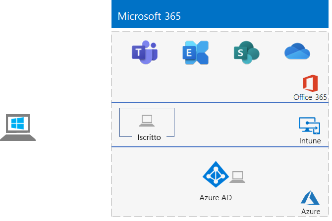

# <a name="the-lightweight-base-configuration"></a><span data-ttu-id="d2d3a-103">La configurazione di base</span><span class="sxs-lookup"><span data-stu-id="d2d3a-103">The lightweight base configuration</span></span>

<span data-ttu-id="d2d3a-104">*Questa guida al laboratorio di testing può essere usata sia per gli ambienti di testing di Microsoft 365 per le aziende che per gli ambienti di testing di Office 365 Enterprise.*</span><span class="sxs-lookup"><span data-stu-id="d2d3a-104">*This Test Lab Guide can be used for both Microsoft 365 for enterprise and Office 365 Enterprise test environments.*</span></span>

<span data-ttu-id="d2d3a-105">Questo articolo descrive come creare un ambiente semplificato con una sottoscrizione a Microsoft 365 E5 e un computer che esegue Windows 10 Enterprise.</span><span class="sxs-lookup"><span data-stu-id="d2d3a-105">This article describes how to create a simplified environment with a Microsoft 365 E5 subscription and a computer running Windows 10 Enterprise.</span></span>



<span data-ttu-id="d2d3a-107">La creazione di un ambiente di testing leggero prevede cinque fasi:</span><span class="sxs-lookup"><span data-stu-id="d2d3a-107">Creating a lightweight test environment involves five phases:</span></span>
- [<span data-ttu-id="d2d3a-108">Fase 1: creare l'abbonamento a Microsoft 365 E5</span><span class="sxs-lookup"><span data-stu-id="d2d3a-108">Phase 1: Create your Microsoft 365 E5 subscription</span></span>](#phase-1-create-your-microsoft-365-e5-subscription)
- [<span data-ttu-id="d2d3a-109">Fase 2: configurare l'abbonamento di valutazione a Office 365</span><span class="sxs-lookup"><span data-stu-id="d2d3a-109">Phase 2: Configure your Office 365 trial subscription</span></span>](#phase-2-configure-your-office-365-trial-subscription)
- [<span data-ttu-id="d2d3a-110">Fase 3: aggiungere un abbonamento di valutazione a Microsoft 365 E5</span><span class="sxs-lookup"><span data-stu-id="d2d3a-110">Phase 3: Add a Microsoft 365 E5 trial subscription</span></span>](#phase-3-add-a-microsoft-365-e5-trial-subscription)
- [<span data-ttu-id="d2d3a-111">Fase 4: creare un computer con Windows 10 Enterprise</span><span class="sxs-lookup"><span data-stu-id="d2d3a-111">Phase 4: Create a Windows 10 Enterprise computer</span></span>](#phase-4-create-a-windows-10-enterprise-computer)
- [<span data-ttu-id="d2d3a-112">Fase 5: aggiungere il proprio computer con Windows 10 ad Azure AD</span><span class="sxs-lookup"><span data-stu-id="d2d3a-112">Phase 5: Join your Windows 10 computer to Azure AD</span></span>](#phase-5-join-your-windows-10-computer-to-azure-ad)

<span data-ttu-id="d2d3a-113">Utilizzare l'ambiente risultante per testare le caratteristiche e le funzionalità di [Microsoft 365 per le aziende.](https://www.microsoft.com/microsoft-365/enterprise)</span><span class="sxs-lookup"><span data-stu-id="d2d3a-113">Use the resulting environment to test the features and functionality of [Microsoft 365 for enterprise](https://www.microsoft.com/microsoft-365/enterprise).</span></span>


  
> [!TIP]
> <span data-ttu-id="d2d3a-115">Per una mappa visiva a tutti gli articoli dello stack di Guida del laboratorio di testing di Microsoft 365 per le aziende, vedere [Microsoft 365 for enterprise Test Lab Guide Stack.](../downloads/Microsoft365EnterpriseTLGStack.pdf)</span><span class="sxs-lookup"><span data-stu-id="d2d3a-115">For a visual map to all the articles in the Microsoft 365 for enterprise Test Lab Guide stack, see [Microsoft 365 for enterprise Test Lab Guide Stack](../downloads/Microsoft365EnterpriseTLGStack.pdf).</span></span>

>[!NOTE]
><span data-ttu-id="d2d3a-116">Si consiglia di stampare questo articolo per registrare le informazioni specifiche necessarie per questo ambiente nei 30 giorni dell'abbonamento di valutazione a Office 365.</span><span class="sxs-lookup"><span data-stu-id="d2d3a-116">You might want to print this article to record the specific information that you will need for this environment over the 30 days of the Office 365 trial subscription.</span></span> <span data-ttu-id="d2d3a-117">È possibile estendere l'abbonamento di prova per altri 30 giorni.</span><span class="sxs-lookup"><span data-stu-id="d2d3a-117">You can easily extend the trail subscription for another 30 days.</span></span> <span data-ttu-id="d2d3a-118">Per un ambiente di testing permanente, creare un nuovo abbonamento a pagamento con un tenant di Azure AD separato e un numero limitato di licenze.</span><span class="sxs-lookup"><span data-stu-id="d2d3a-118">For a permanent test environment, create a new paid subscription with a separate Azure AD tenant and a small number of licenses.</span></span>

## <a name="phase-1-create-your-microsoft-365-e5-subscription"></a><span data-ttu-id="d2d3a-119">Fase 1: creare l'abbonamento a Microsoft 365 E5</span><span class="sxs-lookup"><span data-stu-id="d2d3a-119">Phase 1: Create your Microsoft 365 E5 subscription</span></span>

<span data-ttu-id="d2d3a-120">Iniziamo con una sottoscrizione di valutazione di Microsoft 365 E5 e quindi aggiungiamo l'abbonamento a Microsoft 365 E5.</span><span class="sxs-lookup"><span data-stu-id="d2d3a-120">We start with an Microsoft 365 E5 trial subscription and then add the Microsoft 365 E5 subscription to it.</span></span>

>[!NOTE]
><span data-ttu-id="d2d3a-121">È consigliabile creare una sottoscrizione di valutazione di Office 365 in modo che l'ambiente di testing abbia un tenant di Azure AD separato da tutte le sottoscrizioni a pagamento attualmente disponibili.</span><span class="sxs-lookup"><span data-stu-id="d2d3a-121">We recommend that you create a trial subscription of Office 365 so that your test environment has a separate Azure AD tenant from any paid subscriptions you currently have.</span></span> <span data-ttu-id="d2d3a-122">Questa separazione significa che è possibile aggiungere e rimuovere utenti e gruppi nel tenant di test senza influire sulle sottoscrizioni di produzione.</span><span class="sxs-lookup"><span data-stu-id="d2d3a-122">This separation means that you can add and remove users and groups in the test tenant without affecting your production subscriptions.</span></span>

<span data-ttu-id="d2d3a-123">Per avviare l'abbonamento di valutazione a Microsoft 365 E5, è necessario innanzitutto un nome di società fittizia e un nuovo account Microsoft.</span><span class="sxs-lookup"><span data-stu-id="d2d3a-123">To start your Microsoft 365 E5 trial subscription, you first need a fictitious company name and a new Microsoft account.</span></span>
  
1. <span data-ttu-id="d2d3a-p103">Si consiglia di utilizzare una variante del nome aziendale Contoso per il nome dell'azienda, che è un nome aziendale fittizio utilizzato nel contenuto di esempio di Microsoft, ma non è obbligatorio. Registrare il nome della società fittizia qui:</span><span class="sxs-lookup"><span data-stu-id="d2d3a-p103">We recommend that you use a variant of the company name Contoso for your company name, which is a fictitious company used in Microsoft sample content, but it isn't required. Record your fictitious company name here:</span></span> 
    
2. <span data-ttu-id="d2d3a-p104">Per registrare un nuovo account Microsoft, andare su [https://outlook.com](https://outlook.com) e creare un account con un nuovo account di posta elettronica e indirizzo. Utilizzare questo account per iscriversi a Office 365.</span><span class="sxs-lookup"><span data-stu-id="d2d3a-p104">To sign up for a new Microsoft account, go to [https://outlook.com](https://outlook.com) and create an account with a new email account and address. You will use this account to sign up for Office 365.</span></span>
    
    - <span data-ttu-id="d2d3a-129">Registrare il nome e cognome del nuovo account qui:</span><span class="sxs-lookup"><span data-stu-id="d2d3a-129">Record the first and last name of your new account here:</span></span> 
    
    - <span data-ttu-id="d2d3a-131">Registrare l'indirizzo di posta elettronica del nuovo account qui:</span><span class="sxs-lookup"><span data-stu-id="d2d3a-131">Record the new email account address here:</span></span> <span data-ttu-id="d2d3a-133">@outlook.com</span><span class="sxs-lookup"><span data-stu-id="d2d3a-133">@outlook.com</span></span>
    
### <a name="sign-up-for-an-office-365-e5-trial-subscription"></a><span data-ttu-id="d2d3a-134">Registrare un abbonamento di valutazione di Office 365 E5</span><span class="sxs-lookup"><span data-stu-id="d2d3a-134">Sign up for an Office 365 E5 trial subscription</span></span>

1. <span data-ttu-id="d2d3a-135">Nel browser passare a [https://aka.ms/e5trial](https://aka.ms/e5trial) .</span><span class="sxs-lookup"><span data-stu-id="d2d3a-135">In your browser, go to [https://aka.ms/e5trial](https://aka.ms/e5trial).</span></span>
    
2. <span data-ttu-id="d2d3a-136">Nel passaggio 1 della pagina **Grazie per la scelta di Office 365 E5,** immettere il nuovo indirizzo dell'account di posta elettronica.</span><span class="sxs-lookup"><span data-stu-id="d2d3a-136">In step 1 of the **Thank you for choosing Office 365 E5** page, enter your new email account address.</span></span>
3. <span data-ttu-id="d2d3a-137">Nel passaggio 2 del processo di sottoscrizione trail, immettere le informazioni richieste ed eseguire la verifica.</span><span class="sxs-lookup"><span data-stu-id="d2d3a-137">In step 2 of the trail subscription process, enter the requested information, and then perform the verification.</span></span>
4. <span data-ttu-id="d2d3a-138">Nel passaggio 3 immettere un nome di organizzazione e quindi un nome di account che sarà l'amministratore globale per la sottoscrizione.</span><span class="sxs-lookup"><span data-stu-id="d2d3a-138">In step 3, enter an organization name and then an account name that will be the global admin for the subscription.</span></span>
5. <span data-ttu-id="d2d3a-139">Per il passaggio 4, registrare la pagina di accesso qui (selezionare e copiare):</span><span class="sxs-lookup"><span data-stu-id="d2d3a-139">For step 4, record the sign-in page here (select and copy):</span></span> 
6. <span data-ttu-id="d2d3a-141">Registrare l'ID utente qui: .onmicrosoft.com</span><span class="sxs-lookup"><span data-stu-id="d2d3a-141">Record the user ID here: .onmicrosoft.com</span></span>  
   <span data-ttu-id="d2d3a-142">Registrare la password immessa in un luogo sicuro.</span><span class="sxs-lookup"><span data-stu-id="d2d3a-142">Record the password that you entered in a secure location.</span></span>
   <span data-ttu-id="d2d3a-143">Questo valore verrà chiamato **Nome amministratore globale**.</span><span class="sxs-lookup"><span data-stu-id="d2d3a-143">This value will be referred to as the **global administrator name**.</span></span>
7. <span data-ttu-id="d2d3a-144">Selezionare **Vai al programma di installazione**.</span><span class="sxs-lookup"><span data-stu-id="d2d3a-144">Select **Go to Setup**.</span></span>
8. <span data-ttu-id="d2d3a-145">Nel programma di installazione di Office 365 E5 selezionare Continua a usare il **file .onmicrosoft.com** dell'organizzazione per la posta elettronica e l'accesso, quindi selezionare **Esci e continua in seguito.**</span><span class="sxs-lookup"><span data-stu-id="d2d3a-145">In Office 365 E5 Setup, select **Continue using *your organization*.onmicrosoft.com for email and signing in**, and then select **Exit and continue later**.</span></span>

<span data-ttu-id="d2d3a-146">Dovrebbe essere visualizzata l'interfaccia di amministrazione di Microsoft 365.</span><span class="sxs-lookup"><span data-stu-id="d2d3a-146">You should see the Microsoft 365 admin center.</span></span>
    
## <a name="phase-2-configure-your-office-365-trial-subscription"></a><span data-ttu-id="d2d3a-147">Fase 2: configurare l'abbonamento di valutazione a Office 365</span><span class="sxs-lookup"><span data-stu-id="d2d3a-147">Phase 2: Configure your Office 365 trial subscription</span></span>

<span data-ttu-id="d2d3a-148">In questa fase è possibile configurare l'abbonamento con altri utenti e assegnare questi ultimi le licenze di Office 365 E5.</span><span class="sxs-lookup"><span data-stu-id="d2d3a-148">In this phase, you configure your subscription with additional users and assign them Office 365 E5 licenses.</span></span>
  
<span data-ttu-id="d2d3a-149">Per connettersi alla sottoscrizione con il modulo Azure Active Directory PowerShell per Graph dal computer, seguire le istruzioni in Connettersi a [Microsoft 365 con PowerShell.](connect-to-microsoft-365-powershell.md#connect-with-the-azure-active-directory-powershell-for-graph-module)</span><span class="sxs-lookup"><span data-stu-id="d2d3a-149">To connect to your subscription with the Azure Active Directory PowerShell for Graph module from your computer, use the instructions in [Connect to Microsoft 365 with PowerShell](connect-to-microsoft-365-powershell.md#connect-with-the-azure-active-directory-powershell-for-graph-module).</span></span>
    
<span data-ttu-id="d2d3a-150">Nella finestra **Windows PowerShell richiesta credenziali** immettere il nome dell'amministratore globale (ad esempio, *jdoe@contosotoycompany.onmicrosoft.com*) e la password.</span><span class="sxs-lookup"><span data-stu-id="d2d3a-150">In the **Windows PowerShell Credential Request** dialog box, enter the global administrator name (for example, *jdoe@contosotoycompany.onmicrosoft.com*) and password.</span></span>
  
<span data-ttu-id="d2d3a-151">Compilare il nome dell'organizzazione (ad esempio, *contosotoycompany),* il codice paese a due caratteri per la propria posizione, una password dell'account comune e quindi eseguire i comandi seguenti dal prompt di PowerShell:</span><span class="sxs-lookup"><span data-stu-id="d2d3a-151">Fill in your organization name (for example, *contosotoycompany*), the two-character country code for your location, a common account password, and then run the following commands from the PowerShell prompt:</span></span>

```powershell
$orgName="<organization name>"
$loc="<two-character country code, such as US>"
$commonPW="<common user account password>"
$PasswordProfile=New-Object -TypeName Microsoft.Open.AzureAD.Model.PasswordProfile
$PasswordProfile.Password=$commonPW

$userUPN= "user2@" + $orgName + ".onmicrosoft.com"
New-AzureADUser -DisplayName "User 2" -GivenName User -SurName 2 -UserPrincipalName $userUPN -UsageLocation $loc -AccountEnabled $true -PasswordProfile $PasswordProfile -MailNickName "user2"
$License = New-Object -TypeName Microsoft.Open.AzureAD.Model.AssignedLicense
$License.SkuId = (Get-AzureADSubscribedSku | Where-Object -Property SkuPartNumber -Value "ENTERPRISEPREMIUM" -EQ).SkuID
$LicensesToAssign = New-Object -TypeName Microsoft.Open.AzureAD.Model.AssignedLicenses
$LicensesToAssign.AddLicenses = $License
Set-AzureADUserLicense -ObjectId $userUPN -AssignedLicenses $LicensesToAssign

$userUPN= "user3@" + $orgName + ".onmicrosoft.com"
New-AzureADUser -DisplayName "User 3" -GivenName User -SurName 3 -UserPrincipalName $userUPN -UsageLocation $loc -AccountEnabled $true -PasswordProfile $PasswordProfile -MailNickName "user3"
$License = New-Object -TypeName Microsoft.Open.AzureAD.Model.AssignedLicense
$License.SkuId = (Get-AzureADSubscribedSku | Where-Object -Property SkuPartNumber -Value "ENTERPRISEPREMIUM" -EQ).SkuID
$LicensesToAssign = New-Object -TypeName Microsoft.Open.AzureAD.Model.AssignedLicenses
$LicensesToAssign.AddLicenses = $License
Set-AzureADUserLicense -ObjectId $userUPN -AssignedLicenses $LicensesToAssign

$userUPN= "user4@" + $orgName + ".onmicrosoft.com"
New-AzureADUser -DisplayName "User 4" -GivenName User -SurName 4 -UserPrincipalName $userUPN -UsageLocation $loc -AccountEnabled $true -PasswordProfile $PasswordProfile -MailNickName "user4"
$License = New-Object -TypeName Microsoft.Open.AzureAD.Model.AssignedLicense
$License.SkuId = (Get-AzureADSubscribedSku | Where-Object -Property SkuPartNumber -Value "ENTERPRISEPREMIUM" -EQ).SkuID
$LicensesToAssign = New-Object -TypeName Microsoft.Open.AzureAD.Model.AssignedLicenses
$LicensesToAssign.AddLicenses = $License
Set-AzureADUserLicense -ObjectId $userUPN -AssignedLicenses $LicensesToAssign
```
> [!NOTE]
> <span data-ttu-id="d2d3a-152">L'uso di una password comune qui consente l'automazione e agevola la configurazione per un ambiente di testing.</span><span class="sxs-lookup"><span data-stu-id="d2d3a-152">The use of a common password here is for automation and ease of configuration for a test environment.</span></span> <span data-ttu-id="d2d3a-153">Ovviamente, questo approccio è sconsigliato per le sottoscrizioni di produzione.</span><span class="sxs-lookup"><span data-stu-id="d2d3a-153">Obviously, this is highly discouraged for production subscriptions.</span></span> 

### <a name="record-key-information-for-future-reference"></a><span data-ttu-id="d2d3a-154">Registrare informazioni chiave per riferimenti futuri</span><span class="sxs-lookup"><span data-stu-id="d2d3a-154">Record key information for future reference</span></span>

<span data-ttu-id="d2d3a-155">Se questi valori non sono già stati registrati, registrarli ora:</span><span class="sxs-lookup"><span data-stu-id="d2d3a-155">If you haven't already recorded these values, record them now:</span></span>
  
- <span data-ttu-id="d2d3a-156">Nome amministratore globale:</span><span class="sxs-lookup"><span data-stu-id="d2d3a-156">Global administrator name:</span></span> <span data-ttu-id="d2d3a-158">.onmicrosoft.com (dal passaggio 6 della fase 1)</span><span class="sxs-lookup"><span data-stu-id="d2d3a-158">.onmicrosoft.com (from step 6 of Phase 1)</span></span>
    
    <span data-ttu-id="d2d3a-159">Annotare anche la password di questo account in una posizione sicura.</span><span class="sxs-lookup"><span data-stu-id="d2d3a-159">Also record the password for this account in a secure location.</span></span>
    
- <span data-ttu-id="d2d3a-160">Nome dell'organizzazione dell'abbonamento di valutazione:</span><span class="sxs-lookup"><span data-stu-id="d2d3a-160">Your trial subscription organization name:</span></span>  <span data-ttu-id="d2d3a-162">(dal passaggio 4 della fase 1)</span><span class="sxs-lookup"><span data-stu-id="d2d3a-162">(from step 4 of Phase 1)</span></span>
    
- <span data-ttu-id="d2d3a-163">Per elencare gli account di User 2, User 3, User 4, e User 5, eseguire i comandi seguenti dal modulo di Microsoft Azure Active Directory per il prompt di Windows PowerShell:</span><span class="sxs-lookup"><span data-stu-id="d2d3a-163">To list the accounts for User 2, User 3, User 4, and User 5, run the following command from the Windows Azure Active Directory Module for Windows PowerShell prompt:</span></span>
    
  ```powershell
  Get-AzureADUser | Sort UserPrincipalName | Select UserPrincipalName
  ```

    <span data-ttu-id="d2d3a-164">Registrare i nomi degli account qui:</span><span class="sxs-lookup"><span data-stu-id="d2d3a-164">Record the account names here:</span></span>
    
  - <span data-ttu-id="d2d3a-165">Nome account utente 2: user2@</span><span class="sxs-lookup"><span data-stu-id="d2d3a-165">User 2 account name: user2@</span></span><span data-ttu-id="d2d3a-167">.onmicrosoft.com</span><span class="sxs-lookup"><span data-stu-id="d2d3a-167">.onmicrosoft.com</span></span>
    
  - <span data-ttu-id="d2d3a-168">Nome account utente 3: user3@</span><span class="sxs-lookup"><span data-stu-id="d2d3a-168">User 3 account name: user3@</span></span><span data-ttu-id="d2d3a-170">.onmicrosoft.com</span><span class="sxs-lookup"><span data-stu-id="d2d3a-170">.onmicrosoft.com</span></span>
    
  - <span data-ttu-id="d2d3a-171">Nome account utente 4: user4@</span><span class="sxs-lookup"><span data-stu-id="d2d3a-171">User 4 account name: user4@</span></span><span data-ttu-id="d2d3a-173">.onmicrosoft.com</span><span class="sxs-lookup"><span data-stu-id="d2d3a-173">.onmicrosoft.com</span></span>
    
  - <span data-ttu-id="d2d3a-174">Nome account utente 5: user5@</span><span class="sxs-lookup"><span data-stu-id="d2d3a-174">User 5 account name: user5@</span></span><span data-ttu-id="d2d3a-176">.onmicrosoft.com</span><span class="sxs-lookup"><span data-stu-id="d2d3a-176">.onmicrosoft.com</span></span>
    
    <span data-ttu-id="d2d3a-177">Registrare anche la password comune degli account in un posto sicuro.</span><span class="sxs-lookup"><span data-stu-id="d2d3a-177">Also record the common password for these accounts in a secure location.</span></span>
   
### <a name="using-an-office-365-test-environment"></a><span data-ttu-id="d2d3a-178">Uso di un ambiente di testing di Office 365</span><span class="sxs-lookup"><span data-stu-id="d2d3a-178">Using an Office 365 test environment</span></span>

<span data-ttu-id="d2d3a-179">Se è necessario solo un ambiente di testing di Office 365, non è necessario leggere il resto di questo articolo.</span><span class="sxs-lookup"><span data-stu-id="d2d3a-179">If you need only an Office 365 test environment, you do not need to read the rest of this article.</span></span>

<span data-ttu-id="d2d3a-180">Per ulteriori guide ai laboratori di testing applicabili sia a Office 365 che a Microsoft 365, vedere Guide dei laboratori di testing di [Microsoft 365 per le aziende.](m365-enterprise-test-lab-guides.md)</span><span class="sxs-lookup"><span data-stu-id="d2d3a-180">For additional Test Lab Guides that apply to both Office 365 and Microsoft 365, see [Microsoft 365 for enterprise Test Lab Guides](m365-enterprise-test-lab-guides.md).</span></span>
  
## <a name="phase-3-add-a-microsoft-365-e5-trial-subscription"></a><span data-ttu-id="d2d3a-181">Fase 3: aggiungere un abbonamento di valutazione a Microsoft 365 E5</span><span class="sxs-lookup"><span data-stu-id="d2d3a-181">Phase 3: Add a Microsoft 365 E5 trial subscription</span></span>

<span data-ttu-id="d2d3a-182">In questa fase è possibile sottoscrivere un abbonamento di valutazione a Microsoft 365 E5 e aggiungerlo alla stessa organizzazione dell'abbonamento di valutazione a Office 365 E5.</span><span class="sxs-lookup"><span data-stu-id="d2d3a-182">In this phase, you sign up for the Microsoft 365 E5 trial subscription and add it to the same organization as your Office 365 E5 trial subscription.</span></span>
  
<span data-ttu-id="d2d3a-183">Prima di tutto, aggiungere l'abbonamento di valutazione a Microsoft 365 E5 e assegnare la nuova licenza di Microsoft 365 all'account di amministratore globale.</span><span class="sxs-lookup"><span data-stu-id="d2d3a-183">First, add the Microsoft 365 E5 trial subscription and assign the new Microsoft 365 license to your global administrator account.</span></span>
  
1. <span data-ttu-id="d2d3a-184">In una finestra privata del browser Internet, usare le credenziali dell'account amministratore globale per accedere all'interfaccia di amministrazione di Microsoft 365 all'indirizzo [https://admin.microsoft.com](https://admin.microsoft.com) .</span><span class="sxs-lookup"><span data-stu-id="d2d3a-184">In an internet browser private window, use your global administrator account credentials to sign in to the Microsoft 365 admin center at [https://admin.microsoft.com](https://admin.microsoft.com).</span></span>
    
2. <span data-ttu-id="d2d3a-185">Nella pagina Dell'interfaccia di amministrazione di **Microsoft 365,** nel riquadro di spostamento sinistro, selezionare **Fatturazione > Acquisto di servizi**.</span><span class="sxs-lookup"><span data-stu-id="d2d3a-185">On the **Microsoft 365 admin center** page, in the left navigation, select **Billing > Purchase services**.</span></span>
    
3. <span data-ttu-id="d2d3a-186">Nella pagina **Acquista servizi** selezionare **Microsoft 365 E5** e quindi selezionare **Ottieni versione di valutazione gratuita.**</span><span class="sxs-lookup"><span data-stu-id="d2d3a-186">On the **Purchase services** page, select **Microsoft 365 E5**, and then select **Get free trial**.</span></span>

4. <span data-ttu-id="d2d3a-187">Nella pagina **Di valutazione di Microsoft 365 E5** decidi di ricevere un SMS  o una telefonata, immetti il numero di telefono e quindi seleziona Chiamami o **Chiamami.**</span><span class="sxs-lookup"><span data-stu-id="d2d3a-187">On the **Microsoft 365 E5 Trial** page, decide to receive a text message or a phone call, enter your phone number, and then select **Text me** or **Call me**.</span></span> <span data-ttu-id="d2d3a-188">Eseguire la verifica.</span><span class="sxs-lookup"><span data-stu-id="d2d3a-188">Perform the verification.</span></span>

5. <span data-ttu-id="d2d3a-189">Nella pagina **Conferma l'ordine** selezionare **Prova ora.**</span><span class="sxs-lookup"><span data-stu-id="d2d3a-189">On the **Confirm your order** page, select **Try now**.</span></span>

6. <span data-ttu-id="d2d3a-190">Nella pagina **Conferma ordine** selezionare **Continua.**</span><span class="sxs-lookup"><span data-stu-id="d2d3a-190">On the **Order receipt** page, select **Continue**.</span></span>

7. <span data-ttu-id="d2d3a-191">Nell'interfaccia di amministrazione di Microsoft 365 selezionare **Utenti > utenti attivi**.</span><span class="sxs-lookup"><span data-stu-id="d2d3a-191">In the Microsoft 365 admin center, select **Users > Active users**.</span></span>

8. <span data-ttu-id="d2d3a-192">In **Utenti attivi** selezionare l'account amministratore.</span><span class="sxs-lookup"><span data-stu-id="d2d3a-192">In **Active users**, select your administrator account.</span></span>

9. <span data-ttu-id="d2d3a-193">Seleziona **Licenze e app.**</span><span class="sxs-lookup"><span data-stu-id="d2d3a-193">Select **Licenses and apps**.</span></span>

10. <span data-ttu-id="d2d3a-194">Disabilitare la licenza per Office 365 Enterprise E5 e abilitare la licenza per Microsoft 365 E5.</span><span class="sxs-lookup"><span data-stu-id="d2d3a-194">Disable the license for Office 365 Enterprise E5 and enable the license for Microsoft 365 E5.</span></span>

11. <span data-ttu-id="d2d3a-195">Selezionare **Salva modifiche** e quindi chiudere il riquadro delle informazioni sull'account utente.</span><span class="sxs-lookup"><span data-stu-id="d2d3a-195">Select **Save changes**, and then close the user account information pane.</span></span>

<span data-ttu-id="d2d3a-196">Successivamente, ripetere i passaggi da 8 a 11 della procedura precedente per tutti gli altri account (Utente 2, Utente 3, Utente 4 e Utente 5).</span><span class="sxs-lookup"><span data-stu-id="d2d3a-196">Next, repeat steps 8 through 11 of the previous procedure for all of your other accounts (User 2, User 3, User 4, and User 5).</span></span>
  
> [!NOTE]
> <span data-ttu-id="d2d3a-197">La durata della sottoscrizione di valutazione di Microsoft 365 E5 è di 30 giorni.</span><span class="sxs-lookup"><span data-stu-id="d2d3a-197">The length of the Microsoft 365 E5 trial subscription is 30 days.</span></span> <span data-ttu-id="d2d3a-198">Per un ambiente di testing permanente, convertire questo abbonamento di valutazione in uno a pagamento con un numero limitato di licenze.</span><span class="sxs-lookup"><span data-stu-id="d2d3a-198">For a permanent test environment, convert this trial subscription into a paid subscription with a small number of licenses.</span></span>
  
<span data-ttu-id="d2d3a-199">A questo punto, l'ambiente di test dispone di:</span><span class="sxs-lookup"><span data-stu-id="d2d3a-199">Your test environment now has:</span></span>
  
- <span data-ttu-id="d2d3a-200">Un abbonamento di valutazione a Microsoft 365 E5.</span><span class="sxs-lookup"><span data-stu-id="d2d3a-200">A Microsoft 365 E5 trial subscription.</span></span>
- <span data-ttu-id="d2d3a-201">Tutti gli account utente appropriati (solo l'amministratore globale o tutti e cinque gli account utente) sono abilitati per l'uso di Microsoft 365 E5.</span><span class="sxs-lookup"><span data-stu-id="d2d3a-201">All your appropriate user accounts (either just the global administrator or all five user accounts) are enabled to use Microsoft 365 E5.</span></span>
    
<span data-ttu-id="d2d3a-202">La configurazione risultante, che aggiunge Microsoft 365 E5, è simile alla seguente:</span><span class="sxs-lookup"><span data-stu-id="d2d3a-202">Your resulting configuration, which adds Microsoft 365 E5, looks like this:</span></span>
  

  
## <a name="phase-4-create-a-windows-10-enterprise-computer"></a><span data-ttu-id="d2d3a-204">Fase 4: creare un computer con Windows 10 Enterprise</span><span class="sxs-lookup"><span data-stu-id="d2d3a-204">Phase 4: Create a Windows 10 Enterprise computer</span></span>

<span data-ttu-id="d2d3a-205">In questa fase è necessario creare un computer autonomo con sistema operativo Windows 10 Enterprise, come un computer fisico, una macchina virtuale o una macchina virtuale di Azure.</span><span class="sxs-lookup"><span data-stu-id="d2d3a-205">In this phase, you create a standalone computer running Windows 10 Enterprise as either a physical computer, a virtual machine, or an Azure virtual machine.</span></span>
  
### <a name="physical-computer"></a><span data-ttu-id="d2d3a-206">Computer fisico</span><span class="sxs-lookup"><span data-stu-id="d2d3a-206">Physical computer</span></span>

<span data-ttu-id="d2d3a-207">In un personal computer installa Windows 10 Enterprise.</span><span class="sxs-lookup"><span data-stu-id="d2d3a-207">On a personal computer, install Windows 10 Enterprise.</span></span> <span data-ttu-id="d2d3a-208">Puoi scaricare la versione di valutazione di Windows 10 Enterprise [qui.](https://www.microsoft.com/evalcenter/evaluate-windows-10-enterprise)</span><span class="sxs-lookup"><span data-stu-id="d2d3a-208">You can download the Windows 10 Enterprise trial [here](https://www.microsoft.com/evalcenter/evaluate-windows-10-enterprise).</span></span>
  
### <a name="virtual-machine"></a><span data-ttu-id="d2d3a-209">Macchina virtuale</span><span class="sxs-lookup"><span data-stu-id="d2d3a-209">Virtual machine</span></span>

<span data-ttu-id="d2d3a-210">Usa l'hypervisor di tua scelta per creare una macchina virtuale e quindi installa Windows 10 Enterprise su di essa.</span><span class="sxs-lookup"><span data-stu-id="d2d3a-210">Use the hypervisor of your choice to create a virtual machine, and then install Windows 10 Enterprise on it.</span></span> <span data-ttu-id="d2d3a-211">Puoi scaricare la versione di valutazione di Windows 10 Enterprise [qui.](https://www.microsoft.com/evalcenter/evaluate-windows-10-enterprise)</span><span class="sxs-lookup"><span data-stu-id="d2d3a-211">You can download the Windows 10 Enterprise trial [here](https://www.microsoft.com/evalcenter/evaluate-windows-10-enterprise).</span></span>
  
### <a name="virtual-machine-in-azure"></a><span data-ttu-id="d2d3a-212">Macchina virtuale in Azure</span><span class="sxs-lookup"><span data-stu-id="d2d3a-212">Virtual machine in Azure</span></span>

<span data-ttu-id="d2d3a-p111">Per creare una macchina virtuale con Windows 10 in Microsoft Azure, ***è necessario disporre di una sottoscrizione basata su Visual Studio***, che abbia accesso all'immagine per Windows 10 Enterprise. Altri tipi di sottoscrizioni di Azure, ad esempio le sottoscrizioni di valutazione e quelle a pagamento, non hanno accesso a tale immagine. Per le informazioni più aggiornate, vedere [Utilizzare un client Windows in Azure per gli scenari di sviluppo/test](/azure/virtual-machines/windows/client-images).</span><span class="sxs-lookup"><span data-stu-id="d2d3a-p111">To create a Windows 10 virtual machine in Microsoft Azure, ***you must have a Visual Studio-based subscription***, which has access to the image for Windows 10 Enterprise. Other types of Azure subscriptions, such as trial and paid subscriptions, do not have access to this image. For the latest information, see [Use Windows client in Azure for dev/test scenarios](/azure/virtual-machines/windows/client-images).</span></span>
  
> [!NOTE]
> <span data-ttu-id="d2d3a-216">[!NOTA] I seguenti comandi consentono di utilizzare la versione più recente di Azure PowerShell.</span><span class="sxs-lookup"><span data-stu-id="d2d3a-216">The following command sets use the latest version of Azure PowerShell.</span></span> <span data-ttu-id="d2d3a-217">Vedere [Panoramica dei cmdlet di Azure PowerShell](/powershell/azureps-cmdlets-docs/).</span><span class="sxs-lookup"><span data-stu-id="d2d3a-217">See [Get started with Azure PowerShell cmdlets](/powershell/azureps-cmdlets-docs/).</span></span> <span data-ttu-id="d2d3a-218">Questi set di comandi creano una macchina virtuale con Windows 10 Enterprise denominata WIN10 e tutte le infrastrutture relative necessarie, tra cui un gruppo di risorse, un account di archiviazione e una rete virtuale.</span><span class="sxs-lookup"><span data-stu-id="d2d3a-218">These command sets build a Windows 10 Enterprise virtual machine named WIN10 and all of its required infrastructure, including a resource group, a storage account, and a virtual network.</span></span> <span data-ttu-id="d2d3a-219">Se si ha già familiarità con i servizi di infrastruttura di Azure, adattare queste istruzioni in base all'infrastruttura attualmente distribuita.</span><span class="sxs-lookup"><span data-stu-id="d2d3a-219">If you are already familiar with Azure infrastructure services, adapt these instructions to suit your currently deployed infrastructure.</span></span>
  
<span data-ttu-id="d2d3a-220">Innanzitutto, avviare un prompt di Microsoft PowerShell.</span><span class="sxs-lookup"><span data-stu-id="d2d3a-220">First, start a Microsoft PowerShell prompt.</span></span>
  
<span data-ttu-id="d2d3a-221">Accedere al proprio account di Azure con questo comando.</span><span class="sxs-lookup"><span data-stu-id="d2d3a-221">Sign in to your Azure account with this command.</span></span>
  
```powershell
Connect-AzAccount
```

<span data-ttu-id="d2d3a-222">Ottieni il nome della sottoscrizione usando questo comando.</span><span class="sxs-lookup"><span data-stu-id="d2d3a-222">Get your subscription name using this  command.</span></span>
  
```powershell
Get-AzSubscription | Sort Name | Select Name
```

<span data-ttu-id="d2d3a-223">Impostare la sottoscrizione di Azure.</span><span class="sxs-lookup"><span data-stu-id="d2d3a-223">Set your Azure subscription.</span></span> <span data-ttu-id="d2d3a-224">Sostituire tutto il testo racchiuso tra virgolette, \< and > inclusi i caratteri, con il nome corretto.</span><span class="sxs-lookup"><span data-stu-id="d2d3a-224">Replace everything within the quotation marks, including the \< and > characters, with the correct name.</span></span>
  
```powershell
$subscr="<subscription name>"
Get-AzSubscription -SubscriptionName $subscr | Select-AzSubscription
```

<span data-ttu-id="d2d3a-225">Quindi, creare un nuovo gruppo di risorse.</span><span class="sxs-lookup"><span data-stu-id="d2d3a-225">Next, create a new resource group.</span></span> <span data-ttu-id="d2d3a-226">Per definire un nome del gruppo di risorse univoco, utilizzare questo comando per creare un elenco di gruppi di risorse esistenti.</span><span class="sxs-lookup"><span data-stu-id="d2d3a-226">To determine a unique resource group name, use this command to list your existing resource groups.</span></span>
  
```powershell
Get-AzResourceGroup | Sort ResourceGroupName | Select ResourceGroupName
```

<span data-ttu-id="d2d3a-227">Creare il nuovo gruppo di risorse con questi comandi.</span><span class="sxs-lookup"><span data-stu-id="d2d3a-227">Create your new resource group with these commands.</span></span> <span data-ttu-id="d2d3a-228">Sostituire tutti gli elementi racchiusi tra virgolette, \< and > inclusi i caratteri, con i nomi corretti.</span><span class="sxs-lookup"><span data-stu-id="d2d3a-228">Replace everything within the quotation marks, including the \< and > characters, with the correct names.</span></span>
  
```powershell
$rgName="<resource group name>"
$locName="<location name, such as West US>"
New-AzResourceGroup -Name $rgName -Location $locName
```

<span data-ttu-id="d2d3a-229">Successivamente, crea una nuova rete virtuale e la macchina virtuale WIN10 con questi comandi.</span><span class="sxs-lookup"><span data-stu-id="d2d3a-229">Next, create a new virtual network and the WIN10 virtual machine with these commands.</span></span> <span data-ttu-id="d2d3a-230">Quando richiesto, fornire il nome e la password dell'account Administrator locale per WIN10 e archiviare questi elementi in un luogo sicuro.</span><span class="sxs-lookup"><span data-stu-id="d2d3a-230">When prompted, provide the name and password of the local administrator account for WIN10 and store these in a secure location.</span></span>
  
```powershell
$corpnetSubnet=New-AzVirtualNetworkSubnetConfig -Name Corpnet -AddressPrefix 10.0.0.0/24
New-AzVirtualNetwork -Name "M365Ent-TestLab" -ResourceGroupName $rgName -Location $locName -AddressPrefix 10.0.0.0/8 -Subnet $corpnetSubnet
$rule1=New-AzNetworkSecurityRuleConfig -Name "RDPTraffic" -Description "Allow RDP to all VMs on the subnet" -Access Allow -Protocol Tcp -Direction Inbound -Priority 100 -SourceAddressPrefix Internet -SourcePortRange * -DestinationAddressPrefix * -DestinationPortRange 3389
New-AzNetworkSecurityGroup -Name Corpnet -ResourceGroupName $rgName -Location $locName -SecurityRules $rule1
$vnet=Get-AzVirtualNetwork -ResourceGroupName $rgName -Name "M365Ent-TestLab"
$nsg=Get-AzNetworkSecurityGroup -Name Corpnet -ResourceGroupName $rgName
Set-AzVirtualNetworkSubnetConfig -VirtualNetwork $vnet -Name Corpnet -AddressPrefix "10.0.0.0/24" -NetworkSecurityGroup $nsg
$vnet | Set-AzVirtualNetwork
$pip=New-AzPublicIpAddress -Name WIN10-PIP -ResourceGroupName $rgName -Location $locName -AllocationMethod Dynamic
$nic=New-AzNetworkInterface -Name WIN10-NIC -ResourceGroupName $rgName -Location $locName -SubnetId $vnet.Subnets[0].Id -PublicIpAddressId $pip.Id
$vm=New-AzVMConfig -VMName WIN10 -VMSize Standard_A2_V2
$cred=Get-Credential -Message "Type the name and password of the local administrator account for WIN10."
$vm=Set-AzVMOperatingSystem -VM $vm -Windows -ComputerName WIN10 -Credential $cred -ProvisionVMAgent -EnableAutoUpdate
$vm=Set-AzVMSourceImage -VM $vm -PublisherName MicrosoftWindowsDesktop -Offer Windows-10 -Skus RS3-Pro -Version "latest"
$vm=Add-AzVMNetworkInterface -VM $vm -Id $nic.Id
$vm=Set-AzVMOSDisk -VM $vm -Name WIN10-TestLab-OSDisk -DiskSizeInGB 128 -CreateOption FromImage
New-AzVM -ResourceGroupName $rgName -Location $locName -VM $vm
```

## <a name="phase-5-join-your-windows-10-computer-to-azure-ad"></a><span data-ttu-id="d2d3a-231">Fase 5: aggiungere il proprio computer con Windows 10 ad Azure AD</span><span class="sxs-lookup"><span data-stu-id="d2d3a-231">Phase 5: Join your Windows 10 computer to Azure AD</span></span>

<span data-ttu-id="d2d3a-232">Dopo che la macchina virtuale o fisica con Windows 10 Enterprise è stata creata, accedere con un account amministratore locale.</span><span class="sxs-lookup"><span data-stu-id="d2d3a-232">After the physical or virtual machine with Windows 10 Enterprise is created, sign in with a local administrator account.</span></span>
  
> [!NOTE]
> <span data-ttu-id="d2d3a-233">Per una macchina virtuale in Azure, usa  [queste istruzioni](/azure/virtual-machines/windows/connect-logon) per connetterti a essa.</span><span class="sxs-lookup"><span data-stu-id="d2d3a-233">For a virtual machine in Azure, use  [these instructions](/azure/virtual-machines/windows/connect-logon) to connect to it.</span></span>
  
<span data-ttu-id="d2d3a-234">Successivamente, aggiungere il computer WIN10 al tenant di Azure AD dell'abbonamento a Microsoft 365 E5.</span><span class="sxs-lookup"><span data-stu-id="d2d3a-234">Next, join the WIN10 computer to the Azure AD tenant of your Microsoft 365 E5 subscription.</span></span>
  
1. <span data-ttu-id="d2d3a-235">Sul desktop del computer WIN10 selezionare **Start > Settings > Accounts > Access work or school > Connect**.</span><span class="sxs-lookup"><span data-stu-id="d2d3a-235">On the desktop of the WIN10 computer, select **Start > Settings > Accounts > Access work or school > Connect**.</span></span>
    
2. <span data-ttu-id="d2d3a-236">Nella finestra di dialogo Configura un account aziendale o **dell'istituto** di istruzione selezionare **Aggiungi il dispositivo ad Azure Active Directory.**</span><span class="sxs-lookup"><span data-stu-id="d2d3a-236">In the **Set up a work or school account** dialog box, select **Join this device to Azure Active Directory**.</span></span>
    
3. <span data-ttu-id="d2d3a-237">In **Account aziendale o dell'istituto** di istruzione immettere il nome dell'account amministratore globale dell'abbonamento a Microsoft 365 E5 e quindi selezionare **Avanti**.</span><span class="sxs-lookup"><span data-stu-id="d2d3a-237">In **Work or school account**, enter the global administrator account name of your Microsoft 365 E5 subscription, and then select **Next**.</span></span>
    
4. <span data-ttu-id="d2d3a-238">In **Immetti password** immettere la password per l'account amministratore globale e quindi selezionare **Accedi.**</span><span class="sxs-lookup"><span data-stu-id="d2d3a-238">In **Enter password**, enter the password for your global administrator account, and then select **Sign in**.</span></span>
    
5. <span data-ttu-id="d2d3a-239">Quando viene richiesto di verificare che si tratta dell'organizzazione, selezionare **Partecipa** e quindi fare clic su **Fine.**</span><span class="sxs-lookup"><span data-stu-id="d2d3a-239">When prompted to make sure that this is your organization, select **Join**, and then select **Done**.</span></span>
    
6. <span data-ttu-id="d2d3a-240">Chiudere la finestra delle impostazioni.</span><span class="sxs-lookup"><span data-stu-id="d2d3a-240">Close the settings window.</span></span>
    
<span data-ttu-id="d2d3a-241">Installare quindi Microsoft 365 Apps for enterprise nel computer WIN10:</span><span class="sxs-lookup"><span data-stu-id="d2d3a-241">Next, install Microsoft 365 Apps for enterprise on the WIN10 computer:</span></span>
  
1. <span data-ttu-id="d2d3a-242">Aprire il browser Microsoft Edge e accedere all'interfaccia di amministrazione di [Microsoft 365](https://admin.microsoft.com) con le credenziali dell'account amministratore globale.</span><span class="sxs-lookup"><span data-stu-id="d2d3a-242">Open the Microsoft Edge browser and sign in to the [Microsoft 365 admin center](https://admin.microsoft.com) with your global administrator account credentials.</span></span>
    
2. <span data-ttu-id="d2d3a-243">Nella scheda **Microsoft Office Home** selezionare **Installa Office**.</span><span class="sxs-lookup"><span data-stu-id="d2d3a-243">On the **Microsoft Office Home** tab, select **Install Office**.</span></span>
    
3. <span data-ttu-id="d2d3a-244">Quando viene richiesto di eseguire l'operazione, selezionare **Esegui** e quindi Selezionare **Sì** per **Controllo account utente.**</span><span class="sxs-lookup"><span data-stu-id="d2d3a-244">When prompted with what to do, select **Run**, and then select **Yes** for **User Account Control**.</span></span>
    
4. <span data-ttu-id="d2d3a-245">Attendere che l’installazione di Office venga completata.</span><span class="sxs-lookup"><span data-stu-id="d2d3a-245">Wait for Office to complete its installation.</span></span> <span data-ttu-id="d2d3a-246">Quando viene visualizzato **You're all set!**, selezionare **Close due** volte.</span><span class="sxs-lookup"><span data-stu-id="d2d3a-246">When you see **You're all set!**, select **Close** twice.</span></span>
    
<span data-ttu-id="d2d3a-247">L'ambiente risultante è simile al seguente:</span><span class="sxs-lookup"><span data-stu-id="d2d3a-247">Your resulting environment looks like this:</span></span>


<span data-ttu-id="d2d3a-249">Comprende il computer WIN10 che:</span><span class="sxs-lookup"><span data-stu-id="d2d3a-249">This includes the WIN10 computer that has:</span></span>

- <span data-ttu-id="d2d3a-250">È stato aggiunto al tenant di Azure AD dell'abbonamento a Microsoft 365 E5.</span><span class="sxs-lookup"><span data-stu-id="d2d3a-250">Joined the Azure AD tenant of your Microsoft 365 E5 subscription.</span></span>
- <span data-ttu-id="d2d3a-251">È stato registrato come dispositivo Azure AD in Microsoft Intune (EMS).</span><span class="sxs-lookup"><span data-stu-id="d2d3a-251">Enrolled as an Azure AD device in Microsoft Intune (EMS).</span></span>
- <span data-ttu-id="d2d3a-252">Microsoft 365 Apps for enterprise installato.</span><span class="sxs-lookup"><span data-stu-id="d2d3a-252">Microsoft 365 Apps for enterprise installed.</span></span>
  
<span data-ttu-id="d2d3a-253">A questo punto è possibile sperimentare funzionalità aggiuntive di [Microsoft 365 per le aziende.](https://www.microsoft.com/microsoft-365/enterprise)</span><span class="sxs-lookup"><span data-stu-id="d2d3a-253">You are now ready to experiment with additional features of [Microsoft 365 for enterprise](https://www.microsoft.com/microsoft-365/enterprise).</span></span>
  
## <a name="next-steps"></a><span data-ttu-id="d2d3a-254">Passaggi successivi</span><span class="sxs-lookup"><span data-stu-id="d2d3a-254">Next steps</span></span>

<span data-ttu-id="d2d3a-255">Esplorare questi altri insiemi di guide al lab test:</span><span class="sxs-lookup"><span data-stu-id="d2d3a-255">Explore these additional sets of Test Lab Guides:</span></span>
  
- [<span data-ttu-id="d2d3a-256">Identità</span><span class="sxs-lookup"><span data-stu-id="d2d3a-256">Identity</span></span>](m365-enterprise-test-lab-guides.md#identity)
- [<span data-ttu-id="d2d3a-257">Gestione dei dispositivi mobili</span><span class="sxs-lookup"><span data-stu-id="d2d3a-257">Mobile device management</span></span>](m365-enterprise-test-lab-guides.md#mobile-device-management)
- [<span data-ttu-id="d2d3a-258">Protezione delle informazioni</span><span class="sxs-lookup"><span data-stu-id="d2d3a-258">Information protection</span></span>](m365-enterprise-test-lab-guides.md#information-protection)
   

## <a name="see-also"></a><span data-ttu-id="d2d3a-259">Vedere anche</span><span class="sxs-lookup"><span data-stu-id="d2d3a-259">See also</span></span>

[<span data-ttu-id="d2d3a-260">Guide ai lab di test di Microsoft 365 per le aziende</span><span class="sxs-lookup"><span data-stu-id="d2d3a-260">Microsoft 365 for enterprise Test Lab Guides</span></span>](m365-enterprise-test-lab-guides.md)

[<span data-ttu-id="d2d3a-261">Panoramica di Microsoft 365 per le aziende</span><span class="sxs-lookup"><span data-stu-id="d2d3a-261">Microsoft 365 for enterprise overview</span></span>](microsoft-365-overview.md)

[<span data-ttu-id="d2d3a-262">Documentazione di Microsoft 365 for enterprise</span><span class="sxs-lookup"><span data-stu-id="d2d3a-262">Microsoft 365 for enterprise documentation</span></span>](/microsoft-365-enterprise/)