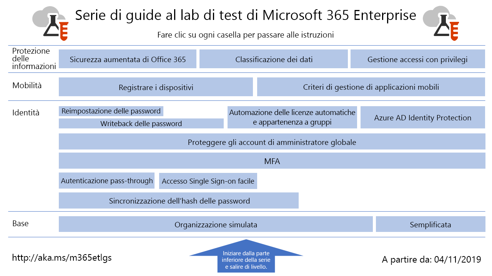

# Guide al lab di test di Microsoft 365 per le aziendeMicrosoft 365 for enterprise Test Lab Guides

*Questo articolo si applica sia a Microsoft 365 per le aziende che a Office 365 Enterprise.**This applies to both Microsoft 365 for enterprise and Office 365 Enterprise.*

Le guide al lab di test (TLG) facilitano la conoscenza dei prodotti Microsoft. Forniscono istruzioni prescrittive per configurare ambienti di testing semplificati ma rappresentativi. È possibile utilizzare questi ambienti per la dimostrazione, la personalizzazione o la creazione di modelli di verifica complessi per la durata di un abbonamento di valutazione o a pagamento.Test Lab Guides (TLGs) help you quickly learn about Microsoft products. They provide prescriptive instructions to configure simplified but representative test environments. You can use these environments for demonstration, customization, or creation of complex proofs of concept for the duration of a trial or paid subscription.

TLG sono progettate per essere modulari. Si basano su ogni altro per creare più configurazioni che corrispondano più strettamente alle esigenze di configurazione di apprendimento o di testing. Il "l'ho costruito io e funziona" hands-on Experience aiuta a capire i requisiti di distribuzione di un nuovo prodotto o scenario, in modo da poter pianificare meglio l'hosting in produzione.TLGs are designed to be modular. They build upon each other to create multiple configurations that more closely match your learning or test configuration needs. The "I built it out myself and it works" hands-on experience helps you understand the deployment requirements of a new product or scenario, so that you can better plan for hosting it in production.

È inoltre possibile utilizzare TLG per creare ambienti rappresentativi per lo sviluppo e il testing delle applicazioni, noti anche come ambienti di sviluppo/test.You can also use TLGs to create representative environments to develop and test applications, also known as dev/test environments.
  

Per una mappa visiva su tutti gli articoli della guida del laboratorio di testing di Microsoft 365 per l'organizzazione, espandere la grafica seguente o andare a [Microsoft 365 for Enterprise Test Lab guide stack](../downloads/Microsoft365EnterpriseTLGStack.pdf).For a visual map to all the articles in the Microsoft 365 for enterprise Test Lab Guide stack, expand the following graphic or go to [Microsoft 365 for enterprise Test Lab Guide Stack](../downloads/Microsoft365EnterpriseTLGStack.pdf).

## Configurazione di baseBase configuration

Per prima cosa, creare un ambiente di testing per [Microsoft 365 per Enterprise](https://docs.microsoft.com/microsoft-365-enterprise/). È possibile creare due tipi diversi di configurazioni di base:First, create a test environment for [Microsoft 365 for enterprise](https://docs.microsoft.com/microsoft-365-enterprise/). You can create two different types of base configurations:

- [Configurazione di base semplificata](lightweight-base-configuration-microsoft-365-enterprise.md) -utilizzare questa impostazione per configurare e dimostrare Microsoft 365 per le caratteristiche e le funzionalità aziendali in un ambiente solo cloud, che non include componenti locali.[Lightweight base configuration](lightweight-base-configuration-microsoft-365-enterprise.md) - Use this when you want to configure and demonstrate Microsoft 365 for enterprise features and capabilities in a cloud-only environment, which does not include any on-premises components.

- [Configurazione di base Enterprise simulata](simulated-ent-base-configuration-microsoft-365-enterprise.md) -utilizzare questa impostazione per configurare e dimostrare Microsoft 365 per le caratteristiche e le funzionalità aziendali in un ambiente cloud ibrido, che utilizza componenti locali, ad esempio un dominio di servizi di dominio Active Directory (ad DS).[Simulated enterprise base configuration](simulated-ent-base-configuration-microsoft-365-enterprise.md) - Use this when you want to configure and demonstrate Microsoft 365 for enterprise features and capabilities in a hybrid cloud environment, which uses on-premises components such as an Active Directory Domain Services (AD DS) domain.

È anche possibile creare ambienti di test per Office 365 E5 non aggiungendo la licenza di Microsoft 365 E5 all'ambiente di test di prova o di produzione.You can also create test environments for Office 365 E5 by not adding the Microsoft 365 E5 license to your trial or production test environment.
    
## IdentitàIdentity

Per verificare le funzionalità e le capacità relative alla gestione delle identità, vedere:To demonstrate identity-related features and capabilities, see:

- [Sincronizzazione hash delle passwordPassword hash synchronization](password-hash-sync-m365-ent-test-environment.md)
  
   Abilitare e testare la sincronizzazione della directory basata su hash delle password da un controller di dominio di AD DS.Enable and test password hash-based directory synchronization from an AD DS domain controller.

- [Autenticazione pass-throughPass-through authentication](pass-through-auth-m365-ent-test-environment.md)
  
   Abilitare e testare l'autenticazione pass-through per un controller di dominio di Active Directory Domain Services.Enable and test pass-through authentication to an AD DS domain controller.

- [Autenticazione federataFederated authentication](federated-identity-for-your-microsoft-365-dev-test-environment.md)
  
   Abilitare e testare l'autenticazione federata per un controller di dominio di Active Directory Domain Services.Enable and test federated authentication to an AD DS domain controller.

- [Accesso Single Sign-On facile di Azure ADAzure AD Seamless Single Sign-on](single-sign-on-m365-ent-test-environment.md)
  
   Abilitare e testare Azure AD seamless Single Sign-on (SSO senza problemi) con un controller di dominio AD DS.Enable and test Azure AD Seamless Single Sign-on (Seamless SSO) with an AD DS domain controller.

- [Autenticazione a più fattoriMulti-factor authentication](multi-factor-authentication-microsoft-365-test-environment.md)
  
   Abilitare e testare l'autenticazione a più fattori basata su smartphone per un account utente specifico.Enable and test smart phone-based multi-factor authentication for a specific user account.

- [Proteggere gli account amministratore globaleProtect global administrator accounts](protect-global-administrator-accounts-microsoft-365-test-environment.md)

   Bloccare gli account di amministratore globale con criteri di accesso condizionale.Lock down your global administrator accounts with conditional access policies.

- [Writeback delle passwordPassword writeback](password-writeback-m365-ent-test-environment.md)

   Usare il writeback delle password per modificare la password per l'account utente di Active Directory Domain Services da Azure AD.Use password writeback to change the password on your AD DS user account from Azure AD.

- [Reimpostazione delle passwordPassword reset](password-reset-m365-ent-test-environment.md)

   Utilizzare la reimpostazione della password in modalità self-service per reimpostare la password.Use self-service password reset to reset your password.

- [Licenze automatiche e appartenenza a gruppiAutomatic licensing and group membership](automate-licenses-group-membership-microsoft-365-test-environment.md)

   L'amministrazione di nuovi account è più facile che mai grazie alle licenze automatiche e all'appartenenza a gruppi dinamica.Make administering new accounts easier than ever with automatic licensing and dynamic group membership.

- [Azure AD Identity ProtectionAzure AD Identity Protection](azure-ad-identity-protection-microsoft-365-test-environment.md)

   Analizzare gli account utente correnti per individuare possibili vulnerabilità.Scan your current user accounts for vulnerabilities.

- [Accesso a identità e dispositiviIdentity and device access](identity-device-access-m365-test-environment.md)

   Creare un ambiente per testare l'identità consigliata, le configurazioni dei dispositivi di accesso e i criteri di accesso condizionali.Create an environment to test recommended identity and device access configurations and conditional access policies.

## Gestione dei dispositivi mobiliMobile device management

Per verificare le funzionalità e le capacità relative alla gestione dei dispositivi mobili, vedere:To demonstrate mobile device management-related features and capabilities, see:

- [Criteri di conformità dei dispositiviDevice compliance policies](mam-policies-for-your-microsoft-365-enterprise-dev-test-environment.md)
    
   Creare un gruppo di utenti e un criterio di conformità dispositivo per i dispositivi Windows 10.Create a user group and a device compliance policy for Windows 10 devices.
    
- [Registrazione di dispositivi iOS e AndroidEnroll iOS and Android devices](enroll-ios-and-android-devices-in-your-microsoft-enterprise-365-dev-test-environ.md)
   
   Registrare dispositivi iOS e Android e gestirli in remoto.Enroll iOS or Android devices and manage them remotely.

## Protezione delle informazioniInformation protection

Per verificare le funzionalità e le capacità relative alla gestione delle informazioni, vedere:To demonstrate information protection-related features and capabilities, see:

- [Sicurezza di Microsoft 365 aumentataIncreased Microsoft 365 security](increased-o365-security-microsoft-365-enterprise-dev-test-environment.md)
    
   Configurare le impostazioni per una sicurezza aumentata di Microsoft 365 ed esaminare gli strumenti incorporati per la sicurezza.Configure settings for increased Microsoft 365 security and investigate built-in security tools.
  
- [Classificazione dei datiData classification](data-classification-microsoft-365-enterprise-dev-test-environment.md)
    
   Configurare e applicare le etichette a un documento in un sito del team di SharePoint Online.Configure and apply labels to a document in a SharePoint Online team site.
    
- [Gestione accessi con privilegiPrivileged access management](privileged-access-microsoft-365-enterprise-dev-test-environment.md)
    
   Configurare la gestione degli accessi con privilegi per l'accesso just-in-time alle attività con privilegi e privilegi elevati nell'organizzazione.Configure privileged access management for just-in-time access to elevated and privileged tasks in your organization.
