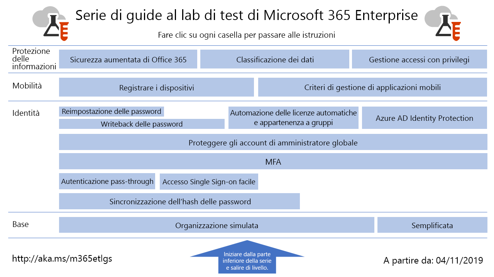

# Guide al lab di test di Microsoft 365 Enterprise

*Questo articolo si applica sia Microsoft 365 Enterprise che a Office 365 Enterprise*

Le guide al lab di test (TLG) facilitano la conoscenza dei prodotti Microsoft. Forniscono istruzioni prescrittive per configurare ambienti di testing semplificati ma rappresentativi. È possibile utilizzare questi ambienti per la dimostrazione, la personalizzazione o la creazione di modelli di verifica complessi per la durata di un abbonamento di valutazione o a pagamento. 

Le TLG sono progettate per essere modulari. Sono collegate l'una all'altra per creare diverse configurazioni che corrispondono più strettamente alle esigenze di configurazione di test o di apprendimento. L'esperienza pratica "fai da te" consente di comprendere i requisiti di implementazione di un nuovo prodotto o di un nuovo scenario, in modo da poter pianificare meglio l'hosting in produzione.

Queste guide permettono di creare anche ambienti appositi per lo sviluppo e il testing delle applicazioni, noti anche con il nome di ambienti di sviluppo/testing.
  

Fare clic [qui](media/m365-enterprise-test-lab-guides/Microsoft365EnterpriseTLGStack.pdf) per consultare una mappa di tutti gli articoli relativi alla guida al lab test di Microsoft 365 Enterprise.

## Configurazione di base

Per prima cosa è necessario creare un ambiente di testing per [Microsoft 365 Enterprise](https://docs.microsoft.com/microsoft-365-enterprise/) che includa Office 365 E5, Enterprise Mobility + Security (EMS) E5 e Windows 10 Enterprise. È possibile creare due tipi di configurazione di base diversi:

- Usare la [configurazione di base semplificata](lightweight-base-configuration-microsoft-365-enterprise.md) quando si desidera configurare e dimostrare le caratteristiche e le funzionalità di Microsoft 365 Enterprise in un ambiente solo cloud, che non include componenti locali.

- Usare la [configurazione di base simulata per l'organizzazione](simulated-ent-base-configuration-microsoft-365-enterprise.md) quando si vuole configurare e dimostrare le caratteristiche e le funzionalità di Microsoft 365 Enterprise in un ambiente cloud ibrido, che usa componenti locali come un dominio di Active Directory Domain Services.

È anche possibile creare ambienti di test per Office 365 E5 non aggiungendo la licenza di Microsoft 365 E5 all'ambiente di test di prova o di produzione.
    
## Identità

Per verificare le funzionalità e le capacità relative alla gestione delle identità, vedere:

- [Sincronizzazione hash delle password](password-hash-sync-m365-ent-test-environment.md)
  
   Abilitare e testare la sincronizzazione della directory basata su hash delle password da un controller di dominio di AD DS.

- [Autenticazione pass-through](pass-through-auth-m365-ent-test-environment.md)
  
   Abilitare e testare l'autenticazione pass-through per un controller di dominio di Active Directory Domain Services.

- [Accesso Single Sign-On facile di Azure AD](single-sign-on-m365-ent-test-environment.md)
  
   Attivare e testare l'accesso Single Sign-On facile di Azure AD con un controller di dominio di Active Directory Domain Services.

- [Autenticazione a più fattori](multi-factor-authentication-microsoft-365-test-environment.md)
  
   Abilitare e testare l'autenticazione a più fattori basata su smartphone per un account utente specifico.

- [Proteggere gli account amministratore globale](protect-global-administrator-accounts-microsoft-365-test-environment.md)
 
   Bloccare gli account di amministratore globale con criteri di accesso condizionale.

- [Writeback delle password](password-writeback-m365-ent-test-environment.md)

   Usare il writeback delle password per modificare la password per l'account utente di Active Directory Domain Services da Azure AD.

- [Reimpostazione delle password](password-reset-m365-ent-test-environment.md)

   Utilizzare la reimpostazione password self-service (SSPR) per reimpostare la password.

- [Licenze automatiche e appartenenza a gruppi](automate-licenses-group-membership-microsoft-365-test-environment.md)

   L'amministrazione di nuovi account è più facile che mai grazie alle licenze automatiche e all'appartenenza a gruppi dinamica.

- [Azure AD Identity Protection](azure-ad-identity-protection-microsoft-365-test-environment.md)

   Analizzare gli account utente correnti per individuare possibili vulnerabilità.

- [Accesso a identità e dispositivi](identity-device-access-m365-test-environment.md)

   Creare un ambiente per testare l'identità consigliata, le configurazioni dei dispositivi di accesso e i criteri di accesso condizionali.

## Gestione dei dispositivi mobili

Per verificare le funzionalità e le capacità relative alla gestione dei dispositivi mobili, vedere:

- [Criteri di conformità dei dispositivi](mam-policies-for-your-microsoft-365-enterprise-dev-test-environment.md)
    
   Creare un gruppo di utenti e un criterio di conformità dispositivo per i dispositivi Windows 10.
    
- [Registrazione di dispositivi iOS e Android](enroll-ios-and-android-devices-in-your-microsoft-enterprise-365-dev-test-environ.md)
   
   Registrare dispositivi iOS e Android e gestirli in remoto.

## Protezione delle informazioni

Per verificare le funzionalità e le capacità relative alla gestione delle informazioni, vedere:

- [Sicurezza aumentata di Office 365](increased-o365-security-microsoft-365-enterprise-dev-test-environment.md)
    
   Configurare le impostazioni per una sicurezza aumentata di Office 365 ed esaminare gli strumenti incorporati per la sicurezza.
  
- [Classificazione dei dati](data-classification-microsoft-365-enterprise-dev-test-environment.md)
    
   Configurare e applicare le etichette di Office 365 a un documento in un sito del team di SharePoint Online.
    
- [Gestione accessi con privilegi](privileged-access-microsoft-365-enterprise-dev-test-environment.md)
    
   Configurare la gestione degli accessi con privilegi per l'accesso just-in-time alle attività con privilegi e privilegi elevati nell'organizzazione di Office 365.

