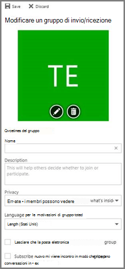
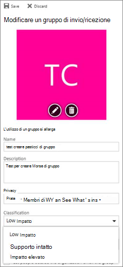

# <a name="manage-microsoft-365-groups-with-powershell"></a><span data-ttu-id="92497-103">Gestire i gruppi di Microsoft 365 con PowerShell</span><span class="sxs-lookup"><span data-stu-id="92497-103">Manage Microsoft 365 Groups with PowerShell</span></span>

<span data-ttu-id="92497-104">*Questo articolo può essere applicato sia a Microsoft 365 Enterprise che a Office 365 Enterprise.*</span><span class="sxs-lookup"><span data-stu-id="92497-104">*This article applies to both Microsoft 365 Enterprise and Office 365 Enterprise.*</span></span>

<span data-ttu-id="92497-105">In questo articolo vengono descritti i passaggi per eseguire attività di gestione comuni per i gruppi in Microsoft PowerShell.</span><span class="sxs-lookup"><span data-stu-id="92497-105">This article provides the steps for doing common management tasks for Groups in Microsoft PowerShell.</span></span> <span data-ttu-id="92497-106">Vengono inoltre elencati i cmdlet di PowerShell per i gruppi.</span><span class="sxs-lookup"><span data-stu-id="92497-106">It also lists the PowerShell cmdlets for Groups.</span></span> <span data-ttu-id="92497-107">Per informazioni sulla gestione dei siti di SharePoint, vedere [Manage SharePoint Online sites using PowerShell.](/sharepoint/manage-team-and-communication-sites-in-powershell)</span><span class="sxs-lookup"><span data-stu-id="92497-107">For info about managing SharePoint sites, see [Manage SharePoint Online sites using PowerShell](/sharepoint/manage-team-and-communication-sites-in-powershell).</span></span>

## <a name="link-to-your-microsoft-365-groups-usage-guidelines"></a><span data-ttu-id="92497-108">Collegamento alle linee guida sull'utilizzo dei gruppi di Microsoft 365</span><span class="sxs-lookup"><span data-stu-id="92497-108">Link to your Microsoft 365 Groups usage guidelines</span></span>
<span data-ttu-id="92497-109"><a name="BK_LinkToGuideLines"> </a></span><span class="sxs-lookup"><span data-stu-id="92497-109"><a name="BK_LinkToGuideLines"> </a></span></span>

<span data-ttu-id="92497-110">Quando gli [utenti creano o modificano un gruppo in Outlook,](https://support.office.com/article/04d0c9cf-6864-423c-a380-4fa858f27102.aspx)è possibile visualizzare un collegamento alle linee guida di utilizzo dell'organizzazione.</span><span class="sxs-lookup"><span data-stu-id="92497-110">When users [create or edit a group in Outlook](https://support.office.com/article/04d0c9cf-6864-423c-a380-4fa858f27102.aspx), you can show them a link to your organization's usage guidelines.</span></span> <span data-ttu-id="92497-111">Ad esempio, se è necessario aggiungere un prefisso o un suffisso specifico a un nome di gruppo.</span><span class="sxs-lookup"><span data-stu-id="92497-111">For example, if you require a specific prefix or suffix to be added to a group name.</span></span>

<span data-ttu-id="92497-112">Usare Azure Active Directory (Azure AD) PowerShell per puntare gli utenti alle linee guida di utilizzo dell'organizzazione per i gruppi di Microsoft 365.</span><span class="sxs-lookup"><span data-stu-id="92497-112">Use the Azure Active Directory (Azure AD) PowerShell to point your users to your organization's usage guidelines for Microsoft 365 groups.</span></span> <span data-ttu-id="92497-113">Consultare i [cmdlet di Azure Active Directory per](/azure/active-directory/enterprise-users/groups-settings-cmdlets) la configurazione delle impostazioni di gruppo e seguire i passaggi descritti in Creare impostazioni a livello di **directory** per definire il collegamento ipertestuale alla linea guida per l'utilizzo.</span><span class="sxs-lookup"><span data-stu-id="92497-113">Check out [Azure Active Directory cmdlets for configuring group settings](/azure/active-directory/enterprise-users/groups-settings-cmdlets) and follow the steps in the **Create settings at the directory level** to define the usage guideline hyperlink.</span></span> <span data-ttu-id="92497-114">Dopo aver eseguito il cmdlet AAD, l'utente visualizza il collegamento alle linee guida quando crea o modifica un gruppo in Outlook.</span><span class="sxs-lookup"><span data-stu-id="92497-114">Once you run the AAD cmdlet, user's will see the link to your guidelines when they create or edit a group in Outlook.</span></span>




## <a name="allow-users-to-send-as-the-microsoft-365-group"></a><span data-ttu-id="92497-117">Consenti agli utenti di inviare come gruppo di Microsoft 365</span><span class="sxs-lookup"><span data-stu-id="92497-117">Allow users to Send as the Microsoft 365 Group</span></span>
<span data-ttu-id="92497-118"><a name="BK_LinkToGuideLines"> </a></span><span class="sxs-lookup"><span data-stu-id="92497-118"><a name="BK_LinkToGuideLines"> </a></span></span>

<span data-ttu-id="92497-119">Se si desidera abilitare i gruppi di Microsoft 365 a "Invia come", utilizzare i cmdlet [Add-RecipientPermission](/powershell/module/exchange/add-recipientpermission) e [Get-RecipientPermission](/powershell/module/exchange/get-recipientpermission) per configurarlo.</span><span class="sxs-lookup"><span data-stu-id="92497-119">If you want to enable your Microsoft 365 groups to "Send As", use the [Add-RecipientPermission](/powershell/module/exchange/add-recipientpermission) and [Get-RecipientPermission](/powershell/module/exchange/get-recipientpermission) cmdlets to configure this.</span></span> <span data-ttu-id="92497-120">Dopo aver abilitato questa impostazione, gli utenti del gruppo di Microsoft 365 possono utilizzare Outlook o Outlook sul Web per inviare e rispondere alla posta elettronica come gruppo di Microsoft 365.</span><span class="sxs-lookup"><span data-stu-id="92497-120">Once you enable this setting, Microsoft 365 group users can use Outlook or Outlook on the web to send and reply to email as the Microsoft 365 group.</span></span> <span data-ttu-id="92497-121">Gli utenti possono passare al gruppo, creare un nuovo messaggio di posta elettronica e modificare il campo "Invia come" nell'indirizzo di posta elettronica del gruppo.</span><span class="sxs-lookup"><span data-stu-id="92497-121">Users can go to the group, create a new email, and change the "Send As" field to the group's email address.</span></span>

<span data-ttu-id="92497-122">È[inoltre possibile eseguire questa operazione nell'interfaccia di amministrazione di Exchange.](/office365/admin/create-groups/allow-members-to-send-as-or-send-on-behalf-of-group)</span><span class="sxs-lookup"><span data-stu-id="92497-122">([You can also do this in the Exchange Admin Center](/office365/admin/create-groups/allow-members-to-send-as-or-send-on-behalf-of-group).)</span></span>

<span data-ttu-id="92497-123">Utilizzare lo script seguente, sostituendo con l'alias del gruppo che si desidera aggiornare e con l'alias dell'utente a cui si desidera *\<GroupAlias\>* *\<UserAlias\>* concedere le autorizzazioni.</span><span class="sxs-lookup"><span data-stu-id="92497-123">Use the following script, replacing *\<GroupAlias\>* with the alias of the group that you want to update, and *\<UserAlias\>* with the alias of the user to whom you want to grant permissions.</span></span> <span data-ttu-id="92497-124">[Connettersi a PowerShell di Exchange Online](/powershell/exchange/connect-to-exchange-online-powershell) per eseguire questo script.</span><span class="sxs-lookup"><span data-stu-id="92497-124">[Connect to Exchange Online PowerShell](/powershell/exchange/connect-to-exchange-online-powershell) to run this script.</span></span>

```PowerShell
$groupAlias = "<GroupAlias>"
$userAlias = "<UserAlias>"
$groupsRecipientDetails = Get-Recipient -RecipientTypeDetails groupmailbox -Identity $groupAlias

Add-RecipientPermission -Identity $groupsRecipientDetails.Name -Trustee $userAlias -AccessRights SendAs
```

<span data-ttu-id="92497-125">Dopo l'esecuzione del cmdlet, gli utenti possono passare a Outlook o Outlook sul Web da inviare come gruppo, aggiungendo l'indirizzo di posta elettronica del gruppo al **campo Da.**</span><span class="sxs-lookup"><span data-stu-id="92497-125">Once the cmdlet is executed, users can go to Outlook or Outlook on the web to send as the group, by adding the group email address to the **From** field.</span></span>

## <a name="create-classifications-for-microsoft-365-groups-in-your-organization"></a><span data-ttu-id="92497-126">Creare classificazioni per i gruppi di Microsoft 365 nell'organizzazione</span><span class="sxs-lookup"><span data-stu-id="92497-126">Create classifications for Microsoft 365 Groups in your organization</span></span>

<span data-ttu-id="92497-127">È possibile creare etichette di riservatezza che gli utenti dell'organizzazione possono impostare quando creano un gruppo di Microsoft 365.</span><span class="sxs-lookup"><span data-stu-id="92497-127">You can create sensitivity labels that the users in your organization can set when they create a Microsoft 365 Group.</span></span> <span data-ttu-id="92497-128">Se si desidera classificare i gruppi, è consigliabile usare le etichette di riservatezza anziché la funzionalità di classificazione dei gruppi precedente.</span><span class="sxs-lookup"><span data-stu-id="92497-128">If you want to classify groups, we recommend using sensitivity labels instead of the previous groups classification feature.</span></span> <span data-ttu-id="92497-129">Per informazioni sull'utilizzo delle etichette di riservatezza, vedere [Use sensitivity labels to protect content in Microsoft Teams, Microsoft 365 groups, and SharePoint sites.](../compliance/sensitivity-labels-teams-groups-sites.md)</span><span class="sxs-lookup"><span data-stu-id="92497-129">For information about using sensitivity labels, see [Use sensitivity labels to protect content in Microsoft Teams, Microsoft 365 groups, and SharePoint sites](../compliance/sensitivity-labels-teams-groups-sites.md).</span></span>

> [!IMPORTANT]
> <span data-ttu-id="92497-130">Se attualmente si utilizzano etichette di classificazione, non saranno più disponibili per gli utenti che creano gruppi dopo aver abilitato le etichette di riservatezza.</span><span class="sxs-lookup"><span data-stu-id="92497-130">If you are currently using classification labels, they will no longer be available to users who create groups once sensitivity labels are enabled.</span></span>

<span data-ttu-id="92497-131">È comunque possibile utilizzare la funzionalità di classificazione dei gruppi precedente.</span><span class="sxs-lookup"><span data-stu-id="92497-131">You can still use the previous groups classification feature.</span></span> <span data-ttu-id="92497-132">È possibile creare classificazioni che gli utenti dell'organizzazione possono impostare quando creano un gruppo di Microsoft 365.</span><span class="sxs-lookup"><span data-stu-id="92497-132">You can create classifications that the users in your organization can set when they create an Microsoft 365 Group.</span></span> <span data-ttu-id="92497-133">Ad esempio, è possibile consentire agli utenti di impostare "Standard", "Secret" e "Top Secret" nei gruppi che creano.</span><span class="sxs-lookup"><span data-stu-id="92497-133">For example, you can allow users to set "Standard", "Secret", and "Top Secret" on groups they create.</span></span> <span data-ttu-id="92497-134">Le classificazioni di gruppo non sono impostate per impostazione predefinita ed è necessario crearla per consentire agli utenti di impostarla.</span><span class="sxs-lookup"><span data-stu-id="92497-134">Group classifications aren't set by default and you need to create it in order for your users to set it.</span></span> <span data-ttu-id="92497-135">Usare Azure Active Directory PowerShell per puntare gli utenti alle linee guida di utilizzo dell'organizzazione per i gruppi di Microsoft 365.</span><span class="sxs-lookup"><span data-stu-id="92497-135">Use Azure Active Directory PowerShell to point your users to your organization's usage guidelines for Microsoft 365 Groups.</span></span>

<span data-ttu-id="92497-136">Consultare i [cmdlet di Azure Active Directory](/azure/active-directory/users-groups-roles/groups-settings-cmdlets) per configurare le impostazioni dei gruppi e seguire i passaggi descritti in Creare impostazioni a livello di **directory** per definire la classificazione per i gruppi di Microsoft 365.</span><span class="sxs-lookup"><span data-stu-id="92497-136">Check out [Azure Active Directory cmdlets for configuring group settings](/azure/active-directory/users-groups-roles/groups-settings-cmdlets) and follow the steps in the **Create settings at the directory level** to define the classification for Microsoft 365 Groups.</span></span>

```powershell
$setting["ClassificationList"] = "Low Impact, Medium Impact, High Impact"
```

<span data-ttu-id="92497-137">Per associare una descrizione a ogni classificazione, è possibile utilizzare l'attributo delle impostazioni  *ClassificationDescriptions* per definire.</span><span class="sxs-lookup"><span data-stu-id="92497-137">In order to associate a description to each classification you can use the settings attribute  *ClassificationDescriptions* to define.</span></span>

```powershell
$setting["ClassificationDescriptions"] ="Classification:Description,Classification:Description"
```

<span data-ttu-id="92497-138">dove Classification corrisponde alle stringhe in ClassificationList.</span><span class="sxs-lookup"><span data-stu-id="92497-138">where Classification matches the strings in the ClassificationList.</span></span>

<span data-ttu-id="92497-139">Esempio:</span><span class="sxs-lookup"><span data-stu-id="92497-139">Example:</span></span>

```powershell
$setting["ClassificationDescriptions"] = "Low Impact: General communication, Medium Impact: Company internal data , High Impact: Data that has regulatory requirements"
```

<span data-ttu-id="92497-140">Dopo aver eseguito il cmdlet di Azure Active Directory precedente per impostare la classificazione, eseguire il cmdlet [Set-UnifiedGroup](/powershell/module/exchange/Set-UnifiedGroup) se si desidera impostare la classificazione per un gruppo specifico.</span><span class="sxs-lookup"><span data-stu-id="92497-140">After you run the above Azure Active Directory cmdlet to set your classification, run the [Set-UnifiedGroup](/powershell/module/exchange/Set-UnifiedGroup) cmdlet if you want to set the classification for a specific group.</span></span>

```powershell
Set-UnifiedGroup <LowImpactGroup@constoso.com> -Classification <LowImpact>
```

<span data-ttu-id="92497-141">Oppure crea un nuovo gruppo con una classificazione.</span><span class="sxs-lookup"><span data-stu-id="92497-141">Or create a new group with a classification.</span></span>

```powershell
New-UnifiedGroup <HighImpactGroup@constoso.com> -Classification <HighImpact> -AccessType <Public>
```

<span data-ttu-id="92497-142">Per altri dettagli sull'uso di PowerShell di Exchange Online vedere [Uso di PowerShell con Exchange Online](/powershell/exchange/exchange-online-powershell) e [Connettersi a PowerShell di Exchange Online](/powershell/exchange/connect-to-exchange-online-powershell).</span><span class="sxs-lookup"><span data-stu-id="92497-142">Check out [Using PowerShell with Exchange Online](/powershell/exchange/exchange-online-powershell) and [Connect to Exchange Online PowerShell](/powershell/exchange/connect-to-exchange-online-powershell) for more details on using Exchange Online PowerShell.</span></span>

<span data-ttu-id="92497-143">Dopo aver abilitato queste impostazioni, il proprietario del gruppo potrà scegliere una classificazione dal menu a discesa in Outlook sul Web e Outlook e salvarla dalla pagina **Modifica** gruppo.</span><span class="sxs-lookup"><span data-stu-id="92497-143">Once these settings are enabled, the group owner will be able to choose a classification from the drop down menu in Outlook on the Web and Outlook, and save it from the **Edit** group page.</span></span>



## <a name="hide-microsoft-365-groups-from-the-global-address-list"></a><span data-ttu-id="92497-145">Nascondere i gruppi di Microsoft 365 nell'elenco indirizzi globale.</span><span class="sxs-lookup"><span data-stu-id="92497-145">Hide Microsoft 365 Groups from the global address list.</span></span>
<span data-ttu-id="92497-146"><a name="BKMK_CreateClassification"> </a></span><span class="sxs-lookup"><span data-stu-id="92497-146"><a name="BKMK_CreateClassification"> </a></span></span>

<span data-ttu-id="92497-147">È possibile specificare se un gruppo di Microsoft 365 viene visualizzato nell'elenco indirizzi globale (GAL) e in altri elenchi dell'organizzazione.</span><span class="sxs-lookup"><span data-stu-id="92497-147">You can specify whether a Microsoft 365 Group appears in the global address list (GAL) and other lists in your organization.</span></span> <span data-ttu-id="92497-148">Ad esempio, se si dispone di un gruppo di reparti legali che non si desidera visualizzare nell'elenco indirizzi, è possibile impedire che tale gruppo venga visualizzato nell'elenco indirizzi globale.</span><span class="sxs-lookup"><span data-stu-id="92497-148">For example, if you have a legal department group that you don't want to show up in the address list, you can stop that group from appearing in the GAL.</span></span> <span data-ttu-id="92497-149">Eseguire il cmdlet Set-Unified Group per nascondere il gruppo dall'elenco di indirizzi in questo modo:</span><span class="sxs-lookup"><span data-stu-id="92497-149">Run the Set-Unified Group cmdlet to hide the group from the address list like this:</span></span>

```powershell
Set-UnifiedGroup -Identity "Legal Department" -HiddenFromAddressListsEnabled $true
```

## <a name="allow-only-internal-users-to-send-message-to-microsoft-365-groups"></a><span data-ttu-id="92497-150">Consenti solo agli utenti interni di inviare messaggi ai gruppi di Microsoft 365</span><span class="sxs-lookup"><span data-stu-id="92497-150">Allow only internal users to send message to Microsoft 365 Groups</span></span>
<span data-ttu-id="92497-151"><a name="BKMK_CreateClassification"> </a></span><span class="sxs-lookup"><span data-stu-id="92497-151"><a name="BKMK_CreateClassification"> </a></span></span>

<span data-ttu-id="92497-152">Se non si desidera che gli utenti di altre organizzazioni inviino messaggi di posta elettronica a un gruppo di Microsoft 365, è possibile modificare le impostazioni per tale gruppo.</span><span class="sxs-lookup"><span data-stu-id="92497-152">If you don't want users from other organizations to send emails to a Microsoft 365 Group, you can change the settings for that group.</span></span> <span data-ttu-id="92497-153">Consentirà solo agli utenti interni di inviare un messaggio di posta elettronica al gruppo.</span><span class="sxs-lookup"><span data-stu-id="92497-153">It will allow only internal users to send an email to your group.</span></span> <span data-ttu-id="92497-154">Se un utente esterno tenta di inviare un messaggio a tale gruppo, verrà rifiutato.</span><span class="sxs-lookup"><span data-stu-id="92497-154">If an external user tries to send a message to that group, it will be rejected.</span></span>

<span data-ttu-id="92497-155">Eseguire il cmdlet Set-UnifiedGroup per aggiornare questa impostazione, in questo modo:</span><span class="sxs-lookup"><span data-stu-id="92497-155">Run the Set-UnifiedGroup cmdlet to update this setting, like this:</span></span>

```powershell
Set-UnifiedGroup -Identity "Internal senders only" -RequireSenderAuthenticationEnabled $true
```

## <a name="add-mailtips-to-microsoft-365-groups"></a><span data-ttu-id="92497-156">Aggiungere suggerimenti messaggio ai gruppi di Microsoft 365</span><span class="sxs-lookup"><span data-stu-id="92497-156">Add MailTips to Microsoft 365 Groups</span></span>
<span data-ttu-id="92497-157"><a name="BKMK_CreateClassification"> </a></span><span class="sxs-lookup"><span data-stu-id="92497-157"><a name="BKMK_CreateClassification"> </a></span></span>

<span data-ttu-id="92497-158">Ogni volta che un mittente tenta di inviare un messaggio di posta elettronica a un gruppo di Microsoft 365, è possibile visualizzare un avviso messaggio.</span><span class="sxs-lookup"><span data-stu-id="92497-158">Whenever a sender tries to send an email to a Microsoft 365 Group, a MailTip can be shown to them.</span></span>

<span data-ttu-id="92497-159">Eseguire il cmdlet Set-Unified Group per aggiungere un avviso messaggio al gruppo:</span><span class="sxs-lookup"><span data-stu-id="92497-159">Run the Set-Unified Group cmdlet to add a mailTip to the group:</span></span>

```powershell
Set-UnifiedGroup -Identity "MailTip Group" -MailTip "This group has a MailTip"
```

<span data-ttu-id="92497-160">Insieme a Suggerimento messaggio, è anche possibile impostare MailTipTranslations, che specifica lingue aggiuntive per l'avviso messaggio.</span><span class="sxs-lookup"><span data-stu-id="92497-160">Along with MailTip, you can also set MailTipTranslations, which specifies additional languages for the MailTip.</span></span> <span data-ttu-id="92497-161">Si supponga di voler disporre della traduzione in spagnolo, quindi eseguire il comando seguente:</span><span class="sxs-lookup"><span data-stu-id="92497-161">Suppose you want to have the Spanish translation, then run the following command:</span></span>

```powershell
Set-UnifiedGroup -Identity "MailaTip Group" -MailTip "This group has a MailTip" -MailTipTranslations "@{Add="ES:Esta caja no se supervisa."
```

## <a name="change-the-display-name-of-the-microsoft-365-group"></a><span data-ttu-id="92497-162">Modificare il nome visualizzato del gruppo di Microsoft 365</span><span class="sxs-lookup"><span data-stu-id="92497-162">Change the display name of the Microsoft 365 Group</span></span>

<span data-ttu-id="92497-163">Il nome visualizzato specifica il nome del gruppo di Microsoft 365.</span><span class="sxs-lookup"><span data-stu-id="92497-163">The display name specifies the name of the Microsoft 365 Group.</span></span> <span data-ttu-id="92497-164">È possibile visualizzare questo nome nell'interfaccia di amministrazione di Exchange o nell'interfaccia di amministrazione di Microsoft 365.</span><span class="sxs-lookup"><span data-stu-id="92497-164">You can see this name in your exchange admin center or Microsoft 365 admin center.</span></span> <span data-ttu-id="92497-165">È possibile modificare il nome visualizzato del gruppo o assegnare un nome visualizzato a un gruppo di Microsoft 365 esistente eseguendo il comando Set-UnifiedGroup:</span><span class="sxs-lookup"><span data-stu-id="92497-165">You can edit the display name of the group or assign a display name to an existing Microsoft 365 Group by running the Set-UnifiedGroup command:</span></span>

```powershell
Set-UnifiedGroup -Identity "mygroup@contoso.com" -DisplayName "My new group"
```

## <a name="change-the-default-setting-of-microsoft-365-groups-for-outlook-to-public-or-private"></a><span data-ttu-id="92497-166">Modificare l'impostazione predefinita dei gruppi di Microsoft 365 per Outlook in Pubblico o Privato</span><span class="sxs-lookup"><span data-stu-id="92497-166">Change the default setting of Microsoft 365 Groups for Outlook to Public or Private</span></span>
<span data-ttu-id="92497-167"><a name="BKMK_CreateClassification"> </a></span><span class="sxs-lookup"><span data-stu-id="92497-167"><a name="BKMK_CreateClassification"> </a></span></span>

<span data-ttu-id="92497-168">I gruppi di Microsoft 365 in Outlook vengono creati come privati per impostazione predefinita.</span><span class="sxs-lookup"><span data-stu-id="92497-168">Microsoft 365 Groups in Outlook are created as Private by default.</span></span> <span data-ttu-id="92497-169">Se l'organizzazione desidera che i gruppi di Microsoft 365 siano creati come pubblici per impostazione predefinita (o tornare a Private), utilizzare la sintassi del cmdlet PowerShell seguente:</span><span class="sxs-lookup"><span data-stu-id="92497-169">If your organization wants Microsoft 365 Groups to be created as Public by default (or back to Private), use this PowerShell cmdlet syntax:</span></span>

 `Set-OrganizationConfig -DefaultGroupAccessType Public`

<span data-ttu-id="92497-170">Per impostare private:</span><span class="sxs-lookup"><span data-stu-id="92497-170">To set to Private:</span></span>

 `Set-OrganizationConfig -DefaultGroupAccessType Private`

<span data-ttu-id="92497-171">Per verificare l'impostazione:</span><span class="sxs-lookup"><span data-stu-id="92497-171">To verify the setting:</span></span>

 `Get-OrganizationConfig | ft DefaultGroupAccessType`

<span data-ttu-id="92497-172">Per ulteriori informazioni, vedere [Set-OrganizationConfig](/powershell/module/exchange/set-organizationconfig) e [Get-OrganizationConfig.](/powershell/module/exchange/get-organizationconfig)</span><span class="sxs-lookup"><span data-stu-id="92497-172">To learn more, see [Set-OrganizationConfig](/powershell/module/exchange/set-organizationconfig) and [Get-OrganizationConfig](/powershell/module/exchange/get-organizationconfig).</span></span>

## <a name="microsoft-365-groups-cmdlets"></a><span data-ttu-id="92497-173">Cmdlet per i gruppi di Microsoft 365</span><span class="sxs-lookup"><span data-stu-id="92497-173">Microsoft 365 Groups cmdlets</span></span>

<span data-ttu-id="92497-174">I cmdlet seguenti possono essere utilizzati con i gruppi di Microsoft 365.</span><span class="sxs-lookup"><span data-stu-id="92497-174">The following cmdlets can be used with Microsoft 365 Groups.</span></span>

|<span data-ttu-id="92497-175">**Nome cmdlet**</span><span class="sxs-lookup"><span data-stu-id="92497-175">**Cmdlet name**</span></span>|<span data-ttu-id="92497-176">**Descrizione**</span><span class="sxs-lookup"><span data-stu-id="92497-176">**Description**</span></span>|
|:-----|:-----|
|[<span data-ttu-id="92497-177">Get-UnifiedGroup</span><span class="sxs-lookup"><span data-stu-id="92497-177">Get-UnifiedGroup</span></span>](/powershell/module/exchange/get-unifiedgroup) <br/> |<span data-ttu-id="92497-178">Utilizzare questo cmdlet per cercare i gruppi di Microsoft 365 esistenti e per visualizzare le proprietà dell'oggetto gruppo</span><span class="sxs-lookup"><span data-stu-id="92497-178">Use this cmdlet to look up existing Microsoft 365 Groups, and to view properties of the group object</span></span>  <br/> |
|[<span data-ttu-id="92497-179">Set-UnifiedGroup</span><span class="sxs-lookup"><span data-stu-id="92497-179">Set-UnifiedGroup</span></span>](/powershell/module/exchange/set-unifiedgroup) <br/> |<span data-ttu-id="92497-180">Aggiornare le proprietà di uno specifico gruppo di Microsoft 365</span><span class="sxs-lookup"><span data-stu-id="92497-180">Update the properties of a specific Microsoft 365 Group</span></span>  <br/> |
|[<span data-ttu-id="92497-181">New-UnifiedGroup</span><span class="sxs-lookup"><span data-stu-id="92497-181">New-UnifiedGroup</span></span>](/powershell/module/exchange/new-unifiedgroup) <br/> |<span data-ttu-id="92497-182">Creare un nuovo gruppo di Microsoft 365.</span><span class="sxs-lookup"><span data-stu-id="92497-182">Create a new Microsoft 365 Group.</span></span> <span data-ttu-id="92497-183">Questo cmdlet fornisce un set minimo di parametri.</span><span class="sxs-lookup"><span data-stu-id="92497-183">This cmdlet provides a minimal set of parameters.</span></span> <span data-ttu-id="92497-184">Per impostare i valori per le proprietà estese, utilizzare Set-UnifiedGroup dopo aver creato il nuovo gruppo</span><span class="sxs-lookup"><span data-stu-id="92497-184">To set values for extended properties, use Set-UnifiedGroup after creating the new group</span></span>  <br/> |
|[<span data-ttu-id="92497-185">Remove-UnifiedGroup</span><span class="sxs-lookup"><span data-stu-id="92497-185">Remove-UnifiedGroup</span></span>](/powershell/module/exchange/remove-unifiedgroup) <br/> |<span data-ttu-id="92497-186">Eliminare un gruppo di Microsoft 365 esistente</span><span class="sxs-lookup"><span data-stu-id="92497-186">Delete an existing Microsoft 365 Group</span></span>  <br/> |
|[<span data-ttu-id="92497-187">Get-UnifiedGroupLinks</span><span class="sxs-lookup"><span data-stu-id="92497-187">Get-UnifiedGroupLinks</span></span>](/powershell/module/exchange/get-unifiedgrouplinks) <br/> |<span data-ttu-id="92497-188">Recuperare le informazioni sull'appartenenza e sul proprietario per un gruppo di Microsoft 365</span><span class="sxs-lookup"><span data-stu-id="92497-188">Retrieve membership and owner information for a Microsoft 365 Group</span></span>  <br/> |
|[<span data-ttu-id="92497-189">Add-UnifiedGroupLinks</span><span class="sxs-lookup"><span data-stu-id="92497-189">Add-UnifiedGroupLinks</span></span>](/powershell/module/exchange/add-unifiedgrouplinks) <br/> |<span data-ttu-id="92497-190">Aggiungere membri, proprietari e sottoscrittori a un gruppo di Microsoft 365 esistente</span><span class="sxs-lookup"><span data-stu-id="92497-190">Add members, owners, and subscribers to an existing Microsoft 365 Group</span></span> <br/> |
|[<span data-ttu-id="92497-191">Remove-UnifiedGroupLinks</span><span class="sxs-lookup"><span data-stu-id="92497-191">Remove-UnifiedGroupLinks</span></span>](/powershell/module/exchange/remove-unifiedgrouplinks) <br/> |<span data-ttu-id="92497-192">Rimuovere proprietari e membri da un gruppo di Microsoft 365 esistente</span><span class="sxs-lookup"><span data-stu-id="92497-192">Remove owners and members from an existing Microsoft 365 Group</span></span>  <br/> |
|[<span data-ttu-id="92497-193">Get-UserPhoto</span><span class="sxs-lookup"><span data-stu-id="92497-193">Get-UserPhoto</span></span>](/powershell/module/exchange/get-userphoto) <br/> |<span data-ttu-id="92497-194">Usato per visualizzare le informazioni sulla foto dell'utente associata a un account.</span><span class="sxs-lookup"><span data-stu-id="92497-194">Used to view information about the user photo associated with an account.</span></span> <span data-ttu-id="92497-195">Le foto degli utenti sono archiviate in Active Directory</span><span class="sxs-lookup"><span data-stu-id="92497-195">User photos are stored in Active Directory</span></span>  <br/> |
|[<span data-ttu-id="92497-196">Set-UserPhoto</span><span class="sxs-lookup"><span data-stu-id="92497-196">Set-UserPhoto</span></span>](/powershell/module/exchange/set-userphoto) <br/> |<span data-ttu-id="92497-197">Usato per associare una foto utente a un account.</span><span class="sxs-lookup"><span data-stu-id="92497-197">Used to associate a user photo with an account.</span></span> <span data-ttu-id="92497-198">Le foto degli utenti sono archiviate in Active Directory</span><span class="sxs-lookup"><span data-stu-id="92497-198">User photos are stored in Active Directory</span></span>  <br/> |
|[<span data-ttu-id="92497-199">Remove-UserPhoto</span><span class="sxs-lookup"><span data-stu-id="92497-199">Remove-UserPhoto</span></span>](/powershell/module/exchange/remove-userphoto) <br/> |<span data-ttu-id="92497-200">Rimuovere la foto per un gruppo di Microsoft 365</span><span class="sxs-lookup"><span data-stu-id="92497-200">Remove the photo for an Microsoft 365 Group</span></span>  <br/> |

## <a name="related-topics"></a><span data-ttu-id="92497-201">Argomenti correlati</span><span class="sxs-lookup"><span data-stu-id="92497-201">Related topics</span></span>

[<span data-ttu-id="92497-202">Aggiornare le liste di distribuzione ai gruppi di Microsoft 365</span><span class="sxs-lookup"><span data-stu-id="92497-202">Upgrade distribution lists to Microsoft 365 Groups</span></span>](/office365/admin/manage/upgrade-distribution-lists)

[<span data-ttu-id="92497-203">Gestire chi può creare gruppi in Microsoft 365</span><span class="sxs-lookup"><span data-stu-id="92497-203">Manage who can create Microsoft 365 Groups</span></span>](/office365/admin/create-groups/manage-creation-of-groups)

[<span data-ttu-id="92497-204">Gestire l'accesso guest ai gruppi di Microsoft 365</span><span class="sxs-lookup"><span data-stu-id="92497-204">Manage guest access to Microsoft 365 Groups</span></span>](https://support.office.com/article/bfc7a840-868f-4fd6-a390-f347bf51aff6)

[<span data-ttu-id="92497-205">Modificare l'appartenenza a un gruppo statico in dinamico</span><span class="sxs-lookup"><span data-stu-id="92497-205">Change static group membership to dynamic in</span></span>](/azure/active-directory/users-groups-roles/groups-change-type)