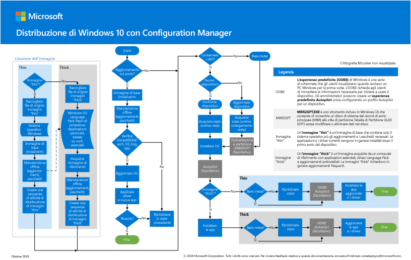
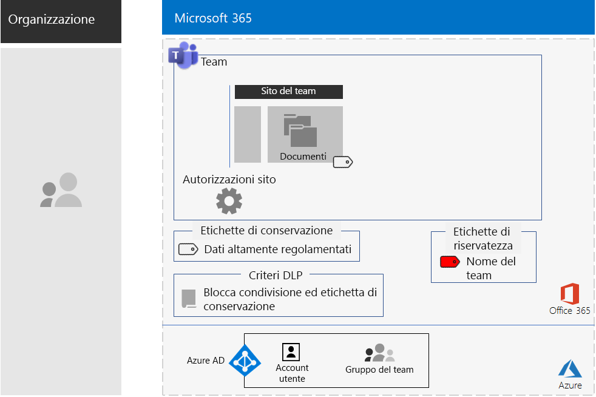
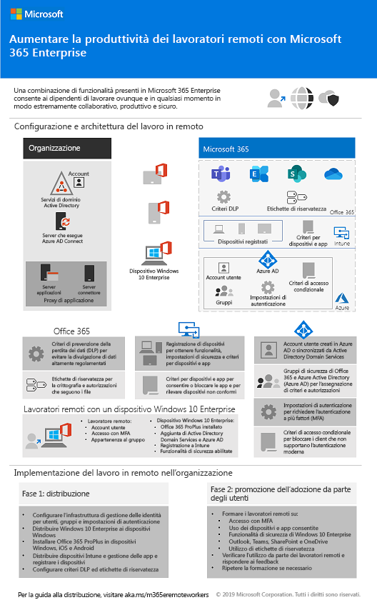
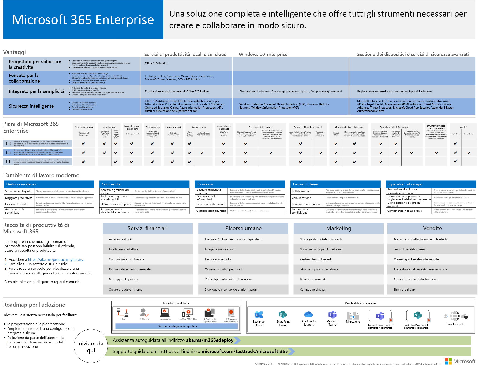
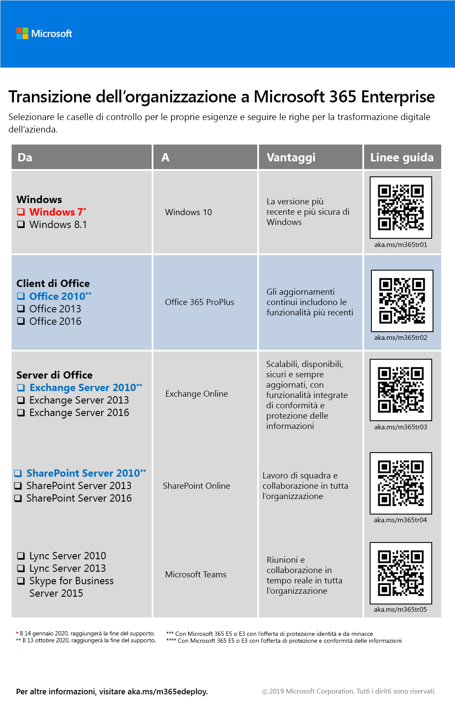
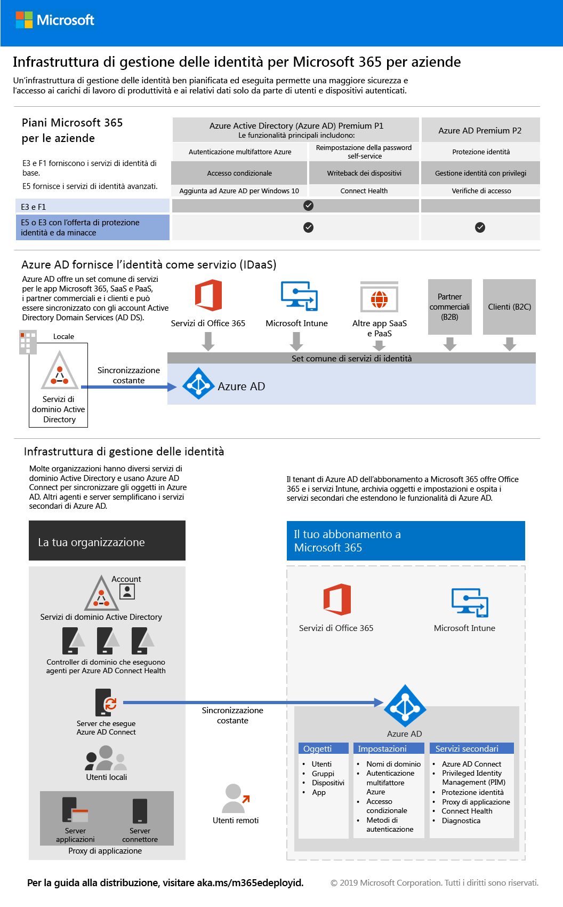
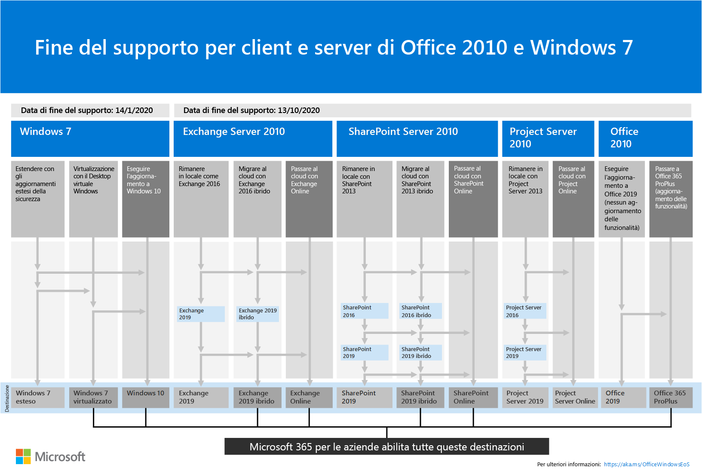
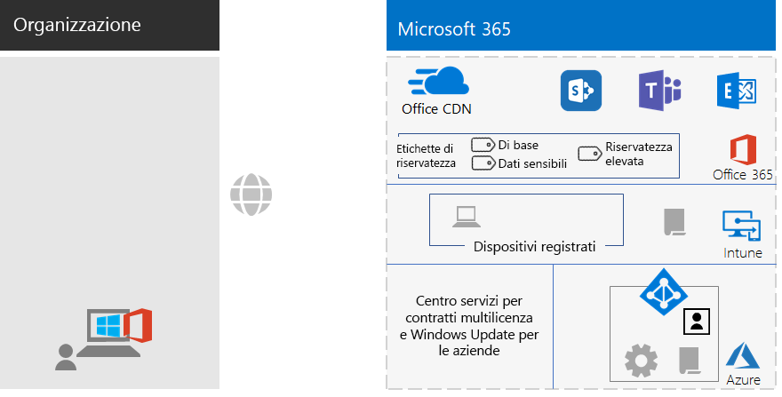

# Modifiche al contenuto sulla distribuzione di Microsoft 365 Enterprise

## Ottobre 2019

### Nuovo contenuto 

- [Distribuzione di Windows 10 con il poster di Autopilot](windows10-deploy-autopilot.md) 

  

  È anche possibile scaricare il poster in formato[PDF](https://github.com/MicrosoftDocs/windows-itpro-docs/raw/public/windows/deployment/media/Windows10AutopilotFlowchart.pdf) o [Visio](https://github.com/MicrosoftDocs/windows-itpro-docs/raw/public/windows/deployment/media/Windows10Autopilotflowchart.vsdx).

- [Distribuzione di Windows 10 con il poster di System Center Configuration Manager](windows10-deploy-inplaceupgrade.md)

  

  È anche possibile scaricare il poster in formato[PDF](https://github.com/MicrosoftDocs/windows-itpro-docs/raw/public/windows/deployment/media/Windows10DeploymentConfigManager.pdf) o [Visio](https://github.com/MicrosoftDocs/windows-itpro-docs/raw/public/windows/deployment/media/Windows10DeploymentConfigManager.vsdx).

- [Scenario Teams per dati altamente regolamentati](secure-teams-highly-regulated-data-scenario.md)

  

  Annunci: [Blog della community tecnica di Microsoft 365](https://techcommunity.microsoft.com/t5/Microsoft-365-Blog/Protect-your-highly-regulated-files-in-Teams-with-Microsoft-365/ba-p/962985)  |  [LinkedIn](https://www.linkedin.com/pulse/how-can-i-lock-down-team-sensitive-top-secret-joe-davies/?published=t)

- [Poster Supportare i lavoratori remoti](empower-people-to-work-remotely.md#poster)

   
 

### Aggiornamenti e miglioramenti

- Aggiornamento di [Fase 4: Office 365 ProPlus](office365proplus-infrastructure.md)
- Aggiornamento del [Case study di Contoso](contoso-case-study.md)
- Aggiornamento dei carichi di lavoro di [Microsoft Teams](teams-workload.md), [Exchange Online](exchangeonline-workload.md) e [SharePoint Online](sharepoint-online-onedrive-workload.md).
- Aggiornamento dello scenario [Siti di SharePoint per dati altamente regolamentati](teams-sharepoint-online-sites-highly-regulated-data.md)
 
  

- [Poster di Microsoft 365 Enterprise](microsoft-365-overview.md#get-the-big-picture) per nuovi scenari 

  

## Settembre 2019

### Nuovo contenuto 

- [Scenario relativo ai lavoratori remoti](empower-people-to-work-remotely.md)

   
 
  Annunci: [Blog della community tecnica di Microsoft 365](https://techcommunity.microsoft.com/t5/Microsoft-365-Blog/Empower-your-remote-workers-with-Microsoft-365-Enterprise/ba-p/935196#M236)  |  [LinkedIn](https://www.linkedin.com/pulse/how-do-i-configure-microsoft-365-enterprise-empower-my-joe-davies/)

- [Passaggio di crittografia della posta elettronica](infoprotect-email-encryption.md) per [Fase 6: protezione delle informazioni](infoprotect-infrastructure.md)

### Aggiornamenti e miglioramenti

- Riorganizzazione e aggiornamento di [Fase 2: identità](identity-infrastructure.md)
- Aggiornamento di [Fase 1: rete](networking-infrastructure.md) e [Fase 6: protezione delle informazioni](infoprotect-infrastructure.md)

## Agosto 2019

### Nuovo contenuto 

- [Poster della transizione dell'organizzazione a Microsoft 365 Enterprise](migration-microsoft-365-enterprise-workload.md#transition-your-entire-organization)

   
 
- [Poster dell'infrastruttura di gestione delle identità per Microsoft 365 Enterprise](identity-infrastructure.md)

  

  Annunci: [Blog della community tecnica di Microsoft 365](https://techcommunity.microsoft.com/t5/Microsoft-365-Blog/Get-the-new-Identity-infrastructure-for-Microsoft-365-Enterprise/ba-p/874941)  |  [LinkedIn](https://www.linkedin.com/pulse/how-can-i-quickly-ramp-up-key-concepts-features-identity-joe-davies/?published=t)

- [Poster della fine del supporto di Windows 7 e Office 10](migration-microsoft-365-enterprise-workload.md#summary-of-options-for-office-2010-clients-and-servers-and-windows-7)
  
  

  Annunci: [Blog della community tecnica di Microsoft 365](https://techcommunity.microsoft.com/t5/Microsoft-365-Blog/Move-from-Office-2010-clients-and-servers-and-Windows-7-to/ba-p/846994)  |  [LinkedIn](https://www.linkedin.com/pulse/how-can-microsoft-365-enterprise-help-me-end-support-products-davies/)

### Aggiornamenti e miglioramenti

- [Poster di Microsoft 365 Enterprise](microsoft-365-overview.md#get-the-big-picture) per nuovi scenari di produttività

   

## Luglio 2019

### Nuovo contenuto

- Cartella di lavoro di Excel per l'[articolo su Microsoft 365 Enterprise per organizzazioni non aziendali](deploy-foundation-infrastructure-non-enterprises.md#onboarding)

## Maggio 2019

### Nuovo contenuto

- [Poster dell'infrastruttura di base](deploy-foundation-infrastructure.md#at-a-glance)

  

  Annunci: [LinkedIn](https://www.linkedin.com/pulse/how-can-i-get-big-picture-microsoft-365-enterprise-joe-davies/)

 
- [Articolo su Microsoft 365 Enterprise per organizzazioni non aziendali](deploy-foundation-infrastructure-non-enterprises.md)

  

  Annunci: [Blog della community tecnica di Microsoft 365](https://techcommunity.microsoft.com/t5/Microsoft-365-Blog/Deploy-Microsoft-365-Enterprise-infrastructure-even-if-you-re/ba-p/900012)  |  [LinkedIn](https://www.linkedin.com/pulse/how-do-i-deploy-microsoft-365-enterprise-without-joe-davies/)

## Aprile 2019

### Nuovo contenuto 

- Guide dei laboratori di testing [Identità e accesso dei dispositivi](identity-device-access-m365-test-environment.md) prerequisito
- Passaggi [Windows Information Protection](infoprotect-deploy-windows-information-protection.md) e [Prevenzione della perdita dei dati di Office 365](infoprotect-data-loss-prevention.md) per [Fase 6: protezione delle informazioni](infoprotect-infrastructure.md)

## Vedere anche

[Guida all'implementazione](deploy-microsoft-365-enterprise.md)
