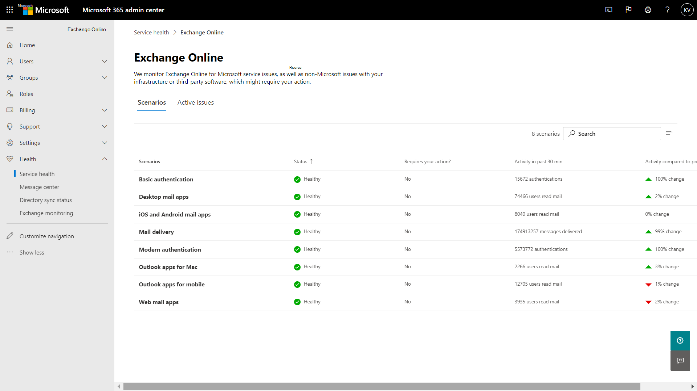
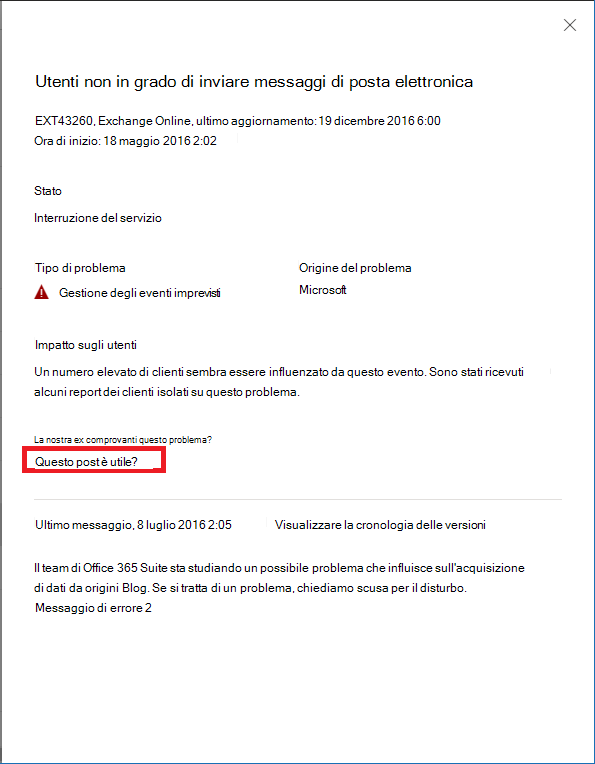

# Monitoraggio di Exchange Online per Microsoft 365

È possibile usare il monitoraggio di Exchange Online nell'interfaccia di amministrazione di Microsoft 365 per monitorare l'integrità del servizio Exchange per l'abbonamento a Microsoft 365 dell'organizzazione. Il monitoraggio di Exchange Online fornisce informazioni sugli incidenti e avvisi raccolti nelle categorie seguenti:

- **Infrastruttura**: il problema viene rilevato nell'infrastruttura Microsoft 365 di proprietà di Microsoft, usata per fornire aggiornamenti regolari e risolvere i problemi. Ad esempio, gli utenti non possono accedere a Exchange Online a causa di problemi di Exchange o di un'altra infrastruttura cloud di Microsoft 365.
- **Infrastruttura di terze parti**: il problema è rilevato nell'infrastruttura di terze parti da cui l'organizzazione dipende e per risolverlo occorre l'intervento dell'organizzazione. Ad esempio, le transazioni di autenticazione degli utenti vengono limitate da un provider del servizio token di sicurezza (STS) di terze parti, che impedisce agli utenti di connettersi a Exchange Online.
- **Infrastruttura clienti**: il problema è rilevato nell'infrastruttura dell'organizzazione, che deve intervenire per risolverlo. Ad esempio, gli utenti non possono accedere a Exchange Online perché non riescono a ottenere un token di autenticazione dal provider STS ospitato dall'organizzazione a causa di un certificato scaduto.

Ecco un esempio della pagina **Integrità dei servizi** nell'interfaccia di amministrazione di Microsoft 365, accessibile da **Integrità > Integrità dei servizi**.

Il valore della colonna **Stato** indica se il servizio è integro oppure presenta incidenti o avvisi basati sui servizi cloud gestiti da Microsoft. 

Il valore della colonna **Problemi dell'organizzazione e di terza parte** indica che l'infrastruttura dell'organizzazione o un software di terze parti influisce sull'esperienza degli utenti rispetto all'integrità dei servizi di Exchange Online. Per la risoluzione degli avvisi o degli incidenti è necessario l'intervento *dell'amministratore*.

Ecco un esempio della pagina di monitoraggio di **Exchange Online** nell'interfaccia di amministrazione di Microsoft 365, accessibile da **Integrità > Exchange Online**.

Nella pagina di monitoraggio di **Exchange Online** è possibile verificare l’integrità del servizio Exchange Online e se sono presenti incidenti o avvisi associati. Con il monitoraggio di Exchange Online, è possibile esaminare l'integrità del servizio per specifici scenari di posta elettronica e visualizzare segnali in tempo quasi reale per determinare l'impatto in base allo scenario. 

## Requisiti

Questa anteprima è abilitata per i clienti che soddisfano i requisiti seguenti: 

- L'organizzazione deve avere almeno 5.000 licenze per uno o una combinazione dei prodotti seguenti: Office 365 E3, Microsoft 365 E3, Office 365 E5, Microsoft 365 E5. 

  Ad esempio, l'organizzazione può avere 3.000 licenze di Office 365 E3 e 2.500 Microsoft 365 E5, per un totale di 5.500 licenze dei prodotti idonei.

- L’organizzazione deve avere almeno 50 utenti Exchange Online attivi al mese

Con il monitoraggio di Exchange Online è possibile visualizzare lo stato di integrità dei client di posta elettronica seguenti, in base alle attività di lettura della posta elettronica:

- Outlook Desktop
- Outlook sul Web
- Client di posta elettronica nativi di iOS e Android 
- App Outlook Mobile per iOS e Android 
- Client Outlook per Mac

Per questi client è possibile visualizzare il numero di utenti attivi negli ultimi 30 minuti, in base agli utenti che leggono un messaggio di posta elettronica, oltre al numero di incidenti e avvisi nel dashboard. Questi dati vengono confrontati con lo stesso intervallo della settimana precedente, per controllare se si è verificato un problema. 

>[!Note]
> Il numero di utenti attivi viene misurato in base a una singola attività, ad esempio quando un utente legge un messaggio di posta elettronica. Vengono considerati solo gli ultimi 30 minuti di attività.
>

È anche possibile monitorare l'integrità di Exchange Online per gli scenari seguenti:

- **Flusso di posta**: il numero di messaggi correttamente recapitati a una cassetta postale senza alcun ritardo dopo che il messaggio ha raggiunto la rete di Microsoft 365. 
- **Autenticazione di base e autenticazione moderna**: il numero di utenti convalidati correttamente nel servizio Exchange Online.

Per tutti questi scenari, i numeri chiave nel dashboard principale sono relativi agli ultimi 30 minuti. Le visualizzazioni dettagliate di ognuno di questi scenari mostrano la tendenza in tempo quasi reale per sette giorni, con aggregazioni di 30 minuti, rispetto alla settimana precedente. 

## Inviare feedback

È possibile inviare un feedback in due modi:

- Usando l'opzione **Invia feedback** disponibile in tutte le pagine dell'interfaccia di amministrazione di Microsoft 365.
- Usando il collegamento **È stato utile questo post?** per uno specifico incidente o avviso.

## Domande frequenti

#### 1. Perché non vedo l'opzione "Monitoraggio di Exchange Online" in Integrità nell'interfaccia di amministrazione di Microsoft 365? 

Verificare prima di tutto che la nuova interfaccia di amministrazione sia stata abilitata nella **Home** page dell'interfaccia di amministrazione di Microsoft 365. 

Quindi, verificare che siano soddisfatti i requisiti seguenti: 

- L'organizzazione deve avere almeno 5.000 licenze per uno o una combinazione dei prodotti seguenti: Office 365 E3, Microsoft 365 E3, Office 365 E5, Microsoft 365 E5. 
- L’organizzazione deve avere almeno 50 utenti Exchange Online attivi al mese.

Se il numero di licenze dell'organizzazione è inferiore ai 5.000 utenti e gli utenti attivi mensili sono meno di 50, il monitoraggio di Exchange Online non viene abilitato finché non vengono soddisfatti questi requisiti.

#### 2. Il numero di utenti attivi nel dashboard per ogni client sembra basso. Abbiamo molte licenze attive assegnate agli utenti. Che cosa significa? 

Il numero di utenti attivi mostrato è basato su una finestra di 30 minuti in cui gli utenti hanno eseguito l'attività osservata dalla funzionalità di monitoraggio. Questo dato non va confuso con i dati sull'utilizzo. Per visualizzare i dati sull'utilizzo, usare i report attività nell'interfaccia di amministrazione di Microsoft 365 (**Report > Utilizzo**).

#### 3. Saranno aggiunti altri scenari di monitoraggio per altri servizi, ad esempio Teams e SharePoint? 

Microsoft ha integrato questa esperienza direttamente nel dashboard Integrità dei servizi nell'interfaccia di amministrazione di Microsoft 365. Questo consentirà di estendere gli scenari di monitoraggio ad altri servizi. In tal caso, verrà pubblicato un annuncio. 

#### 4. Qual è il piano per la disponibilità generale di quest'esperienza? 

Microsoft ha integrato il monitoraggio di Exchange Online direttamente nel dashboard **Integrità dei servizi** nell'interfaccia di amministrazione di Microsoft 365. 

Con questa nuova esperienza integrata, Microsoft intende raccogliere il feedback degli utenti e quindi definire il piano per la disponibilità generale.

#### 5. Si tratta di una funzionalità gratuita (inclusa) o a pagamento (extra)? 

Questa funzionalità è in anteprima pubblica ed è disponibile solo per i clienti che soddisfano i requisiti di cui alla domanda 1.

<!--
>[!Note]
>INTERNAL: That decision is pending
>
--> 

#### 6. Come si fa a fornire un feedback? 

Per feedback generale, usare l'icona **Invia feedback** nell'angolo in basso a destra della pagina di monitoraggio di **Exchange Online**. 

Per inviare feedback su incidenti o avvisi, usare il collegamento **È stato utile questo post?**.

#### 7. Dove sono i dati instrumentati per gli scenari che mostrano le tendenze delle attività?

I dati sono instrumentati nel servizio Exchange Online. Se si verifica un errore prima che la richiesta raggiunga Exchange Online o se si verifica un errore in Exchange Online, viene visualizzato un calo nel segnale di attività.
