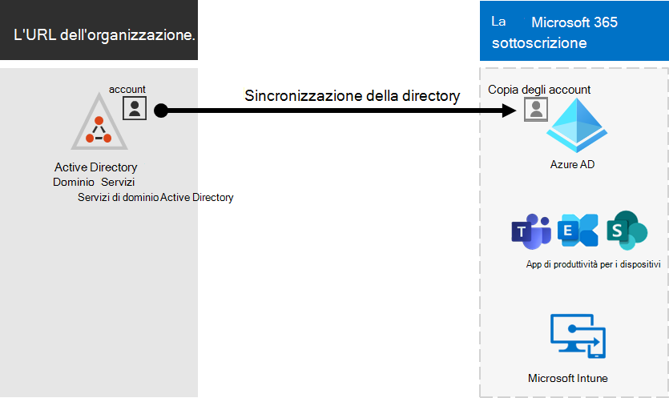
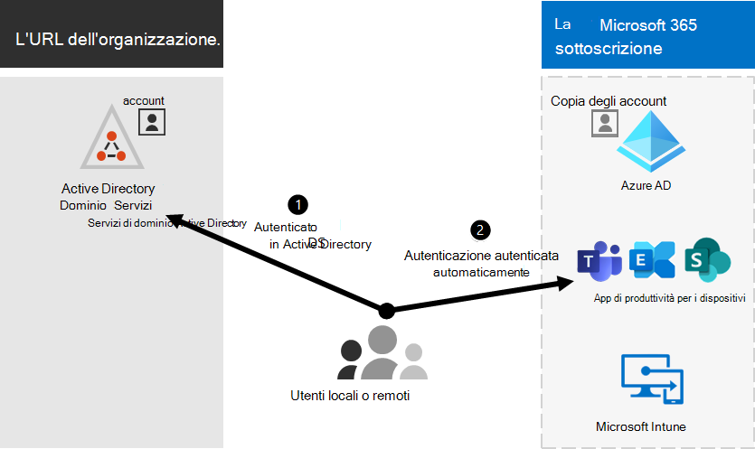

# Microsoft 365'integrazione con ambienti locali

*Questo articolo si applica sia a Microsoft 365 Enterprise che a Office 365 Enterprise*.

È possibile integrare Microsoft 365 con Servizi di dominio Active Directory locali esistenti e con le installazioni locali di Exchange Server, Skype for Business Server 2015 o SharePoint Server.
  
 - Quando si integra Servizi di dominio Active Directory, è possibile sincronizzare e gestire gli account utente per entrambi gli ambienti. È inoltre possibile aggiungere la sincronizzazione dell'hash delle password (PHS) o single sign-on (SSO) in modo che gli utenti possano accedere a entrambi gli ambienti con le proprie credenziali locali.
 - Mediante l'integrazione con i prodotti server locali viene creato un ambiente ibrido. Un ambiente ibrido può essere utile quando si esegue la migrazione di utenti o informazioni a Microsoft 365 oppure è possibile continuare ad avere alcuni utenti o alcune informazioni in locale e altre nel cloud. Per ulteriori informazioni sugli ambienti ibridi, vedere [cloud ibrido.](../solutions/cloud-architecture-models.md#hybrid)

Puoi anche usare gli advisor di Azure Active Directory (Azure AD) per istruzioni di configurazione personalizzate nell'interfaccia di amministrazione di Microsoft 365 (devi accedere a Microsoft 365):

- [Guida alla configurazione di Azure AD](https://aka.ms/aadpguidance)
- [Sincronizzare gli utenti dalla directory dell'organizzazione](https://aka.ms/aadconnectpwsync)
- [Advisor per la distribuzione di Active Directory Federation Services (AD FS)](https://aka.ms/adfsguidance)
   
## Prima di iniziare

Prima di integrare Microsoft 365 e un ambiente locale, è inoltre necessario eseguire la pianificazione della rete e [l'ottimizzazione delle prestazioni.](network-planning-and-performance.md) È anche opportuno conoscere i [modelli di identità](about-microsoft-365-identity.md). 

Vedere [manage Microsoft 365 accounts](manage-microsoft-365-accounts.md) per un elenco degli strumenti che è possibile usare per gestire Microsoft 365 account utente. 
  
## Integrare Microsoft 365 con Servizi di dominio Active Directory

Se si dispone di account utente esistenti in Servizi di dominio Active Directory, non si desidera creare di nuovo tutti questi account in Microsoft 365 e rischiare di introdurre differenze o errori tra gli ambienti. La sincronizzazione della directory consente di eseguire il mirroring di tali account tra gli ambienti locali e online. La sincronizzazione della directory evita agli utenti la necessità di ricordare nuove informazioni per ogni ambiente e all'amministratore di creare o aggiornare gli account due volte. Sarà necessario preparare la [directory locale](prepare-for-directory-synchronization.md) per la sincronizzazione della directory.
  

  
Se si desidera che gli utenti siano in grado di accedere a Microsoft 365 con le proprie credenziali locali, è anche possibile configurare SSO. Con SSO, Microsoft 365 è configurato per considerare attendibile l'ambiente locale per l'autenticazione utente.
  

### Sincronizzazione della directory con o senza sincronizzazione dell'hash delle password o autenticazione pass-through (PTA)

Un utente accede all'ambiente locale con il proprio account utente (dominio\nomeutente). Quando passano a Microsoft 365, devono accedere di nuovo con il proprio account aziendale o dell'istituto di istruzione (user@domain.com). Il nome utente è lo stesso in entrambi gli ambienti. Quando aggiungi PHS o PTA, l'utente ha la stessa password per entrambi gli ambienti, ma dovrà fornire di nuovo tali credenziali quando accede a Microsoft 365. La sincronizzazione della directory con PHS è la sincronizzazione della directory più comune.

Per configurare la sincronizzazione della directory, usare Azure AD Connessione. Per istruzioni, vedere [Set up directory synchronization for Microsoft 365](set-up-directory-synchronization.md) and Azure AD Connessione with express [settings](/azure/active-directory/hybrid/how-to-connect-install-express).

Ulteriori informazioni sulla [preparazione per la sincronizzazione della directory Microsoft 365](prepare-for-directory-synchronization.md).

### Sincronizzazione della directory con SSO

Un utente accede all'ambiente locale con il proprio account utente. Quando si accede a Microsoft 365, l'accesso viene eseguito automaticamente oppure l'accesso viene eseguito con le stesse credenziali utilizzate per l'ambiente locale (dominio\nomeutente).

Per configurare SSO si usa anche Azure AD Connect. Per istruzioni, vedere [Installazione personalizzata di Azure AD Connessione](/azure/active-directory/hybrid/how-to-connect-install-custom).

Per ulteriori informazioni, vedere [Single #A0](/azure/active-directory/manage-apps/what-is-single-sign-on).

## Azure AD Connect

Azure AD Connessione sostituisce le versioni precedenti degli strumenti di integrazione delle identità come DirSync e Azure AD Sync. Se vuoi eseguire l'aggiornamento da Azure Active Directory sincronizzazione con Azure AD Connessione, vedi [le istruzioni per l'aggiornamento.](/azure/active-directory/hybrid/how-to-dirsync-upgrade-get-started) 

## Vedere anche

[Panoramica di Microsoft 365 Enterprise](microsoft-365-overview.md)