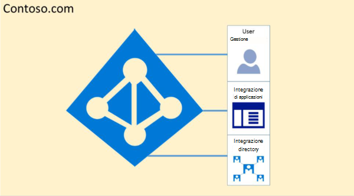
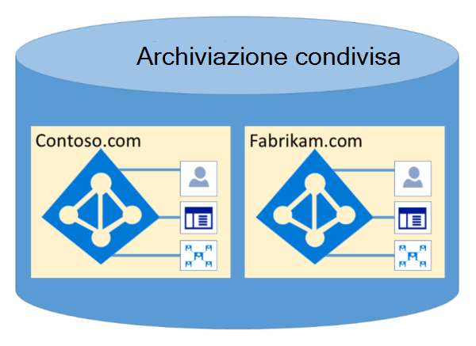

# Isolamento e controllo degli accessi di Microsoft 365 in Azure Active Directory

Azure Active Directory (Azure AD) è stato progettato per ospitare più tenant in modo estremamente sicuro tramite l'isolamento dei dati logici. L'accesso ad Azure AD è limitato da un livello di autorizzazione. Azure AD isola i clienti che usano i contenitori tenant come limiti di sicurezza per salvaguardare il contenuto di un cliente in modo che non possa essere accessibile o compromesso dai co-tenant. Tre controlli vengono eseguiti dal livello di autorizzazione di Azure AD:

- L'entità è abilitata per l'accesso al tenant di Azure AD?
- L'entità è abilitata per l'accesso ai dati in questo tenant?
- Il ruolo dell'entità in questo tenant è autorizzato per il tipo di accesso ai dati richiesto?

Nessun applicazione, utente, server o servizio può accedere ad Azure AD senza l'autenticazione e il token o il certificato adeguati. Le richieste vengono rifiutate se non sono accompagnate da credenziali appropriate.

In effetti, Azure AD ospita ogni tenant nel proprio contenitore protetto, con criteri e autorizzazioni per e all'interno del contenitore esclusivamente di proprietà e gestito dal tenant.
 

Il concetto di contenitori tenant è molto inciso nel servizio directory a tutti i livelli, dai portali fino all'archiviazione permanente. Anche quando più metadati del tenant di Azure AD sono archiviati nello stesso disco fisico, non esiste alcuna relazione tra i contenitori oltre a quella definita dal servizio directory, che a sua volta è dettata dall'amministratore tenant. Non possono esserci connessioni dirette all'archiviazione di Azure AD da qualsiasi applicazione o servizio richiedente senza prima passare attraverso il livello di autorizzazione.

Nell'esempio seguente, Contoso e Fabrikam dispongono di contenitori separati e dedicati e, anche se tali contenitori possono condividere parte della stessa infrastruttura sottostante, ad esempio server e archiviazione, rimangono separati e isolati l'uno dall'altro e sono recinti da livelli di autorizzazione e controllo dell'accesso.
 

Inoltre, non ci sono componenti dell'applicazione che possono essere eseguiti da Azure AD e non è possibile che un tenant viri forzatamente l'integrità di un altro tenant, accedono alle chiavi di crittografia di un altro tenant o leggono i dati non elaborati dal server.

Per impostazione predefinita, Azure AD non consente tutte le operazioni emesse da identità in altri tenant. Ogni tenant è isolato logicamente all'interno di Azure AD tramite controlli di accesso basati sulle attestazioni. Le operazioni di lettura e scrittura dei dati della directory hanno come ambito i contenitori tenant e sono recinti da un livello di astrazione interno e da un livello di controllo dell'accesso basato sui ruoli (RBAC, Role-Based Access Control), che insieme applicano il tenant come limite di sicurezza. Ogni richiesta di accesso ai dati della directory viene elaborata da questi livelli e ogni richiesta di accesso in Microsoft 365 viene impostata in base alla logica precedente.

Azure AD dispone di partizioni Nord America, U.S. Government, Unione Europea, Germania e World Wide. Un tenant esiste in una singola partizione e le partizioni possono contenere più tenant. Le informazioni sulla partizione vengono astratte dagli utenti. Una determinata partizione (inclusi tutti i tenant al suo interno) viene replicata in più datacenter. La partizione per un tenant viene scelta in base alle proprietà del tenant (ad esempio, il codice paese). I segreti e altre informazioni riservate in ogni partizione vengono crittografati con una chiave dedicata. Le chiavi vengono generate automaticamente quando viene creata una nuova partizione.

Le funzionalità del sistema Azure AD sono un'istanza univoca di ogni sessione utente. Inoltre, Azure AD usa le tecnologie di crittografia per fornire l'isolamento delle risorse di sistema condivise a livello di rete per impedire il trasferimento non autorizzato e indesiderato di informazioni.
