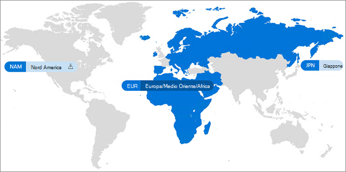

# Microsoft 365 Multi-Geo

Con Microsoft 365 Multi-Geo l'organizzazione può espandere la presenza di Microsoft 365 a più paesi/aree geografiche all'interno del tenant esistente. Invitare il team degli account Microsoft a iscrivere la propria società multi-nazionale a Microsoft 365 Multi-Geo.
  
Con Microsoft 365 Multi-Geo, è possibile effettuare il provisioning e archiviare i dati inattivi nelle posizioni geografiche scelte per soddisfare i requisiti di residenza dei dati e allo stesso tempo sbloccare lo sviluppo globale delle esperienze di produttività moderna per i dipendenti.

Per una video introduzione a Microsoft 365 Multi-Geo, vedere [SharePoint Online e OneDrive Multi-Geo per controllare dove risiedono i propri dati](https://www.youtube.com/watch?v=Do9U3JuROhk).

## Architettura Multi-Geo

In un ambiente multi-geografico, il tenant di Microsoft 365 è costituito da una posizione centrale (in cui è stato originariamente effettuato il provisioning dell'abbonamento a Microsoft 365) e una o più posizioni satellite. In un tenant Multi-Geo, le informazioni su località geografiche, gruppi e le informazioni utente, vengono acquisite in Azure Active Directory (Azure AD). Poiché le informazioni del tenant sono acquisite in modo centralizzato e sincronizzate in ogni località geografica, la condivisione e le esperienze coinvolgono tutti gli utenti della società.

Si noti che Microsoft 365 Multi-Geo non è progettato principalmente per ottimizzare le prestazioni, ma per soddisfare i requisiti di residenza dei dati. Per informazioni sull'ottimizzazione delle prestazioni di Microsoft 365, vedere [Pianificazione della rete e ottimizzazione delle prestazioni per Microsoft 365](https://support.office.com/article/e5f1228c-da3c-4654-bf16-d163daee8848) o contattare il gruppo di supporto.

## Terminologia

Ecco i termini chiave usati nella descrizione di Microsoft 365 Multi-Geo:

- **Posizione centrale** - la posizione geografica in cui è stato effettuato originariamente il provisioning del tenant.
- **Amministratore geografico** - un amministratore che può gestire una o più posizioni satellite specificato.
- **Codice geografico** - un codice di tre lettere per una posizione geografica specificata.
- **Posizione geografica** - un'area geografica che può essere usata in un tenant multi-geo per ospitare dati, tra cui cassette postali di Exchange, OneDrive e siti di SharePoint.
- **Procedure dati posizione (PDL)** - proprietà dell’utente impostata dall'amministratore che indica la posizione geografica in cui si deve eseguire il provisioning della cassetta postale di Exchange di utenti e OneDrive. Il PDL determina anche se è stato effettuato il provisioning dei siti di SharePoint creati dall'utente.
- **Posizione satellite** - posizioni geografiche in cui i carichi di lavoro di Microsoft 365 con supporto delle funzionalità Multi-Geo (Exchange, SharePoint e OneDrive) sono abilitati in un tenant multi-geografico.
- **Tenant** - rappresentazione di un'organizzazione in Microsoft 365 che in genere contiene uno o più domini associati ad essa ad esempio, contoso.com.

## Licenze

Microsoft 365 multi-Geo è disponibile come componente aggiuntivo per i seguenti piani di sottoscrizione di Microsoft 365 per i clienti del contratto Enterprise con un minimo di 250 sedi Microsoft 365 nel tenant e almeno il 5% di tali seggi usando multi-Geo. Le licenze di sottoscrizione degli utenti devono trovarsi nello stesso contratto aziendale delle licenze per i servizi multi-Geo. Per informazioni dettagliate, contattare il team del proprio account Microsoft.

- Microsoft 365 F1, F3, E3, or E5
- Office 365 F3, E1, E3, or E5
- Piano 1 o Piano 2 di Exchange Online
- Piano 1 o Piano 2 di OneDrive for Business
- Piano 1 o Piano 2 di SharePoint Online

## Disponibilità di Microsoft 365 Multi-Geo

Microsoft 365 Multi-Geo è attualmente disponibile in questi paesi/aree geografiche:

[!INCLUDE [Microsoft 365 Multi-Geo locations](../includes/microsoft-365-multi-geo-locations.md)]

## Introduzione

Seguire questi semplici passaggi per iniziare con Multi-Geo:

1. Collaborare con il team responsabile dell'account per aggiungere il piano di servizio _Multi-Geo Capabilities in Microsoft 365_. Verranno fornite le procedure per aggiungere il numero di licenze necessarie. La funzionalità Multi-Geo Capabilities è disponibile per i clienti EA con un minimo di 250 abbonamenti a Microsoft 365.

   Prima di iniziare a usare Microsoft 365 Multi-Geo, Microsoft deve configurare il tenant di Exchange Online per il supporto Multi-Geo. La procedura di configurazione, da effettuare una sola volta, viene attivata dopo aver ordinato il piano di servizio *Multi-Geo Capabilities in Microsoft 365* e le licenze saranno visualizzate nel tenant. Le notifiche specifiche del carico di lavoro vengono ricevute nel [centro messaggi di microsoft 365](https://support.office.com/article/38FB3333-BFCC-4340-A37B-DEDA509C2093) dopo che il tenant ha completato il processo di configurazione per ogni carico di lavoro e quindi è possibile iniziare a configurare e utilizzare le funzionalità multi-geo di Microsoft 365. Il tempo necessario per configurare un tenant per il supporto Multi-Geo varia a seconda del tenant, ma la maggior parte dei tenant termina entro un mese dal ricevimento delle licenze di funzionalità. I tenant più grandi o più complessi possono richiedere più tempo per completare il processo di configurazione. Contattare il team degli account per i dettagli su uno specifico tenant, qualora ne abbiate bisogno.

2. Leggere [Pianificare l'ambiente Multi-Geo](plan-for-multi-geo.md).

3. Informazioni sull’[amministrazione di un ambiente Multi-Geo](administering-a-multi-geo-environment.md) e [ sul riscontro degli utenti sull’ambiente](multi-geo-user-experience.md).

4. Quando si è pronti per configurare Microsoft 365 Multi-Geo, [Configurare il tenant per Multi-Geo](multi-geo-tenant-configuration.md).

5. [Impostare la ricerca](configure-search-for-multi-geo.md).

## Vedere anche

[Multi-Geo in Exchange Online e OneDrive](https://Aka.ms/GoMultiGeo)

[Multi-Geo Capabilities in OneDrive e SharePoint Online](multi-geo-capabilities-in-onedrive-and-sharepoint-online-in-microsoft-365.md)

[Funzionalità Multi-Geo in Exchange Online](multi-geo-capabilities-in-exchange-online.md)

[Esperienza di Teams in un ambiente multi-geografico](https://docs.microsoft.com/microsoftteams/teams-experience-o365odb-spo-multi-geo)
