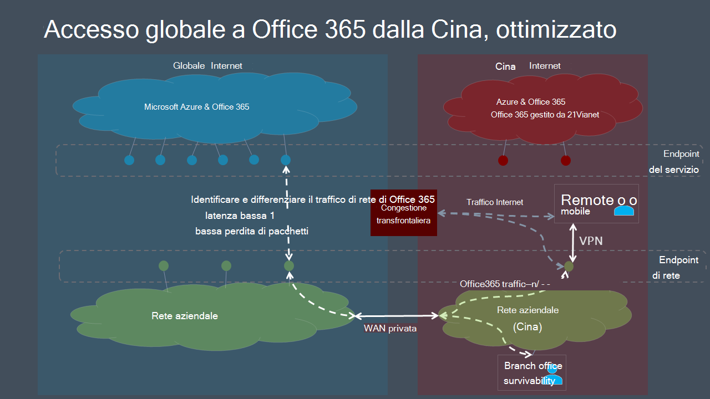

# Ottimizzazione delle prestazioni del tenant globale di Microsoft 365 per gli utenti della CinaMicrosoft 365 global tenant performance optimization for China users

>[!IMPORTANT]
>Questa guida è specifica per gli scenari di utilizzo in cui gli utenti di **Microsoft 365** aziendali che si trovano in Cina si connettono a un **tenant globale di Microsoft 365.**This guidance is specific to usage scenarios in which **enterprise Microsoft 365 users located in China** connect to a **global Microsoft 365 tenant**. Questa guida non **si** applica ai tenant in Office 365 gestito da 21Vianet.This guidance does **not** apply to tenants in Office 365 operated by 21Vianet.

Per le aziende con tenant globali di Microsoft 365 e presenza aziendale in Cina, le prestazioni dei client Microsoft 365 per gli utenti basati sulla Cina possono essere complicate da fattori specifici dell'architettura Internet della Cina Telco.For enterprises with global Microsoft 365 tenants and a corporate presence in China, Microsoft 365 client performance for China-based users can be complicated by factors unique to China Telco's Internet architecture.

Gli ISP della Cina dispongono di connessioni internet pubbliche regolamentate a Internet pubblico globale che passano attraverso dispositivi perimetrali che sono inclini a livelli elevati di congestione della rete cross-border.China ISPs have regulated offshore connections to the global public Internet that go through perimeter devices which are prone to high-levels of cross-border network congestion. Questa congestione crea perdita di pacchetti e latenza per tutto il traffico Internet in ingresso e in uscita dalla Cina.This congestion creates packet loss and latency for all Internet traffic going into and out of China.

La perdita e la latenza dei pacchetti sono dannose per le prestazioni dei servizi di rete, in particolare per i servizi che richiedono scambi di dati di grandi dimensioni (ad esempio trasferimenti di file di grandi dimensioni) o che richiedono prestazioni quasi in tempo reale (applicazioni audio e video).Packet loss and latency is detrimental to the performance of network services, especially services that require large data exchanges (such as large file transfers) or requiring near real-time performance (audio and video applications).

L'obiettivo di questo argomento è fornire le procedure consigliate per ridurre l'impatto della congestione della rete oltre i confini della Cina sui servizi di Microsoft 365.The goal of this topic is to provide best practices for mitigating the impact of China cross-border network congestion on Microsoft 365 services. In questo argomento non vengono risolti altri problemi comuni relativi alle prestazioni dell'ultimo miglio, ad esempio problemi di latenza elevata dei pacchetti a causa di instradamento complesso all'interno dei vettori della Cina.This topic does not address other common last-mile performance issues such as issues of high packet latency due to complex routing within China carriers.

## Procedure consigliate per la rete aziendaleCorporate network best practices

Molte aziende con tenant e utenti di Microsoft 365 globali in Cina hanno implementato reti private che trasportano il traffico di rete aziendale tra le sedi degli uffici della Cina e le sedi di tutto il mondo.Many enterprises with global Microsoft 365 tenants and users in China have implemented private networks that carry corporate network traffic between China office locations and offshore locations around the world. Queste aziende possono sfruttare questa infrastruttura di rete per evitare la congestione della rete oltre i confini e ottimizzare le prestazioni dei servizi di Microsoft 365 in Cina.These enterprises can leverage this network infrastructure to avoid cross-border network congestion and optimize their Microsoft 365 service performance in China.

>[!IMPORTANT]
>Come per tutte le implementazioni WAN private, è consigliabile consultare sempre i requisiti normativi per il proprio paese e/o area geografica per verificare che la configurazione di rete sia conforme.As with all private WAN implementations, you should always consult regulatory requirements for your country and/or region to ensure that your network configuration is in compliance.

Come primo passaggio, è fondamentale seguire le linee guida di rete benchmark in Pianificazione della rete e ottimizzazione delle prestazioni [per Microsoft 365.](https://aka.ms/tune)As a first step, it is crucial that you follow our benchmark network guidance at [Network planning and performance tuning for Microsoft 365](https://aka.ms/tune). L'obiettivo principale dovrebbe essere evitare di accedere ai servizi globali di Microsoft 365 da Internet in Cina, se possibile.The primary goal should be to avoid accessing global Microsoft 365 services from the Internet in China if possible.

- Sfruttare la rete privata esistente per trasportare il traffico di rete di Microsoft 365 tra le reti degli uffici della Cina e le posizioni delle sedi aziendali in uscita su Internet pubblico al di fuori della Cina.Leverage your existing private network to carry Microsoft 365 network traffic between China office networks and offshore locations that egress on the public Internet outside China. Quasi tutte le località al di fuori della Cina offriranno un chiaro vantaggio.Almost any location outside China will provide a clear benefit. Gli amministratori di rete possono ottimizzare ulteriormente l'ambiente in uscita in aree con interconnessione a bassa latenza con [la rete globale Microsoft.](https://docs.microsoft.com/azure/networking/microsoft-global-network)Network administrators can further optimize by egressing in areas with low-latency interconnect with the [Microsoft global network](https://docs.microsoft.com/azure/networking/microsoft-global-network). Hong Kong, Giappone e Corea del Sud sono esempi.Hong Kong, Japan, and South Korea are examples.
- Configurare i dispositivi degli utenti per accedere alla rete aziendale tramite una connessione VPN per consentire al traffico di Microsoft 365 di transitare sul collegamento privato della rete aziendale.Configure user devices to access the corporate network over a VPN connection to allow Microsoft 365 traffic to transit the corporate network's private offshore link. Verificare che i client VPN non siano configurati per l'uso di split tunneling o che i dispositivi utente siano configurati per ignorare lo split tunneling per il traffico di Microsoft 365.Ensure that VPN clients are either not configured to use split tunneling, or that user devices are configured to ignore split tunneling for Microsoft 365 traffic.
- Configurare la rete in modo che tutto il traffico di Microsoft 365 sia instradato attraverso il collegamento privato.Configure your network to route all Microsoft 365 traffic across your private offshore link. Se è necessario ridurre al minimo il volume di traffico sul collegamento  privato, è possibile  scegliere di instradare solo gli endpoint nella categoria Ottimizzazione e consentire alle richieste di consentire e agli **endpoint** predefiniti di transitare su Internet.If you must minimize the volume of traffic on your private link, you can choose to only route endpoints in the **Optimize** category, and allow requests to **Allow** and **Default** endpoints to transit the Internet. Ciò consente di migliorare le prestazioni e ridurre al minimo il consumo di larghezza di banda limitando il traffico ottimizzato ai servizi critici più sensibili all'elevata latenza e alla perdita di pacchetti.This will improve performance and minimize bandwidth consumption by limiting optimized traffic to critical services that are most sensitive to high latency and packet loss.
- Se possibile, usare UDP anziché TCP per il traffico di streaming multimediale live, ad esempio per Teams.If possible, use UDP instead of TCP for live media streaming traffic, such as for Teams. UDP offre prestazioni di streaming multimediale live migliori rispetto a TCP.UDP offers better live media streaming performance than TCP.

Per informazioni su come instradare in modo selettivo il traffico di Microsoft 365, vedere [Gestione degli endpoint di Office 365.](managing-office-365-endpoints.md)For information about how to selectively route Microsoft 365 traffic, see [Managing Office 365 endpoints](managing-office-365-endpoints.md). Per un elenco di tutti gli URL e gli indirizzi IP di Office 365 in tutto il mondo, vedere URL e intervalli [di indirizzi IP di Office 365.](urls-and-ip-address-ranges.md)For a list of all worldwide Office 365 URLs and IP addresses, see [Office 365 URLs and IP address ranges](urls-and-ip-address-ranges.md).

## Procedure consigliate per gli utentiUser best practices

Gli utenti in Cina che si connettono ai tenant globali di Microsoft 365 da posizioni remote come case, bar, hotel e succursali senza connessione alle reti aziendali possono sperimentare prestazioni di rete scarse, perché il traffico tra i dispositivi e Microsoft 365 deve transitare nei circuiti di rete cross-border congestionati della Cina.Users in China who connect to global Microsoft 365 tenants from remote locations such as homes, coffee shops, hotels and branch offices with no connection to enterprise networks can experience poor network performance because traffic between their devices and Microsoft 365 must transit China's congested cross-border network circuits.

Se le reti private cross-border e/o l'accesso VPN alla rete aziendale non sono un'opzione, è comunque possibile ridurre i problemi di prestazioni per utente formando gli utenti basati sulla Cina a seguire queste procedure consigliate.If cross-border private networks and/or VPN access into the corporate network are not an option, per-user performance issues can still be mitigated by training your China-based users to follow these best practices.

- Utilizzare client di Office rtf che supportano la memorizzazione nella cache (ad esempio Outlook, Teams, OneDrive e così via) ed evitare client basati sul Web.Utilize rich Office clients that support caching (e.g. Outlook, Teams, OneDrive, etc.), and avoid web-based clients. La memorizzazione nella cache dei client di Office e le funzionalità di accesso offline possono ridurre notevolmente l'impatto della congestione e della latenza della rete.Office client caching and offline access features can dramatically reduce the impact of network congestion and latency.
- Se il tenant di Microsoft 365 è stato configurato con la funzionalità _di audioconferenza,_ gli utenti di Teams possono partecipare alle riunioni tramite la rete PSTN (Public Switched Telephone Network).If your Microsoft 365 tenant has been configured with the _Audio Conferencing_ feature, Teams users can join meetings via the public switched telephone network (PSTN). Per altre informazioni, vedere [Audioconferenza in Office 365.](https://docs.microsoft.com/microsoftteams/audio-conferencing-in-office-365)For more information, see [Audio Conferencing in Office 365](https://docs.microsoft.com/microsoftteams/audio-conferencing-in-office-365).
- Se si verificano problemi di prestazioni di rete, gli utenti devono segnalare al proprio reparto IT per la risoluzione dei problemi e inoltrare al supporto Tecnico Microsoft se si sospettano problemi con i servizi di Microsoft 365.If users experience network performance issues, they should report to their IT department for troubleshooting, and escalate to Microsoft support if trouble with Microsoft 365 services is suspected. Non tutti i problemi sono causati dalle prestazioni della rete cross-border.Not all issues are caused by cross-border network performance.

Microsoft sta lavorando costantemente per migliorare l'esperienza utente di Microsoft 365 e le prestazioni dei client nella più ampia gamma possibile di architetture e caratteristiche di rete.Microsoft is continually working to improve the Microsoft 365 user experience and the performance of clients over the widest possible range of network architectures and characteristics. Visitare la [Community tecnica di Office 365](https://techcommunity.microsoft.com/t5/office-365/bd-p/Office365General) per avviare o partecipare a una conversazione, trovare risorse e inviare richieste di funzionalità e suggerimenti.Visit the [Office 365 Tech Community](https://techcommunity.microsoft.com/t5/office-365/bd-p/Office365General) to start or join a conversation, find resources, and submit feature requests and suggestions.

## Argomenti correlatiRelated topics

[Pianificazione della rete e ottimizzazione delle prestazioni per Microsoft 365Network planning and performance tuning for Microsoft 365](https://aka.ms/tune)

[Principi di connettività di rete di Microsoft 365Microsoft 365 network connectivity principles](microsoft-365-network-connectivity-principles.md)

[Gestione degli endpoint di Office 365Managing Office 365 endpoints](managing-office-365-endpoints.md)

[URL e intervalli di indirizzi IP per Office 365Office 365 URLs and IP address ranges](urls-and-ip-address-ranges.md)

[Rete globale MicrosoftMicrosoft global network](https://docs.microsoft.com/azure/networking/microsoft-global-network)
