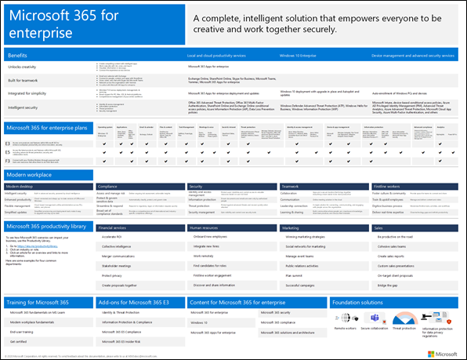
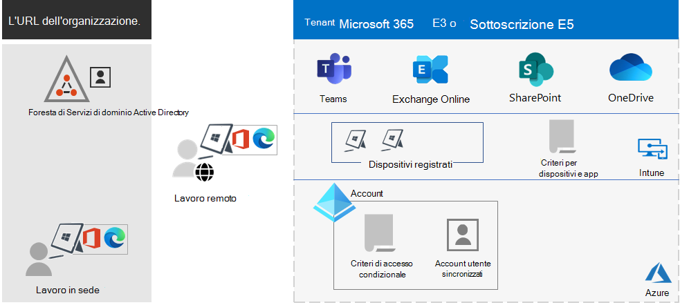
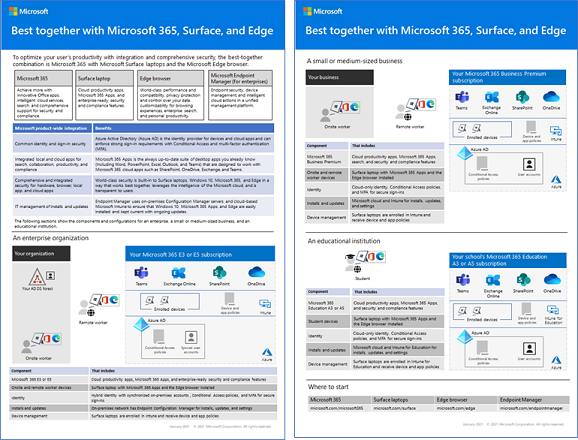

# Panoramica di Microsoft 365 per le aziendeMicrosoft 365 for enterprise overview

Microsoft 365 per le aziende è una soluzione completa e intelligente che offre a tutti gli strumenti necessari per essere creativi e collaborare in modo sicuro.Microsoft 365 for enterprise is a complete, intelligent solution that empowers everyone to be creative and work together securely.

Microsoft 365 per le aziende è progettato per le grandi organizzazioni, ma può essere usato anche per le piccole e medie imprese che hanno bisogno delle funzionalità di sicurezza e produttività più avanzate.Microsoft 365 for enterprise is designed for large organizations, but it can also be used for medium-sized and small businesses that need the most advanced security and productivity capabilities.

## ComponentiComponents

Microsoft 365 per le aziende comprende:Microsoft 365 for enterprise consists of:

|ServiziServices|DescrizioneDescription|
|---|---|
|App locali e app e servizi di produttività basati sul cloudLocal apps and cloud-based apps and productivity services|Include sia Microsoft 365 Apps for enterprise, le app di Office più recenti per PC e Mac, come Word, Excel, PowerPoint, Outlook e altre, che una gamma completa di servizi online per la posta elettronica, l'archiviazione dei file e la collaborazione, riunioni e altro ancora.Includes both Microsoft 365 Apps for enterprise, the latest Office apps for your PC and Mac (such as Word, Excel, PowerPoint, Outlook, and others), and a full suite of online services for email, file storage and collaboration, meetings, and more.|
|Windows 10 EnterpriseWindows 10 Enterprise|Soddisfa le esigenze delle grandi e medie imprese.Meets the needs of both large and midsize organizations. È la versione più produttiva e sicura di Windows per gli utenti.It's the most productive and secure version of Windows for users. Per i professionisti IT, include anche funzionalità complete per la gestione di distribuzioni, dispositivi e app.For IT professionals, it also provides comprehensive deployment, device, and app management.|
|Gestione dei dispositivi e servizi di sicurezza avanzatiDevice management and advanced security services|Include Microsoft Intune, un servizio di gestione della mobilità aziendale basato su cloud che consente alla forza lavoro di essere produttiva, proteggendo al tempo stesso i dati dell’organizzazione.Includes Microsoft Intune, which is a cloud-based enterprise mobility management service that helps enable your workforce to be productive while protecting your organization data.|
|||

## PianiPlans

Microsoft 365 per le aziende è disponibile in tre piani.Microsoft 365 for enterprise is available in three plans.

|Nome del pianoPlan name|FunzionalitàCapabilities|
|---|---|
|E3E3|Accedi ai prodotti e alle funzionalità principali di Microsoft 365 per migliorare in modo sicuro la produttività sul luogo di lavoro e favorire l'innovazione.Access the Microsoft 365 core products and features to securely enhance workplace productivity and drive innovation.|
|E5E5|Accedi ai prodotti e alle funzionalità più recenti di Microsoft 365.Access the Microsoft 365 latest products and features. Questi includono Defender per Office 365, strumenti di sicurezza e strumenti di collaborazione.These include Defender for Office 365, security tools, and collaboration tools. Questo piano include tutte le funzionalità di E3 e, in aggiunta, strumenti per la sicurezza avanzata, la voce e l'analisi dei dati.This plan includes all E3 capabilities, plus advanced security, voice, and data analysis tools.|
|F3F3|Connettiti con gli operatori sul campo attraverso gli strumenti e le risorse appositamente realizzate che possono usare per lavorare nel modo più efficiente.Connect with your first-line workers through purpose-built tools and resources that they can use to help them do their best work.|
|||

Se si ha Microsoft 365 E3, è possibile ottenere anche questi componenti aggiuntivi:If you have Microsoft 365 E3, you can also get these add-ons:

- Identità e protezione dalle minacceIdentity & Threat Protection
- Protezione delle informazioni e conformitàInformation Protection & Compliance
- [Microsoft 365 E5 ComplianceMicrosoft 365 E5 Compliance](https://www.microsoft.com/microsoft-365/business/e5-compliance)
- Rischi Insider di Microsoft 365 E5Microsoft 365 E5 Insider Risk

Gli utenti di Microsoft 365 E3 possono usare questi componenti aggiuntivi per sfruttare le funzionalità aggiuntive disponibili in Microsoft 365 E5.Microsoft 365 E3 users can use these add-ons to take advantage of some of the additional features Microsoft 365 E5 includes.

Per altre informazioni, vedere [Caratteristiche e funzionalità per ogni piano](https://www.microsoft.com/microsoft-365/compare-all-microsoft-365-plans).For more information, see [Features and capabilities for each plan](https://www.microsoft.com/microsoft-365/compare-all-microsoft-365-plans).

## Comprendere il quadro generaleGet the big picture

Il [poster di Microsoft 365 per le aziende](../downloads/Microsoft365Enterprise.pdf) rappresenta una posizione centrale da visualizzare:The [Microsoft 365 for enterprise poster](../downloads/Microsoft365Enterprise.pdf) is a central location for you to view:

- I vantaggi di Microsoft 365 per le aziende, e il modo in cui le app e i servizi riflettono i suoi valori fondamentali.The benefits of Microsoft 365 for enterprise, and how apps and services map to its value pillars.
- Piani di Microsoft 365 per le aziende e i loro componenti.Microsoft 365 for enterprise plans and which components they contain.
- I componenti principali del Luogo di lavoro moderno di Microsoft, che sono abilitati da Microsoft 365 per le aziende.The key components of the Microsoft modern workplace, which Microsoft 365 for enterprise enables.
- La [Raccolta di produttività di Microsoft 365](https://www.microsoft.com/microsoft-365/success/) e gli scenari rappresentativi per alcuni reparti comuni dell’organizzazione.The [Microsoft 365 Productivity Library](https://www.microsoft.com/microsoft-365/success/) and representative scenarios for some common organization departments.

Si può anche [scaricare una copia del poster](https://github.com/MicrosoftDocs/microsoft-365-docs/raw/public/microsoft-365/downloads/Microsoft365Enterprise.pdf).You can also [download a copy of the poster](https://github.com/MicrosoftDocs/microsoft-365-docs/raw/public/microsoft-365/downloads/Microsoft365Enterprise.pdf).

## Transizione dell'intera organizzazioneTransition your entire organization

Per avere un quadro più completo su come introdurre i prodotti e servizi di Microsoft 365 per le aziende in tutta la propria organizzazione, vedere il [poster della transizione](https://download.microsoft.com/download/2/c/7/2c7bcc04-aae3-4604-9707-1ffff66b9851/transition-org-to-m365.pdf).To get a better picture about how to move your entire organization to the products and services in Microsoft 365 for enterprise, see the [transition poster](https://download.microsoft.com/download/2/c/7/2c7bcc04-aae3-4604-9707-1ffff66b9851/transition-org-to-m365.pdf).

Questo poster di due pagine è modo rapido per inventariare l'infrastruttura esistente.This two-page poster is a quick way to inventory your existing infrastructure. Consente di trovare indicazioni e di passare al prodotto o servizio corrispondente in Microsoft 365.It helps you to find guidance and move to the corresponding product or service in Microsoft 365 for enterprise. Include i prodotti di Windows e Office e altri elementi di infrastruttura e sicurezza, come la gestione dei dispositivi, le identità e la protezione delle informazioni e dalle minacce.It includes Windows and Office products and other infrastructure and security elements, such as device management, identity, and information and threat protection.

## Fine del supporto per i client e i server di Windows 7 e Office 2010End of support for Windows 7 and Office 2010 clients and servers

[Windows 7](https://aka.ms/win7upgrade) ha raggiunto la fine del supporto il **14 gennaio 2020**.[Windows 7](https://aka.ms/win7upgrade) reached end of support on **January 14, 2020**.

Questi prodotti hanno raggiunto la fine del supporto il **13 ottobre 2020**:These products reached end of support on **October 13, 2020**:

- [Office 2010Office 2010](/DeployOffice/office-2010-end-support-roadmap)
- [Exchange Server 2010Exchange Server 2010](exchange-2010-end-of-support.md)

[SharePoint Server 2010](upgrade-from-sharepoint-2010.md) raggiungerà la fine del supporto il **13 aprile 2021**.[SharePoint Server 2010](upgrade-from-sharepoint-2010.md) will reach end of support on **April 13, 2021**.

Per un riepilogo visivo delle opzioni di aggiornamento, migrazione e passaggio al cloud per questi prodotti, vedere il [poster relativo alla fine del supporto](../downloads/Office2010Windows7EndOfSupport.pdf).For a visual summary of the upgrade, migrate, and move-to-the-cloud options for these products, see the [end of support poster](../downloads/Office2010Windows7EndOfSupport.pdf).

Questo poster di una pagina rappresenta un modo rapido per comprendere i vari percorsi che è possibile seguire per evitare che i prodotti dei client e server di Windows 7 e Office 2010 raggiungano la fine del supporto, evidenziando i percorsi e il supporto preferiti in Microsoft 365 per le aziende.This one-page poster is a quick way to understand the various paths you can take to prevent Windows 7 and Office 2010 client and server products from reaching end of support, with preferred paths and support in Microsoft 365 for enterprise highlighted.

È anche possibile [scaricare il poster](https://github.com/MicrosoftDocs/microsoft-365-docs/raw/public/microsoft-365/downloads/Office2010Windows7EndOfSupport.pdf) e stamparlo in formato lettera, legale o tabloid (11 x 17).You can also [download this poster](https://github.com/MicrosoftDocs/microsoft-365-docs/raw/public/microsoft-365/downloads/Office2010Windows7EndOfSupport.pdf) and print it in letter, legal, or tabloid (11 x 17) formats.

## Pianificare e distribuirePlan for and deploy

Sono disponibili tre modi per pianificare e distribuire i prodotti, le funzionalità e i componenti di Microsoft 365 per le aziende:There are three ways to plan for and deploy the products, features, and components of Microsoft 365 for enterprise:

- In partnership con FastTrackIn partnership with FastTrack

   Con FastTrack, i tecnici Microsoft aiuteranno a passare al cloud secondo i tempi desiderati.With FastTrack, Microsoft engineers help you move to the cloud at your own pace. Vedere [FastTrack per Microsoft 365](https://fasttrack.microsoft.com/microsoft365).See [FastTrack for Microsoft 365](https://fasttrack.microsoft.com/microsoft365).

- Con il supporto di Microsoft Consulting Services o di un [partner Microsoft](https://partner.microsoft.com/):With the help of Microsoft Consulting Services or a [Microsoft partner](https://partner.microsoft.com/)

   I consulenti possono analizzare l'infrastruttura corrente e aiutare a sviluppare un piano per integrare interamente il software e i servizi di Microsoft 365 per le aziende.Consultants can analyze your current infrastructure and help you develop a plan to incorporate all the software and services of Microsoft 365 for enterprise.

- Procedere autonomamenteDo it yourself

   Iniziare con la [Roadmap di rete](networking-roadmap-microsoft-365.md) per sviluppare o verificare i carichi di lavoro esistenti dell’infrastruttura e la produttività.Start with the [Networking roadmap](networking-roadmap-microsoft-365.md) to build out or verify your existing infrastructure and productivity workloads.

Per avere un esempio di come Microsoft 365 è stato implementato da una organizzazione multinazionale fittizia, ma rappresentativa, vedere il [case study di Contoso Corporation](contoso-overview.md).For an example of how a fictional but representative multinational organization has deployed Microsoft 365 for enterprise, see the [Contoso Corporation case study](contoso-overview.md).

## Altri prodotti di Microsoft 365Additional Microsoft 365 products

- [Microsoft 365 Business PremiumMicrosoft 365 Business Premium](../business/index.yml)

  È possibile unire le migliori funzionalità di produttività e collaborazione con soluzioni per la sicurezza e la gestione dei dispositivi per proteggere i dati aziendali di piccole e medie imprese.Bring together the best-in-class productivity and collaboration capabilities with device management and security solutions to safeguard business data for small and midsize businesses.

- [Microsoft 365 EducationMicrosoft 365 Education](/education)

  Permette ai docenti di sbloccare la creatività, promuovere la collaborazione e di offrire un'esperienza semplice e sicura in un'unica soluzione conveniente pensata per l'istruzione.Empower educators to unlock creativity, promote teamwork, and provide a simple and safe experience in a single, affordable solution built for education.

- [Microsoft 365 GovernmentMicrosoft 365 Government](https://www.microsoft.com/microsoft-365/government)

  Consentire ai dipendenti del settore pubblico degli Stati Uniti di collaborare in modo sicuro.Empower United States public sector employees to work together, securely.

## Ideale insieme a Surface e al browser Microsoft EdgeBest together with Surface and the Edge browser

La combinazione ideale, che include Microsoft 365 per grandi imprese, dispositivi Microsoft Surface e il browser Microsoft Edge, consente di ottimizzare la produttività degli utenti in modo integrato e sicuro.Optimize your user’s integrated and secure productivity with the best-together combination of Microsoft 365 for enterprise, Microsoft Surface devices, and the Microsoft Edge browser. Questa integrazione tra prodotti offre:This cross-product integration provides:

- Infrastruttura comune per accesso e identità.A common identity and sign-in security infrastructure.
- App locali e cloud integrate per la ricerca, la collaborazione, la produttività e la conformità.Integrated local and cloud apps for search, collaboration, productivity, and compliance.
- Sicurezza completa e integrata per hardware, browser, app locali e app cloud.Comprehensive and integrated security for hardware, browser, local app, and cloud apps.
- Un'infrastruttura comune per la gestione IT di installazioni e aggiornamenti.A common infrastructure for IT management of installs and updates.

Ecco un esempio per un'organizzazione aziendale.Here is an example for an enterprise organization.

Per altre informazioni e per esempi di configurazione per piccole e medie imprese e per gli istituti di istruzione, è possibile scaricare il [poster Ideale insieme](https://download.microsoft.com/download/2/8/d/28db0cf9-2f5a-4f63-91e2-46ff5c4d3baf/microsoft-best-together-poster.pdf).For more information and configuration examples for a small and medium business and an educational institution, download the [Best together poster](https://download.microsoft.com/download/2/8/d/28db0cf9-2f5a-4f63-91e2-46ff5c4d3baf/microsoft-best-together-poster.pdf).

## Formazione su Microsoft 365Microsoft 365 training

Per altre informazioni su Microsoft 365 e su come ottenere una certificazione Microsoft 365, si può iniziare da [Microsoft 365 Certified: aspetti fondamentali](/learn/paths/m365-fundamentals/).To learn more about Microsoft 365 and work toward a Microsoft 365 certification, you can start with [Microsoft 365 Certified: Fundamentals](/learn/paths/m365-fundamentals/).

## Vedere ancheSee also

[Pagina del prodotto Microsoft 365 per le aziendeMicrosoft 365 for enterprise product page](https://www.microsoft.com/microsoft-365/enterprise)