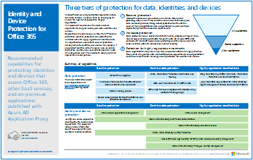
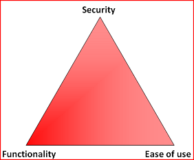

# Configurazioni di identità e accesso dei dispositivi

In questa serie di articoli viene descritto come configurare l'accesso sicuro ai servizi cloud tramite prodotti Enterprise Mobility + Security (EMS) mediante l'implementazione di un ambiente e di una configurazione consigliati, tra cui un set prescritto di criteri di accesso condizionale e funzionalità correlate. EMS è un componente di base di Microsoft 365. È possibile utilizzare queste linee guida per proteggere l'accesso a tutti i servizi integrati con Azure Active Directory, inclusi i servizi Microsoft 365, altri servizi SaaS e le applicazioni locali pubblicate con il proxy di applicazione Azure AD. 

Questi suggerimenti sono allineati con Microsoft Secure Score così come il [Punteggio di identità in Azure ad](https://docs.microsoft.com/azure/active-directory/fundamentals/identity-secure-score)e aumentano questi punteggi per l'organizzazione. Questi suggerimenti consentiranno inoltre di implementare questi [cinque passaggi per garantire l'infrastruttura di identità](https://docs.microsoft.com/azure/security/azure-ad-secure-steps). 

Microsoft riconosce che alcune organizzazioni presentano requisiti di ambiente o complessità univoci. Se si è una di queste organizzazioni, utilizzare questi suggerimenti come punto di partenza. Tuttavia, la maggior parte delle organizzazioni può implementare questi suggerimenti come prescritto. 

## Pubblico previsto

Tali raccomandazioni sono destinate a Enterprise Architects e ai professionisti IT che hanno familiarità con [Office 365](https://docs.microsoft.com/microsoft-365/admin) e [Microsoft Enterprise Mobility + Security](https://microsoft.com/ems), che include, tra gli altri, Azure Active Directory (Identity), Microsoft Intune (Device Management) e Azure Information Protection (Data Protection).

### Ambiente del cliente

I criteri consigliati sono applicabili alle organizzazioni aziendali che operano sia interamente all'interno del cloud Microsoft sia per i clienti con infrastruttura ibrida (distribuiti sia in locale che Microsoft Cloud).

Molti dei consigli forniti si basano sui servizi disponibili solo con le licenze Enterprise Mobility + Security (EMS) E5. I suggerimenti presentati presumono le funzionalità complete di licenza EMS E5.

Per le organizzazioni che non dispongono di licenze Enterprise Mobility + Security E5, Microsoft consiglia di implementare almeno le funzionalità di protezione di base di Azure AD incluse in tutti i piani. Per ulteriori informazioni, vedere l'articolo, [cosa è la protezione di base](/azure/active-directory/active-directory-conditional-access-baseline-protection), nella libreria di Azure ad.

### Avvertimenti

L'organizzazione può essere soggetta a requisiti normativi o di altro tipo, tra cui consigli specifici che potrebbero richiedere l'applicazione di criteri che divergono da queste configurazioni consigliate. Tali configurazioni consigliano controlli dell'utilizzo non disponibili in precedenza. Questi controlli sono consigliati perché riteniamo che rappresentino un equilibrio tra sicurezza e produttività.  

Sono state eseguite le migliori condizioni per tenere conto di una vasta gamma di requisiti di protezione dell'organizzazione, ma non è possibile tenere conto di tutti i requisiti possibili o di tutti gli aspetti univoci della propria azienda.

## Tre livelli di protezione

La maggior parte delle organizzazioni hanno requisiti specifici relativi a sicurezza e protezione dei dati. Tali requisiti variano in base al settore e alle mansioni lavorative all'interno delle organizzazioni. Ad esempio, il reparto legale e gli amministratori possono richiedere controlli di sicurezza e protezione delle informazioni aggiuntivi attorno alla corrispondenza di posta elettronica non necessari per gli utenti di altre unità aziendali. 

Ogni settore ha anche il proprio set di normative specializzate. Piuttosto che fornire un elenco di tutte le opzioni di sicurezza possibili o una raccomandazione per segmento di settore o funzione del processo, sono state fornite indicazioni per tre diversi livelli di sicurezza e protezione che possono essere applicati in base alla granularità delle proprie esigenze.

- **Protezione di base**: si consiglia di stabilire uno standard minimo per la protezione dei dati, nonché le identità e i dispositivi che accedono ai dati. È possibile seguire questi suggerimenti di base per fornire una protezione predefinita complessa che soddisfi le esigenze di molte organizzazioni.
- **Protezione sensibile**: alcuni clienti dispongono di un sottoinsieme di dati che devono essere protetti a livelli superiori oppure possono richiedere che tutti i dati siano protetti a un livello superiore. È possibile applicare una maggiore protezione a tutti o a set di dati specifici nell'ambiente Microsoft 365. È consigliabile proteggere le identità e i dispositivi che accedono ai dati sensibili con livelli di sicurezza analoghi.  
- **Altamente regolamentato**: alcune organizzazioni potrebbero avere una piccola quantità di dati altamente classificati, costituiti da segreti commerciali o da dati regolamentati. Microsoft offre funzionalità che consentono alle organizzazioni di soddisfare questi requisiti, inclusa la protezione aggiuntiva per identità e dispositivi.

In questa guida viene illustrato come implementare la protezione per identità e dispositivi per ognuno di questi livelli di protezione. Utilizzare queste linee guida come punto di partenza per l'organizzazione e regolare i criteri per soddisfare i requisiti specifici dell'organizzazione.

È importante utilizzare livelli di protezione coerenti tra dati, identità e dispositivi. Ad esempio, se si implementano queste linee guida, assicurarsi di proteggere i dati a livelli comparabili. Questi modelli di architettura mostrano quali funzionalità sono confrontabili.

**Protezione di dispositivi e identità per Office 365** 
 
[PDF](https://go.microsoft.com/fwlink/p/?linkid=841656) | [Visio](https://go.microsoft.com/fwlink/p/?linkid=841657) | [Altre lingue](https://www.microsoft.com/download/details.aspx?id=55032)

**Soluzioni per la protezione dei file in Office 365** 
 
[PDF](https://download.microsoft.com/download/7/8/9/789645A5-BD10-4541-BC33-F8D1EFF5E911/MSFT_cloud_architecture_O365%20file%20protection.pdf) | [Visio](https://download.microsoft.com/download/7/8/9/789645A5-BD10-4541-BC33-F8D1EFF5E911/MSFT_cloud_architecture_O365%20file%20protection.vsdx)

## Compromesso tra sicurezza e produttività

L'implementazione di qualsiasi strategia di sicurezza richiede compromessi tra la sicurezza e la produttività. È utile valutare il modo in cui ogni decisione influisce sul saldo di sicurezza, funzionalità e facilità d'uso.

Le raccomandazioni fornite si basano sui seguenti principi:

- Conoscere il gruppo di destinatari ed essere flessibili per la sicurezza e i requisiti funzionali.
- Applicare un criterio di sicurezza appena in tempo e assicurarsi che sia significativo.

## Servizi e concetti relativi a identità e protezione dall'accesso ai dispositivi

Microsoft 365 for Enterprise è stato creato per organizzazioni di grandi dimensioni e integra Office 365 Enterprise, Windows 10 Enterprise e Enterprise Mobility + Security (EMS), per consentire a tutti di essere creativi e di collaborare in modo sicuro.

In questa sezione viene fornita una panoramica dei servizi e delle funzionalità di Microsoft 365 che sono importanti per l'accesso a identità e dispositivi.

### Microsoft Azure Active Directory

Azure AD offre una serie completa di funzionalità di gestione delle identità. Per proteggere l'accesso, si consiglia di utilizzare le seguenti funzionalità:

- **[Reimpostazione della password self-service (SSPR)](/azure/active-directory/authentication/concept-sspr-howitworks)**: consentire agli utenti di reimpostare le proprie password in modo sicuro e senza l'intervento di supporto tecnico, fornendo la verifica di più metodi di autenticazione che l'amministratore può controllare.

- **[Autenticazione](/azure/active-directory/authentication/concept-mfa-howitworks)** a più fattori: AMF richiede agli utenti di fornire due forme di verifica, ad esempio una password utente e una notifica dall'app Microsoft Authenticator o da una telefonata. Il Master riduce notevolmente il rischio che l'identità rubata possa essere utilizzata per accedere all'ambiente.

- **[Accesso condizionale](/azure/active-directory/conditional-access/overview)**: Azure ad valuta le condizioni dell'accesso utente e utilizza i criteri di accesso condizionale creati per consentire l'accesso. Ad esempio, in questa guida viene illustrato come creare un criterio di accesso condizionale per richiedere la conformità del dispositivo all'accesso ai dati riservati. Questo riduce notevolmente il rischio che un hacker con un'identità rubata possa accedere ai dati riservati. Protegge anche i dati sensibili nei dispositivi, perché i dispositivi soddisfano i requisiti specifici per la sicurezza e l'integrità.

- **[Gruppi di Azure ad](/azure/active-directory/fundamentals/active-directory-manage-groups)**: le regole di accesso condizionale, la gestione dei dispositivi con Intune e persino le autorizzazioni per i file e i siti dell'organizzazione si basano sull'assegnazione ai gruppi di utenti e/o Azure ad. Si consiglia di creare gruppi di Azure AD che corrispondono ai livelli di protezione che si stanno implementando. Ad esempio, il personale esecutivo è probabilmente un obiettivo di valore superiore per gli hacker. Pertanto, è opportuno assegnare questi dipendenti a un gruppo di Azure AD e assegnare questo gruppo ai criteri di accesso condizionale e ad altri criteri che applicano un livello di protezione più elevato per l'accesso.

- **[Registrazione dispositivo](/azure/active-directory/devices/overview)**: registrare un dispositivo in Azure ad per fornire un'identità al dispositivo. Questa identità viene utilizzata per autenticare il dispositivo quando un utente accede e applica regole di accesso condizionale che richiedono PC conformi a un dominio. Per queste linee guida, viene utilizzata la registrazione dei dispositivi per registrare automaticamente i computer Windows aggiunti a un dominio. La registrazione del dispositivo è un prerequisito per la gestione dei dispositivi con Intune. 

- **[Azure ad Identity Protection](/azure/active-directory/identity-protection/overview)**: Azure ad Identity Protection consente di rilevare potenziali vulnerabilità che interessano le identità dell'organizzazione e configurare i criteri di correzione automatici per il rischio di accesso basso, medio e alto e per i rischi dell'utente. Questa guida si basa su questa valutazione dei rischi per applicare criteri di accesso condizionale per l'autenticazione a più fattori. Questa guida include anche un criterio di accesso condizionale che richiede agli utenti di modificare la propria password se viene rilevata un'attività ad alto rischio per il proprio account.

### Microsoft Intune

[Intune](https://docs.microsoft.com/intune/introduction-intune) è il servizio di gestione dei dispositivi mobili basato sul cloud di Microsoft. Le linee guida consigliate per la gestione dei dispositivi Windows PC con Intune e consigliate configurazioni di criteri di conformità del dispositivo. Intune determina se i dispositivi sono conformi e li invia a Azure ad per l'applicazione dei criteri di accesso condizionale.

#### Protezione delle app di Intune

I criteri di [protezione delle app di Intune](https://docs.microsoft.com/intune/app-protection-policy) possono essere utilizzati per proteggere i dati dell'organizzazione nelle app per dispositivi mobili, con o senza la registrazione di periferiche in gestione. Intune consente di proteggere le informazioni, assicurandosi che i dipendenti possano continuare a essere produttivi e prevenire la perdita di dati. Se si implementano i criteri a livello di app, è possibile limitare l'accesso alle risorse aziendali e mantenere i dati all'interno del controllo del reparto IT.

In questa guida viene illustrato come creare criteri consigliati per applicare l'utilizzo di app approvate e per determinare in che modo queste app possono essere utilizzate con i dati aziendali.

### Microsoft 365

In questa guida viene illustrato come implementare un insieme di criteri per proteggere l'accesso a Office 365, ad esempio Exchange Online, SharePoint Online e OneDrive for business. Oltre all'implementazione di questi criteri, è consigliabile aumentare anche il livello di protezione per il tenant utilizzando queste risorse:

- [Configurare il tenant per una maggiore sicurezza](https://docs.microsoft.com/microsoft-365/security/office-365-security/tenant-wide-setup-for-increased-security): queste indicazioni si applicano alla sicurezza di base per il tenant.
- Guida [di orientamento alla sicurezza di Microsoft 365: priorità principali per i primi 30 giorni, 90 e oltre](https://docs.microsoft.com/microsoft-365/security/office-365-security/security-roadmap): questi suggerimenti includono la registrazione, la governance dei dati, l'accesso di amministratore e la protezione dalle minacce.

### Windows 10 e App Microsoft 365 per grandi imprese

Windows 10 e Microsoft 365 Apps for Enterprise è l'ambiente client consigliato per i PC. È consigliabile utilizzare Windows 10, in quanto Azure è stato creato per offrire un'esperienza più agevole possibile sia per l'ambiente locale che per Azure AD. Windows 10 include anche funzionalità di sicurezza avanzate che possono essere gestite tramite Intune. Microsoft 365 Apps for Enterprise include le versioni più recenti delle applicazioni di Office. Questi utilizzano l'autenticazione moderna, che è più sicura e un requisito per l'accesso condizionale. Queste app includono anche strumenti avanzati per la sicurezza e la conformità.

## Applicazione di queste funzionalità tra i tre livelli di protezione

Nella tabella seguente vengono riepilogati i suggerimenti per l'utilizzo di queste funzionalità tra i tre livelli di protezione.

|Meccanismo di protezione|Protezione di base|Dati sensibili|Riservatezza elevata|
|:-------------------|:-------|:--------|:---------------|
|**Applicare l'autenticazione a più fattori**|A partire da rischio di accesso medio|A partire da rischio di accesso basso|Per tutte le nuove sessioni|
|**Applicare la modifica della password**|Per gli utenti con rischio elevato|Per gli utenti con rischio elevato|Per gli utenti con rischio elevato|
|**Applicare la protezione delle applicazioni di Intune**|Sì|Sì|Sì|
|**Applicare la registrazione di Intune (COD)**|Richiedere un PC compatibile o aggiunto a un dominio, ma consentire ai telefoni/tablet di BYOD|Richiedere un dispositivo conforme o collegato a un dominio|Richiedere un dispositivo conforme o collegato a un dominio|

## Proprietà del dispositivo

La tabella di cui sopra riflette la tendenza di molte organizzazioni a supportare una combinazione di dispositivi di proprietà aziendale, nonché dispositivi personali o Bring-Your-Own (BYODs) per abilitare la produttività mobile tra la forza lavoro. I criteri di protezione delle app di Intune assicurano che la posta elettronica sia protetta da exfiltrating all'esterno dell'app per dispositivi mobili di Outlook e di altre app di Office Mobile, sia a livello aziendale che di BYODs.  

È consigliabile gestire i dispositivi aziendali gestiti da Intune o da un dominio aggiunto per applicare protezioni e controlli aggiuntivi. A seconda della sensibilità dei dati, l'organizzazione può scegliere di non consentire l'utilizzo di BYODs per specifiche popolazioni di utenti o app specifiche.

## Passaggi successivi

[Lavoro prerequisito per l'implementazione dei criteri di identità e accesso ai dispositivi](identity-access-prerequisites.md)
