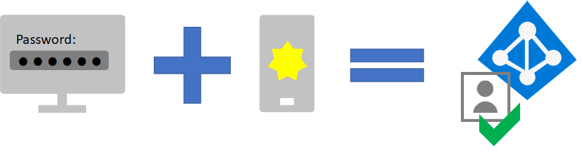

# Autenticazioni sicure degli utenti nel tenant di Microsoft 365Secure user sign-ins to your Microsoft 365 tenant

Per aumentare la sicurezza degli accessi degli utenti:To increase the security of user sign-ins:

- Usare la protezione delle password di Azure Active Directory (Azure AD)Use Azure Active Directory (Azure AD) Password Protection
- Usare l'autenticazione a più fattoriUse multi-factor authentication (MFA)
- Distribuire criteri comuni di identità e accesso ai dispositivi.Deploy identity and device access policies

## Azure AD Password ProtectionAzure AD Password Protection

La protezione delle password di Azure AD rileva e blocca le password deboli note e le loro varianti, e può anche bloccare altri elementi vulnerabili specifici delle organizzazioni.Azure AD Password Protection detects and blocks known weak passwords and their variants, and can also block additional weak terms that are specific to your organization. Gli elenchi predefiniti di password escluse globalmente sono applicate automaticamente a tutti gli utenti dei tenant di Azure AD.Default global banned password lists are automatically applied to all users in an Azure AD tenant. È possibile definire altre voci in un elenco di password escluse personalizzato.You can define additional entries in a custom banned password list. Quando gli utenti modificano o reimpostano le loro password, gli elenchi di password escluse sono controllati per applicare l'uso di password sicure.When users change or reset their passwords, these banned password lists are checked to enforce the use of strong passwords.

Per altre informazioni, vedere [Configurare la protezione delle password di protezione di Azure AD](https://docs.microsoft.com/azure/active-directory/authentication/concept-password-ban-bad).For more information, see [Configure Azure AD password protection](https://docs.microsoft.com/azure/active-directory/authentication/concept-password-ban-bad).

## MFAMFA

La MFA richiede che gli accessi utente siano soggetti a un'ulteriore verifica oltre alla password dell'account utente.MFA requires that user sign-ins be subject to an additional verification beyond the user account password. Anche se un utente malintenzionato determina una password dell'account utente, deve anche essere in grado di rispondere a un'ulteriore verifica, ad esempio un SMS inviato a uno smartphone prima che venga concesso l'accesso.Even if a malicious user determines a user account password, they must also be able to respond to an additional verification, such as a text message sent to a smartphone before access is granted.

Il primo passo per usare l'autenticazione MFA è di ***richiederla per tutti gli account amministratore***, noti anche come account privilegiati.Your first step in using MFA is to ***require it for all administrator accounts***, also known as privileged accounts.

Oltre questo primo passaggio, Microsoft raccomanda vivamente l'autenticazione a più fattori per tutti gli utenti.Beyond this first step, Microsoft strongly recommends MFA For all users.

Sono disponibili tre modi per richiedere agli amministratori o agli utenti di utilizzare la MFA in base al piano Microsoft 365.There are three ways to require your administrators or users to use MFA based on your Microsoft 365 plan.

| PianoPlan | ConsiglioRecommendation |
|---------|---------|
|Tutti i piani di Microsoft 365 (senza licenze di Azure AD Premium P1 o P2)All Microsoft 365 plans (without Azure AD Premium P1 or P2 licenses)     |[Abilitare le impostazioni predefinite di sicurezza in Azure AD](https://docs.microsoft.com/azure/active-directory/fundamentals/concept-fundamentals-security-defaults).[Enable Security defaults in Azure AD](https://docs.microsoft.com/azure/active-directory/fundamentals/concept-fundamentals-security-defaults). Le impostazioni predefinite di sicurezza in Azure AD includono la MFA per utenti e amministratori.Security defaults in Azure AD include MFA for users and administrators.   |
|Microsoft 365 E3 (include le licenze di Azure AD Premium P1)Microsoft 365 E3 (includes Azure AD Premium P1 licenses)     | Usare i [criteri comuni di accesso condizionale](https://docs.microsoft.com/azure/active-directory/conditional-access/concept-conditional-access-policy-common) per configurare i criteri seguenti:Use [Common Conditional Access policies](https://docs.microsoft.com/azure/active-directory/conditional-access/concept-conditional-access-policy-common) to configure the following policies:  - [Richiedere la MFA per amministratori](https://docs.microsoft.com/azure/active-directory/conditional-access/howto-conditional-access-policy-admin-mfa)- [Require MFA for administrators](https://docs.microsoft.com/azure/active-directory/conditional-access/howto-conditional-access-policy-admin-mfa)  - [Richiedere la MFA per tutti gli utenti](https://docs.microsoft.com/azure/active-directory/conditional-access/howto-conditional-access-policy-all-users-mfa)- [Require MFA for all users](https://docs.microsoft.com/azure/active-directory/conditional-access/howto-conditional-access-policy-all-users-mfa)   - [Bloccare l'autenticazione legacy](https://docs.microsoft.com/azure/active-directory/conditional-access/howto-conditional-access-policy-block-legacy)- [Block legacy authentication](https://docs.microsoft.com/azure/active-directory/conditional-access/howto-conditional-access-policy-block-legacy)       |
|Microsoft 365 E5 (include le licenze di Azure AD Premium P2)Microsoft 365 E5 (includes Azure AD Premium P2 licenses)     | Sfruttando Azure AD Identity Protection, iniziare a implementare il [set raccomandato di accesso condizionale e criteri correlati](../enterprise/identity-access-policies.md) di Microsoft creando questi due criteri:Taking advantage of Azure AD Identity Protection, begin to implement Microsoft's [recommended set of conditional access and related policies](../enterprise/identity-access-policies.md) by creating these two policies:  - [Richiedere la MFA quando il rischio di accesso è considerato *medio* o *elevato*](../enterprise/identity-access-policies.md#require-mfa-based-on-sign-in-risk)- [Require MFA when sign-in risk is medium or high](../enterprise/identity-access-policies.md#require-mfa-based-on-sign-in-risk)  - [Gli utenti a rischio elevato devono modificare la password](../enterprise/identity-access-policies.md#high-risk-users-must-change-password)- [High risk users must change password](../enterprise/identity-access-policies.md#high-risk-users-must-change-password)       |
| | |

### Impostazioni predefinite per la sicurezzaSecurity defaults

Le impostazioni predefinite di sicurezza sono una nuova funzionalità per gli abbonamenti a pagamento o di valutazione di Microsoft 365 e Office 365 creati dopo il 21 ottobre 2019.Security defaults is a new feature for Microsoft 365 and Office 365 paid or trial subscriptions created after October 21, 2019. Questi abbonamenti hanno impostazioni predefinite di sicurezza attivate, che ***richiedono a tutti gli utenti di utilizzare la MFA con l'app Microsoft Authenticator***.These subscriptions have security defaults turned on, which ***requires all of your users to use MFA with the Microsoft Authenticator app***.
 
Gli utenti hanno 14 giorni per registrarsi per la MFA con l'app Microsoft Authenticator dai propri smartphone, periodo che inizia dalla prima volta che accedono dopo aver abilitato le impostazioni predefinite di sicurezza.Users have 14 days to register for MFA with the Microsoft Authenticator app from their smart phones, which begins from the first time they sign in after security defaults has been enabled. Trascorsi 14 giorni, l'utente non sarà in grado di accedere fino al completamento della registrazione della MFA.After 14 days have passed, the user won't be able to sign in until MFA registration is completed.

Le impostazioni di sicurezza predefinite garantiscono che tutte le organizzazioni dispongano di un livello base di sicurezza per l'accesso degli utenti abilitato per impostazione predefinita.Security defaults ensure that all organizations have a basic level of security for user sign-in that is enabled by default. È possibile disabilitare le impostazioni predefinite di sicurezza a favore della MFA con criteri di accesso condizionale o per singoli account.You can disable security defaults in favor of MFA with Conditional Access policies or for individual accounts.

Per altre informazioni, vedere questa [panoramica delle impostazioni predefinite di sicurezza](https://docs.microsoft.com/azure/active-directory/fundamentals/concept-fundamentals-security-defaults).For more information, see this [overview of security defaults](https://docs.microsoft.com/azure/active-directory/fundamentals/concept-fundamentals-security-defaults).

### Criteri di accesso condizionaleConditional Access policies

I criteri di accesso condizionale sono un insieme di regole che specificano le condizioni in base alle quali gli accessi vengono valutati e l'accesso viene consentito.Conditional Access policies are a set of rules that specify the conditions under which sign-ins are evaluated and access is granted. Ad esempio, è possibile creare un criterio di accesso condizionale che indichi:For example, you can create a Conditional Access policy that states:

- Se il nome dell'account utente corrisponde a un membro di un gruppo per utenti a cui sono assegnati i ruoli di amministratore di Exchange, utenti, password, sicurezza, SharePoint o globale, richiedere la MFA prima di consentire l'accesso.If the user account name is a member of a group for users that are assigned the Exchange, user, password, security, SharePoint, or global administrator roles, require MFA before allowing access.

Questo criterio consente di richiedere l'autenticazione a più fattori in base all'appartenenza al gruppo, anziché configurare i singoli account utente per l'autenticazione a più fattori quando vengono assegnati o non assegnati tramite questi ruoli di amministratore.This policy allows you to require MFA based on group membership, rather than trying to configure individual user accounts for MFA when they are assigned or unassigned from these administrator roles.

È inoltre anche utilizzare i criteri di accesso condizionale per funzionalità più avanzate, come la necessità di eseguire l'accesso da un dispositivo conforme, come il proprio portatile con Windows 10.You can also use Conditional Access policies for more advanced capabilities, such as requiring that the sign-in is done from a compliant device, such as your laptop running Windows 10.

L'accesso condizionale richiede licenze di Azure AD Premium P1, che sono incluse con Microsoft 365 E3 ed E5.Conditional Access requires Azure AD Premium P1 licenses, which are included with Microsoft 365 E3 and E5.

Per altre informazioni, vedere questa [sintesi dell'accesso condizionale](https://docs.microsoft.com/azure/active-directory/conditional-access/overview).For more information, see this [overview of Conditional Access](https://docs.microsoft.com/azure/active-directory/conditional-access/overview).

### Usare questi metodi insiemeUsing these methods together

Tenere presente quanto segue:Keep the following in mind:

- Non è possibile abilitare le impostazioni predefinite di sicurezza se sono abilitati criteri di accesso condizionale.You cannot enable security defaults if you have any Conditional Access policies enabled.
- Non è possibile abilitare alcun criterio di accesso condizionale se sono abilitate le impostazioni predefinite di sicurezza.You cannot enable any Conditional Access policies if you have security defaults enabled.

Se le impostazioni predefinite di sicurezza sono abilitate, a tutti i nuovi utenti viene richiesta la registrazione della MFA e l'utilizzo dell'app Microsoft Authenticator.If security defaults are enabled, all new users are prompted for MFA registration and the use of the Microsoft Authenticator app. 

Questa tabella mostra i risultati dell'abilitazione della MFA con impostazioni predefinite di sicurezza e criteri di accesso condizionale.This table shows the results of enabling MFA with security defaults and Conditional Access policies.

| MetodoMethod | AbilitatoEnabled | DisattivatoDisabled | Metodo di autenticazione aggiuntivoAdditional authentication method |
|:-------|:-----|:-------|:-------|
| **Impostazioni predefinite per la sicurezza****Security defaults**  | Non è possibile utilizzare i criteri di accesso condizionaleCan’t use Conditional Access policies | È possibile utilizzare i criteri di accesso condizionaleCan use Conditional Access policies | App Microsoft AuthenticatorMicrosoft Authenticator app |
| **Criteri di accesso condizionale****Conditional Access policies** | Se alcuni sono abilitati, non è possibile abilitare le impostazioni predefinite per la sicurezzaIf any are enabled, you can’t enable security defaults | Se sono tutti disabilitati, è possibile abilitare le impostazioni predefinite per la sicurezzaIf all are disabled, you can enable security defaults  | Specificato dall'utente durante la registrazione della MFAUser specifies during MFA registration  |
||||

## Criteri di identità e accesso ai dispositiviIdentity and device access policies

Le impostazioni e i criteri di accesso dei dispositivi e delle identità sono funzionalità raccomandate e la loro configurazione, combinata con i criteri di accesso condizionale, Intune, e Azure AD Identity Protection, determina se una specifica richiesta di accesso debba essere accolta e a quali condizioni. Identity and device access settings and policies are recommended prerequisite features and their settings combined with Conditional Access, Intune, and Azure AD Identity Protection policies that determine whether a given access request should be granted and under what conditions. Questa determinazione è basata sull'account utente autenticato, il dispositivo usato, l'app usata dall'utente per accedere, la posizione da cui viene inviata la richiesta di accesso, e una valutazione del rischio della richiesta.This determination is based on the user account of the sign-in, the device being used, the app the user is using for access, the location from which the access request is made, and an assessment of the risk of the request. Questa funzionalità garantisce che solo gli utenti e i dispositivi autorizzati possano accedere alle risorse cruciali dell'utente.This capability helps ensure that only approved users and devices can access your critical resources.

>[!Note]
>Azure AD Identity Protection richiede licenze di Azure AD Premium P2, che sono incluse in Microsoft 365 E5.Azure AD Identity Protection requires Azure AD Premium P2 licenses, which are included with Microsoft 365 E5.
>

I criteri di identità e accesso ai dispositivi sono definiti per essere usati in tre livelli:Identity and device access policies are defined to be used in three tiers: 

- La protezione di base è il livello minimo di sicurezza per le identità e i dispositivi che accedono ad app e dati.Baseline protection is a minimum level of security for your identities and devices that access your apps and data.
- La protezione sensibile garantisce una maggiore sicurezza per dati specifici.Sensitive protection provides additional security for specific data. Le identità e i dispositivi sono soggetti a requisiti di sicurezza e integrità dei dispositivi più rigorosi.Identities and devices are subject to higher levels of security and device health requirements.
- La protezione per ambienti con dati altamente regolamentati o classificati è di solito centrata su piccole quantità di dati altamente classificati, che contengono segreti commerciali o sono sottoposti a normative sui dati.Protection for environments with highly regulated or classified data is for typically small amounts of data that are highly classified, contain trade secrets, or is subject to data regulations. Le identità e i dispositivi sono soggetti a requisiti di sicurezza e integrità dei dispositivi molto più rigorosi.Identities and devices are subject to much higher levels of security and device health requirements. 

Questi livelli, e le loro configurazioni corrispondenti, offrono livelli costanti di protezione per tutti i dati, le identità e i dispositivi.These tiers and their corresponding configurations provide consistent levels of protection across your data, identities, and devices.

Microsoft raccomanda vivamente di configurare e distribuire i criteri di identità e accesso ai dispositivi nell'organizzazione, incluse le impostazioni specifiche di Microsoft Teams, Exchange Online e SharePoint.Microsoft highly recommends configuring and rolling out identity and device access policies in your organization, including specific settings for Microsoft Teams, Exchange Online, and SharePoint. Per altre informazioni, vedere [Configurazioni di identità e accesso dei dispositivi](microsoft-365-policies-configurations.md).For more information, see [Identity and device access configurations](microsoft-365-policies-configurations.md).

<!--

## Let your users reset their own passwords

Self-Service Password Reset (SSPR) enables users to reset their own passwords without impacting IT staff. Users can quickly reset their passwords at any time and from any place. Watch [this video](https://go.microsoft.com/fwlink/?linkid=2128524) to set up SSPR.

## Sign in to SaaS apps with Azure AD

In addition to providing cloud authentication for users, Azure AD can also be your central way to secure all your apps, whether they’re on-premises, in Microsoft’s cloud, or in another cloud. By [integrating your apps into Azure AD](https://docs.microsoft.com/azure/active-directory/manage-apps/plan-an-application-integration), you can make it easy for your users to discover the applications they need and sign into them securely.

## Results of deployment of secure sign-ins

After deployment of MFA, your users:

- Are required to use MFA for sign-ins.
- Have completed the MFA registration process and are using MFA for all sign-ins.
- Can use SSPR to reset their own passwords.

- [Plan an Azure AD self-service password reset deployment](https://docs.microsoft.com/azure/active-directory/authentication/howto-sspr-deployment)

--> 

## Risorse tecniche per amministratori per MFA e autenticazioni sicureAdmin technical resources for MFA and secure sign-ins

- [MFA per Microsoft 365MFA for Microsoft 365](../admin/security-and-compliance/multi-factor-authentication-microsoft-365.md)
- [Roadmap delle identità per Microsoft 365Identity roadmap for Microsoft 365](identity-roadmap-microsoft-365.md)
- [Video di formazione su Azure Academy Azure ADAzure Academy Azure AD training videos](https://www.youtube.com/watch?v=pN8o0owHfI0&list=PL-V4YVm6AmwUFpC3rXr2i2piRQ708q_ia)
- [Configurare i criteri di registrazione dell'autenticazione a più fattori di AzureConfigure the Azure Multi-Factor Authentication registration policy](https://docs.microsoft.com/azure/active-directory/identity-protection/howto-identity-protection-configure-mfa-policy)
- [Configurazioni di identità e accesso dei dispositiviIdentity and device access configurations](microsoft-365-policies-configurations.md)

