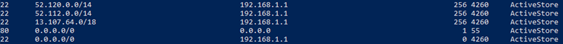

# <a name="implementing-vpn-split-tunneling-for-office-365"></a>Implementazione dello split tunneling per VPN per Office 365

>[!NOTE]
>Questo argomento fa parte di un set di argomenti relativi all'ottimizzazione di Office 365 per gli utenti remoti.
>- Per una panoramica sull'uso dello split tunneling per VPN per ottimizzare la connettività di Office 365 per gli utenti remoti, vedere [Panoramica: split tunneling per VPN per Office 365](microsoft-365-vpn-split-tunnel.md).
>- Per informazioni su come ottimizzare le prestazioni del tenant di Office 365 a livello mondiale per gli utenti della Cina, vedere [Ottimizzazione delle prestazioni di Office 365 per utenti della Cina](microsoft-365-networking-china.md).

Per molti anni, le aziende usano reti VPN per supportare esperienze remote per gli utenti. Sebbene i carichi di lavoro principali siano gestiti in locale, la rete VPN da client remoto instradata attraverso data center della rete aziendale era il metodo principale per consentire agli utenti remoti di accedere alle risorse aziendali. Per proteggere queste connessioni, le aziende creano livelli di soluzioni di sicurezza per la rete lungo percorsi VPN. Questa sicurezza è stata creata per proteggere l'infrastruttura interna e per proteggere l'esplorazione mobile di siti Web esterni tramite il reindirizzamento del traffico nella VPN e quindi attraverso il perimetro Internet locale. Le reti VPN, i perimetri di rete e l'infrastruttura di sicurezza associata sono stati spesso creati appositamente e ridimensionati per un volume di traffico definito, in genere con la maggior parte della connettività avviata dall'interno della rete aziendale e la maggior parte di essa rimane entro i limiti della rete interna.

Per un certo periodo di tempo, i modelli di VPN in cui tutte le connessioni dal dispositivo dell'utente remoto sono inoltrate nuovamente alla rete locale (fenomeno noto come **tunnelling forzato**) erano ampiamente sostenibili fintanto che il numero di utenti remoti simultanei era contenuto e i volumi di traffico che attraversavano la VPN erano bassi.  Alcuni clienti hanno continuato a usare l'imposizione del tunneling VPN come status quo, anche dopo lo spostamento delle applicazioni aziendali dall'interno del perimetro aziendale al cloud SaaS pubblico, di cui Office 365 è un esempio.

L'uso di VPN con tunneling forzato per la connessione ad applicazioni cloud distribuite e sensibili alle prestazioni è non ottimali, ma l'effetto negativo di questo potrebbe essere stato accettato da alcune aziende in modo da mantenere lo status quo dal punto di vista della sicurezza. Di seguito è illustrato un diagramma di esempio di questo scenario:


Questo problema è in crescita da molti anni, con molti clienti che segnalano un cambiamento significativo dei modelli di traffico di rete. Il traffico usato per rimanere in locale ora si connette agli endpoint cloud esterni. Molti clienti Microsoft segnalano che, in precedenza, circa l'80% del traffico di rete era associato a un'origine interna, rappresentata dalla riga punteggiata nel diagramma precedente. Nel 2020 la percentuale è scesa a meno del 20%, perché i clienti hanno spostato i principali carichi di lavoro nel cloud. Questa tendenza è comune anche ad altre aziende. Con il graduale passaggio al cloud, il modello precedente risulta sempre più lento e insostenibile e ciò impedisce alle aziende di essere agili nel loro passaggio a un ambiente cloud-first.

La crisi COVID-19 mondiale ha aggravato il problema, per cui ora è necessario un intervento immediato. La necessità di garantire la sicurezza dei dipendenti ha generato richieste senza precedenti all'IT aziendale per supportare la produttività lavorativa da casa su vasta scala. Microsoft Office 365 è ben posizionato per aiutare i clienti a soddisfare tale richiesta, ma l'elevata concorrenza degli utenti che lavorano da casa genera un grande volume di traffico di Office 365 che, se instradato attraverso VPN di tunnel forzato e perimetri di rete locali, causa una saturazione rapida ed esegue l'infrastruttura VPN fuori capacità. In questa nuova realtà, l'uso di VPN per accedere a Office 365 non è più solo un impedimento alle prestazioni, ma un muro rigido che non solo influisce su Office 365, ma anche sulle operazioni aziendali critiche che devono ancora basarsi sulla VPN per funzionare.

Microsoft collabora attivamente con i clienti e con il settore più ampio da molti anni, per offrire soluzioni efficaci e moderne a questi problemi all'interno dei propri servizi, e per allinearsi alle procedure consigliate del settore. [I principi di connettività](./microsoft-365-network-connectivity-principles.md) per il servizio Office 365 sono stati sviluppati in modo da funzionare efficientemente per gli utenti remoti, pur consentendo a un'azienda di mantenere la sicurezza e il controllo sulla connettività. Queste soluzioni possono anche essere implementate rapidamente con un lavoro limitato ma ottenere un impatto positivo significativo sui problemi descritti in precedenza.

La strategia raccomandata da Microsoft per l'ottimizzazione della connettività dei lavoratori remoti si concentra sull'alleviamento rapido dei problemi con l'approccio tradizionale e sulla fornitura di alte prestazioni in pochi semplici passaggi. Questi passaggi regolano l'approccio VPN legacy per alcuni endpoint definiti che ignorano i server VPN con colli di bottiglia. Un modello di sicurezza equivalente o addirittura superiore può essere applicato a livelli diversi per eliminare la necessità di proteggere tutto il traffico all'uscita della rete aziendale. Nella maggior parte dei casi, è possibile raggiungere questo risultato in modo efficace in poche ore, con conseguente scalabilità ad altri carichi di lavoro, come necessario e in base al tempo.

## <a name="common-vpn-scenarios"></a>Scenari VPN comuni

Nell'elenco riportato di seguito sono elencati gli scenari VPN più comuni verificatisi in ambiente aziendale. La maggior parte dei clienti gestisce tradizionalmente il modello 1 (tunnel forzato VPN). Questa sezione consente di eseguire in modo rapido e sicuro la transizione al modello **2,** che è raggiungibile con un impegno relativamente minimo e offre grandi vantaggi per le prestazioni di rete e l'esperienza utente.

| Modello | Descrizione |
| --- | --- |
| [1. Tunnel forzato VPN](#1-vpn-forced-tunnel) | Il 100% del traffico passa al tunnel VPN, tra cui locale, Internet e tutto O365/M365 |
| [2. Tunnel forzato VPN con poche eccezioni](#2-vpn-forced-tunnel-with-a-small-number-of-trusted-exceptions) | Il tunnel VPN viene usato per impostazione predefinita (la route predefinita punta alla VPN), con pochi importanti scenari che fanno eccezione e vengono eseguiti direttamente |
| [3. Tunnel forzato VPN con ampie eccezioni](#3-vpn-forced-tunnel-with-broad-exceptions) | Il tunnel VPN viene usato per impostazione predefinita (la route predefinita punta alla VPN), con ampie eccezioni eseguite direttamente (ad esempio tutte le attività Office 365, tutte le attività Salesforce e tutte le attività Zoom) |
| [4. Tunnel selettivo VPN](#4-vpn-selective-tunnel) | Il tunnel VPN viene utilizzato solo per i servizi basati su corpnet. La route predefinita (Internet e tutti i servizi basati su Internet) viene diretta. |
| [5. Nessuna VPN](#5-no-vpn) | Una variante di #2, in cui, invece della VPN legacy, tutti i servizi corpnet vengono pubblicati tramite approcci di sicurezza moderni (come Zscaler ZPA, Azure Active Directory (Azure AD) Proxy/MCAS e così via) |

### <a name="1-vpn-forced-tunnel"></a>1. Tunnel forzato VPN

Questo è lo scenario di partenza più comune per la maggior parte dei clienti aziendali. Viene utilizzata una VPN forzata, il che significa che il 100% del traffico viene indirizzato alla rete aziendale indipendentemente dal fatto che l'endpoint si trovi o meno all'interno della rete aziendale. Qualsiasi traffico esterno (Internet), ad esempio l'esplorazione di Office 365 o Internet, viene quindi bloccato di nuovo dall'attrezzatura di sicurezza locale, ad esempio proxy. Nel contesto attuale, con quasi il 100% degli utenti che lavorano in remoto, questo modello pone quindi un carico elevato sull'infrastruttura VPN ed è probabile che intralci significativamente le prestazioni di tutto il traffico aziendale e quindi l'azienda opeli in modo efficiente in un momento di crisi.


### <a name="2-vpn-forced-tunnel-with-a-small-number-of-trusted-exceptions"></a>2. Tunnel forzato VPN con numero limitato di eccezioni attendibili

Questo modello è significativamente più efficiente per un'azienda in quanto consente a pochi endpoint controllati e definiti che sono molto elevati carico e latenza sensibili per ignorare il tunnel VPN e passare direttamente al servizio Office 365 in questo esempio. In questo modo si migliorano notevolmente le prestazioni per i servizi scaricati e si riduce anche il carico sull'infrastruttura VPN, consentendo così agli elementi che richiedono ancora di operare con una minore quantità di risorse. È questo modello che questo articolo si concentra sull'assistenza nella transizione a in quanto consente di eseguire rapidamente azioni semplici e definite con numerosi risultati positivi.


### <a name="3-vpn-forced-tunnel-with-broad-exceptions"></a>3. Tunnel forzato VPN con ampie eccezioni

Il terzo modello amplia l'ambito del modello 2 invece di inviare direttamente un piccolo gruppo di endpoint definiti, ma invia tutto il traffico direttamente a servizi attendibili come Office 365 e SalesForce. Ciò consente di ridurre ulteriormente il carico sull'infrastruttura VPN aziendale e di migliorare le prestazioni dei servizi definiti. Poiché è probabile che questo modello possa richiedere più tempo per valutare la fattibilità e implementare, è probabile che sia possibile eseguire un'operazione iterativa in un secondo momento dopo che il modello 2 è stato implementato correttamente.


### <a name="4-vpn-selective-tunnel"></a>4. Tunnel selettivo VPN

Questo modello inverte il terzo modello in quanto solo il traffico identificato come avente un indirizzo IP aziendale viene inviato nel tunnel VPN e quindi il percorso Internet è la route predefinita per tutte le altre operazioni. Per implementare in sicurezza questo modello è necessario che l'organizzazione utilizzi [Zero Trust](https://www.microsoft.com/security/zero-trust?rtc=1). Tenere presente che questo modello o alcune sue varianti probabilmente acquisteranno nel tempo un carattere necessario predefinito, man mano che sempre più servizi passeranno dalla rete aziendale al cloud. Microsoft fa uso di questo modello internamente. Per altre informazioni sull'implementazione della soluzione di split tunneling per VPN di Microsoft nell'articolo [Running on VPN: How Microsoft is keeping its remote workforce connected](https://www.microsoft.com/itshowcase/blog/running-on-vpn-how-microsoft-is-keeping-its-remote-workforce-connected/?elevate-lv) (Lavorare su VPN: la soluzione Microsoft per mantenere connessa la forza lavoro remota).


### <a name="5-no-vpn"></a>5. Nessuna VPN

Una versione più avanzata del modello numero due, in base alla quale tutti i servizi interni vengono pubblicati tramite un approccio di sicurezza moderno o una soluzione SDWAN come Proxy di Azure AD, MCAS, Zscaler ZPA e così via.


## <a name="implement-vpn-split-tunneling"></a>Implementare lo split tunneling per VPN

In questa sezione sono descritti i semplici passaggi necessari per eseguire la migrazione dell'architettura client VPN da un _tunnel forzato VPN_ a un _tunnel_ forzato VPN con un numero limitato di eccezioni attendibili, modello di [split tunneling VPN #2](#2-vpn-forced-tunnel-with-a-small-number-of-trusted-exceptions) in Scenari [VPN](#common-vpn-scenarios)comuni.

Il diagramma seguente illustra come funziona la soluzione split tunneling per VPN consigliata:


### <a name="1-identify-the-endpoints-to-optimize"></a>1. Identificare gli endpoint da ottimizzare

Nell'argomento [URL e intervalli di indirizzi IP per Office 365](urls-and-ip-address-ranges.md), Microsoft identifica chiaramente i principali endpoint necessari per ottimizzarli e classificarli come **Optimize**. Al momento, è necessario ottimizzare solo quattro URL e 20 subnet IP. Questo piccolo gruppo di endpoint rappresenta circa il 70%-80% del volume di traffico nel servizio Office 365, che include endpoint sensibili alla latenza, come per i media di Teams. In sostanza, questo è il traffico di cui dobbiamo occuparci ed è anche il traffico che metterà una pressione incredibile sui percorsi di rete tradizionali e sull'infrastruttura VPN.

Gli URL di questa categoria presentano le seguenti caratteristiche:

- Sono endpoint gestiti di proprietà di Microsoft, ospitati sull'infrastruttura Microsoft
- Sono forniti di IP
- Sono caratterizzati da indicatore ROC basso che dovrebbe mantenersi tale (attualmente 20 subnet IP)
- Sono caratterizzati da sensibilità alla latenza e/o larghezza di banda
- Sono in grado di avere elementi di sicurezza richiesti forniti nel servizio piuttosto che in linea sulla rete
- Rappresentano circa il 70-80% del volume di traffico nel servizio Office 365

Per altre informazioni sugli endpoint di Office 365 e su come sono classificati e gestiti, vedere l'articolo [Gestione degli endpoint di Office 365](managing-office-365-endpoints.md).

#### <a name="optimize-urls"></a>Ottimizzazione degli URL

L'ottimizzazione degli URL corrente è disponibile nella tabella seguente. Nella maggior parte dei casi, è necessario usare solo endpoint URL in un [file PAC del browser](managing-office-365-endpoints.md#use-a-pac-file-for-direct-routing-of-vital-office-365-traffic) in cui gli endpoint sono configurati per l'invio diretto, anziché al proxy.

| Ottimizzazione degli URL | Porta/Protocollo | Finalità |
| --- | --- | --- |
| <https://outlook.office365.com> | TCP 443 | È uno degli URL principali che Outlook utilizza per connettersi al server Exchange Online e ha un elevato volume di utilizzo della larghezza di banda e di conteggio delle connessioni. La latenza della rete ridotta è necessaria per le caratteristiche online, tra cui: ricerca immediata, altri calendari delle cassette postali, ricerche nella disponibilità, gestione di regole e avvisi, archiviazione Exchange Online, invio di messaggi dalla posta in uscita. |
| <https://outlook.office.com> | TCP 443 | L'URL viene usato per la connessione di Outlook Online Web Access al server di Exchange Online, ed è sensibile alla latenza della rete. Per il caricamento e il download di file di grandi dimensioni in SharePoint Online è necessaria la connettività. |
| https:// \<tenant\> .sharepoint.com | TCP 443 | Questo è l'URL principale per SharePoint Online e ha un utilizzo a larghezza di banda elevata. |
| https:// \<tenant\> -my.sharepoint.com | TCP 443 | È l'URL principale di OneDrive for Business e offre uso della larghezza di banda elevato e possibile elevato numero di connessioni dallo strumento di sincronizzazione di OneDrive for Business. |
| IP dei media di Teams (nessun URL) | UDP 3478, 3479, 3480 e 3481 | Relay Discovery allocation and real-time traffic (3478), Audio (3479), Video (3480) e Video Screen Sharing (3481). Questi sono gli endpoint usati per il traffico multimediale di Skype for Business e Microsoft Teams (chiamate, riunioni e così via). La maggior parte degli endpoint viene specificata quando il client di Microsoft Teams stabilisce una chiamata (e vengono inclusi negli IP necessari elencati per il servizio). Per una qualità ottimale dei media, usare il protocollo UDP.   |

Negli esempi riportati sopra, sostituire il **tenant** con il nome del tenant di Office 365. Ad esempio, **contoso.onmicrosoft.com** userà _contoso.sharepoint.com_ e _contoso-my.sharepoint.com_.

#### <a name="optimize-ip-address-ranges"></a>Intervalli di indirizzi IP Optimize

Al momento della scrittura gli intervalli IP a cui corrispondono questi endpoint sono i seguenti. È **consigliabile** utilizzare uno [script](https://github.com/microsoft/Office365NetworkTools/tree/master/Scripts/Display%20URL-IPs-Ports%20per%20Category) come questo esempio, il servizio Web IP e URL di [Office 365](microsoft-365-ip-web-service.md) o la pagina [URL/IP](urls-and-ip-address-ranges.md) per verificare la disponibilità di eventuali aggiornamenti durante l'applicazione della configurazione e applicare un criterio per farlo regolarmente.

```
104.146.128.0/17
13.107.128.0/22
13.107.136.0/22
13.107.18.10/31
13.107.6.152/31
13.107.64.0/18
131.253.33.215/32
132.245.0.0/16
150.171.32.0/22
150.171.40.0/22
191.234.140.0/22
204.79.197.215/32
23.103.160.0/20
40.104.0.0/15
40.108.128.0/17
40.96.0.0/13
52.104.0.0/14
52.112.0.0/14
52.96.0.0/14
52.120.0.0/14
```

### <a name="2-optimize-access-to-these-endpoints-via-the-vpn"></a>2. Ottimizzare l'accesso agli endpoint tramite VPN

Una volta identificati gli endpoint critici, è necessario allontanarli dal tunnel VPN e consentire loro di utilizzare la connessione Internet locale dell'utente per connettersi direttamente al servizio. Il modo in cui ciò avviene varierà a seconda del prodotto VPN e della piattaforma del computer utilizzata, ma la maggior parte delle soluzioni VPN consentirà una semplice configurazione dei criteri per applicare questa logica. Per informazioni su split tunneling specifico per piattaforme VPN, vedere [PROCEDURE per le piattaforme VPN più comuni](#howto-guides-for-common-vpn-platforms).

Se si desidera testare manualmente la soluzione, eseguire il seguente esempio di PowerShell per emulare la soluzione a livello di tabella di route. Questo esempio aggiunge una route per ognuna delle subnet IP del traffico multimediale di Teams nella tabella di route. È possibile testare le prestazioni del traffico multimediale di Teams prima e dopo e osservare la differenza nelle route per gli endpoint specificati.

#### <a name="example-add-teams-media-ip-subnets-into-the-route-table"></a>Esempio - Come aggiungere subnet IP al traffico multimediale di Teams nella tabella di route

```powershell
$intIndex = "" # index of the interface connected to the internet
$gateway = "" # default gateway of that interface
$destPrefix = "52.120.0.0/14", "52.112.0.0/14", "13.107.64.0/18" # Teams Media endpoints
# Add routes to the route table
foreach ($prefix in $destPrefix) {New-NetRoute -DestinationPrefix $prefix -InterfaceIndex $intIndex -NextHop $gateway}
```

Nello script in alto, _$intIndex_ è l'indice dell'interfaccia connessa a Internet (che è possibile individuare eseguendo **get-netadapter** in PowerShell; cercare il valore di _ifIndex_) e _$gateway_ è il gateway predefinito di tale interfaccia (che è possibile individuare eseguendo **ipconfig** a un prompt dei comandi o **(Get-NetIPConfiguration | Foreach IPv4DefaultGateway).NextHop** in PowerShell).

Una volta aggiunte le route, è possibile confermare che la tabella di route è corretta, eseguendo **Route Print** a un prompt dei comandi o PowerShell. L'output deve contenere i percorsi aggiunti, con l'indice dell'interfaccia (_22_ nell'esempio riportato) e il gateway per quell'interfaccia (_192.168.1.1_ nell'esempio riportato):



Per aggiungere route a **tutti** gli intervalli di indirizzi IP correnti nella categoria Optimize, è possibile usare la seguente variante di script per interrogare l'[IP di Office 365 e il servizio Web dell'URL](microsoft-365-ip-web-service.md) per il set corrente delle subnet IP Optimize e aggiungerle alla tabella di route.

#### <a name="example-add-all-optimize-subnets-into-the-route-table"></a>Esempio - Come aggiungere tutte le subnet Optimize nella tabella di route

```powershell
$intIndex = "" # index of the interface connected to the internet
$gateway = "" # default gateway of that interface
# Query the web service for IPs in the Optimize category
$ep = Invoke-RestMethod ("https://endpoints.office.com/endpoints/worldwide?clientrequestid=" + ([GUID]::NewGuid()).Guid)
# Output only IPv4 Optimize IPs to $optimizeIps
$destPrefix = $ep | where {$_.category -eq "Optimize"} | Select-Object -ExpandProperty ips | Where-Object { $_ -like '*.*' }
# Add routes to the route table
foreach ($prefix in $destPrefix) {New-NetRoute -DestinationPrefix $prefix -InterfaceIndex $intIndex -NextHop $gateway}
```

Se sono state inavvertitamente aggiunte route con parametri non corretti o se si vuole semplicemente annullare le modifiche, è possibile rimuovere le route appena aggiunte con il comando seguente:

```powershell
foreach ($prefix in $destPrefix) {Remove-NetRoute -DestinationPrefix $prefix -InterfaceIndex $intIndex -NextHop $gateway}
```

<!--- remmed until we add more reliable interface selection logic
#### Example script to add Teams Media subnets to the route table

```powershell
$adapter = get-netadapter | ? {$_.Status -eq "Up"}
$adapterIndex = $adapter.ifIndex
$gateway = (Get-NetIPConfiguration | Foreach IPv4DefaultGateway).NextHop

$destPrefix = "52.120.0.0/14", "52.112.0.0/14", "13.107.64.0/18"
foreach ($prefix in $destPrefix) {New-NetRoute -DestinationPrefix $prefix -InterfaceIndex $intIndex -NextHop $gateway}
```
-->

Il client VPN deve essere configurato in modo che il traffico verso gli IP **Optimize** venga instradato in questo modo. In questo modo il traffico può utilizzare risorse Microsoft locali, come le porte anteriori del servizio Office 365, ad esempio [la porta](https://azure.microsoft.com/blog/azure-front-door-service-is-now-generally-available/) anteriore di Azure che fornisce servizi di Office 365 ed endpoint di connettività il più vicino possibile agli utenti. Questo ci consente di offrire livelli di prestazioni elevate agli utenti ovunque si trovano nel mondo e sfrutta al meglio la rete globale di livello mondiale di Microsoft, che è probabile entro pochi millisecondi [dall'uscita](https://azure.microsoft.com/blog/how-microsoft-builds-its-fast-and-reliable-global-network/)diretta degli utenti.

## <a name="configuring-and-securing-teams-media-traffic"></a>Configurazione e protezione del traffico multimediale di Teams

Alcuni amministratori potrebbero richiedere informazioni più dettagliate sul funzionamento dei flussi delle chiamate in Teams tramite un modello di split tunneling e sulla protezione delle connessioni.

### <a name="configuration"></a>Configurazione

Per le chiamate e le riunioni, purché le subnet IP optimize necessarie per i supporti di Teams siano correttamente presenti nella tabella di route, quando Teams chiama la funzione [GetBestRoute](/windows/win32/api/iphlpapi/nf-iphlpapi-getbestroute) per determinare quale interfaccia locale corrisponde alla route da utilizzare per una determinata destinazione, l'interfaccia locale verrà restituita per le destinazioni Microsoft nei blocchi IP Microsoft elencati in precedenza.

Alcuni software client VPN consentono di modificare il routing in base all'URL. Tuttavia, il traffico multimediale di Teams non ha alcun URL associato, quindi il controllo del routing per questo traffico deve essere eseguito con subnet IP.

In alcuni scenari, spesso non correlati alla configurazione del client Teams, il traffico multimediale continua ad attraversare il tunnel VPN anche con le route corrette applicate. Se si verifica questo scenario, è sufficiente usare una regola del firewall per impedire alle subnet o alle porte IP di Teams di utilizzare la vpn.

>[!IMPORTANT]
>Per garantire che il traffico multimediale di Teams sia instradato tramite il metodo desiderato in tutti gli scenari VPN, verificare che gli utenti esercitino la versione client di Microsoft Teams **1.3.00.13565** o successiva. Questa versione include miglioramenti nel modo in cui il client rileva i percorsi di rete disponibili.

Il traffico di segnalazione viene eseguito su HTTPS e non è  sensibile alla latenza come il traffico multimediale ed è contrassegnato come Consenti nei dati URL/IP e quindi può essere instradato in modo sicuro attraverso il client VPN, se lo si desidera.

### <a name="security"></a>Sicurezza

Un valido motivo per evitare split tunnel è l'inferiore livello di sicurezza. Ad esempio tutto il traffico che non attraversa tunnel VPN non trarrà vantaggi dallo schema di crittografia applicato al tunnel VPN, pertanto sarà meno sicuro.

D'altra parte il traffico multimediale è già crittografato tramite il _protocollo di controllo per RTP sicuro (SRTP)_, un profilo RTP che garantisce riservatezza, autenticazione e la protezione da attacchi replay al traffico RTP. SRTP si basa su una chiave della sessione generata casualmente, che viene scambiata tramite il canale di segnalazione sicuro TLS. L'argomento è ampiamente trattato in questa [guida sulla sicurezza](/skypeforbusiness/optimizing-your-network/security-guide-for-skype-for-business-online), tuttavia la sezione di maggiore interesse è la crittografia multimediale.

Il traffico multimediale viene crittografato con SRTP, che usa una chiave della sessione generata da un generatore di numeri casuale e scambiata tramite il canale di segnalazione TLS. Inoltre, il flusso multimediale in entrambe le direzioni tra Mediation Server e il successivo hop interno è anche crittografato tramite SRTP.

Skype for Business Online genera nome utente/password per l'accesso sicuro ai relay multimediali attraverso il protocollo _Traversal Using Relays around NAT (TURN)_. I relay dei file multimediali scambiano nome utente/password su un canale SIP protetto da TLS. Vale la pena notare che anche se un tunnel VPN può essere utilizzato per connettere il client alla rete aziendale, il traffico deve ancora fluire nella sua forma SRTP quando lascia la rete aziendale per raggiungere il servizio.

Le informazioni su come Teams attenua i problemi di sicurezza comuni, ad esempio gli attacchi di amplificazione _STUN (Session Traversal Utilities for NAT),_ sono disponibili in [5.1 Considerazioni](/openspecs/office_protocols/ms-ice2/69525351-8c68-4864-b8a6-04bfbc87785c)sulla sicurezza per gli implementatori.

Informazioni sui moderni controlli di sicurezza negli scenari di lavoro remoto nella pagina [Modi alternativi per i professionisti della sicurezza e l'IT per ottenere moderni controlli di sicurezza nei particolari scenari odierni di lavoro remoto (blog del team di sicurezza di Microsoft)](https://www.microsoft.com/security/blog/2020/03/26/alternative-security-professionals-it-achieve-modern-security-controls-todays-unique-remote-work-scenarios/)

## <a name="testing"></a>Test

Una volta applicati i criteri, è consigliabile verificare che funzionino come previsto. Esistono diversi modi per verificare se il percorso è impostato correttamente per l'uso della connessione Internet locale:

- Eseguire il test di connettività di [Microsoft 365](https://aka.ms/netonboard) che eseguirà test di connettività per l'utente, incluse le route di traccia come sopra. Stiamo anche aggiungendo test VPN a questo strumento che dovrebbe anche fornire ulteriori informazioni dettagliate.

- Una semplice applicazione tracert per un endpoint nell'ambito dello split tunnel mostrerà il percorso intrapreso, ad esempio:

  ```powershell
  tracert worldaz.tr.teams.microsoft.com
  ```

  Dovrebbe quindi essere visualizzato un percorso tramite l'ISP locale a questo endpoint che deve essere risolto in un INDIRIZZO IP negli intervalli di Teams configurati per lo split tunneling.

- Effettuare un'acquisizione di rete utilizzando uno strumento come Wireshark. Filtrare su UDP durante una chiamata per vedere il traffico che fluisce verso un IP nell'intervallo **Optimize** di Teams. Se il tunnel VPN viene utilizzato per questo traffico, il traffico multimediale non sarà visibile nella traccia.

### <a name="additional-support-logs"></a>Altri log di supporto

Se servono altre informazioni per la risoluzione dei problemi o per richiede l'assistenza del supporto Microsoft, è possibile ottenere le informazioni seguenti per accelerare l'individuazione di una soluzione. Il set di strumenti **universal TroubleShooting Script** universale basato su CMD di Microsoft supportare Microsoft può aiutarti a raccogliere i log rilevanti in modo semplice. Lo strumento e le istruzioni per l'uso sono disponibili in <https://aka.ms/TssTools.>

## <a name="howto-guides-for-common-vpn-platforms"></a>PROCEDURE per le piattaforme VPN più comuni

Questa sezione contiene collegamenti a guide dettagliate per l'implementazione dello split tunneling per il traffico di Office 365 dai partner più comuni in questo spazio. Ulteriori guide verranno aggiunte non appena rese disponibili.

- **Client VPN per Windows 10**: [ottimizzazione del traffico di Office 365 per i lavoratori remoti con il client VPN di Windows 10 nativo](/windows/security/identity-protection/vpn/vpn-office-365-optimization)
- **Cisco Anyconnect**: [Optimize Anyconnect Split Tunnel per Office365](https://www.cisco.com/c/en/us/support/docs/security/anyconnect-secure-mobility-client/215343-optimize-anyconnect-split-tunnel-for-off.html)
- **Palo Alto GlobalProtect**: [Optimizing Office 365 Traffic via VPN Split Tunnel Exclude Access Route](https://live.paloaltonetworks.com/t5/Prisma-Access-Articles/GlobalProtect-Optimizing-Office-365-Traffic/ta-p/319669)
- **F5 Networks BIG-IP APM**: [Optimizing Office 365 traffic on Remote Access through VPNs when using BIG-IP APM](https://devcentral.f5.com/s/articles/SSL-VPN-Split-Tunneling-and-Office-365)
- **Gateway Citrix**: [ottimizzare lo split tunneling per VPN del gateway Citrix per Office365](https://docs.citrix.com/en-us/citrix-gateway/13/optimizing-citrix-gateway-vpn-split-tunnel-for-office365.html)
- **Pulse Secure**: [Tunneling VPN: come configurare lo split tunneling in modo da escludere le applicazioni Office365](https://kb.pulsesecure.net/articles/Pulse_Secure_Article/KB44417)
- **Check Point VPN**: [Come configurare split tunnel per Office 365 e altre applicazioni SaaS](https://supportcenter.checkpoint.com/supportcenter/portal?eventSubmit_doGoviewsolutiondetails=&solutionid=sk167000)

## <a name="faq"></a>Domande frequenti

Il team microsoft [](https://www.microsoft.com/security/blog/2020/03/26/alternative-security-professionals-it-achieve-modern-security-controls-todays-unique-remote-work-scenarios/) per la sicurezza ha pubblicato un articolo che descrive i modi chiave per i professionisti della sicurezza e l'IT può ottenere controlli di sicurezza moderni negli scenari di lavoro remoto unici di oggi. Inoltre, di seguito sono riportate alcune delle domande e risposte più comuni su questo argomento.

### <a name="how-do-i-stop-users-accessing-other-tenants-i-do-not-trust-where-they-could-exfiltrate-data"></a>Come si può impedire agli utenti di accedere ad altri tenant considerati non attendibili dove sussiste la possibilità di esfiltrazione dei dati?

La risposta è rappresentata da una [funzionalità denominata Restrizioni del tenant](/azure/active-directory/manage-apps/tenant-restrictions). Il traffico di autenticazione non è intenso né è particolarmente sensibile alla latenza, quindi può essere inviato tramite la soluzione VPN al proxy locale in cui viene applicata la funzionalità. Un elenco consenti di tenant attendibili viene mantenuto qui e se il client tenta di ottenere un token per un tenant non attendibile, il proxy semplicemente nega la richiesta. Se il tenant è considerato attendibile, un token è accessibile se l'utente dispone delle credenziali e dei diritti giusti.

Pertanto, anche se un utente può effettuare una connessione TCP/UDP agli endpoint contrassegnati in precedenza optimize, senza un token valido per accedere al tenant in questione, non può semplicemente accedere e accedere/spostare i dati.

### <a name="does-this-model-allow-access-to-consumer-services-such-as-personal-onedrive-accounts"></a>Questo modello consente l'accesso ai servizi privati, come account di OneDrive personali?

No. Gli endpoint di Office 365 non sono gli stessi dei servizi consumer (ad esempio Onedrive.live.com), quindi lo split tunnel non consentirà a un utente di accedere direttamente ai servizi consumer. Il traffico verso gli endpoint consumer continuerà a usare il tunnel VPN e i criteri esistenti continueranno a essere applicati.

### <a name="how-do-i-apply-dlp-and-protect-my-sensitive-data-when-the-traffic-no-longer-flows-through-my-on-premises-solution"></a>Come si applicano i criteri di prevenzione della perdita dei dati e come si possono proteggere i dati sensibili quando il traffico non fluisce più nella soluzione locale?

Per evitare la divulgazione accidentale di informazioni riservate, Office 365 include un set completo di [strumenti predefiniti](../compliance/data-loss-prevention-policies.md). È possibile usare le [funzionalità DLP](../compliance/data-loss-prevention-policies.md) predefinite di Teams e SharePoint per rilevare informazioni riservate archiviate o condivise in modo non appropriato. Se parte della strategia di lavoro remoto prevede un criterio BYOD (Bring-Your-Own-Device), puoi usare l'accesso condizionale basato su [app](/azure/active-directory/conditional-access/app-based-conditional-access) per impedire il download di dati sensibili nei dispositivi personali degli utenti

### <a name="how-do-i-evaluate-and-maintain-control-of-the-users-authentication-when-they-are-connecting-directly"></a>Come si può valutare e mantenere il controllo dell'autenticazione dell'utente quando la connessione avviene direttamente?

Oltre alla funzionalità Restrizioni del tenant indicata nel primo trimestre, [i criteri di accesso condizionale](/azure/active-directory/conditional-access/overview) possono essere applicati per valutare in modo dinamico il rischio di una richiesta di autenticazione e rispondere in modo appropriato. Microsoft consiglia di implementare il [modello Zero Trust](https://www.microsoft.com/security/zero-trust?rtc=1) nel tempo ed è possibile usare i criteri di accesso condizionale di Azure AD per mantenere il controllo in un ambiente mobile-first cloud-first. È possibile usare i criteri di accesso condizionale per decidere in tempo reale se una richiesta di autenticazione sia riuscita in base a numerosi fattori, ad esempio:

- Dispositivo - Il dispositivo è noto/attendibile/aggiunto a un dominio?
- IP - La richiesta di autenticazione proviene da un indirizzo IP aziendale noto? O proviene da un paese non attendibile?
- Applicazione - L'utente è autorizzato a usare l'applicazione?

Possiamo quindi attivare criteri per approvare, attivare MFA o bloccare l'autenticazione in base a questi criteri.

### <a name="how-do-i-protect-against-viruses-and-malware"></a>Come proteggersi da virus e malware?

Anche in questo caso, Office 365 garantisce la protezione per gli endpoint contrassegnati come Optimize in vari livelli del servizio, [come descritto nel presente documento](/office365/Enterprise/office-365-malware-and-ransomware-protection). Come detto, è notevolmente più efficiente fornire questi elementi di sicurezza nel servizio stesso anziché tentare di farlo in linea con i dispositivi che potrebbero non comprendere completamente i protocolli/traffico. Per impostazione predefinita, SharePoint Online [analizza automaticamente i caricamenti di file](../security/office-365-security/virus-detection-in-spo.md) per individuare malware noto

Per gli endpoint di Exchange elencati in precedenza, [Exchange Online Protection](/office365/servicedescriptions/exchange-online-protection-service-description/exchange-online-protection-service-description) e Microsoft Defender per Office [365](/office365/servicedescriptions/office-365-advanced-threat-protection-service-description) offrono un ottimo lavoro per garantire la sicurezza del traffico verso il servizio.

### <a name="can-i-send-more-than-just-the-optimize-traffic-direct"></a>È possibile inviare più del traffico Optimize diretto?

La priorità dovrebbe essere assegnata agli endpoint contrassegnati come **Optimize**, per ottenere il massimo vantaggio per un livello basso di lavoro. Tuttavia, se si desidera, gli endpoint contrassegnati Consenti sono necessari per il funzionamento del servizio e hanno indirizzi IP forniti per gli endpoint che possono essere utilizzati se necessario.

Esistono anche diversi fornitori che offrono soluzioni proxy/sicurezza basate su cloud denominate _gateway Web_ sicuri che forniscono sicurezza centrale, controllo e applicazione di criteri aziendali per l'esplorazione generale del Web. Queste soluzioni possono funzionare bene in un primo mondo cloud, se altamente disponibile, performante ed eseguito il provisioning vicino agli utenti, consentendo l'accesso a Internet sicuro da una posizione basata su cloud vicino all'utente. In questo modo si rimuove la necessità di hairpinning attraverso la rete VPN/aziendale per il traffico di navigazione generale, pur consentendo comunque il controllo di sicurezza centrale.

Anche se queste soluzioni sono già attuate, Microsoft consiglia vivamente che il traffico Office 365 contrassegnato come Optimize venga indirizzato direttamente al servizio.

Per informazioni su come consentire l'accesso diretto a una rete virtuale di Azure, vedere l'articolo [Lavoro remoto tramite il gateway VPN di Azure da punto a sito](/azure/vpn-gateway/work-remotely-support).

### <a name="why-is-port-80-required-is-traffic-sent-in-the-clear"></a>Perché è necessaria la porta 80? Il traffico è inviato con crittografia?

La porta 80 viene usata solo per operazioni come il reindirizzamento a una sessione della porta 443. Nessun dato dei clienti viene inviato o è accessibile sulla porta 80. [La](../compliance/encryption.md) crittografia delinea la crittografia per i dati in transito [](/microsoftteams/microsoft-teams-online-call-flows#types-of-traffic) e in pausa per Office 365 e Tipi di traffico descrive come viene utilizzato SRTP per proteggere il traffico multimediale di Teams.

### <a name="does-this-advice-apply-to-users-in-china-using-a-worldwide-instance-of-office-365"></a>Ciò è valido anche per gli utenti della Cina che usano un'istanza mondiale di Office 365?

**No**, non lo è. L'unica precisazione sul consiglio riportato riguarda gli utenti della Cina che si connettono a un'istanza mondiale di Office 365. A causa del frequente verificarsi della congestione della rete nell'area geografica, le prestazioni di uscita Internet diretta possono essere variabili. La maggior parte dei clienti dell'area geografica usa una VPN per portare il traffico nella rete aziendale e usa il circuito MPLS autorizzato, o soluzione analoga, per l'uscita all'esterno del paese con un percorso ottimizzato. Questo argomento è descritto più avanti nell'articolo [Ottimizzazione delle prestazioni di Office 365 per utenti della Cina](microsoft-365-networking-china.md).

### <a name="does-split-tunnel-configuration-work-for-teams-running-in-a-browser"></a>La configurazione split tunnel funziona per Teams in esecuzione in un browser?

Sì, tramite i browser supportati, elencati in [Ottenere client per Microsoft Teams.](https://docs.microsoft.com/microsoftteams/get-clients#web-client)

## <a name="related-topics"></a>Argomenti correlati

[Panoramica: split tunneling per VPN per Office 365](microsoft-365-vpn-split-tunnel.md)

[Ottimizzazione delle prestazioni di Office 365 per utenti della Cina](microsoft-365-networking-china.md)

[Modi alternativi per i professionisti della sicurezza e l'IT per ottenere moderni controlli di sicurezza nei particolari scenari odierni di lavoro remoto (blog del team di sicurezza di Microsoft)](https://www.microsoft.com/security/blog/2020/03/26/alternative-security-professionals-it-achieve-modern-security-controls-todays-unique-remote-work-scenarios/)

[Ottimizzazione delle prestazioni VPN in Microsoft: usare i profili VPN di Windows 10 per consentire connessioni automatiche](https://www.microsoft.com/itshowcase/enhancing-remote-access-in-windows-10-with-an-automatic-vpn-profile)

[Esecuzione del servizio VPN: la soluzione Microsoft per mantenere connessa la forza lavoro remota](https://www.microsoft.com/itshowcase/blog/running-on-vpn-how-microsoft-is-keeping-its-remote-workforce-connected/?elevate-lv)

[Principi della connettività di rete di Office 365](microsoft-365-network-connectivity-principles.md)

[Valutazione della connettività di rete di Office 365](assessing-network-connectivity.md)

[Ottimizzazione delle prestazioni e della rete di Office 365](network-planning-and-performance.md)
