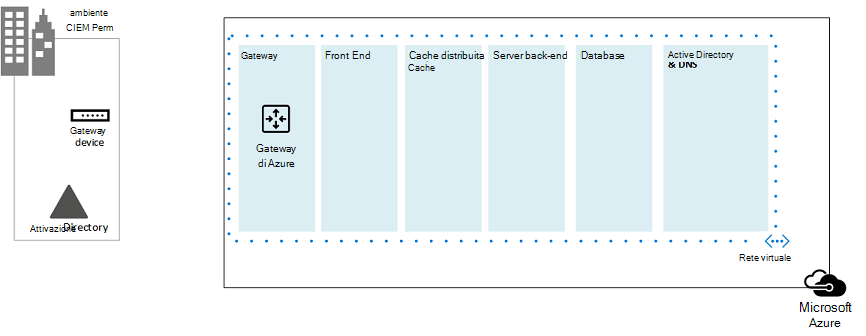
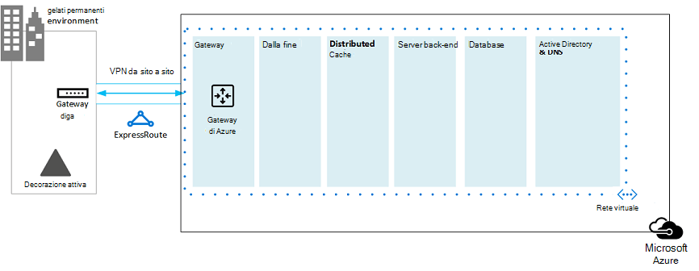
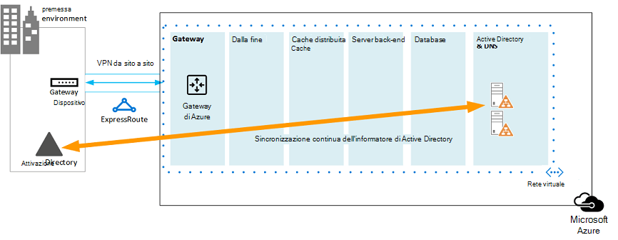
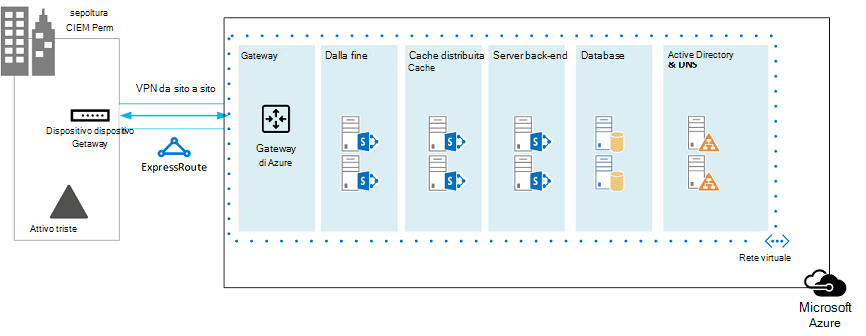
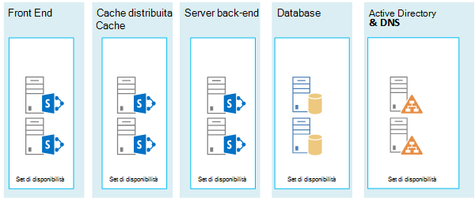
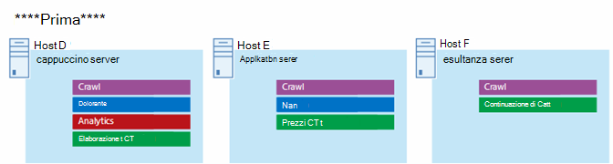
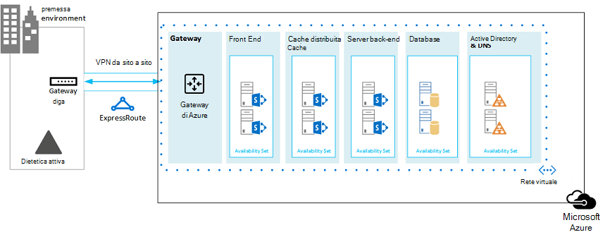

# Microsoft Azure Architectures for SharePoint 2013

Azure è un ambiente ideale per ospitare una soluzione SharePoint Server 2013. Nella maggior parte dei casi, è consigliabile Microsoft 365, ma una farm di SharePoint Server ospitata in Azure può essere una buona opzione per soluzioni specifiche. In questo articolo viene descritto come architettare le soluzioni SharePoint in modo che siano adatte alla piattaforma Azure. Come esempi vengono utilizzate le due soluzioni specifiche seguenti:
  
- [Ripristino di emergenza di SharePoint Server 2013 in Microsoft Azure](sharepoint-server-2013-disaster-recovery-in-microsoft-azure.md)
    
- [Siti Internet in Microsoft Azure che utilizzano SharePoint Server 2013](internet-sites-in-microsoft-azure-using-sharepoint-server-2013.md)
    
## Soluzioni di SharePoint consigliate per Servizi infrastruttura di Azure

I servizi di infrastruttura di Azure sono un'opzione interessante per ospitare soluzioni SharePoint. Alcune soluzioni sono più adatte a questa piattaforma rispetto ad altre. Nella tabella seguente vengono illustrate le soluzioni consigliate.
  
|**Soluzione**|**Perché questa soluzione è consigliata per Azure**|
|:-----|:-----|
|Ambienti di sviluppo e test    |È facile creare e gestire questi ambienti.    |
|Ripristino di emergenza delle farm di SharePoint locali in Azure    |**Datacenter secondario ospitato** Usare Azure invece di investire in un datacenter secondario in un'area diversa.   **Ambienti di ripristino di emergenza a basso costo** Gestire e pagare un numero inferiore di risorse rispetto a un ambiente di ripristino di emergenza locale. Il numero di risorse dipende dall'ambiente di ripristino di emergenza scelto: cold standby, warm standby o hot standby.   **Piattaforma più elastica** In caso di emergenza, eseguire facilmente la scalabilità orizzontale della farm di SharePoint di ripristino per soddisfare i requisiti di carico. Ridurre quando la risorsa non è più necessaria.   Vedere Ripristino di emergenza di [SharePoint Server 2013 in Microsoft Azure](sharepoint-server-2013-disaster-recovery-in-microsoft-azure.md).    |
|Siti con connessione Internet che utilizzano funzionalità e scalabilità non disponibili in Microsoft 365    |**Concentrare gli sforzi** Concentrarsi sulla creazione di un sito eccezionale anziché sulla creazione di un'infrastruttura.   **Sfruttare l'elasticità in Azure** Ridimensionare la farm per la richiesta aggiungendo nuovi server e pagare solo per le risorse necessarie. L'allocazione dinamica del computer non è supportata (ridimensionamento automatico).   **Usare Azure Active Directory (AD)** Sfruttare Azure AD per gli account dei clienti.   **Aggiungere funzionalità di SharePoint non disponibili in Microsoft 365** Aggiungere report approfonditi e analisi Web.   Vedere [Siti Internet in Microsoft Azure con SharePoint Server 2013.](internet-sites-in-microsoft-azure-using-sharepoint-server-2013.md)    |
|App farm per supportare microsoft 365 o ambienti locali    |**Creare, testare e ospitare app** in Azure per supportare ambienti locali e cloud.   **Ospitare questo ruolo** in Azure invece di acquistare nuovo hardware per ambienti locali.   |
   
Per le soluzioni e i carichi di lavoro intranet e di collaborazione, prendere in considerazione le opzioni seguenti:
  
- Determinare se Microsoft 365 soddisfa i requisiti aziendali o può far parte della soluzione. Microsoft 365 offre un set di funzionalità aggiornato.
    
- Se Microsoft 365 non soddisfa tutti i requisiti aziendali, prendere in considerazione un'implementazione standard di SharePoint 2013 in locale da Microsoft Consulting Services (MCS). Un'architettura standard può essere una soluzione più rapida, più conveniente e più facile da supportare rispetto a una soluzione personalizzata. 
    
- Se un'implementazione standard non soddisfa i requisiti aziendali, prendere in considerazione una soluzione locale personalizzata.
    
- Se l'uso di una piattaforma cloud è importante per i requisiti aziendali, prendere in considerazione un'implementazione standard o personalizzata di SharePoint 2013 ospitata nei servizi di infrastruttura di Azure. Le soluzioni SharePoint sono molto più facili da supportare in Azure rispetto ad altre piattaforme cloud pubbliche Microsoft non native.
    
## Prima di progettare l'ambiente Azure

Anche se in questo articolo vengono utilizzate topologie di SharePoint di esempio, è possibile utilizzare questi concetti di progettazione con qualsiasi topologia di farm di SharePoint. Prima di progettare l'ambiente Azure, utilizzare le indicazioni seguenti su topologia, architettura, capacità e prestazioni per progettare la farm di SharePoint:
  
- [Progettazione dell'architettura per i professionisti IT di SharePoint 2013](/SharePoint/technical-reference/technical-diagrams)
    
- [Pianificare la gestione delle prestazioni e della capacità in SharePoint Server 2013](/SharePoint/administration/performance-planning-in-sharepoint-server-2013)
    
## Determinare il tipo di dominio di Active Directory

Ogni farm di SharePoint Server si basa su Active Directory per fornire account amministrativi per l'installazione della farm. Al momento, sono disponibili due opzioni per le soluzioni SharePoint in Azure. Queste informazioni sono descritte nella tabella seguente.
  
|**Opzione**|**Descrizione**|
|:-----|:-----|
|Dominio dedicato    |È possibile distribuire un dominio Active Directory dedicato e isolato in Azure per supportare la farm di SharePoint. Questa è una buona scelta per i siti Internet pubblici.    |
|Estendere il dominio locale tramite una connessione cross-premise    |Quando si estende il dominio locale tramite una connessione cross-premise, gli utenti accedono alla farm di SharePoint tramite la rete Intranet come se fosse ospitato in locale. È possibile sfruttare l'implementazione di Active Directory e DNS locale.    È necessaria una connessione cross-premise per la creazione di un ambiente di ripristino di emergenza in Azure per il failover dalla farm locale.    |
   
In questo articolo sono inclusi concetti di progettazione per l'estensione del dominio locale tramite una connessione cross-premise. Se la soluzione usa un dominio dedicato, non è necessaria una connessione cross-premise.
  
## Progettare la rete virtuale

Prima di tutto è necessaria una rete virtuale in Azure, che include subnet in cui verranno posizionate le macchine virtuali. La rete virtuale necessita di uno spazio di indirizzi IP privato, parti delle quali vengono assegnate alle subnet.
  
Se si estende la rete locale ad Azure tramite una connessione cross-premise (necessaria per un ambiente di ripristino di emergenza), è necessario scegliere uno spazio di indirizzi privato non già in uso altrove nella rete dell'organizzazione, che può includere l'ambiente locale e altre reti virtuali di Azure. 
  
**Figura 1: ambiente locale con una rete virtuale in Azure**

  
In questo diagramma:
  
- Una rete virtuale in Azure viene illustrata affiancata all'ambiente locale. I due ambienti non sono ancora connessi tramite una connessione cross-premise, che può essere una connessione VPN da sito a sito o ExpressRoute.
    
- A questo punto, la rete virtuale include solo le subnet e nessun altro elemento architettonico. Una subnet ospiterà il gateway di Azure e altre subnet ospiteranno i livelli della farm di SharePoint, con un'altra per Active Directory e DNS.
    
## Aggiungere connettività cross-premise

Il passaggio di distribuzione successivo consiste nel creare la connessione cross-premise (se applicabile alla soluzione). Per le connessioni cross-premise, un gateway di Azure si trova in una subnet gateway separata, che è necessario creare e assegnare uno spazio indirizzo. 
  
Quando si pianifica una connessione cross-premise, si definisce e si crea un gateway di Azure e una connessione a un dispositivo gateway locale.
  
**Figura 2: utilizzo di un gateway di Azure e di un dispositivo gateway locale per fornire la connettività da sito a sito tra l'ambiente locale e Azure**

  
In questo diagramma:
  
- Aggiungendo al diagramma precedente, l'ambiente locale è connesso alla rete virtuale di Azure tramite una connessione cross-premise, che può essere una connessione VPN da sito a sito o ExpressRoute.
    
- Un gateway di Azure si trova in una subnet gateway.
    
- L'ambiente locale include un dispositivo gateway, ad esempio un router o un server VPN.
    
Per ulteriori informazioni su come pianificare e creare una rete virtuale cross-premise, vedere [Connect an on-premises network to a Microsoft Azure virtual network](connect-an-on-premises-network-to-a-microsoft-azure-virtual-network.md).
  
## Aggiungere Servizi di dominio Active Directory (AD DS) e DNS

Per il ripristino di emergenza in Azure, si distribuiscono Windows Server AD e DNS in uno scenario ibrido in cui Windows Server AD viene distribuito sia in locale che nelle macchine virtuali di Azure.
  
**Figura 3: configurazione del dominio di Active Directory ibrido**

  
Questo diagramma si basa sui diagrammi precedenti aggiungendo due macchine virtuali a una subnet DNS e Windows Server AD. Queste macchine virtuali sono controller di dominio di replica e server DNS. Si tratta di un'estensione dell'ambiente Windows Server AD locale. 
  
Nella tabella seguente vengono forniti suggerimenti di configurazione per queste macchine virtuali in Azure. Usali come punto di partenza per progettare il tuo ambiente, anche per un dominio dedicato in cui l'ambiente Azure non comunica con l'ambiente locale.
  
|**Elemento**|**Configurazione**|
|:-----|:-----|
|Dimensioni della macchina virtuale in Azure    |Dimensioni A1 o A2 nel livello Standard    |
|Sistema operativo    |Windows Server 2012 R2    |
|Ruolo Active Directory    |Controller di dominio di Servizi di dominio Active Directory designato come server di catalogo globale. Questa configurazione riduce il traffico in uscita attraverso la connessione cross-premise.    In un ambiente multidominio con alte velocità di modifica (questo non è comune), configurare i controller di dominio in locale per non eseguire la sincronizzazione con i server di catalogo globale in Azure, per ridurre il traffico di replica.    |
|Ruolo DNS    |Installare e configurare il servizio Server DNS nei controller di dominio.    |
|Dischi dati    |Posizionare il database, i registri e SYSVOL di Active Directory su altri dischi dati di Azure. Non collocare questi dischi nel disco del sistema operativo o nei dischi temporanei forniti da Azure.    |
|Indirizzi IP    |Utilizzare indirizzi IP statici e configurare la rete virtuale per assegnare questi indirizzi alle macchine virtuali nella rete virtuale dopo la configurazione dei controller di dominio.    |
   
> [!IMPORTANT]
> Prima di distribuire Active Directory in Azure, leggere Linee guida per [la distribuzione di Windows Server Active Directory nelle macchine virtuali di Azure.](/windows-server/identity/ad-ds/introduction-to-active-directory-domain-services-ad-ds-virtualization-level-100) Queste informazioni consentono di determinare se per la soluzione sono necessarie un'architettura diversa o impostazioni di configurazione diverse. 
  
## Aggiungere la farm di SharePoint

Posizionare le macchine virtuali della farm di SharePoint in livelli nelle subnet appropriate.
  
**Figura 4: posizionamento delle macchine virtuali di SharePoint**

  
Questo diagramma si basa sui diagrammi precedenti aggiungendo i ruoli del server della farm di SharePoint nei rispettivi livelli.
  
- Due macchine virtuali di database che SQL Server creare il livello di database.
    
- Due macchine virtuali che eseguono SharePoint Server 2013 per ognuno dei livelli seguenti: front end server, server cache distribuita e server back-end.
    
## Progettare e ottimizzare i ruoli del server per i set di disponibilità e i domini di errore

Un dominio di errore è un raggruppamento di hardware in cui vengono eseguite le istanze del ruolo. Le macchine virtuali nello stesso dominio di errore possono essere aggiornate contemporaneamente dall'infrastruttura di Azure. Oppure, possono avere esito negativo contemporaneamente perché condividono lo stesso rack. Per evitare il rischio di avere due macchine virtuali nello stesso dominio di errore, è possibile configurare le macchine virtuali come set di disponibilità, in modo da garantire che ogni macchina virtuale si trova in un dominio di errore diverso. Se tre macchine virtuali sono configurate come set di disponibilità, Azure garantisce che non più di due macchine virtuali si trovino nello stesso dominio di errore.
  
Quando si progetta l'architettura di Azure per una farm di SharePoint, configurare ruoli del server identici per far parte di un set di disponibilità. In questo modo si garantisce che le macchine virtuali siano distribuite in più domini di errore.
  
**Figura 5: utilizzare i set di disponibilità di Azure per fornire disponibilità elevata per i livelli di farm di SharePoint**

  
Questo diagramma richiama la configurazione dei set di disponibilità all'interno dell'infrastruttura di Azure. Ognuno dei ruoli seguenti condivide un set di disponibilità separato:
  
- Active Directory e DNS
    
- Database
    
- Back-end
    
- Distribuire la cache
    
- Front-end
    
Potrebbe essere necessario ottimizzare la farm di SharePoint nella piattaforma Azure. Per garantire la disponibilità elevata di tutti i componenti, verificare che i ruoli del server siano tutti configurati in modo identico.
  
Ecco un esempio che mostra un'architettura di siti Internet standard che soddisfa obiettivi specifici di capacità e prestazioni. Questo esempio è illustrato nel modello di architettura seguente: [Internet Sites Search Architectures for SharePoint Server 2013.](https://go.microsoft.com/fwlink/p/?LinkId=261519)
  
**Figura 6: Esempio di pianificazione degli obiettivi di capacità e prestazioni in una farm a tre livelli**

  
In questo diagramma:
  
- È rappresentata una farm a tre livelli: server Web, server applicazioni e server di database.
    
- I tre server Web sono configurati in modo identico con più componenti.
    
- I due server di database sono configurati in modo identico.
    
- I tre server applicazioni non sono configurati in modo identico. Questi ruoli del server richiedono l'ottimizzazione dei set di disponibilità in Azure.
    
Esamini più da vicino il livello del server applicazioni.
  
**Figura 7: livello del server applicazioni prima dell'ottimizzazione**

  
In questo diagramma:
  
- Nel livello applicazione sono inclusi tre server.
    
- Il primo server include quattro componenti.
    
- Il secondo server include tre componenti.
    
- Il terzo server include due componenti.
    
È possibile determinare il numero di componenti in base ai target di prestazioni e capacità per la farm. Per adattare questa architettura per Azure, verranno replicati i quattro componenti in tutti e tre i server. In questo modo si aumenta il numero di componenti oltre a quanto necessario per le prestazioni e la capacità. Il compromesso è che questa progettazione garantisce la disponibilità elevata di tutti e quattro i componenti nella piattaforma Azure quando queste tre macchine virtuali vengono assegnate a un set di disponibilità.
  
**Figura 8: livello del server applicazioni dopo l'ottimizzazione**

  
Questo diagramma mostra tutti e tre i server applicazioni configurati in modo identico con gli stessi quattro componenti.
  
Quando si aggiungono set di disponibilità ai livelli della farm di SharePoint, l'implementazione è completa.
  
**Figura 9: Farm di SharePoint completata nei servizi infrastruttura di Azure**

  
Questo diagramma mostra la farm di SharePoint implementata nei servizi di infrastruttura di Azure, con set di disponibilità per fornire domini di errore per i server in ogni livello.
  
## Vedere anche

[Centro soluzioni e architetture di Microsoft 365](../solutions/index.yml)
  
[Siti Internet in Microsoft Azure che utilizzano SharePoint Server 2013](internet-sites-in-microsoft-azure-using-sharepoint-server-2013.md)
  
[Ripristino di emergenza di SharePoint Server 2013 in Microsoft Azure](sharepoint-server-2013-disaster-recovery-in-microsoft-azure.md)