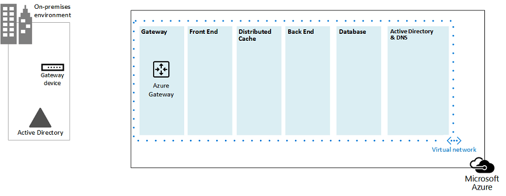

# Microsoft Azure Architectures for SharePoint 2013Microsoft Azure Architectures for SharePoint 2013

Azure è un ambiente ideale per ospitare una soluzione SharePoint Server 2013.Azure is a good environment for hosting a SharePoint Server 2013 solution. Nella maggior parte dei casi, è consigliabile Microsoft 365, ma una farm di SharePoint Server ospitata in Azure può essere una buona opzione per soluzioni specifiche.In most cases, we recommend Microsoft 365, but a SharePoint Server farm hosted in Azure can be a good option for specific solutions. In questo articolo viene descritto come architettare le soluzioni SharePoint in modo che siano adatte alla piattaforma Azure.This article describes how to architect SharePoint solutions so they are a good fit in the Azure platform. Le due soluzioni specifiche seguenti vengono utilizzate come esempi:The following two specific solutions are used as examples:
  
- [Ripristino di emergenza di SharePoint Server 2013 in Microsoft AzureSharePoint Server 2013 Disaster Recovery in Microsoft Azure](sharepoint-server-2013-disaster-recovery-in-microsoft-azure.md)
    
- [Siti Internet in Microsoft Azure che utilizzano SharePoint Server 2013Internet Sites in Microsoft Azure using SharePoint Server 2013](internet-sites-in-microsoft-azure-using-sharepoint-server-2013.md)
    
## Soluzioni di SharePoint consigliate per i servizi infrastruttura di AzureRecommended SharePoint solutions for Azure Infrastructure Services

I servizi di infrastruttura di Azure sono un'opzione interessante per ospitare soluzioni SharePoint.Azure infrastructure services is a compelling option for hosting SharePoint solutions. Alcune soluzioni sono più adatte a questa piattaforma rispetto ad altre.Some solutions are a better fit for this platform than others. Nella tabella seguente sono riportate le soluzioni consigliate.The following table shows recommended solutions.
  
|**Soluzione****Solution**|**Perché questa soluzione è consigliata per Azure****Why this solution is recommended for Azure**|
|:-----|:-----|
|Ambienti di sviluppo e testDevelopment and test environments    |È facile creare e gestire questi ambienti.It's easy to create and manage these environments.    |
|Ripristino di emergenza delle farm di SharePoint locali in AzureDisaster recovery of on-premises SharePoint farms to Azure    |**Datacenter secondario ospitato** Usare Azure invece di investire in un datacenter secondario in un'area geografica diversa.**Hosted secondary datacenter** Use Azure instead of investing in a secondary datacenter in a different region.   **Ambienti di ripristino di emergenza a basso costo** Gestire e pagare un numero inferiore di risorse rispetto a un ambiente di ripristino di emergenza locale.**Lower-cost disaster-recovery environments** Maintain and pay for fewer resources than an on-premises disaster recovery environment. Il numero di risorse dipende dall'ambiente di ripristino di emergenza scelto: cold standby, warm standby o hot standby.The number of resources depends on the disaster recovery environment you choose: cold standby, warm standby, or hot standby.   **Piattaforma più elastica** In caso di emergenza, scalare facilmente la farm di SharePoint di ripristino per soddisfare i requisiti di carico.**More elastic platform** In the event of a disaster, easily scale-out your recovery SharePoint farm to meet load requirements. Ridurre quando la risorsa non è più necessaria.Scale in when you no longer need the resources.   Vedere [Ripristino di emergenza di SharePoint Server 2013 in Microsoft Azure.](sharepoint-server-2013-disaster-recovery-in-microsoft-azure.md)See [SharePoint Server 2013 Disaster Recovery in Microsoft Azure](sharepoint-server-2013-disaster-recovery-in-microsoft-azure.md).    |
|Siti con connessione Internet che usano funzionalità e scalabilità non disponibili in Microsoft 365Internet-facing sites that use features and scale not available in Microsoft 365    |**Concentrare i propri sforzi** Concentrarsi sulla creazione di un sito eccezionale anziché sulla creazione di un'infrastruttura.**Focus your efforts** Concentrate on building a great site rather than building infrastructure.   **Sfruttare l'elasticità in Azure** Ridimensionare la farm per la richiesta aggiungendo nuovi server e pagare solo per le risorse necessarie.**Take advantage of elasticity in Azure** Size the farm for the demand by adding new servers, and pay only for resources you need. L'allocazione dinamica del computer non è supportata (ridimensionamento automatico).Dynamic machine allocation is not supported (auto scale).   **Usare Azure Active Directory (AD)** Sfrutta Azure AD per gli account dei clienti.**Use Azure Active Directory (AD)** Take advantage of Azure AD for customer accounts.   **Aggiungere funzionalità di SharePoint non disponibili in Microsoft 365** Aggiungere report approfonditi e Analisi Web.**Add SharePoint functionality not available in Microsoft 365** Add deep reporting and web analytics.   Vedere [Siti Internet in Microsoft Azure con SharePoint Server 2013.](internet-sites-in-microsoft-azure-using-sharepoint-server-2013.md)See [Internet Sites in Microsoft Azure using SharePoint Server 2013](internet-sites-in-microsoft-azure-using-sharepoint-server-2013.md).    |
|App farm per supportare gli ambienti Microsoft 365 o localiApp farms to support Microsoft 365 or on-premises environments    |**Creare, testare e ospitare app** in Azure per supportare ambienti locali e cloud.**Build, test, and host apps** in Azure to support both on-premises and cloud environments.   **Ospitare questo ruolo** in Azure invece di acquistare nuovo hardware per ambienti locali.**Host this role** in Azure instead of buying new hardware for on-premises environments.   |
   
Per le soluzioni e i carichi di lavoro intranet e di collaborazione, prendere in considerazione le opzioni seguenti:For intranet and collaboration solutions and workloads, consider the following options:
  
- Determinare se Microsoft 365 soddisfa i requisiti aziendali o può far parte della soluzione.Determine if Microsoft 365 meets your business requirements or can be part of the solution. Microsoft 365 offre un set di funzionalità che è sempre aggiornato.Microsoft 365 provides a rich feature set that is always up to date.
    
- Se Microsoft 365 non soddisfa tutti i requisiti aziendali, prendere in considerazione un'implementazione standard di SharePoint 2013 locale da Microsoft Consulting Services (MCS).If Microsoft 365 does not meet all your business requirements, consider a standard implementation of SharePoint 2013 on premises from Microsoft Consulting Services (MCS). Un'architettura standard può essere una soluzione più rapida, più conveniente e più semplice da supportare rispetto a una personalizzata.A standard architecture can be a quicker, cheaper, and easier solution for you to support than a customized one. 
    
- Se un'implementazione standard non soddisfa i requisiti aziendali, prendere in considerazione una soluzione locale personalizzata.If a standard implementation doesn't meet your business requirements, consider a customized on-premises solution.
    
- Se l'utilizzo di una piattaforma cloud è importante per i requisiti aziendali, prendere in considerazione un'implementazione standard o personalizzata di SharePoint 2013 ospitata nei servizi infrastruttura di Azure.If using a cloud platform is important for your business requirements, consider a standard or customized implementation of SharePoint 2013 hosted in Azure infrastructure services. Le soluzioni SharePoint sono molto più facili da supportare in Azure rispetto ad altre piattaforme cloud pubbliche Microsoft non native.SharePoint solutions are much easier to support in Azure than other non-native Microsoft public cloud platforms.
    
## Prima di progettare l'ambiente AzureBefore you design the Azure environment

Anche se in questo articolo vengono utilizzate topologie di SharePoint di esempio, è possibile utilizzare questi concetti di progettazione con qualsiasi topologia di farm di SharePoint.While this article uses example SharePoint topologies, you can use these design concepts with any SharePoint farm topology. Prima di progettare l'ambiente Azure, utilizzare le indicazioni seguenti per la topologia, l'architettura, la capacità e le prestazioni per progettare la farm di SharePoint:Before you design the Azure environment, use the following topology, architecture, capacity, and performance guidance to design the SharePoint farm:
  
- [Progettazione dell'architettura per i professionisti IT di SharePoint 2013Architecture design for SharePoint 2013 IT pros](https://technet.microsoft.com/sharepoint/fp123594.aspx)
    
- [Pianificare la gestione delle prestazioni e della capacità in SharePoint Server 2013Plan for performance and capacity management in SharePoint Server 2013](https://technet.microsoft.com/library/8dd52916-f77d-4444-b593-1f7d6f330e5f.aspx)
    
## Determinare il tipo di dominio di Active DirectoryDetermine the Active Directory domain type

Ogni farm di SharePoint Server si basa su Active Directory per fornire account amministrativi per l'installazione della farm.Each SharePoint Server farm relies on Active Directory to provide administrative accounts for farm setup. Al momento, sono disponibili due opzioni per le soluzioni di SharePoint in Azure.At this time, there are two options for SharePoint solutions in Azure. Queste informazioni sono descritte nella tabella seguente.These are described in the following table.
  
|**Opzione****Option**|**Descrizione****Description**|
|:-----|:-----|
|Dominio dedicatoDedicated domain    |È possibile distribuire un dominio Active Directory dedicato e isolato in Azure per supportare la farm di SharePoint.You can deploy a dedicated and isolated Active Directory domain to Azure to support your SharePoint farm. Questa è una buona scelta per i siti Internet pubblici.This is a good choice for public-facing Internet sites.    |
|Estendere il dominio locale tramite una connessione cross-premiseExtend the on-premises domain through a cross-premises connection    |Quando si estende il dominio locale tramite una connessione cross-premise, gli utenti accedono alla farm di SharePoint tramite la rete Intranet come se fossero ospitati in locale.When you extend the on-premises domain through a cross-premises connection, users access the SharePoint farm via your intranet as if it were hosted on-premises. È possibile sfruttare l'implementazione di Active Directory e DNS locale.You can take advantage of your on-premises Active Directory and DNS implementation.    È necessaria una connessione cross-premise per la creazione di un ambiente di ripristino di emergenza in Azure per il failover dalla farm locale.A cross-premises connection is required for building a disaster-recovery environment in Azure to fail over to from your on-premises farm.    |
   
In questo articolo sono inclusi concetti di progettazione per l'estensione del dominio locale tramite una connessione cross-premise.This article includes design concepts for extending the on-premises domain through a cross-premises connection. Se la soluzione utilizza un dominio dedicato, non è necessaria una connessione cross-premise.If your solution uses a dedicated domain, you don't need a cross-premises connection.
  
## Progettare la rete virtualeDesign the virtual network

Prima di tutto è necessaria una rete virtuale in Azure, che includa subnet in cui inserire le macchine virtuali.First you need a virtual network in Azure, which includes subnets on which you will place your virtual machines. La rete virtuale richiede uno spazio di indirizzi IP privato, parti delle quali vengono assegnate alle subnet.The virtual network needs a private IP address space, portions of which you assign to the subnets.
  
Se si estende la rete locale ad Azure tramite una connessione cross-premise (necessaria per un ambiente di ripristino di emergenza), è necessario scegliere uno spazio di indirizzi privato non già in uso altrove nella rete dell'organizzazione, che può includere l'ambiente locale e altre reti virtuali di Azure.If you are extending your on-premises network to Azure through a cross-premises connection (required for a disaster recovery environment), you must choose a private address space that is not already in use elsewhere in your organization network, which can include your on-premises environment and other Azure virtual networks. 
  
**Figura 1: ambiente locale con una rete virtuale in Azure****Figure 1: On-premises environment with a virtual network in Azure**

  
In questo diagramma:In this diagram:
  
- Una rete virtuale in Azure è illustrata affiancata all'ambiente locale.A virtual network in Azure is illustrated side-by-side to the on-premises environment. I due ambienti non sono ancora connessi tramite una connessione cross-premise, che può essere una connessione VPN da sito a sito o ExpressRoute.The two environments are not yet connected by a cross-premises connection, which can be a site-to-site VPN connection or ExpressRoute.
    
- A questo punto, la rete virtuale include solo le subnet e nessun altro elemento architetturale.At this point, the virtual network just includes the subnets and no other architectural elements. Una subnet ospiterà il gateway di Azure e altre subnet ospiteranno i livelli della farm di SharePoint, con un'altra per Active Directory e DNS.One subnet will host the Azure gateway and other subnets host the tiers of the SharePoint farm, with an additional one for Active Directory and DNS.
    
## Aggiungere connettività cross-premiseAdd cross-premises connectivity

Il passaggio di distribuzione successivo consiste nel creare la connessione cross-premise (se applicabile alla soluzione).The next deployment step is to create the cross-premises connection (if this applies to your solution). Per le connessioni cross-premise, un gateway di Azure si trova in una subnet gateway separata, che è necessario creare e assegnare uno spazio indirizzo.For cross-premises connections, a Azure gateway resides in a separate gateway subnet, which you must create and assign an address space. 
  
Quando si pianifica una connessione cross-premise, è necessario definire e creare un gateway di Azure e una connessione a un dispositivo gateway locale.When you plan for a cross-premises connection, you define and create an Azure gateway and connection to an on-premises gateway device.
  
**Figura 2: Utilizzo di un gateway di Azure e di un dispositivo gateway locale per fornire connettività da sito a sito tra l'ambiente locale e Azure****Figure 2: Using an Azure gateway and an on-premises gateway device to provide site-to-site connectivity between the on-premises environment and Azure**

  
In questo diagramma:In this diagram:
  
- Aggiungendo al diagramma precedente, l'ambiente locale è connesso alla rete virtuale di Azure tramite una connessione cross-premise, che può essere una connessione VPN da sito a sito o ExpressRoute.Adding to the previous diagram, the on-premises environment is connected to the Azure virtual network by a cross-premise connection, which can be a site-to-site VPN connection or ExpressRoute.
    
- Un gateway di Azure si trova in una subnet gateway.An Azure gateway is on a gateway subnet.
    
- L'ambiente locale include un dispositivo gateway, ad esempio un router o un server VPN.The on-premises environment includes a gateway device, such as a router or VPN server.
    
Per ulteriori informazioni su come pianificare e creare una rete virtuale cross-premise, vedere Connettere una rete locale [a una rete virtuale di Microsoft Azure.](connect-an-on-premises-network-to-a-microsoft-azure-virtual-network.md)For additional information to plan for and create a cross-premises virtual network, see [Connect an on-premises network to a Microsoft Azure virtual network](connect-an-on-premises-network-to-a-microsoft-azure-virtual-network.md).
  
## Aggiungere Servizi di dominio Active Directory e DNSAdd Active Directory Domain Services (AD DS) and DNS

Per il ripristino di emergenza in Azure, si distribuiscono Windows Server AD e DNS in uno scenario ibrido in cui Windows Server AD viene distribuito sia in locale che nelle macchine virtuali di Azure.For disaster recovery in Azure, you deploy Windows Server AD and DNS in a hybrid scenario where Windows Server AD is deployed both on-premises and on Azure virtual machines.
  
**Figura 3: configurazione del dominio di Active Directory ibrido****Figure 3: Hybrid Active Directory domain configuration**

  
Questo diagramma si basa sui diagrammi precedenti aggiungendo due macchine virtuali a una subnet DNS e Windows Server AD.This diagram builds on the previous diagrams by adding two virtual machines to a Windows Server AD and DNS subnet. Queste macchine virtuali sono controller di dominio di replica e server DNS.These virtual machines are replica domain controllers and DNS servers. Si tratta di un'estensione dell'ambiente Windows Server AD locale.They are an extension of the on-premises Windows Server AD environment. 
  
Nella tabella seguente vengono forniti suggerimenti di configurazione per queste macchine virtuali in Azure.The following table provides configuration recommendations for these virtual machines in Azure. Usarli come punto di partenza per la progettazione del proprio ambiente, anche per un dominio dedicato in cui l'ambiente azure non comunica con l'ambiente locale.Use these as a starting point for designing your own environment—even for a dedicated domain where your Azure environment doesn't communicate with your on-premises environment.
  
|**Elemento****Item**|**Configurazione****Configuration**|
|:-----|:-----|
|Dimensioni della macchina virtuale in AzureVirtual machine size in Azure    |Dimensioni A1 o A2 nel livello StandardA1 or A2 size in the Standard tier    |
|Sistema operativoOperating system    |Windows Server 2012 R2Windows Server 2012 R2    |
|Ruolo Active DirectoryActive Directory role    |Controller di dominio di Servizi di dominio Active Directory designato come server di catalogo globale.AD DS domain controller designated as a global catalog server. Questa configurazione riduce il traffico in uscita attraverso la connessione cross-premise.This configuration reduces egress traffic across the cross-premises connection.    In un ambiente multidominio con alte percentuali di modifiche (questo non è comune), configurare i controller di dominio in locale per non eseguire la sincronizzazione con i server di catalogo globale in Azure, per ridurre il traffico di replica.In a multidomain environment with high rates of change (this is not common), configure domain controllers on premises not to sync with the global catalog servers in Azure, to reduce replication traffic.    |
|Ruolo DNSDNS role    |Installare e configurare il servizio Server DNS nei controller di dominio.Install and configure the DNS Server service on the domain controllers.    |
|Dischi datiData disks    |Posizionare il database, i registri e SYSVOL di Active Directory su altri dischi dati di Azure.Place the Active Directory database, logs, and SYSVOL on additional Azure data disks. Non posizionali nel disco del sistema operativo o nei dischi temporanei forniti da Azure.Do not place these on the operating system disk or the temporary disks provided by Azure.    |
|Indirizzi IPIP addresses    |Utilizzare indirizzi IP statici e configurare la rete virtuale per assegnare questi indirizzi alle macchine virtuali nella rete virtuale dopo la configurazione dei controller di dominio.Use static IP addresses and configure the virtual network to assign these addresses to the virtual machines in the virtual network after the domain controllers have been configured.    |
   
> [!IMPORTANT]
> Prima di distribuire Active Directory in Azure, leggere le linee guida per la distribuzione di [Windows Server Active Directory nelle macchine virtuali di Azure.](https://go.microsoft.com/fwlink/p/?linkid=392681)Before you deploy Active Directory in Azure, read [Guidelines for Deploying Windows Server Active Directory on Azure Virtual Machines](https://go.microsoft.com/fwlink/p/?linkid=392681). Queste informazioni consentono di determinare se per la soluzione sono necessarie un'architettura diversa o impostazioni di configurazione diverse.These help you determine if a different architecture or different configuration settings are needed for your solution. 
  
## Aggiungere la farm di SharePointAdd the SharePoint farm

Posizionare le macchine virtuali della farm di SharePoint in livelli nelle subnet appropriate.Place the virtual machines of the SharePoint farm in tiers on the appropriate subnets.
  
**Figura 4: posizionamento delle macchine virtuali di SharePoint****Figure 4: Placement of SharePoint virtual machines**

  
Questo diagramma si basa sui diagrammi precedenti aggiungendo i ruoli del server della farm di SharePoint nei rispettivi livelli.This diagram builds on the previous diagrams by adding the SharePoint farm server roles in their respective tiers.
  
- Due macchine virtuali di database che eseguono SQL Server creare il livello di database.Two database virtual machines running SQL Server create the database tier.
    
- Due macchine virtuali che eseguono SharePoint Server 2013 per ognuno dei livelli seguenti: front end server, server cache distribuita e server back-end.Two virtual machines running SharePoint Server 2013 for each of the following tiers: front end servers, distributed cache servers, and back end servers.
    
## Progettare e ottimizzare i ruoli del server per i set di disponibilità e i domini di erroreDesign and fine tune server roles for availability sets and fault domains

Un dominio di errore è un raggruppamento di hardware in cui vengono eseguite le istanze del ruolo.A fault domain is a grouping of hardware in which role instances run. Le macchine virtuali nello stesso dominio di errore possono essere aggiornate contemporaneamente dall'infrastruttura di Azure.Virtual machines within the same fault domain can be updated by the Azure infrastructure at the same time. Oppure possono avere esito negativo contemporaneamente perché condividono lo stesso rack.Or, they can fail at the same time because they share the same rack. Per evitare il rischio di avere due macchine virtuali nello stesso dominio di errore, è possibile configurare le macchine virtuali come set di disponibilità, in modo da garantire che ogni macchina virtuale si trova in un dominio di errore diverso.To avoid the risk of having two virtual machines on the same fault domain, you can configure your virtual machines as an availability set, which ensures that each virtual machine is in a different fault domain. Se tre macchine virtuali sono configurate come set di disponibilità, Azure garantisce che non più di due macchine virtuali si trovino nello stesso dominio di errore.If three virtual machines are configured as an availability set, Azure guarantees that no more than two of the virtual machines are located in the same fault domain.
  
Quando si progetta l'architettura di Azure per una farm di SharePoint, configurare gli stessi ruoli del server per far parte di un set di disponibilità.When you design the Azure architecture for a SharePoint farm, configure identical server roles to be part of an availability set. Ciò garantisce che le macchine virtuali siano distribuite tra più domini di errore.This ensures that your virtual machines are spread across multiple fault domains.
  
**Figura 5: Utilizzare i set di disponibilità di Azure per fornire disponibilità elevata per i livelli della farm di SharePoint****Figure 5: Use Azure Availability Sets to provide high availability for the SharePoint farm tiers**

  
In questo diagramma viene illustrata la configurazione dei set di disponibilità all'interno dell'infrastruttura di Azure.This diagram calls out the configuration of availability sets within the Azure infrastructure. Ognuno dei ruoli seguenti condivide un set di disponibilità separato:Each of the following roles share a separate availability set:
  
- Active Directory e DNSActive Directory and DNS
    
- DatabaseDatabase
    
- Back-endBack end
    
- Distribuire la cacheDistribute cache
    
- Front-endFront end
    
Potrebbe essere necessario ottimizzare la farm di SharePoint nella piattaforma Azure.The SharePoint farm might need to be fine tuned in the Azure platform. Per garantire la disponibilità elevata di tutti i componenti, verificare che i ruoli del server siano tutti configurati in modo identico.To ensure high availability of all components, ensure that the server roles are all configured identically.
  
Di seguito è riportato un esempio in cui viene illustrata un'architettura standard dei siti Internet che soddisfa specifici obiettivi di capacità e prestazioni.Here is an example that shows a standard Internet Sites architecture that meets specific capacity and performance goals. Questo esempio è descritto nel modello di architettura seguente: Architetture di ricerca siti [Internet per SharePoint Server 2013.](https://go.microsoft.com/fwlink/p/?LinkId=261519)This example is featured in the following architecture model: [Internet Sites Search Architectures for SharePoint Server 2013](https://go.microsoft.com/fwlink/p/?LinkId=261519).
  
**Figura 6: Esempio di pianificazione degli obiettivi di capacità e prestazioni in una farm a tre livelli****Figure 6: Planning example for capacity and performance goals in a three-tier farm**

  
In questo diagramma:In this diagram:
  
- È rappresentata una farm a tre livelli: server Web, server applicazioni e server di database.A three-tier farm is represented: web servers, application servers, and database servers.
    
- I tre server Web sono configurati in modo identico con più componenti.The three web servers are configured identically with multiple components.
    
- I due server di database sono configurati in modo identico.The two database servers are configured identically.
    
- I tre server applicazioni non sono configurati in modo identico.The three application servers are not configured identically. Questi ruoli del server richiedono l'ottimizzazione dei set di disponibilità in Azure.These server roles require fine tuning for availability sets in Azure.
    
Diamo un'occhiata più da vicino al livello del server applicazioni.Let's look closer at the application server tier.
  
**Figura 7: livello del server applicazioni prima dell'ottimizzazione****Figure 7: Application server tier before fine tuning**

  
In questo diagramma:In this diagram:
  
- Nel livello applicazione sono inclusi tre server.Three servers are included in the application tier.
    
- Il primo server include quattro componenti.The first server includes four components.
    
- Il secondo server include tre componenti.The second server includes three components.
    
- Il terzo server include due componenti.The third server includes two components.
    
È possibile determinare il numero di componenti in base ai target di prestazioni e capacità per la farm.You determine the number of components by the performance and capacity targets for the farm. Per adattare questa architettura per Azure, verranno replicati i quattro componenti in tutti e tre i server.To adapt this architecture for Azure, we'll replicate the four components across all three servers. In questo modo si aumenta il numero di componenti oltre a quanto necessario per le prestazioni e la capacità.This increases the number of components beyond what is necessary for performance and capacity. Il compromesso è che questa progettazione garantisce la disponibilità elevata di tutti e quattro i componenti nella piattaforma Azure quando queste tre macchine virtuali vengono assegnate a un set di disponibilità.The tradeoff is that this design ensures high availability of all four components in the Azure platform when these three virtual machines are assigned to an availability set.
  
**Figura 8: livello del server applicazioni dopo l'ottimizzazione****Figure 8: Application server tier after fine tuning**

  
Questo diagramma mostra tutti e tre i server applicazioni configurati in modo identico con gli stessi quattro componenti.This diagram shows all three application servers configured identically with the same four components.
  
Quando si aggiungono set di disponibilità ai livelli della farm di SharePoint, l'implementazione è completa.When we add availability sets to the tiers of the SharePoint farm, the implementation is complete.
  
**Figura 9: farm di SharePoint completata nei servizi infrastruttura di Azure****Figure 9: The completed SharePoint farm in Azure infrastructure services**

  
Questo diagramma mostra la farm di SharePoint implementata nei servizi di infrastruttura di Azure, con set di disponibilità per fornire i domini di errore per i server in ogni livello.This diagram shows the SharePoint farm implemented in Azure infrastructure services, with availability sets to provide fault domains for the servers in each tier.
  
## Vedere ancheSee Also

[Microsoft 365 Solution and Architecture CenterMicrosoft 365 solution and architecture center](../solutions/solution-architecture-center.md)
  
[Siti Internet in Microsoft Azure che utilizzano SharePoint Server 2013Internet Sites in Microsoft Azure using SharePoint Server 2013](internet-sites-in-microsoft-azure-using-sharepoint-server-2013.md)
  
[Ripristino di emergenza di SharePoint Server 2013 in Microsoft AzureSharePoint Server 2013 Disaster Recovery in Microsoft Azure](sharepoint-server-2013-disaster-recovery-in-microsoft-azure.md)

