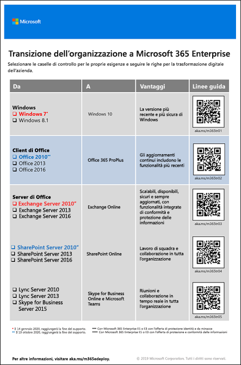

# Migrazione a Microsoft 365 Enterprise

La maggior parte delle organizzazioni aziendali presenta un ambiente eterogeneo con più versioni di sistemi operativi, software client e prodotti server. Microsoft 365 Enterprise include le versioni più sicure dei componenti chiave dell'infrastruttura IT, con funzionalità di produttività progettate per sfruttare le tecnologie cloud.

Per ottimizzare il valore aziendale della famiglia integrata dei prodotti Microsoft 365 Enterprise, iniziare a pianificare e implementare una strategia per eseguire la migrazione delle versioni di quanto segue:

- Il client Office installato sui computer a Office 365 ProPlus
- Office Server installato sui server ai servizi equivalenti in Office 365
- Windows 7 e Windows 8.1 sui dispositivi a Windows 10 Enterprise

>[!Note]
>Il 14 gennaio 2020, Windows 7 raggiungerà la fine del supporto. Per altre informazioni, fare clic [qui](https://support.microsoft.com/help/4057281/windows-7-support-will-end-on-january-14-2020).
>

Eseguire gradualmente tutte le suddette migrazioni permetterà all'organizzazione di diventare un'[area di lavoro moderna](https://www.microsoft.com/microsoft-365/blog/2018/04/27/making-it-simpler-with-a-modern-workplace/), un ambiente sicuro e integrato che non pone restrizioni al lavoro in team e alla creatività all'interno dell'organizzazione, il tutto gestito attraverso Microsoft 365 Enterprise. 

Per informazioni sulla migrazione degli utenti e dei dati per carichi di lavoro specifici di Office 365:

- Casette postali utente da Exchange Server a Exchange Online, vedere [Carico di lavoro di Exchange Online](exchangeonline-workload.md).
- Dati di SharePoint da SharePoint Server a SharePoint Online, vedere [Carico di lavoro di SharePoint Online](sharepoint-online-onedrive-workload.md).
- Da Skype for Business Online a Microsoft Teams, vedere [Carico di lavoro di Microsoft Teams](teams-workload.md).

## Migrazione per i prodotti client di Microsoft Office

In molte organizzazioni, sia grandi che piccole, è molto comune l'utilizzo di versioni precedenti dei prodotti client di Office, come Word, Excel e PowerPoint. Queste versioni precedenti:

- Possono essere [aggiornate](https://support.office.com/article/install-office-updates-2ab296f3-7f03-43a2-8e50-46de917611c5) con i più recenti aggiornamenti della sicurezza e di risoluzione dei problemi, ma talvolta la procedura è manuale e non applicabile all'organizzazione.
- Non sono abilitate in modo ottimale per sfruttare le tecnologie cloud di Microsoft e consentire la trasformazione digitale della propria azienda.
 
Microsoft 365 Enterprise include Office 365 ProPlus, una versione dei prodotti client di Office disponibile con una licenza di Microsoft 365 Enterprise, installata e aggiornata da Microsoft Cloud. Per ulteriori informazioni, vedere [Informazioni su Office 365 ProPlus nell'azienda](https://docs.microsoft.com/deployoffice/about-office-365-proplus-in-the-enterprise).

### Office 2007

Per le versioni di Office nel rilascio di Office 2007, la data della fine del supporto è già trascorsa. Per ulteriori informazioni, vedere [Guida sulla fine del supporto di Office 2007](https://docs.microsoft.com/deployoffice/office-2007-end-support-roadmap).

Anziché aggiornare i computer che eseguono Office 2007 a Office 2010, Office 2013 o Office 2016, è consigliabile:

1. Ottenere e assegnare una licenza Microsoft 365 agli utenti.
2. Disinstallare Office 2007 dai computer.
3. Installare Office 365 ProPlus, singolarmente o insieme con un'implementazione IT. Per ulteriori informazioni, vedere [Fase 4: Office 365 ProPlus](office365proplus-infrastructure.md).

Office 365 ProPlus installa automaticamente gli aggiornamenti e sfrutta servizi basati sul cloud in Office 365 per la protezione avanzata e la produttività.

### Office 2010

Per le versioni di Office nel rilascio di Office 2010, la data della fine del supporto è il 13 ottobre 2020. Per ulteriori informazioni, vedere [Guida sulla fine del supporto di Office 2010](https://docs.microsoft.com/deployoffice/office-2010-end-support-roadmap).

Anziché aggiornare i computer che eseguono Office 2010 a Office 2013 o Office 2016 (entrambi da aggiornare manualmente), è consigliabile: 

1. Ottenere e assegnare una licenza Microsoft 365 agli utenti.
2. Disinstallare Office 2010 dai computer.
3. Installare Office 365 ProPlus, singolarmente o insieme con un'implementazione IT. Per ulteriori informazioni, vedere [Fase 4: Office 365 ProPlus](office365proplus-infrastructure.md).

Office 365 ProPlus installa automaticamente gli aggiornamenti e sfrutta servizi basati sul cloud in Office 365 per la protezione avanzata e la produttività.

### Office 2013 e Office 2016

La guida sulla fine del supporto per le versioni Office 2013 e Office 2016 non è ancora stata rilasciata. Tuttavia, come per Office 2010, è ancora possibile [installare gli aggiornamenti](https://support.office.com/article/install-office-updates-2ab296f3-7f03-43a2-8e50-46de917611c5), anche se potrebbero non essere effettuati nel modo corretto a seconda delle dimensioni dell'organizzazione. Anziché aggiornare i computer con gli aggiornamenti più recenti per Office 2013 o Office 2016, oppure eseguire l'aggiornamento da Office 2013 a Office 2016, è consigliabile:

1. Ottenere e assegnare una licenza Microsoft 365 agli utenti.
2. Disinstallare Office 2013 o Office 2016 dai computer.
3. Installare Office 365 ProPlus, singolarmente o insieme con un'implementazione IT. Per ulteriori informazioni, vedere [Fase 4: Office 365 ProPlus](office365proplus-infrastructure.md).

Office 365 ProPlus installa automaticamente gli aggiornamenti e sfrutta servizi basati sul cloud in Office 365 per la protezione avanzata e la produttività.

## Migrazione per i prodotti server di Microsoft Office

In molte organizzazioni, sia grandi che piccole, è molto comune l'utilizzo di versioni precedenti dei prodotti di Office Server, come Exchange Server e SharePoint Server. Queste versioni precedenti:

- Devono essere aggiornate con gli aggiornamenti più recenti della sicurezza e di risoluzione dei problemi. In alcuni casi, tali aggiornamenti vengono rilasciati mensilmente.
- Non sono abilitate in modo ottimale per sfruttare le tecnologie cloud di Microsoft e consentire la trasformazione digitale della propria azienda.
- Non includono nuove applicazioni per la produttività, come Microsoft Teams.
- Non includono le funzionalità di sicurezza più recenti, come Exchange Advanced Threat Protection.

Microsoft 365 Enterprise include Office 365, caratterizzato da versioni basate sul cloud dei servizi server di Office che utilizzano alcuni degli stessi strumenti delle versioni locali del prodotto server di Office, come i Web browser e il client Outlook. Questi servizi vengono costantemente aggiornati senza l'intervento di professionisti IT, risparmiando il tempo necessario all'aggiornamento e alla manutenzione dei server locali. I suddetti servizi presentano inoltre miglioramenti non presenti nel prodotto server di Office. 

### Office Server 2007

Per i prodotti server nel rilascio di Office 2007, la data della fine del supporto è già trascorsa. Vedere i seguenti articoli per i dettagli:

- [Guida sulla fine del supporto di Exchange 2007](https://docs.microsoft.com/office365/enterprise/exchange-2007-end-of-support)
- [Guida sulla fine del supporto di SharePoint Server 2007](https://docs.microsoft.com/office365/enterprise/sharepoint-2007-end-of-support)
- [Guida sulla fine del supporto di Project Server 2007](https://docs.microsoft.com/office365/enterprise/project-server-2007-end-of-support)
- [Guida sulla fine del supporto di Office Communications Server](https://docs.microsoft.com/skypeforbusiness/plan-your-deployment/upgrade)
- [Guida sulla fine del supporto di PerformancePoint Server 2007](https://docs.microsoft.com/office365/enterprise/pps-2007-end-of-support)

Anziché aggiornare i prodotti server nel rilascio di Office 2007 con i prodotti server nel rilascio di Office 2010, Office 2013 o Office 2016, è consigliabile:

1. Eseguire la migrazione dei dati sui server di Office 2007 a Office 365. Per ricevere assistenza durante questa procedura, contattare un partner Microsoft.
2. Presentare le nuove funzionalità e i processi di lavoro agli utenti.
3. Se i server locali che eseguono prodotti server di Office 2007 non sono più necessari, rimuoverli.

### Office Server 2010

Per i prodotti server nel rilascio di Office 2010, la data della fine del supporto non è ancora stata determinata per:

- [Exchange Server 2010](https://docs.microsoft.com/office365/enterprise/exchange-2010-end-of-support)
- [SharePoint Server 2010](https://docs.microsoft.com/office365/enterprise/upgrade-from-sharepoint-2010)

Anziché aggiornare questi prodotti server nel rilascio di Office 2010 con i prodotti server nel rilascio di Office 2013 o Office 2016, è consigliabile:

1. Eseguire la migrazione dei dati sui server di Office 2010 a Office 365. Per ricevere assistenza durante questa procedura, vedere [FastTrack per Microsoft 365](https://fasttrack.microsoft.com/microsoft365) o contattare un partner Microsoft.
2. Presentare le nuove funzionalità e i processi di lavoro agli utenti.
3. Se i server locali che eseguono prodotti server di Office 2010 non sono più necessari, rimuoverli.

### Office Server 2013

Per i prodotti server nel rilascio di Office 2013, la data della fine del supporto non è ancora stata determinata. Anziché aggiornare i prodotti server nel rilascio di Office 2013 con i prodotti server nel rilascio di Office 2016, è consigliabile:

1. Eseguire la migrazione dei dati sui server di Office 2013 a Office 365. Per ricevere assistenza durante questa procedura, vedere [FastTrack per Microsoft 365](https://fasttrack.microsoft.com/microsoft365) o contattare un partner Microsoft.
2. Presentare le nuove funzionalità e i processi di lavoro agli utenti.
3. Se i server locali che eseguono prodotti server di Office 2013 non sono più necessari, rimuoverli.

### Office Server 2016

Per i prodotti server nel rilascio di Office 2016, la data della fine del supporto non è ancora stata determinata. Per sfruttare il servizio basato sul cloud e i miglioramenti nella trasformazione digitale della propria azienda, è consigliabile:

1. Eseguire la migrazione dei dati sui server di Office 2016 a Office 365. Per ricevere assistenza durante questa procedura, vedere [FastTrack per Microsoft 365](https://fasttrack.microsoft.com/microsoft365) o contattare un partner Microsoft.
2. Presentare le nuove funzionalità e i processi di lavoro agli utenti.
3. Se i server locali che eseguono prodotti server di Office 2016 non sono più necessari, rimuoverli.

## Migrazione per Microsoft Windows

Per eseguire la migrazione dei dispositivi con sistema operativo Windows 7 o Windows 8.1, è possibile eseguire un [aggiornamento sul posto](https://docs.microsoft.com/microsoft-365/enterprise/windows10-deploy-inplaceupgrade). 

Per ulteriori metodi, vedere [Scenari di distribuzione di Windows 10](https://docs.microsoft.com/windows/deployment/windows-10-deployment-scenarios). È inoltre possibile [pianificare la distribuzione di Windows 10](https://aka.ms/planforwin10deployment) autonomamente.

## Come Microsoft esegue Microsoft 365 Enterprise

Informazioni su come gli esperti IT di Microsoft hanno eseguito la migrazione della società a Microsoft 365 Enterprise con queste risorse: 

- [Distribuzione e aggiornamento di Microsoft Office 365 ProPlus](https://www.microsoft.com/itshowcase/Article/Content/757/Deploying-and-updating-Microsoft-Office-365-ProPlus)
- [Microsoft esegue la migrazione di 150.000 cassette postali a Exchange Online](https://www.microsoft.com/itshowcase/Article/Content/577/Microsoft-migrates-150000-mailboxes-to-Exchange-Online)
- [SharePoint nel cloud: informazioni su come Microsoft ha eseguito la migrazione](https://www.microsoft.com/itshowcase/Article/Content/691/SharePoint-to-the-cloud-Learn-how-Microsoft-ran-its-own-migration)
- [Distribuzione di Windows 10 in Microsoft come aggiornamento sul posto](https://www.microsoft.com/itshowcase/Article/Content/668/Deploying-Windows-10-at-Microsoft-as-an-inplace-upgrade)
- [Distribuzione di Windows 10: suggerimenti e consigli da IT Microsoft](https://www.microsoft.com/itshowcase/Article/Content/951/Windows-10-deployment-tips-and-tricks-from-Microsoft-IT) (video)

## Transizione all'intera organizzazione

Per avere un quadro più completo su come spostare l'intera organizzazione in Microsoft 365 Enterprise, scaricare il [poster di transizione](https://github.com/MicrosoftDocs/microsoft-365-docs/raw/public/microsoft-365/enterprise/media/deploy-microsoft-365-enterprise/transitionorgtom365.pdf).

Questo poster con due pagine rappresenta un modo rapido per inventariare l'infrastruttura esistente e accedere alle indicazioni per passare al prodotto o al servizio corrispondente in Microsoft 365 Enterprise. Include i prodotti di questo articolo e altri elementi di infrastruttura e sicurezza, come la gestione dei dispositivi, l'identità e le informazioni e la protezione dalle minacce.

È possibile stampare il poster in formato lettera, legale o tabloid (11 x 17).

## Risultato

L'organizzazione ha eseguito la migrazione delle precedenti versioni di Microsoft Office, Office Server e Windows a Microsoft 365 Enterprise.
