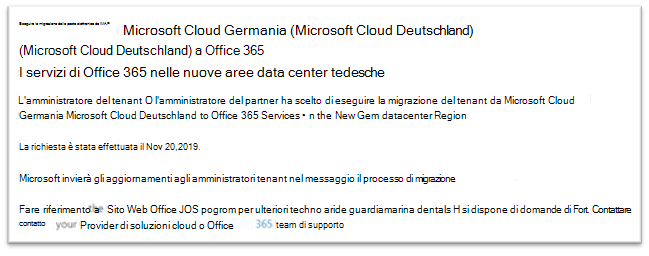

# Come acconsentire esplicitamente alla migrazione da Microsoft Cloud Germania (Microsoft Cloud Deutschland) ai servizi di Office 365 nelle nuove aree data center tedescheHow to opt-in for migration from Microsoft Cloud Germany (Microsoft Cloud Deutschland) to Office 365 services in the new German datacenter regions

>[!Note]
>Questo articolo si applica solo ai clienti di Microsoft Cloud Germany (Microsoft Cloud Deutschland).This article only applies to Microsoft Cloud Germany (Microsoft Cloud Deutschland) customers.
>

## Come richiedere la migrazioneHow to request migration

I clienti idonei con servizi di cui è stato effettuato il provisioning in Microsoft Cloud Germany (Microsoft Cloud Deutschland) vedranno una pagina nell'interfaccia di amministrazione di Microsoft 365 che consentirà a un amministratore tenant del cliente di scegliere l'opzione per la migrazione.Eligible customers with service provisioned in Microsoft Cloud Germany (Microsoft Cloud Deutschland) will see a page in the Microsoft 365 admin center that will allow a customer tenant administrator to opt-in for migration.

Per accedere alla pagina nell'interfaccia di amministrazione di Microsoft 365, espandere **Impostazioni** nel riquadro di spostamento sinistro e quindi fare clic su **Profilo organizzazione**.To access the page in the Microsoft 365 admin center, in the navigation pane on the left, expand **Settings** and then click **Organization Profile**.

Nella pagina **Profilo organizzazione**, scorrere verso il basso fino alla sezione **Migrazione da Microsoft Cloud Germany (Microsoft Cloud Deutschland) ai servizi di Office 365 nelle nuove aree data center tedesche**.On the **Organization Profile** page, scroll down to the **Migrate from Microsoft Cloud Germany (Microsoft Cloud Deutschland) to Office 365 services in the new German datacenter regions** section.

Se l'organizzazione desidera eseguire la migrazione del servizio da Microsoft Cloud Germany (Microsoft Cloud Deutschland) ai servizi di Office 365 nelle nuove aree data center tedesche, fare clic su **Acconsenti esplicitamente**.If your organization wishes to migrate your service from Microsoft Cloud Germany (Microsoft Cloud Deutschland) to Office 365 services in the new German datacenter regions, click **Opt-in**.
 

Una nuova sezione apparirà sul lato destro dello schermo per accettare la conferma.A new section will appear on the right side of your screen to accept your confirmation. Impostare l'interruttore su **Sì**e quindi fare clic su **Salva**.Select the toggle button to **Yes**, and then click **Save**.
 

Dopo che l'amministratore avrà acconsentito esplicitamente per conto del tenant, tutti gli amministratori visualizzeranno la conferma nella sezione **Migrazione da Microsoft Cloud Germania (Microsoft Cloud Deutschland) ai servizi di Office 365 nelle nuove aree data center tedesche**, inclusa la data del consenso esplicito.Once an administrator has opted-in on behalf of your tenant then all administrators will see the confirmation in **Migrate from Microsoft Cloud Germany (Microsoft Cloud Deutschland) to Office 365 services in the new German datacenter regions** section, including the date of opt-in. Inoltre, gli amministratori riceveranno una conferma nel Centro messaggi dell'interfaccia di amministrazione di Microsoft 365.Administrators will also receive a confirmation in Message Center of the Microsoft 365 admin center. 
 

## Cosa succede dopo aver acconsentito esplicitamente alla migrazione?What happens after opting-in for migration?

Le migrazioni avranno inizio all'inizio del 2021 per le organizzazioni che aderiscono all'approccio basato su Microsoft e verranno completate prima della data di pensionamento di Microsoft Cloud Germany (Microsoft Cloud Deutschland) del 29 ottobre 2021.Migrations will begin in early 2021 for organizations that opt-in to the Microsoft-driven approach and will be complete before the Microsoft Cloud Germany (Microsoft Cloud Deutschland) retirement date on October 29, 2021.  A seguito della migrazione, gli abbonamenti e i dati principali dei clienti verranno spostati nelle nuove aree geografiche tedesche.As a result of the migration, core customer data and subscriptions are moved to the new German regions.  Microsoft invierà aggiornamenti nel Centro messaggi per l'intera durata del processo di migrazione.Microsoft will send updates throughout the migration process in Message Center.  Per ulteriori informazioni, vedere gli articoli di riferimento riportati di seguito.Please refer to articles referenced below to learn more.

## Cosa succede se l'amministratore del tenant del cliente non opta per la migrazione nell'interfaccia di amministrazione?What happens if the customer tenant administrator does not opt-in for migration in Admin Center?

I termini dei servizi online sono cambiati in modo da includere termini che consentiranno a Microsoft di migrare i dati e le sottoscrizioni di Microsoft 365, Dynamics 365 e Power BI da Microsoft Cloud Deutschland a un nuovo Data Center.The Online Services Terms have changed to include terms that will enable Microsoft to migrate your Microsoft 365, Dynamics 365 and Power BI data and subscriptions from Microsoft Cloud Deutschland to a new data center. Questi termini hanno effetto su qualsiasi sottoscrizione di Microsoft Cloud Germany (Microsoft Cloud Deutschland) rinnovata a partire dal 1 ° maggio 2020.These terms take effect on any Microsoft Cloud Germany (Microsoft Cloud Deutschland) subscription renewed since May 1, 2020.  L'amministratore del tenant del cliente riceverà un avviso in posta elettronica e centro messaggi che consiglierà che l'opt-in per la migrazione avverrà automaticamente per una migrazione assistita da Microsoft.The customer tenant administrator will receive a notice in e-mail and Message Center advising that opt-in to migration will happen automatically opt in for a Microsoft-assisted migration. La notifica verrà inviata almeno 30 giorni prima dell'opt-in automatico.This notice will be sent at least 30 days prior to the automatic opt-in.  Dopo la migrazione opt-in tutte le comunicazioni e gli aggiornamenti di stato vengono inviati agli amministratori tenant del cliente nel centro messaggi.After migration opt-in all communications and status updates are sent to customer tenant administrators in Message Center.

Gli amministratori dei tenant del cliente e del partner sono invitati a partecipare all'opt-in per la migrazione nell'interfaccia di amministrazione in modo che il processo di migrazione possa iniziare il prima possibile.Customer and partner tenant administrators are encouraged to opt-in for migration in Admin Center so the migration process can begin as soon as possible.

## Altre informazioniMore information

- [Assistenza per la migrazione di Microsoft Cloud DeutschlandMicrosoft Cloud Deutschland Migration Assistance](https://aka.ms/germanymigrateassist)
- [Programma di migrazione di Office 365 per clienti di Microsoft Cloud DeutschlandOffice 365 migration program for Microsoft Cloud Deutschland customers](https://aka.ms/office365germanymove)
- [Programma di migrazione di Dynamics 365 per clienti di Microsoft Cloud DeutschlandDynamics 365 migration program for Microsoft Cloud Deutschland customers](https://aka.ms/d365ceoptin)
- [Programma di migrazione di Power BI per clienti di Microsoft Cloud DeutschlandPower BI migration program for Microsoft Cloud Deutschland customers](https://aka.ms/pbioptin)
- Inviare domande tramite il collegamento "Serve aiuto?"Submit questions using the “Need Help?” nell'[interfaccia di amministrazione di Microsoft 365](https://portal.office.de/)link of the [Microsoft 365 admin center](https://portal.office.de/)
