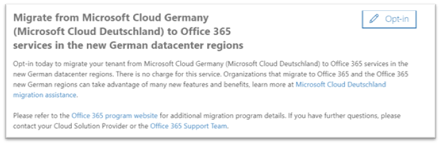

# Come acconsentire esplicitamente per la nuova migrazione da Microsoft Cloud Germania (Microsoft Cloud Deutschland) ai servizi di Office 365 nelle nuove aree data center tedesche

> [!NOTE]
> Questo articolo si applica solo ai clienti di Microsoft Cloud Germania (Microsoft Cloud Deutschland).
>

## Come richiedere la migrazione

Se si è un cliente idoneo con il servizio di cui è stato effettuato il provisioning in Microsoft Cloud Germania (Microsoft Cloud Deutschland) e si è effettuato l'accesso come amministratore tenant (globale), una pagina nell'interfaccia di amministrazione di Microsoft 365 consente di acconsentire esplicitamente alla migrazione.

Per accedere alla pagina, espandere **Impostazioni** nel riquadro di spostamento a sinistra e quindi fare clic su **Profilo organizzazione.**

Nella pagina **Profilo organizzazione**, scorrere verso il basso fino alla sezione **Migrazione da Microsoft Cloud Germany (Microsoft Cloud Deutschland) ai servizi di Office 365 nelle nuove aree data center tedesche**.

Se si desidera eseguire la migrazione del servizio da Microsoft Cloud Germania (Microsoft Cloud Deutschland) ai servizi di Office 365 nelle nuove aree data center tedesche, fare clic su **Consenso esplicito.**
 

Sul lato destro dello schermo viene visualizzata una nuova sezione per accettare la conferma. Selezionare **Sì** e quindi fare clic su **Salva.**
 

Dopo aver acconsentito esplicitamente per conto del tenant, tutti gli amministratori visualizzano la conferma in Eseguire la migrazione da **Microsoft Cloud Germania (Microsoft Cloud Deutschland)** ai servizi di Office 365 nella nuova sezione aree data center tedesche, inclusa la data di consenso esplicito. Gli amministratori riceveranno anche una conferma nel Centro messaggi dell'interfaccia di amministrazione di Microsoft 365. 
 

## Cosa succede dopo aver acconsentato esplicitamente alla migrazione?

Le migrazioni inizieranno all'inizio del 2021 per le organizzazioni che acconsentino esplicitamente all'approccio basato su Microsoft e saranno completate prima della data di ritiro di Microsoft Cloud Germany (Microsoft Cloud Deutschland) il 29 ottobre 2021.  A seguito della migrazione, gli abbonamenti e i dati principali dei clienti verranno spostati nelle nuove aree geografiche tedesche.  Microsoft inserirà gli aggiornamenti durante il processo di migrazione nel Centro messaggi. Vedi [questi articoli](#more-information) per altre informazioni.

## Cosa succede se non si acconsente esplicitamente alla migrazione nell'interfaccia di amministrazione?

Le condizioni dei servizi online sono state modificate per includere i termini che consentiranno a Microsoft di eseguire la migrazione dei dati e delle sottoscrizioni di Microsoft 365, Dynamics 365 e Power BI da Microsoft Cloud Deutschland a un nuovo data center. Queste condizioni hanno effetto su qualsiasi abbonamento a Microsoft Cloud Germania (Microsoft Cloud Deutschland) rinnovato dal 1° maggio 2020. 

L'amministratore tenant del cliente riceverà un avviso tramite posta elettronica e il Centro messaggi che consiglia di acconsentire automaticamente alla migrazione per una migrazione assistita da Microsoft. Questo avviso verrà inviato almeno 30 giorni prima del consenso esplicito automatico. Dopo il consenso esplicito per la migrazione, tutte le comunicazioni e gli aggiornamenti di stato vengono inviati agli amministratori tenant dei clienti nel Centro messaggi.

Gli amministratori tenant di clienti e partner sono invitati a acconsentire esplicitamente alla migrazione nell'interfaccia di amministrazione di Microsoft 365 in modo che il processo di migrazione possa iniziare il prima possibile.

## Passaggio successivo

[Comprendere l'esperienza del cliente durante la migrazione](ms-cloud-germany-transition-experience.md)

## Ulteriori informazioni

Guida introduttiva:

- [Migrazione da Microsoft Cloud Deutschland ai servizi di Office 365 nelle nuove aree data center tedesche](ms-cloud-germany-transition.md)
- [Assistenza per la migrazione di Microsoft Cloud Deutschland](https://aka.ms/germanymigrateassist)
- [Esperienza del cliente durante la migrazione](ms-cloud-germany-transition-experience.md)

Passaggio attraverso la transizione:

- [Azioni ed impatti sulle fasi della migrazione](ms-cloud-germany-transition-phases.md)
- [Pre-lavoro aggiuntivo](ms-cloud-germany-transition-add-pre-work.md)
- Informazioni aggiuntive per [Azure AD,](ms-cloud-germany-transition-azure-ad.md) [dispositivi,](ms-cloud-germany-transition-add-devices.md) [esperienze](ms-cloud-germany-transition-add-experience.md)e [ADFS.](ms-cloud-germany-transition-add-adfs.md)

App cloud:

- [Informazioni sul programma di migrazione di Dynamics 365](/dynamics365/get-started/migrate-data-german-region)
- [Informazioni sul programma di migrazione di Power BI](/power-bi/admin/service-admin-migrate-data-germany)
- [Guida introduttiva all'aggiornamento di Microsoft Teams](/microsoftteams/upgrade-start-here)
