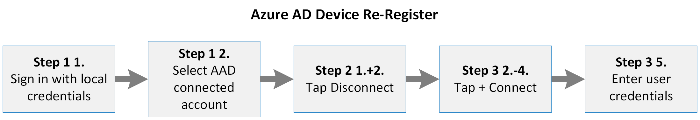

# <a name="additional-device-information-for-the-migration-from-microsoft-cloud-deutschland"></a><span data-ttu-id="f67c3-103">Informazioni aggiuntive sul dispositivo per la migrazione da Microsoft Cloud Deutschland</span><span class="sxs-lookup"><span data-stu-id="f67c3-103">Additional device information for the migration from Microsoft Cloud Deutschland</span></span>

<span data-ttu-id="f67c3-104">I dispositivi aggiunti e registrati di Azure AD connessi a Microsoft Cloud Deutschland devono essere migrati dopo la fase 9 e prima della fase 10.</span><span class="sxs-lookup"><span data-stu-id="f67c3-104">Azure AD joined and registered devices connected to Microsoft Cloud Deutschland must be migrated after phase 9 and before phase 10.</span></span> <span data-ttu-id="f67c3-105">La migrazione di un dispositivo dipende dal tipo di dispositivi, dal sistema operativo e dalla relazione di Azure AD.</span><span class="sxs-lookup"><span data-stu-id="f67c3-105">The migration of a device depends on the devices type, operating system and Azure AD relation.</span></span>

## <a name="azure-ad-joined-windows-10-devices"></a><span data-ttu-id="f67c3-106">Dispositivi Windows 10 aggiunti ad Azure AD</span><span class="sxs-lookup"><span data-stu-id="f67c3-106">Azure AD Joined Windows 10 devices</span></span>
<span data-ttu-id="f67c3-107">Se un Windows 10 è aggiunto ad Azure AD, deve essere disconnesso da Azure AD e deve essere connesso di nuovo.</span><span class="sxs-lookup"><span data-stu-id="f67c3-107">If a Windows 10 device is Azure AD joined, it must be disconnected from Azure AD and must be connected again.</span></span>

<span data-ttu-id="f67c3-108">[](../media/ms-cloud-germany-migration-opt-in/AAD-ReJoin-flow.png#lightbox)</span><span class="sxs-lookup"><span data-stu-id="f67c3-108">[  ](../media/ms-cloud-germany-migration-opt-in/AAD-ReJoin-flow.png#lightbox)</span></span>


<span data-ttu-id="f67c3-109">Se l'utente è un amministratore del dispositivo Windows 10, l'utente può annullare la registrazione del dispositivo da Azure AD e aggiungerlo di nuovo in tre passaggi.</span><span class="sxs-lookup"><span data-stu-id="f67c3-109">If the user is an administrator on the Windows 10 device, the user can unregister the device from Azure AD and re-join it again in three steps.</span></span>

### <a name="step-1-determine-if-the-device-is-azure-id-joined"></a><span data-ttu-id="f67c3-110">Passaggio 1: Determinare se il dispositivo è aggiunto all'ID Azure</span><span class="sxs-lookup"><span data-stu-id="f67c3-110">Step 1: Determine if the device is Azure ID joined</span></span>

1. <span data-ttu-id="f67c3-111">Accedere con l'account aziendale.</span><span class="sxs-lookup"><span data-stu-id="f67c3-111">Sign in with your work account.</span></span>
2. <span data-ttu-id="f67c3-112">Passare **a** Impostazioni  >  **account di**  >  **accesso al lavoro o all'istituto di istruzione.**</span><span class="sxs-lookup"><span data-stu-id="f67c3-112">Go to **Settings** > **Accounts** > **Access Work Or School**.</span></span>
3. <span data-ttu-id="f67c3-113">Cercare un account nell'elenco con **connesso a [...]' s Azure AD**.</span><span class="sxs-lookup"><span data-stu-id="f67c3-113">Look for an account in the list with **connected to […]‘s Azure AD**.</span></span>
4. <span data-ttu-id="f67c3-114">Se esiste un account connesso, procedere con il passaggio 2.</span><span class="sxs-lookup"><span data-stu-id="f67c3-114">If a connected account exists, proceed with Step 2.</span></span>

### <a name="step-2-disconnect-the-device-from-azure-ad"></a><span data-ttu-id="f67c3-115">Passaggio 2: disconnettere il dispositivo da Azure AD</span><span class="sxs-lookup"><span data-stu-id="f67c3-115">Step 2: Disconnect the device from Azure AD</span></span>

1. <span data-ttu-id="f67c3-116">Fare **clic su** Disconnetti nell'account aziendale o dell'istituto di istruzione connesso.</span><span class="sxs-lookup"><span data-stu-id="f67c3-116">Click **Disconnect** on the connected work or School Account.</span></span>
2. <span data-ttu-id="f67c3-117">Confermare la disconnessione due volte.</span><span class="sxs-lookup"><span data-stu-id="f67c3-117">Confirm the disconnect twice.</span></span>
3. <span data-ttu-id="f67c3-118">Immettere il nome utente e la password di un amministratore locale.</span><span class="sxs-lookup"><span data-stu-id="f67c3-118">Enter a local administrator username and password.</span></span> <span data-ttu-id="f67c3-119">Il dispositivo è disconnesso.</span><span class="sxs-lookup"><span data-stu-id="f67c3-119">The device is disconnected.</span></span>
4. <span data-ttu-id="f67c3-120">Riavvia il dispositivo.</span><span class="sxs-lookup"><span data-stu-id="f67c3-120">Restart the device.</span></span>

### <a name="step-3-join-the-device-to-azure-ad"></a><span data-ttu-id="f67c3-121">Passaggio 3: Aggiungere il dispositivo ad Azure AD</span><span class="sxs-lookup"><span data-stu-id="f67c3-121">Step 3: Join the device to Azure AD</span></span>

1. <span data-ttu-id="f67c3-122">Accedere con le credenziali dell'amministratore locale.</span><span class="sxs-lookup"><span data-stu-id="f67c3-122">Sign in with the credentials of the local administrator.</span></span>
2. <span data-ttu-id="f67c3-123">Passare **a** Impostazioni  >  **account di**  >  **accesso al lavoro o all'istituto di istruzione.**</span><span class="sxs-lookup"><span data-stu-id="f67c3-123">Go to **Settings** > **Accounts** > **Access Work Or School**.</span></span>
3. <span data-ttu-id="f67c3-124">Fare clic su **Connetti**.</span><span class="sxs-lookup"><span data-stu-id="f67c3-124">Click **Connect**.</span></span>
4. <span data-ttu-id="f67c3-125">**IMPORTANTE:** fare **clic su Partecipa ad Azure AD.**</span><span class="sxs-lookup"><span data-stu-id="f67c3-125">**IMPORTANT**: Click **Join to Azure AD**.</span></span>
5. <span data-ttu-id="f67c3-126">Immettere l'indirizzo di posta elettronica e la password dell'account aziendale.</span><span class="sxs-lookup"><span data-stu-id="f67c3-126">Enter the e-mail address and password of your work account.</span></span> <span data-ttu-id="f67c3-127">Il dispositivo è connesso.</span><span class="sxs-lookup"><span data-stu-id="f67c3-127">The device is connected.</span></span>
6. <span data-ttu-id="f67c3-128">Riavvia il dispositivo.</span><span class="sxs-lookup"><span data-stu-id="f67c3-128">Restart the device.</span></span>
7. <span data-ttu-id="f67c3-129">Accedi con l'indirizzo e-mail e la password del tuo account aziendale.</span><span class="sxs-lookup"><span data-stu-id="f67c3-129">Sign in with the email address and password of your work account.</span></span>

<span data-ttu-id="f67c3-130">Se l'utente non è un amministratore del dispositivo, un amministratore globale di Azure AD può creare l'account amministratore locale nel dispositivo seguendo questo percorso di configurazione e scollegare il dispositivo:</span><span class="sxs-lookup"><span data-stu-id="f67c3-130">If the user is not an administrator of the device, an Azure AD global administrator can create the local administrator account on the device following this configuration path and unjoin the device:</span></span>

<span data-ttu-id="f67c3-131">*Impostazioni > account > altri account > Credenziali sconosciute > Aggiungi utente senza Microsoft-Account*</span><span class="sxs-lookup"><span data-stu-id="f67c3-131">*Settings > Accounts > Other Accounts > Credentials unknown > Add user without Microsoft-Account*</span></span>

<span data-ttu-id="f67c3-132">Per un nuovo accesso, le credenziali di qualsiasi account aziendale dell'organizzazione possono essere utilizzate in questo passaggio.</span><span class="sxs-lookup"><span data-stu-id="f67c3-132">For re-joining, the credentials of any work account from your organization can be used in this step.</span></span>

<span data-ttu-id="f67c3-133">Tieni presente che l'account aziendale usato per l'aggiunta al dispositivo verrà promosso automaticamente come amministratore del dispositivo.</span><span class="sxs-lookup"><span data-stu-id="f67c3-133">Please consider that the work account used to join the device will be automatically promoted as an Administrator of the device.</span></span>
<span data-ttu-id="f67c3-134">Qualsiasi altro account aziendale dell'organizzazione può accedere al dispositivo, ma non dispone di privilegi di amministratore.</span><span class="sxs-lookup"><span data-stu-id="f67c3-134">Any other work account from the organization can sign in to the device, but has no administrator privileges.</span></span>

## <a name="azure-ad-registered-workplace-joined-windows-10-devices"></a><span data-ttu-id="f67c3-135">Dispositivi Windows 10 aziendali registrati in Azure AD</span><span class="sxs-lookup"><span data-stu-id="f67c3-135">Azure AD registered (workplace-joined) Windows 10 devices</span></span>

<span data-ttu-id="f67c3-136">Se un Windows 10 è registrato in Azure AD, deve essere disconnesso da Azure AD e connesso di nuovo.</span><span class="sxs-lookup"><span data-stu-id="f67c3-136">If a Windows 10 device is Azure AD registered, it needs to be disconnected from the Azure AD and connected again.</span></span>

<span data-ttu-id="f67c3-137">[](../media/ms-cloud-germany-migration-opt-in/AAD-ReJoin-flow.png#lightbox)</span><span class="sxs-lookup"><span data-stu-id="f67c3-137">[  ](../media/ms-cloud-germany-migration-opt-in/AAD-ReJoin-flow.png#lightbox)</span></span>

### <a name="step-1-determine-if-the-device-is-azure-id-registered"></a><span data-ttu-id="f67c3-138">Passaggio 1: Determinare se il dispositivo è registrato con l'ID azure</span><span class="sxs-lookup"><span data-stu-id="f67c3-138">Step 1: Determine if the device is Azure ID registered</span></span>

1. <span data-ttu-id="f67c3-139">Accedi con l'utente.</span><span class="sxs-lookup"><span data-stu-id="f67c3-139">Sign in with your user.</span></span>
2. <span data-ttu-id="f67c3-140">Passare **a** Impostazioni  >  **account di**  >  **accesso al lavoro o all'istituto di istruzione.**</span><span class="sxs-lookup"><span data-stu-id="f67c3-140">Go to **Settings** > **Accounts** > **Access Work Or School**.</span></span>
3. <span data-ttu-id="f67c3-141">Individuare l'account aziendale nell'elenco e verificare se è **connesso a [...]' s Azure AD**.</span><span class="sxs-lookup"><span data-stu-id="f67c3-141">Discover your work account in the list and check if it is **connected to […]‘s Azure AD**.</span></span>

    <span data-ttu-id="f67c3-142">Se l'account aziendale è nell'elenco ma NON è connesso ad Azure AD, procedere con il passaggio 2.</span><span class="sxs-lookup"><span data-stu-id="f67c3-142">If your work account is in the list but NOT connected to an Azure AD, proceed with step 2.</span></span>

    <span data-ttu-id="f67c3-143">In caso contrario, il dispositivo è un dispositivo aggiunto ad Azure AD e devi fare riferimento a Dispositivi aggiunti [ad Azure AD Windows 10 .](#azure-ad-joined-windows-10-devices)</span><span class="sxs-lookup"><span data-stu-id="f67c3-143">Otherwise, your device is an Azure AD joined device and you have to refer to [Azure AD Joined Windows 10 devices](#azure-ad-joined-windows-10-devices).</span></span>

### <a name="step-2-disconnect-the-device-from-azure-ad"></a><span data-ttu-id="f67c3-144">Passaggio 2: disconnettere il dispositivo da Azure AD</span><span class="sxs-lookup"><span data-stu-id="f67c3-144">Step 2: Disconnect the device from Azure AD</span></span>

1. <span data-ttu-id="f67c3-145">Fai clic sul tuo account aziendale.</span><span class="sxs-lookup"><span data-stu-id="f67c3-145">Click on your work account.</span></span> <span data-ttu-id="f67c3-146">Vengono visualizzati *i pulsanti Info* e *Disconnetti.*</span><span class="sxs-lookup"><span data-stu-id="f67c3-146">The buttons *Info* and *Disconnect* appear.</span></span>
2. <span data-ttu-id="f67c3-147">Fare clic **su Disconnetti**.</span><span class="sxs-lookup"><span data-stu-id="f67c3-147">Click **Disconnect**.</span></span>
3. <span data-ttu-id="f67c3-148">Confermare la rimozione dell'account dal dispositivo facendo clic su **Sì.**</span><span class="sxs-lookup"><span data-stu-id="f67c3-148">Confirm account removal from the device by clicking **Yes**.</span></span>

### <a name="step-3-connect-the-device-to-azure-ad"></a><span data-ttu-id="f67c3-149">Passaggio 3: Connessione il dispositivo ad Azure AD</span><span class="sxs-lookup"><span data-stu-id="f67c3-149">Step 3: Connect the device to Azure AD</span></span>

1. <span data-ttu-id="f67c3-150">Fare clic su **Connetti**.</span><span class="sxs-lookup"><span data-stu-id="f67c3-150">Click **Connect**.</span></span>
2. <span data-ttu-id="f67c3-151">Immettere l'indirizzo di posta elettronica dell'account aziendale e fare clic su **Avanti.**</span><span class="sxs-lookup"><span data-stu-id="f67c3-151">Enter the email address of your work account and click **Next**.</span></span>
3. <span data-ttu-id="f67c3-152">Immettere la password dell'account aziendale e fare clic **su Accedi.**</span><span class="sxs-lookup"><span data-stu-id="f67c3-152">Enter the password of your work account and click **Sign in**.</span></span>
4. <span data-ttu-id="f67c3-153">Conferma facendo clic su **Fine.**</span><span class="sxs-lookup"><span data-stu-id="f67c3-153">Confirm by clicking **Done**.</span></span> <span data-ttu-id="f67c3-154">L'account aziendale è elencato di nuovo.</span><span class="sxs-lookup"><span data-stu-id="f67c3-154">Your work account is listed again.</span></span>

## <a name="android"></a><span data-ttu-id="f67c3-155">Android</span><span class="sxs-lookup"><span data-stu-id="f67c3-155">Android</span></span>

<span data-ttu-id="f67c3-156">Per Android, gli utenti dovranno annullare la registrazione e registrare di nuovo i dispositivi.</span><span class="sxs-lookup"><span data-stu-id="f67c3-156">For Android, users will need to unregister and re-register their devices.</span></span> <span data-ttu-id="f67c3-157">Questa operazione può essere eseguita tramite l'app Microsoft Authenticator o l'app Portale aziendale app.</span><span class="sxs-lookup"><span data-stu-id="f67c3-157">This can be done via the Microsoft Authenticator app or the Company Portal app.</span></span>

- <span data-ttu-id="f67c3-158">Dall'app Microsoft Authenticator, gli utenti possono passare a **Impostazioni > Registrazione dispositivo**.</span><span class="sxs-lookup"><span data-stu-id="f67c3-158">From the Microsoft Authenticator app, users can go to **Settings > Device Registration**.</span></span> <span data-ttu-id="f67c3-159">Da qui gli utenti possono annullare la registrazione e registrare di nuovo il dispositivo.</span><span class="sxs-lookup"><span data-stu-id="f67c3-159">From there users can unregister and re-register their device.</span></span>

- <span data-ttu-id="f67c3-160">Dall'Portale aziendale, gli utenti possono passare alla **scheda** Dispositivi e rimuovere il dispositivo.</span><span class="sxs-lookup"><span data-stu-id="f67c3-160">From the Company Portal, users can go to **Devices** tab and remove the device.</span></span> <span data-ttu-id="f67c3-161">Successivamente, registrare di nuovo il dispositivo usando Portale aziendale.</span><span class="sxs-lookup"><span data-stu-id="f67c3-161">After that, re-enroll the device by using Company Portal.</span></span>

- <span data-ttu-id="f67c3-162">Gli utenti possono anche annullare la registrazione e registrare di nuovo rimuovendo l'account dalla pagina delle impostazioni dell'account e quindi aggiungendo di nuovo l'account aziendale.</span><span class="sxs-lookup"><span data-stu-id="f67c3-162">Users can also unregister and re-register by removing the account from the account settings page and then re-adding the work account.</span></span>

<span data-ttu-id="f67c3-163">Per annullare la registrazione e registrare di nuovo il dispositivo in Android usando l'app Microsoft Authenticator app:</span><span class="sxs-lookup"><span data-stu-id="f67c3-163">To unregister and re-register the device on Android by using the Microsoft Authenticator app:</span></span>

1. <span data-ttu-id="f67c3-164">Apri l Microsoft Authenticator app e vai a **Impostazioni**.</span><span class="sxs-lookup"><span data-stu-id="f67c3-164">Open the Microsoft Authenticator app and go to **Settings**.</span></span>
2. <span data-ttu-id="f67c3-165">Selezionare **Registrazione dispositivo**.</span><span class="sxs-lookup"><span data-stu-id="f67c3-165">Select **Device registration**.</span></span>
3. <span data-ttu-id="f67c3-166">Annulla la registrazione del dispositivo selezionando **Annulla registrazione**.</span><span class="sxs-lookup"><span data-stu-id="f67c3-166">Unregister the device by selecting **Unregister**.</span></span>
4. <span data-ttu-id="f67c3-167">Per **Registrazione dispositivo**, registrare di nuovo il dispositivo digitando l'indirizzo di posta elettronica e quindi selezionare **Registra**.</span><span class="sxs-lookup"><span data-stu-id="f67c3-167">For **Device registration**, re-register the device by typing your email address, and then select **Register**.</span></span>

<span data-ttu-id="f67c3-168">Per annullare la registrazione e registrare di nuovo un dispositivo Android con la pagina Impostazioni Android:</span><span class="sxs-lookup"><span data-stu-id="f67c3-168">To unregister and re-register an Android device with the Android Settings page:</span></span>

1. <span data-ttu-id="f67c3-169">Apri **Gestione Impostazioni** e vai a **Account**.</span><span class="sxs-lookup"><span data-stu-id="f67c3-169">Open **Device Settings** and go to **Accounts**.</span></span>
2. <span data-ttu-id="f67c3-170">Selezionare l'account aziendale che si desidera registrare di nuovo e selezionare **Rimuovi account**.</span><span class="sxs-lookup"><span data-stu-id="f67c3-170">Select the work account that you want to re-register and select **Remove account**.</span></span>
3. <span data-ttu-id="f67c3-171">Dopo aver rimosso l'account, nella **pagina Account** selezionare **Aggiungi account > Account di lavoro**.</span><span class="sxs-lookup"><span data-stu-id="f67c3-171">After the account is removed, from the **Accounts** page, select **Add Account > Work account**.</span></span>
4. <span data-ttu-id="f67c3-172">Per **Workplace Join,** digita il tuo indirizzo e-mail e seleziona **Partecipa** per completare la registrazione del dispositivo.</span><span class="sxs-lookup"><span data-stu-id="f67c3-172">For **Workplace Join**, type your email address and select **Join** to complete registering the device.</span></span>

<span data-ttu-id="f67c3-173">Per annullare la registrazione e registrare di nuovo il dispositivo su Android da Portale aziendale:</span><span class="sxs-lookup"><span data-stu-id="f67c3-173">To unregister and re-register the device on Android from Company Portal:</span></span>

1. <span data-ttu-id="f67c3-174">Avvia Portale aziendale e vai alla **scheda** Dispositivi.</span><span class="sxs-lookup"><span data-stu-id="f67c3-174">Launch Company Portal and go to **Devices** tab.</span></span>
2. <span data-ttu-id="f67c3-175">Seleziona il dispositivo per visualizzare i dettagli del dispositivo.</span><span class="sxs-lookup"><span data-stu-id="f67c3-175">Select the device to see the device details.</span></span>
3. <span data-ttu-id="f67c3-176">Dal menu con i puntini di sospensione (tre puntini), seleziona **Rimuovi dispositivo** e completa la rimozione confermando nella finestra di dialogo.</span><span class="sxs-lookup"><span data-stu-id="f67c3-176">From the ellipses (three dots) menu, select **Remove Device**, and complete the removal by confirming in the dialog.</span></span>
4. <span data-ttu-id="f67c3-177">A questo punto dovresti essere disconnesso dall'app Portale aziendale app.</span><span class="sxs-lookup"><span data-stu-id="f67c3-177">You should now be logged out of the Company Portal app.</span></span> <span data-ttu-id="f67c3-178">Seleziona **Accedi** per registrare di nuovo il dispositivo.</span><span class="sxs-lookup"><span data-stu-id="f67c3-178">Select **Sign in** to re-register the device.</span></span>

<span data-ttu-id="f67c3-179">Per ulteriori informazioni sulle azioni necessarie durante la fase di migrazione di questo carico di lavoro o sull'impatto sull'amministrazione o sull'utilizzo, consultare le informazioni su Azure Active Directory (Azure AD) in Ulteriori informazioni di Azure AD per la migrazione da [Microsoft Cloud Deutschland.](ms-cloud-germany-transition-azure-ad.md)</span><span class="sxs-lookup"><span data-stu-id="f67c3-179">For more information about any actions required during the migration phase of this workload, or impact to administration or usage, review the information about Azure Active Directory (Azure AD) in [Additional Azure AD information for the migration from Microsoft Cloud Deutschland](ms-cloud-germany-transition-azure-ad.md).</span></span>

## <a name="ios"></a><span data-ttu-id="f67c3-180">iOS</span><span class="sxs-lookup"><span data-stu-id="f67c3-180">iOS</span></span>

<span data-ttu-id="f67c3-181">Nei dispositivi iOS, un utente dovrà rimuovere manualmente gli account memorizzati nella cache dal Microsoft Authenticator, annullare la registrazione del dispositivo e disconnettersi da qualsiasi app nativa nel dispositivo.</span><span class="sxs-lookup"><span data-stu-id="f67c3-181">On iOS devices, a user will need to manually remove any cached accounts from the Microsoft Authenticator, unregister the device, and sign out from any native apps on the device.</span></span>

### <a name="step-1-if-present-remove-the-account-from-the-microsoft-authenticator-app"></a><span data-ttu-id="f67c3-182">Passaggio 1: se presente, rimuovi l'account dall'app Microsoft Authenticator app</span><span class="sxs-lookup"><span data-stu-id="f67c3-182">Step 1: If present, remove the account from the Microsoft Authenticator app</span></span>

1. <span data-ttu-id="f67c3-183">Tocca l'account nell'app Microsoft Authenticator app.</span><span class="sxs-lookup"><span data-stu-id="f67c3-183">Tap the account in the Microsoft Authenticator app.</span></span>
2. <span data-ttu-id="f67c3-184">Tocca **l'Impostazioni** nell'angolo in alto a destra.</span><span class="sxs-lookup"><span data-stu-id="f67c3-184">Tap the **Settings** icon in the top-right corner.</span></span> <span data-ttu-id="f67c3-185">Se non viene visualizzata **l'icona Impostazioni,** è possibile che non si utilizzi la versione più recente di Microsoft Authenticator.</span><span class="sxs-lookup"><span data-stu-id="f67c3-185">If you don't see the **Settings** icon, you might not be using the latest version of Microsoft Authenticator.</span></span>
3. <span data-ttu-id="f67c3-186">Tocca il **pulsante Rimuovi account.**</span><span class="sxs-lookup"><span data-stu-id="f67c3-186">Tap the **Remove account** button.</span></span>
4. <span data-ttu-id="f67c3-187">Toccare **Tutte le app su questo dispositivo.**</span><span class="sxs-lookup"><span data-stu-id="f67c3-187">Tap **All apps on this device**.</span></span>

### <a name="step-2-unregister-the-device-from-the-microsoft-authenticator-app"></a><span data-ttu-id="f67c3-188">Passaggio 2: annullare la registrazione del dispositivo dall Microsoft Authenticator app</span><span class="sxs-lookup"><span data-stu-id="f67c3-188">Step 2: Unregister the device from the Microsoft Authenticator app</span></span>

1. <span data-ttu-id="f67c3-189">Tocca l'icona del menu nell'angolo in alto a destra.</span><span class="sxs-lookup"><span data-stu-id="f67c3-189">Tap the menu icon in the top-right corner.</span></span>
2. <span data-ttu-id="f67c3-190">Toccare **Impostazioni** e quindi **Registrazione dispositivo**.</span><span class="sxs-lookup"><span data-stu-id="f67c3-190">Tap **Settings** and then **Device Registration**.</span></span>
3. <span data-ttu-id="f67c3-191">Se viene visualizzato l'account, tocca **Annulla registrazione dispositivo** e **Continua** nella finestra di dialogo.</span><span class="sxs-lookup"><span data-stu-id="f67c3-191">If your account is shown, tap **Unregister device** and **Continue** in the dialog.</span></span> <span data-ttu-id="f67c3-192">Dopo questo non dovrebbe essere visualizzato alcun account.</span><span class="sxs-lookup"><span data-stu-id="f67c3-192">You should see no account after that.</span></span>

### <a name="step-3-sign-out-from-individual-apps-if-necessary"></a><span data-ttu-id="f67c3-193">Passaggio 3: Disconnettersi da singole app, se necessario</span><span class="sxs-lookup"><span data-stu-id="f67c3-193">Step 3: Sign out from individual apps if necessary</span></span>

<span data-ttu-id="f67c3-194">Gli utenti possono accedere a singole app come Outlook, Teams e OneDrive e rimuovere account da tali app.</span><span class="sxs-lookup"><span data-stu-id="f67c3-194">Users can go to individual apps like Outlook, Teams, and OneDrive, and remove accounts from those apps.</span></span>

## <a name="frequently-asked-questions"></a><span data-ttu-id="f67c3-195">Domande frequenti</span><span class="sxs-lookup"><span data-stu-id="f67c3-195">Frequently asked questions</span></span>

<span data-ttu-id="f67c3-196">**Come è possibile sapere se l'organizzazione è interessata?**</span><span class="sxs-lookup"><span data-stu-id="f67c3-196">**How can I tell if my organization is affected?**</span></span>

<span data-ttu-id="f67c3-197">Gli amministratori devono controllare se hanno dispositivi registrati o aggiunti `https://portal.microsoftazure.de` ad Azure AD.</span><span class="sxs-lookup"><span data-stu-id="f67c3-197">Administrators should check `https://portal.microsoftazure.de` to determine if they have any Azure AD registered or Azure AD joined devices.</span></span> <span data-ttu-id="f67c3-198">Se l'organizzazione ha registrato Azure AD o dispositivi aggiunti ad Azure AD, l'organizzazione deve seguire le istruzioni in questa pagina.</span><span class="sxs-lookup"><span data-stu-id="f67c3-198">If your organization has Azure AD registered or Azure AD joined devices, your organization has to follow the instructions on this page.</span></span>

<span data-ttu-id="f67c3-199">**Quando gli utenti registrano di nuovo i propri dispositivi?**</span><span class="sxs-lookup"><span data-stu-id="f67c3-199">**When do my users re-register their devices?**</span></span>

<span data-ttu-id="f67c3-200">È fondamentale annullare la registrazione e registrare di nuovo i dispositivi solo dopo il completamento della fase [9.](ms-cloud-germany-transition-phases.md#phase-9--10-azure-ad-finalization)</span><span class="sxs-lookup"><span data-stu-id="f67c3-200">It's critical to your success that you only unregister and re-register your devices after [phase 9](ms-cloud-germany-transition-phases.md#phase-9--10-azure-ad-finalization) has been completed.</span></span> <span data-ttu-id="f67c3-201">Devi completare la nuova registrazione prima dell'avvio della fase 10, altrimenti potresti perdere l'accesso al dispositivo.</span><span class="sxs-lookup"><span data-stu-id="f67c3-201">You must finish the re-registration before phase 10 starts, otherwise you could lose access to your device.</span></span>

<span data-ttu-id="f67c3-202">**Come è possibile sapere che tutti i dispositivi sono registrati nel cloud pubblico?**</span><span class="sxs-lookup"><span data-stu-id="f67c3-202">**How do I know that all my devices are registered in the public cloud?**</span></span>

<span data-ttu-id="f67c3-203">Per verificare se i dispositivi sono registrati nel cloud pubblico, è consigliabile esportare e scaricare l'elenco dei dispositivi dal portale di Azure AD in un foglio di calcolo Excel dati.</span><span class="sxs-lookup"><span data-stu-id="f67c3-203">To check whether your devices are registered in the public cloud, you should export and download the list of devices from the Azure AD portal to an Excel spreadsheet.</span></span> <span data-ttu-id="f67c3-204">Filtrare quindi i dispositivi registrati (utilizzando la colonna _registeredTime)_ dopo la data in cui l'organizzazione ha superato la fase [9 del processo di migrazione.](ms-cloud-germany-transition-phases.md#phase-9--10-azure-ad-finalization)</span><span class="sxs-lookup"><span data-stu-id="f67c3-204">Then, filter the devices that are registered (by using the _registeredTime_ column) after the date when your organization has passed [phase 9 of the migration process](ms-cloud-germany-transition-phases.md#phase-9--10-azure-ad-finalization).</span></span>

## <a name="additional-considerations"></a><span data-ttu-id="f67c3-205">Considerazioni aggiuntive</span><span class="sxs-lookup"><span data-stu-id="f67c3-205">Additional considerations</span></span>

> [!IMPORTANT]
> <span data-ttu-id="f67c3-206">L'entità servizio intune verrà abilitata dopo [la fase 3](ms-cloud-germany-transition-phases.md#phase-3-subscription-transfer)del processo di migrazione, che implica l'attivazione di Registrazione dispositivi di Azure AD.</span><span class="sxs-lookup"><span data-stu-id="f67c3-206">The Intune service principal will be enabled after [phase 3 of the migration process](ms-cloud-germany-transition-phases.md#phase-3-subscription-transfer), which implies the activation of Azure AD Device Registration.</span></span> <span data-ttu-id="f67c3-207">Se è stata bloccata la registrazione dei dispositivi di Azure AD prima della migrazione, è necessario disabilitare l'entità servizio intune con PowerShell per disabilitare di nuovo La registrazione dei dispositivi di Azure AD con il portale di Azure AD.</span><span class="sxs-lookup"><span data-stu-id="f67c3-207">If you blocked Azure AD Device Registration before migration, you must disable the Intune service principal with PowerShell to disable Azure AD Device Registration with the Azure AD portal again.</span></span> <span data-ttu-id="f67c3-208">È possibile disabilitare l'entità servizio intune con questo comando nella Azure Active Directory PowerShell per Graph modulo.</span><span class="sxs-lookup"><span data-stu-id="f67c3-208">You can disable the Intune service principal with this command in the Azure Active Directory PowerShell for Graph module.</span></span>

```powershell
Get-AzureADServicePrincipal -All:$true |Where-object -Property AppId -eq "0000000a-0000-0000-c000-000000000000" | Set-AzureADServicePrincipal -AccountEnabled:$false
```

## <a name="more-information"></a><span data-ttu-id="f67c3-209">Ulteriori informazioni</span><span class="sxs-lookup"><span data-stu-id="f67c3-209">More information</span></span>

<span data-ttu-id="f67c3-210">Guida introduttiva:</span><span class="sxs-lookup"><span data-stu-id="f67c3-210">Getting started:</span></span>

- [<span data-ttu-id="f67c3-211">Migrazione da Microsoft Cloud Deutschland ai servizi Office 365 nelle nuove aree data center tedesche</span><span class="sxs-lookup"><span data-stu-id="f67c3-211">Migration from Microsoft Cloud Deutschland to Office 365 services in the new German datacenter regions</span></span>](ms-cloud-germany-transition.md)
- [<span data-ttu-id="f67c3-212">Assistenza per la migrazione di Microsoft Cloud Deutschland</span><span class="sxs-lookup"><span data-stu-id="f67c3-212">Microsoft Cloud Deutschland Migration Assistance</span></span>](https://aka.ms/germanymigrateassist)
- [<span data-ttu-id="f67c3-213">Come acconsentire esplicitamente a eseguire la migrazione</span><span class="sxs-lookup"><span data-stu-id="f67c3-213">How to opt-in for migration</span></span>](ms-cloud-germany-migration-opt-in.md)
- [<span data-ttu-id="f67c3-214">Esperienza del cliente durante la migrazione</span><span class="sxs-lookup"><span data-stu-id="f67c3-214">Customer experience during the migration</span></span>](ms-cloud-germany-transition-experience.md)

<span data-ttu-id="f67c3-215">Passaggio attraverso la transizione:</span><span class="sxs-lookup"><span data-stu-id="f67c3-215">Moving through the transition:</span></span>

- [<span data-ttu-id="f67c3-216">Azioni ed impatti sulle fasi della migrazione</span><span class="sxs-lookup"><span data-stu-id="f67c3-216">Migration phases actions and impacts</span></span>](ms-cloud-germany-transition-phases.md)
- [<span data-ttu-id="f67c3-217">Pre-lavoro aggiuntivo</span><span class="sxs-lookup"><span data-stu-id="f67c3-217">Additional pre-work</span></span>](ms-cloud-germany-transition-add-pre-work.md)
- <span data-ttu-id="f67c3-218">Informazioni aggiuntive per [Azure AD,](ms-cloud-germany-transition-azure-ad.md) [dispositivi,](ms-cloud-germany-transition-add-devices.md) [esperienze](ms-cloud-germany-transition-add-experience.md)e [ADFS.](ms-cloud-germany-transition-add-adfs.md)</span><span class="sxs-lookup"><span data-stu-id="f67c3-218">Additional information for [Azure AD](ms-cloud-germany-transition-azure-ad.md), [devices](ms-cloud-germany-transition-add-devices.md), [experiences](ms-cloud-germany-transition-add-experience.md), and [AD FS](ms-cloud-germany-transition-add-adfs.md).</span></span>

<span data-ttu-id="f67c3-219">App cloud:</span><span class="sxs-lookup"><span data-stu-id="f67c3-219">Cloud apps:</span></span>

- [<span data-ttu-id="f67c3-220">Informazioni sul programma di migrazione di Dynamics 365</span><span class="sxs-lookup"><span data-stu-id="f67c3-220">Dynamics 365 migration program information</span></span>](/dynamics365/get-started/migrate-data-german-region)
- [<span data-ttu-id="f67c3-221">Informazioni sul programma di migrazione di Power BI</span><span class="sxs-lookup"><span data-stu-id="f67c3-221">Power BI migration program information</span></span>](/power-bi/admin/service-admin-migrate-data-germany)
- [<span data-ttu-id="f67c3-222">Guida introduttiva all'aggiornamento di Microsoft Teams</span><span class="sxs-lookup"><span data-stu-id="f67c3-222">Getting started with your Microsoft Teams upgrade</span></span>](/microsoftteams/upgrade-start-here)
