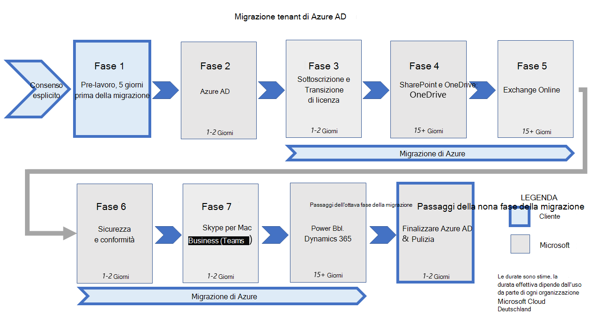

# <a name="migration-phases-actions-and-impacts-for-the-migration-from-microsoft-cloud-deutschland"></a>Azioni e impatti delle fasi di migrazione per la migrazione da Microsoft Cloud Deutschland

Le migrazioni dei tenant da Microsoft Cloud Deutschland (MCD) all'area "Germania" dei servizi globali di Microsoft Office 365 vengono eseguite come set di fasi e le relative azioni configurate per ogni carico di lavoro. Questa figura mostra le dieci fasi della migrazione ai nuovi datacenter tedeschi.

[](../media/ms-cloud-germany-migration-opt-in/migration-organization.png#lightbox)

Il processo di migrazione verrà completato per molte settimane a seconda delle dimensioni e della complessità complessive dell'organizzazione. Mentre la migrazione è in corso, gli utenti e gli amministratori possono continuare a utilizzare i servizi con le modifiche più dettagliate in questa documentazione. La grafica e la tabella definiscono le fasi e i passaggi durante la migrazione.

> [!NOTE]
> La migrazione dei servizi di Azure non fa parte di questa documentazione. Per queste informazioni, vedere [Guida alla migrazione per Azure Germania.](/azure/germany/germany-migration-main)

|Passaggio|Durata|Parte responsabile|Descrizione|
|:--------|:--------|:--------|:--------|
|Opt-In|Ore|Cliente|Scegliere l'organizzazione per la migrazione.|
|Pre-work|Giorni|Cliente|Completare il lavoro necessario per preparare utenti, workstation e rete per la migrazione.|
|Azure Active Directory (Azure AD)|1-2 giorni|Microsoft|Eseguire la migrazione dell'organizzazione di Azure AD a livello mondiale.|
|Azure|Settimane|Cliente|Creare nuove sottoscrizioni di Azure in tutto il mondo e [eseguire la transizione dei servizi di Azure](/azure/azure-resource-manager/management/move-resource-group-and-subscription).|
|Transizione & licenze di sottoscrizione|1-2 giorni|Microsoft|Acquistare abbonamenti in tutto il mondo, annullare gli abbonamenti a Microsoft Cloud Deutschland e effettuare la transizione delle licenze utente.|
|SharePoint e OneDrive|15+ giorni|Microsoft|Eseguire SharePoint e OneDrive for Business contenuto, conservando sharepoint.de URL.|
|Exchange Online|15+ giorni|Microsoft|Eseguire la Exchange Online contenuto e la transizione agli URL di tutto il mondo.|
|Sicurezza e conformità|1-2 giorni|Microsoft|Sicurezza della transizione & criteri di conformità e contenuto.|
|Skype for Business|1-2 giorni|Microsoft|Transizione da Skype for Business a Microsoft Teams.|
|Power BI & Dynamics 365|15+ giorni|Microsoft|Eseguire la Power BI e il contenuto di Dynamics 365.|
|Finalizzare Azure AD|1-2 giorni|Microsoft|Completare il cutover del tenant in tutto il mondo.|
|Clean-Up|1-2 giorni|Cliente|Pulire le connessioni legacy a Microsoft Cloud Deutschland, ad esempio Active Directory Federation Services (AD FS) Relying Party Trust, Azure AD Connessione e i riavvii del client Office server.|
|Endpoint disabilitati|30 giorni|Microsoft|30 giorni dopo la finalizzazione di Azure AD, il servizio Microsoft Cloud Deutschland Azure AD interromperà l'accesso agli endpoint per l'organizzazione in transizione. Le richieste degli endpoint, ad esempio l'autenticazione, avranno esito negativo da questo punto in avanti nel servizio Microsoft Cloud Deutschland. I clienti che eseguono carichi di lavoro di Azure nell'istanza collegata ai servizi Office 365 in Microsoft Cloud Deutschland verranno spostati nella fase di migrazione finale più avanti. |

Le fasi e le relative azioni garantiscono la migrazione dei dati critici e delle esperienze nei Office 365 globali. Dopo l'aggiunta del tenant alla coda di migrazione, ogni carico di lavoro verrà completato come una serie di passaggi eseguiti nel servizio back-end. Alcuni carichi di lavoro possono richiedere azioni da parte dell'amministratore (o dell'utente) o la migrazione può influire sull'utilizzo per le fasi eseguite e illustrate in Come è organizzata [la migrazione?](ms-cloud-germany-transition.md#how-is-the-migration-organized)

Le sezioni seguenti contengono azioni ed effetti per i carichi di lavoro durante le varie fasi della migrazione. Esaminare le tabelle e determinare quali azioni o effetti sono applicabili all'organizzazione. Assicurarsi di essere pronti a eseguire i passaggi nelle rispettive fasi in base alle esigenze. La mancata esecuzione dei passaggi necessari può causare un'interruzione del servizio e potrebbe ritardare il completamento della migrazione ai Office 365 servizi.

## <a name="phase-opt-in"></a>Fase: Opt-In

**Si** applica a: Tutti i clienti con un tenant di Office 365 ospitato in Microsoft Cloud Deutschland (MCD) Microsoft non può eseguire la migrazione di tenant Office 365 ospitati nel mcD senza il consenso.

| Step(s) | Descrizione | Impatto |
|:-------|:-----|:-------|
|**Attività cliente**: concedere il consenso per la migrazione| Il cliente concede il consenso per la migrazione in modo che Microsoft acquisisca il diritto di eseguire la migrazione e di orchestrare la transizione di dati e servizi all'Office 365 dei servizi globali. Esistono due modi <ol><li>L Office 365 amministratore tenant acconsente esplicitamente alla migrazione guidata da Microsoft. </li><li> I clienti hanno rinnovato le sottoscrizioni nel proprio tenant Office 365 mcd dopo il 1° maggio 2020. Microsoft notifica a questi clienti il diritto di migrazione ogni mese, attendi 30 giorni per offrire ai clienti la possibilità di annullare e quindi acconsentire direttamente.</li></ol> | <ul><li>Il tenant è contrassegnato come autorizzato per la migrazione e l'interfaccia di amministrazione visualizza la conferma. </li><li>Il riconoscimento viene inviato al centro messaggi Office 365 tenant. La configurazione del servizio continua dagli endpoint di Microsoft Cloud Deutschland. </li><li> </li></ul>
|**Amministratore tenant**: Monitorare i messaggi|L'amministratore tenant deve monitorare Office 365 centro messaggi per gli aggiornamenti sullo stato della fase di migrazione da questo momento in avanti.|Il cliente può eseguire le attività necessarie nel tempo.
||||

## <a name="phase-1-before-the-migration-starts"></a>Fase 1: prima dell'inizio della migrazione

Assicurarsi di avere familiarità con i passaggi di preparazione [della migrazione che si applicano a tutti i clienti](ms-cloud-germany-transition-add-pre-work.md).

Nel caso in cui sia stato impostato un CNAME DNS denominato _msoid_ in uno o più spazi dei nomi DNS di cui si è proprietari, è necessario rimuovere il CNAME fino alla fine della fase 8 al più tardi. È possibile rimuovere il _msoid_ CNAME in qualsiasi momento prima della fine della fase 8. Vedere la [documentazione preliminare per DNS](ms-cloud-germany-transition-add-pre-work.md#dns-entries-for-custom-domains).

Nel caso in cui si utilizzi single sign-on per Office 365 e Azure nell'istanza di Microsoft Cloud Deutschland, è necessario preparare e pianificare la migrazione della sottoscrizione di Azure di conseguenza. Assicurarsi di aver compreso i [prelavori per Microsoft Azure](ms-cloud-germany-transition-add-pre-work.md#microsoft-azure).

### <a name="azure-ad-connect-with-ad-fs-federation"></a>Azure AD Connessione con federazione AD FS
**Si applica a**: Clienti con federazione AD FS

**Se applicata:** prima dell'inizio della fase 2

Se si utilizza Active Directory Federation Services (AD FS), assicurarsi di eseguire il backup della configurazione [di](ms-cloud-germany-transition-add-adfs.md) ADFS  prima e dopo l'aggiunta dell'attendibilità del componente per il servizio globale di Office 365 prima dell'inizio della fase 2.

## <a name="phase-2-azure-ad-migration"></a>Fase 2: migrazione di Azure AD
In questa fase il Azure Active Directory verrà migrato nella nuova area del datacenter e diventerà attivo. I vecchi endpoint di Azure AD saranno ancora disponibili.

### <a name="exchange-online-hybrid---modify-authserver-on-premises"></a>Exchange Online Ibrido - Modificare AuthServer locale
**Si applica a:** Tutti i clienti che usano una configurazione ibrida Exchange con Exchange server locali

**Se applicata:** al termine della fase 2

AuthServer locale deve puntare al servizio token di sicurezza (STS) globale per l'autenticazione al termine della migrazione di Azure AD.
In questo modo si garantisce che le richieste di autenticazione per le richieste di disponibilità Exchange dagli utenti in stato di migrazione che hanno come destinazione l'ambiente locale ibrido siano autenticate per accedere al servizio locale. Analogamente, questo garantirà l'autenticazione delle richieste da locale a Office 365 endpoint dei servizi globali. Al termine della migrazione di Azure AD (fase 2), l'amministratore della topologia di Exchange (ibrida) locale deve aggiungere un nuovo endpoint del servizio di autenticazione per i servizi globali di Office 365. Con questo comando da Exchange PowerShell, sostituire con `<TenantID>` l'ID tenant dell'organizzazione trovato nel portale di Azure in Azure Active Directory.

```powershell
New-AuthServer GlobalMicrosoftSts -AuthMetadataUrl https://accounts.accesscontrol.windows.net/<TenantID>/metadata/json/1
```

Se non si completa questa attività, le richieste di disponibilità ibride potrebbero non fornire informazioni agli utenti delle cassette postali migrati da Microsoft Cloud Deutschland a Office 365 servizi.

## <a name="phase-3-subscription-transfer"></a>Fase 3: trasferimento della sottoscrizione

**Si applica a:** Tutti i clienti con Office 365 tenant ospitato in Microsoft Cloud Deutschland (MCD)

| Step(s) | Descrizione | Impatto |
|:-------|:-------|:-------|
| Le sottoscrizioni vengono trasferite| La sottoscrizione Microsoft Cloud Deutschland verrà migrata alla sottoscrizione di servizi globali Office 365 corrispondente. <ul><li>L Office 365'offerta di servizi globali di tale sottoscrizione è definita da Microsoft (nota anche come _mapping delle offerte)._</li><li> Le Office 365 servizi globali corrispondenti vengono acquistate nell'Office 365 globale per le sottoscrizioni Microsoft Cloud Deutschland trasferite.</li><li>Le sottoscrizioni legacy di Microsoft Cloud Deutschland vengono rimosse dal tenant dei Office 365 al completamento.</li></ul>| <ul><li>Le modifiche apportate alle sottoscrizioni esistenti verranno bloccate (ad esempio, non verranno apportate modifiche al numero di nuovi abbonamenti o al numero di postazioni) durante questa fase.</li><li>Le modifiche all'assegnazione delle licenze verranno bloccate.</li><li>Al termine della migrazione delle sottoscrizioni, sia i servizi di Office 365 che le sottoscrizioni Microsoft Cloud Deutschland saranno visibili nel portale di Amministrazione di Office 365, con lo stato di sottoscrizioni Microsoft Cloud Deutschland come _deprovisioned_. </li><li>Tutti i processi dei clienti che hanno dipendenze dalle sottoscrizioni Microsoft Cloud Deutschland o dai GUID SKU verranno interrotti e dovranno essere rivisti con l'offerta Office 365 servizi. </li><li>Le nuove sottoscrizioni nei servizi Office 365 verranno acquistate con il nuovo termine (mensile/trimestrale/annuale) e il cliente riceverà un rimborso ricomposizione per il saldo inutilizzato dell'abbonamento a Microsoft Cloud Deutschland. </li></ul> |
|Le licenze vengono riassegnate|Agli utenti con licenze di Microsoft Cloud Deutschland assegnate verranno assegnate licenze nell'Office 365 globale.|<ul><li>Agli utenti verranno riassegnate le licenze collegate alle nuove sottoscrizioni Office 365 services. Le licenze utente di tutti gli utenti verranno assegnate automaticamente alle nuove funzionalità.</li><li>Il numero di funzionalità (piani di servizio) offerti dai Office 365 può essere superiore a quello dell'offerta originale di Microsoft Cloud Deutschland. Le licenze utente nei Office 365 verranno assegnate in modo equivalente a funzionalità di Microsoft Cloud Deutschland simili (piani di servizio). </li></ul> 
|**Attività di amministrazione** Disabilitare le funzionalità|L'amministratore deve eseguire un'azione esplicita per disabilitare tali funzionalità, se necessario. |<ul><li>Gli utenti visualizzano nuovi servizi sconosciuti nel portale</li><li>Sono disponibili funzionalità aggiuntive(ad esempio, Microsoft Planner e Microsoft Flow), a meno che non siano disabilitate dall'amministratore tenant. Per informazioni su come disabilitare i piani di servizio assegnati alle licenze degli utenti, [vedere Disable access to Microsoft 365 services while assigning user licenses](disable-access-to-services-while-assigning-user-licenses.md).</li></ul>
|**Attività di amministrazione**|Rivedere i processi dei clienti che hanno dipendenze dalle sottoscrizioni Microsoft Cloud Deutschland o dai GUID SKU con l'offerta Office 365 servizi|I processi dei clienti continuano a funzionare.
||||

**Si applica a**: Partner Microsoft che usano il portale Office 365 partner

Tra la fase 2 e la fase 3, partner Portal potrebbe non essere accessibile. Durante questo periodo, il partner potrebbe non essere in grado di accedere alle informazioni del tenant nel portale per i partner. Poiché ogni migrazione è diversa, la durata dell'accessibilità può essere in ore.

Ulteriori informazioni per i provider di soluzioni cloud sono disponibili nella migrazione [del tenant partner.](ms-cloud-germany-transition-add-csp.md#partner-tenant-migration)


## <a name="phase-4-sharepoint-online"></a>Fase 4: SharePoint Online

**Si applica a**: Tutti i clienti che usano SharePoint Online

Nel caso in cui si utilizzino ancora SharePoint 2013, limitare l'utilizzo dei flussi di lavoro di SharePoint 2013 durante la migrazione SharePoint Online.

| Step(s) | Descrizione | Impatto |
|:-------|:-----|:-------|
| SharePoint e OneDrive transizione | SharePoint Online e OneDrive for Business vengono migrati da Microsoft Cloud Deutschland a Office 365 servizi globali in questa fase.<br><ul><li>Gli URL esistenti di Microsoft Cloud Deutschland vengono mantenuti (ad esempio, `contoso.sharepoint.de` ).</li><li>I siti esistenti vengono mantenuti.</li><li>I token di autenticazione sul lato client emessi dal servizio token di sicurezza (STS) nell'istanza dei servizi Microsoft Cloud Deutschland o Office 365 Global sono validi durante la transizione.</li></ul>|<ul><li>Il contenuto sarà di sola lettura per due brevi periodi durante la migrazione. Durante questo periodo, è previsto un banner "non è possibile modificare il contenuto" in SharePoint.</li><li>L'indice di ricerca non verrà conservato e la ricostruzione potrebbe richiedere fino a 10 giorni.</li><li>SharePoint Il contenuto online e OneDrive for Business sarà di sola lettura per due brevi periodi durante la migrazione. Durante questo periodo, gli utenti vedranno un banner "Non è possibile modificare il contenuto".</li><li>Al termine della migrazione SharePoint Online, i risultati della ricerca per il contenuto di SharePoint Online e OneDrive for Business potrebbero non essere disponibili durante la ricostruzione dell'indice. Durante questo periodo, le query di ricerca potrebbero non restituire risultati completi. Le funzionalità che dipendono da indici di ricerca, ad esempio SharePoint Notizie online, potrebbero essere interessate durante il completamento della reindicizzazione.</li><li>SharePoint 2013 i flussi di lavoro verranno interrotti durante la migrazione e devono essere ripubblicati dopo la migrazione.</li></ul>
|**Amministratore di SharePoint Server**: Ripubblicare SharePoint 2013| Un SharePoint online ripubblica i flussi SharePoint 2013 dopo la migrazione.| Si tratta di un'azione obbligatoria. La mancata riuscita di questa operazione può causare confusione dell'utente, chiamate all'help desk e una riduzione della produttività.
|**Utente di PowerShell**: Aggiornamento al nuovo modulo| Tutti gli utenti del modulo powershell di SharePoint Online devono aggiornare il modulo/Microsoft.SharePointOnline.CSOM alla versione 16.0.20717.12000 o successiva dopo il completamento della migrazione di SharePoint Online. Il completamento viene comunicato nel centro messaggi.| SharePoint Online tramite PowerShell o il modello a oggetti sul lato client non avrà più esito negativo.
||||

Considerazioni aggiuntive:

- Se l'organizzazione usa ancora SharePoint 2010, non funzioneranno più dopo il 31 dicembre 2021. SharePoint 2013 i flussi di lavoro rimarranno supportati, anche se disattivati per impostazione predefinita per i nuovi tenant a partire dal 1 novembre 2020. Al termine della migrazione al SharePoint Online, è consigliabile passare a Power Automate o ad altre soluzioni supportate.
 - I clienti di Microsoft Cloud Deutschland la cui istanza di SharePoint Online non è ancora stata migrata devono rimanere nel modulo powershell di SharePoint Online/Microsoft.SharePointOnline.CSOM versione 16.0.20616.12000 o successiva. In caso contrario, le connessioni SharePoint Online tramite PowerShell o il modello a oggetti sul lato client avranno esito negativo.
- Durante questa fase, gli indirizzi IP dietro gli URL SharePoint cambieranno. Dopo la transizione ai servizi globali di Office 365, gli indirizzi per gli URL del tenant conservati (ad esempio, e ) verranno modificati negli URL e negli intervalli di indirizzi IP di Microsoft 365 worldwide `contoso.sharepoint.de` `contoso-my.sharepoint.de` [(SharePoint Online e OneDrive for Business).](/microsoft-365/enterprise/urls-and-ip-address-ranges#sharepoint-online-and-onedrive-for-business)
- Mentre SharePoint e OneDrive sono in transizione, Office Online potrebbe non funzionare come previsto. 

> [!NOTE]
> Nel caso in cui si utilizzi eDiscovery, assicurarsi di essere a conoscenza [dell'esperienza di migrazione di eDiscovery.](ms-cloud-germany-transition-add-scc.md)

## <a name="phase-5-exchange-online"></a>Fase 5: Exchange Online 
A partire dalla fase 5, Exchange Online cassette postali vengono spostate da Microsoft Cloud Deutschland a Office 365 servizi globali.

L Office 365'area dei servizi globali è impostata come predefinita, che consente al servizio di bilanciamento del carico interno di ridistribuire le cassette postali nell'area predefinita appropriata nei Office 365 locali. In questa transizione, gli utenti su entrambi i lati (mcd o servizi globali) si stanno nella stessa organizzazione e possono usare entrambi gli endpoint URL.

La nuova area geografica "Germania" viene aggiunta alla configurazione dell'organizzazione. Exchange Online configurazione aggiunge la nuova area tedesca go-local all'organizzazione di transizione.

- Eseguire la transizione di utenti e servizi dagli URL MCD legacy ( ) ai nuovi URL `https://outlook.office.de` Office 365 services ( `https://outlook.office365.com` ).
-  I servizi Exchange Online (Outlook Web Access e Exchange Admin Center) per la nuova area data center tedesca saranno disponibili da questa fase, ma non saranno disponibili in precedenza.
- Gli utenti possono continuare ad accedere al servizio tramite URL MCD legacy durante la migrazione, tuttavia devono smettere di usare gli URL legacy al termine della migrazione.
- Gli utenti devono passare all'utilizzo del portale Office globale per le Office Online (Calendario, Posta, Persone). L'esplorazione dei servizi non ancora migrati in Office 365 non funzionerà finché non viene eseguita la migrazione. 
- Questa limitazione si applica anche a servizi in background come "Account personale". Il mio account per i servizi globali sarà disponibile dopo il completamento della fase 9. Fino a questo momento, gli utenti devono usare il portale MCD per gestire le impostazioni dell'account.
- Il Outlook Web App non fornirà l'esperienza delle cartelle pubbliche durante la migrazione.

Se si desidera modificare le foto utente durante la fase 5, vedere [Exchange Online PowerShell - Set-UserPhoto durante la fase 5.](#exchange-online-powershell)

### <a name="dns-record-for-autodiscover-in-exchange-online"></a>Record DNS per individuazione automatica in Exchange Online
**Si applica a:** Clienti che usano Exchange Online con un dominio personalizzato

Le impostazioni DNS gestite dal cliente per l'individuazione automatica che attualmente puntano a Microsoft Cloud Deutschland devono essere aggiornate per fare riferimento all'endpoint globale di Office 365 al completamento della fase Exchange Online (fase 5). <br> Le voci DNS esistenti con CNAME che puntano autodiscover-outlook.office.de devono essere aggiornate in modo che puntino a **autodiscover.outlook.com**.

I clienti che non eseguono questi aggiornamenti DNS al termine della fase di migrazione **9** potrebbero verificarsi problemi di servizio al termine della migrazione.

> [!NOTE]
> Gli errori di convalida nell'interfaccia di amministrazione per i domini personalizzati per la voce di individuazione automatica possono essere ignorati. I servizi funzionano correttamente solo quando il record CNAME è stato modificato in autodiscover.outlook.com.

### <a name="exchange-online-powershell"></a>Exchange Online PowerShell
**Si applica a:** Exchange Online amministratori che usano Exchange Online PowerShell

Durante la fase di migrazione, l'utilizzo dei cmdlet di PowerShell **New-MigrationEndpoint,** **Set-MigrationEndpoint** e **Test-MigrationsServerAvailability** può causare errori (errore nel proxy). Ciò accade quando la cassetta postale di arbitraggio è stata migrata in tutto il mondo, ma la cassetta postale di amministrazione non è stata o viceversa. Per risolvere il problema, durante la creazione della sessione di PowerShell tenant, utilizzare la cassetta postale di arbitraggio come suggerimento di routing in **ConnectionUri**. Ad esempio:

```powershell
New-PSSession 
    -ConfigurationName Microsoft.Exchange 
    -ConnectionUri "https://outlook.office365.com/powershell-liveid?email=Migration.8f3e7716-2011-43e4-96b1-aba62d229136@<tenant>.onmicrosoft.de"
    -Credential $UserCredential
    -Authentication Basic
    -AllowRedirection
```
L'utilizzo del cmdlet **Di PowerShell Set-UserPhoto** comporta un errore se è stata eseguita la migrazione di una cassetta postale utente ma non è stata eseguita la migrazione di una cassetta postale di amministratore o viceversa. In questo caso, un amministratore deve passare l'ID di posta elettronica dell'utente la cui foto deve essere modificata durante la creazione `ConnectionUri` della sessione di PowerShell tenant: 
```powershell
-ConnectionUri "https://outlook.office.de/powershell-liveid?email=<user_email>" 
```
 dove `<user_email>` è il segnaposto per l'ID di posta elettronica della cassetta postale dell'utente. 

Considerazioni aggiuntive:
- Agli utenti di Outlook Web App che accedono a una cassetta postale condivisa nell'altro ambiente (ad esempio, un utente nell'ambiente MCD accede a una cassetta postale condivisa nell'ambiente globale) verrà richiesto di eseguire l'autenticazione una seconda volta. L'utente deve prima autenticare e accedere alla propria cassetta postale in `outlook.office.de` , quindi aprire la cassetta postale condivisa in `outlook.office365.com` . Dovranno eseguire l'autenticazione una seconda volta quando accedono alle risorse condivise ospitate nell'altro servizio.
- Per i clienti Microsoft Cloud Deutschland esistenti o quelli in transizione, quando una cassetta postale condivisa viene aggiunta a Outlook utilizzando **File > Info > Aggiungi account**, la visualizzazione delle autorizzazioni del calendario potrebbe non riuscire (il client Outlook tenta di utilizzare l'API Rest `https://outlook.office.de/api/v2.0/Me/Calendars` ). I clienti che desiderano aggiungere un account per visualizzare le autorizzazioni del calendario possono aggiungere la chiave del Registro di sistema come descritto in [User experience changes for sharing a calendar in Outlook](https://support.microsoft.com/office/user-experience-changes-for-sharing-a-calendar-in-outlook-5978620a-fe6c-422a-93b2-8f80e488fdec) per garantire che questa azione abbia esito positivo. Questa chiave del Registro di sistema può essere distribuita a livello di organizzazione tramite Criteri di gruppo.
- Tutti i clienti che utilizzano una configurazione ibrida di Exchange attiva non sono in grado di spostare le cassette postali da Exchange Server locale a Exchange Online, né a Microsoft Cloud Deutschland né alla nuova area dati in Germania. I clienti devono assicurarsi che gli spostamenti continui delle cassette postali siano stati completati prima della fase 5 e che siano ripresi dopo il completamento di questa fase.
- L'esecuzione di , un cmdlet di PowerShell, durante la migrazione di Exchange `Test-MigrationServerAvailabiilty` da Microsoft Cloud Deutschland a Office 365 potrebbe non funzionare. Tuttavia, funzionerà correttamente al termine della migrazione.
- Se i client si verificano problemi con le credenziali o l'autorizzazione dopo la migrazione delle cassette postali, reimmigare le credenziali di amministratore locale nell'endpoint di migrazione eseguendo o impostando la stessa tramite il Pannello di controllo di `Set-MigrationEndpoint -Identity <endpointName> -Credential $(Get-Credential)` Exchange.
- Assicurarsi che tutti gli utenti che utilizzano protocolli legacy (POP3/IMAP4/SMTP) per i propri dispositivi siano pronti a modificare gli endpoint nel client dopo che la cassetta postale di Exchange è stata spostata nella nuova area del datacenter tedesco, come descritto nei passaggi [di pre-migrazione](ms-cloud-germany-transition-add-pre-work.md#exchange-online)per Exchange Online .
- La pianificazione Skype for Business riunioni in Outlook Web App non è più disponibile dopo la migrazione della cassetta postale. Se necessario, gli utenti devono usare Outlook utenti.

Per ulteriori informazioni sulle differenze per le organizzazioni nella migrazione e dopo la migrazione delle risorse di Exchange Online, esaminare le informazioni in [Customer experience during the migration to Office 365 services in the new German datacenter regions](ms-cloud-germany-transition-experience.md).

## <a name="phase-6-exchange-online-protection--security-and-compliance"></a>Fase 6: Exchange Online Protection/ Sicurezza e conformità

**Si applica a:** Tutti i clienti che usano Exchange Online<br>

Le funzionalità di Exchange Online Protection (EOP) back-end vengono copiate nella nuova area geografica "Germania". Exchange Online viene eseguita la migrazione del routing da host esterni a Office 365 e dettagli cronologici del tenant, che include anche servizi back-end per le funzionalità di sicurezza e conformità.

I clienti che Exchange Online solo funzionalità non ibride non devono prestare attenzione in questa fase.

### <a name="exchange-online-hybrid-deployments"></a>Exchange Online Distribuzioni ibride
**Si applica a:** Tutti i clienti che usano una configurazione ibrida Exchange con Exchange server locali

Assicurarsi che le [Exchange siano state](ms-cloud-germany-transition-add-pre-work.md#exchange-online-hybrid-customers) applicate prima dell'inizio del passaggio di migrazione **5.** Exchange Online i clienti ibridi devono eseguire la versione più recente della procedura guidata di configurazione ibrida di Exchange (HCW) in modalità "Office 365 Germania" per preparare la configurazione locale per la migrazione ai servizi globali di Office 365.

**Azioni dell'amministratore:**
- Tra l'inizio della fase di migrazione 6 e il completamento della fase di migrazione 9 (quando viene pubblicato l'avviso del Centro messaggi), è necessario eseguire di nuovo HCW utilizzando le impostazioni di Office 365 Worldwide per puntare i sistemi locali ai servizi globali di Office 365. La mancata esecuzione di questa attività prima della fase 9 [migrazione completata] può causare rapporti di mancato recapito per la posta instradata tra la distribuzione di Exchange locale e Office 365.
- Arrestare o eliminare gli spostamenti delle cassette postali di onboarding o offboarding, in modo da non spostare le cassette postali tra Exchange locale e Exchange Online.  In questo modo le richieste di spostamento delle cassette postali non hanno esito negativo con un errore. L'esito negativo di questa operazione può causare un errore del servizio o Office client.
- Ulteriori Send-Connectors creati oltre al connettore creato da HCW e che sono mirati a Exchange Online devono essere aggiornati in questa fase immediatamente dopo l'esecuzione dell'HCW, altrimenti smetteranno di funzionare. Il dominio TLS deve essere aggiornato per questi connettori di invio. <br> Per aggiornare il dominio TLS, utilizzare il seguente comando di PowerShell nell'Exchange Server locale:
```powershell
Set-SendConnector -Identity <SendConnectorName> -TlsDomain "mail.protection.outlook.com"
```

## <a name="phase-7-skype-for-business-online---transition-to-microsoft-teams"></a>Fase 7: Skype for Business Online - Transizione a Microsoft Teams
**Si applica a:** Tutti i clienti che usano Skype for Business Online

Esaminare i [passaggi di pre-migrazione per Skype for Business online](ms-cloud-germany-transition-add-pre-work.md#skype-for-business-online) e assicurarsi di aver completato tutti i passaggi.
In questa fase, Skype for Business verrà eseguita la migrazione a Microsoft Teams. I Skype for Business esistenti vengono migrati a Office 365 Servizi globali in Europa e quindi a Microsoft Teams nell'area "Germania" di Office 365 servizi.

- Gli utenti non potranno accedere a Skype for Business alla data di migrazione. Dieci giorni prima della migrazione, il cliente riceverà un messaggio nell'interfaccia di amministrazione che annuncia quando avrà luogo la migrazione e di nuovo all'inizio della migrazione.
- Viene eseguita la migrazione della configurazione dei criteri.
- Gli utenti verranno migrati a Teams e non avranno più accesso a Skype for Business dopo la migrazione.
- Gli utenti devono avere installato Microsoft Teams client desktop. L'installazione verrà eseguita durante i 10 giorni tramite criteri nell'infrastruttura Skype for Business, ma in caso di errore, gli utenti dovranno comunque scaricare il client o connettersi con un browser supportato.
- I contatti e le riunioni verranno migrati in Microsoft Teams.
- Gli utenti non potranno accedere a Skype for Business tra le transizioni di servizio a Office 365 e non fino al completamento delle voci DNS dei clienti.
- I contatti e le riunioni esistenti continueranno a funzionare come Skype for Business riunioni.

Quando è stato configurato un dominio di vanità per Skype for Business, le voci DNS devono essere aggiornate. Fare riferimento [a Domini nel interfaccia di amministrazione di Microsoft 365](https://admin.microsoft.com/Adminportal/Home#/Domains) e applicare le modifiche nella configurazione DNS. 

Se è necessario connettersi a Skype for Business Online con PowerShell al termine della fase di migrazione 9, utilizzare il codice di PowerShell seguente per connettersi:

```powershell
Import-Module MicrosoftTeams
$userCredential = Get-Credential
Connect-MicrosoftTeams -Credential $userCredential
```

### <a name="known-limitations-until-finalizing-azure-ad-migration"></a>Limitazioni note fino alla finalizzazione della migrazione di Azure AD
Microsoft Teams si sta sfruttando le funzionalità di Azure AD. Anche se la migrazione di Azure AD non è stata completata, alcune funzionalità di Microsoft Teams non sono completamente disponibili. Dopo la fase 9, quando la migrazione di Azure AD è stata finalizzata, le funzionalità seguenti diventano completamente disponibili:

- Le app non possono essere gestite nell'Microsoft Teams di amministrazione.
- I nuovi team possono essere creati nel client Microsoft Teams solo a meno che l'amministratore Teams non abbia limitato le autorizzazioni per gli utenti per creare nuovi team. Non è possibile creare nuovi team nell'Microsoft Teams di amministrazione. 
- La versione Web di Microsoft Teams non è disponibile.

## <a name="phase-8-dynamics-365"></a>Fase 8: Dynamics 365

**Si applica a:** Tutti i clienti che usano Microsoft Dynamics 365

Assicurarsi di avere familiarità con le attività di pre-elaborazione per la procedura di installazione di [Microsoft Dynamics 365.](ms-cloud-germany-transition-add-pre-work.md#dynamics365)

I clienti con Dynamics 365 richiedono un impegno aggiuntivo per eseguire la migrazione indipendente delle organizzazioni Dynamics dell'organizzazione.

| Step(s) | Descrizione | Impatto |
|:-------|:-------|:-------|
| Risorse di Microsoft Dynamics | I clienti con Microsoft Dynamics saranno impegnati da Microsoft Engineering o Microsoft FastTrack per eseguire la transizione di Microsoft Dynamics 365 all'Office 365 dei servizi globali.* |<ul><li>Dopo la migrazione, l'amministratore convalida l'organizzazione. </li><li>L'amministratore modifica i flussi di lavoro, se necessario. </li><li>L'amministratore cancella la modalità AdminOnly in base alle esigenze.</li><li>L'amministratore modifica il tipo di organizzazione _da Sandbox_, in base alle esigenze</li><li>Informare gli utenti finali del nuovo URL per accedere all'istanza (org).</li><li>Aggiornare tutte le connessioni in ingresso al nuovo URL dell'endpoint. </li><li>Il servizio Dynamics non sarà disponibile per gli utenti durante la transizione. </li><li>Gli utenti devono convalidare l'integrità e le funzionalità dell'organizzazione dopo la migrazione di ogni organizzazione.</li></ul>|
||||

\* (i) I clienti con Microsoft Dynamics 365 devono intervenire in questo scenario di migrazione come definito dal processo di migrazione fornito. (ii) Se il cliente non riesce a eseguire un'azione, Microsoft non sarà in grado di completare la migrazione. (iii) Quando Microsoft non è in grado di completare la migrazione a causa dell'inazione del cliente, la sottoscrizione del cliente scadrà il 29 ottobre 2021.

## <a name="phase-8-power-bi"></a>Fase 8: Power BI

**Si applica a:** Tutti i clienti che usano Microsoft Power BI (PBI)

| Step(s) | Descrizione | Impatto |
|:-------|:-------|:-------|
| Migrazione di Power BI risorse | I clienti con Microsoft Power BI (PBI) saranno coinvolti da Microsoft Engineering o Microsoft FastTrack dopo aver attivato manualmente uno strumento di migrazione PBI esistente per eseguire la transizione di Power BI all'istanza dei servizi globali di Office 365.\*\* |<ul><li>Gli elementi Power BI seguenti  non verranno transizionati e doranno essere ri-creati: <</li><li>Set di dati in tempo reale,ad esempio set di dati di streaming o push. </li><li>Power BI configurazione e origine dati del gateway dati locale. </li><li>I report creati in base ai set di dati in tempo reale non saranno disponibili dopo la migrazione e devono essere ricreati. </li><li>Power BI non saranno disponibili per gli utenti durante la transizione. L'inabilità del servizio non deve essere superiore a 24 ore.</li><li>Gli utenti doranno riconfigurare le origini dati e i relativi gateway dati locali con il servizio Power BI dopo la migrazione.  Fino a quando non lo fanno, gli utenti non saranno in grado di utilizzare queste origini dati per eseguire l'aggiornamento pianificato e/o le query dirette su tali origini dati. </li><li>Non è possibile eseguire la migrazione delle capacità e delle aree di lavoro premium. I clienti devono eliminare tutte le capacità prima della migrazione e crearle di nuovo dopo la migrazione. Spostare di nuovo le aree di lavoro nelle capacità desiderate.</li></ul>  |
||||

\*\*(i) I clienti con Microsoft Power BI devono intervenire in questo scenario di migrazione come definito dal processo di migrazione fornito. (ii) Se il cliente non riesce a eseguire un'azione, Microsoft non sarà in grado di completare la migrazione. (iii) Quando Microsoft non è in grado di completare la migrazione a causa dell'inazione del cliente, la sottoscrizione del cliente scadrà il 29 ottobre 2021.

## <a name="phase-9-office-apps"></a>Fase 9: Office app

**Si applica a:** Tutti i clienti che Office applicazioni desktop (Word, Excel, PowerPoint, Outlook, OneDrive ...)

In questa fase, tutte le applicazioni client e Office Online eseguono il cutover del client. Azure AD finalizza l'ambito tenant in modo che punti ai Office 365 e agli endpoint correlati.

i tenant di Office 365 in transizione all'area "Germania" richiedono a tutti gli utenti di chiudere, disconnettersi da Office 365 e accedere di nuovo per tutte le applicazioni desktop Office (Word, Excel, PowerPoint, Outlook e così via) e il client OneDrive for Business dopo che la migrazione tenant ha raggiunto la fase 9. La disconnessione e l'accesso consentono ai Office di ottenere nuovi token di autenticazione dal servizio globale di Azure AD.

Nel caso in cui le applicazioni desktop di Office non funzionino dopo aver eseguito la disconnessione e l'accesso dalle applicazioni, è consigliabile eseguire lo strumento [Office Client Cutover Tool (OCCT)](https://github.com/microsoft/OCCT) nel computer interessato per risolvere il problema.

Se lo [Office Client Cutover Tool (OCCT)](https://github.com/microsoft/OCCT) è stato distribuito e pianificato in anticipo nei client Windows, la procedura di disconnessione/accesso non è necessaria.

L'esperienza utente migliore può essere garantita utilizzando le applicazioni Office recenti. Le aziende devono prendere in considerazione l'uso del Canale Enterprise mensile.

Assicurati di aver completato la [procedura preliminare per i dispositivi](ms-cloud-germany-transition-add-pre-work.md#mobile-device-management) mobili.

Considerazioni aggiuntive:
- Informare gli utenti di chiudere tutte le app Office e quindi accedere di nuovo (o forzare il riavvio dei client e gli utenti ad accedere) per consentire ai client Office di ritirare la modifica.
- Informare gli utenti e il personale dell'help desk che gli utenti potrebbero visualizzare un banner Office che richiede loro di riattivare le app Office entro 72 ore dal cutover.
- Tutte Office applicazioni nei computer personali devono essere chiuse e gli utenti devono disconnettersi e quindi accedere di nuovo. Nella barra di attivazione gialla, accedi per riattivare i servizi Office 365 sicurezza.
- I computer condivisi richiederanno azioni simili ai computer personali e non richiederanno una procedura speciale.
- Nei dispositivi mobili, gli utenti devono disconnettersi dall'app, chiuderle e quindi accedere di nuovo.

## <a name="phase-9-line-of-business-apps"></a>Fase 9: app line-of-business

**Si applica a:** Tutti i clienti che usano app line-of-business connesse a Office 365

Nel caso di app line-of-business, assicurati di aver completato la procedura preliminare per le app [line-of-business.](ms-cloud-germany-transition-add-pre-work.md#line-of-business-apps)

## <a name="phase-9--10-azure-ad-finalization"></a>Fase 9 & 10: Finalizzazione di Azure AD

**Si applica a:** Tutti i clienti

Quando il tenant Office 365 completa il passaggio finale della migrazione (Fase 9: Finalizzazione di Azure AD), tutti i servizi vengono transitati a livello mondiale. Nessuna applicazione o utente deve accedere alle risorse per il tenant in uno qualsiasi degli endpoint di Microsoft Cloud Deutschland. Automaticamente, 30 giorni dopo il completamento della finalizzazione, il servizio Microsoft Cloud Deutschland Azure AD interromperà l'accesso degli endpoint per il tenant di transizione. Le richieste degli endpoint, ad esempio l'autenticazione, avranno esito negativo da questo punto in avanti nel servizio Microsoft Cloud Deutschland.  

Microsoft Azure i clienti devono eseguire la transizione dei carichi di lavoro di Azure seguendo i passaggi descritti nel [playbook](/azure/germany/germany-migration-main) di migrazione di Azure non appena il tenant completa la migrazione a livello mondiale (Fase 9).  

| Step(s) | Descrizione | Impatto |
|:-------|:-------|:-------|
| Aggiornare gli endpoint utente | Verificare che tutti gli utenti accertano il servizio utilizzando gli endpoint Microsoft in tutto il mondo adeguati |30 giorni dopo la finalizzazione della migrazione, gli endpoint di Microsoft Cloud Deutschland smetteranno di rispettare le richieste; il traffico del client o dell'applicazione avrà esito negativo.  |
| Aggiornare gli endpoint dell'applicazione Azure AD | È necessario aggiornare gli endpoint di autenticazione, Azure Active Directory (Azure AD) Graph e MS Graph per le applicazioni a quelli del servizio Microsoft Worldwide. | 30 giorni dopo la finalizzazione della migrazione, gli endpoint di Microsoft Cloud Deutschland smetteranno di rispettare le richieste; il traffico del client o dell'applicazione avrà esito negativo. |
| Eseguire la migrazione dei carichi di lavoro di Azure | I clienti dei servizi di Azure devono effettuare il provisioning di nuove sottoscrizioni a livello mondiale per i servizi di Azure ed eseguire la migrazione in base al [playbook di migrazione di Azure.](/azure/germany/germany-migration-main) | Quando si esegue la transizione completa al servizio globale (fase 10), i clienti non saranno più in grado di accedere ai carichi di lavoro di Azure presenti nel portale di Azure di Microsoft Cloud Deutschland. |
||||

**Si applica a:** Clienti con dispositivi registrati o aggiunti ad Azure AD

Al termine della fase 9, i dispositivi registrati e aggiunti ad Azure AD devono essere connessi all'istanza di Azure AD di transizione nella nuova area dati tedesca.
I dispositivi non aggiunti di nuovo ad Azure AD potrebbero non funzionare più alla fine della fase 10. Per istruzioni dettagliate e ulteriori dettagli, fare riferimento alle [informazioni aggiuntive sui dispositivi](ms-cloud-germany-transition-add-devices.md).

### <a name="azure-ad-connect"></a>Azure AD Connect
**Si applica a:** Tutti i clienti che sincronizzano le identità con Azure AD connect

| Step(s) | Descrizione | Impatto |
|:-------|:-------|:-------|
| Aggiornare Azure AD Connessione. | Al termine del cut over ad Azure AD, l'organizzazione usa completamente i Office 365 e non è più connessa a Microsoft Cloud Deutschland. A questo punto, il cliente deve assicurarsi che il processo di sincronizzazione delta sia stato finalizzato e, successivamente, modificare il valore stringa di `AzureInstance` da 3 (Microsoft Cloud Deutschland) a 0 nel percorso del Registro di `Computer\HKEY_LOCAL_MACHINE\SOFTWARE\Microsoft\Azure AD Connect` sistema. | Modificare il valore di `AzureInstance` , la chiave del Registro di sistema. In caso contrario, gli oggetti non verranno sincronizzati dopo che gli endpoint di Microsoft Cloud Deutschland non saranno più disponibili. |
|||||

## <a name="post-migration"></a>Post-migrazione

Leggere l'articolo [attività post-migrazione](ms-cloud-germany-transition-add-experience.md) ed eseguirle di conseguenza.
