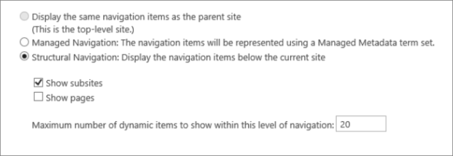

# <a name="navigation-options-for-sharepoint-online"></a><span data-ttu-id="31879-103">Opzioni di spostamento per SharePoint Online</span><span class="sxs-lookup"><span data-stu-id="31879-103">Navigation options for SharePoint Online</span></span>

<span data-ttu-id="31879-104">In questo articolo vengono descritti i siti delle opzioni di spostamento con Pubblicazione SharePoint abilitata in SharePoint Online.</span><span class="sxs-lookup"><span data-stu-id="31879-104">This article describes navigation options sites with SharePoint Publishing enabled in SharePoint Online.</span></span> <span data-ttu-id="31879-105">La scelta e la configurazione dell'esplorazione influiscono in modo significativo sulle prestazioni e sulla scalabilità dei siti in SharePoint Online.</span><span class="sxs-lookup"><span data-stu-id="31879-105">The choice and configuration of navigation significantly impacts the performance and scalability of sites in SharePoint Online.</span></span> <span data-ttu-id="31879-106">Il modello di sito Pubblicazione SharePoint deve essere utilizzato solo se necessario per un portale centralizzato e la caratteristica di pubblicazione deve essere abilitata solo in siti specifici e solo quando assolutamente necessaria perché può influire sulle prestazioni se utilizzata in modo non corretto.</span><span class="sxs-lookup"><span data-stu-id="31879-106">The SharePoint Publishing site template should only be used if required for a centralized portal and the publishing feature should only be enabled on specific sites and only when absolutely required as it can impact performance when used incorrectly.</span></span>

>[!NOTE]
><span data-ttu-id="31879-107">Se si usano opzioni di spostamento moderne di SharePoint, ad esempio menu mega, spostamento a catena o spostamento hub, questo articolo non si applica al sito.</span><span class="sxs-lookup"><span data-stu-id="31879-107">If you're using modern SharePoint navigation options like mega menu, cascading navigation, or hub navigation, this article does not apply to your site.</span></span> <span data-ttu-id="31879-108">Le architetture moderne dei siti di SharePoint sfruttano una gerarchia di siti più appiattita e un modello hub-and-spoke.</span><span class="sxs-lookup"><span data-stu-id="31879-108">Modern SharePoint site architectures leverage a more flattened site hierarchy and a hub-and-spoke model.</span></span> <span data-ttu-id="31879-109">In questo modo è possibile ottenere molti scenari che NON richiedono l'utilizzo della funzionalità Pubblicazione SharePoint.</span><span class="sxs-lookup"><span data-stu-id="31879-109">This allows many scenarios to be achieved that do NOT require use of the SharePoint Publishing feature.</span></span>

## <a name="overview-of-navigation-options"></a><span data-ttu-id="31879-110">Panoramica delle opzioni di spostamento</span><span class="sxs-lookup"><span data-stu-id="31879-110">Overview of navigation options</span></span>

<span data-ttu-id="31879-111">La configurazione del provider di spostamento può influire in modo significativo sulle prestazioni per l'intero sito ed è necessario prestare particolare attenzione per scegliere un provider di esplorazione e una configurazione che si adatta in modo efficace ai requisiti di un sito di SharePoint.</span><span class="sxs-lookup"><span data-stu-id="31879-111">Navigation provider configuration can significantly impact performance for the entire site, and careful consideration must be taken to pick a navigation provider and configuration that scales effectively for the requirements of a SharePoint site.</span></span> <span data-ttu-id="31879-112">Sono disponibili due provider di spostamento predefiniti e implementazioni di spostamento personalizzate.</span><span class="sxs-lookup"><span data-stu-id="31879-112">There are two out-of-the-box navigation providers, as well as custom navigation implementations.</span></span>

<span data-ttu-id="31879-113">La prima opzione, [**Struttura**](#using-structural-navigation-in-sharepoint-online)di spostamento , è l'opzione di spostamento consigliata in SharePoint Online per i siti di Sharepoint classici, se si attiva la memorizzazione nella cache dell'esplorazione strutturale **per il sito.**</span><span class="sxs-lookup"><span data-stu-id="31879-113">The first option, [**Structural navigation**](#using-structural-navigation-in-sharepoint-online), is the recommended navigation option in SharePoint Online for classic Sharepoint sites, **if you turn on structural navigation caching for your site**.</span></span> <span data-ttu-id="31879-114">Questo provider di spostamento visualizza gli elementi di spostamento al di sotto del sito corrente e, facoltativamente, il sito corrente e i relativi elementi di pari livello.</span><span class="sxs-lookup"><span data-stu-id="31879-114">This navigation provider displays the navigation items below the current site, and optionally the current site and its siblings.</span></span> <span data-ttu-id="31879-115">Offre funzionalità aggiuntive, ad esempio la limitazione per motivi di sicurezza e l'enumerazione della struttura del sito.</span><span class="sxs-lookup"><span data-stu-id="31879-115">It provides additional capabilities such as security trimming and site structure enumeration.</span></span> <span data-ttu-id="31879-116">Se la memorizzazione nella cache è disabilitata, ciò inciderà negativamente sulle prestazioni e sulla scalabilità e potrebbe essere soggetta a limitazioni.</span><span class="sxs-lookup"><span data-stu-id="31879-116">If caching is disabled, this will negatively impact performance and scalability, and may be subject to throttling.</span></span>

<span data-ttu-id="31879-117">La seconda opzione, [**Esplorazione gestita (metadati),**](#using-managed-navigation-and-metadata-in-sharepoint-online)rappresenta gli elementi di spostamento tramite un set di termini Metadati gestiti.</span><span class="sxs-lookup"><span data-stu-id="31879-117">The second option, [**Managed (Metadata) navigation**](#using-managed-navigation-and-metadata-in-sharepoint-online), represents navigation items using a Managed Metadata term set.</span></span> <span data-ttu-id="31879-118">È consigliabile che la limitazione per motivi di sicurezza sia disabilitata a meno che non sia necessaria.</span><span class="sxs-lookup"><span data-stu-id="31879-118">We recommend that security trimming be disabled unless required.</span></span> <span data-ttu-id="31879-119">La limitazione per motivi di sicurezza è abilitata come impostazione sicura per impostazione predefinita per questo provider di spostamento. Tuttavia, molti siti non richiedono l'overhead della limitazione per motivi di sicurezza poiché gli elementi di spostamento spesso sono coerenti per tutti gli utenti del sito.</span><span class="sxs-lookup"><span data-stu-id="31879-119">Security trimming is enabled as a secure-by-default setting for this navigation provider; however, many sites do not require the overhead of security trimming since navigation elements often are consistent for all users of the site.</span></span> <span data-ttu-id="31879-120">Con la configurazione consigliata per disabilitare la limitazione per motivi di sicurezza, questo provider di spostamento non richiede l'enumerazione della struttura del sito ed è altamente scalabile con un impatto sulle prestazioni accettabile.</span><span class="sxs-lookup"><span data-stu-id="31879-120">With the recommended configuration to disable security trimming, this navigation provider does not require enumerating site structure and is highly scalable with acceptable performance impact.</span></span>

<span data-ttu-id="31879-121">Oltre ai provider di spostamento predefiniti, molti clienti hanno implementato correttamente implementazioni di spostamento personalizzate alternative.</span><span class="sxs-lookup"><span data-stu-id="31879-121">In addition to the out-of-the-box navigation providers, many customers have successfully implemented alternative custom navigation implementations.</span></span> <span data-ttu-id="31879-122">Vedere [Script sul lato client](#using-search-driven-client-side-scripting) basato sulla ricerca in questo articolo.</span><span class="sxs-lookup"><span data-stu-id="31879-122">See [Search-driven client-side scripting](#using-search-driven-client-side-scripting) in this article.</span></span>
  
## <a name="pros-and-cons-of-sharepoint-online-navigation-options"></a><span data-ttu-id="31879-123">Pro e contro delle opzioni di spostamento di SharePoint Online</span><span class="sxs-lookup"><span data-stu-id="31879-123">Pros and Cons of SharePoint Online navigation options</span></span>

<span data-ttu-id="31879-124">Nella tabella seguente sono riepilogati i pro e i contro di ogni opzione.</span><span class="sxs-lookup"><span data-stu-id="31879-124">The following table summarizes the pros and cons of each option.</span></span>

|<span data-ttu-id="31879-125">Esplorazione strutturale</span><span class="sxs-lookup"><span data-stu-id="31879-125">Structural navigation</span></span>  |<span data-ttu-id="31879-126">Esplorazione gestita</span><span class="sxs-lookup"><span data-stu-id="31879-126">Managed navigation</span></span>  |<span data-ttu-id="31879-127">Esplorazione basata sulla ricerca</span><span class="sxs-lookup"><span data-stu-id="31879-127">Search-driven navigation</span></span>  |<span data-ttu-id="31879-128">Provider di spostamento personalizzato</span><span class="sxs-lookup"><span data-stu-id="31879-128">Custom-navigation provider</span></span>  |
|---------|---------|---------|---------|
|<span data-ttu-id="31879-129">Pro:</span><span class="sxs-lookup"><span data-stu-id="31879-129">Pros:</span></span><br/><br/><span data-ttu-id="31879-130">Facile da gestire</span><span class="sxs-lookup"><span data-stu-id="31879-130">Easy to maintain</span></span><br/><span data-ttu-id="31879-131">Sicurezza con limitazione</span><span class="sxs-lookup"><span data-stu-id="31879-131">Security trimmed</span></span><br/><span data-ttu-id="31879-132">Si aggiorna automaticamente entro 24 ore quando il contenuto viene modificato</span><span class="sxs-lookup"><span data-stu-id="31879-132">Automatically updates within 24 hours when content is changed</span></span><br/>     |<span data-ttu-id="31879-133">Pro:</span><span class="sxs-lookup"><span data-stu-id="31879-133">Pros:</span></span><br/><br/><span data-ttu-id="31879-134">Facile da gestire</span><span class="sxs-lookup"><span data-stu-id="31879-134">Easy to maintain</span></span><br/>|<span data-ttu-id="31879-135">Pro:</span><span class="sxs-lookup"><span data-stu-id="31879-135">Pros:</span></span><br/><br/><span data-ttu-id="31879-136">Sicurezza con limitazione</span><span class="sxs-lookup"><span data-stu-id="31879-136">Security trimmed</span></span><br/><span data-ttu-id="31879-137">Si aggiorna automaticamente man mano che i siti vengono aggiunti</span><span class="sxs-lookup"><span data-stu-id="31879-137">Automatically updates as sites are added</span></span><br/><span data-ttu-id="31879-138">Tempo di caricamento rapido e struttura dell'esplorazione memorizzata nella cache</span><span class="sxs-lookup"><span data-stu-id="31879-138">Fast loading time and locally cached navigation structure</span></span><br/>|<span data-ttu-id="31879-139">Pro:</span><span class="sxs-lookup"><span data-stu-id="31879-139">Pros:</span></span><br/><br/><span data-ttu-id="31879-140">Scelta più ampia delle opzioni disponibili</span><span class="sxs-lookup"><span data-stu-id="31879-140">Wider choice of options available</span></span><br/><span data-ttu-id="31879-141">Caricamento rapido quando la memorizzazione nella cache viene utilizzata correttamente</span><span class="sxs-lookup"><span data-stu-id="31879-141">Fast loading when caching is used correctly</span></span><br/><span data-ttu-id="31879-142">Molte opzioni funzionano bene con la progettazione reattiva delle pagine</span><span class="sxs-lookup"><span data-stu-id="31879-142">Many options work well with responsive page design</span></span><br/>|
|<span data-ttu-id="31879-143">Contro:</span><span class="sxs-lookup"><span data-stu-id="31879-143">Cons:</span></span><br/><br/><span data-ttu-id="31879-144">**Influisce sulle prestazioni se la memorizzazione nella cache è disabilitata**</span><span class="sxs-lookup"><span data-stu-id="31879-144">**Impacts performance if caching is disabled**</span></span><br/><span data-ttu-id="31879-145">Soggetto a limitazione</span><span class="sxs-lookup"><span data-stu-id="31879-145">Subject to throttling</span></span><br/>|<span data-ttu-id="31879-146">Contro:</span><span class="sxs-lookup"><span data-stu-id="31879-146">Cons:</span></span><br/><br/><span data-ttu-id="31879-147">Non si aggiorna automaticamente per riflettere la struttura del sito</span><span class="sxs-lookup"><span data-stu-id="31879-147">Not automatically updated to reflect site structure</span></span><br/><span data-ttu-id="31879-148">**Influisce sulle prestazioni se è abilitata la limitazione per motivi** di sicurezza o quando la struttura di spostamento è complessa</span><span class="sxs-lookup"><span data-stu-id="31879-148">**Impacts performance if security trimming is enabled** or when navigation structure is complex</span></span><br/>|<span data-ttu-id="31879-149">Contro:</span><span class="sxs-lookup"><span data-stu-id="31879-149">Cons:</span></span><br/><br/><span data-ttu-id="31879-150">Non è possibile ordinare facilmente i siti</span><span class="sxs-lookup"><span data-stu-id="31879-150">No ability to easily order sites</span></span><br/><span data-ttu-id="31879-151">Richiede la personalizzazione della pagina master (necessarie competenze tecniche)</span><span class="sxs-lookup"><span data-stu-id="31879-151">Requires customization of the master page (technical skills required)</span></span><br/>|<span data-ttu-id="31879-152">Contro:</span><span class="sxs-lookup"><span data-stu-id="31879-152">Cons:</span></span><br/><br/><span data-ttu-id="31879-153">È necessario uno sviluppo personalizzato</span><span class="sxs-lookup"><span data-stu-id="31879-153">Custom development is required</span></span><br/><span data-ttu-id="31879-154">L'origine dati esterna/la cache archiviata è necessaria, ad esempio Azure</span><span class="sxs-lookup"><span data-stu-id="31879-154">External data source / cache stored is needed e.g. Azure</span></span><br/>|

<span data-ttu-id="31879-155">L'opzione più appropriata per il sito dipende dai requisiti del sito e dalle proprie capacità tecniche.</span><span class="sxs-lookup"><span data-stu-id="31879-155">The most appropriate option for your site will depend on your site requirements and on your technical capability.</span></span> <span data-ttu-id="31879-156">Se si desidera un provider di spostamento facile da configurare che si anteeni automaticamente quando viene modificato il contenuto, l'esplorazione strutturale con la memorizzazione nella [cache](https://support.office.com/article/structural-navigation-and-performance-f163053f-8eca-4b9c-b973-36b395093b43) abilitata è una buona opzione.</span><span class="sxs-lookup"><span data-stu-id="31879-156">If you want an easy-to-configure navigation provider that automatically updates when content is changed, then structural navigation [with caching enabled](https://support.office.com/article/structural-navigation-and-performance-f163053f-8eca-4b9c-b973-36b395093b43) is a good option.</span></span>

>[!NOTE]
><span data-ttu-id="31879-157">L'applicazione dello stesso principio dei siti di SharePoint moderni semplificando la struttura complessiva dei siti a una struttura più piatta e non gerarchica migliora le prestazioni e semplifica lo spostamento nei siti di SharePoint moderni.</span><span class="sxs-lookup"><span data-stu-id="31879-157">Applying the same principle as modern SharePoint sites by simplifying the overall site structure to a flatter, non-hierarchical structure improves performance and simplifies moving to modern SharePoint sites.</span></span> <span data-ttu-id="31879-158">Ciò significa che invece di disporre di una singola raccolta siti con centinaia di siti (web secondari), un approccio migliore consiste nell'avere molte raccolte siti con pochi siti secondari (web secondari).</span><span class="sxs-lookup"><span data-stu-id="31879-158">What this means is that instead of having a single site collection with hundreds of sites (subwebs), a better approach is to have many site collections with very few subsites (subwebs).</span></span>

## <a name="analyzing-navigation-performance-in-sharepoint-online"></a><span data-ttu-id="31879-159">Analisi delle prestazioni di spostamento in SharePoint Online</span><span class="sxs-lookup"><span data-stu-id="31879-159">Analyzing navigation performance in SharePoint Online</span></span>

<span data-ttu-id="31879-160">Lo [strumento Diagnostica pagine per SharePoint](./page-diagnostics-for-spo.md) è un'estensione del browser per i browser Microsoft Edge e Chrome che analizza sia il portale moderno di SharePoint Online che le pagine classiche del sito di pubblicazione.</span><span class="sxs-lookup"><span data-stu-id="31879-160">The [Page Diagnostics for SharePoint tool](./page-diagnostics-for-spo.md) is a browser extension for Microsoft Edge and Chrome browsers that analyzes both SharePoint Online modern portal and classic publishing site pages.</span></span> <span data-ttu-id="31879-161">Questo strumento funziona solo per SharePoint Online e non può essere utilizzato in una pagina di sistema di SharePoint.</span><span class="sxs-lookup"><span data-stu-id="31879-161">This tool only works for SharePoint Online, and cannot be used on a SharePoint system page.</span></span>

<span data-ttu-id="31879-162">Lo strumento genera un report per ogni pagina analizzata che mostra le prestazioni della pagina rispetto a un set predefinito di regole e visualizza informazioni dettagliate quando i risultati di un test non rientrano nel valore di base.</span><span class="sxs-lookup"><span data-stu-id="31879-162">The tool generates a report for each analyzed page showing how the page performs against a pre-defined set of rules and displays detailed information when results for a test fall outside the baseline value.</span></span> <span data-ttu-id="31879-163">Gli amministratori e i progettisti di SharePoint Online possono utilizzare lo strumento per risolvere i problemi di prestazioni per garantire che le nuove pagine siano ottimizzate prima della pubblicazione.</span><span class="sxs-lookup"><span data-stu-id="31879-163">SharePoint Online administrators and designers can use the tool to troubleshoot performance issues to ensure that new pages are optimized prior to publishing.</span></span>

<span data-ttu-id="31879-164">**SPRequestDuration** in particolare è il tempo necessario per l'elaborazione della pagina da parte di SharePoint.</span><span class="sxs-lookup"><span data-stu-id="31879-164">**SPRequestDuration** in particular is the time it takes for SharePoint to process the page.</span></span> <span data-ttu-id="31879-165">L'esplorazione complessa , ad esempio l'inclusione di pagine nella struttura di spostamento, gerarchie di siti complesse e altre opzioni di configurazione e topologia, può contribuire in modo significativo a durare più a lungo.</span><span class="sxs-lookup"><span data-stu-id="31879-165">Heavy navigation (like including pages in navigation), complex site hierarchies, and other configuration and topology options can all dramatically contribute to longer durations.</span></span>

## <a name="using-structural-navigation-in-sharepoint-online"></a><span data-ttu-id="31879-166">Utilizzo dell'esplorazione strutturale in SharePoint Online</span><span class="sxs-lookup"><span data-stu-id="31879-166">Using structural navigation in SharePoint Online</span></span>

<span data-ttu-id="31879-167">Questa è la struttura di spostamento predefinita utilizzata per impostazione predefinita ed è la soluzione più semplice.</span><span class="sxs-lookup"><span data-stu-id="31879-167">This is the out-of-the-box navigation used by default and is the most straightforward solution.</span></span> <span data-ttu-id="31879-168">Non richiede alcuna personalizzazione e un utente non tecnico può anche aggiungere facilmente elementi, nascondere elementi e gestire lo spostamento dalla pagina delle impostazioni.</span><span class="sxs-lookup"><span data-stu-id="31879-168">It does not require any customization and a non-technical user can also easily add items, hide items, and manage the navigation from the settings page.</span></span> <span data-ttu-id="31879-169">È [consigliabile abilitare la memorizzazione](https://support.office.com/article/structural-navigation-and-performance-f163053f-8eca-4b9c-b973-36b395093b43)nella cache, in caso contrario si verifica un compromesso dispendioso in termini di prestazioni.</span><span class="sxs-lookup"><span data-stu-id="31879-169">We recommend [enabling caching](https://support.office.com/article/structural-navigation-and-performance-f163053f-8eca-4b9c-b973-36b395093b43), otherwise there is an expensive performance trade-off.</span></span>

### <a name="how-to-implement-structural-navigation-caching"></a><span data-ttu-id="31879-170">Come implementare la memorizzazione nella cache dell'esplorazione strutturale</span><span class="sxs-lookup"><span data-stu-id="31879-170">How to implement structural navigation caching</span></span>

<span data-ttu-id="31879-171">In **Impostazioni sito** Aspetto struttura di spostamento è possibile verificare se l'esplorazione strutturale è selezionata per l'esplorazione globale o  >    >  corrente.</span><span class="sxs-lookup"><span data-stu-id="31879-171">Under **Site Settings** > **Look and Feel** > **Navigation**, you can validate if structural navigation is selected for either global navigation or current navigation.</span></span> <span data-ttu-id="31879-172">La **selezione di Mostra** pagine avrà un impatto negativo sulle prestazioni.</span><span class="sxs-lookup"><span data-stu-id="31879-172">Selecting **Show pages** will have negative impact on performance.</span></span>



<span data-ttu-id="31879-174">La memorizzazione nella cache può essere abilitata o disabilitata a livello di raccolta siti e a livello di sito ed è abilitata per entrambi per impostazione predefinita.</span><span class="sxs-lookup"><span data-stu-id="31879-174">Caching can be enabled or disabled at the site collection level and at the site level, and is enabled for both by default.</span></span> <span data-ttu-id="31879-175">Per abilitarla a livello di raccolta siti, **in** Impostazioni sito Struttura di spostamento raccolta siti Amministrazione raccolta siti selezionare la casella di controllo  >    >   **Abilita memorizzazione nella cache.**</span><span class="sxs-lookup"><span data-stu-id="31879-175">To enable at the site collection level, under **Site Settings** > **Site Collection Administration** > **Site Collection Navigation**, check the box for **Enable caching**.</span></span>


<span data-ttu-id="31879-177">Per abilitarla a livello di sito, in Navigazione impostazioni **sito** selezionare la casella di controllo  >  Abilita **memorizzazione nella cache.**</span><span class="sxs-lookup"><span data-stu-id="31879-177">To enable at the site level, under **Site Settings** > **Navigation**, check the box for **Enable caching**.</span></span>


## <a name="using-managed-navigation-and-metadata-in-sharepoint-online"></a><span data-ttu-id="31879-179">Utilizzo dell'esplorazione gestita e dei metadati in SharePoint Online</span><span class="sxs-lookup"><span data-stu-id="31879-179">Using managed navigation and metadata in SharePoint Online</span></span>

<span data-ttu-id="31879-180">L'esplorazione gestita è un'altra opzione predefinita che è possibile utilizzare per ricreare la maggior parte delle stesse funzionalità dell'esplorazione strutturale.</span><span class="sxs-lookup"><span data-stu-id="31879-180">Managed navigation is another out-of-the-box option that you can use to recreate most of the same functionality as structural navigation.</span></span> <span data-ttu-id="31879-181">I metadati gestiti possono essere configurati in modo che la limitazione per motivi di sicurezza sia abilitata o disabilitata.</span><span class="sxs-lookup"><span data-stu-id="31879-181">Managed metadata can be configured to have security trimming enabled or disabled.</span></span> <span data-ttu-id="31879-182">Se configurata con la limitazione per motivi di sicurezza disabilitata, l'esplorazione gestita è piuttosto efficiente poiché carica tutti i collegamenti di spostamento con un numero costante di chiamate al server.</span><span class="sxs-lookup"><span data-stu-id="31879-182">When configured with security trimming disabled, managed navigation is fairly efficient as it loads all the navigation links with a constant number of server calls.</span></span> <span data-ttu-id="31879-183">L'abilitazione della limitazione per motivi di sicurezza, tuttavia, nega alcuni dei vantaggi in termini di prestazioni dell'esplorazione gestita.</span><span class="sxs-lookup"><span data-stu-id="31879-183">Enabling security trimming, however, negates some of the performance advantages of managed navigation.</span></span>

<span data-ttu-id="31879-184">Se è necessario abilitare la limitazione per motivi di sicurezza, è consigliabile:</span><span class="sxs-lookup"><span data-stu-id="31879-184">If you need to enable security trimming, we recommend that you:</span></span>

- <span data-ttu-id="31879-185">Aggiornare tutti i collegamenti URL descrittivi ai collegamenti semplici</span><span class="sxs-lookup"><span data-stu-id="31879-185">Update all friendly URL links to simple links</span></span>
- <span data-ttu-id="31879-186">Aggiungere nodi di limitazione per motivi di sicurezza obbligatori come URL descrittivi</span><span class="sxs-lookup"><span data-stu-id="31879-186">Add required security trimming nodes as friendly URLs</span></span>
- <span data-ttu-id="31879-187">Limitare il numero di elementi di spostamento a non più di 100 e non più di 3 livelli di profondità</span><span class="sxs-lookup"><span data-stu-id="31879-187">Limit the number of navigation items to no more than 100 and no more than 3 levels deep</span></span>

<span data-ttu-id="31879-188">Molti siti non richiedono la limitazione per motivi di sicurezza, poiché la struttura di spostamento è spesso coerente per tutti gli utenti del sito.</span><span class="sxs-lookup"><span data-stu-id="31879-188">Many sites do not require security trimming, as the navigation structure is often consistent for all users of the site.</span></span> <span data-ttu-id="31879-189">Se la limitazione per motivi di sicurezza è disabilitata e viene aggiunto un collegamento alla struttura di spostamento a cui non tutti gli utenti hanno accesso, il collegamento continuerà a essere visualizzato, ma verrà visualizzato un messaggio di accesso negato.</span><span class="sxs-lookup"><span data-stu-id="31879-189">If security trimming is disabled and a link is added to navigation that not all users have access to, the link will still show but will lead to an access denied message.</span></span> <span data-ttu-id="31879-190">Non esiste alcun rischio di accesso involontario al contenuto.</span><span class="sxs-lookup"><span data-stu-id="31879-190">There is no risk of inadvertent access to the content.</span></span>

### <a name="how-to-implement-managed-navigation-and-the-results"></a><span data-ttu-id="31879-191">Come implementare l'esplorazione gestita e i risultati</span><span class="sxs-lookup"><span data-stu-id="31879-191">How to implement managed navigation and the results</span></span>

<span data-ttu-id="31879-192">Sono disponibili diversi articoli docs.microsoft.com sui dettagli dell'esplorazione gestita.</span><span class="sxs-lookup"><span data-stu-id="31879-192">There are several articles on docs.microsoft.com about the details of managed navigation.</span></span> <span data-ttu-id="31879-193">Ad esempio, vedere [Overview of managed navigation in SharePoint Server.](/sharepoint/administration/overview-of-managed-navigation)</span><span class="sxs-lookup"><span data-stu-id="31879-193">For example, see [Overview of managed navigation in SharePoint Server](/sharepoint/administration/overview-of-managed-navigation).</span></span>

<span data-ttu-id="31879-194">Per implementare l'esplorazione gestita, è necessario impostare termini con URL corrispondenti alla struttura di spostamento del sito.</span><span class="sxs-lookup"><span data-stu-id="31879-194">In order to implement managed navigation, you set up terms with URLs corresponding to the navigation structure of the site.</span></span> <span data-ttu-id="31879-195">L'esplorazione gestita può anche essere curata manualmente per sostituire l'esplorazione strutturale in molti casi.</span><span class="sxs-lookup"><span data-stu-id="31879-195">Managed navigation can even be manually curated to replace structural navigation in many cases.</span></span> <span data-ttu-id="31879-196">Ad esempio:</span><span class="sxs-lookup"><span data-stu-id="31879-196">For example:</span></span>

<span data-ttu-id="31879-198">)</span><span class="sxs-lookup"><span data-stu-id="31879-198">)</span></span>

## <a name="using-search-driven-client-side-scripting"></a><span data-ttu-id="31879-199">Utilizzo di script sul lato client basato sulla ricerca</span><span class="sxs-lookup"><span data-stu-id="31879-199">Using Search-driven client-side scripting</span></span>

<span data-ttu-id="31879-200">Una classe comune di implementazioni di spostamento personalizzate adotta modelli di progettazione con rendering client che archiviano una cache locale di nodi di spostamento.</span><span class="sxs-lookup"><span data-stu-id="31879-200">One common class of custom navigation implementations embraces client-rendered design patterns that store a local cache of navigation nodes.</span></span>

<span data-ttu-id="31879-201">Questi provider di spostamento hanno un paio di vantaggi principali:</span><span class="sxs-lookup"><span data-stu-id="31879-201">These navigation providers have a couple of key advantages:</span></span>

- <span data-ttu-id="31879-202">In genere funzionano bene con le progettazioni di pagine reattive.</span><span class="sxs-lookup"><span data-stu-id="31879-202">They generally work well with responsive page designs.</span></span>
- <span data-ttu-id="31879-203">Sono estremamente scalabili e performanti perché possono eseguire il rendering senza costi di risorse (e aggiornarsi in background dopo un timeout).</span><span class="sxs-lookup"><span data-stu-id="31879-203">They are extremely scalable and performant because they can render with no resource cost (and refresh in the background after a timeout).</span></span>
- <span data-ttu-id="31879-204">Questi provider di spostamento possono recuperare i dati di spostamento utilizzando diverse strategie, dalle configurazioni statiche semplici a vari provider di dati dinamici.</span><span class="sxs-lookup"><span data-stu-id="31879-204">These navigation providers can retrieve navigation data using various strategies, ranging from simple static configurations to various dynamic data providers.</span></span>

<span data-ttu-id="31879-205">Un esempio di provider di dati è l'utilizzo di uno spostamento basato sulla **ricerca,** che consente di enumerare i nodi di spostamento e di gestire in modo efficiente la limitazione per motivi di sicurezza.</span><span class="sxs-lookup"><span data-stu-id="31879-205">An example of a data provider is to use a **Search-driven navigation**, which allows flexibility for enumerating navigation nodes and handling security trimming efficiently.</span></span>

<span data-ttu-id="31879-206">Esistono altre opzioni popolari per creare provider **di spostamento personalizzati.**</span><span class="sxs-lookup"><span data-stu-id="31879-206">There are other popular options to build **Custom navigation providers**.</span></span> <span data-ttu-id="31879-207">Per ulteriori informazioni sulla creazione di un provider di spostamento personalizzato, vedere Soluzioni di spostamento per i portali di [SharePoint Online.](/sharepoint/dev/solution-guidance/portal-navigation)</span><span class="sxs-lookup"><span data-stu-id="31879-207">Please review [Navigation solutions for SharePoint Online portals](/sharepoint/dev/solution-guidance/portal-navigation) for further guidance on building a Custom navigation provider.</span></span>

<span data-ttu-id="31879-208">Utilizzando la ricerca è possibile utilizzare gli indici sviluppati in background tramite la ricerca per indicizzazione continua.</span><span class="sxs-lookup"><span data-stu-id="31879-208">Using search you can leverage the indexes that are built up in the background using continuous crawl.</span></span> <span data-ttu-id="31879-209">I risultati della ricerca vengono recuperati dall'indice di ricerca e i risultati sono limitati per motivi di sicurezza.</span><span class="sxs-lookup"><span data-stu-id="31879-209">The search results are pulled from the search index and the results are security-trimmed.</span></span> <span data-ttu-id="31879-210">Questa operazione è in genere più veloce rispetto ai provider di spostamento predefiniti quando è necessaria la limitazione per motivi di sicurezza.</span><span class="sxs-lookup"><span data-stu-id="31879-210">This is generally faster than out-of-the-box navigation providers when security trimming is required.</span></span> <span data-ttu-id="31879-211">Utilizzando la ricerca per l'esplorazione strutturale, soprattutto se si dispone di una struttura di siti complessa, è possibile velocizzare notevolmente tempi di caricamento delle pagine.</span><span class="sxs-lookup"><span data-stu-id="31879-211">Using search for structural navigation, especially if you have a complex site structure, will speed up page loading time considerably.</span></span> <span data-ttu-id="31879-212">Il principale vantaggio di questa esplorazione gestita è che è possibile beneficiare della limitazione per motivi di sicurezza.</span><span class="sxs-lookup"><span data-stu-id="31879-212">The main advantage of this over managed navigation is that you benefit from security trimming.</span></span>

<span data-ttu-id="31879-213">Questo approccio implica la creazione di una pagina master personalizzata e la sostituzione del codice di spostamento predefinito con codice HTML personalizzato.</span><span class="sxs-lookup"><span data-stu-id="31879-213">This approach involves creating a custom master page and replacing the out-of-the-box navigation code with custom HTML.</span></span> <span data-ttu-id="31879-214">Seguire questa procedura descritta nell'esempio seguente per sostituire il codice di spostamento nel file `seattle.html` .</span><span class="sxs-lookup"><span data-stu-id="31879-214">Follow this procedure outlined in the following example to replace the navigation code in the file `seattle.html`.</span></span> <span data-ttu-id="31879-215">In questo esempio aprirai il `seattle.html` file e sostituirai l'intero elemento `id="DeltaTopNavigation"` con codice HTML personalizzato.</span><span class="sxs-lookup"><span data-stu-id="31879-215">In this example, you will open the `seattle.html` file and replace the whole element `id="DeltaTopNavigation"` with custom HTML code.</span></span>

### <a name="example-replace-the-out-of-the-box-navigation-code-in-a-master-page"></a><span data-ttu-id="31879-216">Esempio: sostituire il codice di spostamento personalizzato in una pagina master</span><span class="sxs-lookup"><span data-stu-id="31879-216">Example: Replace the out-of-the-box navigation code in a master page</span></span>

1. <span data-ttu-id="31879-217">Andare alla pagina Impostazioni sito.</span><span class="sxs-lookup"><span data-stu-id="31879-217">Navigate to the Site Settings page.</span></span>
2. <span data-ttu-id="31879-218">Aprire la raccolta di pagine master facendo clic su **Pagine master**.</span><span class="sxs-lookup"><span data-stu-id="31879-218">Open the master page gallery by clicking **Master Pages**.</span></span>
3. <span data-ttu-id="31879-219">Da qui è possibile spostarsi all'interno della raccolta e scaricare il file `seattle.master` .</span><span class="sxs-lookup"><span data-stu-id="31879-219">From here you can navigate through the library and download the file `seattle.master`.</span></span>
4. <span data-ttu-id="31879-220">Modificare il codice utilizzando un editor di testo ed eliminare il blocco di codice nella schermata seguente.</span><span class="sxs-lookup"><span data-stu-id="31879-220">Edit the code using a text editor and delete the code block in the following screen shot.</span></span><br/><br/>
5. <span data-ttu-id="31879-222">Rimuovi il codice tra i `<SharePoint:AjaxDelta id="DeltaTopNavigation">` tag e `<\SharePoint:AjaxDelta>` e sostituiscilo con il frammento di codice seguente:</span><span class="sxs-lookup"><span data-stu-id="31879-222">Remove the code between the `<SharePoint:AjaxDelta id="DeltaTopNavigation">` and `<\SharePoint:AjaxDelta>` tags and replace it with the following snippet:</span></span><br/>

```javascript
<div id="loading">
  <!--Replace with path to loading image.-->
  <div style="background-image: url(''); height: 22px; width: 22px; ">
  </div>
</div>
<!-- Main Content-->
<div id="navContainer" style="display:none">
    <div data-bind="foreach: hierarchy" class="noindex ms-core-listMenu-horizontalBox">
        <a class="dynamic menu-item ms-core-listMenu-item ms-displayInline ms-navedit-linkNode" data-bind="attr: { href: item.Url, title: item.Title }">
            <span class="menu-item-text" data-bind="text: item.Title">
            </span>
        </a>
        <ul id="menu" data-bind="foreach: $data.children" style="padding-left:20px">
            <li class="static dynamic-children level1">
                <a class="static dynamic-children menu-item ms-core-listMenu-item ms-displayInline ms-navedit-linkNode" data-bind="attr: { href: item.Url, title: item.Title }">

                 <!-- ko if: children.length > 0-->
                    <span aria-haspopup="true" class="additional-background ms-navedit-flyoutArrow dynamic-children">
                        <span class="menu-item-text" data-bind="text: item.Title">
                        </span>
                    </span>
                <!-- /ko -->
                <!-- ko if: children.length == 0-->
                    <span aria-haspopup="true" class="ms-navedit-flyoutArrow dynamic-children">
                        <span class="menu-item-text" data-bind="text: item.Title">
                        </span>
                    </span>
                <!-- /ko -->
                </a>

                <!-- ko if: children.length > 0-->
                <ul id="menu"  data-bind="foreach: children;" class="dynamic  level2" >
                    <li class="dynamic level2">
                        <a class="dynamic menu-item ms-core-listMenu-item ms-displayInline  ms-navedit-linkNode" data-bind="attr: { href: item.Url, title: item.Title }">

          <!-- ko if: children.length > 0-->
          <span aria-haspopup="true" class="additional-background ms-navedit-flyoutArrow dynamic-children">
           <span class="menu-item-text" data-bind="text: item.Title">
           </span>
          </span>
           <!-- /ko -->
          <!-- ko if: children.length == 0-->
          <span aria-haspopup="true" class="ms-navedit-flyoutArrow dynamic-children">
           <span class="menu-item-text" data-bind="text: item.Title">
           </span>
          </span>
          <!-- /ko -->
                        </a>
          <!-- ko if: children.length > 0-->
         <ul id="menu" data-bind="foreach: children;" class="dynamic level3" >
          <li class="dynamic level3">
           <a class="dynamic menu-item ms-core-listMenu-item ms-displayInline ms-navedit-linkNode" data-bind="attr: { href: item.Url, title: item.Title }">
            <span class="menu-item-text" data-bind="text: item.Title">
            </span>
           </a>
          </li>
         </ul>
           <!-- /ko -->
                    </li>
                </ul>
                <!-- /ko -->
            </li>
        </ul>
    </div>
</div>
```

<br/>
6. <span data-ttu-id="31879-223">Sostituire l'URL nel tag di ancoraggio dell'immagine di caricamento all'inizio con un collegamento a un'immagine di caricamento nella raccolta siti.</span><span class="sxs-lookup"><span data-stu-id="31879-223">Replace the URL in the loading image anchor tag at the beginning, with a link to a loading image in your site collection.</span></span> <span data-ttu-id="31879-224">Dopo aver apportato le modifiche, rinominare il file, quindi caricarlo nella raccolta di pagine master.</span><span class="sxs-lookup"><span data-stu-id="31879-224">After you have made the changes, rename the file and then upload it to the master page gallery.</span></span> <span data-ttu-id="31879-225">Ciò genera un nuovo file con estensione master.</span><span class="sxs-lookup"><span data-stu-id="31879-225">This generates a new .master file.</span></span><br/>
7. <span data-ttu-id="31879-226">Questo codice HTML è il codice di base che verrà precompilato dai risultati della ricerca restituiti dal codice JavaScript.</span><span class="sxs-lookup"><span data-stu-id="31879-226">This HTML is the basic markup that will be populated by the search results returned from JavaScript code.</span></span> <span data-ttu-id="31879-227">Sarà necessario modificare il codice per modificare il valore di var root = "URL raccolta siti" come illustrato nel frammento di codice seguente:</span><span class="sxs-lookup"><span data-stu-id="31879-227">You will need to edit the code to change the value for var root = "site collection URL" as demonstrated in the following snippet:</span></span><br/>

```javascript
var root = "https://spperformance.sharepoint.com/sites/NavigationBySearch";
```

<br/>
8. <span data-ttu-id="31879-228">I risultati vengono assegnati alla matrice self.nodes e viene creata una gerarchia degli oggetti utilizzando linq.js assegnando l'output a una matrice self.hierarchy.</span><span class="sxs-lookup"><span data-stu-id="31879-228">The results are assigned to the self.nodes array and a hierarchy is built out of the objects using linq.js assigning the output to an array self.hierarchy.</span></span> <span data-ttu-id="31879-229">Questa matrice è l'oggetto in cui è associato il codice HTML.</span><span class="sxs-lookup"><span data-stu-id="31879-229">This array is the object that is bound to the HTML.</span></span> <span data-ttu-id="31879-230">Questa operazione viene eseguita nella funzione toggleView() passando l'oggetto utente alla funzione ko.applyBinding().</span><span class="sxs-lookup"><span data-stu-id="31879-230">This is done in the toggleView() function by passing the self object to the ko.applyBinding() function.</span></span><br/><span data-ttu-id="31879-231">Quindi, in questo modo la matrice di gerarchia va associata al codice HTML seguente:</span><span class="sxs-lookup"><span data-stu-id="31879-231">This then causes the hierarchy array to be bound to the following HTML:</span></span><br/>

```javascript
<div data-bind="foreach: hierarchy" class="noindex ms-core-listMenu-horizontalBox">
```

<span data-ttu-id="31879-232">I gestori eventi per e vengono aggiunti alla struttura di spostamento di primo livello per gestire i menu a discesa del sito secondario che viene eseguita `mouseenter` `mouseexit` nella `addEventsToElements()` funzione.</span><span class="sxs-lookup"><span data-stu-id="31879-232">The event handlers for `mouseenter` and `mouseexit` are added to the top-level navigation to handle the subsite drop-down menus which is done in the `addEventsToElements()` function.</span></span>

<span data-ttu-id="31879-233">Nell'esempio di spostamento complesso, un nuovo carico di pagina senza la memorizzazione nella cache locale mostra che il tempo dedicato al server è stato ridotto rispetto allo spostamento strutturale di riferimento per ottenere un risultato simile all'approccio di spostamento gestito.</span><span class="sxs-lookup"><span data-stu-id="31879-233">In our complex navigation example, a fresh page load without the local caching shows the time spent on the server has been cut down from the benchmark structural navigation to get a similar result as the managed navigation approach.</span></span>

### <a name="about-the-javascript-file"></a><span data-ttu-id="31879-234">Informazioni sul file JavaScript...</span><span class="sxs-lookup"><span data-stu-id="31879-234">About the JavaScript file...</span></span>

>[!NOTE]
><span data-ttu-id="31879-235">Se si usa JavaScript personalizzato, verificare che la rete CDN pubblica sia abilitata e che il file si trova in un percorso CDN.</span><span class="sxs-lookup"><span data-stu-id="31879-235">If using custom JavaScript, ensure that public CDN is enabled and the file is in a CDN location.</span></span>

<span data-ttu-id="31879-236">Di seguito è riportato l'intero file JavaScript:</span><span class="sxs-lookup"><span data-stu-id="31879-236">The entire JavaScript file is as follows:</span></span>

```javascript
//Models and Namespaces
var SPOCustom = SPOCustom || {};
SPOCustom.Models = SPOCustom.Models || {}
SPOCustom.Models.NavigationNode = function () {

    this.Url = ko.observable("");
    this.Title = ko.observable("");
    this.Parent = ko.observable("");

};

var root = "https://spperformance.sharepoint.com/sites/NavigationBySearch";
var baseUrl = root + "/_api/search/query?querytext=";
var query = baseUrl + "'contentClass=\"STS_Web\"+path:" + root + "'&trimduplicates=false&rowlimit=300";

var baseRequest = {
    url: "",
    type: ""
};


//Parses a local object from JSON search result.
function getNavigationFromDto(dto) {
    var item = new SPOCustom.Models.NavigationNode();
    if (dto != undefined) {

        var webTemplate = getSearchResultsValue(dto.Cells.results, 'WebTemplate');

        if (webTemplate != "APP") {
            item.Title(getSearchResultsValue(dto.Cells.results, 'Title')); //Key = Title
            item.Url(getSearchResultsValue(dto.Cells.results, 'Path')); //Key = Path
            item.Parent(getSearchResultsValue(dto.Cells.results, 'ParentLink')); //Key = ParentLink
        }

    }
    return item;
}

function getSearchResultsValue(results, key) {

    for (i = 0; i < results.length; i++) {
        if (results[i].Key == key) {
            return results[i].Value;
        }
    }
    return null;
}

//Parse a local object from the serialized cache.
function getNavigationFromCache(dto) {
    var item = new SPOCustom.Models.NavigationNode();

    if (dto != undefined) {

        item.Title(dto.Title);
        item.Url(dto.Url);
        item.Parent(dto.Parent);
    }

    return item;
}

/* create a new OData request for JSON response */
function getRequest(endpoint) {
    var request = baseRequest;
    request.type = "GET";
    request.url = endpoint;
    request.headers = { ACCEPT: "application/json;odata=verbose" };
    return request;
};

/* Navigation Module*/
function NavigationViewModel() {
    "use strict";
    var self = this;
    self.nodes = ko.observableArray([]);
    self.hierarchy = ko.observableArray([]);;
    self.loadNavigatioNodes = function () {
        //Check local storage for cached navigation datasource.
        var fromStorage = localStorage["nodesCache"];
        if (false) {
            var cachedNodes = JSON.parse(localStorage["nodesCache"]);

            if (cachedNodes && timeStamp) {
                //Check for cache expiration. Currently set to 3 hrs.
                var now = new Date();
                var diff = now.getTime() - timeStamp;
                if (Math.round(diff / (1000 * 60 * 60)) < 3) {

                    //return from cache.
                    var cacheResults = [];
                    $.each(cachedNodes, function (i, item) {
                        var nodeitem = getNavigationFromCache(item, true);
                        cacheResults.push(nodeitem);
                    });

                    self.buildHierarchy(cacheResults);
                    self.toggleView();
                    addEventsToElements();
                    return;
                }
            }
        }
        //No cache hit, REST call required.
        self.queryRemoteInterface();
    };

    //Executes a REST call and builds the navigation hierarchy.
    self.queryRemoteInterface = function () {
        var oDataRequest = getRequest(query);
        $.ajax(oDataRequest).done(function (data) {
            var results = [];
            $.each(data.d.query.PrimaryQueryResult.RelevantResults.Table.Rows.results, function (i, item) {

                if (i == 0) {
                    //Add root element.
                    var rootItem = new SPOCustom.Models.NavigationNode();
                    rootItem.Title("Root");
                    rootItem.Url(root);
                    rootItem.Parent(null);
                    results.push(rootItem);
                }
                var navItem = getNavigationFromDto(item);
                results.push(navItem);
            });
            //Add to local cache
            localStorage["nodesCache"] = ko.toJSON(results);

            localStorage["nodesCachedAt"] = new Date().getTime();
            self.nodes(results);
            if (self.nodes().length > 0) {
                var unsortedArray = self.nodes();
                var sortedArray = unsortedArray.sort(self.sortObjectsInArray);

                self.buildHierarchy(sortedArray);
                self.toggleView();
                addEventsToElements();
            }
        }).fail(function () {
            //Handle error here!!
            $("#loading").hide();
            $("#error").show();
        });
    };
    self.toggleView = function () {
        var navContainer = document.getElementById("navContainer");
        ko.applyBindings(self, navContainer);
        $("#loading").hide();
        $("#navContainer").show();

    };
    //Uses linq.js to build the navigation tree.
    self.buildHierarchy = function (enumerable) {
        self.hierarchy(Enumerable.From(enumerable).ByHierarchy(function (d) {
            return d.Parent() == null;
        }, function (parent, child) {
            if (parent.Url() == null || child.Parent() == null)
                return false;
            return parent.Url().toUpperCase() == child.Parent().toUpperCase();
        }).ToArray());

        self.sortChildren(self.hierarchy()[0]);
    };


    self.sortChildren = function (parent) {

        // sjip processing if no children
        if (!parent || !parent.children || parent.children.length === 0) {
            return;
        }

        parent.children = parent.children.sort(self.sortObjectsInArray2);

        for (var i = 0; i < parent.children.length; i++) {
            var elem = parent.children[i];

            if (elem.children && elem.children.length > 0) {
                self.sortChildren(elem);
            }
        }
    };

    // ByHierarchy method breaks the sorting in chrome and firefox
    // we need to resort  as ascending
    self.sortObjectsInArray2 = function (a, b) {
        if (a.item.Title() > b.item.Title())
            return 1;
        if (a.item.Title() < b.item.Title())
            return -1;
        return 0;
    };


    self.sortObjectsInArray = function (a, b) {
        if (a.Title() > b.Title())
            return -1;
        if (a.Title() < b.Title())
            return 1;
        return 0;
    }
}

//Loads the navigation on load and binds the event handlers for mouse interaction.
function InitCustomNav() {
    var viewModel = new NavigationViewModel();
    viewModel.loadNavigatioNodes();
}

function addEventsToElements() {
    //events.
      $("li.level1").mouseover(function () {
          var position = $(this).position();
          $(this).find("ul.level2").css({ width: 100, left: position.left + 10, top: 50 });
      })
   .mouseout(function () {
     $(this).find("ul.level2").css({  left: -99999, top: 0 });
   
    });
   
     $("li.level2").mouseover(function () {
          var position = $(this).position();
          console.log(JSON.stringify(position));
          $(this).find("ul.level3").css({ width: 100, left: position.left + 95, top:  position.top});
      })
   .mouseout(function () {
     $(this).find("ul.level3").css({  left: -99999, top: 0 });
    });
} _spBodyOnLoadFunctionNames.push("InitCustomNav");

```

<span data-ttu-id="31879-237">Per riepilogare il codice mostrato in precedenza nella funzione, viene creata una funzione e quindi viene chiamata la funzione `jQuery $(document).ready` `viewModel object` su tale `loadNavigationNodes()` oggetto.</span><span class="sxs-lookup"><span data-stu-id="31879-237">To summarize the code shown above in the `jQuery $(document).ready` function there is a `viewModel object` created and then the `loadNavigationNodes()` function on that object is called.</span></span> <span data-ttu-id="31879-238">Questa funzione carica la gerarchia di spostamento creata in precedenza archiviata nell'archiviazione locale HTML5 del browser client oppure chiama la funzione `queryRemoteInterface()` .</span><span class="sxs-lookup"><span data-stu-id="31879-238">This function either loads the previously built navigation hierarchy stored in the HTML5 local storage of the client browser or it calls the function `queryRemoteInterface()`.</span></span>

<span data-ttu-id="31879-239">`QueryRemoteInterface()` compila una richiesta utilizzando la funzione con il parametro di query definito in precedenza nello script e quindi `getRequest()` restituisce i dati dal server.</span><span class="sxs-lookup"><span data-stu-id="31879-239">`QueryRemoteInterface()` builds a request using the `getRequest()` function with the query parameter defined earlier in the script and then returns data from the server.</span></span> <span data-ttu-id="31879-240">Questi dati sono sostanzialmente una matrice di tutti i siti nella raccolta di siti rappresentati come oggetti di trasferimento dei dati con alcune proprietà.</span><span class="sxs-lookup"><span data-stu-id="31879-240">This data is essentially an array of all the sites in the site collection represented as data transfer objects with various properties.</span></span>

<span data-ttu-id="31879-241">Questi dati vengono quindi analizzati negli oggetti definiti in precedenza che vengono utilizzati per creare proprietà osservabili da utilizzare tramite il data binding dei valori nel codice HTML definito in `SPO.Models.NavigationNode` `Knockout.js` precedenza.</span><span class="sxs-lookup"><span data-stu-id="31879-241">This data is then parsed into the previously defined `SPO.Models.NavigationNode` objects which use `Knockout.js` to create observable properties for use by data binding the values into the HTML that we defined earlier.</span></span>

<span data-ttu-id="31879-242">Gli oggetti vengono quindi inseriti in una matrice di risultati.</span><span class="sxs-lookup"><span data-stu-id="31879-242">The objects are then put into a results array.</span></span> <span data-ttu-id="31879-243">Questa matrice viene analizzata in JSON utilizzando Knockout e memorizzata nell'archivio locale del browser per migliorare le prestazioni su caricamenti di pagina futuri.</span><span class="sxs-lookup"><span data-stu-id="31879-243">This array is parsed into JSON using Knockout and stored in the local browser storage for improved performance on future page loads.</span></span>

### <a name="benefits-of-this-approach"></a><span data-ttu-id="31879-244">Vantaggi di questo approccio</span><span class="sxs-lookup"><span data-stu-id="31879-244">Benefits of this approach</span></span>

<span data-ttu-id="31879-245">Uno dei principali vantaggi di [questo approccio](#example-replace-the-out-of-the-box-navigation-code-in-a-master-page) è che, utilizzando l'archiviazione locale HTML5, la struttura di spostamento viene archiviata in locale per l'utente al successivo caricamento della pagina.</span><span class="sxs-lookup"><span data-stu-id="31879-245">One major benefit of [this approach](#example-replace-the-out-of-the-box-navigation-code-in-a-master-page) is that by using HTML5 local storage, the navigation is stored locally for the user the next time they load the page.</span></span> <span data-ttu-id="31879-246">Si ottengono miglioramenti delle prestazioni principali utilizzando l'API di ricerca per l'esplorazione strutturale; tuttavia, sono necessarie alcune capacità tecniche per eseguire e personalizzare questa funzionalità.</span><span class="sxs-lookup"><span data-stu-id="31879-246">We get major performance improvements from using the search API for structural navigation; however, it takes some technical capability to execute and customize this functionality.</span></span>

<span data-ttu-id="31879-247">[Nell'implementazione](#example-replace-the-out-of-the-box-navigation-code-in-a-master-page)dell'esempio, i siti vengono ordinati nello stesso modo della struttura di spostamento strutturale predefinita. in ordine alfabetico.</span><span class="sxs-lookup"><span data-stu-id="31879-247">In the [example implementation](#example-replace-the-out-of-the-box-navigation-code-in-a-master-page), the sites are ordered in the same way as the out-of-the-box structural navigation; alphabetical order.</span></span> <span data-ttu-id="31879-248">Se si desidera deviare da questo ordine, diventa più complesso lo sviluppo e la manutenzione.</span><span class="sxs-lookup"><span data-stu-id="31879-248">If you wanted to deviate from this order, it would be more complicated to develop and maintain.</span></span> <span data-ttu-id="31879-249">Inoltre, questo approccio richiede di deviare dalle pagine master supportate.</span><span class="sxs-lookup"><span data-stu-id="31879-249">Also, this approach requires you to deviate from the supported master pages.</span></span> <span data-ttu-id="31879-250">Se non viene mantenuta la pagina master personalizzata, il sito verrà escluso dagli aggiornamenti e dai miglioramenti che Microsoft apporta alle pagine master.</span><span class="sxs-lookup"><span data-stu-id="31879-250">If the custom master page is not maintained, your site will miss out on updates and improvements that Microsoft makes to the master pages.</span></span>

<span data-ttu-id="31879-251">Il [codice precedente](#about-the-javascript-file) presenta le dipendenze seguenti:</span><span class="sxs-lookup"><span data-stu-id="31879-251">The [above code](#about-the-javascript-file) has the following dependencies:</span></span>

- <span data-ttu-id="31879-252">jQuery - https://jquery.com/</span><span class="sxs-lookup"><span data-stu-id="31879-252">jQuery - https://jquery.com/</span></span>
- <span data-ttu-id="31879-253">KnockoutJS - https://knockoutjs.com/</span><span class="sxs-lookup"><span data-stu-id="31879-253">KnockoutJS - https://knockoutjs.com/</span></span>
- <span data-ttu-id="31879-254">Linq.js - https://linqjs.codeplex.com/ o github.com/neuecc/linq.js</span><span class="sxs-lookup"><span data-stu-id="31879-254">Linq.js - https://linqjs.codeplex.com/, or github.com/neuecc/linq.js</span></span>

<span data-ttu-id="31879-255">La versione corrente di LinqJS non contiene il metodo ByHierarchy utilizzato nel codice precedente e interromperà il codice di spostamento.</span><span class="sxs-lookup"><span data-stu-id="31879-255">The current version of LinqJS does not contain the ByHierarchy method used in the above code and will break the navigation code.</span></span> <span data-ttu-id="31879-256">Per risolvere il problema, aggiungere il metodo seguente al file Linq.js prima della riga `Flatten: function ()` .</span><span class="sxs-lookup"><span data-stu-id="31879-256">To fix this, add the following method to the Linq.js file before the line `Flatten: function ()`.</span></span>

```javascript
ByHierarchy: function(firstLevel, connectBy, orderBy, ascending, parent) {
     ascending = ascending == undefined ? true : ascending;
     var orderMethod = ascending == true ? 'OrderBy' : 'OrderByDescending';
     var source = this;
     firstLevel = Utils.CreateLambda(firstLevel);
     connectBy = Utils.CreateLambda(connectBy);
     orderBy = Utils.CreateLambda(orderBy);

     //Initiate or increase level
     var level = parent === undefined ? 1 : parent.level + 1;

    return new Enumerable(function() {
         var enumerator;
         var index = 0;

        var createLevel = function() {
                 var obj = {
                     item: enumerator.Current(),
                     level : level
                 };
                 obj.children = Enumerable.From(source).ByHierarchy(firstLevel, connectBy, orderBy, ascending, obj);
                 if (orderBy !== undefined) {
                     obj.children = obj.children[orderMethod](function(d) {
                         return orderBy(d.item); //unwrap the actual item for sort to work
                     });
                 }
                 obj.children = obj.children.ToArray();
                 Enumerable.From(obj.children).ForEach(function(child) {
                     child.getParent = function() {
                         return obj;
                     };
                 });
                 return obj;
             };

        return new IEnumerator(

        function() {
             enumerator = source.GetEnumerator();
         }, function() {
             while (enumerator.MoveNext()) {
                 var returnArr;
                 if (!parent) {
                     if (firstLevel(enumerator.Current(), index++)) {
                         return this.Yield(createLevel());
                     }

                } else {
                     if (connectBy(parent.item, enumerator.Current(), index++)) {
                         return this.Yield(createLevel());
                     }
                 }
             }
             return false;
         }, function() {
             Utils.Dispose(enumerator);
         })
     });
 },

```
  
## <a name="related-topics"></a><span data-ttu-id="31879-257">Argomenti correlati</span><span class="sxs-lookup"><span data-stu-id="31879-257">Related topics</span></span>

[<span data-ttu-id="31879-258">Panoramica dell'esplorazione gestita in SharePoint Server</span><span class="sxs-lookup"><span data-stu-id="31879-258">Overview of managed navigation in SharePoint Server</span></span>](/sharepoint/administration/overview-of-managed-navigation)

[<span data-ttu-id="31879-259">Prestazioni e memorizzazione nella cache dell'esplorazione strutturale</span><span class="sxs-lookup"><span data-stu-id="31879-259">Structural navigation caching and performance</span></span>](https://support.office.com/article/structural-navigation-and-performance-f163053f-8eca-4b9c-b973-36b395093b43)