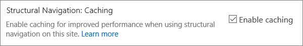

# <a name="navigation-options-for-sharepoint-online"></a>Opzioni di spostamento per SharePoint Online

In questo articolo vengono descritti i siti delle opzioni di spostamento con Pubblicazione SharePoint abilitata in SharePoint Online. La scelta e la configurazione della struttura di spostamento influiscono in modo significativo sulle prestazioni e sulla scalabilità dei siti in SharePoint Online. Il modello di sito Pubblicazione SharePoint deve essere utilizzato solo se necessario per un portale centralizzato e la caratteristica di pubblicazione deve essere abilitata solo in siti specifici e solo quando assolutamente necessaria perché può influire sulle prestazioni se utilizzata in modo non corretto.

>[!NOTE]
>Se si usano opzioni di spostamento moderne di SharePoint come mega menu, spostamento a catena o spostamento hub, questo articolo non si applica al sito. Le architetture moderne dei siti di SharePoint sfruttano una gerarchia di siti più appiattita e un modello hub e spoke. Ciò consente di ottenere molti scenari che NON richiedono l'utilizzo della caratteristica Pubblicazione SharePoint.

## <a name="overview-of-navigation-options"></a>Panoramica delle opzioni di spostamento

La configurazione del provider di spostamento può influire in modo significativo sulle prestazioni per l'intero sito ed è necessario prendere in considerazione attentamente la scelta di un provider di esplorazione e di una configurazione che si adatta in modo efficace ai requisiti di un sito di SharePoint. Esistono due provider di spostamento predefiniti, oltre a implementazioni di spostamento personalizzate.

La prima opzione, [**esplorazione**](#using-structural-navigation-in-sharepoint-online)strutturale, è l'opzione di spostamento consigliata in SharePoint Online per i siti di SharePoint classici, se si attiva la memorizzazione nella cache dell'esplorazione strutturale **per il sito.** Questo provider di spostamento visualizza gli elementi di spostamento al di sotto del sito corrente e, facoltativamente, il sito corrente e i relativi elementi di pari livello. Offre funzionalità aggiuntive, ad esempio la limitazione per motivi di sicurezza e l'enumerazione della struttura del sito. Se la memorizzazione nella cache è disabilitata, ciò inciderà negativamente sulle prestazioni e sulla scalabilità e potrebbe essere soggetta a limitazioni.

La seconda opzione, [**Esplorazione gestita (metadati),**](#using-managed-navigation-and-metadata-in-sharepoint-online)rappresenta gli elementi di spostamento tramite un set di termini Metadati gestiti. Se non è necessario, è consigliabile che la limitazione per motivi di sicurezza sia disabilitata. La limitazione per motivi di sicurezza è abilitata come impostazione sicura per impostazione predefinita per questo provider di spostamento. Tuttavia, molti siti non richiedono l'overhead della limitazione per motivi di sicurezza poiché gli elementi di spostamento sono spesso coerenti per tutti gli utenti del sito. Con la configurazione consigliata per disabilitare la limitazione per motivi di sicurezza, questo provider di spostamento non richiede l'enumerazione della struttura del sito ed è altamente scalabile con un impatto sulle prestazioni accettabile.

Oltre ai provider di spostamento predefiniti, molti clienti hanno implementato correttamente implementazioni di spostamento personalizzate alternative. Vedere [la sezione script sul lato client basata sulla ricerca](#using-search-driven-client-side-scripting) in questo articolo.
  
## <a name="pros-and-cons-of-sharepoint-online-navigation-options"></a>Pro e contro delle opzioni di spostamento di SharePoint Online

Nella tabella seguente sono riepilogati i pro e i contro di ogni opzione.

|Esplorazione strutturale  |Esplorazione gestita  |Esplorazione basata sulla ricerca  |Provider di spostamento personalizzato  |
|---------|---------|---------|---------|
|Pro:<br/><br/>Facile da gestire<br/>Limitazione per motivi di sicurezza<br/>Si aggiorna automaticamente entro 24 ore quando il contenuto viene modificato<br/>     |Pro:<br/><br/>Facile da gestire<br/>|Pro:<br/><br/>Limitazione per motivi di sicurezza<br/>Si aggiorna automaticamente man mano che i siti vengono aggiunti<br/>Tempo di caricamento rapido e struttura dell'esplorazione memorizzata nella cache<br/>|Pro:<br/><br/>Scelta più ampia delle opzioni disponibili<br/>Caricamento rapido quando la memorizzazione nella cache viene utilizzata correttamente<br/>Molte opzioni funzionano bene con il responsive page design<br/>|
|Contro:<br/><br/>**Influisce sulle prestazioni se la memorizzazione nella cache è disabilitata**<br/>Soggetto a limitazione<br/>|Contro:<br/><br/>Non si aggiorna automaticamente per riflettere la struttura del sito<br/>**Influisce sulle prestazioni se è abilitata la limitazione per motivi** di sicurezza o quando la struttura di spostamento è complessa<br/>|Contro:<br/><br/>Non è possibile ordinare facilmente i siti<br/>Richiede la personalizzazione della pagina master (necessarie competenze tecniche)<br/>|Contro:<br/><br/>È necessario uno sviluppo personalizzato<br/>L'origine dati esterna/la cache archiviata è necessaria, ad esempio Azure<br/>|

L'opzione più appropriata per il sito dipende dai requisiti del sito e dalle proprie capacità tecniche. Se si desidera un provider di spostamento facile da configurare che si a aggiorna automaticamente quando viene modificato il contenuto, l'esplorazione strutturale con la memorizzazione nella cache abilitata [è](https://support.office.com/article/structural-navigation-and-performance-f163053f-8eca-4b9c-b973-36b395093b43) una buona opzione.

>[!NOTE]
>L'applicazione dello stesso principio dei siti di SharePoint moderni semplificando la struttura generale dei siti a una struttura più piatta e non gerarchica migliora le prestazioni e semplifica il passaggio ai siti di SharePoint moderni. Ciò significa che, invece di avere una singola raccolta siti con centinaia di siti (web secondari), un approccio migliore consiste nell'avere molte raccolte siti con un numero molto contenuto di siti secondari (web secondari).

## <a name="analyzing-navigation-performance-in-sharepoint-online"></a>Analisi delle prestazioni di spostamento in SharePoint Online

Lo [strumento Diagnostica pagine per SharePoint](https://aka.ms/perftool) è un'estensione del browser per i browser Microsoft Edge e Chrome che analizza sia il portale moderno di SharePoint Online che le pagine classiche del sito di pubblicazione. Questo strumento funziona solo per SharePoint Online e non può essere utilizzato in una pagina di sistema di SharePoint.

Lo strumento genera un report per ogni pagina analizzata che mostra le prestazioni della pagina rispetto a un set predefinito di regole e visualizza informazioni dettagliate quando i risultati di un test non rientrano nel valore di base. Gli amministratori e i progettisti di SharePoint Online possono utilizzare lo strumento per risolvere i problemi di prestazioni per garantire che le nuove pagine siano ottimizzate prima della pubblicazione.

**SPRequestDuration** in particolare è il tempo necessario a SharePoint per elaborare la pagina. Un'esplorazione complessa , ad esempio l'inclusione di pagine nella struttura di spostamento, gerarchie di siti complesse e altre opzioni di configurazione e topologia, può contribuire in modo significativo a durare più a lungo.

## <a name="using-structural-navigation-in-sharepoint-online"></a>Utilizzo dell'esplorazione strutturale in SharePoint Online

Questa è la struttura di spostamento predefinita utilizzata per impostazione predefinita ed è la soluzione più semplice. Non richiede alcuna personalizzazione e un utente non tecnico può anche aggiungere facilmente elementi, nasconderli e gestire lo spostamento dalla pagina delle impostazioni. È [consigliabile abilitare la memorizzazione](https://support.office.com/article/structural-navigation-and-performance-f163053f-8eca-4b9c-b973-36b395093b43)nella cache, altrimenti si verifica un compromesso dispendioso in termini di prestazioni.

### <a name="how-to-implement-structural-navigation-caching"></a>Come implementare la memorizzazione nella cache dell'esplorazione strutturale

In **Struttura di spostamento impostazioni** sito è possibile verificare se l'esplorazione strutturale è selezionata per la struttura di spostamento globale o  >    >  corrente. La **selezione di Mostra** pagine avrà un impatto negativo sulle prestazioni.


La memorizzazione nella cache può essere abilitata o disabilitata a livello di raccolta siti e a livello di sito ed è abilitata per entrambi per impostazione predefinita. Per abilitarla a livello di raccolta siti, **in** Impostazioni sito Struttura di spostamento raccolta siti amministrazione raccolta siti selezionare la casella di controllo  >    >   **Abilita memorizzazione nella cache.**


Per abilitarla a livello di sito, in **Navigazione** impostazioni sito selezionare la casella  >  di controllo **Abilita memorizzazione nella cache.**



## <a name="using-managed-navigation-and-metadata-in-sharepoint-online"></a>Uso dell'esplorazione gestita e dei metadati in SharePoint Online

L'esplorazione gestita è un'altra opzione predefinita che è possibile utilizzare per ricreare la maggior parte delle stesse funzionalità dell'esplorazione strutturale. I metadati gestiti possono essere configurati in modo che la limitazione per motivi di sicurezza sia abilitata o disabilitata. Se configurata con la limitazione per motivi di sicurezza disabilitata, l'esplorazione gestita è abbastanza efficiente perché carica tutti i collegamenti di spostamento con un numero costante di chiamate al server. L'abilitazione della limitazione per motivi di sicurezza, tuttavia, nega alcuni dei vantaggi in termini di prestazioni dell'esplorazione gestita.

Se è necessario abilitare la limitazione per motivi di sicurezza, è consigliabile:

- Aggiornare tutti i collegamenti URL descrittivi ai collegamenti semplici
- Aggiungere i nodi di limitazione per motivi di sicurezza necessari come URL descrittivi
- Limitare il numero di elementi di spostamento a non più di 100 e non più di 3 livelli di profondità

Molti siti non richiedono la limitazione per motivi di sicurezza, in quanto la struttura di spostamento è spesso coerente per tutti gli utenti del sito. Se la limitazione per motivi di sicurezza è disabilitata e viene aggiunto un collegamento alla struttura di spostamento a cui non tutti gli utenti hanno accesso, il collegamento continuerà a essere visualizzato, ma verrà visualizzato un messaggio di accesso negato. Non esiste alcun rischio di accesso accidentale al contenuto.

### <a name="how-to-implement-managed-navigation-and-the-results"></a>Come implementare l'esplorazione gestita e i risultati

Sono disponibili diversi articoli docs.microsoft.com sui dettagli dell'esplorazione gestita. Ad esempio, vedere [Panoramica dell'esplorazione gestita in SharePoint Server.](https://docs.microsoft.com/sharepoint/administration/overview-of-managed-navigation)

Per implementare l'esplorazione gestita, è necessario impostare termini con URL corrispondenti alla struttura di spostamento del sito. L'esplorazione gestita può anche essere curata manualmente per sostituire l'esplorazione strutturale in molti casi. Ad esempio:

)

## <a name="using-search-driven-client-side-scripting"></a>Utilizzo di script sul lato client basato sulla ricerca

Una classe comune di implementazioni dello spostamento personalizzato adotta modelli di progettazione con rendering client che archiviano una cache locale di nodi di spostamento.

Questi provider di spostamento presentano un paio di vantaggi principali:

- In genere funzionano bene con le progettazioni di pagine reattive.
- Sono estremamente scalabili e performanti perché possono eseguire il rendering senza costi di risorse (e aggiornarsi in background dopo un timeout).
- Questi provider di spostamento possono recuperare i dati di spostamento utilizzando diverse strategie, da configurazioni statiche semplici a vari provider di dati dinamici.

Un esempio di provider di dati è l'utilizzo di uno spostamento basato sulla **ricerca,** che consente di enumerare i nodi di spostamento e di gestire in modo efficiente la limitazione per motivi di sicurezza.

Esistono altre opzioni popolari per creare provider **di spostamento personalizzati.** Per ulteriori informazioni sulla creazione di un provider di spostamento personalizzato, vedere Soluzioni di spostamento per i portali di [SharePoint Online.](https://docs.microsoft.com/sharepoint/dev/solution-guidance/portal-navigation)

Utilizzando la ricerca è possibile utilizzare gli indici sviluppati in background tramite la ricerca per indicizzazione continua. I risultati della ricerca vengono recuperati dall'indice di ricerca e i risultati sono limitati per motivi di sicurezza. Si tratta in genere di un'operazione più veloce rispetto ai provider di spostamento predefiniti quando è necessaria la limitazione per motivi di sicurezza. Utilizzando la ricerca per l'esplorazione strutturale, soprattutto se si dispone di una struttura di siti complessa, è possibile velocizzare notevolmente tempi di caricamento delle pagine. Il principale vantaggio di questa esplorazione gestita è che è possibile beneficiare della limitazione per motivi di sicurezza.

Questo approccio implica la creazione di una pagina master personalizzata e la sostituzione del codice di spostamento predefinito con codice HTML personalizzato. Per sostituire il codice di spostamento nel file, eseguire la procedura descritta nell'esempio `seattle.html` seguente. In questo esempio aprirai il `seattle.html` file e sostituirai l'intero elemento `id="DeltaTopNavigation"` con codice HTML personalizzato.

### <a name="example-replace-the-out-of-the-box-navigation-code-in-a-master-page"></a>Esempio: sostituire il codice di spostamento di tipo "out-of-the-box" in una pagina master

1. Andare alla pagina Impostazioni sito.
2. Aprire la raccolta di pagine master facendo clic su **Pagine master**.
3. Da qui è possibile spostarsi all'interno della raccolta e scaricare il `seattle.master` file.
4. Modificare il codice utilizzando un editor di testo ed eliminare il blocco di codice nella schermata seguente.<br/><br/>
5. Rimuovi il codice tra i `<SharePoint:AjaxDelta id="DeltaTopNavigation">` tag e `<\SharePoint:AjaxDelta>` e sostituiscilo con il frammento di codice seguente:<br/>

```javascript
<div id="loading">
  <!--Replace with path to loading image.-->
  <div style="background-image: url(''); height: 22px; width: 22px; ">
  </div>
</div>
<!-- Main Content-->
<div id="navContainer" style="display:none">
    <div data-bind="foreach: hierarchy" class="noindex ms-core-listMenu-horizontalBox">
        <a class="dynamic menu-item ms-core-listMenu-item ms-displayInline ms-navedit-linkNode" data-bind="attr: { href: item.Url, title: item.Title }">
            <span class="menu-item-text" data-bind="text: item.Title">
            </span>
        </a>
        <ul id="menu" data-bind="foreach: $data.children" style="padding-left:20px">
            <li class="static dynamic-children level1">
                <a class="static dynamic-children menu-item ms-core-listMenu-item ms-displayInline ms-navedit-linkNode" data-bind="attr: { href: item.Url, title: item.Title }">

                 <!-- ko if: children.length > 0-->
                    <span aria-haspopup="true" class="additional-background ms-navedit-flyoutArrow dynamic-children">
                        <span class="menu-item-text" data-bind="text: item.Title">
                        </span>
                    </span>
                <!-- /ko -->
                <!-- ko if: children.length == 0-->
                    <span aria-haspopup="true" class="ms-navedit-flyoutArrow dynamic-children">
                        <span class="menu-item-text" data-bind="text: item.Title">
                        </span>
                    </span>
                <!-- /ko -->
                </a>

                <!-- ko if: children.length > 0-->
                <ul id="menu"  data-bind="foreach: children;" class="dynamic  level2" >
                    <li class="dynamic level2">
                        <a class="dynamic menu-item ms-core-listMenu-item ms-displayInline  ms-navedit-linkNode" data-bind="attr: { href: item.Url, title: item.Title }">

          <!-- ko if: children.length > 0-->
          <span aria-haspopup="true" class="additional-background ms-navedit-flyoutArrow dynamic-children">
           <span class="menu-item-text" data-bind="text: item.Title">
           </span>
          </span>
           <!-- /ko -->
          <!-- ko if: children.length == 0-->
          <span aria-haspopup="true" class="ms-navedit-flyoutArrow dynamic-children">
           <span class="menu-item-text" data-bind="text: item.Title">
           </span>
          </span>
          <!-- /ko -->
                        </a>
          <!-- ko if: children.length > 0-->
         <ul id="menu" data-bind="foreach: children;" class="dynamic level3" >
          <li class="dynamic level3">
           <a class="dynamic menu-item ms-core-listMenu-item ms-displayInline ms-navedit-linkNode" data-bind="attr: { href: item.Url, title: item.Title }">
            <span class="menu-item-text" data-bind="text: item.Title">
            </span>
           </a>
          </li>
         </ul>
           <!-- /ko -->
                    </li>
                </ul>
                <!-- /ko -->
            </li>
        </ul>
    </div>
</div>
```

<br/>
6. Sostituire l'URL nel tag di ancoraggio dell'immagine di caricamento all'inizio con un collegamento a un'immagine di caricamento nella raccolta siti. Dopo aver apportato le modifiche, rinominare il file, quindi caricarlo nella raccolta di pagine master. Ciò genera un nuovo file con estensione master.<br/>
7. Questo codice HTML è il codice di base che verrà precompilato dai risultati della ricerca restituiti dal codice JavaScript. Sarà necessario modificare il codice per modificare il valore di var root = "URL raccolta siti" come illustrato nel frammento di codice seguente:<br/>

```javascript
var root = "https://spperformance.sharepoint.com/sites/NavigationBySearch";
```

<br/>
8. I risultati vengono assegnati alla matrice self.nodes e viene creata una gerarchia degli oggetti utilizzando linq.js assegnare l'output a una matrice self.hierarchy. Questa matrice è l'oggetto in cui è associato il codice HTML. Questa operazione viene eseguita nella funzione toggleView() passando l'oggetto utente alla funzione ko.applyBinding().<br/>Quindi, in questo modo la matrice di gerarchia va associata al codice HTML seguente:<br/>

```javascript
<div data-bind="foreach: hierarchy" class="noindex ms-core-listMenu-horizontalBox">
```

I gestori eventi per e vengono aggiunti alla struttura di spostamento di primo livello per gestire i menu a discesa dei siti secondari che vengono evasi `mouseenter` `mouseexit` nella `addEventsToElements()` funzione.

Nell'esempio di spostamento complesso, un carico di pagina nuovo senza la memorizzazione nella cache locale mostra che il tempo dedicato al server è stato ridotto rispetto all'esplorazione strutturale benchmark per ottenere un risultato simile a quello dell'esplorazione gestita.

### <a name="about-the-javascript-file"></a>Informazioni sul file JavaScript...

>[!NOTE]
>Se si usa JavaScript personalizzato, verificare che la rete CDN pubblica sia abilitata e che il file si trova in un percorso CDN.

Di seguito è riportato l'intero file JavaScript:

```javascript
//Models and Namespaces
var SPOCustom = SPOCustom || {};
SPOCustom.Models = SPOCustom.Models || {}
SPOCustom.Models.NavigationNode = function () {

    this.Url = ko.observable("");
    this.Title = ko.observable("");
    this.Parent = ko.observable("");

};

var root = "https://spperformance.sharepoint.com/sites/NavigationBySearch";
var baseUrl = root + "/_api/search/query?querytext=";
var query = baseUrl + "'contentClass=\"STS_Web\"+path:" + root + "'&trimduplicates=false&rowlimit=300";

var baseRequest = {
    url: "",
    type: ""
};


//Parses a local object from JSON search result.
function getNavigationFromDto(dto) {
    var item = new SPOCustom.Models.NavigationNode();
    if (dto != undefined) {

        var webTemplate = getSearchResultsValue(dto.Cells.results, 'WebTemplate');

        if (webTemplate != "APP") {
            item.Title(getSearchResultsValue(dto.Cells.results, 'Title')); //Key = Title
            item.Url(getSearchResultsValue(dto.Cells.results, 'Path')); //Key = Path
            item.Parent(getSearchResultsValue(dto.Cells.results, 'ParentLink')); //Key = ParentLink
        }

    }
    return item;
}

function getSearchResultsValue(results, key) {

    for (i = 0; i < results.length; i++) {
        if (results[i].Key == key) {
            return results[i].Value;
        }
    }
    return null;
}

//Parse a local object from the serialized cache.
function getNavigationFromCache(dto) {
    var item = new SPOCustom.Models.NavigationNode();

    if (dto != undefined) {

        item.Title(dto.Title);
        item.Url(dto.Url);
        item.Parent(dto.Parent);
    }

    return item;
}

/* create a new OData request for JSON response */
function getRequest(endpoint) {
    var request = baseRequest;
    request.type = "GET";
    request.url = endpoint;
    request.headers = { ACCEPT: "application/json;odata=verbose" };
    return request;
};

/* Navigation Module*/
function NavigationViewModel() {
    "use strict";
    var self = this;
    self.nodes = ko.observableArray([]);
    self.hierarchy = ko.observableArray([]);;
    self.loadNavigatioNodes = function () {
        //Check local storage for cached navigation datasource.
        var fromStorage = localStorage["nodesCache"];
        if (false) {
            var cachedNodes = JSON.parse(localStorage["nodesCache"]);

            if (cachedNodes && timeStamp) {
                //Check for cache expiration. Currently set to 3 hrs.
                var now = new Date();
                var diff = now.getTime() - timeStamp;
                if (Math.round(diff / (1000 * 60 * 60)) < 3) {

                    //return from cache.
                    var cacheResults = [];
                    $.each(cachedNodes, function (i, item) {
                        var nodeitem = getNavigationFromCache(item, true);
                        cacheResults.push(nodeitem);
                    });

                    self.buildHierarchy(cacheResults);
                    self.toggleView();
                    addEventsToElements();
                    return;
                }
            }
        }
        //No cache hit, REST call required.
        self.queryRemoteInterface();
    };

    //Executes a REST call and builds the navigation hierarchy.
    self.queryRemoteInterface = function () {
        var oDataRequest = getRequest(query);
        $.ajax(oDataRequest).done(function (data) {
            var results = [];
            $.each(data.d.query.PrimaryQueryResult.RelevantResults.Table.Rows.results, function (i, item) {

                if (i == 0) {
                    //Add root element.
                    var rootItem = new SPOCustom.Models.NavigationNode();
                    rootItem.Title("Root");
                    rootItem.Url(root);
                    rootItem.Parent(null);
                    results.push(rootItem);
                }
                var navItem = getNavigationFromDto(item);
                results.push(navItem);
            });
            //Add to local cache
            localStorage["nodesCache"] = ko.toJSON(results);

            localStorage["nodesCachedAt"] = new Date().getTime();
            self.nodes(results);
            if (self.nodes().length > 0) {
                var unsortedArray = self.nodes();
                var sortedArray = unsortedArray.sort(self.sortObjectsInArray);

                self.buildHierarchy(sortedArray);
                self.toggleView();
                addEventsToElements();
            }
        }).fail(function () {
            //Handle error here!!
            $("#loading").hide();
            $("#error").show();
        });
    };
    self.toggleView = function () {
        var navContainer = document.getElementById("navContainer");
        ko.applyBindings(self, navContainer);
        $("#loading").hide();
        $("#navContainer").show();

    };
    //Uses linq.js to build the navigation tree.
    self.buildHierarchy = function (enumerable) {
        self.hierarchy(Enumerable.From(enumerable).ByHierarchy(function (d) {
            return d.Parent() == null;
        }, function (parent, child) {
            if (parent.Url() == null || child.Parent() == null)
                return false;
            return parent.Url().toUpperCase() == child.Parent().toUpperCase();
        }).ToArray());

        self.sortChildren(self.hierarchy()[0]);
    };


    self.sortChildren = function (parent) {

        // sjip processing if no children
        if (!parent || !parent.children || parent.children.length === 0) {
            return;
        }

        parent.children = parent.children.sort(self.sortObjectsInArray2);

        for (var i = 0; i < parent.children.length; i++) {
            var elem = parent.children[i];

            if (elem.children && elem.children.length > 0) {
                self.sortChildren(elem);
            }
        }
    };

    // ByHierarchy method breaks the sorting in chrome and firefox
    // we need to resort  as ascending
    self.sortObjectsInArray2 = function (a, b) {
        if (a.item.Title() > b.item.Title())
            return 1;
        if (a.item.Title() < b.item.Title())
            return -1;
        return 0;
    };


    self.sortObjectsInArray = function (a, b) {
        if (a.Title() > b.Title())
            return -1;
        if (a.Title() < b.Title())
            return 1;
        return 0;
    }
}

//Loads the navigation on load and binds the event handlers for mouse interaction.
function InitCustomNav() {
    var viewModel = new NavigationViewModel();
    viewModel.loadNavigatioNodes();
}

function addEventsToElements() {
    //events.
      $("li.level1").mouseover(function () {
          var position = $(this).position();
          $(this).find("ul.level2").css({ width: 100, left: position.left + 10, top: 50 });
      })
   .mouseout(function () {
     $(this).find("ul.level2").css({  left: -99999, top: 0 });
   
    });
   
     $("li.level2").mouseover(function () {
          var position = $(this).position();
          console.log(JSON.stringify(position));
          $(this).find("ul.level3").css({ width: 100, left: position.left + 95, top:  position.top});
      })
   .mouseout(function () {
     $(this).find("ul.level3").css({  left: -99999, top: 0 });
    });
} _spBodyOnLoadFunctionNames.push("InitCustomNav");

```

Per riepilogare il codice illustrato in precedenza nella funzione, viene creata una funzione e quindi viene chiamata la funzione `jQuery $(document).ready` `viewModel object` su tale `loadNavigationNodes()` oggetto. Questa funzione carica la gerarchia di spostamento creata in precedenza archiviata nell'archivio locale HTML5 del browser client oppure chiama la funzione `queryRemoteInterface()` .

`QueryRemoteInterface()` crea una richiesta utilizzando la funzione con il parametro di query definito in precedenza nello script e quindi restituisce `getRequest()` i dati dal server. Questi dati sono sostanzialmente una matrice di tutti i siti nella raccolta di siti rappresentati come oggetti di trasferimento dei dati con alcune proprietà.

Questi dati vengono quindi analizzati negli oggetti definiti in precedenza che vengono utilizzati per creare proprietà osservabili da utilizzare tramite il data binding dei valori nel codice HTML definito `SPO.Models.NavigationNode` `Knockout.js` in precedenza.

Gli oggetti vengono quindi inseriti in una matrice di risultati. Questa matrice viene analizzata in JSON utilizzando Knockout e memorizzata nell'archivio locale del browser per migliorare le prestazioni su caricamenti di pagina futuri.

### <a name="benefits-of-this-approach"></a>Vantaggi di questo approccio

Uno dei principali vantaggi di [questo](#example-replace-the-out-of-the-box-navigation-code-in-a-master-page) approccio è che, utilizzando l'archiviazione locale HTML5, la struttura di spostamento viene archiviata in locale per l'utente al successivo caricamento della pagina. Si ottengono miglioramenti delle prestazioni principali utilizzando l'API di ricerca per l'esplorazione strutturale; tuttavia, sono necessarie alcune capacità tecniche per eseguire e personalizzare questa funzionalità.

[Nell'implementazione di](#example-replace-the-out-of-the-box-navigation-code-in-a-master-page)esempio i siti vengono ordinati nello stesso modo dell'esplorazione strutturale predefinita. in ordine alfabetico. Se si desidera deviare da questo ordine, diventa più complesso lo sviluppo e la manutenzione. Inoltre, questo approccio richiede di deviare dalle pagine master supportate. Se non viene mantenuta la pagina master personalizzata, il sito verrà escluso dagli aggiornamenti e dai miglioramenti che Microsoft apporta alle pagine master.

Il [codice precedente](#about-the-javascript-file) presenta le dipendenze seguenti:

- jQuery - https://jquery.com/
- KnockoutJS - https://knockoutjs.com/
- Linq.js - https://linqjs.codeplex.com/ o github.com/neuecc/linq.js

La versione corrente di LinqJS non contiene il metodo ByHierarchy usato nel codice precedente e interromperà il codice di spostamento. Per risolvere il problema, aggiungere il metodo seguente al file Linq.js prima della `Flatten: function ()` riga.

```javascript
ByHierarchy: function(firstLevel, connectBy, orderBy, ascending, parent) {
     ascending = ascending == undefined ? true : ascending;
     var orderMethod = ascending == true ? 'OrderBy' : 'OrderByDescending';
     var source = this;
     firstLevel = Utils.CreateLambda(firstLevel);
     connectBy = Utils.CreateLambda(connectBy);
     orderBy = Utils.CreateLambda(orderBy);

     //Initiate or increase level
     var level = parent === undefined ? 1 : parent.level + 1;

    return new Enumerable(function() {
         var enumerator;
         var index = 0;

        var createLevel = function() {
                 var obj = {
                     item: enumerator.Current(),
                     level : level
                 };
                 obj.children = Enumerable.From(source).ByHierarchy(firstLevel, connectBy, orderBy, ascending, obj);
                 if (orderBy !== undefined) {
                     obj.children = obj.children[orderMethod](function(d) {
                         return orderBy(d.item); //unwrap the actual item for sort to work
                     });
                 }
                 obj.children = obj.children.ToArray();
                 Enumerable.From(obj.children).ForEach(function(child) {
                     child.getParent = function() {
                         return obj;
                     };
                 });
                 return obj;
             };

        return new IEnumerator(

        function() {
             enumerator = source.GetEnumerator();
         }, function() {
             while (enumerator.MoveNext()) {
                 var returnArr;
                 if (!parent) {
                     if (firstLevel(enumerator.Current(), index++)) {
                         return this.Yield(createLevel());
                     }

                } else {
                     if (connectBy(parent.item, enumerator.Current(), index++)) {
                         return this.Yield(createLevel());
                     }
                 }
             }
             return false;
         }, function() {
             Utils.Dispose(enumerator);
         })
     });
 },

```
  
## <a name="related-topics"></a>Argomenti correlati

[Panoramica dell'esplorazione gestita in SharePoint Server](https://docs.microsoft.com/sharepoint/administration/overview-of-managed-navigation)

[Prestazioni e memorizzazione nella cache per l'esplorazione strutturale](https://support.office.com/article/structural-navigation-and-performance-f163053f-8eca-4b9c-b973-36b395093b43)
