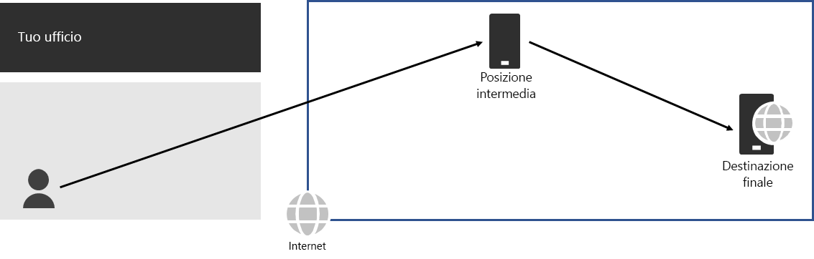
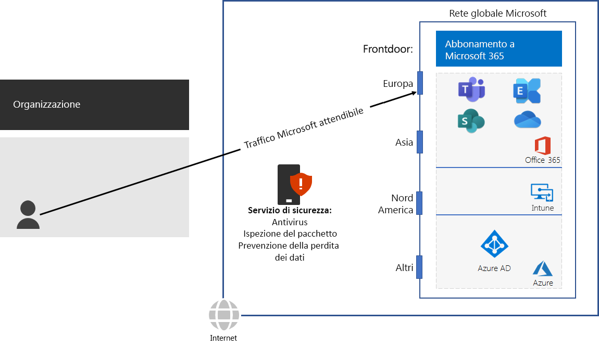

# Passaggio 3: evitare fenomeni di "hairpinning" di reteStep 3: Avoid network hairpins

*Questo passaggio è obbligatorio e si applica alle versioni E3 ed E5 di Microsoft 365 Enterprise**This step is required and applies to both the E3 and E5 versions of Microsoft 365 Enterprise*

Si verifica un ["hairpinning" di rete](https://docs.microsoft.com/office365/enterprise/office-365-network-connectivity-principles#BKMK_P3) quando il traffico associato per una destinazione viene prima indirizzato a un'altra posizione intermedia, ad esempio uno stack di sicurezza locale, un broker di accesso cloud o un gateway Web basato sul cloud.A [network hairpin](https://docs.microsoft.com/office365/enterprise/office-365-network-connectivity-principles#BKMK_P3) happens when traffic bound for a destination is first directed to another intermediate location, such as an on-premises security stack, cloud access broker, or cloud-based web gateway. A network hairpin could also be caused by poor routing on the Internet due to network service providers. A hairpin adds latency and can potentially redirect traffic to a geographically distant location. Ecco un esempio.Here is an example.

Un "hairpinning" di rete può dipendere anche da un routing insufficiente in Internet causato dai provider di servizi di rete.A network hairpin could also be caused by poor routing on the Internet due to network service providers. 

Un "hairpinning" aggiunge latenza e può potenzialmente reindirizzare il traffico a una posizione geograficamente distante.A hairpin adds latency and can potentially redirect traffic to a geographically distant location.

Per ottimizzare le prestazioni per il traffico verso i servizi basati sul cloud di Microsoft 365, verificare se l'ISP che fornisce la connessione Internet locale dispone di una relazione di peering diretto con Microsoft Global Network nelle immediate vicinanze della posizione in questione. Tali connessioni non hanno hairpin.To optimize performance for traffic to Microsoft 365 cloud-based services, check whether the ISP providing the local Internet connection has a direct peering relationship with the Microsoft Global Network in close proximity to that location. These connections do not have hairpins.

Se si utilizza una rete basata sul cloud o servizi di sicurezza per il traffico di Microsoft 365, verificare che venga valutato l'effetto di hairpinning e che venga interpretato il suo impatto sulle prestazioni. Esaminare quanto riportato di seguito:If you use cloud-based network or security services for your Microsoft 365 traffic, ensure that the hairpinning effect is evaluated and its impact on performance is understood. Examine the following:

- Il numero e le posizioni dei provider di servizi con cui viene inoltrato il traffico in relazione alle succursali e ai punti di peering di Microsoft Global NetworkThe number and locations of your service providers through which the traffic is forwarded in relationship to your branch offices and Microsoft Global Network peering points 
- La qualità della relazione di peering della rete del provider di servizi con l'ISP e MicrosoftThe quality of the network peering relationship of the service provider with your ISP and Microsoft 
- L'impatto del backhauling sulle prestazioni nell'infrastruttura del provider di serviziThe performance impact of backhauling in the service provider infrastructure

Ove possibile, configurare i router periferici in modo da inviare direttamente il traffico di Microsoft 365 attendibile, anziché inoltrarlo tramite proxy o tunneling attraverso un fornitore di sicurezza di rete basato sul cloud o un cloud di terze parti che elabora il traffico di Internet.Whenever possible, configure your edge routers to send trusted Microsoft 365 traffic directly, instead of proxying or tunneling through a third-party cloud or cloud-based network security vendor that processes your Internet traffic. 

Come checkpoint provvisorio, è possibile vedere i [criteri uscita](networking-exit-criteria.md#crit-networking-step3) per questo passaggio.As an interim checkpoint, you can see the [exit criteria](networking-exit-criteria.md#crit-networking-step3) for this step.

## Passaggio successivoNext step

|||
|:-------|:-----|
||[Configurare il bypass di trafficoConfigure traffic bypass](networking-configure-proxies-firewalls.md)|
