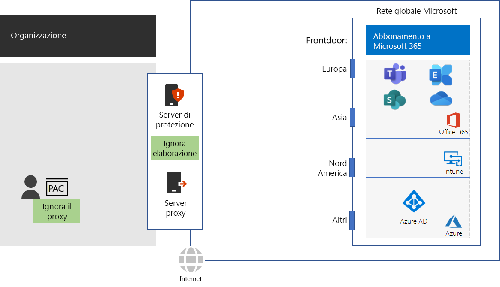

# Passaggio 4: configurare il bypass di traffico

*Questo passaggio è facoltativo e si applica alle versioni E3 ed E5 di Microsoft 365 Enterprise*

Poiché il traffico su Internet può essere rischioso, le organizzazioni rafforzano la sicurezza delle proprie reti con dispositivi periferici come server proxy, dispositivi di decrittografia e ispezione SSL, dispositivi di ispezione dei pacchetti e sistemi di prevenzione della perdita dei dati. Alcuni dei problemi con i dispositivi di intercettazione delle reti sono descritti nell'articolo [Utilizzo di soluzioni o dispositivi di rete o di terze parti sul traffico di Office 365](https://support.microsoft.com/help/2690045/using-third-party-network-devices-or-solutions-with-office-365).

Tuttavia, i nomi di dominio DNS e gli indirizzi IP usati dai servizi basati sul cloud di Microsoft 365 sono noti. Inoltre, il traffico e i servizi stessi sono protetti da numerose funzionalità di sicurezza. Poiché queste misure di sicurezza e protezione sono già presenti, non è necessario che vengano duplicate dai dispositivi periferici. L'elaborazione di misure di sicurezza duplicate e destinazioni intermedie per il traffico di Microsoft 365 può ridurre notevolmente le prestazioni.

Il primo passaggio nell'eliminazione dell'elaborazione di misure di sicurezza duplicate e destinazioni intermedie consiste nell'identificazione del traffico di Microsoft 365. Microsoft ha definito i seguenti tipi di nomi di dominio DNS e intervalli di indirizzi IP, noti come endpoint:

- **Ottimizzazione**: obbligatori per la connessione a tutti i servizi di Office 365 e rappresentano più del 75% della larghezza di banda, delle connessioni e del volume di dati di Microsoft 365. Questi endpoint rappresentano gli scenari di Microsoft 365 più sensibili alle prestazioni, alla latenza e alla disponibilità di rete.
- **Consenti**: obbligatori per la connessione a funzionalità e servizi specifici di Microsoft 365, ma che non sono sensibili alle prestazioni e alla latenza di rete come quelli della categoria Ottimizzazione.
 - **Predefinita**: rappresentano i servizi e le dipendenze di Microsoft 365 che non richiedono l'ottimizzazione. È possibile considerare gli endpoint di questa categoria come traffico su Internet normale.

I nomi di dominio DNS e gli intervalli di indirizzi IP sono disponibili all'indirizzo [https://aka.ms/o365endpoints](https://aka.ms/o365endpoints).

Consigli di Microsoft:

- Usare gli script Proxy Automatic Configuration (PAC) sui browser Internet dei computer locali per eseguire il bypass dei server proxy per i nomi di dominio DNS dei servizi basati sul cloud di Microsoft 365. Per gli script PAC di Microsoft 365 più recenti, vedere [Script Get-Pacfile di PowerShell](https://docs.microsoft.com/office365/enterprise/managing-office-365-endpoints#use-a-pac-file-for-direct-routing-of-vital-office-365-traffic).

- Analizzare i dispositivi periferici in uso per determinare l'elaborazione di duplicati e quindi configurarli per inoltrare il traffico agli endpoint delle categorie Ottimizzazione e Consenti senza elaborazione. Questa procedura è nota come bypass di traffico. 

Ecco questi suggerimenti nell'infrastruttura di rete.

I dispositivi perimetrali includono firewall, dispositivi di decrittografia e ispezione SSL, dispositivi di ispezione dei pacchetti e sistemi di prevenzione della perdita dei dati. Per configurare e aggiornare le configurazioni dei dispositivi perimetrali, è possibile usare uno script o una chiamata REST per usare un elenco strutturato di endpoint dal servizio Web degli endpoint di Office 365. Per altre informazioni, vedere [Servizio Web per URL e indirizzi IP di Office 365](https://docs.microsoft.com/office365/enterprise/office-365-ip-web-service).

Tenere presente che questa procedura consente di eseguire il bypass solo per l'elaborazione dei dati di protezione di rete e proxy normale per il traffico agli endpoint delle categorie Ottimizzazione e Consenti di Microsoft 365. Tutto il resto del traffico su Internet verrà trasmesso tramite proxy e sarà soggetto all'elaborazione dei dati di protezione di rete esistente.

## Ottimizzazione del traffico per i lavoratori remoti che usano connessioni VPN

Le connessioni VPN (Virtual Private Network) sono utilizzate comunemente dai lavoratori remoti per accedere alle risorse su un'Intranet aziendale. Una connessione VPN convenzionale instrada TUTTO il traffico, incluso quello Internet, verso l'Intranet aziendale. Il traffico Internet viene instradato verso i dispositivi di elaborazione dei pacchetti e la rete perimetrale dell'organizzazione. Questo traffico è soggetto a ritardi di spostamento ed elaborazione che possono ridurre considerevolmente le prestazioni e compromettere la produttività dei lavoratori remoti. 

Lo split tunneling è la capacità di una connessione VPN di instradare il traffico specificato attraverso Internet anziché trasmetterlo attraverso la connessione VPN all'Intranet. Affinché i lavoratori remoti possano usufruire di prestazioni ottimali dei servizi di Microsoft 365 come Teams, SharePoint Online ed Exchange Online, è necessario configurare lo split tunneling delle connessioni VPN per inviare il traffico per ottimizzare gli endpoint di Office 365 direttamente attraverso Internet. 

Per informazioni dettagliate, consultare [Ottimizzare la connettività di Office 365 per gli utenti remoti tramite split tunneling per VPN](https://docs.microsoft.com/office365/enterprise/office-365-vpn-split-tunnel).

Per testare la vicinanza a un punto di ingresso per la rete globale di Microsoft e quanto si è vicini al punto in cui la rete aziendale si collega all'ISP, usare lo [strumento di onboarding della rete di Office 365](https://connectivity.office.com/).

Come checkpoint provvisorio, è possibile vedere i [criteri uscita](networking-exit-criteria.md#crit-networking-step4) per questo passaggio.

## Passaggio successivo

|||
|:-------|:-----|
||[Ottimizzare prestazioni di client e del servizio di Office 365](networking-optimize-tcp-performance.md) |

