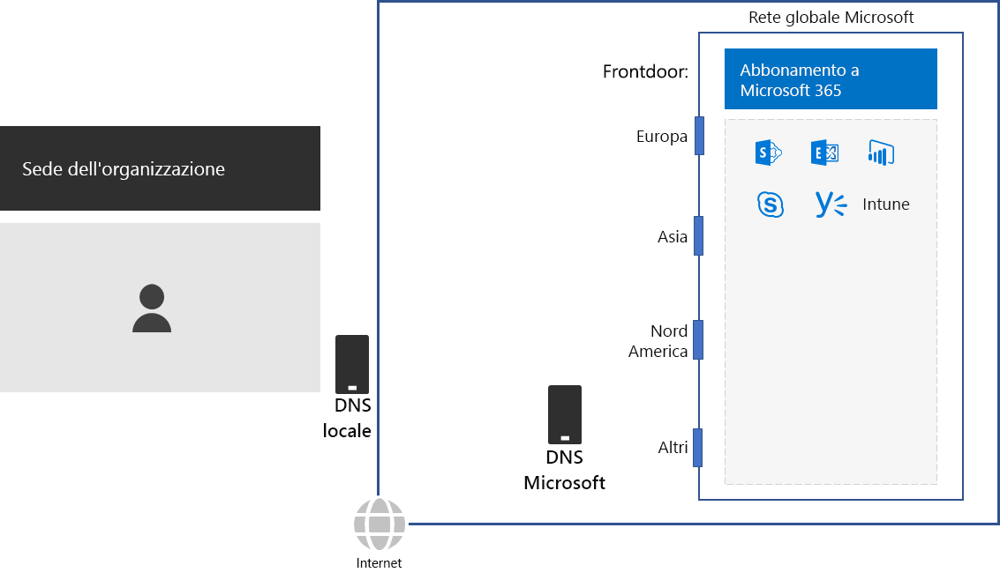
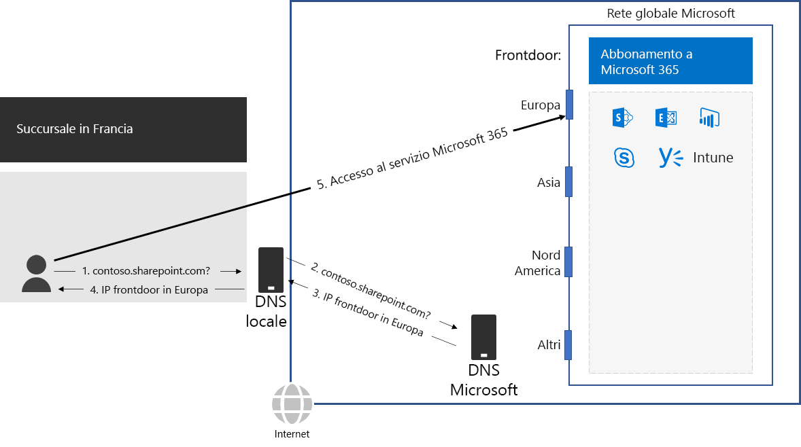

# Passaggio 2: configurare le connessioni Internet locali per ogni sedeStep 2: Configure local Internet connections for each office

*Questo passaggio è obbligatorio e si applica alle versioni E3 ed E5 di Microsoft 365 Enterprise**This step is required and applies to both the E3 and E5 versions of Microsoft 365 Enterprise*

Nel Passaggio 2, verificare che ogni sede abbia connessioni Internet locali e usi server DNS locali. Entrambi questi elementi sono obbligatori per ridurre la latenza della connessione e verificare che i computer client locali effettuino connessioni al punto di ingresso più vicino ai servizi basati sul cloud di Microsoft 365.In Step 2, you ensure that each of your offices have local Internet connections and use local DNS servers. Both of these elements are required to reduce connection latency and ensure that on-premises client computers make connections to the nearest point of entry to Microsoft 365 cloud-based services.

Nelle reti tradizionali per le aziende il traffico Internet viaggia lungo il backbone della rete verso una connessione Internet centrale.In traditional networks for large organizations, Internet traffic travels across the network backbone to a central Internet connection. Questo comportamento non è ideale per ottimizzare le prestazioni di un'infrastruttura SaaS (Software-as-a-Service) distribuita a livello globale, che include i prodotti Office 365 e Intune in Microsoft 365.In traditional networks for large organizations, Internet traffic travels across the network backbone to a central Internet connection. This does not work well for optimizing performance to a globally distributed Software-as-a-Service (SaaS) infrastructure, which includes the Office 365 and Enterprise Mobility + Security (EMS) products in Microsoft 365.

La rete globale di Microsoft include un'infrastruttura *frontdoor di servizi distribuiti*, un server perimetrale di rete a disponibilità e scalabilità elevata con posizioni geograficamente distribuite.The Microsoft Global Network includes a *Distributed Service Front Door* infrastructure, a highly available and scalable network edge with geographically distributed locations. Tale infrastruttura termina le connessioni degli utenti finali presso un server frontdoor e instrada in modo efficiente il traffico degli utenti finali all'interno della rete globale Microsoft.It terminates end user connections at a front door server and efficiently routes end user traffic within the Microsoft Global Network.

Per prestazioni ottimali, i client locali devono accedere a una posizione di frontdoor più vicina a livello geografico, anziché inoltrare il traffico tramite un backbone di rete e al frontdoor più vicino alla connessione Internet centrale dell'organizzazione.The Microsoft Global Network includes front end servers to the set of cloud services for Microsoft 365 all over the world. For the best performance, on-premises clients should access a front-end server that is geographically closest to them, rather than sending the traffic over a network backbone and to the front-end server that is closest to the organization’s central Internet connection.

Ecco un esempio.Here’s an example.

Quando un utente della filiale di Parigi vuole accedere a un sito di SharePoint Online:When a user in the Paris branch office wants to access a SharePoint Online site:

1. Invia una query DNS per risolvere un nome, ad esempio contoso.sharepoint.com.It sends a DNS query to resolve a name, such as contoso.sharepoint.com. 
2. Il server DNS fornito dall'ISP inoltra tale query a un server DNS Microsoft.The DNS server provided by the ISP forwards that query to a Microsoft DNS server.
3. I server DNS Microsoft abbinano l'indirizzo IP di origine della query DNS inoltrata all'area geografica assegnata all'indirizzo.Microsoft’s DNS servers match the source IP address of the forwarded DNS query to the region of the world assigned that address. Il server DNS Microsoft risponde con l'indirizzo IP del frontdoor della rete Microsoft più vicino in Europa.The Microsoft DNS server responds with the IP address of the nearest Microsoft Network front door in Europe.
4. Il server DNS ISP invia tale indirizzo IP all'utente.The ISP DNS server sends that IP address to the user.
5. L'utente avvia una connessione al server di SharePoint tramite il frontdoor europeo.The user initiates a connection to the SharePoint server through the Europe front door.

Per indirizzare una richiesta client al frontdoor più vicino a livello geografico, i server DNS di Microsoft usano le query DNS corrispondenti alla richiesta di connessione iniziale del client.To direct a client request to the geographically nearest front-end server, Microsoft’s DNS servers use the DNS queries corresponding the client’s initial connection request. Therefore, for the lowest network latency: Pertanto, per la latenza di rete inferiore:Therefore, for the lowest network latency:

- Tutte le sedi dell'organizzazione devvono avere connessioni Internet locali per il traffico di rete della categoria [Ottimizzazione](https://docs.microsoft.com/office365/enterprise/office-365-network-connectivity-principles#new-office-365-endpoint-categories).All offices of your organization should have local Internet connections for [Optimize](https://docs.microsoft.com/office365/enterprise/office-365-network-connectivity-principles#new-office-365-endpoint-categories) category network traffic.
- Ogni connessione Internet locale deve usare un server DNS locale per il traffico Internet in uscita da tale posizione.Each local Internet connection should be using a regionally local DNS server for outbound Internet traffic from that location.

Per ulteriori informazioni, vedere [Uscire dalle connessione di rete a livello locale](https://docs.microsoft.com/office365/enterprise/office-365-network-connectivity-principles#egress-network-connections-locally).For more information, see [Egress network connections locally](https://docs.microsoft.com/office365/enterprise/office-365-network-connectivity-principles#egress-network-connections-locally). 

Come checkpoint provvisorio, è possibile vedere i [criteri uscita](networking-exit-criteria.md#crit-networking-step2) per questo passaggio.As an interim checkpoint, you can see the [exit criteria](networking-exit-criteria.md#crit-networking-step2) for this step.

## Passaggio successivoNext step

|||
|:-------|:-----|
||[Evitare fenomeni di "hairpinning" di reteAvoid network hairpins](networking-avoid-network-hairpins.md)|
