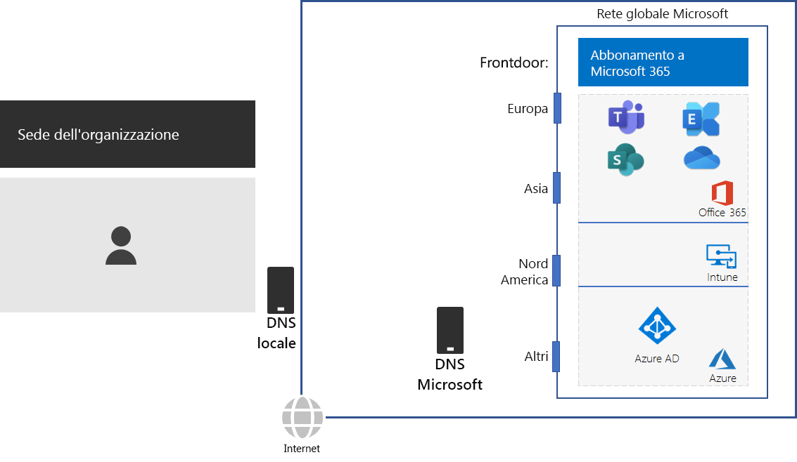
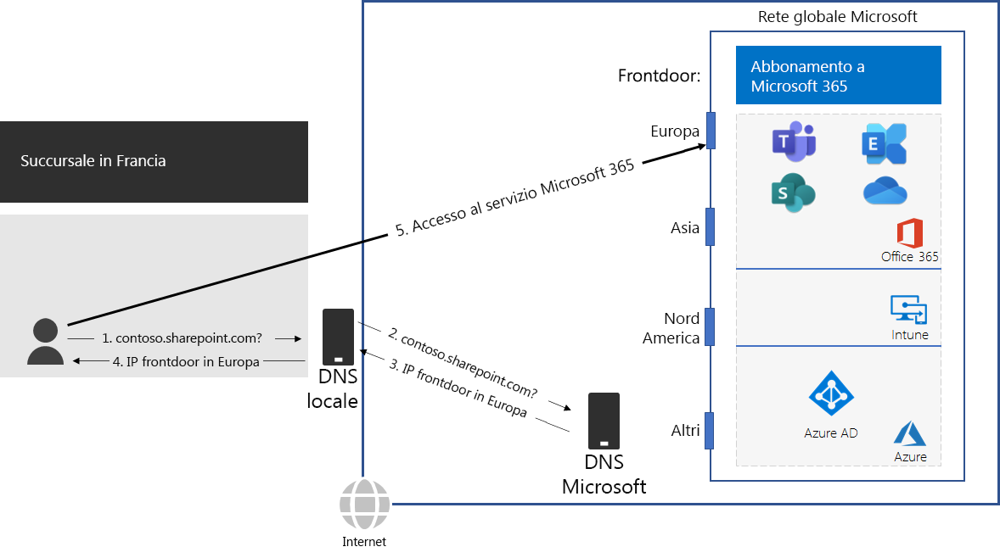

# Passaggio 2: configurare le connessioni Internet locali per ogni sede

*Questo passaggio è obbligatorio e si applica alle versioni E3 ed E5 di Microsoft 365 Enterprise*

Nel Passaggio 2, verificare che ogni sede abbia connessioni Internet locali e usi server DNS locali. Entrambi questi elementi sono obbligatori per ridurre la latenza della connessione e verificare che i computer client locali effettuino connessioni al punto di ingresso più vicino ai servizi basati sul cloud di Microsoft 365.

Nelle reti tradizionali per le aziende il traffico Internet viaggia lungo il backbone della rete verso una connessione Internet centrale. Questo comportamento non è ideale per ottimizzare le prestazioni di un'infrastruttura SaaS (Software-as-a-Service) distribuita a livello globale, che include i prodotti Office 365 e Intune in Microsoft 365.

La rete globale di Microsoft include un'infrastruttura *frontdoor di servizi distribuiti*, un server perimetrale di rete a disponibilità e scalabilità elevata con posizioni geograficamente distribuite. Tale infrastruttura termina le connessioni degli utenti finali presso un server frontdoor e instrada in modo efficiente il traffico degli utenti finali all'interno della rete globale Microsoft.

Per prestazioni ottimali, i client locali devono accedere a una posizione di frontdoor più vicina a livello geografico, anziché inoltrare il traffico tramite un backbone di rete e al frontdoor più vicino alla connessione Internet centrale dell'organizzazione.

Ecco un esempio.

Quando un utente della filiale di Parigi vuole accedere a un sito di SharePoint Online:

1. Invia una query DNS per risolvere un nome, ad esempio contoso.sharepoint.com. 
2. Il server DNS fornito dall'ISP inoltra tale query a un server DNS Microsoft.
3. I server DNS Microsoft abbinano l'indirizzo IP di origine della query DNS inoltrata all'area geografica assegnata all'indirizzo. Il server DNS Microsoft risponde con l'indirizzo IP del frontdoor della rete Microsoft più vicino in Europa.
4. Il server DNS ISP invia tale indirizzo IP all'utente.
5. L'utente avvia una connessione al server di SharePoint tramite il frontdoor europeo.

Per indirizzare una richiesta client al frontdoor più vicino a livello geografico, i server DNS di Microsoft usano le query DNS corrispondenti alla richiesta di connessione iniziale del client. Pertanto, per la latenza di rete inferiore:

- Tutte le sedi dell'organizzazione devvono avere connessioni Internet locali per il traffico di rete della categoria [Ottimizzazione](https://docs.microsoft.com/office365/enterprise/office-365-network-connectivity-principles#new-office-365-endpoint-categories).
- Ogni connessione Internet locale deve usare un server DNS locale per il traffico Internet in uscita da tale posizione.

Per ulteriori informazioni, vedere [Uscire dalle connessione di rete a livello locale](https://docs.microsoft.com/office365/enterprise/office-365-network-connectivity-principles#egress-network-connections-locally). 

Per testare la vicinanza a un punto di ingresso per la rete globale di Microsoft e quanto si è vicini al punto in cui la rete aziendale si collega all'ISP, usare lo [strumento di onboarding della rete di Office 365](https://connectivity.office.com/).

Come checkpoint provvisorio, è possibile vedere i [criteri uscita](networking-exit-criteria.md#crit-networking-step2) per questo passaggio.

## Passaggio successivo

|||
|:-------|:-----|
||[Evitare fenomeni di "hairpinning" di rete](networking-avoid-network-hairpins.md)|
