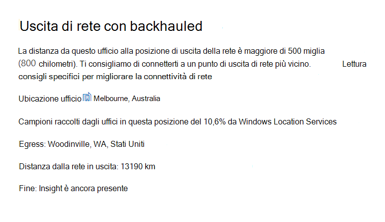
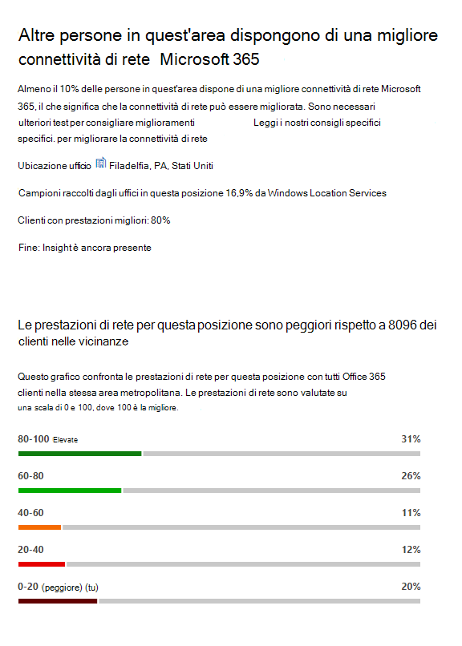
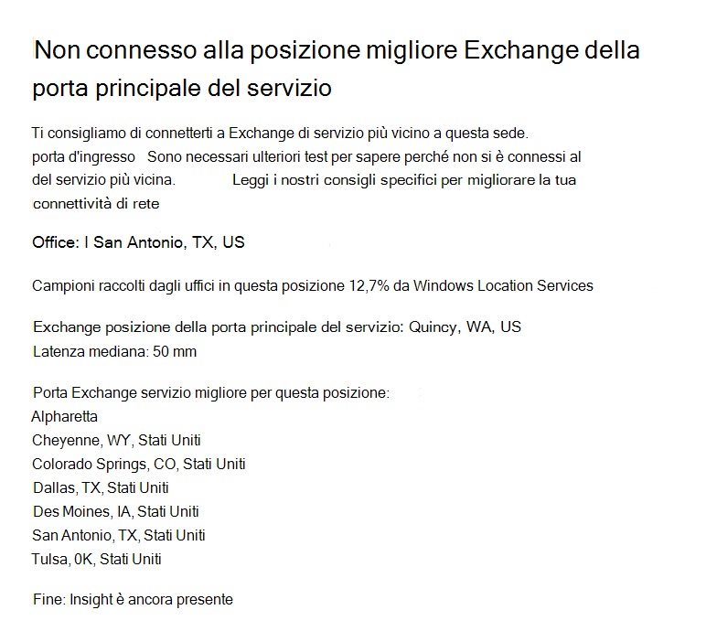
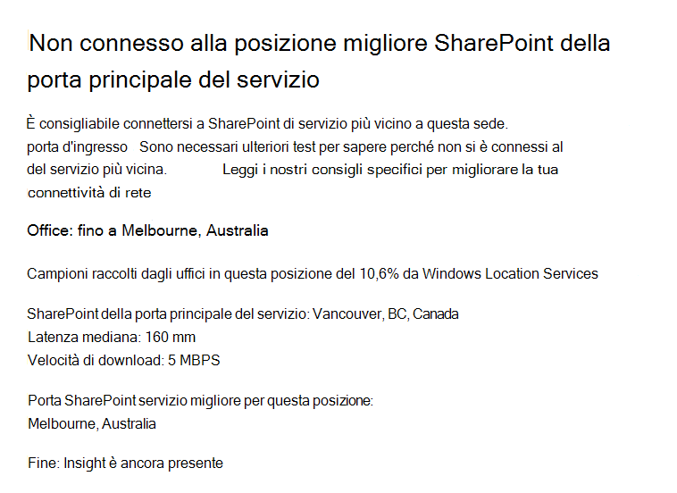

# Microsoft 365 Informazioni dettagliate sulla rete

**Le informazioni dettagliate** di rete sono metriche sulle prestazioni raccolte dal tenant Microsoft 365 e disponibili per la visualizzazione solo da parte degli utenti amministrativi nel tenant. Le informazioni dettagliate vengono visualizzate nell'Microsoft 365 admin center all'indirizzo <https://portal.microsoft.com/adminportal/home#/networkperformance> .

Le informazioni dettagliate sono utili per progettare perimetri di rete per le posizioni dell'ufficio. Ogni approfondimento fornisce dettagli in tempo reale sulle caratteristiche delle prestazioni per un problema comune specifico per ogni posizione geografica in cui gli utenti accedono al tenant.

Sono disponibili sei informazioni dettagliate sulla rete specifiche che possono essere visualizzate per ogni posizione dell'ufficio:

- [Uscita di rete con backhauled](#backhauled-network-egress)
- [Dispositivo intermedio di rete](#network-intermediary-device)
- [Prestazioni migliori rilevate per i clienti nelle vicinanze](#better-performance-detected-for-customers-near-you)
- [Uso di una porta d'ingresso del Exchange Online non ottimale](#use-of-a-non-optimal-exchange-online-service-front-door)
- [Uso di una porta d'ingresso del servizio SharePoint online non ottimale](#use-of-a-non-optimal-sharepoint-online-service-front-door)
- [Bassa velocità di download da SharePoint porta principale](#low-download-speed-from-sharepoint-front-door)
- [Uscita di rete ottimale per gli utenti in Cina](#china-user-optimal-network-egress)

Sono disponibili due informazioni dettagliate sulla rete a livello di tenant che possono essere visualizzate per il tenant. Queste vengono visualizzate anche nelle pagine del punteggio di produttività:

- [Exchange le connessioni campionate influenzate da problemi di connettività](#exchange-sampled-connections-impacted-by-connectivity-issues)
- [SharePoint le connessioni campionate influenzate da problemi di connettività](#sharepoint-sampled-connections-impacted-by-connectivity-issues)

>[!IMPORTANT]
>Le informazioni dettagliate sulla rete, i consigli sulle prestazioni e le valutazioni nell'interfaccia di amministrazione di Microsoft 365 sono attualmente in stato di anteprima ed è disponibile solo per i tenant di Microsoft 365 registrati nel programma di anteprima delle funzionalità.

## Uscita di rete con backhauled

Queste informazioni dettagliate verranno visualizzate se il servizio informazioni dettagliate di rete rileva che la distanza tra una determinata posizione utente e l'uscita di rete è maggiore di 800 chilometri, a indicare che il traffico di Microsoft 365 viene riabilitato a un proxy o a un dispositivo perimetrale Internet comune.

Questa panoramica è abbreviata come "Egress" in alcune visualizzazioni di riepilogo.

> [!div class="mx-imgBorder"]
> 

### Cosa significa questo messaggio?

Ciò identifica che la distanza tra la sede dell'ufficio e l'uscita di rete è superiore a 500 miglia (800 chilometri). La posizione dell'ufficio è identificata da una posizione offuscata del computer client e la posizione di uscita dalla rete viene identificata utilizzando l'indirizzo IP inverso per i database delle località. La posizione dell'ufficio potrebbe non essere corretta se Windows è disabilitato nei computer. Il percorso di uscita della rete potrebbe non essere accurato se le informazioni del database degli indirizzi IP inversa non sono accurate.

I dettagli per queste informazioni includono la posizione dell'ufficio, la percentuale stimata dell'utente tenant totale nella posizione, la posizione corrente di uscita della rete, la pertinenza della posizione di uscita, la distanza tra la posizione e il punto di uscita corrente, la data in cui la condizione è stata rilevata per la prima volta e la data in cui la condizione è stata risolta.

### Cosa si può fare?

Per queste informazioni, è consigliabile l'uscita della rete più vicino alla sede dell'ufficio, in modo che la connettività possa essere instradato in modo ottimale alla rete globale di Microsoft e alla porta d'ingresso del servizio di Microsoft 365 più vicina. La presenza di una stretta uscita di rete per le sedi degli utenti consente inoltre di migliorare le prestazioni in futuro, poiché Microsoft espande i punti di presenza della rete e Microsoft 365 porte anteriori del servizio in futuro.

Per ulteriori informazioni su come risolvere questo problema, vedere Egress [connessioni](microsoft-365-network-connectivity-principles.md#egress-network-connections-locally) di rete in locale in [Office 365 di connettività di rete](microsoft-365-network-connectivity-principles.md).

## Dispositivo intermedio di rete

Questa panoramica verrà visualizzata se sono stati rilevati dispositivi tra gli utenti e la rete di Microsoft che potrebbero influire sulla Office 365'esperienza utente. È consigliabile ignorarlo per il traffico di Microsoft 365 specifico destinato ai datacenter Microsoft. Questa raccomandazione è descritta in Microsoft 365 [di connettività di rete](microsoft-365-network-connectivity-principles.md). 

Un'analisi intermedia di rete mostrata è l'interruzione e l'ispezione SSL quando gli endpoint di rete Office 365 critici per Exchange, SharePoint e Teams vengono intercettati e decrittografati dai dispositivi di intermediazione di rete.

### Cosa significa questo messaggio?

I dispositivi intermedi di rete, ad esempio server proxy, VPN e dispositivi di prevenzione della perdita di dati, possono influire sulle prestazioni e sulla stabilità dei client Microsoft 365 in cui il traffico è intermedio.

### Cosa si può fare?

Configurare il dispositivo intermedio di rete rilevato per ignorare l'elaborazione Microsoft 365 traffico di rete.

## Prestazioni migliori rilevate per i clienti nelle vicinanze

Questa panoramica verrà visualizzata se il servizio informazioni dettagliate di rete rileva che un numero significativo di clienti nell'area della metropolitana ha prestazioni migliori rispetto agli utenti dell'organizzazione in questa sede dell'ufficio.

Questa panoramica è abbreviata come "Peers" in alcune visualizzazioni di riepilogo.

> [!div class="mx-imgBorder"]
> 

### Cosa significa questo messaggio?

Questa panoramica esamina le prestazioni aggregate dei clienti Microsoft 365 nella stessa città di questa sede. Questa panoramica viene visualizzata se la latenza media degli utenti è superiore del 10% alla latenza media dei tenant vicini.

### Cosa si può fare?

Questa condizione può essere causata da molti motivi, tra cui la latenza nella rete aziendale o nell'ISP, colli di bottiglia o problemi di progettazione dell'architettura. Esaminare la latenza tra ogni hop nella route tra la rete dell'ufficio e la porta Microsoft 365 porta principale corrente. Per ulteriori informazioni, vedere [Microsoft 365 di connettività di rete](microsoft-365-network-connectivity-principles.md).

## Uso di una porta d'ingresso del Exchange Online non ottimale

Questa panoramica verrà visualizzata se il servizio informazioni dettagliate di rete rileva che gli utenti in una posizione specifica non si connettono a una porta d'ingresso del servizio Exchange Online ottimale.

Questa panoramica è abbreviata come "Routing" in alcune visualizzazioni di riepilogo.

> [!div class="mx-imgBorder"]
> 

### Cosa significa questo messaggio?

Sono elencate Exchange Online porte anteriori del servizio adatte per l'uso dalla città della sede dell'ufficio con buone prestazioni. Se il test corrente mostra l'uso di una porta Exchange Online di servizio non in questo elenco, questa raccomandazione viene chiamata.

### Cosa si può fare?

L'uso di una porta anteriore del servizio Exchange Online non ottimale potrebbe essere causato da un backhaul di rete prima dell'uscita della rete aziendale, nel qual caso è consigliabile l'uscita di rete locale e diretta. Potrebbe anche essere causato dall'utilizzo di un server Resolver ricorsivo DNS remoto nel qual caso è consigliabile allineare il server Resolver ricorsivo DNS con l'uscita di rete.

## Uso di una porta d'ingresso del servizio SharePoint online non ottimale

Questa panoramica verrà visualizzata se il servizio informazioni dettagliate di rete rileva che gli utenti in una posizione specifica non si connettono alla porta d'ingresso del servizio online SharePoint più vicina.

Questa panoramica è abbreviata come "Afd" in alcune visualizzazioni di riepilogo.

> [!div class="mx-imgBorder"]
> 

### Cosa significa questo messaggio?

Identifi SharePoint porta principale del servizio online a cui si connette il client di test. Quindi, per la città della sede si confronta con la porta d'ingresso del servizio SharePoint online prevista per quella città. Se non corrisponde, questo consiglio viene fatto.

### Cosa si può fare?

L'uso di una porta d'ingresso del servizio SharePoint Online non ottimale potrebbe essere causato da un backhaul di rete prima dell'uscita della rete aziendale, nel qual caso è consigliabile l'uscita di rete locale e diretta. Potrebbe anche essere causato dall'utilizzo di un server Resolver ricorsivo DNS remoto nel qual caso è consigliabile allineare il server Resolver ricorsivo DNS con l'uscita di rete.

## Bassa velocità di download da SharePoint porta principale

Questa panoramica verrà visualizzata se il servizio informazioni dettagliate di rete rileva che la larghezza di banda tra la posizione specifica dell'ufficio e SharePoint Online è inferiore a 1 MBps.

Questa panoramica è abbreviata come "Velocità effettiva" in alcune visualizzazioni di riepilogo.

### Cosa significa questo messaggio?

La velocità di download che un utente può ottenere da SharePoint Online e OneDrive for Business front doors del servizio è misurata in megabyte al secondo (MBps). Se questo valore è inferiore a 1 MBps, forniamo queste informazioni.

### Cosa si può fare?

Per migliorare la velocità di download, potrebbe essere necessario aumentare la larghezza di banda. In alternativa, potrebbe verificarsi una congestione di rete tra i computer degli utenti nella sede dell'ufficio e la porta d'ingresso del SharePoint del servizio online. Questa operazione viene talvolta definita perdita congestionata e limita la velocità di download disponibile per gli utenti anche se è disponibile una larghezza di banda sufficiente.

## Uscita di rete ottimale per gli utenti in Cina

Questa panoramica verrà visualizzata se l'organizzazione ha utenti in Cina che si connettono al tenant Microsoft 365 in altre posizioni geografiche. 

### Cosa significa questo messaggio?

Se l'organizzazione dispone di connettività WAN privata, è consigliabile configurare un circuito WAN di rete dalle posizioni dell'ufficio in Cina con uscita di rete verso Internet in una delle posizioni seguenti:

- Hong Kong
- Giappone
- Taiwan
- Corea del Sud
- Singapore
- Malaysia

L'uscita da Internet più lontano dagli utenti rispetto a queste posizioni ridurrà le prestazioni e l'uscita in Cina potrebbe causare problemi di latenza e connettività elevati a causa della congestione transfrontaliera.

### Cosa si può fare?

Per ulteriori informazioni su come ridurre i problemi di prestazioni correlati a queste informazioni, vedere Microsoft 365 ottimizzazione delle prestazioni del tenant globale [per gli utenti della Cina.](microsoft-365-networking-china.md)

## Exchange le connessioni campionate influenzate da problemi di connettività

Questa panoramica mostrerà quando il 50% o più delle connessioni campionate sono influenzate. L'impatto è definito dalla valutazione Exchange inferiore al 60% per ogni campione.

### Cosa significa questo messaggio?

Si tratta di un'indicazione del fatto che la maggior parte degli utenti probabilmente riscontra problemi di esperienza utente Outlook connettersi a Exchange Online. La percentuale di campioni rappresenta probabilmente la percentuale di utenti che mostrano meno di 60 punti.  

### Cosa si può fare?

Abilitare la visibilità della connettività di rete della posizione dell'ufficio, se non è già stata eseguita. Si desidera identificare quali uffici sono influenzati da una connettività di rete scarsa che influisce su Exchange e trovare modi per migliorare il perimetro di rete in ognuno di essi che connette gli utenti alla rete di Microsoft.

## SharePoint le connessioni campionate influenzate da problemi di connettività

Questa panoramica mostrerà quando il 50% o più delle connessioni campionate sono influenzate. L'impatto è definito dalla valutazione SharePoint inferiore al 40% per ogni campione.

### Cosa significa questo messaggio?

È un'indicazione che la maggior parte degli utenti probabilmente riscontra problemi di esperienza utente con SharePoint e OneDrive. La percentuale di campioni rappresenta probabilmente la percentuale di utenti che mostrano meno di 40 punti.  

### Cosa si può fare?

Abilitare la visibilità della connettività di rete della posizione dell'ufficio, se non è già stata eseguita. Si desidera identificare quali uffici sono influenzati da una connettività di rete scarsa che influisce su SharePoint e trovare modi per migliorare il perimetro di rete in ognuno di essi che connette gli utenti alla rete di Microsoft.

## Argomenti correlati

[Connettività di rete nell'Microsoft 365 admin center (anteprima)](office-365-network-mac-perf-overview.md)

[Microsoft 365 di rete (anteprima)](office-365-network-mac-perf-score.md)

[Microsoft 365 di test della connettività di rete (anteprima)](office-365-network-mac-perf-onboarding-tool.md)

[Microsoft 365 Servizi percorso di connettività di rete (anteprima)](office-365-network-mac-location-services.md)
