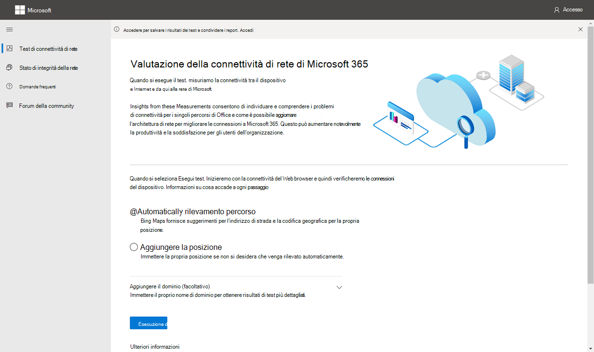
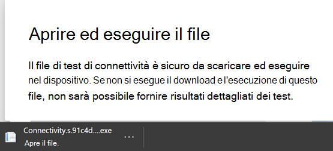
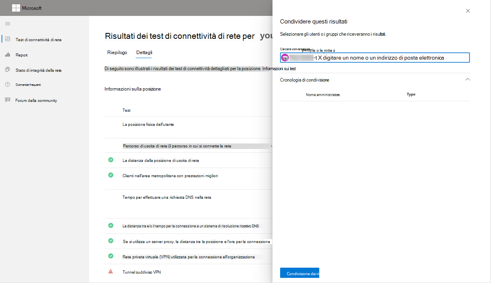
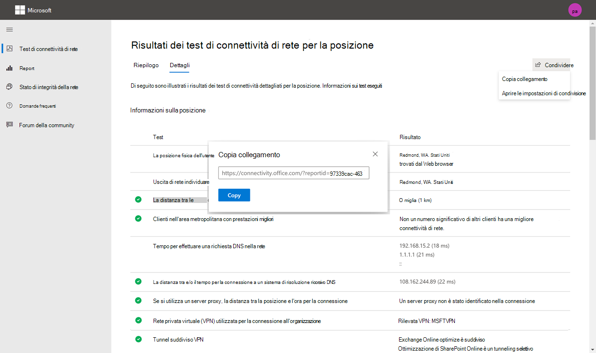
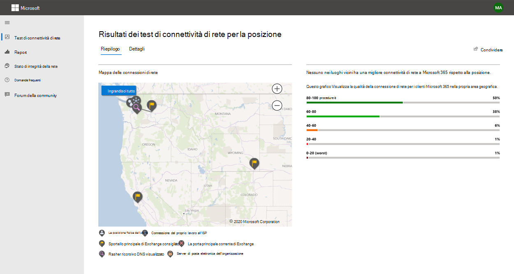
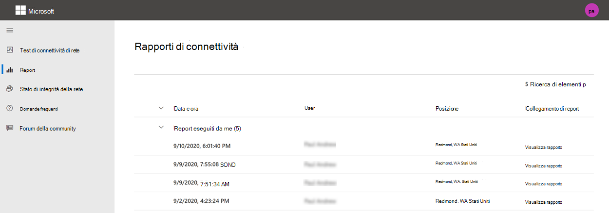
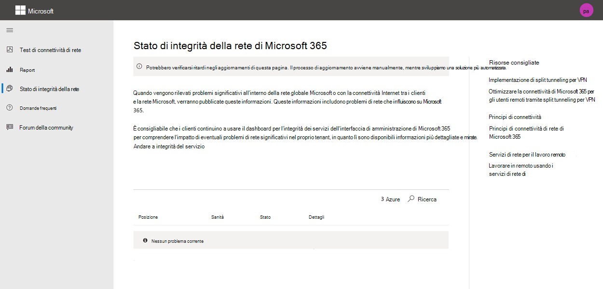

# Strumento di test della connettività di rete Microsoft 365 (anteprima)

Lo strumento di test della connettività di rete di Microsoft 365 si trova in <https://connectivity.office.com> . Si tratta di uno strumento aggiunto per la valutazione della rete e le informazioni di rete disponibili nell'interfaccia di amministrazione di Microsoft 365 nell'area **integrità | Menu connettività** .

>[!NOTE]
>Lo strumento di test della connettività di rete supporta i tenant in WW Commercial e in Germania, ma non GCC moderato, GCC High, DoD o China.

Gli approfondimenti di rete nell'interfaccia di amministrazione di Microsoft 365 si basano su normali misure di prodotto per il tenant Microsoft 365 che vengono aggregati ogni giorno. In confronto, le informazioni di rete del test di connettività di rete di Microsoft 365 vengono eseguite localmente e una volta nello strumento. Il testing che può essere eseguito in-Product è limitato e eseguendo i test locali all'utente è possibile raccogliere più dati con conseguente approfondimento delle informazioni. Si consideri quindi che la rete di approfondimenti nell'interfaccia di amministrazione di Microsoft 365 mostrerà che esiste un problema di rete per l'utilizzo di Microsoft 365 in una posizione specifica di Office. Il test di connettività Microsoft 365 può essere utile per identificare la causa principale del problema che porta a un'azione di miglioramento delle prestazioni di rete consigliata.

È consigliabile utilizzarli insieme in cui è possibile valutare lo stato di qualità di rete per ogni percorso di Office nell'interfaccia di amministrazione di Microsoft 365 e trovare ulteriori specifiche dopo la distribuzione dei test in base al test di connettività di Microsoft 365.

>[!IMPORTANT]
>Insights di rete, raccomandazioni sulle prestazioni e valutazioni nell'interfaccia di amministrazione di Microsoft 365 è attualmente in stato di anteprima ed è disponibile solo per i tenant di Microsoft 365 che sono stati registrati nel programma di anteprima delle funzionalità.

## Cosa accade in ogni passaggio del test

### Identificazione della posizione di Office

Quando si fa clic sul pulsante Esegui test, viene mostrata la pagina di test in esecuzione e viene individuata la posizione dell'ufficio. È possibile digitare la posizione in base alla città, allo stato e al paese oppure è possibile che sia stata rilevata dal Web browser. Se viene rilevato, è necessario richiedere la latitudine e la longitudine dal Web browser e limitare l'accuratezza a 300m per 300m prima dell'utilizzo. È possibile eseguire questa operazione perché non è necessario identificare la posizione in modo più accurato rispetto all'edificio per le prestazioni di rete. 

### Test JavaScript

Dopo l'identificazione della posizione di Office, viene eseguito un test di latenza TCP in JavaScript e vengono richiesti dati dal servizio per i server front-Service e consigliati in uso di Office 365. Dopo aver completato queste informazioni, è possibile visualizzarle sulla mappa e nella scheda dettagli, in cui possono essere visualizzate prima del passaggio successivo.

### Scaricare l'applicazione client test avanzati

Successivamente, viene avviato il download dell'applicazione client test avanzati. Si fa affidamento sull'utente per avviare l'applicazione client ed è necessario che sia installato anche .NET Core.

Sono disponibili due parti nel test di connettività di rete di Microsoft 365. il sito Web <https://connectivity.office.com> e un'applicazione client di Windows scaricabile che esegue test di connettività di rete avanzati. La maggior parte dei test richiede l'esecuzione dell'applicazione. I risultati verranno inseriti di nuovo nella pagina Web durante l'esecuzione.

Verrà richiesto di scaricare l'applicazione di test client avanzata dal sito Web al termine dei test del Web browser. Aprire ed eseguire il file quando richiesto.

### Avviare l'applicazione client test avanzati

Dopo l'avvio dell'applicazione client, la pagina Web verrà aggiornata in modo da visualizzare i dati e il test inizierà a ricevere la pagina Web. Viene aggiornato ogni volta che vengono ricevuti nuovi dati ed è possibile esaminare i dati in arrivo.

### Test avanzati completati e test del caricamento del rapporto

Una volta completati i test, la pagina Web e il client test avanzati indicheranno questo e, se l'utente ha eseguito l'accesso, il report di test verrà caricato nel tenant clienti.

## Condivisione del rapporto di test

Il rapporto di prova richiede l'accesso all'account di Office 365. L'amministratore seleziona la modalità di condivisione del rapporto di test.

### Condivisione del report con l'amministratore

Tutti i rapporti di prova durante l'accesso vengono condivisi con l'amministratore.

### Condivisione con il team dell'account Microsoft, il supporto o altro personale

I report dei test che escludono qualsiasi identificazione personale sono condivisi con i dipendenti Microsoft. Questa opzione è abilitata per impostazione predefinita e può essere disattivata dall'amministratore nell' **integrità | Pagina connettività di rete** nell'interfaccia di amministrazione di Microsoft 365.

### Condivisione con altri utenti che effettuano l'accesso allo stesso tenant di Office 365

È possibile scegliere gli utenti a cui condividere il report e questo è abilitato per impostazione predefinita. Può anche essere disattivata dall'amministratore.

### Condivisione con tutti gli utenti che utilizzano un collegamento ReportID

È possibile condividere il rapporto di test con tutti gli utenti fornendo accesso a un collegamento a ReportID. Questo genera un URL che può essere inviato a un utente in modo da poter visualizzare il report di test senza eseguire l'accesso. Questa opzione è disabilitata per impostazione predefinita e deve essere abilitata dall'amministratore.

## Risultati dei test di connettività di rete

I risultati vengono visualizzati nelle schede **Riepilogo** e **Dettagli** . La scheda Riepilogo Visualizza una mappa del perimetro di rete rilevato e un confronto tra la valutazione della rete e altri clienti di Office 365 nelle vicinanze. Consente inoltre la condivisione del rapporto di test. Di seguito è riportato l'aspetto della visualizzazione dei risultati di riepilogo.

Di seguito è riportato un esempio dell'output della scheda dettagli che viene visualizzato dallo strumento. Nella scheda Dettagli viene visualizzato un segno di spunta del cerchio verde se il risultato è stato confrontato in modo favorevole a una soglia. Viene visualizzato un punto esclamativo con triangolo rosso se il risultato ha superato una soglia che indica una panoramica della rete. Nelle sezioni seguenti vengono descritte le righe dei risultati della scheda Dettagli e vengono illustrate le soglie utilizzate per le informazioni sulla rete.

### Informazioni sulla posizione

In questa sezione vengono illustrati i risultati dei test relativi alla posizione.

#### Posizione

La posizione dell'utente viene rilevata dal Web browser utenti oppure può essere digitata a scelta degli utenti. Viene utilizzato per identificare la distanza di rete verso parti specifiche del perimetro della rete aziendale. Nel report viene salvata solo la città da questo rilevamento località e la distanza ad altri punti di rete.

La posizione dell'ufficio utente è visualizzata nella visualizzazione mappa.

#### Percorso di uscita di rete (il percorso in cui la rete si connette all'ISP)

Identifichiamo l'indirizzo IP dell'uscita di rete sul server. I database delle posizioni vengono utilizzati per cercare la posizione approssimativa per l'uscita di rete. Tali database presentano in genere un'accuratezza pari a circa il 90% di indirizzi IP. Se il percorso visualizzato dall'indirizzo IP della rete di uscita non è accurato, questo porterebbe a un risultato falso da questo test. Per convalidare se questo errore si verifica per uno specifico indirizzo IP, è possibile utilizzare siti Web di indirizzi IP di rete accessibili al pubblico per confrontare la posizione effettiva.

#### La distanza dalla posizione di uscita di rete

È possibile determinare la distanza tra tale percorso e l'ubicazione dell'ufficio. Questo viene visualizzato come una panoramica della rete se la distanza è maggiore di **500 miglia** (800 km), in quanto è probabile che aumenti la latenza TCP di più di 25ms e possa influire sull'esperienza utente.

Il percorso di uscita della rete è visualizzato sulla visualizzazione mappa e connesso alla posizione dell'ufficio utenti che indica il backhaul della rete all'interno della WAN aziendale.

Per la connettività di rete di Microsoft 365 è consigliata l'implementazione dell'uscita di rete locale e diretta dalle posizioni degli uffici degli utenti a Internet. I miglioramenti apportati alle funzionalità di uscita locali e dirette sono il modo migliore per gestire questa panoramica della rete.

#### Informazioni sul server proxy

Vengono identificati i server proxy configurati nel computer locale. Si identifica se una di queste impostazioni è configurata nel percorso di rete per ottimizzare il traffico di rete di Microsoft 365. È possibile identificare la distanza tra la posizione dell'ufficio utente e i server proxy. La distanza viene testata prima dal ping ICMP e, in caso di esito negativo, viene testato con il ping TCP e, infine, se si verifica un errore, si cerca l'indirizzo IP del server proxy in un database del percorso dell'indirizzo IP. Viene visualizzata una panoramica della rete se il server proxy è oltre **500 miglia** (800 km) dalla posizione dell'ufficio utenti.

#### Rete privata virtuale (VPN) utilizzata per la connessione all'organizzazione

In questo modo viene rilevato se si utilizza una VPN per connettersi a Office 365. Se non si dispone di una VPN o se si dispone di una VPN con configurazione del tunnel Split consigliata per Office 365, verrà visualizzato un risultato di passaggio.

#### Tunnel suddiviso VPN

Ogni route di categoria optimize per Exchange Online, SharePoint Online e Microsoft teams viene testata per verificare se è stata eseguito il tunneling sulla VPN o meno. Un carico di lavoro suddiviso evita completamente la VPN. Un carico di lavoro con tunneling è tutto inviato tramite la VPN. Un carico di lavoro con tunneling selettivo ha alcuni percorsi inviati tramite la VPN e alcuni suddivisi. Un risultato di passaggio verrà visualizzato se tutti i carichi di lavoro sono divisi o selettivi.

#### Clienti nell'area metropolitana con prestazioni migliori

La latenza TCP di rete del percorso dell'utente di Office per il servizio Exchange Online porta anteriore viene confrontata con altri clienti Microsoft 365 nella stessa area metropolitana. Se il 10% o più clienti della stessa area metropolitana hanno prestazioni migliori, viene visualizzata una panoramica della rete. Questo significa che gli utenti avranno prestazioni migliori nell'interfaccia utente di Microsoft 365.

Questo Network Insight è generato sulla base del fatto che tutti gli utenti di una città abbiano accesso alla stessa infrastruttura di telecomunicazioni e alla stessa vicinanza ai circuiti Internet e alla rete di Microsoft.

#### Tempo per effettuare una richiesta DNS nella rete

In questo modo viene visualizzato il server DNS configurato nel computer client in cui sono stati eseguiti i test. Potrebbe trattarsi di un server resolver ricorsivo DNS che tuttavia non è comune. È più probabile che sia un server di inoltro DNS che memorizza nella cache i risultati DNS e inoltra tutte le richieste DNS non memorizzate nella cache a un altro server DNS.

Questa operazione viene fornita solo per informazioni e non contribuisce a qualsiasi analisi di rete.

#### La distanza tra e/o il tempo per la connessione a un sistema di risoluzione ricorsivo DNS

Il sistema di risoluzione ricorsivo DNS in uso viene identificato facendo una richiesta DNS specifica e quindi chiedendo al server dei nomi DNS l'indirizzo IP da cui ha ricevuto la stessa richiesta. Questo indirizzo IP è il sistema di risoluzione ricorsivo DNS che verrà cercato nei database delle posizioni degli indirizzi IP per individuare il percorso. Viene quindi calcolata la distanza tra il percorso dell'utente e il percorso del server resolver ricorsivo DNS. Questo viene visualizzato come Insight di rete se la distanza è maggiore di **500 miglia** (800 km).

La posizione individuata dall'indirizzo IP della rete di uscita potrebbe non essere accurata e ciò porterebbe a un falso risultato di questo test. Per convalidare se questo errore si verifica per uno specifico indirizzo IP, è possibile utilizzare siti Web di indirizzi IP di rete accessibili pubblicamente.

Questo Network Insight avrà un impatto specifico sulla selezione del servizio Exchange Online. Per risolvere questo Insight l'uscita di rete locale e diretta dovrebbe essere un prerequisito e quindi il sistema di risoluzione ricorsivo DNS deve trovarsi vicino all'uscita di rete.

### Exchange Online

In questa sezione vengono illustrati i risultati dei test relativi a Exchange Online.

#### Posizione del servizio di Exchange front door

La porta principale del servizio di Exchange in uso viene identificata nello stesso modo in cui viene utilizzata da Outlook e viene misurata la latenza di rete TCP dalla posizione dell'utente. Viene visualizzata la latenza TCP e la porta principale del servizio di Exchange in uso viene confrontata con l'elenco delle porte frontali dei servizi migliori per la posizione corrente. Questo viene visualizzato come una panoramica della rete se uno dei migliori portali di servizio di Exchange non è in uso.

L'utilizzo di uno dei migliori portali di servizio di Exchange potrebbe essere causato dal backhaul della rete prima dell'uscita della rete aziendale, nel qual caso è consigliabile l'uscita di rete locale e diretta. Potrebbe anche essere causato dall'utilizzo di un server resolver DNS ricorsivo remoto, nel qual caso si consiglia di allineare il server resolver ricorsivo DNS con l'uscita di rete.

Si calcola un potenziale miglioramento della latenza TCP (MS) per il servizio di Exchange front door. Per eseguire questa operazione, è possibile esaminare la latenza della rete del percorso dell'utente di Office e sottrarre la latenza di rete dal percorso corrente alla porta principale del servizio di Exchange closet. La differenza rappresenta la possibilità di miglioramento.

#### Best Exchange front door (s) per la tua posizione

In questo elenco vengono elencate le posizioni migliori del servizio di Exchange in base alla città per la propria posizione.

#### Porta anteriore del servizio registrata nel DNS client

In questo modo vengono visualizzati il nome DNS e l'indirizzo IP del server front door Service di Exchange a cui si è diretti. Viene fornito solo per informazioni e non è presente un'analisi di rete associata.

### SharePoint Online

In questa sezione vengono illustrati i risultati dei test relativi a SharePoint Online e OneDrive.

#### Posizione della porta principale del servizio

La porta di servizio di SharePoint in uso è identificata nello stesso modo in cui il client di OneDrive esegue la misura e la latenza di rete TCP viene confrontata dalla posizione dell'ufficio dell'utente.

#### Velocità di download

La velocità di download di un file 15Mb viene misurata dalla porta principale del servizio SharePoint. Il risultato viene visualizzato in megabyte al secondo per indicare il tipo di file di dimensioni in megabyte che è possibile scaricare da SharePoint o OneDrive in **un secondo**. Il numero dovrebbe essere simile a un decimo della larghezza di banda minima del circuito in megabit al secondo. Ad esempio, se si dispone di una connessione Internet a 100 Mbps, è possibile prevedere 10 megabyte al secondo (10MBps).

#### Gonfiore del buffer

Durante il download di 15Mb si misura la latenza TCP verso la porta di servizio di SharePoint. Questa è la latenza sotto carico e viene confrontata con la latenza quando non è sotto carico. L'aumento della latenza, in caso di carico, è spesso attribuibile ai buffer dei dispositivi di rete consumer caricati (o rigonfiati). Viene visualizzata una panoramica della rete per eventuali rigonfiamenti di 1.000 o più.

#### Porta anteriore del servizio registrata nel DNS client

In questo modo vengono visualizzati il nome DNS e l'indirizzo IP del server front door Service di SharePoint a cui si è diretti. Viene fornito solo per informazioni e non è presente un'analisi di rete associata.

### Microsoft Teams

In questa sezione vengono illustrati i risultati dei test relativi a Microsoft teams.

#### Connettività multimediale (audio, video e condivisione applicazioni)

Questo test per la connettività UDP alla porta principale del servizio Microsoft teams. Se questo è bloccato, Microsoft teams potrebbe continuare a funzionare usando TCP, ma l'audio e il video verranno compromessi. Ulteriori informazioni su queste misure di rete UDP che si applicano anche a Microsoft teams in [qualità multimediale e prestazioni di connettività di rete in Skype for business online](https://docs.microsoft.com/skypeforbusiness/optimizing-your-network/media-quality-and-network-connectivity-performance)

#### Perdita di pacchetti

Visualizza la perdita di pacchetti UDP misurata in una chiamata di 10 secondi di test audio dal client al servizio Microsoft teams front door. Questo valore deve essere inferiore a **1,00%** per un passaggio.

#### Latenza

Visualizza la latenza UDP misurata, che deve essere inferiore a **100 MS**.

#### Instabilità

Visualizza l'instabilità UDP misurata, che deve essere inferiore a **30ms**.

#### Connettività

Testiamo la connettività HTTP dal percorso dell'utente a tutti gli endpoint di rete Microsoft 365 necessari. Questi sono pubblicati su [https://aka.ms/o365ip](https://aka.ms/o365ip) . Viene visualizzata una panoramica della rete per tutti gli endpoint di rete necessari che non possono essere connessi.

La connettività può essere bloccata da un server proxy, da un firewall o da un altro dispositivo di sicurezza di rete nel perimetro della rete aziendale. La connettività alla porta TCP 80 viene testata con una richiesta HTTP e la connettività alla porta TCP 443 viene testata con una richiesta HTTPS. Se non è presente alcuna risposta, il nome di dominio completo viene contrassegnato come errore. Se è presente un codice di risposta HTTP 407, il nome di dominio completo viene contrassegnato come errore. Se è presente un codice di risposta HTTP 403, è necessario controllare l'attributo server della risposta e, se si tratta di un server proxy, questo viene contrassegnato come un errore. È possibile simulare i test eseguiti con lo strumento da riga di comando di Windows curl.exe.

Testiamo il certificato SSL a ogni endpoint di rete Microsoft 365 necessario che si trova nella categoria ottimizza o Consenti come definito in [https://aka.ms/o365ip](https://aka.ms/o365ip) . Se i test non trovano un certificato SSL Microsoft, è necessario che la rete crittografata connessa sia stata intercettata da un dispositivo di rete intermediario. Un'analisi di rete viene visualizzata su tutti gli endpoint di rete crittografati intercettati.

Quando viene rilevato un certificato SSL non fornito da Microsoft, viene visualizzato il nome di dominio completo per il test e il proprietario del certificato SSL in uso. Questo proprietario del certificato SSL può essere un fornitore del server proxy oppure un certificato autofirmato Enterprise.

#### Percorso di rete

In questa sezione vengono illustrati i risultati di un traceroute ICMP per il servizio Exchange Online, la porta di ingresso del servizio SharePoint Online e il servizio Microsoft teams front door. Viene fornito solo per informazioni e non è presente un'analisi di rete associata. Sono disponibili tre traceroute. Un traceroute a _Outlook.office365.com_, un traceroute per i clienti di SharePoint front-end o a _Microsoft.SharePoint.com_ , se non è stato fornito, e un traceroute su _World.tr.teams.Microsoft.com_.

## Rapporti di connettività

Dopo aver eseguito l'accesso, è possibile esaminare i report precedenti che sono stati eseguiti. È anche possibile condividerli o eliminarli dall'elenco.

## Stato di integrità della rete

In questo modo vengono visualizzati problemi di integrità significativi con la rete globale di Microsoft che potrebbe influire sui clienti di Microsoft 365.

## Domande frequenti

Di seguito sono riportate alcune delle risposte alle domande più frequenti.

### Questo strumento è stato rilasciato e supportato da Microsoft?

È attualmente in anteprima e si prevede di fornire gli aggiornamenti regolarmente fino a quando non si raggiunge lo stato di rilascio generale di disponibilità con il supporto di Microsoft. Si prega di fornire commenti e suggerimenti per migliorare. Si prevede di pubblicare una guida di onboarding di rete di Office 365 più dettagliata come parte di questo strumento, personalizzato per l'organizzazione in base ai risultati dei test.

### Che cosa è necessario per eseguire il client di testing avanzato?

Il client di testing avanzato richiede il runtime desktop .NET Core 3,1. Se si esegue il client di testing avanzato senza che sia installato, verrà indirizzato alla [pagina .NET Core 3,1 Installer](https://dotnet.microsoft.com/download/dotnet-core/3.1). Assicurarsi di installare il runtime desktop e non l'SDK o il runtime di base di ASP.NET che sono più in alto nella pagina. Per installare .NET Core è necessario disporre delle autorizzazioni di amministratore per il computer.

### Che cos'è Microsoft 365 Service front door?

Microsoft 365 Service front door è un punto di ingresso sulla rete globale di Microsoft in cui i client e i servizi di Office terminano la connessione di rete. Per una connessione di rete ottimale a Microsoft 365, è consigliabile che la connessione di rete venga interrotta nella porta principale più vicina di Microsoft 365 nella propria città o nella metropolitana.

Nota: la porta principale del servizio Microsoft 365 non ha alcuna relazione diretta con il prodotto di **servizio di Azure front door** disponibile in Azure Marketplace.

### Che cos'è il Best door Service di Microsoft 365?

Una porta principale del servizio Microsoft 365 (in precedenza nota come porta di servizio ottimale) è quella più vicina all'uscita di rete, in genere nella propria area urbana o metropolitana. Utilizzare lo strumento di prestazioni di rete Microsoft 365 per determinare la posizione della porta di ingresso del servizio Microsoft 365 in uso e la porta principale del servizio migliore. Se lo strumento determina che la porta principale in uso è una delle migliori, è necessario prevedere una grande connettività nella rete globale di Microsoft.

### Che cos'è un percorso di uscita Internet?

La posizione di uscita Internet è il percorso in cui il traffico di rete esce dalla rete aziendale e si connette a Internet. Questo è anche identificato come il percorso in cui si dispone di un dispositivo NAT (Network Address Translation) e in genere dove si è connessi con un provider di servizi Internet (ISP). Se si vede una distanza interurbana tra la posizione e la posizione di uscita Internet, potrebbe essere possibile identificare una significativa backhaul WAN.

## Argomenti correlati

[Connettività di rete nell'interfaccia di amministrazione di Microsoft 365 (anteprima)](office-365-network-mac-perf-overview.md)

[Informazioni sulle prestazioni di rete di Microsoft 365 (anteprima)](office-365-network-mac-perf-insights.md)

[Valutazione della rete Microsoft 365 (Preview)](office-365-network-mac-perf-score.md)

[Microsoft 365 servizi di localizzazione della connettività di rete (anteprima)](office-365-network-mac-location-services.md)
