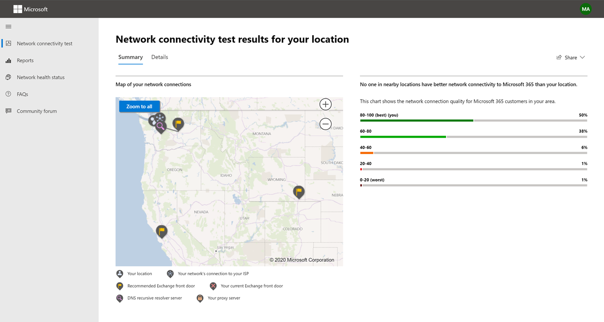

# Microsoft 365 di test della connettività di rete

Lo Microsoft 365 di test della connettività di rete si trova in <https://connectivity.office.com> . Si tratta di uno strumento di aggiunta alle informazioni sulla valutazione della rete e sulle informazioni dettagliate di rete disponibili nell'interfaccia di amministrazione di Microsoft 365 in **Health | Menu Connettività.**

> [!IMPORTANT]
> È importante accedere al tenant di Microsoft 365 perché tutti i report di test vengono condivisi con l'amministratore e caricati nel tenant durante l'accesso.

> [!div class="mx-imgBorder"]
> 

>[!NOTE]
>Lo strumento di test della connettività di rete supporta i tenant in WW Commercial e Germania, ma non GCC Moderate, GCC High, DoD o Cina.

Le informazioni dettagliate sulla rete Microsoft 365'interfaccia di amministrazione si basano su misurazioni regolari nel prodotto per il tenant di Microsoft 365, che vengono aggregate ogni giorno. In confronto, le informazioni dettagliate sulla rete Microsoft 365 test della connettività di rete vengono eseguite in locale e una sola volta nello strumento. I test che possono essere eseguiti nel prodotto sono limitati e eseguendo test locali per l'utente è possibile raccogliere più dati, con conseguente approfondimenti più approfonditi. Considerare quindi che le informazioni dettagliate sulla rete nell'interfaccia di amministrazione di Microsoft 365 mostreranno che si è verificato un problema di rete per l'uso di Microsoft 365 in una posizione specifica dell'ufficio. Il Microsoft 365 di connettività può aiutare a identificare la causa principale del problema, determinando un'azione di miglioramento delle prestazioni di rete consigliata.

È consigliabile usare queste informazioni dettagliate insieme dove è possibile valutare lo stato di qualità della rete per ogni posizione dell'ufficio nell'interfaccia di amministrazione di Microsoft 365 ed è possibile trovare ulteriori informazioni specifiche dopo la distribuzione dei test in base al test di connettività di Microsoft 365.

>[!IMPORTANT]
>Le informazioni dettagliate sulla rete, i consigli sulle prestazioni e le valutazioni nell'interfaccia di amministrazione di Microsoft 365 sono attualmente in stato di anteprima ed è disponibile solo per i tenant di Microsoft 365 registrati nel programma di anteprima delle funzionalità.

## Cosa accade a ogni passaggio del test

### Office posizione

Quando si fa clic sul pulsante Esegui test, viene visualizzata la pagina di test in esecuzione e viene identificata la posizione dell'ufficio. È possibile digitare la posizione in base alla città, allo stato e al paese oppure rilevarla dal Web browser. Se lo rileva, richiediamo la latitudine e la longitudine dal web browser e limitiamo la precisione a 300 metri per 300 metri prima dell'uso. A tale scopo, non è necessario identificare la posizione in modo più accurato rispetto all'edificio per ottenere prestazioni di rete. 

### Test JavaScript

Dopo l'identificazione della posizione dell'ufficio, eseiamo un test di latenza TCP in JavaScript e richiediamo dati al servizio sui server Office 365 front door del servizio in uso e consigliati. Una volta completati questi test, li mostriamo sulla mappa e nella scheda dei dettagli in cui possono essere visualizzati prima del passaggio successivo.

### Scaricare l'applicazione client di test avanzati

Viene quindi avviato il download dell'applicazione client di test avanzati. Ci affidiamo all'utente per avviare l'applicazione client e deve avere installato anche .NET Core.

Il test della connettività di rete Microsoft 365 due parti: il sito Web e un'applicazione client Windows che esegue test di connettività di rete <https://connectivity.office.com> avanzati. La maggior parte dei test richiede l'esecuzione dell'applicazione. I risultati verranno popolati nuovamente nella pagina Web durante l'esecuzione.

Al termine dei test del Web browser verrà richiesto di scaricare l'applicazione di test client avanzata dal sito Web. Aprire ed eseguire il file quando richiesto.

> [!div class="mx-imgBorder"]
> 

### Avviare l'applicazione client di test avanzati

Una volta avviata l'applicazione client, la pagina Web verrà aggiornato per visualizzare questo risultato. I dati di test inizieranno a essere ricevuti nella pagina Web. La pagina viene aggiornata ogni volta che vengono ricevuti nuovi dati ed è possibile esaminare i dati non appena arrivano.

### Test avanzati completati e caricamento del report di test

Al termine dei test, la pagina Web e il client di test avanzati lo mostreranno entrambi. Se l'utente ha eseguito l'accesso, il report di test verrà caricato nel tenant del cliente.

## Condivisione del report di test

Il report di test richiede l'accesso al Office 365 account. L'amministratore seleziona la modalità di condivisione del report di test.

### Condivisione del report con l'amministratore

Se è stato eseguito l'accesso quando si verifica un report di test, i report vengono condivisi con l'amministratore.

### Condivisione con il team dell'account Microsoft, il supporto o altro personale

I report di test (esclusa qualsiasi identificazione personale) vengono condivisi con i dipendenti Microsoft. Questa condivisione è abilitata per impostazione predefinita e può essere disabilitata dall'amministratore nel | **Pagina Connettività** di rete nell'Microsoft 365 di amministrazione.

### Condivisione con altri utenti che a loro Office 365 tenant

È possibile scegliere gli utenti con cui condividere il report. La possibilità di scegliere è abilitata per impostazione predefinita, ma può essere disabilitata dall'amministratore.

> [!div class="mx-imgBorder"]
> 

### Condivisione con chiunque utilizzi un collegamento ReportID

È possibile condividere il report di test con chiunque fornendo l'accesso a un collegamento ReportID. Questo collegamento genera un URL che è possibile inviare a un utente in modo che possa visualizzare il report di test senza eseguire l'accesso. Questa condivisione è disabilitata per impostazione predefinita e deve essere abilitata dall'amministratore.

> [!div class="mx-imgBorder"]
> 

## Risultati test connettività di rete

I risultati vengono visualizzati nelle **schede Riepilogo** **e** Dettagli. La scheda di riepilogo mostra una mappa del perimetro di rete rilevato e un confronto della valutazione della rete con altri Office 365 clienti nelle vicinanze. Consente inoltre la condivisione del report di test. Ecco l'aspetto della visualizzazione dei risultati di riepilogo:

> [!div class="mx-imgBorder"]
> 

Ecco un esempio dell'output della scheda dettagli visualizzato con lo strumento. Nella scheda dei dettagli viene visualizzato un segno di spunta cerchio verde se il risultato è stato confrontato favorevolmente con una soglia. Se il risultato ha superato una soglia che indica una conoscenza della rete, viene visualizzato un punto esclamativo con triangolo rosso. Le sezioni seguenti descrivono ognuna delle righe dei risultati della scheda Dettagli e illustrano le soglie utilizzate per le informazioni dettagliate sulla rete.

> [!div class="mx-imgBorder"]
> 

### Informazioni sulla posizione

In questa sezione vengono mostrati i risultati dei test correlati alla posizione.

#### La tua posizione

Il percorso utente viene rilevato dal Web browser degli utenti. Può anche essere digitato a scelta dell'utente. Viene utilizzato per identificare le distanze di rete verso parti specifiche del perimetro della rete aziendale. Nel report vengono salvate solo la città di questo rilevamento della posizione e la distanza da altri punti di rete.

La posizione dell'ufficio utente viene visualizzata nella visualizzazione mappa.

#### Posizione di uscita dalla rete (la posizione in cui la rete si connette all'ISP)

L'indirizzo IP di uscita dalla rete viene identificato sul lato server. I database delle località vengono utilizzati per cercare la posizione approssimativa per l'uscita di rete. Questi database hanno in genere una precisione di circa il 90% degli indirizzi IP. Se la posizione cercata dall'indirizzo IP di uscita della rete non è accurata, questo potrebbe causare un risultato falso da questo test. Per verificare se questo errore si verifica per uno specifico indirizzo IP, è possibile utilizzare siti Web di posizione dell'indirizzo IP di rete accessibili pubblicamente da confrontare con la posizione effettiva.

#### Distanza dalla posizione dell'uscita di rete

Microsoft determina la distanza da tale posizione alla sede dell'ufficio. Questo viene mostrato come una panoramica della rete se la distanza è superiore a **500** miglia (800 chilometri) poiché è probabile che ciò aumenti la latenza TCP di più di 25 ms e possa influire sull'esperienza utente.

La posizione di uscita della rete viene visualizzata nella visualizzazione mappa e connessa alla posizione dell'ufficio dell'utente che indica il backhaul di rete all'interno della rete WAN aziendale.

L'implementazione dell'uscita di rete locale e diretta dalle posizioni degli uffici degli utenti a Internet è consigliata per Microsoft 365 connettività di rete. I miglioramenti all'uscita locale e diretta sono il modo migliore per affrontare queste informazioni di rete.

#### Informazioni sul server proxy

Identifidiamo i server proxy configurati nel computer locale. Viene identificato se uno di questi elementi è configurato nel percorso di rete per ottimizzare la categoria Microsoft 365 traffico di rete. Viene identificata la distanza tra la sede dell'utente e i server proxy. La distanza viene testata prima dal ping ICMP e in caso di esito negativo viene eseguito il test con il ping TCP e infine, in caso di esito negativo, viene eseguita la ricerca dell'indirizzo IP del server proxy in un database della posizione dell'indirizzo IP. Viene mostrata una panoramica della rete  se il server proxy si trova a più di 800 chilometri dalla sede dell'utente.

#### Rete privata virtuale (VPN) utilizzata per connettersi all'organizzazione

In questo modo viene rilevato se si utilizza una VPN per connettersi a Office 365. Un risultato di passaggio mostrerà se non hai una VPN o se hai una VPN con la configurazione split tunnel consigliata per Office 365.

#### Split Tunnel VPN

Ogni route di categoria ottimizzata per Exchange Online, SharePoint Online e Microsoft Teams viene testata per verificare se è stata o meno tunneled nella VPN. Un carico di lavoro diviso evita completamente la VPN. Un carico di lavoro tunneling viene inviato tramite VPN. Un carico di lavoro con tunneling selettivo ha alcune route inviate sulla VPN e alcune sono suddivise. Un risultato di passaggio mostrerà se tutti i carichi di lavoro sono suddivisi o selettivi.

#### Clienti nell'area metropolitana con prestazioni migliori

La latenza TCP di rete della sede dell'utente alla porta d'ingresso del servizio Exchange Online viene confrontata con altri clienti Microsoft 365 nella stessa area della metropolitana. Viene visualizzata una panoramica della rete se il 10% o più clienti nella stessa area della metropolitana hanno prestazioni migliori. Ciò significa che gli utenti avranno prestazioni migliori nell'Microsoft 365 utente.

Queste informazioni sulla rete vengono generate in base al fatto che tutti gli utenti di una città hanno accesso alla stessa infrastruttura di telecomunicazione e alla stessa prossimità ai circuiti Internet e alla rete di Microsoft.

#### È ora di effettuare una richiesta DNS nella rete

In questo modo viene visualizzato il server DNS configurato nel computer client che ha eseguito i test. Potrebbe trattarsi di un server Resolver ricorsivo DNS, ma ciò non è raro. È più probabile che si tratta di un server d'inoltro DNS, che memorizza nella cache i risultati DNS e inoltra eventuali richieste DNS non memorizzate nella cache a un altro server DNS.

Questo viene fornito solo per le informazioni e non contribuisce ad alcuna conoscenza della rete.

#### Distanza da e/o tempo per la connessione a un resolver ricorsivo DNS

Il Resolver ricorsivo DNS in uso viene identificato effettuando una richiesta DNS specifica e quindi richiedendo al server dei nomi DNS l'indirizzo IP da cui ha ricevuto la stessa richiesta. Questo indirizzo IP è il Resolver ricorsivo DNS e verrà cercato nei database delle località degli indirizzi IP per trovare il percorso. Viene quindi calcolata la distanza dalla posizione dell'ufficio dell'utente alla posizione del server Resolver ricorsivo DNS. Questo viene visualizzato come un'analisi della rete se la distanza è maggiore di **500 miglia** (800 chilometri).

Il percorso cercato dall'indirizzo IP di uscita della rete potrebbe non essere accurato e ciò potrebbe causare un risultato falso da questo test. Per verificare se questo errore si verifica per un indirizzo IP specifico, è possibile utilizzare siti Web percorso indirizzo IP di rete accessibile pubblicamente.

Queste informazioni dettagliate sulla rete incideranno in modo specifico sulla selezione Exchange Online porta principale del servizio. Per risolvere questo problema, l'uscita di rete locale e diretta deve essere un requisito preliminare e quindi il resolver ricorsivo DNS deve trovarsi vicino a tale uscita di rete.

### Exchange Online

In questa sezione vengono mostrati i risultati dei test correlati Exchange Online.

#### Exchange della porta principale del servizio

La porta d'ingresso del servizio Exchange in uso è identificata nello stesso modo in cui Outlook esegue questa operazione e viene misurata la latenza TCP di rete dalla posizione dell'utente. Viene visualizzata la latenza TCP e la porta anteriore del servizio Exchange in uso viene confrontata con l'elenco delle migliori porte anteriori di servizio per la posizione corrente. Questo viene visualizzato come un'analisi della rete se non è in uso una delle porte Exchange servizio migliore.

Il non utilizzo di una delle migliori porte anteriori del servizio di Exchange potrebbe essere causato dal backhaul di rete prima dell'uscita della rete aziendale, nel qual caso è consigliabile l'uscita della rete locale e diretta. Potrebbe anche essere causato dall'utilizzo di un server resolver ricorsivo DNS remoto nel qual caso è consigliabile allineare il server resolver ricorsivo DNS con l'uscita di rete.

Viene calcolato un potenziale miglioramento della latenza TCP (ms) alla porta Exchange del servizio. Questa operazione viene eseguita esaminando la latenza di rete della posizione dell'ufficio dell'utente testata e sottraendo la latenza di rete dalla posizione corrente agli Exchange porta principale del servizio. La differenza rappresenta la potenziale opportunità di miglioramento.

#### Porta Exchange servizio migliore per la tua posizione

In questo elenco sono elencate le Exchange delle porte anteriori del servizio per città per la propria posizione.

#### Porta anteriore del servizio registrata nel DNS client

In questo modo vengono visualizzati il nome DNS e l'indirizzo IP del server Exchange front door del servizio a cui è stato indirizzato. Viene fornito solo per le informazioni e non sono disponibili informazioni dettagliate sulla rete associate.

### SharePoint Online

Questa sezione mostra i risultati dei test correlati a SharePoint Online e OneDrive.

#### Posizione della porta principale del servizio

La porta d'ingresso del servizio SharePoint in uso è identificata nello stesso modo del client OneDrive e viene misurata la latenza TCP di rete dalla posizione dell'ufficio dell'utente ad esso.

#### Velocità di download

Viene misurata la velocità di download per un file da 15 Mb dalla porta SharePoint del servizio. Il risultato viene visualizzato in megabyte al secondo per indicare le dimensioni del file in megabyte che possono essere scaricate da SharePoint o OneDrive in **un secondo.** Il numero deve essere simile a un decimo della larghezza di banda minima del circuito in megabit al secondo. Ad esempio, se si dispone di una connessione Internet a 100 mbps, è possibile aspettarsi 10 megabyte al secondo (10 MBps).

#### Buffer bloat

Durante il download da 15 Mb viene misurata la latenza TCP per la porta SharePoint del servizio. Questa è la latenza sotto carico e viene confrontata con la latenza quando non è sotto carico. L'aumento della latenza in caso di carico è spesso attribuibile ai buffer dei dispositivi di rete consumer caricati (o gonfiati). Viene visualizzata una panoramica della rete per qualsiasi gonfio di 1.000 o più.

#### Porta anteriore del servizio registrata nel DNS client

In questo modo vengono visualizzati il nome DNS e l'indirizzo IP del server SharePoint front door del servizio a cui si è stati indirizzati. Viene fornito solo per le informazioni e non sono disponibili informazioni dettagliate sulla rete associate.

### Microsoft Teams

In questa sezione vengono mostrati i risultati dei test correlati Microsoft Teams.

#### Connettività multimediale (condivisione audio, video e applicazioni)

In questo modo viene verificata la connettività UDP Microsoft Teams porta principale del servizio. Se questo è bloccato, Microsoft Teams potrebbe funzionare ancora con TCP, ma audio e video saranno compromessi. Per ulteriori informazioni su queste misurazioni di rete UDP, che si applicano anche a Microsoft Teams, vedere [Media Quality and Network Connectivity Performance in Skype for Business Online](/skypeforbusiness/optimizing-your-network/media-quality-and-network-connectivity-performance).

#### Perdita di pacchetti

Mostra la perdita di pacchetti UDP misurata in una chiamata audio di prova di 10 secondi dal client alla porta d'ingresso Microsoft Teams servizio. Questo valore deve essere inferiore **all'1,00%** per un passaggio.

#### Latenza

Mostra la latenza UDP misurata, che deve essere inferiore a **100 ms.**

#### Instabilità

Mostra l'instabilità UDP misurata, che deve essere inferiore a **30 ms.**

#### Connettività

Testiamo la connettività HTTP dalla posizione dell'ufficio dell'utente a tutti gli endpoint Microsoft 365 di rete necessari. Questi sono pubblicati all'indirizzo [https://aka.ms/o365ip](./urls-and-ip-address-ranges.md) . Viene visualizzata una panoramica della rete per tutti gli endpoint di rete necessari, a cui non è possibile connettersi.

La connettività può essere bloccata da un server proxy, un firewall o un altro dispositivo di sicurezza di rete nel perimetro della rete aziendale. La connettività alla porta TCP 80 viene testata con una richiesta HTTP e la connettività alla porta TCP 443 viene testata con una richiesta HTTPS. Se non è presente alcuna risposta, il nome di dominio completo viene contrassegnato come errore. Se è presente un codice di risposta HTTP 407, il nome di dominio completo viene contrassegnato come errore. Se è presente un codice di risposta HTTP 403, viene verificato l'attributo Server della risposta e se sembra essere un server proxy viene contrassegnato come errore. È possibile simulare i test eseguiti con lo Windows da riga di comando curl.exe.

Il certificato SSL viene testato in ogni endpoint di rete Microsoft 365 necessario nella categoria ottimizza o consenti, come definito in [https://aka.ms/o365ip](./urls-and-ip-address-ranges.md) . Se i test non trovano un certificato SSL Microsoft, la rete crittografata connessa deve essere stata intercettata da un dispositivo di rete intermedio. Viene visualizzata una panoramica della rete su qualsiasi endpoint di rete crittografato intercettato.

Se viene trovato un certificato SSL non fornito da Microsoft, viene visualizzato il nome di dominio completo per il test e il proprietario del certificato SSL in uso. Il proprietario del certificato SSL può essere un fornitore di server proxy o un certificato autofirmato aziendale.

#### Percorso di rete

Questa sezione mostra i risultati di un percorso di traccia ICMP alla porta d'ingresso del servizio Exchange Online, alla porta d'ingresso del servizio SharePoint Online e alla porta d'ingresso del servizio Microsoft Teams. Viene fornito solo per le informazioni e non sono disponibili informazioni dettagliate sulla rete associate. Sono disponibili tre traceroute. Un traceroute per _outlook.office365.com_, un traceroute per i clienti SharePoint front-end o _a microsoft.sharepoint.com_ se non ne è stato fornito uno e un traceroute a _world.tr.teams.microsoft.com_.

## Rapporti di connettività

Dopo aver effettuato l'accesso, è possibile esaminare i report precedenti eseguiti. Puoi anche condividerli o eliminarli dall'elenco.

> [!div class="mx-imgBorder"]
> 

## Stato di integrità della rete

Questo mostra eventuali problemi di integrità significativi con la rete globale di Microsoft, che potrebbero influire Microsoft 365 clienti.

> [!div class="mx-imgBorder"]
> 

## Domande frequenti

Ecco le risposte ad alcune delle domande frequenti.

### Questo strumento è stato rilasciato e supportato da Microsoft?

Attualmente è un'anteprima e microsoft prevede di fornire aggiornamenti regolarmente fino a quando non raggiungiamo lo stato di rilascio della disponibilità generale con il supporto di Microsoft. Fornisci feedback per aiutarci a migliorare. Microsoft prevede di pubblicare una guida più dettagliata Office 365 onboarding di rete come parte di questo strumento, che viene personalizzata per l'organizzazione in base ai risultati dei test.

### Cosa è necessario per eseguire il client di test avanzato?

Il client di test avanzato richiede .NET Core 3.1 Desktop Runtime. Se si esegue il client di test avanzato senza che sia installato, si verrà reindirizzati alla pagina del programma di installazione [di .NET Core 3.1.](https://dotnet.microsoft.com/download/dotnet-core/3.1) Assicurati di installare Desktop Runtime e non l'SDK o ASP.NET Core Runtime, che sono più in alto nella pagina. Le autorizzazioni di amministratore nel computer sono necessarie per installare .NET Core.

### Che cos'Microsoft 365 porta d'ingresso del servizio?

La Microsoft 365 del servizio è un punto di ingresso nella rete globale di Microsoft in cui i client e i servizi Office terminano la connessione di rete. Per una connessione di rete ottimale Microsoft 365, è consigliabile che la connessione di rete venga terminata nella porta d'ingresso Microsoft 365 più vicina della città o della metropolitana.

> [!NOTE]
> Microsoft 365 porta principale del servizio non ha alcuna relazione diretta con il **prodotto Azure Front Door Service** disponibile nel marketplace di Azure.

### Qual è la porta d'Microsoft 365 migliore?

Una porta Microsoft 365 di servizio ottimale è quella più vicina all'uscita della rete, in genere nell'area della città o della metropolitana. Utilizzare lo strumento Microsoft 365 prestazioni di rete per determinare la posizione della porta d'ingresso del servizio Microsoft 365 in uso e delle porte anteriori di servizio migliori. Se lo strumento determina che la porta d'ingresso in uso è una delle migliori, è consigliabile aspettarsi una connettività ottimale nella rete globale di Microsoft.

### Che cos'è una posizione di uscita da Internet?

La posizione in uscita da Internet è la posizione in cui il traffico di rete esce dalla rete aziendale e si connette a Internet. Questo è anche identificato come la posizione in cui si dispone di un dispositivo NAT (Network Address Translation) e in genere in cui ci si connette con un provider di servizi Internet (ISP). Se viene visualizzata una lunga distanza tra la posizione e la posizione di uscita da Internet, è possibile che venga identificato un backhaul WAN significativo.

## Argomenti correlati

[Connettività di rete nell'Microsoft 365 admin center (anteprima)](office-365-network-mac-perf-overview.md)

[Microsoft 365 informazioni dettagliate sulle prestazioni di rete (anteprima)](office-365-network-mac-perf-insights.md)

[Microsoft 365 di rete (anteprima)](office-365-network-mac-perf-score.md)

[Microsoft 365 Servizi percorso di connettività di rete (anteprima)](office-365-network-mac-location-services.md)