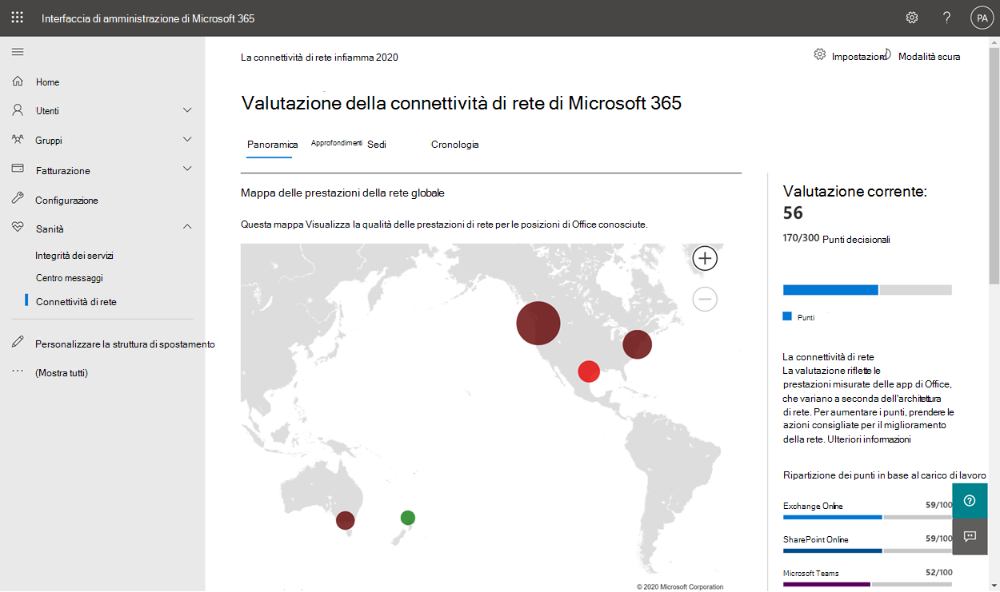
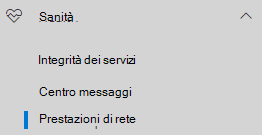
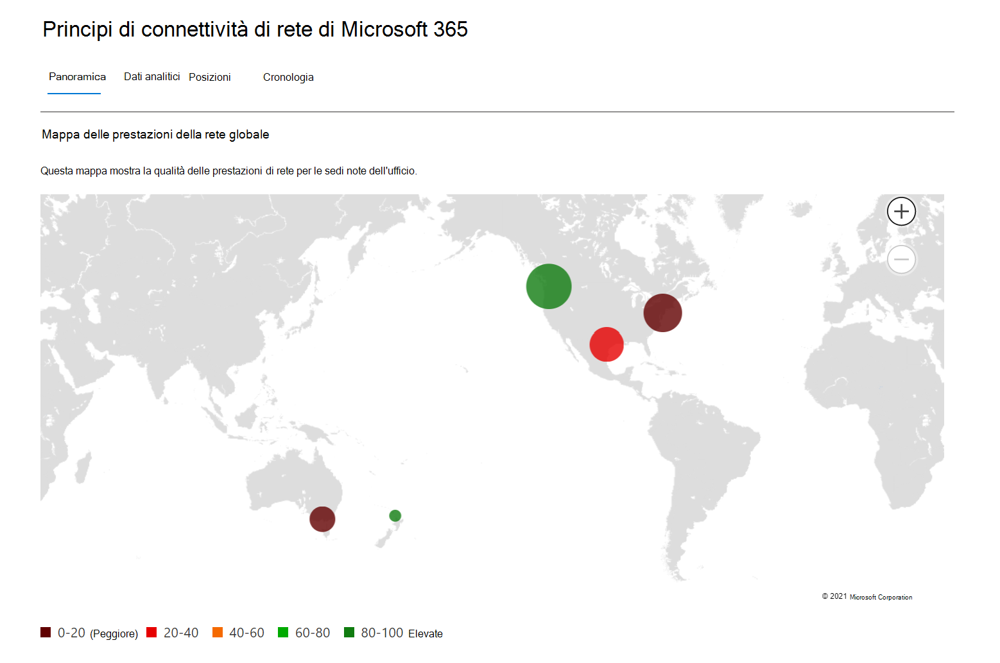
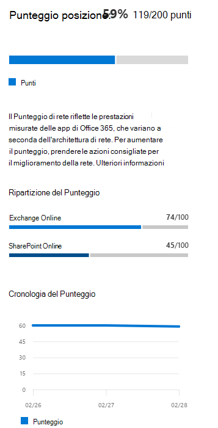
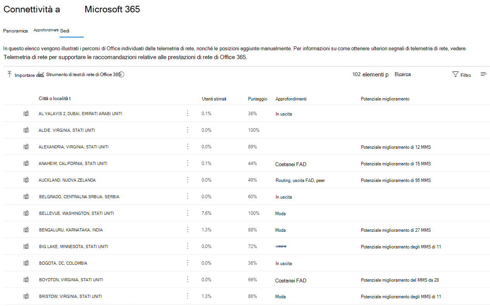
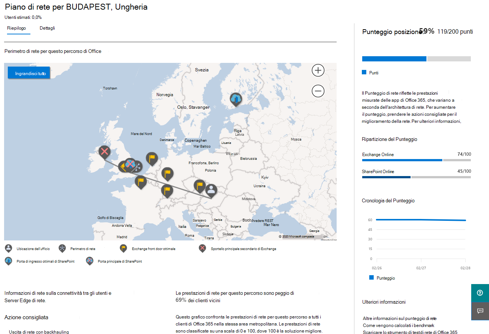
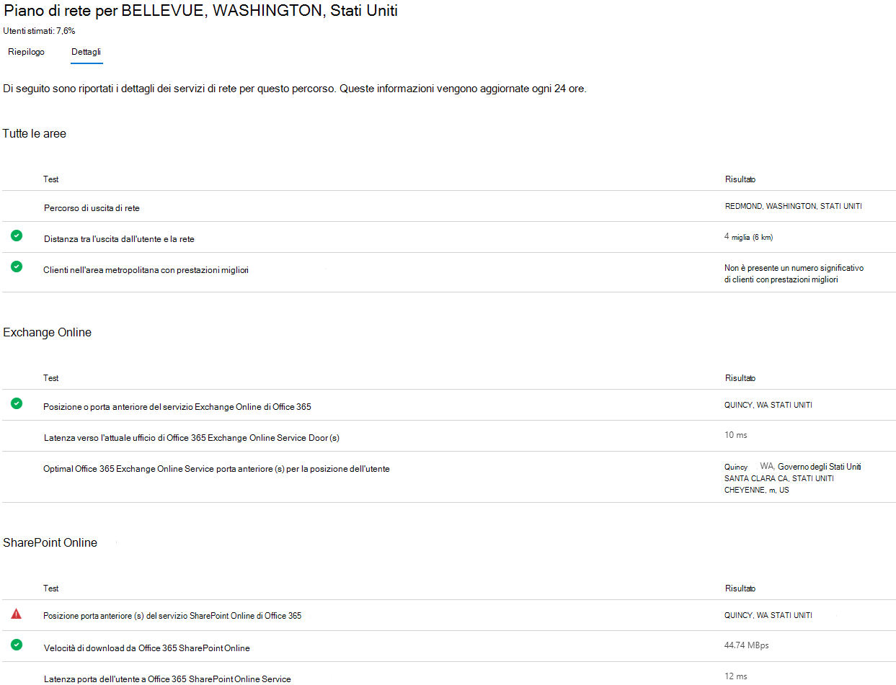
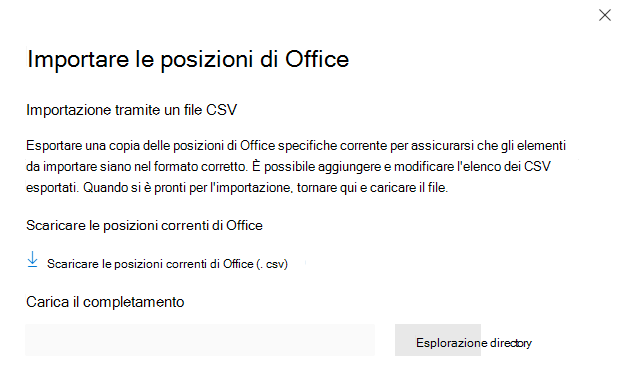
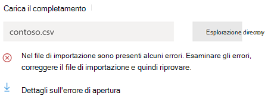
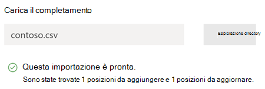

# Connettività di rete nell'interfaccia di amministrazione di Microsoft 365 (anteprima)

L'interfaccia di amministrazione di Microsoft 365 ora include metriche di connettività di rete aggregate raccolte dal tenant di Microsoft 365 e disponibili per la visualizzazione solo da parte degli utenti amministrativi nel tenant.

> [!div class="mx-imgBorder"]
> 

**Le valutazioni di rete** **e le informazioni dettagliate** sulla rete vengono visualizzate nell'interfaccia di amministrazione di Microsoft 365 in **Health | Connettività**.

> [!div class="mx-imgBorder"]
> 

>[!NOTE]
>Lo strumento di test della connettività di rete supporta i tenant in WW Commercial e Germania, ma non GCC Moderate, GCC High, DoD o Cina.

Quando si passa per la prima volta alla pagina delle prestazioni di rete, viene visualizzato un riquadro di panoramica contenente una mappa delle prestazioni della rete globale, una valutazione della rete con ambito per l'intero tenant e un elenco dei problemi correnti. Dalla panoramica, è possibile eseguire il drill-down per visualizzare metriche e problemi specifici delle prestazioni di rete in base alla posizione. Per ulteriori informazioni, vedere [Panoramica delle prestazioni di rete nell'interfaccia di amministrazione di Microsoft 365.](#network-connectivity-overview-in-the-microsoft-365-admin-center)

Potrebbe essere richiesto di partecipare all'anteprima pubblica per questa funzionalità per conto dell'organizzazione. L'accettazione in genere avviene immediatamente e quindi verrà visualizzata la pagina connettività di rete. 

Quando si accede alla pagina connettività di rete, verrà visualizzato un riquadro di panoramica contenente una mappa delle prestazioni della rete globale, una valutazione della rete con ambito per l'intero tenant e un elenco dei problemi correnti. Per accedere a questa pagina, è necessario essere un amministratore dell'organizzazione in Microsoft 365. Il ruolo amministrativo Lettore report avrà accesso in lettura a queste informazioni. Per configurare i percorsi e altri elementi della connettività di rete, un amministratore deve far parte di un ruolo di amministratore del server, ad esempio il ruolo di amministratore del supporto del servizio. Dalla panoramica, è possibile eseguire il drill-down per visualizzare metriche e problemi specifici delle prestazioni di rete in base alla posizione. Per ulteriori informazioni, vedere Panoramica della connettività di rete nell'interfaccia di amministrazione di [Microsoft 365.](#network-connectivity-overview-in-the-microsoft-365-admin-center)

## Prerequisiti per la visualizzazione delle valutazioni della connettività di rete

To get started, turn on your location opt-in setting to automatically collect data from devices using Windows Location Services, go to your Locations list to add or upload location data, or run the Microsoft 365 network connectivity test from your office locations. Sebbene sia possibile valutare la connettività di rete all'interno dell'organizzazione, sarà necessario apportare eventuali miglioramenti alla progettazione della rete per posizioni specifiche dell'ufficio. Le informazioni sulla connettività di rete vengono fornite per ogni posizione dell'ufficio dopo aver determinato tali posizioni. Esistono tre opzioni per ottenere valutazioni di rete dalle posizioni dell'ufficio:

### 1. Abilitare i servizi di posizione di Windows

Per questa opzione, è necessario che in ogni sede sia in esecuzione almeno due computer che supportino i prerequisiti. La versione di OneDrive per Windows deve essere aggiornata e installata in ogni computer. Per altre informazioni sulle versioni di OneDrive, vedi le note [sulla versione di OneDrive.](https://support.office.com/article/onedrive-release-notes-845dcf18-f921-435e-bf28-4e24b95e5fc0) Le misurazioni di rete sono pianificate per essere aggiunte in altre applicazioni client di Office 365 nel prossimo futuro.

Il servizio di posizione di Windows deve essere autorizzato nei computer. Puoi testarlo eseguendo l'app **Mappe** e individuando te stesso. Può essere abilitato in un singolo computer con **Impostazioni | Privacy | Posizione** in cui deve essere _abilitata l'impostazione Consenti alle_ app di accedere alla posizione. Il consenso dei servizi di posizione di Windows può essere distribuito ai PC usando MDM o Criteri di gruppo con l'impostazione _LetAppsAccessLocation._

Con questo metodo non è necessario aggiungere posizioni nell'interfaccia di amministrazione perché vengono identificate automaticamente in base alla risoluzione della città. Non è possibile visualizzare più sedi di uffici all'interno di una città utilizzando i servizi di posizione di Windows. Le informazioni sulla posizione vengono inoltre arrotondate ai 300 metri per 300 metri più vicini prima di essere caricate in modo che non sia possibile accedere a informazioni sulla posizione più precise.

I computer devono avere Wi-Fi rete anziché un cavo ethernet. I computer con un cavo ethernet non dispongono di informazioni accurate sulla posizione.

I campioni di misurazione e le posizioni degli uffici dovrebbero iniziare a comparire 24 ore dopo aver soddisfatto questi prerequisiti.

### 2. Aggiungere posizioni e fornire informazioni sulla subnet LAN

Per questa opzione, non sono necessari né i servizi di Wi-Fi Windows. La versione di OneDrive per Windows deve essere aggiornata e installata in ogni computer nel percorso.

È inoltre necessario aggiungere percorsi nella pagina Connettività di rete dell'interfaccia di amministrazione o importare i percorsi da un file CSV. Le posizioni aggiunte devono includere le informazioni sulla subnet LAN dell'ufficio.

Poiché si aggiungono le posizioni, è possibile definire più uffici all'interno di una città.

Tutte le misurazioni di test dei computer client includono le informazioni sulla subnet LAN, correlate ai dettagli sulla posizione dell'ufficio immessi. I campioni di misurazione e le posizioni degli uffici dovrebbero iniziare a comparire 24 ore dopo aver soddisfatto questi prerequisiti.

### 3. Raccogliere manualmente i report di test con lo strumento di test della connettività di rete di Microsoft 365

Per questa opzione, è necessario identificare una persona in ogni posizione. Chiedere loro di passare al test di connettività di rete di [Microsoft 365](https://connectivity.office.com) in un computer Windows in cui dispongono delle autorizzazioni amministrative. Nel sito Web, devono accedere al proprio account di Office 365 per la stessa organizzazione che si desidera visualizzare i risultati. Fare quindi clic su **Esegui test**. Durante il test è disponibile un file EXE di test della connettività scaricato. Devono aprire ed eseguire anche questo. Una volta completati i test, il risultato del test viene caricato in Office 365.

I report di test sono collegati a una posizione se sono stati aggiunti con informazioni sulla subnet LAN, altrimenti vengono visualizzati solo nella posizione della città.

I campioni di misurazione e le posizioni degli uffici dovrebbero iniziare a comparire 2-3 minuti dopo il completamento di un report di test. Per ulteriori informazioni, vedere Test della connettività di rete [di Microsoft 365 (anteprima)](office-365-network-mac-perf-onboarding-tool.md).

## Come si usano queste informazioni?

**Le informazioni dettagliate** sulla rete, i relativi consigli sulle prestazioni e le valutazioni di rete sono utili per progettare i perimetri di rete per le posizioni dell'ufficio. Ogni approfondimento fornisce informazioni dettagliate sulle caratteristiche delle prestazioni per un problema comune specifico per ogni posizione geografica in cui gli utenti accedono al tenant. **I consigli sulle** prestazioni per ogni approfondimento sulla rete offrono modifiche specifiche alla progettazione dell'architettura di rete che è possibile apportare per migliorare l'esperienza utente relativa alla connettività di rete di Microsoft 365. La valutazione della rete mostra l'impatto della connettività di rete sull'esperienza utente, consentendo il confronto delle diverse connessioni di rete della posizione utente.

**Le valutazioni di rete** trasformano un aggregato di molte metriche delle prestazioni di rete in uno snapshot dell'integrità della rete aziendale, rappresentato da un valore in punti compreso tra 0 e 100. Le valutazioni di rete hanno come ambito l'intero tenant e per ogni posizione geografica da cui gli utenti si connettono al tenant, offrendo agli amministratori di Microsoft 365 un modo semplice per comprendere immediatamente l'integrità della rete aziendale e analizzare rapidamente un report dettagliato per qualsiasi sede globale.

Le aziende complesse con più sedi e architetture perimetrali di rete non banali possono trarre vantaggio da queste informazioni durante l'onboarding iniziale a Microsoft 365 o per correggere i problemi di prestazioni di rete rilevati con l'aumento dell'utilizzo. Questa operazione in genere non è necessaria per le piccole aziende che utilizzano Microsoft 365 o per le aziende che dispongono già di connettività di rete semplice e diretta. Si prevede che le aziende con più di 500 utenti e più sedi di uffici trarranno il massimo vantaggio.

>[!IMPORTANT]
>Informazioni dettagliate sulla rete, consigli sulle prestazioni e valutazioni nell'interfaccia di amministrazione di Microsoft 365 è attualmente in stato di anteprima ed è disponibile solo per i tenant di Microsoft 365 registrati nel programma di anteprima delle funzionalità.

## Problemi di connettività di rete aziendale

> [!div class="mx-imgBorder"]
> 

Molte aziende hanno configurazioni perimetrali di rete che sono aumentate nel tempo e sono progettate principalmente per supportare l'accesso ai siti Web Internet dei dipendenti in cui la maggior parte dei siti Web non è nota in anticipo e non è attendibile. L'attenzione prevalente e necessaria è evitare attacchi di malware e di pesca da questi siti Web sconosciuti. Questa strategia di configurazione di rete, sebbene utile per motivi di sicurezza, può portare a un peggioramento delle prestazioni degli utenti e dell'esperienza utente di Microsoft 365.

## Come possiamo risolvere queste sfide

Le aziende possono migliorare l'esperienza utente generale e proteggere l'ambiente seguendo i principi di connettività di [Office 365](./microsoft-365-network-connectivity-principles.md) e usando la funzionalità di connettività di rete dell'interfaccia di amministrazione di Microsoft 365. Nella maggior parte dei casi, seguire questi principi generali avrà un impatto positivo significativo sulla latenza degli utenti finali, sull'affidabilità del servizio e sulle prestazioni globali di Microsoft 365.

A Microsoft viene talvolta richiesto di analizzare i problemi relativi alle prestazioni di rete con Microsoft 365 per i clienti di grandi aziende, che spesso hanno una causa principale correlata all'infrastruttura perimetrale di rete dei clienti. Quando viene rilevata una causa radice comune di un problema del perimetro di rete del cliente, si cerca di identificare semplici misurazioni di test che lo identificano. Un test con una soglia di misurazione che identifica un problema specifico è utile perché possiamo testare la stessa misura in qualsiasi posizione, stabilire se la causa radice è presente e condividerla come informazioni approfondite sulla rete con l'amministratore.

Alcune informazioni dettagliate sulla rete indicherà semplicemente un problema che richiede ulteriori indagini. Un'analisi della rete in cui sono disponibili test sufficienti per mostrare un'azione di correzione specifica per correggere la causa radice è elencata come **azione consigliata.** Questi consigli, basati su metriche in tempo reale che rivelano valori che non rientrano in una soglia predeterminata, sono molto più utili dei consigli generali sulle procedure consigliate, poiché sono specifici per l'ambiente e mostreranno il miglioramento effettivo dopo aver apportato le modifiche consigliate.

## Panoramica della connettività di rete nell'interfaccia di amministrazione di Microsoft 365

Microsoft ha misurazioni di rete esistenti da diversi client Desktop e Web di Office che supportano il funzionamento di Microsoft 365. Queste misurazioni vengono ora utilizzate per fornire informazioni dettagliate sulla progettazione dell'architettura di rete e una valutazione della rete mostrate nella pagina **Connettività** di rete nell'interfaccia di amministrazione di Microsoft 365.

Per impostazione predefinita, le informazioni approssimative sulla posizione associate alle misurazioni di rete identificano la città in cui si trovano i dispositivi client. La valutazione della rete in ogni posizione viene visualizzata con il colore e il numero relativo di utenti in ogni posizione è rappresentato dalle dimensioni del cerchio.

> [!div class="mx-imgBorder"]
> 

La pagina di panoramica mostra anche la valutazione della rete per il cliente come media ponderata in tutte le sedi degli uffici.

> [!div class="mx-imgBorder"]
> 

È possibile visualizzare una visualizzazione tabella delle posizioni in cui possono essere filtrate, ordinate e modificate nella scheda Posizioni. Le posizioni con suggerimenti specifici possono includere anche un potenziale miglioramento della latenza stimato. Questo viene calcolato prendendo la latenza mediana degli utenti dell'organizzazione nella posizione e sottraendo la latenza mediana per tutte le organizzazioni nella stessa città.

> [!div class="mx-imgBorder"]
> 

## Riepilogo e approfondimenti specifici sulle prestazioni della rete di posizione dell'ufficio

Se si seleziona una posizione dell'ufficio, verrà aperta una pagina di riepilogo specifica per la posizione in cui sono visualizzati i dettagli dell'uscita di rete identificata dalle misurazioni per la posizione dell'ufficio.

> [!div class="mx-imgBorder"]
> 

Una mappa della rete perimetrale per gli utenti dell'organizzazione nella posizione viene visualizzata con alcuni o tutti questi elementi:

- **Posizione di Office** - Posizione dell'ufficio per la pagina che si sta cercando
- **Perimetro di rete** - Posizione dell'indirizzo IP di origine per le connessioni dalla posizione dell'ufficio. Ciò dipende dall'accuratezza dei database delle località geo-IP
- **Porta anteriore del** servizio ottimale di Exchange - Una delle porte anteriori del servizio Exchange consigliate a cui gli utenti in questa sede devono connettersi
- **Porta d'ingresso sub-ottimale di Exchange** - Porta principale del servizio Exchange a cui sono connessi gli utenti, ma non consigliata
- **Porta anteriore del** servizio ottimale di SharePoint - Una delle porte anteriori del servizio SharePoint consigliate a cui gli utenti in questa sede devono connettersi
- **Porta anteriore del servizio sharePoint sub-ottimale** - Porta anteriore del servizio SharePoint a cui sono connessi gli utenti, ma non consigliata
- **Server resolver** ricorsivo DNS - Posizione da un database IP geografico del resolver ricorsivo DNS rilevato utilizzato per Exchange Online (se disponibile)
- **Server proxy** - Posizione da un database IP geografico del server proxy rilevato (se disponibile) 

La pagina di riepilogo della posizione dell'ufficio mostra inoltre la valutazione della rete della posizione, la cronologia di valutazione della rete, un confronto della valutazione di questa posizione con altri clienti nella stessa città e un elenco di approfondimenti e consigli specifici che è possibile intraprendere per migliorare le prestazioni e l'affidabilità della rete.

I confronti tra i clienti nella stessa città si basano sull'aspettativa che tutti i clienti hanno uguale accesso ai provider di servizi di rete, all'infrastruttura di telecomunicazione e ai punti di presenza della rete Microsoft nelle vicinanze.

Nella scheda dettagli della pagina della posizione dell'ufficio vengono mostrati i risultati di misurazione specifici utilizzati per ottenere informazioni dettagliate, suggerimenti e la valutazione della rete. Questo viene fornito in modo che i tecnici di rete possano convalidare i suggerimenti e i fattori in qualsiasi vincolo o specifica nel proprio ambiente.

> [!div class="mx-imgBorder"]
> 

## Condivisione dei dati di valutazione della rete con Microsoft

Per impostazione predefinita, le valutazioni di rete per l'organizzazione e le informazioni dettagliate sulla rete sono condivise con i dipendenti Microsoft. Questo non include i dati personali del personale, ma solo le metriche specifiche di valutazione della rete e le informazioni dettagliate di rete mostrate nell'interfaccia di amministrazione per le posizioni dell'ufficio. Inoltre, non include i nomi delle località o gli indirizzi dell'ufficio, quindi è necessario indicare la città e l'ID di supporto dell'ufficio che si desidera discutere. Se questa opzione è disattivata, i tecnici Microsoft con cui si sta discutendo la connettività di rete non possono visualizzare queste informazioni. L'abilitazione di questa impostazione condivide solo i dati futuri a partire dal giorno successivo all'abilitazione.

## Csv Import for LAN subnet office locations

Per l'identificazione dell'ufficio della subnet LAN, è necessario aggiungere ogni posizione in anticipo. Anziché aggiungere singole posizioni di ufficio nella **scheda Posizioni,** è possibile importarle da un file CSV. È possibile ottenere questi dati da altre posizioni in cui sono stati archiviati, ad esempio il dashboard qualità delle chiamate o Siti e servizi di Active Directory

Nel file CSV la posizione di una città individuata viene visualizzata nella colonna userEntered come vuota e la posizione dell'ufficio aggiunta manualmente viene visualizzata come 1.

1. Nella finestra principale _Connettività a Microsoft 365_ fare clic sulla **scheda** Posizioni.

1. Fai clic **sul pulsante** Importa appena sopra l'elenco delle posizioni. Verrà **visualizzato il** riquadro a comparsa Importa posizioni ufficio.

   > [!div class="mx-imgBorder"]
   > 

1. Fare clic **sul collegamento Download current office locations (.csv)** per esportare l'elenco delle posizioni correnti in un file CSV e salvarlo nel disco rigido locale. In questo modo verrà fornito un file CSV formattato correttamente con intestazioni di colonna a cui è possibile aggiungere posizioni. È possibile lasciare le posizioni esportate esistenti così come sono; non verranno duplicati quando si importa il file CSV aggiornato. Se si desidera modificare l'indirizzo di una posizione esistente, questa verrà aggiornata quando si importa il file CSV. Non è possibile modificare l'indirizzo di una città individuata.

1. Apri il file CSV e aggiungi le posizioni compilando i campi seguenti in una nuova riga per ogni posizione che vuoi aggiungere. Lasciare vuoti tutti gli altri campi. i valori immessi in altri campi verranno ignorati.

   1. **userEntered** (obbligatorio): deve essere 1 per una nuova sede della subnet LAN
   1. **Indirizzo** (obbligatorio): l'indirizzo fisico dell'ufficio
   1. **Latitude** (facoltativo): popolato dalla ricerca di Bing maps dell'indirizzo se vuoto
   1. **Longitudine** (facoltativo): popolata dalla ricerca di Bing maps dell'indirizzo se vuota
   1. **Intervalli di indirizzi IP** in uscita da 1 a 5 (facoltativo): per ogni intervallo immettere il nome del circuito seguito da un elenco separato da spazi di indirizzi CIDR IPv4 o IPv6 validi. Questi valori vengono utilizzati per differenziare più sedi di uffici in cui si utilizzano gli stessi indirizzi IP della subnet LAN. Gli intervalli di indirizzi IP in uscita devono essere tutti di /24 e /24 non è incluso nell'input.
   1. **LanIps** (obbligatorio): elencare gli intervalli di subnet LAN in uso in questa sede. Gli ID subnet LAN devono avere una dimensione di rete CIDR in cui le dimensioni della rete possono essere comprese tra /8 e /29. Più intervalli di subnet LAN possono essere separati da una virgola o da un punto e virgola.
   
1. Dopo aver aggiunto le posizioni dell'ufficio e salvato il file, fare clic sul pulsante **Sfoglia** accanto al campo **Carica** il file completato e selezionare il file CSV salvato.

1. Il file verrà convalidato automaticamente. Se sono presenti errori di convalida, verrà visualizzato il messaggio di errore Sono presenti _alcuni errori nel file di importazione. Esaminare gli errori, correggere il file di importazione e quindi riprovare._ Fare clic sul collegamento **Apri dettagli errore** per un elenco di errori di convalida di campi specifici.

   > [!div class="mx-imgBorder"]
   > 

1. Se il file non contiene errori, verrà visualizzato il messaggio _Il rapporto è pronto. Trovati percorsi x da aggiungere e x percorsi da aggiornare._ Fare clic **sul pulsante** Importa per caricare il file CSV.

   > [!div class="mx-imgBorder"]
   > 

## Domande frequenti

### Che cos'è una porta d'ingresso del servizio Microsoft 365?

La porta principale del servizio Microsoft 365 è un punto di ingresso nella rete globale di Microsoft in cui i client e i servizi di Office terminano la connessione di rete. Per una connessione di rete ottimale a Microsoft 365, è consigliabile che la connessione di rete venga terminata nella porta principale di Microsoft 365 più vicina.

>[!NOTE]
>La porta d'ingresso del servizio Microsoft 365 non ha alcuna relazione diretta con il prodotto Azure Front Door Service disponibile nel marketplace di Azure.

### Che cos'è una porta d'ingresso ottimale del servizio Microsoft 365?

Una porta d'ingresso ottimale del servizio Microsoft 365 è quella più vicina all'uscita della rete, in genere nell'area della città o della metropolitana. Usa lo strumento di test della connettività [di Microsoft 365 (anteprima)](office-365-network-mac-perf-onboarding-tool.md) per determinare la posizione della porta d'ingresso del servizio Microsoft 365 in uso e la porta anteriore del servizio ottimale. Se lo strumento determina che la porta d'ingresso in uso è ottimale, ci si connette in modo ottimale alla rete globale di Microsoft.

### Che cos'è una posizione di uscita da Internet?

La posizione di uscita da Internet è la posizione in cui il traffico di rete esce dalla rete aziendale e si connette a Internet. Questo è anche identificato come la posizione in cui si dispone di un dispositivo NAT (Network Address Translation) e in genere in cui ci si connette con un provider di servizi Internet (ISP). Se viene visualizzata una lunga distanza tra la posizione e la posizione di uscita da Internet, questo potrebbe indicare un backhaul WAN significativo.

### Quale licenza è necessaria per questa funzionalità?

È necessaria una licenza che consente l'accesso all'interfaccia di amministrazione di Microsoft 365.

## Argomenti correlati

[Informazioni dettagliate sulla rete di Microsoft 365 (anteprima)](office-365-network-mac-perf-insights.md)

[Valutazione della rete di Microsoft 365 (anteprima)](office-365-network-mac-perf-score.md)

[Strumento di test della connettività di Microsoft 365 (anteprima)](office-365-network-mac-perf-onboarding-tool.md)

[Servizi percorso connettività di rete Microsoft 365 (anteprima)](office-365-network-mac-location-services.md)