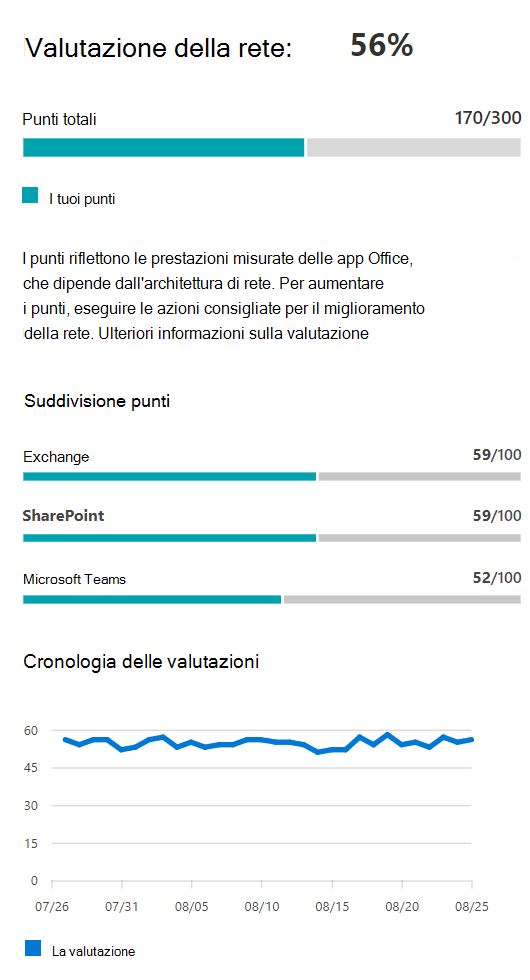
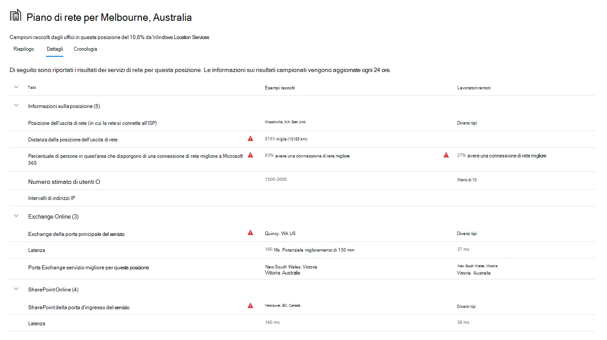

# Connettività di rete nell'interfaccia di amministrazione di Microsoft 365 (anteprima)

L'interfaccia di amministrazione di Microsoft 365 ora include metriche di connettività di rete aggregate raccolte dal tenant di Microsoft 365 e disponibili per la visualizzazione solo da parte degli utenti amministrativi nel tenant.

> [!div class="mx-imgBorder"]
> 

**Le valutazioni di rete** e **le informazioni dettagliate** sulla rete vengono visualizzate nell'interfaccia di amministrazione di Microsoft 365 in **Health | Connettività**.

> [!div class="mx-imgBorder"]
> 

>[!NOTE]
>Lo strumento di test della connettività di rete supporta i tenant in WW Commercial e Germania, ma non GCC Moderate, GCC High, DoD o Cina.

Quando si passa per la prima volta alla pagina delle prestazioni di rete, viene visualizzato un riquadro di panoramica contenente una mappa delle prestazioni della rete globale, una valutazione della rete con ambito per l'intero tenant e un elenco dei problemi correnti. Dalla panoramica, è possibile eseguire il drill-down per visualizzare metriche specifiche delle prestazioni di rete e problemi in base alla posizione. Per altre informazioni, vedere [Panoramica delle prestazioni di rete nell'interfaccia di amministrazione di Microsoft 365.](#network-connectivity-overview-in-the-microsoft-365-admin-center)

Potrebbe essere richiesto di partecipare all'anteprima pubblica per questa funzionalità per conto dell'organizzazione. L'accettazione in genere avviene immediatamente e viene visualizzata la pagina connettività di rete. 

Quando si accede alla pagina connettività di rete, viene visualizzato un riquadro di panoramica contenente una mappa delle prestazioni della rete globale, una valutazione della rete con ambito per l'intero tenant e un elenco dei problemi correnti. Per accedere a questa pagina, è necessario essere un amministratore dell'organizzazione in Microsoft 365. Il ruolo amministrativo Lettore di report avrà accesso in lettura a queste informazioni. Per configurare i percorsi e altri elementi della connettività di rete, un amministratore deve far parte di un ruolo di amministratore del server, ad esempio il ruolo di amministratore supporto del servizio. Dalla panoramica, è possibile eseguire il drill-down per visualizzare metriche specifiche delle prestazioni di rete e problemi in base alla posizione. Per altre informazioni, vedere Panoramica [della connettività di rete nell'interfaccia di amministrazione di Microsoft 365.](#network-connectivity-overview-in-the-microsoft-365-admin-center)

## Prerequisiti per la visualizzazione delle valutazioni della connettività di rete

To get started, turn on your location opt-in setting to automatically collect data from devices using Windows Location Services, go to your Locations list to add or upload location data, or run the Microsoft 365 network connectivity test from your office locations. Anche se la connettività di rete può essere valutata all'interno dell'organizzazione, sarà necessario apportare eventuali miglioramenti alla progettazione della rete per posizioni specifiche dell'ufficio. Dopo aver determinato tali posizioni, vengono fornite informazioni sulla connettività di rete per ogni sede. Sono disponibili tre opzioni per ottenere valutazioni di rete dalle posizioni dell'ufficio:

### 1. Abilitare i servizi di posizione di Windows

Per questa opzione, è necessario disporre di almeno due computer in esecuzione in ogni sede che supportano i prerequisiti. OneDrive per Windows deve essere aggiornato e installato in ogni computer. Per altre informazioni sulle versioni di OneDrive, vedere le note [sulla versione di OneDrive.](https://support.office.com/article/onedrive-release-notes-845dcf18-f921-435e-bf28-4e24b95e5fc0) Le misurazioni di rete verranno aggiunte in altre applicazioni client di Office 365 nel prossimo futuro.

Il servizio di posizione di Windows deve essere autorizzato nei computer. Puoi testarlo eseguendo l'app **Mappe** e individuandoti. Può essere abilitato in un singolo computer con impostazioni **| Privacy | Posizione** in cui l'impostazione _Consenti alle app di accedere alla posizione_ deve essere abilitata. Il consenso di Servizi percorso Windows può essere distribuito ai PC con MDM o Criteri di gruppo con l'impostazione _LetAppsAccessLocation._

Non è necessario aggiungere posizioni nell'interfaccia di amministrazione con questo metodo perché vengono identificate automaticamente in base alla risoluzione della città. Non è possibile visualizzare più sedi all'interno di una città tramite i servizi di posizione di Windows. Le informazioni sulla posizione vengono inoltre arrotondate ai 300 metri per 300 metri più vicini prima di essere caricate, in modo che non sia possibile accedere a informazioni più precise sulla posizione.

I computer devono avere Wi-Fi rete anziché un cavo ethernet. I computer con un cavo ethernet non dispongono di informazioni accurate sulla posizione.

I campioni di misurazione e le posizioni degli uffici dovrebbero iniziare a comparire 24 ore dopo che questi prerequisiti sono stati soddisfatti.

### 2. Aggiungere posizioni e fornire informazioni sulla subnet LAN

Per questa opzione, non sono necessari né i servizi di Wi-Fi Windows. La versione di OneDrive per Windows deve essere aggiornata e installata in ogni computer nel percorso.

È inoltre necessario aggiungere percorsi nella pagina connettività di rete dell'interfaccia di amministrazione o importare i percorsi da un file CSV. Le posizioni aggiunte devono includere le informazioni sulla subnet DELLAN dell'ufficio.

Poiché si aggiungono le posizioni, è possibile definire più uffici all'interno di una città.

Tutte le misurazioni di test dei computer client includono le informazioni sulla subnet LAN, correlate ai dettagli sulla posizione dell'ufficio immessi. I campioni di misurazione e le posizioni degli uffici dovrebbero iniziare a comparire 24 ore dopo che questi prerequisiti sono stati soddisfatti.

### 3. Raccogliere manualmente i report di test con lo strumento di test della connettività di rete di Microsoft 365

Per questa opzione, è necessario identificare una persona in ogni posizione. Chiedere loro di passare al test di connettività di rete di [Microsoft 365](https://connectivity.office.com) in un computer Windows in cui dispongono di autorizzazioni amministrative. Nel sito Web, devono accedere al proprio account di Office 365 per la stessa organizzazione che si desidera visualizzare i risultati. Fare quindi clic su **Esegui test.** Durante il test è disponibile un file EXE di test della connettività scaricato. Devono aprire ed eseguire anche questa operazione. Una volta completati i test, il risultato del test viene caricato in Office 365.

I report di test sono collegati a una posizione se sono stati aggiunti con informazioni sulla subnet LAN, in caso contrario vengono visualizzati solo nella località della città.

I campioni di misurazione e le posizioni degli uffici dovrebbero iniziare a essere visualizzati 2-3 minuti dopo il completamento di un report di test. Per ulteriori informazioni, vedere Test della connettività di [rete di Microsoft 365 (anteprima).](office-365-network-mac-perf-onboarding-tool.md)

## Come si usano queste informazioni?

**Le informazioni dettagliate** sulla rete, i consigli relativi alle prestazioni e le valutazioni della rete sono utili per progettare i perimetri di rete per le sedi degli uffici. Ogni approfondimento fornisce informazioni dettagliate sulle caratteristiche delle prestazioni per un problema comune specifico per ogni posizione geografica in cui gli utenti accedono al tenant. **I consigli sulle prestazioni** per ogni approfondimento sulla rete offrono modifiche specifiche alla progettazione dell'architettura di rete che è possibile apportare per migliorare l'esperienza utente correlata alla connettività di rete di Microsoft 365. La valutazione della rete mostra in che modo la connettività di rete influisce sull'esperienza utente, consentendo il confronto delle diverse connessioni di rete della posizione utente.

**Le valutazioni di rete** trasformano un aggregato di molte metriche delle prestazioni di rete in uno snapshot dell'integrità della rete aziendale, rappresentato da un valore in punti compreso tra 0 e 100. Le valutazioni di rete hanno come ambito l'intero tenant e per ogni posizione geografica da cui gli utenti si connettono al tenant, fornendo agli amministratori di Microsoft 365 un modo semplice per comprendere immediatamente l'integrità della rete aziendale ed eseguire rapidamente il drill-down in un report dettagliato per qualsiasi sede globale.

Le aziende complesse con più sedi e architetture perimetrali di rete non semplici possono trarre vantaggio da queste informazioni durante l'onboarding iniziale in Microsoft 365 o per risolvere i problemi di prestazioni di rete rilevati con l'aumento dell'utilizzo. Questo non è in genere necessario per le piccole imprese che usano Microsoft 365 o per le aziende che hanno già una connettività di rete semplice e diretta. Le aziende con più di 500 utenti e più sedi degli uffici ne trarranno i più vantaggi.

>[!IMPORTANT]
>Le informazioni dettagliate sulla rete, i consigli sulle prestazioni e le valutazioni nell'interfaccia di amministrazione di Microsoft 365 sono attualmente in stato di anteprima ed è disponibile solo per i tenant di Microsoft 365 che sono stati registrati nel programma di anteprima delle funzionalità.

## Problemi di connettività di rete aziendale

> [!div class="mx-imgBorder"]
> 

Molte aziende dispongono di configurazioni perimetrali di rete che sono aumentate nel tempo e sono progettate principalmente per supportare l'accesso ai siti Web Internet dei dipendenti in cui la maggior parte dei siti Web non è nota in anticipo e non è attendibile. L'attenzione prevalsa e necessaria è evitare attacchi di malware e attacchi da questi siti Web sconosciuti. Questa strategia di configurazione della rete, sebbene utile per motivi di sicurezza, può comportare un peggioramento delle prestazioni degli utenti e dell'esperienza utente di Microsoft 365.

## Come possiamo risolvere queste sfide

Le aziende possono migliorare l'esperienza utente generale e proteggere l'ambiente seguendo i principi di connettività di [Office 365](https://aka.ms/pnc) e usando la funzionalità di connettività di rete dell'interfaccia di amministrazione di Microsoft 365. Nella maggior parte dei casi, seguire questi principi generali avrà un impatto positivo significativo sulla latenza degli utenti finali, sull'affidabilità dei servizi e sulle prestazioni complessive di Microsoft 365.

A Microsoft viene talvolta richiesto di analizzare i problemi di prestazioni di rete con Microsoft 365 per i clienti di grandi imprese, che spesso hanno una causa principale correlata all'infrastruttura perimetrale di rete dei clienti. Quando viene rilevata una causa principale comune di un problema di perimetro di rete del cliente, si cerca di identificare semplici misurazioni di test che lo identificano. Un test con una soglia di misurazione che identifica un problema specifico è utile perché è possibile testare la stessa misura in qualsiasi posizione, stabilire se la causa radice è presente e condividerla come informazioni approfondite sulla rete con l'amministratore.

Alcune informazioni dettagliate sulla rete indicherà semplicemente un problema che richiede ulteriori indagini. Una panoramica della rete in cui sono disponibili test sufficienti per mostrare un'azione di correzione specifica per correggere la causa radice è elencata come **azione consigliata.** Queste raccomandazioni, basate su metriche in tempo reale che rivelano valori che non rientrano in una soglia predeterminata, sono molto più utili delle procedure consigliate generali, poiché sono specifiche dell'ambiente e mostreranno il miglioramento effettivo dopo aver apportato le modifiche consigliate.

## Panoramica della connettività di rete nell'interfaccia di amministrazione di Microsoft 365

Microsoft dispone di misurazioni di rete esistenti da diversi client Web e desktop di Office che supportano il funzionamento di Microsoft 365. Queste misurazioni vengono ora utilizzate per fornire informazioni dettagliate sulla  progettazione dell'architettura di rete e una valutazione della rete mostrata nella pagina Connettività di rete nell'interfaccia di amministrazione di Microsoft 365.

Per impostazione predefinita, le informazioni approssimative sulla posizione associate alle misurazioni di rete identificano la città in cui si trovano i dispositivi client. La valutazione della rete in ogni posizione viene visualizzata con il colore e il numero relativo di utenti in ogni posizione è rappresentato dalle dimensioni del cerchio.

> [!div class="mx-imgBorder"]
> 

La pagina di panoramica mostra anche la valutazione della rete per il cliente come media ponderata in tutte le sedi degli uffici.

> [!div class="mx-imgBorder"]
> 

È possibile visualizzare una visualizzazione tabella delle posizioni in cui possono essere filtrate, ordinate e modificate nella scheda Posizioni. Le posizioni con consigli specifici possono includere anche un potenziale miglioramento della latenza stimato. Questo viene calcolato prendendo la latenza mediana degli utenti dell'organizzazione nella posizione e sottraendo la latenza mediana per tutte le organizzazioni nella stessa città.

> [!div class="mx-imgBorder"]
> 

## Riepilogo e informazioni dettagliate sulle prestazioni della rete per la posizione specifica dell'ufficio

Se si seleziona la posizione di un ufficio, verrà visualizzata una pagina di riepilogo specifica della posizione in cui sono visualizzati i dettagli dell'uscita di rete identificata dalle misurazioni relative alla posizione dell'ufficio.

> [!div class="mx-imgBorder"]
> 

Una mappa della rete perimetrale per gli utenti dell'organizzazione nella posizione viene visualizzata con alcuni o tutti questi elementi:

- **Sede dell'ufficio** - Posizione dell'ufficio per la pagina che si sta cercando
- **Perimetro di rete** - Posizione dell'indirizzo IP di origine per le connessioni dalla posizione dell'ufficio. Ciò dipende dall'accuratezza dei database delle località geo-IP
- **Porta anteriore del servizio Exchange** ottimale - Una delle porte anteriori del servizio Exchange consigliate a cui gli utenti in questa sede devono connettersi
- **Porta d'ingresso sub-ottimale** di Exchange - Porta d'ingresso del servizio Exchange a cui gli utenti sono connessi, ma non è consigliabile
- **Front door di servizio** ottimale di SharePoint - Una delle porte anteriori del servizio SharePoint consigliate a cui devono connettersi gli utenti in questa sede
- **Frontdoire del** servizio sharePoint sotto-ottimale - Porta d'ingresso di un servizio SharePoint a cui gli utenti sono connessi, ma non è consigliabile
- **Server resolver** ricorsivo DNS - Posizione da un database IP geografico del resolver ricorsivo DNS rilevato utilizzato per Exchange Online (se disponibile)
- **Il server proxy:** la posizione da un database IP geografico del server proxy rilevato (se disponibile) 

La pagina di riepilogo delle località dell'ufficio mostra inoltre la valutazione della rete della posizione, la cronologia di valutazione della rete, un confronto tra la valutazione di questa posizione e altri clienti nella stessa città e un elenco di approfondimenti e consigli specifici che è possibile intraprendere per migliorare le prestazioni e l'affidabilità della rete.

I confronti tra i clienti nella stessa città si basano sull'aspettativa che tutti i clienti hanno uguale accesso ai provider di servizi di rete, all'infrastruttura di telecomunicazione e ai punti di presenza della rete Microsoft nelle vicinanze.

La scheda dei dettagli nella pagina della sede dell'ufficio mostra i risultati delle misurazioni specifici utilizzati per ottenere informazioni dettagliate, consigli e la valutazione della rete. Questo viene fornito in modo che i tecnici di rete possano convalidare i consigli e i fattori in qualsiasi vincolo o specifica nel proprio ambiente.

> [!div class="mx-imgBorder"]
> 

## Importazione CSV per le posizioni degli uffici della subnet LAN

Per l'identificazione dell'ufficio della subnet LAN, è necessario aggiungere ogni posizione in anticipo. Anziché aggiungere singole posizioni di uffici nella **scheda Posizioni,** è possibile importarle da un file CSV. È possibile ottenere questi dati da altre posizioni in cui sono stati archiviati, ad esempio il dashboard sulla qualità delle chiamate o Siti e servizi di Active Directory

Nel file CSV la posizione di una città individuata viene visualizzata nella colonna userEntered come vuota e la posizione di un ufficio aggiunta manualmente viene visualizzata come 1.

1. Nella finestra principale _Connettività a Microsoft 365_ fare clic sulla **scheda** Posizioni.

1. Fai clic **sul pulsante** Importa appena sopra l'elenco delle posizioni. Verrà **visualizzato il riquadro** a comparsa Importa posizioni ufficio.

   > [!div class="mx-imgBorder"]
   > 

1. Fare clic sul collegamento Scarica percorsi **di Office correnti (.csv)** per esportare l'elenco dei percorsi correnti in un file CSV e salvarlo nel disco rigido locale. In questo modo verrà fornito un file CSV formattato correttamente con intestazioni di colonna a cui è possibile aggiungere posizioni. È possibile lasciare i percorsi esportati esistenti così come sono; non verranno duplicati quando si importa il file CSV aggiornato. Se si desidera modificare l'indirizzo di un percorso esistente, verrà aggiornato quando si importa il file CSV. Non è possibile modificare l'indirizzo di una città individuata.

1. Apri il file CSV e aggiungi le posizioni compilando i campi seguenti in una nuova riga per ogni posizione che vuoi aggiungere. Lasciare vuoti tutti gli altri campi. i valori immessi in altri campi verranno ignorati.

   1. **userEntered** (obbligatorio): deve essere 1 per una nuova sede della subnet LAN
   1. **Indirizzo** (obbligatorio): l'indirizzo fisico dell'ufficio
   1. **Latitude** (facoltativo): popolato dalla ricerca dell'indirizzo nelle mappe di Bing, se vuoto
   1. **Longitudine** (facoltativo): popolata dalla ricerca dell'indirizzo di Bing Maps se vuota
   1. **Egress IP Address ranges 1-5** (optional): for each range, enter the circuit name followed by a space separated list of valid IPv4 or IPv6 CIDR addresses. Questi valori vengono utilizzati per distinguere più sedi in cui si utilizzano gli stessi indirizzi IP della subnet LAN. Gli intervalli di indirizzi IP in uscita devono avere tutte una dimensione di rete di /24 e /24 non è incluso nell'input.
   1. **LanIps** (obbligatorio): elencare gli intervalli di subnet LAN in uso in questa sede. Gli ID subnet LAN devono avere una dimensione di rete CIDR in cui le dimensioni della rete possono essere comprese tra /8 e /29. Più intervalli di subnet LAN possono essere separati da una virgola o da un punto e virgola.
   
1. Dopo aver aggiunto le posizioni dell'ufficio  e salvato il  file, fare clic sul pulsante Sfoglia accanto al campo Carica il file CSV salvato.

1. Il file verrà convalidato automaticamente. Se sono presenti errori di convalida, verrà visualizzato il messaggio di errore Sono _presenti alcuni errori nel file di importazione. Esaminare gli errori, correggere il file di importazione e quindi riprovare._ Fare clic sul collegamento **Apri dettagli errore per** un elenco di errori di convalida di campi specifici.

   > [!div class="mx-imgBorder"]
   > 

1. Se non sono presenti errori nel file, verrà visualizzato il messaggio _Il rapporto è pronto. Sono stati trovati x percorsi da aggiungere e x posizioni da aggiornare._ Fare clic **sul** pulsante Importa per caricare il file CSV.

   > [!div class="mx-imgBorder"]
   > 

## Domande frequenti

### Che cos'è un front door del servizio Microsoft 365?

La porta d'ingresso del servizio Microsoft 365 è un punto di ingresso nella rete globale di Microsoft in cui i client e i servizi di Office terminano la connessione di rete. Per una connessione di rete ottimale a Microsoft 365, è consigliabile che la connessione di rete venga terminata nella porta principale di Microsoft 365 più vicina.

>[!NOTE]
>Microsoft 365 service front door has no direct relationship to the Azure Front Door Service product available in the Azure marketplace.

### Che cos'è un front door del servizio Microsoft 365 ottimale?

Un front door ottimale del servizio Microsoft 365 è quello più vicino all'uscita della rete, in genere nella città o nella zona della metropolitana. Usare lo strumento di test della connettività [di Microsoft 365 (anteprima)](office-365-network-mac-perf-onboarding-tool.md) per determinare la posizione della porta d'ingresso del servizio Microsoft 365 in uso e la porta anteriore del servizio ottimale. Se lo strumento determina che la porta d'ingresso in uso è ottimale, la connessione alla rete globale di Microsoft è ottimale.

### Che cos'è una posizione di uscita da Internet?

La posizione di uscita da Internet è la posizione in cui il traffico di rete esce dalla rete aziendale e si connette a Internet. Viene inoltre identificato come la posizione in cui si dispone di un dispositivo NAT (Network Address Translation) e in genere in cui ci si connette con un provider di servizi Internet (ISP). Se viene visualizzata una lunga distanza tra la posizione e la posizione di uscita da Internet, questo potrebbe indicare un backhaul WAN significativo.

## Argomenti correlati

[Informazioni dettagliate sulla rete di Microsoft 365 (anteprima)](office-365-network-mac-perf-insights.md)

[Valutazione della rete di Microsoft 365 (anteprima)](office-365-network-mac-perf-score.md)

[Strumento di test della connettività di Microsoft 365 (anteprima)](office-365-network-mac-perf-onboarding-tool.md)

[Microsoft 365 Network Connectivity Location Services (anteprima)](office-365-network-mac-location-services.md)
