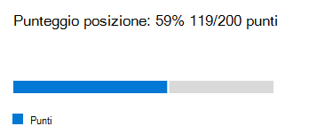

# Valutazione della rete Microsoft 365 (Preview)Microsoft 365 network assessment (preview)

Nella connettività di rete dell'interfaccia di amministrazione di Microsoft 365, le **valutazioni di rete** distillano un'aggregazione di molte metriche delle prestazioni di rete in un'istantanea dell'integrità del perimetro della rete aziendale, rappresentata da un valore a punti compreso tra 0-100.In the Microsoft 365 Admin Center's network connectivity, **network assessments** distill an aggregate of many network performance metrics into a snapshot of your enterprise network perimeter health, represented by a points value from 0 - 100. Una valutazione della rete indica quanto la progettazione della rete responsabile del cliente ha un impatto sull'esperienza utente di Office 365.A network assessment tells you how much the customer responsible network design is impacting Office 365 user experience. Le valutazioni di rete sono limitate all'intero tenant e per ogni posizione geografica da cui gli utenti si connettono al tenant, fornendo agli amministratori di Microsoft 365 un modo semplice per afferrare istantaneamente una Gestalt dell'integrità della rete dell'organizzazione e analizzarla rapidamente in una relazione dettagliata per qualsiasi posizione globale dell'ufficio.Network assessments are scoped to both the entire tenant and for each geographic location from which users connect to your tenant, providing Microsoft 365 administrators with an easy way to instantly grasp a gestalt of the enterprise's network health and quickly drill down into a detailed report for any global office location.

Il valore dei punti di valutazione della rete è una media della latenza TCP, della velocità di download e delle metriche di qualità della connessione UDP compilate una volta al giorno.The network assessment points value is an average of TCP latency, download speed and UDP connection quality metrics compiled once a day. Le metriche delle prestazioni per le reti di proprietà di Microsoft sono escluse da queste misure per garantire che i risultati della valutazione siano inequivocabili e specifici per la rete aziendale.Performance metrics for Microsoft-owned networks are excluded from these measurements to ensure that assessment results are unambiguous and specific to the corporate network.

Un valore di valutazione della rete molto basso suggerisce che i client Microsoft 365 avranno problemi significativi per la connessione al tenant o per il mantenimento di un'esperienza utente reattiva, mentre un valore elevato indica una rete adeguatamente configurata con alcuni problemi di prestazioni in esecuzione.A very low network assessment value suggests that Microsoft 365 clients will have significant problems connecting to the tenant or maintaining a responsive user experience, while a high value indicates a properly configured network with few ongoing performance issues. Un valore pari a 80% rappresenta una linea di base sana in cui non si dovrebbe pretendere di ricevere reclami da un utente regolare sulla connettività di Microsoft 365 o la risposta a causa delle prestazioni di rete.A value of 80% represents a healthy baseline where you should not expect to receive regular user complaints about Microsoft 365 connectivity or responsiveness due to network performance. Quando vengono apportati miglioramenti della connettività di rete iterativa, questo valore aumenterà insieme all'esperienza utente.As iterative network connectivity improvements are made, this value will increase along with user experience.

| Valutazione della reteNetwork assessment | Esperienza utente previstaExpected user experience |
| :----------------- | :----------------------- |
| 100100                | ElevateBest                     |
| 8080                 | Soddisfa le raccomandazioniMeets recommendations    |
| 6060                 | AccettabileAcceptable               |
| 4040                 | Gli utenti possono riscontrare problemiUsers may experience issues |
| 2020                 | Gli utenti possono lamentarsiUsers may complain       |
| 00                  | Problemi di rete un argomento comune di discussioneNetwork problems a common topic of discussion |

>[!IMPORTANT]
>Insights di rete, raccomandazioni sulle prestazioni e valutazioni nell'interfaccia di amministrazione di Microsoft 365 è attualmente in stato di anteprima ed è disponibile solo per i tenant di Microsoft 365 che sono stati registrati nel programma di anteprima delle funzionalità.Network insights, performance recommendations and assessments in the Microsoft 365 Admin Center is currently in preview status, and is only available for Microsoft 365 tenants that have been enrolled in the feature preview program.

## Pannello di valutazione della reteNetwork assessment panel

Ogni valutazione di rete, se ambito del tenant o di una specifica posizione di Office, Visualizza un riquadro con i dettagli relativi alla valutazione.Each network assessment, whether scoped to the tenant or to a specific office location, shows a panel with details about the assessment. In questo riquadro viene visualizzato un grafico a barre della valutazione, sia in percentuale che come punti totali per ogni carico di lavoro del componente, compresi solo i carichi di lavoro in cui sono stati ricevuti i dati di misurazione.This panel shows a bar chart of the assessment both as a percentage and as the total points for each component workload including only workloads where measurement data was received. Per una valutazione della rete delle posizioni di Office, viene mostrato anche un confronto con la percentuale di clienti di Microsoft 365 in ognuno dei cinque quintiles che hanno riportato dati nella stessa città del percorso di Office.For an office location network assessment, we also show a comparison to the percent of Microsoft 365 customers in each of five quintiles that reported data in the same city as your office location.

La **ripartizione di valutazione** nel pannello Visualizza la valutazione per ognuno dei carichi di lavoro del componente.The **Assessment breakdown** in the panel shows the assessment for each of the component workloads.

La **cronologia di valutazione** indica gli ultimi 30 giorni della valutazione e del benchmark.The **Assessment history** shows the past 30 days of the assessment and the benchmark. È inoltre possibile segnalare la cronologia delle metriche per qualsiasi percorso di Office per un massimo di due anni utilizzando la scheda cronologia. La scheda cronologia consente di selezionare gli attributi da segnalare e scegliendo un intervallo di tempo dei rapporti è possibile evidenziare l'impatto di un progetto di aggiornamento della rete e vedere il miglioramento della valutazione della rete.You can also report on the metrics history for any office location for up to two years using the history tab. The history tab allows you to select your attributes to report on and by choosing a report timeframe you can highlight the impact of a network update project and see the improvement to your network assessment.

## Valutazioni della rete tenant e valutazioni della rete delle posizioni di OfficeTenant network assessments and office location network assessments

Una valutazione della rete misura la progettazione del perimetro di rete di una posizione di Office alla rete di Microsoft.A network assessment measures the design of the network perimeter of an office location to Microsoft's network. I miglioramenti apportati al perimetro della rete sono migliori in ogni posizione dell'ufficio.Improvements to the network perimeter is best done at each office location.

Viene mostrato un valore di valutazione della rete per l'intero tenant Microsoft 365 nella pagina Panoramica delle prestazioni di rete, che corrisponde a una media ponderata delle valutazioni di rete per tutte le posizioni di Office.We show a network assessment value for the whole Microsoft 365 tenant on the network performance overview page which is a weighted average of the network assessments for all office locations. È inoltre disponibile un valore di valutazione della rete specifico per ogni posizione di Office rilevata nella pagina di riepilogo di tale percorso.There is also a specific network assessment value for each detected office location on that location's summary page.

## Exchange OnlineExchange Online

Per Exchange Online, la latenza TCP dal computer client al servizio Exchange porta anteriore viene misurata.For Exchange Online the TCP latency from the client machine to the Exchange service front door is measured. Questo può influire sulla distanza che la rete percorre nei clienti LAN e WAN.This can be impacted by the distance the network travels over the customers LAN and WAN. Può anche essere influenzato da dispositivi o servizi di intermediazione di rete che ritardano la connettività o causano il rimandato dei pacchetti.It can also be impacted by network intermediary devices or services which delay the connectivity or cause packets to be resent. Ed è influenzato da quanto è lontana la porta principale del servizio Exchange più vicino.And it is impacted by how far away the nearest Exchange service front door is. La mediana (nota anche come misura cinquantesimo percentile o P50) viene rilevata per tutte le misurazioni negli ultimi tre giorni.The median (also known as the 50th percentile or P50 measure) is taken for all measurements over the previous three days.

La valutazione di Exchange Online viene effettuata utilizzando la tabella seguente.The Exchange Online assessment is made using the following table. Qualsiasi numero di latenza TCP tra le soglie sono assegnati punti linearmente all'interno della banda.Any TCP latency number between the thresholds are assigned points linearly within the band.

| Latenza TCPTCP Latency   | PuntiPoints |
| :------------ | :----- |
| 10ms o meno10ms or less  | 100100    |
| 25ms25ms          | 8080     |
| 100 ms100ms         | 6060     |
| 200ms200ms         | 4040     |
| 300ms300ms         | 2020     |
| 350ms o più350ms or more | 00      |

## SharePoint OnlineSharePoint Online

Per SharePoint Online, la velocità di download disponibile per un utente per l'accesso a un documento da SharePoint o OneDrive viene misurata.For SharePoint Online the download speed available for a user to access a document from SharePoint or OneDrive is measured. Questo può essere influenzato dalla larghezza di banda disponibile nei circuiti di rete tra il computer client e la rete di Microsoft.This can be impacted by the bandwidth available on network circuits between the client machine and Microsoft's network. È inoltre spesso influenzato dalla congestione della rete che esiste nei colli di bottiglia nei dispositivi di rete complessi o nelle aree Wi-Fi con una copertura scadente.It is also often impacted by network congestion that exists in bottlenecks in complex network devices or in poor coverage Wi-Fi areas. La velocità di download viene misurata in megabyte al secondo, che corrisponde a circa un decimo dei circuiti con valori di megabit al secondo.The download speed is measured in megabytes per second which is approximately one tenth of a circuits rated megabits per second. L'unità MegaByte al secondo è utile perché è possibile vedere direttamente il file di dimensioni che è possibile scaricare in 1 secondo.The MegaByte per second unit is helpful because you can directly see what size file can be downloaded in 1 second. Il venticinquesimo percentile (noto anche come misura P25) viene eseguito per tutte le misurazioni nei tre giorni precedenti.The 25th percentile (also known as the P25 measure) is taken for all measurements over the previous three days. Questo venticinquesimo percentile aiuta a ridurre l'impatto del variare della congestione nel tempo.This 25th percentile helps reduce the impact of varying congestion over time.

La valutazione di SharePoint Online viene effettuata utilizzando la tabella seguente.The SharePoint Online assessment is made using the following table. Qualsiasi numero di velocità di download tra le soglie sono assegnati punti linearmente all'interno della banda.Any download speed number between the thresholds are assigned points linearly within the band.

| Velocità di downloadDownload speed | PuntiPoints |
| :------------- | :----- |
| 20MBps o più20MBps or more | 100100    |
| 14MBps14MBps         | 8080     |
| 8MBps8MBps          | 6060     |
| 4MBps4MBps          | 4040     |
| 2MBps2MBps          | 2020     |
| 0MBps0MBps          | 00      |

## Microsoft TeamsMicrosoft Teams

Per Microsoft teams la qualità della rete viene misurata come latenza UDP, jitter UDP e perdita di pacchetti UDP.For Microsoft Teams the Network quality is measured as UDP latency, UDP jitter, and UDP packet loss. UDP viene utilizzato per la connettività multimediale di chiamata e di audioconferenza per Microsoft teams.UDP is used for call and conferencing audio and video media connectivity for Microsoft Teams. Questo può influire sugli stessi fattori di latenza e velocità di download, oltre agli spazi di connettività nel supporto UDP di una rete, poiché UDP è configurato separatamente per il protocollo TCP più comune.This can be impacted by the same factors as for latency and download speed in addition to connectivity gaps in a network's UDP support since UDP is configured separately to the more common TCP protocol. La mediana (nota anche come misura cinquantesimo percentile o P50) viene rilevata per tutte le misurazioni negli ultimi tre giorni.The median (also known as the 50th percentile or P50 measure) is taken for all measurements over the previous three days. 

Si calcola un punteggio di opinione medio da queste misure UDP per una scala da 1 a 5.We calculate a mean opinion score from these UDP measurements for a scale from one to five. Viene quindi mappato alla scala di 0-100 punti per la valutazione della rete Microsoft teams.Then we map that to the 0-100 points scale for the Microsoft Teams network assessment.  Overall good è oltre 87,5 punti e complessivamente Bad è inferiore a 50 punti.Overall good is over 87.5 points and overall bad is below 50 points.

## Argomenti correlatiRelated topics

[Connettività di rete nell'interfaccia di amministrazione di Microsoft 365 (anteprima)Network connectivity in the Microsoft 365 Admin Center (preview)](office-365-network-mac-perf-overview.md)

[Informazioni sulle prestazioni di rete di Microsoft 365 (anteprima)Microsoft 365 network performance insights (preview)](office-365-network-mac-perf-insights.md)

[Test di connettività Microsoft 365 nell'interfaccia di amministrazione di M365 (anteprima)Microsoft 365 connectivity test in the M365 Admin Center (preview)](office-365-network-mac-perf-onboarding-tool.md)

[Microsoft 365 servizi di localizzazione della connettività di rete (anteprima)Microsoft 365 Network Connectivity Location Services (preview)](office-365-network-mac-location-services.md)

[Strumento di test della connettività di rete Microsoft 365 (anteprima)Microsoft 365 network connectivity test tool (preview)](office-365-network-mac-perf-onboarding-tool.md)
