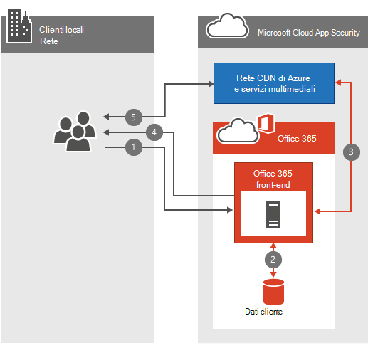

# Office 365 Domande frequenti sulla rete video

I Office 365 di archiviazione e streaming video rendono semplice l'archiviazione e lo streaming di video all'interno dell'organizzazione. Ci sono molte ottime [informazioni su Office 365 Video;](https://support.office.com/article/Find-help-about-Office-365-Video-b435f99a-f47e-4ebd-a946-f5c965844f50) Queste domande frequenti sulla rete sono progettate per rispondere alle domande  più comuni sulla pianificazione della larghezza di banda, sulla crittografia e su come il servizio sfrutta le reti per la distribuzione di contenuti (CDN).
  
Se non hai già una conoscenza approfondita di cosa accade quando un video viene caricato o riprodotto, guarda questo video che abbiamo messo insieme, Cosa succede a un file video quando viene caricato [in Office 365 Video](https://www.youtube.com/watch?v=HXSZ0jYBKlM).
  
## Quali sono i requisiti Office 365 larghezza di banda video?

Esistono numerosi [formati video supportati](https://support.office.com/article/dd1af01c-fd8e-4640-b17b-93ee02b9b817) che possono essere caricati in Office 365. Ogni file video viene quindi codificato in un formato standard con diverse qualità video per la riproduzione. Office 365 Il video usa lo streaming a velocità in bit adattiva per selezionare la migliore qualità di riproduzione video in base alla larghezza di banda di rete e alle dimensioni disponibili del lettore video. A tale scopo, il giocatore richiede inizialmente la qualità di riproduzione più bassa. Il servizio inizia quindi a inviare segmenti video di 2 secondi al lettore video. Il giocatore può quindi richiedere una qualità di riproduzione superiore o inferiore in base alla velocità di recapito di ogni segmento.
  
Lo streaming della velocità in bit adattiva esegue tutte queste attività in background mentre il video viene riprodotto con la quantità minima di interruzioni o buffering. Durante la riproduzione video, il lettore video consente al visualizzatore di ignorare manualmente la qualità di riproduzione automatica per selezionare una qualità di riproduzione video specifica.
  
Ecco una tabella rapida che descrive i requisiti di rete per ognuna delle qualità di riproduzione video. La larghezza di banda minima necessaria per riprodurre un video è di 802 KBps.
  
| Qualità riproduzione | Velocità di rete |
|:-----|:-----|
|288p    |802Kbps    |
|360p    |1,2 Mbps    |
|576p    |2,5 Mbps    |
|720p    |3,8 Mbps    |

([Torna all'inizio](office-365-video-networking-faq.md))
  
## In che modo le reti per la distribuzione di contenuti (CDN) aiutano la riproduzione video?

Se più persone della stessa organizzazione all'interno della stessa posizione geografica stanno streaming degli stessi video, le reti CDN archivieranno una copia di questi video in una posizione più vicina a tale area geografica. Con il video archiviato o memorizzato nella cache nella posizione più vicina, ogni persona lo streaming viene trasmesso dalla posizione più vicina invece che da una posizione più lontana. Office 365 Video usa Servizi multimediali di Azure per gestire ciò che viene memorizzato nella cache nelle reti CDN di Azure e per quanto tempo. Servizi multimediali di Azure possibile utilizzare uno dei percorsi [Rete CDN di Azure](/azure/cdn/cdn-pop-locations) per memorizzare nella cache frammenti e manifesti video per alcuni giorni. Se gli utenti dell'organizzazione continuano a guardare i video memorizzati nella cache, rimarranno nella cache. Se nessuno accede al video per diversi giorni, il video verrà eliminato dalla cache. La volta successiva che qualcuno tenta di guardare il video, il video viene nuovamente memorizzato nella cache nella posizione rete CDN più vicina.
  
Chiunque tenti di guardare il video mentre il contenuto viene memorizzato nella cache in un rete CDN nelle vicinanze trae vantaggio dal fatto che il video è più vicino e, nella maggior parte dei casi, meno passaggi, lontano. In questo modo si migliora la velocità di riproduzione video. tuttavia, non cambia il requisito di rete per riprodurre il video.
  
> [!NOTE]
> Esistono alcune circostanze, ad esempio il nostro limite di capacità, in cui il video può essere rimosso prima che vengano raggiunti i tre giorni.
  
([Torna all'inizio](office-365-video-networking-faq.md))
  
## Posso memorizzare nella cache i video in locale per una riproduzione più veloce?

Sì. Office 365 non ti impedirà di usare un rete CDN locale o un proxy di memorizzazione nella cache per portare contenuti video o di altro Office 365 nella rete locale per un accesso più rapido. Esistono diversi modi per implementare una soluzione di memorizzazione nella cache locale nella rete, il metodo più comune consiste nell'utilizzare una soluzione proxy che memorizza il contenuto nella cache locale. Dopo che un proxy o un rete CDN privato ha memorizzato nella cache i frammenti e i manifesti video, le richieste future per tali file che vengono instradati attraverso il proxy o il rete CDN privato vengono estrarte dalla cache locale e non vengono trascinate da una posizione Internet. Prendere in considerazione la concorrenza tra larghezza di banda, capacità e riproduzione video durante la pianificazione di una soluzione come questa.
  
([Torna all'inizio](office-365-video-networking-faq.md))
  
## Come vengono crittografati e protetti i video?

Office 365 Video sa quanto sia importante mantenere i dati sicuri e privati. [Il Centro protezione Microsoft](https://products.office.com/business/office-365-trust-center-welcome) descrive il nostro impegno per la privacy e la sicurezza dei contenuti. Con la riproduzione video, la velocità è importante per una buona esperienza; Tuttavia, non compromette la sicurezza o la privacy in cambio di velocità. Ecco come possiamo gestire velocità, sicurezza e privacy.
  
Quando un utente o un utente dell'organizzazione carica un nuovo video, il video viene transcodificato, crittografato con crittografia AES-128 e archiviato in Servizi multimediali di Azure. Ciò significa che i video sono crittografati sia in transito che in pausa.
  
Quando un utente dell'organizzazione tenta di guardare un nuovo video, segue questi passaggi:
  
1. Chiedere SharePoint Online se sono autorizzati a visualizzare il video.

2. SharePoint Online usa le autorizzazioni per i file per determinare se la persona può guardare il video.

3. Se sono consentiti, SharePoint Online recupera un token da Azure da assegnare al lettore video.

4. Il lettore video usa quindi il token per richiedere la chiave di decrittografia da Azure.

5. Con la chiave di decrittografia in mano, il lettore video è in grado di trasmettere il video.

  
([Torna all'inizio](office-365-video-networking-faq.md))
  
## Quali sono i requisiti per la riproduzione Office 365 Video?

Office 365 I sistemi operativi e i Web browser supportati da video sono gli stessi dei requisiti di SharePoint Online in [Office 365 di sistema](https://support.office.com/article/Office-365-system-requirements-719254c0-2671-4648-9c84-c6a3d4f3be45). A seconda del sistema operativo e della configurazione del web browser di cui si dispone, sarà possibile determinare le esigenze specifiche del lettore video. Ecco altre informazioni sui requisiti di [riproduzione video.](https://support.office.com/article/ca1cc1a9-a615-46e1-b6a3-40dbd99939a6)
  
([Torna all'inizio](office-365-video-networking-faq.md))
  
## Non è possibile far funzionare Office 365 video, da dove iniziare?

La risoluzione dei problemi di connettività Office 365 video implica la risoluzione dei problemi relativi alla rete, agli ISP e alla configurazione di Office 365. La prima posizione da avviare è il dashboard di integrità del servizio. Questo ti dirà che Office 365 video sta avendo un problema o meno. Se tutto è perfetto, ecco alcune risorse aggiuntive per aiutarti.
  
- Assicurati di potersi connettere agli endpoint di rete necessari per [Office 365 Video.](https://support.office.com/article/Office-365-URLs-and-IP-address-ranges-8548a211-3fe7-47cb-abb1-355ea5aa88a2)

- Controlla la connettività di rete usando la nostra [guida Office 365 risoluzione dei problemi di rete](https://support.office.com/article/Office-365-performance-tuning-and-troubleshooting-Admin-and-IT-Pro-1492cb94-bd62-43e6-b8d0-2a61ed88ebae).

- Vedere le [procedure consigliate per l'Office 365 su una rete lenta.](https://support.office.com/article/Best-practices-for-using-Office-365-on-a-slow-network-fd16c8d2-4799-4c39-8fd7-045f06640166)

- [Informazioni sulla configurazione Office 365 video](https://support.office.com/article/Find-help-about-Office-365-Video-b435f99a-f47e-4ebd-a946-f5c965844f50).

([Torna all'inizio](office-365-video-networking-faq.md))
  
## Office 365 Risorse video

Ecco alcune altre risorse che ti aiuteranno a distribuire e usare Office 365 Video:
  
[Informazioni sulla configurazione Office 365 video](https://support.office.com/article/Find-help-about-Office-365-Video-b435f99a-f47e-4ebd-a946-f5c965844f50)
  
[Meet Office 365 Video](https://support.office.com/article/Meet-Office-365-Video-ca1cc1a9-a615-46e1-b6a3-40dbd99939a6)
  
[Creare e gestire un canale in Office 365 Video](https://support.office.com/article/Create-and-manage-a-channel-in-Office-365-Video-1fede4cc-13c0-435a-b585-e7fbf1c83bb2)
  
[Gestire il portale Office 365 Video](https://support.office.com/article/Manage-your-Office-365-Video-portal-c059465b-eba9-44e1-b8c7-8ff7793ff5da)
  
[Formati video che funzionano in Office 365 Video](https://support.office.com/article/Video-formats-that-work-in-Office-365-Video-dd1af01c-fd8e-4640-b17b-93ee02b9b817)
  
([Torna all'inizio](office-365-video-networking-faq.md))
  
Ecco un collegamento breve per tornare alla pagina: [https://aka.ms/video365networkfaq]()