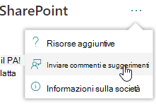
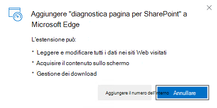
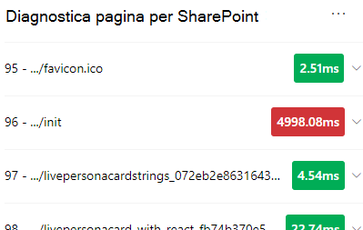
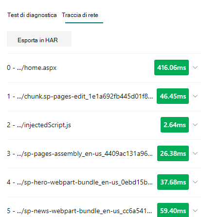
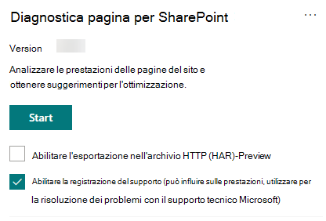

# Usare lo strumento Diagnostica pagine per SharePointUse the Page Diagnostics for SharePoint tool

In questo articolo viene descritto come utilizzare lo strumento Diagnostica pagine per **SharePoint** per analizzare le pagine classiche e moderne del sito di SharePoint Online in base a un set predefinito di criteri di prestazioni.This article describes how to use the **Page Diagnostics for SharePoint tool** to analyze SharePoint Online modern and classic site pages against a pre-defined set of performance criteria.

Lo strumento Diagnostica pagine per SharePoint può essere installato per:The Page Diagnostics for SharePoint tool can be installed for:

- **Microsoft Edge** [(estensione Edge)](https://microsoftedge.microsoft.com/addons/detail/ocemkolpnamjcacndljdfmhlpcaoipji)**Microsoft Edge** [(Edge extension)](https://microsoftedge.microsoft.com/addons/detail/ocemkolpnamjcacndljdfmhlpcaoipji)
- **Chrome** [(estensione Chrome)](https://chrome.google.com/webstore/detail/inahogkhlkbkjkkaleonemeijihmfagi)**Chrome** [(Chrome extension)](https://chrome.google.com/webstore/detail/inahogkhlkbkjkkaleonemeijihmfagi)

>[!TIP]
>La **versione 2.0.0** e successive include il supporto per le pagine moderne oltre alle pagine classiche del sito.Version **2.0.0** and later includes support for modern pages in addition to classic site pages. Se non sei sicuro della versione dello strumento in  uso, puoi selezionare il collegamento Informazioni su o i puntini di sospensione (...) per verificare la versione.If you are unsure which version of the tool you are using, you can select the **About** link or the ellipses (...) to verify your version. **Aggiorna sempre all'ultima versione** quando utilizzi lo strumento.**Always update to the latest version** when using the tool.

Lo strumento Diagnostica pagine per SharePoint è un'estensione del browser per il nuovo browser Microsoft Edge (https://www.microsoft.com/edge) e per Chrome che consente di analizzare le pagine del sito di pubblicazione di SharePoint Online sia classiche che dei portali moderni.The Page Diagnostics for SharePoint tool is a browser extension for the new Microsoft Edge (https://www.microsoft.com/edge) and Chrome browsers that analyzes both SharePoint Online modern portal and classic publishing site pages. Questo strumento funziona solo per SharePoint Online e non può essere utilizzato in una pagina di sistema di SharePoint.This tool only works for SharePoint Online, and cannot be used on a SharePoint system page.

Lo strumento genera un report per ogni pagina analizzata che mostra le prestazioni della pagina rispetto a un set predefinito di regole e visualizza informazioni dettagliate quando i risultati di un test non rientrano nel valore di base.The tool generates a report for each analyzed page showing how the page performs against a pre-defined set of rules and displays detailed information when results for a test fall outside the baseline value. Gli amministratori e i progettisti di SharePoint Online possono utilizzare lo strumento per risolvere i problemi di prestazioni e garantire che le nuove pagine siano ottimizzate prima della pubblicazione.SharePoint Online administrators and designers can use the tool to troubleshoot performance issues and to ensure that new pages are optimized prior to publishing.

Lo strumento Diagnostica pagine è progettato per analizzare solo le pagine del sito di SharePoint, non le pagine di sistema, ad esempio *allitems.aspx* *o sharepoint.aspx.*The Page Diagnostics tool is designed to analyze SharePoint site pages only, not system pages such as *allitems.aspx* or *sharepoint.aspx*. Se si tenta di eseguire lo strumento in una pagina di sistema o in qualsiasi altra pagina non del sito, verrà visualizzato un messaggio di errore che indica che non è possibile eseguire lo strumento per quel tipo di pagina.If you attempt to run the tool on a system page or any other non-site page, you will receive an error message advising that the tool cannot be run for that type of page.

Non si tratta di un errore nello strumento, in quanto non vi è alcun valore nella valutazione delle raccolte o delle pagine di sistema.This is not an error in the tool as there is no value in assessing libraries or system pages. Passare a una pagina del sito di SharePoint per utilizzare lo strumento.Please navigate to a SharePoint site page to use the tool. Se questo errore si verifica in una pagina di SharePoint, controllare la pagina master per assicurarsi che i metatag di SharePoint non siano stati rimossi.If this error occurs on a SharePoint page, please check the master page to ensure that the SharePoint metatags have not been removed.

Per inviare commenti e suggerimenti sullo strumento, seleziona i puntini di sospensione nell'angolo in alto a destra dello strumento e quindi seleziona [Invia feedback.](https://go.microsoft.com/fwlink/?linkid=874109)To provide feedback about the tool, select the ellipsis at the top right corner of the tool and then select [Give feedback](https://go.microsoft.com/fwlink/?linkid=874109).

  
## Installare lo strumento Diagnostica pagine per SharePointInstall the Page Diagnostics for SharePoint tool

La procedura di installazione descritta in questa sezione funziona sia per i browser Chrome che per i browser Microsoft Edge.The installation procedure in this section will work for both the Chrome and Microsoft Edge browsers.

> [!IMPORTANT]
> Microsoft non legge i dati o il contenuto delle pagine analizzati dallo strumento Diagnostica pagine per SharePoint e non acquisisce informazioni personali, siti Web o informazioni di download.Microsoft does not read data or page content that is analyzed by the Page Diagnostics for SharePoint tool, and we do not capture any personal information, website or download information. Le uniche informazioni identificabili registrate a Microsoft dallo strumento sono il nome del tenant, i conteggi delle regole non riuscite e la data e l'ora di esecuzione dello strumento.The only identifiable information logged to Microsoft by the tool is the tenant name, counts of rules that have failed and the date and time the tool was run. Queste informazioni vengono utilizzate da Microsoft per comprendere meglio le tendenze di utilizzo del portale e del sito di pubblicazione moderne e i problemi comuni relativi alle prestazioni.This information is used by Microsoft to better understand modern portal and publishing site usage trends and common performance issues.

1. Installare lo strumento Diagnostica pagine per SharePoint per Microsoft Edge [(estensione](https://microsoftedge.microsoft.com/addons/detail/ocemkolpnamjcacndljdfmhlpcaoipji) **Edge)** o **Chrome** [(estensione Chrome).](https://chrome.google.com/webstore/detail/inahogkhlkbkjkkaleonemeijihmfagi)Install the Page Diagnostics for SharePoint tool for **Microsoft Edge** [(Edge extension)](https://microsoftedge.microsoft.com/addons/detail/ocemkolpnamjcacndljdfmhlpcaoipji) or **Chrome** [(Chrome extension)](https://chrome.google.com/webstore/detail/inahogkhlkbkjkkaleonemeijihmfagi). Leggi l'Informativa sulla privacy dell'utente fornita nella pagina di descrizione nello Store.Please review the User Privacy Policy provided on the description page in the store. Quando aggiungi lo strumento al browser, verrà visualizzato il seguente avviso sulle autorizzazioni.When adding the tool to your browser, you will see the following permissions notice.

    

    Questo avviso è presente perché una pagina può contenere contenuto da posizioni esterne a SharePoint a seconda delle web part e delle personalizzazioni nella pagina.This notice is in place because a page may contain content from locations outside of SharePoint depending on the web parts and customizations on the page. Ciò significa che lo strumento leggerà le richieste e le risposte quando si fa clic sul pulsante Start e solo per la scheda di SharePoint attiva in cui lo strumento è in esecuzione.This means that the tool will read the requests and responses when the start button is clicked and only for the active SharePoint tab where the tool is running. Queste informazioni vengono acquisite localmente dal Web browser ed è disponibile tramite il pulsante  Esporta in **JSON** o Esporta in **HAR** nella scheda Traccia di rete dello strumento. Le informazioni non vengono inviate o acquisite da **Microsoft.**This information is captured locally by the web browser and is available to you via the **Export to JSON** or **Export to HAR** button in the tool's _Network trace_ tab. **The information is not sent to or captured by Microsoft.** Lo strumento rispetta l'informativa sulla privacy di Microsoft accessibile [qui.](https://go.microsoft.com/fwlink/p/?linkid=857875)(The tool respects the Microsoft privacy policy accessible [here](https://go.microsoft.com/fwlink/p/?linkid=857875).)

    _L'autorizzazione Gestione download_ illustra l'uso della funzionalità Di esportazione in **JSON** dello strumento.The _Manage your downloads_ permission covers use of the tool's **Export to JSON** functionality. Segui le linee guida sulla privacy della tua azienda prima di condividere il file JSON all'esterno dell'organizzazione, perché i risultati contengono URL e possono essere classificati come informazioni personali (Informazioni personali).Please follow your company's own privacy guidelines before sharing the JSON file outside of your organization, as the results contain URLs and that can be classified as PII (Personally Identifiable Information).
1. Se vuoi usare lo strumento in modalità Incognito o InPrivate, segui la procedura per il browser:If you want to use the tool in Incognito or InPrivate mode, follow the procedure for your browser:
    1. In Microsoft Edge passa a **Estensioni** o digita _edge://extensions_ nella barra dell'URL e seleziona **Dettagli** per l'estensione.In Microsoft Edge, navigate to **Extensions** or type _edge://extensions_ in the URL bar and select **Details** for the extension. Nelle impostazioni dell'estensione seleziona la casella di controllo **Consenti in InPrivate.**In the extension settings, select the checkbox for **allow in InPrivate**.
    1. In Chrome, accedere a **Estensioni** o digitare _chrome://extensions_ nella barra dell'URL e selezionare **Dettagli** per l'estensione.In Chrome, navigate to **Extensions** or type _chrome://extensions_ in the URL bar and select **Details** for the extension. Nelle impostazioni dell'estensione, seleziona il dispositivo di scorrimento **consenti in Incognito.**In the extension settings, select the slider for **allow in Incognito**.
1. Passare alla pagina del sito di SharePoint in SharePoint Online che si desidera esaminare.Navigate to the SharePoint site page on SharePoint Online that you would like to review. È stato consentito il "caricamento ritardato" degli elementi nelle pagine. Di conseguenza, lo strumento non si arresterà automaticamente (questo è da progettazione per supportare tutti gli scenari di caricamento delle pagine).We have allowed for "delay loading" of items on pages; therefore, the tool will not stop automatically (this is by design to accommodate all page load scenarios). Per interrompere la raccolta, selezionare **Interrompi.**To stop collection, select **Stop**. Verificare che il caricamento della pagina sia stato completato prima di interrompere la raccolta dati oppure acquisire solo una traccia parziale.Make sure that the page load has completed before you stop data collection or you will only capture a partial trace.
1. Fare clic sul pulsante della barra degli strumenti dell'estensioneClick on the extension's toolbar button  per caricare lo strumento e verrà visualizzata la finestra popup di estensione seguente:to load the tool and you will be presented with the following extension popup window:

    

Selezionare **Avvia per** iniziare la raccolta dei dati per l'analisi.Select **Start** to begin collecting data for analysis.

## Cosa verrà visualizzato nello strumento Diagnostica pagine per SharePointWhat you'll see in the Page Diagnostics for SharePoint tool

1. Fare clic sui puntini di sospensione (...) nell'angolo superiore destro dello strumento per trovare i collegamenti seguenti:Click the ellipses (...) in the top right corner of the tool to find the following links:
   1. Il **collegamento Risorse** aggiuntive fornisce indicazioni generali e dettagli relativi a questo strumento, incluso un collegamento a questo articolo.The **Additional resources** link provides general guidance and details regarding the tool including a link back to this article.
   1. Il **collegamento Inviare commenti** e suggerimenti fornisce un collegamento al sito Siti di _SharePoint e Collaboration User Voice._The **Give feedback** link provides a link to the _SharePoint Sites and Collaboration User Voice_ site.
   1. Il **collegamento** Informazioni include la versione attualmente installata dello strumento e un collegamento diretto all'avviso di terze parti dello strumento.The **About** link includes the currently installed version of the tool and a direct link to the tool's third party notice.  
1. **L'ID correlazione, SPRequestDuration, SPIISLatency,** **il** tempo di caricamento della pagina e i dettagli **dell'URL** sono in formato informativo e possono essere utilizzati per alcuni scopi.The **Correlation ID, SPRequestDuration, SPIISLatency**, **Page load time**, and **URL** details are informational and can be used for a few purposes.

    

   - **CorrelationID** è un elemento importante quando si lavora con il supporto tecnico Microsoft perché consente loro di raccogliere dati di diagnostica aggiuntivi per la pagina specifica.**CorrelationID** is an important element when working with Microsoft Support as it allows them to gather additional diagnostic data for the specific page.
   - **SPRequestDuration è** il tempo impiegato da SharePoint per elaborare la pagina.**SPRequestDuration** is the time taken for SharePoint to process the page. L'esplorazione strutturale, le immagini di grandi dimensioni e molte chiamate API potrebbero contribuire a durare più a lungo.Structural navigation, large images, lots of API calls could all contribute to longer durations.
   - **SPIISLatency è il** tempo in millisecondi impiegato per sharePoint Online per iniziare a caricare la pagina.**SPIISLatency** is the time in milliseconds taken for SharePoint Online begin loading the page. Questo valore non include il tempo impiegato per la risposta dell'applicazione Web.This value does not include the time taken for the web application to respond.
   - **Il tempo di caricamento** della pagina è il tempo totale registrato dalla pagina dal momento della richiesta al momento in cui la risposta è stata ricevuta e sottoposta a rendering nel browser.**Page load time** is the total time recorded by the page from the time of the request to the time the response was received and rendered in the browser. Questo valore è influenzato da una serie di fattori, tra cui la latenza di rete, le prestazioni del computer e il tempo necessario al browser per caricare la pagina.This value is affected by a variety of factors including network latency, the performance of the computer and the time it takes for the browser to load the page.
   - **L'URL** della pagina (Uniform Resource Locator) è l'indirizzo Web della pagina corrente.The **Page URL** (Uniform Resource Locator) is the web address of the current page.

1. Nella [**scheda Test di**](#how-to-use-the-diagnostic-tests-tab) diagnostica i risultati dell'analisi vengono visualizzati in tre categorie. **Non sono necessarie azioni,** **opportunità di miglioramento** e **attenzione.**The [**Diagnostic tests**](#how-to-use-the-diagnostic-tests-tab) tab displays the analysis results in three categories; **No action required**, **Improvement opportunities** and **Attention required**. Ogni risultato del test è rappresentato da un elemento in una di queste categorie, come descritto nella tabella seguente:Each test result is represented by an item in one of these categories as described in the following table:

    |CategoriaCategory  |ColoreColor  |DescrizioneDescription  |
    |---------|---------|---------|
    |**Attenzione necessaria****Attention required** |RossoRed |Il risultato del test non rientra nel valore di base e influisce sulle prestazioni della pagina.Test result falls outside the baseline value and is affecting page performance. Seguire le indicazioni per la correzione.Follow remediation guidance.|
    |**Opportunità di miglioramento****Improvement opportunities** |GialloYellow |Il risultato del test non rientra nel valore di base e potrebbe contribuire a problemi di prestazioni.Test result falls outside the baseline value and could be contributing to performance issues. Possono essere applicati criteri specifici del test.Test-specific criteria may apply.|
    |**Nessuna azione necessaria****No action required** |VerdeGreen |Il risultato del test rientra nel valore di base del test.Test result falls within the test's baseline value.|

    

1. Una [**scheda Traccia di**](#how-to-use-the-network-trace-tab) rete fornisce informazioni dettagliate sulle richieste di compilazione delle pagine e sulle risposte.A [**Network trace**](#how-to-use-the-network-trace-tab) tab provides details about page build requests and responses.

## Come usare la scheda Test di diagnosticaHow to use the Diagnostic tests tab

Quando si analizza una pagina del portale moderno di SharePoint o una pagina del sito di pubblicazione classica con lo strumento Diagnostica  pagine per SharePoint, i risultati vengono analizzati utilizzando regole predefinite che confrontano i risultati con i valori di base e vengono visualizzati nella scheda Test di diagnostica. Le regole per determinati test possono utilizzare valori di base diversi per il portale moderno e i siti di pubblicazione classici, a seconda delle differenze tra le due caratteristiche di prestazioni specifiche.When you analyze a SharePoint modern portal page or classic publishing site page with the Page Diagnostics for SharePoint tool, results are analyzed using pre-defined rules that compare results against baseline values and displayed in the **Diagnostic tests** tab. Rules for certain tests may use different baseline values for modern portal and classic publishing sites depending on how specific performance characteristics differ between the two.

I risultati dei  test visualizzati  nelle categorie Opportunità di miglioramento o Attenzione indicano le aree che devono essere esaminate rispetto alle procedure consigliate e possono essere selezionate per visualizzare informazioni aggiuntive sul risultato.Test results that appear in the **Improvement opportunities** or **Attention required** categories indicate areas that should be reviewed against recommended practices, and can be selected to display additional information about the result. I dettagli per ogni elemento _includono_ un collegamento Ulteriori informazioni che ti guiderà direttamente alle indicazioni appropriate relative al test.Details for each item include a _Learn more_ link which will take you directly to the appropriate guidance related to the test. I risultati dei test visualizzati nella **categoria Nessuna** azione richiesta indicano la conformità alla regola pertinente e non visualizzano ulteriori dettagli quando sono selezionati.Test results that appear in the **No action required** category indicate compliance with the relevant rule and do not display additional details when selected.

Le informazioni nella scheda Test di diagnostica non spiegano come progettare le pagine, ma evidenziano i fattori che potrebbero influire sulle prestazioni delle pagine.The information in the Diagnostics tests tab will not tell you how to design pages, but will highlight factors that may impact page performance. Alcune funzionalità e personalizzazioni delle pagine hanno un impatto inevitabile sulle prestazioni della pagina e devono essere esaminate per la potenziale correzione o omissione dalla pagina se il loro impatto è sostanziale.Some page functionality and customizations have an unavoidable impact on page performance, and should be reviewed for potential remediation or omission from the page if their impact is substantial.

I risultati in rosso o in giallo possono anche indicare web part che aggiornano i dati con una frequenza troppo frequente.Red or yellow results may also indicate web parts that refresh data too frequently. Ad esempio, le notizie aziendali non vengono aggiornate ogni secondo, ma le web part personalizzate vengono spesso create per recuperare le ultime notizie ogni secondo invece di implementare elementi di memorizzazione nella cache che potrebbero migliorare l'esperienza utente complessiva.For example, corporate news is not updated every second but custom web parts are often built to fetch the latest news every second instead of implementing caching elements that could improve the overall user experience. Quando si includono web part in una pagina, tenere presente che spesso esistono modi semplici per ridurre l'impatto sulle prestazioni valutando il valore di ogni parametro disponibile per assicurarsi che sia impostato in modo appropriato per lo scopo previsto.Keep in mind when including web parts on a page that there are often simple ways to reduce their performance impact by evaluating the value of each available parameter to ensure it is set appropriately for its intended purpose.

>[!NOTE]
>I siti del team classici in cui la caratteristica di pubblicazione non è abilitata non possono utilizzare reti CDN.Classic team sites that don't have the publishing feature enabled cannot make use of CDNs. Quando si esegue lo strumento in questi siti, è previsto che il test della rete CDN non riesca e possa essere ignorato, ma sono applicabili tutti i test rimanenti.When you run the tool on these sites, the CDN test is expected to fail and can be ignored, but all of the remaining tests are applicable. Le funzionalità aggiuntive della caratteristica di pubblicazione di SharePoint possono aumentare i tempi di caricamento delle pagine, pertanto non è consigliabile attivarla solo per consentire la funzionalità della rete CDN.The additional functionality of the SharePoint publishing feature can increase page load times, so it should not be enabled just to allow CDN functionality.

>[!IMPORTANT]
>Le regole di test vengono aggiunte e aggiornate regolarmente, quindi fare riferimento alla versione più recente dello strumento per informazioni dettagliate sulle regole correnti e informazioni specifiche incluse nei risultati dei test.Test rules are added and updated regularly so please refer to the latest version of the tool for details about current rules and specific information included in test results. Puoi verificare la versione gestendo le estensioni e l'estensione ti consiglierà se è disponibile un aggiornamento.You can verify the version by managing your extensions and the extension will advise whether an update is available.

## Come usare la scheda Network TraceHow to use the Network Trace tab

La **scheda Network Trace** fornisce informazioni dettagliate su entrambe le richieste di creazione della pagina e sulle risposte ricevute da SharePoint.The **Network Trace** tab provides detailed information about both requests to build the page and the responses received from SharePoint.

1. **Cercare i tempi di caricamento degli elementi contrassegnati come rosso.****Look for item load times flagged as red**. Ogni richiesta e risposta è codificata a colori per indicare l'impatto sulle prestazioni complessive della pagina usando le metriche di latenza seguenti:Each request and response is color coded to indicate its impact on overall page performance using the following latency metrics:
    - Verde: \< 500 msGreen: \< 500ms
    - Giallo: 500-1000 msYellow: 500-1000ms
    - Rosso: \> 1000 msRed: \> 1000ms

    

    Nell'immagine mostrata sopra, l'elemento rosso riguarda la pagina predefinita.In the image shown above, the red item pertains to the default page. Verrà sempre visualizzato in rosso, a meno che la pagina non venga caricata in \< 1000 ms (meno di 1 secondo).It will always show red unless the page loads in \< 1000ms (less than 1 second).

2. **Tempi di caricamento degli elementi di test.****Test item load times**. In alcuni casi non ci sarà alcun indicatore di tempo o colore perché gli elementi sono già stati memorizzati nella cache dal browser.In some cases there will be no time or color indicator because the items have already been cached by the browser. Per verificarlo correttamente, aprire la pagina, cancellare la cache del browser e quindi fare clic su **Start** per forzare un caricamento di pagina "a freddo" ed essere un vero riflesso del caricamento iniziale della pagina.To test this correctly, open the page, clear browser cache, and then click **Start** as that will force a "cold" page load and be a true reflection of the initial page load. Questo dovrebbe quindi essere confrontato con il carico di pagina "warm" perché consente anche di determinare quali elementi vengono memorizzati nella cache nella pagina.This should then be compared to the "warm" page load as that will also help determine what items are being cached on the page.

3. **Condividere i dettagli rilevanti con altri utenti che possono aiutare ad analizzare i problemi.****Share relevant details with others who can help investigate issues**. Per condividere i dettagli o le informazioni forniti nello strumento con gli sviluppatori o un tecnico, fai clic su Esporta in **JSON** (come mostrato nell'immagine precedente).To share the details or information provided in the tool with your developers or a technical support person, click **Export to JSON** (as shown in the image above). In questo modo potrai scaricare i risultati, visualizzabili con un visualizzatore di file JSON.That will enable you to download the results, viewable with a JSON file viewer.

    Se hai scelto di usare la funzionalità di anteprima abilita l'esportazione in *HAR,* il tipo di esportazione verrà visualizzato come **Esporta in HAR.**If you have opted to use the preview feature *enable Export to HAR* then the export type will show as **Export to HAR**.

    

> [!IMPORTANT]
> Questi risultati contengono URL che possono essere classificati come informazioni personali (Informazioni personali).These results contain URLs and that can be classified as PII (Personally Identifiable Information). Assicurarsi di seguire le linee guida dell'organizzazione prima di distribuire tali informazioni.Make sure to follow your organization's guidelines before distributing that information.

## Interagire con il supporto tecnico MicrosoftEngaging with Microsoft Support

È stata inclusa **una funzionalità del livello di** supporto Microsoft che deve essere utilizzata solo quando si lavora direttamente a un caso di supporto.We have included a **Microsoft Support level feature** that should only be utilized when working directly on a support case. L'utilizzo di questa funzionalità non offre alcun vantaggio se usato senza l'impegno del team di supporto e può rallentare notevolmente le prestazioni della pagina.Utilizing this feature will provide no benefit to you when used without support team engagement, and can make the page perform significantly slower. Non sono disponibili ulteriori informazioni quando si utilizza questa funzionalità nello strumento, poiché le informazioni aggiuntive vengono aggiunte alla registrazione nel servizio.There is no additional information when using this feature in the tool as the additional information is added to the logging in the service.

Non è visibile alcuna modifica, tranne per il fatto che si riceverà una notifica che indica che è stata abilitata e che le prestazioni della pagina verranno notevolmente ridotte di 2-3 volte le prestazioni durante l'attivazione.No change is visible except that you will be notified that you have enabled it and your page performance will be significantly degraded by 2-3 times slower performance whilst enabled. Sarà rilevante solo per la pagina specifica e la sessione attiva.It will only be relevant for the particular page and that active session. Per questo motivo, questo deve essere usato con moderamento e solo quando attivamente coinvolto con il supporto.For this reason, this should be used sparingly and only when actively engaged with support.

### Per abilitare la funzionalità del livello supporto tecnico MicrosoftTo enable the Microsoft Support level feature

1. Aprire lo strumento Diagnostica pagine per SharePoint.Open the Page Diagnostics for SharePoint tool.
2. Sulla tastiera premere **ALT+MAIUSC+L.**On your keyboard, press **ALT-Shift-L**. Verrà visualizzata la casella **di controllo Abilita registrazione** supporto.This will display the **Enable support logging** check box.
3. Selezionare la casella di controllo e quindi fare clic su **Start** per ricaricare la pagina e generare la registrazione dettagliata.Select the check box, and then click **Start** to reload the page and generate verbose logging.

    
  
    È necessario prendere nota del CorrelationID (visualizzato nella parte superiore dello strumento) e fornirlo al rappresentante del supporto per consentire loro di raccogliere informazioni aggiuntive sulla sessione di diagnostica.You should note the CorrelationID (displayed at the top of the tool) and provide it to your support representative to enable them to gather additional information about the diagnostic session.

## Argomenti correlatiRelated topics

[Ottimizzare le prestazioni di SharePoint OnlineTune SharePoint Online performance](tune-sharepoint-online-performance.md)

[Ottimizzare le prestazioni di Office 365Tune Office 365 performance](tune-microsoft-365-performance.md)

[Prestazioni nell'esperienza moderna di SharePointPerformance in the modern SharePoint experience](https://docs.microsoft.com/sharepoint/modern-experience-performance)

[Reti per la distribuzione di contenutiContent delivery networks](content-delivery-networks.md)

[Usare la rete per la distribuzione di contenuti di Office 365 con SharePoint OnlineUse the Office 365 Content Delivery Network (CDN) with SharePoint Online](use-microsoft-365-cdn-with-spo.md)
