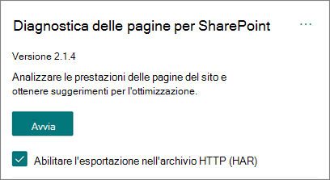

# Usare lo strumento Diagnostica pagine per SharePoint pagina

In questo articolo viene  descritto come utilizzare lo strumento Diagnostica pagine per SharePoint per analizzare le pagine del sito moderno e classico di SharePoint Online in base a un set predefinito di criteri di prestazioni.

Lo strumento Diagnostica pagine per SharePoint può essere installato per:

- **Microsoft Edge** [(estensione Edge)](https://microsoftedge.microsoft.com/addons/detail/ocemkolpnamjcacndljdfmhlpcaoipji)
- **Chrome** [(estensione Chrome)](https://chrome.google.com/webstore/detail/inahogkhlkbkjkkaleonemeijihmfagi)

>[!TIP]
>La **versione 2.0.0 e** successive include il supporto per le pagine moderne oltre alle pagine classiche del sito. Se non si è certi della versione dello strumento  in uso, è possibile selezionare il collegamento Informazioni o i puntini di sospensione (...) per verificare la versione. **Aggiorna sempre alla versione più recente quando** utilizzi lo strumento.

Lo strumento Diagnostica pagine per SharePoint è un'estensione del browser per il nuovo browser Microsoft Edge (https://www.microsoft.com/edge) e per Chrome che consente di analizzare le pagine del sito di pubblicazione di SharePoint Online sia classiche che dei portali moderni. Questo strumento funziona solo per SharePoint Online e non può essere utilizzato in una SharePoint di sistema.

Lo strumento genera un report per ogni pagina analizzata che mostra le prestazioni della pagina rispetto a un set predefinito di regole e visualizza informazioni dettagliate quando i risultati di un test non rientrano nel valore di base. SharePoint Gli amministratori e i progettisti online possono utilizzare lo strumento per risolvere i problemi di prestazioni e garantire che le nuove pagine siano ottimizzate prima della pubblicazione.

Lo strumento Diagnostica pagine è progettato per analizzare solo SharePoint pagine del sito, non le pagine di sistema, ad esempio *allitems.aspx* *o sharepoint.aspx.* Se si tenta di eseguire lo strumento in una pagina di sistema o in qualsiasi altra pagina non del sito, verrà visualizzato un messaggio di errore che indica che non è possibile eseguire lo strumento per quel tipo di pagina.

> [!div class="mx-imgBorder"]
> 

Non si tratta di un errore nello strumento perché non vi è alcun valore nella valutazione di raccolte o pagine di sistema. Passare a una pagina SharePoint sito per usare lo strumento. Se questo errore si verifica in SharePoint pagina, controllare la pagina master per assicurarsi che i metatag SharePoint non siano stati rimossi.

Per fornire feedback sullo strumento, selezionare i puntini di sospensione nell'angolo in alto a destra dello strumento e quindi selezionare [Invia feedback.](https://go.microsoft.com/fwlink/?linkid=874109)

> [!div class="mx-imgBorder"]
> 
  
## Installare lo strumento Diagnostica pagine per SharePoint pagina

La procedura di installazione descritta in questa sezione funziona sia per i browser Chrome che Microsoft Edge browser.

> [!IMPORTANT]
> Microsoft non legge i dati o il contenuto della pagina analizzato dallo strumento Diagnostica pagine per SharePoint e non acquisisce informazioni personali, siti Web o download. L'unica informazione identificabile registrata a Microsoft dallo strumento è il nome del tenant, i conteggi delle regole non riuscite e la data e l'ora di esecuzione dello strumento. Queste informazioni vengono utilizzate da Microsoft per comprendere meglio le tendenze moderne di utilizzo del portale e del sito di pubblicazione e i problemi comuni relativi alle prestazioni.

1. Installa diagnostica pagine per SharePoint per **Microsoft Edge** [(estensione Edge)](https://microsoftedge.microsoft.com/addons/detail/ocemkolpnamjcacndljdfmhlpcaoipji) o **Chrome** [(estensione Chrome).](https://chrome.google.com/webstore/detail/inahogkhlkbkjkkaleonemeijihmfagi) Leggi l'Informativa sulla privacy dell'utente fornita nella pagina di descrizione nello Store. Quando aggiungi lo strumento al browser, viene visualizzato il seguente avviso sulle autorizzazioni.

    > [!div class="mx-imgBorder"]
    > 

    Questa notifica è disponibile perché una pagina può contenere contenuto da posizioni esterne SharePoint a seconda delle web part e delle personalizzazioni della pagina. Ciò significa che lo strumento leggerà le richieste e le risposte quando si fa clic sul pulsante Start e solo per la scheda SharePoint attiva in cui è in esecuzione lo strumento. Queste informazioni vengono acquisite localmente dal Web browser ed è disponibile tramite il pulsante  Esporta in **JSON** o Esporta in **HAR** nella scheda Traccia di rete dello strumento. Le informazioni non vengono inviate o acquisite da **Microsoft.** (Lo strumento rispetta l'informativa sulla privacy Microsoft accessibile [qui.)](https://go.microsoft.com/fwlink/p/?linkid=857875)

    _L'autorizzazione Gestisci i download_ illustra l'uso della funzionalità Esporta in **JSON** dello strumento. Seguire le linee guida sulla privacy dell'azienda prima di condividere il file JSON all'esterno dell'organizzazione, poiché i risultati contengono URL e possono essere classificati come informazioni personali (Informazioni personali).
1. Se vuoi usare lo strumento in modalità Incognito o InPrivate, segui la procedura per il browser:
    1. In Microsoft Edge, passare a **Estensioni** o digitare _edge://extensions_ nella barra dell'URL e selezionare **Dettagli** per l'estensione. Nelle impostazioni dell'estensione seleziona la casella di controllo Consenti **in InPrivate.**
    1. In Chrome, accedere a **Estensioni** o digitare _chrome://extensions_ nella barra dell'URL e selezionare **Dettagli** per l'estensione. Nelle impostazioni dell'estensione seleziona il dispositivo di scorrimento consenti **in Incognito.**
1. Passare alla pagina SharePoint sito di SharePoint online che si desidera esaminare. È stato consentito il "caricamento ritardato" degli elementi nelle pagine. di conseguenza, lo strumento non si arresterà automaticamente (questo è progettato per supportare tutti gli scenari di caricamento delle pagine). Per interrompere la raccolta, selezionare **Interrompi.** Assicurarsi che il caricamento della pagina sia stato completato prima di arrestare la raccolta dati oppure si acquisisce solo una traccia parziale.
1. Fare clic sul pulsante della barra degli strumenti dell'estensione  per caricare lo strumento e verrà visualizzata la finestra popup di estensione seguente:

    

Selezionare **Avvia per** iniziare a raccogliere dati per l'analisi.

## Cosa vedrai nello strumento Diagnostica pagine per SharePoint pagina

1. Fare clic sui puntini di sospensione (...) nell'angolo superiore destro dello strumento per trovare i collegamenti seguenti:
   1. Il **collegamento Risorse** aggiuntive fornisce indicazioni generali e dettagli relativi a questo strumento, incluso un collegamento a questo articolo.
   1. Il **collegamento Invia commenti** e suggerimenti fornisce un collegamento al sito SharePoint Siti e Collaboration User _Voice._
   1. Il **collegamento** Informazioni include la versione attualmente installata dello strumento e un collegamento diretto all'avviso di terze parti dello strumento.  
1. L'ID di **correlazione, SPRequestDuration, SPIISLatency,** **il** tempo di caricamento della pagina e i dettagli **dell'URL** sono in formato informativo e possono essere utilizzati per alcuni scopi.

    > [!div class="mx-imgBorder"]
    > 

   - **CorrelationID** è un elemento importante quando si utilizza il supporto Tecnico Microsoft perché consente loro di raccogliere dati di diagnostica aggiuntivi per la pagina specifica.
   - **SPRequestDuration** è il tempo necessario SharePoint per elaborare la pagina. L'esplorazione strutturale, le immagini di grandi dimensioni e molte chiamate API potrebbero contribuire a durate più lunghe.
   - **SPIISLatency è** il tempo in millisecondi impiegato per SharePoint online iniziare a caricare la pagina. Questo valore non include il tempo impiegato dall'applicazione Web per rispondere.
   - **Il tempo di caricamento** della pagina è il tempo totale registrato dalla pagina dal momento della richiesta al momento in cui la risposta è stata ricevuta e sottoposta a rendering nel browser. Questo valore è influenzato da una serie di fattori, tra cui la latenza di rete, le prestazioni del computer e il tempo necessario al browser per caricare la pagina.
   - **L'URL** pagina (Uniform Resource Locator) è l'indirizzo Web della pagina corrente.

1. Nella [**scheda Test di**](#how-to-use-the-diagnostic-tests-tab) diagnostica i risultati dell'analisi vengono visualizzati in tre categorie. **Non sono necessarie azioni,** **opportunità di miglioramento** e **attenzione.** Ogni risultato del test è rappresentato da un elemento in una di queste categorie, come descritto nella tabella seguente:

    |Categoria  |Colore  |Descrizione  |
    |---------|---------|---------|
    |**Attenzione necessaria** |Rosso |Il risultato del test non rientra nel valore di base e influisce sulle prestazioni della pagina. Seguire le indicazioni per la correzione.|
    |**Opportunità di miglioramento** |Giallo |Il risultato del test non rientra nel valore di base e potrebbe contribuire a problemi di prestazioni. Possono essere applicati criteri specifici del test.|
    |**Nessuna azione necessaria** |Verde |Il risultato del test rientra nel valore di base del test.|

    > [!div class="mx-imgBorder"]
    > 

1. Una [**scheda Traccia di**](#how-to-use-the-network-trace-tab-and-how-to-export-a-har-file) rete fornisce informazioni dettagliate sulle richieste di compilazione delle pagine e sulle risposte.

## Come usare la scheda Test di diagnostica

Quando si analizza una pagina del portale moderna di SharePoint o una pagina del sito di pubblicazione classica con lo strumento Diagnostica pagine per SharePoint, i risultati vengono analizzati utilizzando regole predefinite che confrontano i risultati con i valori di base e vengono visualizzati nella scheda **Test** di diagnostica. Le regole per determinati test possono utilizzare valori di base diversi per i portali moderni e i siti di pubblicazione classici a seconda di come caratteristiche specifiche delle prestazioni differiscono tra i due.

I risultati dei test visualizzati  nelle categorie **Opportunità** di miglioramento o Attenzione obbligatoria indicano le aree che devono essere esaminate rispetto alle procedure consigliate e possono essere selezionate per visualizzare informazioni aggiuntive sul risultato. I dettagli per ogni elemento includono _un_ collegamento Ulteriori informazioni che consente di accedere direttamente alle indicazioni appropriate relative al test. I risultati dei test visualizzati nella **categoria Nessuna** azione richiesta indicano la conformità alla regola rilevante e non visualizzano ulteriori dettagli quando sono selezionati.

Le informazioni nella scheda Test di diagnostica non illustrano come progettare le pagine, ma evidenziano i fattori che possono influire sulle prestazioni delle pagine. Alcune funzionalità e personalizzazioni della pagina hanno un impatto inevitabile sulle prestazioni della pagina e devono essere esaminate per eventuali correzioni o omissioni dalla pagina se il loro impatto è sostanziale.

I risultati in rosso o in giallo possono inoltre indicare web part che aggiornano i dati troppo di frequente. Ad esempio, le notizie aziendali non vengono aggiornate ogni secondo, ma spesso le web part personalizzate vengono create per recuperare le ultime notizie ogni secondo invece di implementare elementi di memorizzazione nella cache che potrebbero migliorare l'esperienza utente complessiva. Quando si includono web part in una pagina, tenere presente che spesso esistono modi semplici per ridurre l'impatto sulle prestazioni valutando il valore di ogni parametro disponibile per assicurarsi che sia impostato in modo appropriato per lo scopo previsto.

>[!NOTE]
>I siti del team classici in cui non è abilitata la caratteristica di pubblicazione non possono utilizzare reti CDN. Quando si esegue lo strumento in questi siti, si prevede che il test di rete CDN avrà esito negativo e può essere ignorato, ma tutti i test rimanenti sono applicabili. Le funzionalità aggiuntive della funzionalità di SharePoint di pubblicazione possono aumentare i tempi di caricamento delle pagine, pertanto non deve essere abilitata solo per consentire rete CDN funzionalità.

>[!IMPORTANT]
>Le regole di test vengono aggiunte e aggiornate regolarmente, quindi fare riferimento alla versione più recente dello strumento per informazioni dettagliate sulle regole correnti e informazioni specifiche incluse nei risultati dei test. Puoi verificare la versione gestendo le estensioni e l'estensione ti consiglierà se è disponibile un aggiornamento.

## Come usare la scheda Network Trace e come esportare un file HAR

La **scheda Traccia di** rete fornisce informazioni dettagliate su entrambe le richieste per creare la pagina e sulle risposte ricevute da SharePoint.

1. **Cercare i tempi di caricamento degli elementi contrassegnati come rosso.** Ogni richiesta e risposta è codificata a colori per indicarne l'impatto sulle prestazioni complessive della pagina usando le metriche di latenza seguenti:
    - Verde: \< 500 ms
    - Giallo: 500-1000 ms
    - Rosso: \> 1000 ms

    > [!div class="mx-imgBorder"]
    > 

    Nell'immagine mostrata sopra, l'elemento rosso riguarda la pagina predefinita. Verrà sempre visualizzato in rosso a meno che la pagina non venga caricata in \< 1000 ms (meno di 1 secondo).

2. **Tempi di caricamento degli elementi di test**. In alcuni casi non ci saranno indicatori di tempo o di colore perché gli elementi sono già stati memorizzati nella cache dal browser. Per testare correttamente questo problema, aprire la pagina, cancellare la cache del browser, quindi fare clic su **Start** in modo da forzare il caricamento di una pagina "a freddo" e riflettere il carico iniziale della pagina. Questo dovrebbe quindi essere confrontato con il carico di pagina "caldo", in quanto ciò aiuterà anche a determinare quali elementi vengono memorizzati nella cache nella pagina.

3. **Condividere i dettagli rilevanti con altri utenti che possono aiutare a analizzare i problemi.** Per condividere i dettagli o le informazioni fornite nello strumento con gli sviluppatori o con una persona del supporto tecnico, l'approccio consigliato consiste nell'utilizzare l'opzione Abilita esportazione in archivio **HTTP (HAR).** 

   > [!div class="mx-imgBorder"]
   > 

Che deve essere abilitato prima di fare clic su Start, che abiliterà quindi la modalità di debug nel browser. Verrà generato un file di archivio HTTP (HAR) a cui è possibile accedere tramite la scheda "Traccia di rete". Fare clic su "Esporta in HAR" per scaricare il file nel computer e quindi condividerlo di conseguenza. Il file può essere aperto in un'ampia gamma di strumenti di debug, come F12 Developer Tools e Fiddler.

> [!div class="mx-imgBorder"]
> 

> [!IMPORTANT]
> Questi risultati contengono URL che possono essere classificati come informazioni personali (informazioni personali). Assicurarsi di seguire le linee guida dell'organizzazione prima di distribuire tali informazioni.

## Interagire con il supporto Tecnico Microsoft

È stata inclusa **una funzionalità a livello** di supporto Microsoft che deve essere utilizzata solo quando si lavora direttamente a un caso di supporto. L'utilizzo di questa funzionalità non offrirà alcun vantaggio se usato senza il coinvolgimento del team di supporto e può rallentare notevolmente le prestazioni della pagina. Non sono disponibili ulteriori informazioni quando si utilizza questa funzionalità nello strumento poiché le informazioni aggiuntive vengono aggiunte alla registrazione nel servizio.

Nessuna modifica è visibile, tranne per il fatto che verrà notificato che è stata abilitata e che le prestazioni della pagina verranno notevolmente ridotte di 2-3 volte le prestazioni durante l'attivazione. Sarà rilevante solo per la pagina specifica e la sessione attiva. Per questo motivo, questo deve essere usato con parsimonio e solo quando attivamente impegnato con il supporto.

### Per abilitare la funzionalità livello di supporto Microsoft

1. Apri lo strumento Diagnostica pagine per SharePoint pagina.
2. Sulla tastiera premere **ALT+MAIUSC+L.** Verrà visualizzata la **casella di controllo Abilita registrazione** supporto.
3. Selezionare la casella di controllo e quindi fare clic su **Avvia** per ricaricare la pagina e generare la registrazione dettagliata.

   > [!div class="mx-imgBorder"]
   > 
  
    È necessario prendere nota di CorrelationID (visualizzato nella parte superiore dello strumento) e fornirlo al rappresentante del supporto per consentire loro di raccogliere ulteriori informazioni sulla sessione di diagnostica.

## Argomenti correlati

[Ottimizzare le prestazioni di SharePoint Online](tune-sharepoint-online-performance.md)

[Ottimizzare le prestazioni di Office 365](tune-microsoft-365-performance.md)

[Prestazioni nell'esperienza moderna di SharePoint](/sharepoint/modern-experience-performance)

[Reti per la distribuzione di contenuti](content-delivery-networks.md)

[Usare la rete per la distribuzione di contenuti di Office 365 con SharePoint Online](use-microsoft-365-cdn-with-spo.md)