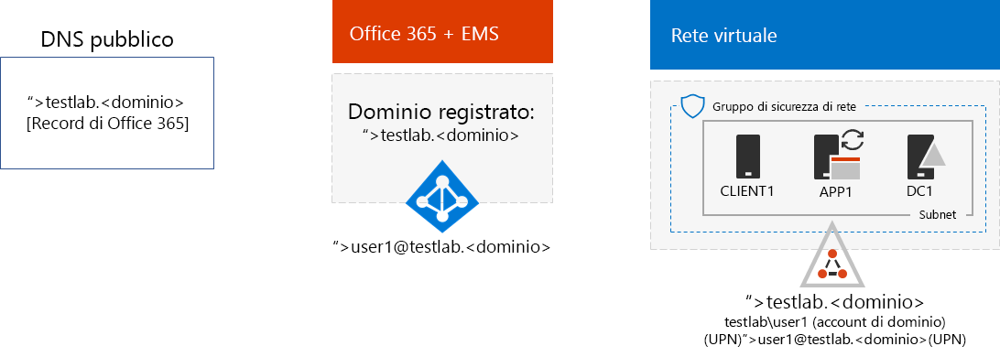
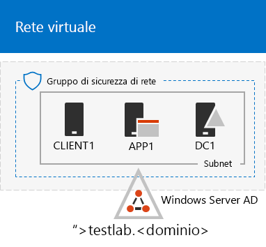
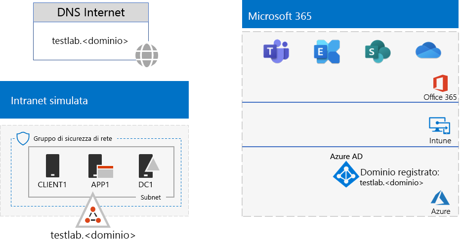

# <a name="password-hash-synchronization-for-your-microsoft-365-test-environment"></a>Sincronizzazione hash delle password per l'ambiente di testing di Microsoft 365

Molte organizzazioni usano Azure AD Connect e la sincronizzazione hash delle password per sincronizzare il set di account della foresta Active Directory Domain Services (AD DS) locale per il set di account nel tenant Azure AD degli abbonamenti a Office 365 ed EMS E5. In questo articolo viene illustrato come aggiungere la sincronizzazione hash delle password nell'ambiente di testing di Microsoft 365, determinando la configurazione seguente:
  

  
Le fasi principali della configurazione dell'ambiente di testing sono tre:
  
1. Creare l'ambiente di testing per l'organizzazione simulata di Microsoft 365.
2. Installare e configurare Azure AD Connect su APP1.
    
> [!TIP]
> Fare clic [qui](https://aka.ms/m365etlgstack) per consultare una mappa di tutti gli articoli relativi alla guida al lab test di Microsoft 365 Enterprise.
  
## <a name="phase-1-create-the-microsoft-365-simulated-enterprise-test-environment"></a>Fase 1: creare l'ambiente di testing per l'organizzazione simulata di Microsoft 365.

Seguire le istruzioni riportate in [configurazione di base per l'organizzazione simulata per Microsoft 365](simulated-ent-base-configuration-microsoft-365-enterprise.md). Questa è la configurazione risultante.
  

  
Questa configurazione è costituita da: 
  
- Abbonamenti di valutazione o a pagamento a Office 365 E5 ed EMS E5.
- Una rete Intranet dell'organizzazione semplificata connessa a Internet e costituita dalle macchine virtuali DC1, APP1 e CLIENT1 in una rete virtuale di Azure. DC1 è un controller di dominio del dominio testlab.\<nome di dominio pubblico> di AD DS.

## <a name="phase-2-create-and-register-the-testlab-domain"></a>Fase 2: creare e registrare il dominio per il test lab

In questa fase si aggiunge un dominio pubblico DNS che viene aggiunto all'abbonamento.

Innanzitutto, utilizzare il provider di registrazione DNS pubblico per creare un nuovo nome di dominio DNS pubblico basato sul proprio nome di dominio corrente e aggiungerlo all'abbonamento a Office 365. È consigliabile utilizzare il nome **testlab.**\<dominio pubblico>. Ad esempio, se il nome di dominio pubblico è <span>**contoso</span>.com**, aggiungere il nome di dominio pubblico **<span>testlab</span>.contoso.com**.
  
Successivamente, aggiungere il dominio **testlab.**\<dominio pubblico> all'abbonamento a pagamento o di valutazione a Office 365 eseguendo la procedura di registrazione del dominio. Tale procedura consiste nell'aggiungere altri record DNS al dominio **testlab.**\<dominio pubblico>. Per altre informazioni, vedere [Aggiungere utenti e dominio a Office 365](https://support.office.com/article/Add-users-and-domain-to-Office-365-6383f56d-3d09-4dcb-9b41-b5f5a5efd611). 

Questa è la configurazione risultante.
  

  
Questa configurazione è costituita da:

- Abbonamenti di valutazione o a pagamento a Office 365 E5 ed EMS E5 con dominio DNS testlab.\<nome di dominio pubblico> registrato.
- Una intranet dell’organizzazione semplificata connessa a Internet e costituita dalle macchine virtuali DC1 APP1 e CLIENT1 in una sottorete di una rete virtuale Azure.

Si noti come il testlab.\<nome di dominio pubblico> a questo punto è:

- Ospitato da record DNS pubblici.
- Registrato negli abbonamenti a Office 365 ed EMS.
- Il dominio di AD DS nella rete Intranet simulata.
     
## <a name="phase-3-install-azure-ad-connect-on-app1"></a>Fase 3: installare Azure AD Connect su APP1

In questa fase, installare e configurare lo strumento Azure AD Connect su APP1 e verificarne il funzionamento.
  
In primo luogo, installare e configurare Azure AD Connect su APP1.

1. Dal [portale di Azure](https://portal.azure.com), accedere con l'account di amministratore globale e connettersi ad APP1 con l'account TESTLAB\\User1.
    
2. Dal desktop di APP1, aprire un prompt dei comandi di Windows PowerShell a livello di amministratore ed eseguire questi comandi:
    
   ```
   Set-ItemProperty -Path "HKLM:\SOFTWARE\Microsoft\Active Setup\Installed Components\{A509B1A7-37EF-4b3f-8CFC-4F3A74704073}" -Name "IsInstalled" -Value 0
   Set-ItemProperty -Path "HKLM:\SOFTWARE\Microsoft\Active Setup\Installed Components\{A509B1A8-37EF-4b3f-8CFC-4F3A74704073}" -Name "IsInstalled" -Value 0
   Stop-Process -Name Explorer -Force
   ```

3. Dalla barra delle applicazioni, fare clic su **Internet Explorer** e accedere a [https://aka.ms/aadconnect](https://aka.ms/aadconnect).
    
4. Nella pagina Microsoft Azure Active Directory Connect, fare clic su **Download** e quindi su **Esegui**.
    
5. Nella pagina di **Benvenuto in Azure Active Directory Connect**, fare clic su **Accetto** e quindi su **Continua**.
    
6. Nella pagina **Impostazioni rapide**, fare clic su **Usa impostazioni rapide**.
    
7. Nella pagina **Connessione ad Azure AD**, digitare il nome dell’account amministratore globale di Office 365 in **Nome utente**, digitare la password in **Password** e fare clic su **Avanti**.
    
8. Nella pagina **Connessione ad AD DS**, digitare **TESTLAB\\User1** in **Nome utente**, digitare la relativa password in **Password** e fare clic su **Avanti**.
    
9. Nella pagina **Pronto per la configurazione** fare clic su **Installa**.
    
10. Nella pagina **Configurazione completata**, fare clic su **Esci**.
    
11. In Internet Explorer, passare all'interfaccia di amministrazione di Microsoft 365 ([https://portal.microsoft.com](https://portal.microsoft.com)).
    
12. Nel riquadro di spostamento sinistro fare clic su **Utenti > Utenti attivi**.
    
    Si noti l'account denominato **User1**. Questo account deriva dal dominio TESTLAB AD DS ed è la prova che la sincronizzazione della directory ha funzionato.
    
13. Fare clic sull'account **User1**. Per le licenze di prodotti, fare clic su **Modifica**.
    
14. In **Licenze di prodotti**, selezionare il paese e fare clic sul controllo **Disattiva** per **Office 365 Enterprise E5** (passando ad **Attiva**). Eseguire la stessa operazione per la licenza **Enterprise Mobility + Security E5**. 

15. Fare clic su **Salva** nella parte inferiore della pagina e selezionare **Chiudi**.
    
Successivamente, verificare la possibilità di accedere all'abbonamento a Office 365 con il nome utente <strong>user1@testlab.</strong>\<nome dominio> nome utente dell'account User1.

1. Da APP1, disconnettersi da Office 365, quindi accedere nuovamente specificando un account diverso.

2. Quando vengono richiesti nome utente e password, specificare <strong>user1@testlab.</strong>\<nome dominio> e la password per User1. Dovrebbe essere possibile accedere come User1. 
 
Si noti che sebbene User1 disponga di autorizzazioni di amministratore di dominio per il dominio TESTLAB AD DS, non è un amministratore globale di Office 365. Di conseguenza, l'icona **Amministratore** non sarà visibile. 

Questa è la configurazione risultante.


Questa configurazione è costituita da: 
  
- Abbonamenti di valutazione o a pagamento a Office 365 E5 ed EMS E5 con dominio DNS TESTLAB.\<nome dominio> registrato.
- Una intranet dell’organizzazione semplificata connessa a Internet e costituita dalle macchine virtuali DC1 APP1 e CLIENT1 in una sottorete di una rete virtuale Azure. Azure AD Connect viene eseguito su APP1 per sincronizzare periodicamente il dominio TESTLAB Active Directory Domain Services con il tenant Azure AD degli abbonamenti a Office 365 ed EMS E5.
- L'account User1 nel dominio TESTLAB AD DS è stato sincronizzato con il tenant Azure AD.

## <a name="next-step"></a>Passaggio successivo

Esplorare altre caratteristiche e funzionalità [identità](m365-enterprise-test-lab-guides.md#identity) nell'ambiente di test.

## <a name="see-also"></a>Vedere anche

[Guide al lab di test di Microsoft 365 Enterprise](m365-enterprise-test-lab-guides.md)

[Distribuzione di Microsoft 365 Enterprise](deploy-microsoft-365-enterprise.md)

[Documentazione di Microsoft 365 Enterprise](https://docs.microsoft.com/microsoft-365-enterprise/)


