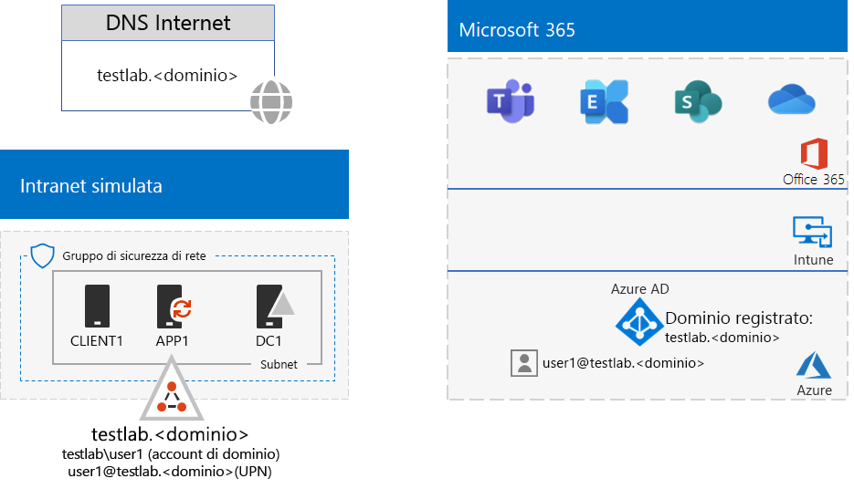

# <a name="password-hash-synchronization-for-your-microsoft-365-test-environment"></a><span data-ttu-id="ddc55-103">Sincronizzazione hash delle password per l'ambiente di testing di Microsoft 365</span><span class="sxs-lookup"><span data-stu-id="ddc55-103">Password hash synchronization for your Microsoft 365 test environment</span></span>

<span data-ttu-id="ddc55-104">*Questa guida al lab di test può essere usata sia per ambienti di testing di Microsoft 365 Enterprise che Office 365 Enterprise.*</span><span class="sxs-lookup"><span data-stu-id="ddc55-104">*This Test Lab Guide can be used for both Microsoft 365 Enterprise and Office 365 Enterprise test environments.*</span></span>

<span data-ttu-id="ddc55-105">Molte organizzazioni usano Azure AD Connect e la sincronizzazione hash delle password per sincronizzare il set di account della foresta Active Directory Domain Services (AD DS) locale con il set di account nel tenant di Azure AD dell'abbonamento a Microsoft 365 o a Office 365.</span><span class="sxs-lookup"><span data-stu-id="ddc55-105">Many organizations use Azure AD Connect and password hash synchronization to synchronize the set of accounts in their on-premises Active Directory Domain Services (AD DS) forest to the set of accounts in the Azure AD tenant of their Microsoft 365 or Office 365 subscription.</span></span> <span data-ttu-id="ddc55-106">In questo articolo viene illustrato come aggiungere la sincronizzazione hash delle password nell'ambiente di testing di Microsoft 365, determinando la configurazione seguente:</span><span class="sxs-lookup"><span data-stu-id="ddc55-106">This article describes how you can add password hash synchronization to your Microsoft 365 test environment, resulting in the following configuration:</span></span>
  

  
<span data-ttu-id="ddc55-108">Le fasi principali della configurazione dell'ambiente di testing sono tre:</span><span class="sxs-lookup"><span data-stu-id="ddc55-108">There are two phases to setting up this test environment:</span></span>
  
1. <span data-ttu-id="ddc55-109">Creare l'ambiente di testing per l'organizzazione simulata di Microsoft 365.</span><span class="sxs-lookup"><span data-stu-id="ddc55-109">Create the Microsoft 365 simulated enterprise test environment.</span></span>
2. <span data-ttu-id="ddc55-110">Installare e configurare Azure AD Connect su APP1.</span><span class="sxs-lookup"><span data-stu-id="ddc55-110">Install and configure Azure AD Connect on APP1.</span></span>
    
> [!TIP]
> <span data-ttu-id="ddc55-111">Fare clic [qui](../media/m365-enterprise-test-lab-guides/Microsoft365EnterpriseTLGStack.pdf) per consultare una mappa di tutti gli articoli relativi alla guida al lab test di Microsoft 365 Enterprise.</span><span class="sxs-lookup"><span data-stu-id="ddc55-111">Click [here](../media/m365-enterprise-test-lab-guides/Microsoft365EnterpriseTLGStack.pdf) for a visual map to all the articles in the Microsoft 365 Enterprise Test Lab Guide stack.</span></span>
  
## <a name="phase-1-create-the-microsoft-365-simulated-enterprise-test-environment"></a><span data-ttu-id="ddc55-112">Fase 1: creare l'ambiente di testing per l'organizzazione simulata di Microsoft 365.</span><span class="sxs-lookup"><span data-stu-id="ddc55-112">Phase 1: Create the Microsoft 365 simulated enterprise test environment</span></span>

<span data-ttu-id="ddc55-p102">Seguire le istruzioni riportate in [configurazione di base per l'organizzazione simulata per Microsoft 365](simulated-ent-base-configuration-microsoft-365-enterprise.md). Questa è la configurazione risultante.</span><span class="sxs-lookup"><span data-stu-id="ddc55-p102">Follow the instructions in [simulated enterprise base configuration for Microsoft 365](simulated-ent-base-configuration-microsoft-365-enterprise.md). Here is your resulting configuration.</span></span>
  

  
<span data-ttu-id="ddc55-116">Questa configurazione è costituita da:</span><span class="sxs-lookup"><span data-stu-id="ddc55-116">This configuration consists of:</span></span> 
  
- <span data-ttu-id="ddc55-117">Abbonamenti di valutazione o a pagamento a Microsoft 365 E5 o a Office 365 E5.</span><span class="sxs-lookup"><span data-stu-id="ddc55-117">Microsoft 365 E5 or Office 365 E5 trial or paid subscriptions.</span></span>
- <span data-ttu-id="ddc55-118">Una rete Intranet dell'organizzazione semplificata connessa a Internet e costituita dalle macchine virtuali DC1, APP1 e CLIENT1 in una rete virtuale di Azure.</span><span class="sxs-lookup"><span data-stu-id="ddc55-118">A simplified organization intranet connected to the Internet, consisting of the DC1, APP1, and CLIENT1 virtual machines in an Azure virtual network.</span></span> <span data-ttu-id="ddc55-119">DC1 è un controller di dominio del dominio testlab.\<nome di dominio pubblico> di AD DS.</span><span class="sxs-lookup"><span data-stu-id="ddc55-119">DC1 is a domain controller for the testlab.\<your public domain name> AD DS domain.</span></span>

## <a name="phase-2-create-and-register-the-testlab-domain"></a><span data-ttu-id="ddc55-120">Fase 2: creare e registrare il dominio per il test lab</span><span class="sxs-lookup"><span data-stu-id="ddc55-120">Phase 2: Create and register the testlab domain</span></span>

<span data-ttu-id="ddc55-121">In questa fase si aggiunge un dominio pubblico DNS che viene aggiunto all'abbonamento.</span><span class="sxs-lookup"><span data-stu-id="ddc55-121">In this phase you add a public DNS domain and add it to your subscription.</span></span>

<span data-ttu-id="ddc55-p104">Innanzitutto, usare il provider di registrazione DNS pubblico per creare un nuovo nome di dominio DNS pubblico basato sul proprio nome di dominio corrente e aggiungerlo all'abbonamento. È consigliabile usare il nome **testlab.**\<dominio pubblico>. Ad esempio, se il nome di dominio pubblico è **<span>contoso</span>.com**, aggiungere il nome di dominio pubblico **<span>testlab</span>.contoso.com**.</span><span class="sxs-lookup"><span data-stu-id="ddc55-p104">First, work with your public DNS registration provider to create a new public DNS domain name based on your current domain name and add it to your subscription. We recommend using the name **testlab.**\<your public domain>. For example, if your public domain name is **<span>contoso</span>.com**, add the public domain name **<span>testlab</span>.contoso.com**.</span></span>
  
<span data-ttu-id="ddc55-125">Successivamente, aggiungere il dominio **testlab.**\<dominio pubblico> all'abbonamento a pagamento o di valutazione a Office 365 o Microsoft 365 eseguendo la procedura di registrazione del dominio.</span><span class="sxs-lookup"><span data-stu-id="ddc55-125">Next, you add the **testlab.**\<your public domain> domain to your Microsoft 365 or Office 365 trial or paid subscription by going through the domain registration process.</span></span> <span data-ttu-id="ddc55-126">Tale procedura consiste nell'aggiungere altri record DNS al dominio **testlab.**\<dominio pubblico>.</span><span class="sxs-lookup"><span data-stu-id="ddc55-126">This consists of adding additional DNS records to the **testlab.**\<your public domain> domain.</span></span> <span data-ttu-id="ddc55-127">Per altre informazioni, vedere [Aggiungere un dominio a Office 365](https://docs.microsoft.com/office365/admin/setup/add-domain).</span><span class="sxs-lookup"><span data-stu-id="ddc55-127">For more information, see [Add a domain to Office 365](https://docs.microsoft.com/office365/admin/setup/add-domain).</span></span> 

<span data-ttu-id="ddc55-128">Questa è la configurazione risultante.</span><span class="sxs-lookup"><span data-stu-id="ddc55-128">Here is your resulting configuration.</span></span>
  

  
<span data-ttu-id="ddc55-130">Questa configurazione è costituita da:</span><span class="sxs-lookup"><span data-stu-id="ddc55-130">This configuration consists of:</span></span>

- <span data-ttu-id="ddc55-131">Abbonamenti di valutazione o a pagamento a Microsoft 365 E5 o a Office 365 E5 con il dominio DNS testlab.\<nome dominio pubblico> registrato.</span><span class="sxs-lookup"><span data-stu-id="ddc55-131">Microsoft 365 E5 or Office 365 E5 trial or paid subscriptions with the DNS domain testlab.\<your public domain name> registered.</span></span>
- <span data-ttu-id="ddc55-132">Una intranet dell’organizzazione semplificata connessa a Internet e costituita dalle macchine virtuali DC1 APP1 e CLIENT1 in una sottorete di una rete virtuale Azure.</span><span class="sxs-lookup"><span data-stu-id="ddc55-132">A simplified organization intranet connected to the Internet, consisting of the DC1, APP1, and CLIENT1 virtual machines on a subnet of an Azure virtual network.</span></span>

<span data-ttu-id="ddc55-133">Si noti come il testlab.\<nome di dominio pubblico> a questo punto è:</span><span class="sxs-lookup"><span data-stu-id="ddc55-133">Notice how the testlab.\<your public domain name> is now:</span></span>

- <span data-ttu-id="ddc55-134">Ospitato da record DNS pubblici.</span><span class="sxs-lookup"><span data-stu-id="ddc55-134">Supported by public DNS records.</span></span>
- <span data-ttu-id="ddc55-135">Registrato negli abbonamenti a Microsoft 365 o Office 365.</span><span class="sxs-lookup"><span data-stu-id="ddc55-135">Registered in your Microsoft 365 or Office 365 subscriptions.</span></span>
- <span data-ttu-id="ddc55-136">Il dominio di AD DS nella rete Intranet simulata.</span><span class="sxs-lookup"><span data-stu-id="ddc55-136">The AD DS domain on your simulated intranet.</span></span>
     
## <a name="phase-3-install-azure-ad-connect-on-app1"></a><span data-ttu-id="ddc55-137">Fase 3: installare Azure AD Connect su APP1</span><span class="sxs-lookup"><span data-stu-id="ddc55-137">Phase 3: Install Azure AD Connect on APP1</span></span>

<span data-ttu-id="ddc55-138">In questa fase, installare e configurare lo strumento Azure AD Connect su APP1 e verificarne il funzionamento.</span><span class="sxs-lookup"><span data-stu-id="ddc55-138">In this phase, you install and configure the Azure AD Connect tool on APP1, and then verify that it works.</span></span>
  
<span data-ttu-id="ddc55-139">In primo luogo, installare e configurare Azure AD Connect su APP1.</span><span class="sxs-lookup"><span data-stu-id="ddc55-139">First, you install and configure Azure AD Connect on APP1.</span></span>

1. <span data-ttu-id="ddc55-140">Dal [portale di Azure](https://portal.azure.com), accedere con l'account di amministratore globale e connettersi ad APP1 con l'account TESTLAB\\User1.</span><span class="sxs-lookup"><span data-stu-id="ddc55-140">From the [Azure portal](https://portal.azure.com), sign in with your global administrator account, and then connect to APP1 with the TESTLAB\\User1 account.</span></span>
    
2. <span data-ttu-id="ddc55-141">Dal desktop di APP1, aprire un prompt dei comandi di Windows PowerShell a livello di amministratore ed eseguire questi comandi:</span><span class="sxs-lookup"><span data-stu-id="ddc55-141">From the desktop of APP1, open an administrator-level Windows PowerShell command prompt, and then run these commands:</span></span>
    
   ```powershell
   Set-ItemProperty -Path "HKLM:\SOFTWARE\Microsoft\Active Setup\Installed Components\{A509B1A7-37EF-4b3f-8CFC-4F3A74704073}" -Name "IsInstalled" -Value 0
   Set-ItemProperty -Path "HKLM:\SOFTWARE\Microsoft\Active Setup\Installed Components\{A509B1A8-37EF-4b3f-8CFC-4F3A74704073}" -Name "IsInstalled" -Value 0
   Stop-Process -Name Explorer -Force
   ```

3. <span data-ttu-id="ddc55-142">Dalla barra delle applicazioni, fare clic su **Internet Explorer** e accedere a [https://aka.ms/aadconnect](https://aka.ms/aadconnect).</span><span class="sxs-lookup"><span data-stu-id="ddc55-142">From the task bar, click **Internet Explorer** and go to [https://aka.ms/aadconnect](https://aka.ms/aadconnect).</span></span>
    
4. <span data-ttu-id="ddc55-143">Nella pagina Microsoft Azure Active Directory Connect, fare clic su **Download** e quindi su **Esegui**.</span><span class="sxs-lookup"><span data-stu-id="ddc55-143">On the Microsoft Azure Active Directory Connect page, click **Download**, and then click **Run**.</span></span>
    
5. <span data-ttu-id="ddc55-144">Nella pagina di **Benvenuto in Azure Active Directory Connect**, fare clic su **Accetto** e quindi su **Continua**.</span><span class="sxs-lookup"><span data-stu-id="ddc55-144">On the **Welcome to Azure AD Connect** page, click **I agree**, and then click **Continue**.</span></span>
    
6. <span data-ttu-id="ddc55-145">Nella pagina **Impostazioni rapide**, fare clic su **Usa impostazioni rapide**.</span><span class="sxs-lookup"><span data-stu-id="ddc55-145">On the **Express Settings** page, click **Use express settings**.</span></span>
    
7. <span data-ttu-id="ddc55-146">Nella pagina **Connessione ad Azure AD**, digitare il nome dell'account amministratore globale in **Nome utente**, digitare la password in **Password** e fare clic su **Avanti**.</span><span class="sxs-lookup"><span data-stu-id="ddc55-146">On the **Connect to Azure AD** page, type your global administrator account name in **Username,** type its password in **Password**, and then click **Next**.</span></span>
    
8. <span data-ttu-id="ddc55-147">Nella pagina **Connessione ad AD DS**, digitare **TESTLAB\\User1** in **Nome utente**, digitare la relativa password in **Password** e fare clic su **Avanti**.</span><span class="sxs-lookup"><span data-stu-id="ddc55-147">On the **Connect to AD DS** page, type **TESTLAB\\User1** in **Username,** type its password in **Password**, and then click **Next**.</span></span>
    
9. <span data-ttu-id="ddc55-148">Nella pagina **Pronto per la configurazione** fare clic su **Installa**.</span><span class="sxs-lookup"><span data-stu-id="ddc55-148">On the **Ready to configure** page, click **Install**.</span></span>
    
10. <span data-ttu-id="ddc55-149">Nella pagina **Configurazione completata**, fare clic su **Esci**.</span><span class="sxs-lookup"><span data-stu-id="ddc55-149">On the **Configuration complete** page, click **Exit**.</span></span>
    
11. <span data-ttu-id="ddc55-150">In Internet Explorer, passare all'interfaccia di amministrazione di Microsoft 365 ([https://portal.microsoft.com](https://portal.microsoft.com)).</span><span class="sxs-lookup"><span data-stu-id="ddc55-150">In Internet Explorer, go to the Microsoft 365 admin center ([https://portal.microsoft.com](https://portal.microsoft.com)).</span></span>
    
12. <span data-ttu-id="ddc55-151">Nel riquadro di spostamento sinistro fare clic su **Utenti > Utenti attivi**.</span><span class="sxs-lookup"><span data-stu-id="ddc55-151">In the left navigation, click **Users > Active users**.</span></span>
    
    <span data-ttu-id="ddc55-152">Si noti l'account denominato **User1**.</span><span class="sxs-lookup"><span data-stu-id="ddc55-152">Note the account named **User1**.</span></span> <span data-ttu-id="ddc55-153">Questo account deriva dal dominio TESTLAB AD DS ed è la prova che la sincronizzazione della directory ha funzionato.</span><span class="sxs-lookup"><span data-stu-id="ddc55-153">This account is from the TESTLAB AD DS domain and is proof that directory synchronization has worked.</span></span>
    
13. <span data-ttu-id="ddc55-154">Fare clic sull'account **User1** e quindi fare clic su **Licenze e app**.</span><span class="sxs-lookup"><span data-stu-id="ddc55-154">Click the **User1** account, and then click **Licenses and apps**.</span></span>
    
14. <span data-ttu-id="ddc55-155">In **Licenze di prodotto** selezionare la posizione, se necessario, disabilitare la licenza di **Office 365 E5** e abilitare la licenza di **Microsoft 365 E5**.</span><span class="sxs-lookup"><span data-stu-id="ddc55-155">In **Product licenses**, select your location (if needed), disable the **Office 365 E5** license and enable the **Microsoft 365 E5** license.</span></span> 

15. <span data-ttu-id="ddc55-156">Fare clic su **Salva** nella parte inferiore della pagina e selezionare **Chiudi**.</span><span class="sxs-lookup"><span data-stu-id="ddc55-156">Click **Save** at the bottom of the page, and then click **Close**.</span></span>
    
<span data-ttu-id="ddc55-157">Successivamente, verificare la possibilità di accedere all'abbonamento con il nome utente <strong>user1@testlab.</strong>\<nome dominio> nome utente dell'account User1.</span><span class="sxs-lookup"><span data-stu-id="ddc55-157">Next, you test the ability to sign in to your subscription with the <strong>user1@testlab.</strong>\<your domain name> user name of the User1 account.</span></span>

1. <span data-ttu-id="ddc55-158">Da APP1, disconnettersi e quindi accedere nuovamente specificando un account diverso.</span><span class="sxs-lookup"><span data-stu-id="ddc55-158">From APP1, sign out, and then sign in again, this time specifying a different account.</span></span>

2. <span data-ttu-id="ddc55-p107">Quando vengono richiesti nome utente e password, specificare <strong>user1@testlab.</strong>\<nome dominio> e la password per User1. Dovrebbe essere possibile accedere come User1.</span><span class="sxs-lookup"><span data-stu-id="ddc55-p107">When prompted for a user name and password, specify <strong>user1@testlab.</strong>\<your domain name> and the User1 password. You should successfully sign in as User1.</span></span> 
 
<span data-ttu-id="ddc55-161">Si noti che sebbene User1 disponga di autorizzazioni di amministratore di dominio per il dominio TESTLAB AD DS, non è un amministratore globale.</span><span class="sxs-lookup"><span data-stu-id="ddc55-161">Notice that although User1 has domain administrator permissions for the TESTLAB AD DS domain, it is not a global administrator.</span></span> <span data-ttu-id="ddc55-162">Di conseguenza, l'icona **Amministratore** non sarà visibile.</span><span class="sxs-lookup"><span data-stu-id="ddc55-162">Therefore, you will not see the **Admin** icon as an option.</span></span> 

<span data-ttu-id="ddc55-163">Questa è la configurazione risultante.</span><span class="sxs-lookup"><span data-stu-id="ddc55-163">Here is your resulting configuration.</span></span>


<span data-ttu-id="ddc55-165">Questa configurazione è costituita da:</span><span class="sxs-lookup"><span data-stu-id="ddc55-165">This configuration consists of:</span></span> 
  
- <span data-ttu-id="ddc55-166">Abbonamenti di valutazione o a pagamento a Microsoft 365 E5 o a Office 365 E5 con il dominio DNS TESTLAB.\<nome dominio> registrato.</span><span class="sxs-lookup"><span data-stu-id="ddc55-166">Microsoft 365 E5 or Office 365 E5 trial or paid subscriptions with the DNS domain TESTLAB.\<your domain name> registered.</span></span>
- <span data-ttu-id="ddc55-167">Una intranet dell’organizzazione semplificata connessa a Internet e costituita dalle macchine virtuali DC1 APP1 e CLIENT1 in una sottorete di una rete virtuale Azure.</span><span class="sxs-lookup"><span data-stu-id="ddc55-167">A simplified organization intranet connected to the Internet, consisting of the DC1, APP1, and CLIENT1 virtual machines on a subnet of an Azure virtual network.</span></span> <span data-ttu-id="ddc55-168">Azure AD Connect viene eseguito su APP1 per sincronizzare periodicamente il dominio TESTLAB di Active Directory Domain Services con il tenant di Azure AD dell'abbonamento a Microsoft 365 o a Office 365.</span><span class="sxs-lookup"><span data-stu-id="ddc55-168">Azure AD Connect runs on APP1 to synchronize the TESTLAB AD DS domain to the Azure AD tenant of your Microsoft 365 or Office 365 subscription periodically.</span></span>
- <span data-ttu-id="ddc55-169">L'account User1 nel dominio TESTLAB AD DS è stato sincronizzato con il tenant Azure AD.</span><span class="sxs-lookup"><span data-stu-id="ddc55-169">The User1 account in the TESTLAB  AD DS domain has been synchronized with the Azure AD tenant.</span></span>

## <a name="next-step"></a><span data-ttu-id="ddc55-170">Passaggio successivo</span><span class="sxs-lookup"><span data-stu-id="ddc55-170">Next step</span></span>

<span data-ttu-id="ddc55-171">Esplorare altre caratteristiche e funzionalità [identità](m365-enterprise-test-lab-guides.md#identity) nell'ambiente di test.</span><span class="sxs-lookup"><span data-stu-id="ddc55-171">Explore additional [identity](m365-enterprise-test-lab-guides.md#identity) features and capabilities in your test environment.</span></span>

## <a name="see-also"></a><span data-ttu-id="ddc55-172">Vedere anche</span><span class="sxs-lookup"><span data-stu-id="ddc55-172">See also</span></span>

[<span data-ttu-id="ddc55-173">Guide al lab di test di Microsoft 365 Enterprise</span><span class="sxs-lookup"><span data-stu-id="ddc55-173">Microsoft 365 Enterprise Test Lab Guides</span></span>](m365-enterprise-test-lab-guides.md)

[<span data-ttu-id="ddc55-174">Distribuzione di Microsoft 365 Enterprise</span><span class="sxs-lookup"><span data-stu-id="ddc55-174">Deploy Microsoft 365 Enterprise</span></span>](deploy-microsoft-365-enterprise.md)

[<span data-ttu-id="ddc55-175">Documentazione di Microsoft 365 Enterprise</span><span class="sxs-lookup"><span data-stu-id="ddc55-175">Microsoft 365 Enterprise documentation</span></span>](https://docs.microsoft.com/microsoft-365-enterprise/)


