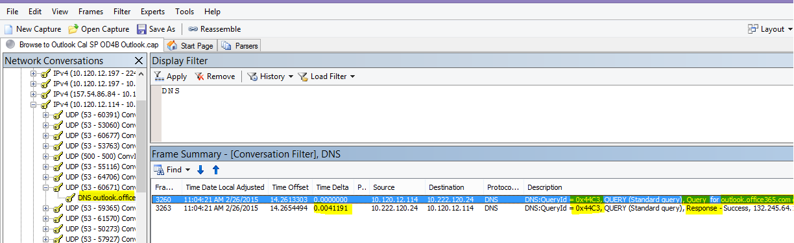

# <a name="performance-troubleshooting-plan-for-office-365"></a>Piano di risoluzione dei problemi relativi alle prestazioni per Office 365

È necessario conoscere i passaggi da eseguire per identificare e correggere ritardi, blocchi e rallentamento delle prestazioni tra SharePoint Online, OneDrive for Business, Exchange Online o Skype for Business online e il computer client? Prima di chiamare il supporto, questo articolo consente di risolvere i problemi di prestazioni di Office 365 e anche risolvere alcuni dei problemi più comuni.

Questo articolo è in realtà un piano d'azione di esempio che puoi usare per acquisire dati importanti sul tuo problema di prestazioni mentre si verifica. In questo articolo sono inclusi anche alcuni problemi principali.

Se non si ha di che fare con le prestazioni di rete e si desidera creare un piano a lungo termine per monitorare le prestazioni tra i computer client e Office 365, vedere Ottimizzazione e risoluzione dei problemi delle prestazioni di [Office 365 - Amministratore](performance-tuning-using-baselines-and-history.md)e professionisti IT.

## <a name="sample-performance-troubleshooting-action-plan"></a>Esempio di piano d'azione per la risoluzione dei problemi di prestazioni

Questo piano d'azione contiene due parti; una fase di preparazione e una fase di registrazione. Se al momento si verifica un problema di prestazioni ed è necessario eseguire la raccolta dei dati, è possibile iniziare subito a usare questo piano.

### <a name="prepare-the-client-computer"></a>Preparare il computer client

- Individuare un computer client in grado di riprodurre il problema di prestazioni. Questo computer verrà utilizzato durante la risoluzione dei problemi.
- Annota i passaggi che causano il problema di prestazioni in modo che tu sia pronto quando è il momento di testare.
- Installare gli strumenti per la raccolta e la registrazione delle informazioni:
  - Installare [Netmon 3.4](https://www.microsoft.com/download/details.aspx?id=4865) (o usare uno strumento di traccia di rete equivalente).
  - Installare l'edizione basica gratuita di [HTTPWatch](https://www.httpwatch.com/download/) (o usare uno strumento di traccia di rete equivalente).
  - Usa un registratore dello schermo o esegui il registratore di passaggi (PSR.exe) fornito con Windows Vista e versioni successive, per tenere traccia dei passaggi da eseguire durante i test.

### <a name="log-the-performance-issue"></a>Registrare il problema di prestazioni

- Chiudere tutti i browser Internet estranei.
- Avviare il registratore di passaggi o un altro registratore dello schermo.
- Avviare l'acquisizione Netmon (o lo strumento di traccia di rete).
- Cancellare la cache DNS nel computer client dalla riga di comando digitando ipconfig /flushdns.
- Avvia una nuova sessione del browser e attiva HTTPWatch.
- Facoltativo: se si sta testando Exchange Online, eseguire lo strumento Exchange Client Performance Analyzer dalla console di amministrazione di Office 365.
- Riprodurre i passaggi esatti che causano il problema di prestazioni.
- Arrestare la traccia di Netmon o di un altro strumento.
- Nella riga di comando eseguire una route di traccia per l'abbonamento a Office 365 digitando il comando seguente e quindi premendo INVIO:

  ``` cmd
  tracert <subscriptionname>.onmicrosoft.com
  ```

- Arrestare Il registratore di passaggi e salvare il video. Assicurati di includere la data e l'ora dell'acquisizione e se dimostra prestazioni buone o non ottimali.
- Salvare i file di traccia. Anche in questo caso, assicurati di includere la data e l'ora dell'acquisizione e se dimostra prestazioni buone o non ottimali.

Se non hai familiarità con l'esecuzione degli strumenti menzionati in questo articolo, non preoccuparti perché questi passaggi vengono forniti successivamente. Se si è abituati a eseguire questo tipo di acquisizione di rete, è possibile passare a [Come](performance-tuning-using-baselines-and-history.md#how-to-collect-baselines)raccogliere le linee di base, che descrive il filtro e la lettura dei log.

### <a name="flush-the-dns-cache-first"></a>Scaricare prima la cache DNS

Perché? Lo svuotamento della cache DNS consente di avviare i test con una lavagna pulita. Cancellando la cache, si reimposta il contenuto del resolver DNS alle voci più aggiornate. Tenere presente che uno scaricamento non rimuove le voci dei file HOTS. Se si utilizzano ampiamente le voci di file HOST, è consigliabile copiare tali voci in un file in un'altra directory e quindi svuotare il file HOST.

#### <a name="flush-your-dns-resolver-cache"></a>Scaricare la cache del resolver DNS

1. Aprire il prompt dei comandi ( **start** \> **Run** \> **cmd** o **windows key** \> **cmd**).
2. Digitare il comando seguente e premere INVIO:

    ``` cmd
    ipconfig /flushdns
    ```

## <a name="netmon"></a>Netmon

Lo strumento Di monitoraggio di rete di Microsoft ([Netmon](https://www.microsoft.com/download/details.aspx?id=4865)) analizza i pacchetti, ovvero il traffico, che passano tra computer in reti. Usando Netmon per tracciare il traffico con Office 365, è possibile acquisire, visualizzare e leggere le intestazioni dei pacchetti, identificare i dispositivi interessati, controllare le impostazioni importanti nell'hardware di rete, cercare i pacchetti eliminati e seguire il flusso di traffico tra i computer della rete aziendale e Office 365. Poiché il corpo effettivo del traffico è crittografato, ovvero(viaggia sulla porta 443 tramite SSL/TLS, non è possibile leggere i file inviati. Al contrario, ottieni una traccia non filtrata del percorso che il pacchetto prende, che può aiutarti a tenere traccia del comportamento del problema.

Assicurarsi di non applicare un filtro in questo momento. Eseguire invece i passaggi e illustrare il problema prima di arrestare la traccia e il salvataggio.

Dopo aver installato Netmon 3.4, aprire lo strumento ed eseguire la procedura seguente:

### <a name="take-a-netmon-trace-and-reproduce-the-issue"></a>Eseguire una traccia Netmon e riprodurre il problema

1. Avviare Netmon 3.4.
Nella pagina iniziale sono  disponibili tre riquadri: Acquisizioni **recenti,** Seleziona reti e Introduzione a Microsoft Network Monitor **3.4. Nota**. Il pannello Seleziona reti fornisce anche un elenco delle reti predefinite da cui è possibile acquisire. Assicurarsi che le schede di rete siano selezionate qui.

2. Fai **clic su Nuova** acquisizione nella parte superiore della **pagina** iniziale. Verrà aggiunta una nuova scheda accanto alla **scheda Pagina iniziale** denominata Acquisizione **1.**


3. Per eseguire un'acquisizione semplice, fare clic **su Avvia** sulla barra degli strumenti.

4. Riprodurre i passaggi che presentano un problema di prestazioni.

5. Fare **clic su** \> **Interrompi salvataggio** file con \> **nome.** Ricordarsi di fornire la data e l'ora con il fuso orario e di menzionare se dimostra prestazioni buone o non buone.

## <a name="httpwatch"></a>HTTPWatch

[HTTPWatch](https://www.httpwatch.com/download/) viene addebitato e un'edizione gratuita. L'edizione Basic gratuita copre tutto ciò di cui hai bisogno per questo test. HTTPWatch monitora il traffico di rete e il tempo di caricamento delle pagine direttamente dalla finestra del browser. HTTPWatch è un plug-in di Internet Explorer che descrive graficamente le prestazioni. L'analisi può essere salvata e visualizzata in HTTPWatch Studio.

> [!NOTE]
> Se usi un altro browser, ad esempio Firefox, Google Chrome o se non riesci a installare HTTPWatch in Internet Explorer, apri una nuova finestra del browser e premi F12 sulla tastiera. Nella parte inferiore del browser dovrebbe essere visualizzato il popup Strumento di sviluppo. Se si utilizza Opera, premere CTRL+MAIUSC+I per Controllo Web, quindi fare clic sulla **scheda Rete** e completare il test descritto di seguito. Le informazioni saranno leggermente diverse, ma i tempi di caricamento verranno comunque visualizzati in millisecondi. > HTTPWatch è molto utile anche per i problemi relativi ai tempi di caricamento delle pagine di SharePoint Online.

### <a name="run-httpwatch-and-reproduce-the-issue"></a>Eseguire HTTPWatch e riprodurre il problema

HTTPWatch è un plug-in del browser, quindi l'esposizione dello strumento nel browser è leggermente diversa per ogni versione di Internet Explorer. In genere, puoi trovare HTTPWatch sotto la barra dei comandi nel browser Internet Explorer. Se il plug-in HTTPWatch non viene visualizzato nella finestra del browser, controllare la versione del browser facendo clic su **?** oppure nelle versioni successive di Internet Explorer fare clic sul simbolo dell'ingranaggio e su \>  **Internet Explorer.** Per avviare la barra **dei** comandi, fare clic con il pulsante destro del mouse sulla barra dei menu in Internet Explorer e scegliere **Barra dei comandi.**

In passato, HTTPWatch è stato associato sia ai comandi che alle barre di Explorer, quindi dopo l'installazione, se non vedi immediatamente l'icona (anche dopo il riavvio) controlla Strumenti **e** le barre degli strumenti per l'icona. Tenere presente che le barre degli strumenti possono essere personalizzate e le opzioni possono essere aggiunte.


1. Avvia HTTPWatch in una finestra del browser Internet Explorer. Verrà visualizzato ancorato al browser nella parte inferiore della finestra. Fare clic **su Record**.

2. Riprodurre i passaggi esatti coinvolti nel problema di prestazioni. Fai clic **sul pulsante** Interrompi in HTTPWatch.

3. **Salvare** HTTPWatch o **Send by Email**. Ricordati di assegnare un nome al file in modo che includa informazioni su data e ora e un'indicazione se l'orologio contiene una dimostrazione di buone o non buone prestazioni.


Questa schermata è della versione Professional di HTTPWatch. È possibile aprire le tracce nella versione di base in un computer con una versione Professional e leggerla qui. Le informazioni aggiuntive possono essere disponibili dalla traccia tramite tale metodo.

## <a name="problem-steps-recorder"></a>Registrazione passaggi problema

Steps Recorder, o PSR.exe, consente di registrare i problemi mentre si verificano. È uno strumento molto utile e molto semplice da eseguire.

### <a name="run-problem-steps-recorder-psrexe-to-record-your-work"></a>Eseguire Problem Steps Recorder (PSR.exe) per registrare il lavoro

1. Utilizzare **Start** Run typePSR.exeOK oppure fare clic sul tipo di tasto WindowsPSR.exe\>  \> e  \> quindi  \> premere  \> INVIO.

2. Quando viene visualizzata la finestra PSR.exe piccola finestra, fare clic su **Avvia record** e riprodurre i passaggi che riproducono il problema di prestazioni. È possibile aggiungere commenti in base alle esigenze facendo clic **su Aggiungi commenti.**

3. Dopo **aver completato i** passaggi, fare clic su Interrompi record. Se il problema di prestazioni è un rendering di pagina, attendere il rendering della pagina prima di interrompere la registrazione.

4. Fare clic su **Salva**.


La data e l'ora vengono registrate per l'utente. Questo collega psr alla traccia Netmon e HTTPWatch nel tempo e aiuta a risolvere i problemi di precisione. La data e l'ora nel record PSR possono mostrare, ad esempio, che è passato un minuto tra l'accesso e l'esplorazione dell'URL e il rendering parziale del sito di amministrazione.

## <a name="read-your-traces"></a>Leggere le tracce

Non è possibile insegnare tutto sulla risoluzione dei problemi di rete e prestazioni che qualcuno dovrebbe conoscere tramite un articolo. Ottenere prestazioni ottimali richiede esperienza e conoscenza del funzionamento e delle prestazioni della rete. Tuttavia, è possibile arrotondare un elenco dei problemi principali e mostrare come gli strumenti possano semplificare l'eliminazione dei problemi più comuni.

Se si desidera acquisire competenze nella lettura delle tracce di rete per i siti di Office 365, non esiste un insegnante migliore che creare tracce di caricamenti di pagina regolarmente e acquisire esperienza nella lettura. Ad esempio, quando è possibile, caricare un servizio di Office 365 e tracciare il processo. Filtrare la traccia per il traffico DNS oppure cercare in FrameData il nome del servizio visualizzato. Analizzare la traccia per avere un'idea dei passaggi che si verificano al caricamento del servizio. In questo modo è possibile scoprire l'aspetto normale del caricamento delle pagine e, nel caso della risoluzione dei problemi, in particolare per quanto riguarda le prestazioni, il confronto tra tracce buone e tracce non buone può essere molto utile.

Netmon utilizza Microsoft Intellisense nel campo Filtro visualizzazione. Intellisense, o completamento intelligente del codice, è il trucco in cui si digita un punto e tutte le opzioni disponibili vengono visualizzate in una casella di selezione a discesa. Se, ad esempio, si è preoccupati per il ridimensionamento della finestra TCP, è possibile trovare la strada per un filtro (ad esempio  `.protocol.tcp.window < 100` ) in questo modo.


Le tracce Netmon possono contenere molto traffico. Se non si ha esperienza con la lettura, è probabile che si sarà sovraccaricato aprendo la traccia la prima volta. La prima operazione da eseguire è separare il segnale dal rumore di fondo nella traccia. È stato testato con Office 365 e questo è il traffico che si desidera visualizzare. Se si è utilizzati per spostarsi tra le tracce, potrebbe non essere necessario questo elenco.

Il traffico tra il client e Office 365 viaggia tramite TLS, il che significa che il corpo del traffico verrà crittografato e non leggibile in una traccia Netmon generica. L'analisi delle prestazioni non deve conoscere le specifiche delle informazioni nel pacchetto. Tuttavia, è molto interessato alle intestazioni dei pacchetti e alle informazioni che contengono.

### <a name="tips-to-get-a-good-trace"></a>Suggerimenti per ottenere una buona traccia

- Conoscere il valore dell'indirizzo IPv4 o IPv6 del computer client. È possibile ottenere questa operazione dal prompt dei comandi **digitando IPConfig** e quindi premendo INVIO. Conoscere questo indirizzo ti permetterà di capire a colpo d'occhio se il traffico nella traccia coinvolge direttamente il computer client. Se è presente un proxy noto, eseguirne il ping e ottenere anche l'indirizzo IP.

- Svuotare la cache del resolver DNS e, se possibile, chiudere tutti i browser ad eccezione di quello in cui si eseguono i test. Se non si è in grado di eseguire questa operazione, ad esempio se il supporto utilizza uno strumento basato su browser per visualizzare il desktop del computer client, prepararsi a filtrare la traccia.

- In una traccia occupata individuare il servizio Office 365 in uso. Se il traffico non è mai stato visto o raramente, questo è un passaggio utile per separare il problema di prestazioni da altri rumori di rete. Esistono diversi modi per eseguire questa operazione. Direttamente prima del test, è possibile utilizzare _ping_ o _PsPing_ sull'URL del servizio specifico ( `ping outlook.office365.com` o , ad `psping -4 microsoft-my.sharepoint.com:443` esempio). Puoi anche trovare facilmente il ping o PsPing in una traccia Netmon (in base al nome del processo). In questo modo è possibile iniziare a cercare.

Se stai usando solo l'analisi Netmon al momento del problema, va bene anche questo. Per orientarsi, utilizzare un filtro come `ContainsBin(FrameData, ASCII, "office")` o `ContainsBin(FrameData, ASCII, "outlook")` . È possibile registrare il numero di fotogramma dal file di traccia. Potresti anche voler scorrere il riquadro _Riepilogo_ frame fino a destra e cercare la colonna ID conversazione. È presente un numero per l'ID di questa conversazione specifica che è anche possibile registrare e osservare in isolamento in un secondo momento. Ricordarsi di rimuovere questo filtro prima di applicare qualsiasi altro filtro.

> [!TIP]
> Netmon include molti filtri incorporati utili. Prova il **pulsante Carica** filtro nella parte superiore del _riquadro Filtro_ di visualizzazione.


Acquisire familiarità con il traffico e imparare a individuare le informazioni necessarie. Ad esempio, informazioni su come determinare quale pacchetto nella traccia contiene il primo riferimento al servizio Office 365 in uso (ad esempio "Outlook").

Prendendo Office 365 Outlook Online come esempio, il traffico inizia come segue:

- Dns Standard Query e DNS Response per outlook.office365.com query con QueryIDs corrispondenti. È importante notare lo scostamento temporale per questo turn-around, nonché dove nel mondo il DNS globale di Office 365 invia la richiesta di risoluzione dei nomi. Idealmente, nel modo più locale possibile, anziché a metà strada in tutto il mondo.

- Una richiesta HTTP GET la cui relazione sullo stato è stata spostata definitivamente (301)

- Traffico RWS, incluse le richieste di Connessione RWS e le risposte Connect. Si tratta di Winsock remoto che effettua una connessione.

- Una conversazione SYN TCP e TCP SYN/ACK. Molte impostazioni di questa conversazione influiscono sulle prestazioni.

- Quindi, una serie di traffico TLS:TLS che è dove si svolgono le conversazioni di handshake TLS e certificato TLS. Tenere presente che i dati vengono crittografati tramite SSL/TLS.

Tutte le parti del traffico sono importanti e connesse, ma piccole parti della traccia contengono informazioni particolarmente importanti in termini di risoluzione dei problemi relativi alle prestazioni, quindi ci concentreremo su tali aree. Inoltre, poiché è stata eseguita una sufficiente risoluzione dei problemi di prestazioni di Office 365 in Microsoft per compilare un elenco top ten di problemi comuni, ci concentreremo su questi problemi e su come usare gli strumenti necessari per radicarli successivamente.

Se non sono stati installati tutti pronti, la matrice seguente usa diversi strumenti. Ove possibile. Vengono forniti collegamenti ai punti di installazione. L'elenco include strumenti di traccia di rete comuni come [Netmon](https://www.microsoft.com/download/details.aspx?id=4865) e [Wireshark,](https://www.wireshark.org/)ma usa qualsiasi strumento di traccia con cui sei a tuo agio e in cui sei abituato a filtrare il traffico di rete. Quando si esegue il test, tenere presente quanto seguente:

- *Chiudere i browser e testare con un solo browser*  in esecuzione: in questo modo si ridurrà il traffico complessivo che si acquisisce. Rende una traccia meno occupata.
- *Svuotare la cache del resolver DNS*  nel computer client: in questo modo, quando si inizia a acquisire l'acquisizione, si avrà una traccia più pulita.

## <a name="common-issues"></a>Problemi comuni

Alcuni problemi comuni che possono verificarsi e come trovarli nella traccia di rete.

### <a name="tcp-windows-scaling"></a>Ridimensionamento di Windows TCP

Trovato nel SYN - SYN/ACK. L'hardware legacy o obsoleto potrebbe non sfruttare il ridimensionamento delle finestre TCP.  Senza le impostazioni di ridimensionamento delle finestre TCP appropriate, il buffer predefinito a 16 bit nelle intestazioni TCP viene riempito in millisecondi.  Il traffico non può continuare a inviare fino a quando il client non riceve un riconoscimento che i dati originali sono stati ricevuti, causando ritardi.

#### <a name="tools"></a>Strumenti

- Netmon
- Wireshark

#### <a name="what-to-look-for"></a>Cosa cercare

Cerca il traffico SYN - SYN/ACK nella traccia di rete.  In Netmon usa un filtro come  `tcp.flags.syn == 1` . Questo filtro è lo stesso in Wireshark.


Si noti che per ogni SYN è presente un numero di porta di origine (SrcPort) corrispondente nella porta di destinazione (DstPort) del riconoscimento correlato (SYN/ACK).

Per visualizzare il valore di ridimensionamento di Windows utilizzato dalla connessione di rete, espandi prima SYN e quindi syn/ACK correlato.


### <a name="tcp-idle-time-settings"></a>Impostazioni tempo di inattività TCP

Storicamente, la maggior parte delle reti perimetrali è configurata per le connessioni temporanee, il che significa che le connessioni inattive vengono in genere terminate. Le sessioni TCP inattive possono essere terminate da proxy e firewall a più di 100-300 secondi. Ciò è problematico per Outlook Online perché crea e utilizza connessioni a lungo termine, indipendentemente dal fatto che siano inattive o meno.

Quando le connessioni vengono terminate da dispositivi proxy o firewall, il client non viene informato e un tentativo di utilizzare Outlook Online significa che un computer client tenterà ripetutamente di riannomare la connessione prima di crearne una nuova. Potrebbero verificarsi blocchi nel prodotto, richieste o rallentamento delle prestazioni durante il caricamento della pagina.

#### <a name="tools"></a>Strumenti

- Netmon
- Wireshark

#### <a name="what-to-look-for"></a>Cosa cercare

In Netmon, esaminare il campo Time Offset per un round trip. Un round trip è il tempo tra l'invio di una richiesta al server da parte del client e la ricezione di una risposta. Verificare tra il client e il punto di uscita (ad esempio, Client -- \> Proxy) o da Client a Office 365 (client -- \> Office 365). Puoi vederlo in molti tipi di pacchetti.

Ad esempio, il filtro in Netmon può essere  `.Protocol.IPv4.Address == 10.102.14.112 AND .Protocol.IPv4.Address == 10.201.114.12` simile a o, in Wireshark,  `ip.addr == 10.102.14.112 &amp;&amp; ip.addr == 10.201.114.12` .

> [!TIP]
> Non sai se l'indirizzo IP nella traccia appartiene al server DNS? Provare a cercarlo nella riga di comando. Fare **clic sul pulsante** \> **Start** \> Esegui e digitare **cmd** oppure premere Il **tasto Windows** e \> digitare **cmd.** Al prompt dei comandi digitare  `nslookup <the IP address from the network trace>` . Per eseguire il test, utilizzare nslookup con l'indirizzo IP del proprio computer. > Per visualizzare un elenco degli intervalli IP di Microsoft, vedere URL di [Office 365 e intervalli di indirizzi IP.](./urls-and-ip-address-ranges.md)

In caso di problemi, è necessario prevedere che vengano visualizzati scostamenti di tempo lunghi, in questo caso (Outlook Online), in particolare nei pacchetti TLS:TLS che mostrano il passaggio dei dati dell'applicazione (ad esempio, in Netmon è possibile trovare pacchetti di dati dell'applicazione tramite  `.Protocol.TLS AND Description == "TLS:TLS Rec Layer-1 SSL Application Data"` ). Dovrebbe essere visualizzata una progressione uniforme nel tempo durante la sessione. Se si verificano lunghi ritardi durante l'aggiornamento di Outlook Online, ciò potrebbe essere causato da un elevato grado di reimpostazioni inviate.

### <a name="latencyround-trip-time"></a>Latenza/Round Trip Time

La latenza è una misura che può cambiare molto a seconda di molte variabili, ad esempio l'aggiornamento dei dispositivi obsoleti, l'aggiunta di un numero elevato di utenti a una rete e la percentuale di larghezza di banda complessiva utilizzata da altre attività in una connessione di rete.

Sono disponibili strumenti di calcolo della larghezza di banda per Office 365 in questa pagina Pianificazione della rete e ottimizzazione delle prestazioni per [Office 365.](network-planning-and-performance.md)

È necessario misurare la velocità della connessione o la larghezza di banda della connessione ISP? Prova questo sito (o siti simili): [Speedtest Official Site](https://www.speedtest.net/)o interroga il motore di ricerca preferito per la frase **speed test.**

#### <a name="tools"></a>Strumenti

- Ping
- PsPing
- Netmon
- Wireshark

#### <a name="what-to-look-for"></a>Cosa cercare

Per tenere traccia della latenza in una traccia, si trarrà vantaggio dall'aver registrato l'indirizzo IP del computer client e l'indirizzo IP del server DNS in Office 365. Questo è allo scopo di semplificare il filtro di traccia. Se ci si connette tramite un proxy, sarà necessario l'indirizzo IP del computer client, l'indirizzo IP proxy/in uscita e l'indirizzo IP DNS di Office 365 per semplificare il lavoro.

Una richiesta ping inviata a outlook.office365.com ti dirà il nome del datacenter che riceve la richiesta, anche se  *il*  ping potrebbe non essere in grado di connettersi per inviare i pacchetti ICMP consecutivi del marchio. Se si utilizza PsPing (uno strumento gratuito per il download) e si specifica la porta (443) e magari per utilizzare IPv4 (-4) si otterrà un tempo medio di andata e ritorno per i pacchetti inviati. Questa operazione funziona per altri URL nei servizi di Office 365, ad esempio `psping -4 yourSite.sharepoint.com:443` . In realtà, è possibile specificare un numero di ping per ottenere un campione più grande per la media, provare qualcosa come `psping -4 -n 20 yourSite-my.sharepoint.com:443` .

> [!NOTE]
> PsPing non invia pacchetti ICMP. Esegue il ping con i pacchetti TCP su una porta specifica, in modo da poter usare qualsiasi pacchetto che si sa essere aperto. In Office 365, che usa SSL/TLS, provare a collegare la porta :443 a PsPing.


Se è stata caricata la pagina di Office 365 con prestazioni lente durante l'esecuzione di una traccia di rete, è consigliabile filtrare una traccia Netmon o Wireshark per `DNS` . Questo è uno degli IP che stiamo cercando.

Ecco i passaggi da eseguire per filtrare Netmon per ottenere l'indirizzo IP (e dare un'occhiata a Latenza DNS). Questo esempio usa outlook.office365.com, ma può anche usare l'URL di un tenant di SharePoint Online (hithere.sharepoint.com ad esempio).

1. Eseguire il ping `ping outlook.office365.com` dell'URL e, nei risultati, registrare il nome e l'indirizzo IP del server DNS a cui è stata inviata la richiesta ping.
2. Traccia di rete che apre la pagina o esegue l'azione che causa il problema di prestazioni oppure, se viene visualizzata una latenza elevata sul ping, la traccia di rete stessa.
3. Aprire la traccia in Netmon e filtrare per DNS (questo filtro funziona anche in Wireshark, ma è sensibile alla distinzione tra maiuscole e `-- dns` minuscole). Poiché conosci il nome del server DNS dal ping, puoi anche filtrare più rapidamente in Netmon in questo modo: , che è simile al seguente `DNS AND ContainsBin(FrameData, ASCII, "namnorthwest")` in Wireshark dns e frame contiene "namnorthwest".<br/>Aprire il pacchetto di risposta e, nella finestra Dettagli **frame** Netmon, fare clic su **DNS** per espandere per ulteriori informazioni. Nelle informazioni DNS è possibile trovare l'indirizzo IP del server DNS a cui è stata inviata la richiesta in Office 365. Questo indirizzo IP è necessario per il passaggio successivo (lo strumento PsPing). Rimuovere il filtro, fare clic con il pulsante destro del mouse sulla risposta DNS in Netmon (**Frame Summary** Find Conversations DNS ) per visualizzare la query DNS e \>  \> la risposta affiancate.
4. In Netmon, nota anche la colonna Time Offset tra la richiesta DNS e la risposta. Nel passaggio successivo, lo strumento [PsPing](/sysinternals/downloads/psping) facile da installare e usare è molto utile, sia perché ICMP è spesso bloccato nei firewall, sia perché PsPing tiene traccia della latenza in millisecondi. PsPing completa una connessione TCP a un indirizzo e a una porta (nel nostro caso, aprire la porta 443).
5. Installare PsPing.
6. Aprire un prompt dei comandi (Start Run type cmd o Windows Key type cmd) e passare alla directory in cui è stato installato PsPing per eseguire il \> \> comando \> PsPing. Nei miei esempi puoi vedere che ho creato una cartella "Perf" nella radice di C. È possibile eseguire la stessa operazione per l'accesso rapido.
7. Digitare il comando in modo da eseguire psPing sull'indirizzo IP del server DNS di Office 365 dalla traccia Netmon precedente, incluso il numero di porta, ad esempio `psping -n 20 132.245.24.82:445` . Questo ti darà un campionamento di 20 ping e la latenza media quando PsPing si arresta.

Se si passa a Office 365 tramite un server proxy, i passaggi sono leggermente diversi. È necessario prima psPing al server proxy per ottenere un valore medio di latenza in millisecondi per proxy/uscita e ritorno, quindi eseguire PsPing nel proxy o in un computer con una connessione Internet diretta per ottenere il valore mancante (quello per Office 365 e ritorno).

Se si sceglie di eseguire PsPing dal proxy, saranno disponibili due valori di millisecondi: da computer client a server proxy o punto di uscita e server proxy a Office 365. E hai finito! Beh, registrare i valori, comunque.

Se si esegue PsPing in un altro computer client che dispone di una connessione diretta a Internet, cio? senza proxy, si avranno due valori di millisecondi: da computer client a server proxy o punto di uscita e computer client a Office 365. In questo caso, sottrarre il valore del computer client al server proxy o al punto di uscita dal valore del computer client a Office 365 e si avranno i numeri RTT dal computer client al server proxy o al punto di uscita e dal server proxy o dal punto di uscita a Office 365.

Tuttavia, se è possibile trovare un computer client nella posizione mittente direttamente connessa o ignorare il proxy, è possibile scegliere di verificare se il problema si riproduce in tale posizione per iniziare e di testarlo successivamente.

La latenza, come si vede in una traccia Netmon, questi millisecondi aggiuntivi possono sommarsi, se sono sufficienti in una determinata sessione.


> [!NOTE]
> Il tuo indirizzo IP potrebbe essere diverso da quello mostrato qui, ad esempio, il ping potrebbe restituire qualcosa di più simile a 157.56.0.0/16 o a un intervallo simile. Per un elenco degli intervalli utilizzati da Office 365, vedere URL di [Office 365 e intervalli di indirizzi IP.](./urls-and-ip-address-ranges.md)

Ricordarsi di espandere tutti i nodi (c'è un pulsante nella parte superiore) se si desidera cercare, ad esempio, 132.245.

### <a name="proxy-authentication"></a>Autenticazione proxy

Questo vale solo per l'utente che sta passando attraverso un server proxy. In caso contrario, è possibile ignorare questi passaggi. Quando funziona correttamente, l'autenticazione proxy deve essere eseguito in millisecondi, in modo coerente. Non dovresti vedere prestazioni non ottimali intermittenti durante i periodi di utilizzo di picco (ad esempio).

Se l'autenticazione proxy è attivata, ogni volta che si effettua una nuova connessione TCP a Office 365 per ottenere informazioni, è necessario passare attraverso un processo di autenticazione dietro le quinte. Ad esempio, quando si passa da Calendario a Posta in Outlook Online, si esegue l'autenticazione. In SharePoint Online, se in una pagina vengono visualizzati elementi multimediali o dati da più siti o posizioni, si eseguirà l'autenticazione per ogni connessione TCP diversa necessaria per eseguire il rendering dei dati.

In Outlook Online, è possibile che si verifichino tempi di caricamento lenti ogni volta che si passa dal calendario alla cassetta postale o si rallenta il caricamento delle pagine in SharePoint Online. Tuttavia, ci sono altri sintomi non elencati qui.

L'autenticazione proxy è un'impostazione nel server proxy in uscita. Se causa un problema di prestazioni con Office 365, è necessario consultare il team di rete.

#### <a name="tools"></a>Strumenti

- Netmon
- Wireshark

#### <a name="what-to-look-for"></a>Cosa cercare

L'autenticazione proxy avviene ogni volta che deve essere attivata una nuova sessione TCP, in genere per richiedere file o informazioni al server o per fornire informazioni. Ad esempio, è possibile che venga visualizzata l'autenticazione proxy per le richieste HTTP GET o HTTP POST. Se vuoi visualizzare i fotogrammi in cui stai autenticando le richieste nella traccia, aggiungi la colonna "Riepilogo NTLMSSP" a Netmon e filtra per  `.property.NTLMSSPSummary` . Per vedere il tempo necessario per l'autenticazione, aggiungi la colonna Time Delta.

Per aggiungere una colonna a Netmon:

1. Fare clic con il pulsante destro del mouse su una colonna, ad esempio **Descrizione.**
2. Fare **clic su Scegli colonne.**
3. Individuare _Riepilogo NTLMSSP e_ Time _Delta_ nell'elenco e fare clic su **Aggiungi**.
4. Spostare le nuove colonne in posizione prima o dietro la colonna _Descrizione_ in modo da poterle leggere affiancate.
5. Fare clic su **OK**.

Anche se non si aggiunge la colonna, il filtro Netmon funzionerà. Tuttavia, la risoluzione dei problemi sarà molto più semplice se è possibile vedere in quale fase di autenticazione si è in uso.

Quando cerchi istanze dell'autenticazione proxy, assicurati di studiare tutti i fotogrammi in cui è presente un challenge NTLM o un messaggio di autenticazione. Se necessario, fare clic con il pulsante destro del mouse sul traffico specifico e scegliere Trova conversazioni \> TCP. Tenere presente i valori time delta in queste conversazioni.


Un ritardo di quattro secondi nell'autenticazione proxy, come illustrato in Wireshark. Il **delta temporale rispetto alla** colonna della cornice visualizzata in precedenza è stato effettuato facendo clic con il pulsante destro del mouse sul campo con lo stesso nome nei dettagli della cornice e selezionando Aggiungi come colonna.  <br/> 

### <a name="dns-performance"></a>Prestazioni DNS

La risoluzione dei nomi funziona al meglio e più rapidamente quando avviene il più vicino possibile al paese del cliente.

Se la risoluzione dei nomi DNS avviene oltreoceano, può aggiungere secondi ai caricamenti delle pagine. Idealmente, la risoluzione dei nomi si verifica in meno di 100 ms. In caso contrario, è consigliabile eseguire ulteriori indagini.

> [!TIP]
> Non si sa come funziona la connettività client in Office 365? Esaminare il documento di riferimento sulla connettività client [qui](/previous-versions//dn741250(v=technet.10)).

#### <a name="tools"></a>Strumenti

- Netmon
- Wireshark
- PsPing

#### <a name="what-to-look-for"></a>Cosa cercare

L'analisi delle prestazioni DNS è in genere un altro processo per una traccia di rete. Tuttavia, PsPing è utile anche per escludere o escludere una possibile causa.

Il traffico DNS si basa sulle richieste TCP e UDP e le risposte sono chiaramente contrassegnate con un ID che consente di associare una richiesta specifica alla relativa risposta specifica. Il traffico DNS verrà visualizzato quando, ad esempio, SharePoint Online utilizza un nome di rete o un URL in una pagina Web. Come regola generale, la maggior parte di questo traffico, ad eccezione del trasferimento delle zone, viene eseguito su UDP.

Sia in Netmon che in Wireshark, il filtro di base che consente di esaminare il traffico DNS è semplicemente `dns` . Assicurarsi di utilizzare le lettere minuscole quando si specifica il filtro. Ricordarsi di scaricare la cache del resolver DNS prima di iniziare a riprodurre il problema nel computer client. Ad esempio, se si dispone di un caricamento lento della pagina di SharePoint Online per la home page, è consigliabile chiudere tutti i browser, aprire un nuovo browser, avviare la traccia, svuotare la cache del resolver DNS e passare al sito di SharePoint Online. Una volta risolta l'intera pagina, è consigliabile arrestare e salvare la traccia.


Si desidera esaminare lo scostamento temporale qui. Inoltre, può essere utile aggiungere la colonna **Time Delta** a Netmon, che è possibile eseguire completando la procedura seguente:

1. Fare clic con il pulsante destro del mouse su una colonna, ad esempio **Descrizione.**
2. Fare **clic su Scegli colonne.**
3. Individuare _Time Delta_ nell'elenco e fare clic su **Aggiungi.**
4. Spostare la nuova colonna in posizione prima o dietro la colonna _Descrizione_ in modo da poterle leggere affiancate.
5. Fare clic su **OK**.

Se si trova una query di interesse, è consigliabile isolarla facendo clic con il pulsante destro del mouse sulla query nel riquadro dei dettagli del frame, scegliendo **Trova** DNS conversazioni \> . Si noti che il pannello Conversazioni di rete passa direttamente alla conversazione specifica nel relativo registro del traffico UDP.



In Wireshark puoi creare una colonna per l'ora DNS. Prendere la traccia (o aprire una traccia) in Wireshark e filtrare in base `dns` a o, più utile,  `dns.time` . Fare clic su qualsiasi query DNS e, nel riquadro che mostra i dettagli, espandere i  `Domain Name System (response)` dettagli. Verrà visualizzato un campo per l'ora, ad esempio `[Time: 0.001111100 seconds]` . Fare clic con il pulsante destro del mouse questa volta e **scegliere Applica come colonna.** In questo modo verrà visualizzato un **intervallo di** tempo per un ordinamento più rapido della traccia. Fare clic sulla nuova colonna per eseguire l'ordinamento in base a valori decrescenti per vedere quale chiamata DNS ha impiegato più tempo per la risoluzione.

[Una ricerca di SharePoint Online filtrata in Wireshark da (tutto minuscolo) dns.time, con il tempo dei dettagli realizzato in una colonna e classificato in ordine crescente.](../media/1439dcc2-12ff-4ee2-9ef3-1484cf79c384.PNG)

Se si desidera eseguire ulteriori indagini sul tempo di risoluzione DNS, provare un psPing sulla porta DNS utilizzata da TCP (ad esempio,  `psping <IP address of DNS server>:53` ) . Si verifica ancora un problema di prestazioni? In questo caso, il problema è più probabile che si tratta di un problema di rete più ampio rispetto a un problema specifico dell'applicazione DNS che si sta verificando per eseguire la risoluzione. Vale anche la pena ricordare, ancora una volta, che un ping a outlook.office365.com ti dirà dove è in corso la risoluzione dei nomi DNS per Outlook Online (ad esempio, outlook-namnorthwest.office365.com).

Se il problema sembra essere specifico di DNS, potrebbe essere necessario contattare il reparto IT per esaminare le configurazioni DNS e i server d'inoltro DNS per analizzare ulteriormente il problema.

### <a name="proxy-scalability"></a>Scalabilità proxy

Servizi come Outlook Online in Office 365 concedono ai client più connessioni a lungo termine. Pertanto, ogni utente può usare più connessioni che richiedono una durata più lunga.

#### <a name="tools"></a>Strumenti

Matematica

#### <a name="what-to-look-for"></a>Cosa cercare

Non esiste alcun strumento di traccia di rete o di risoluzione dei problemi specifico. Al contrario, si basa sui calcoli della larghezza di banda date limitazioni e altre variabili.

### <a name="tcp-max-segment-size"></a>TCP Max Segment Size

Trovato nel SYN - SYN/ACK.  Eseguire questa verifica in qualsiasi traccia di rete delle prestazioni eseguita per verificare che i pacchetti TCP siano configurati in modo da ottenere la massima quantità di dati possibile.

L'obiettivo è visualizzare un MSS di 1460 byte per la trasmissione dei dati. Se si è dietro un proxy o si utilizza un NAT, ricordarsi di eseguire questo test dal client a proxy/egress/NAT e da proxy/egress/NAT a Office 365 per ottenere risultati ottimali. Si tratta di sessioni TCP diverse.

#### <a name="tools"></a>Strumenti

Netmon

#### <a name="what-to-look-for"></a>Cosa cercare

TCP Max Segment Size (MSS) è un altro parametro dell'handshake a tre senso nella traccia di rete, quindi troverai i dati necessari nel pacchetto SYN - SYN/ACK. MSS è in realtà piuttosto semplice da vedere.

Aprire qualsiasi traccia di rete delle prestazioni di cui si dispone e individuare la connessione di cui si è curiosi o che dimostra il problema delle prestazioni.

> [!NOTE]
> Se si sta esaminando una traccia ed è necessario trovare il traffico rilevante per la conversazione, filtrare in base all'IP del client, all'IP del server proxy o al punto di uscita o a entrambi. Andando direttamente, sarà necessario eseguire il ping dell'URL che si sta testando per l'indirizzo IP di Office 365 nella traccia e filtrarlo in base a esso.

Guardando la traccia di seconda mano? Prova a usare i filtri per orientarti. In Netmon, eseguire una ricerca in base all'URL, ad esempio `Containsbin(framedata, ascii, "sphybridExample")` , prendere nota del numero di fotogramma.

In Wireshark usare qualcosa di simile  `frame contains "sphybridExample"` a . Se si nota che è stato rilevato traffico RWS (Remote Winsock) (potrebbe apparire come un [PSH, ACK] in Wireshark), tenere presente che le connessioni RWS possono essere visualizzate poco prima di syn - SYN/AK pertinenti, come descritto in precedenza.

A questo punto, è possibile registrare il  numero di fotogramma, rilasciare il filtro, fare clic su Tutto il traffico nella finestra Conversazioni di rete in Netmon per osservare il SYN più vicino.

È importante ricordare che se al momento della traccia non hai ricevuto alcuna informazione sull'indirizzo IP, trovando l'URL nella traccia (ad esempio, parte di ), verranno visualizzati gli indirizzi IP in base a cui `sphybridExample-my.sharepoint.com` filtrare.

Individuare la connessione nella traccia che si desidera visualizzare. È possibile eseguire questa operazione eseguendo l'analisi della traccia, filtrando in base agli indirizzi IP o selezionando ID di conversazione specifici tramite la finestra Conversazioni di rete in Netmon. Dopo aver trovato il pacchetto SYN, espandi TCP (in Netmon) o Transmission Control Protocol (in Wireshark) nel pannello Frame Details. Espandere Opzioni TCP e MaxSegmentSize. Individuare il frame SYN-ACK correlato ed espandere Opzioni TCP e MaxSegmentSize. Il più piccolo dei due valori sarà la dimensione massima del segmento. In questa immagine, uso l'oggetto Column incorporato in Netmon denominato TCP Troubleshoot.


La colonna incorporata si trova nella parte superiore del **riquadro Dettagli** frame. Per tornare alla visualizzazione normale, fare di nuovo clic su **Colonne** e quindi scegliere **Fuso orario.**


Ecco una traccia filtrata in Wireshark. Esiste un filtro specifico per il valore MSS ( `tcp.options.mss` ). I fotogrammi di un handshake SYN, SYN/ACK, ACK sono collegati nella parte inferiore di Wireshark equivalente a Frame Details (quindi fotogramma 47 ACK, collegamenti a 46 SYN/ACK, collegamenti a 43 SYN) per semplificare questo tipo di lavoro.


Se è necessario controllare **il riconoscimento selettivo** (argomento successivo in questa matrice), non chiudere la traccia.

### <a name="selective-acknowledgment"></a>Riconoscimento selettivo

Trovato nel SYN - SYN/ACK. Deve essere segnalato come Consentito sia in SYN che in SYN/ACK. Il riconoscimento selettivo (SACK) consente una ritrasmissione più agevole dei dati quando manca uno o più pacchetti. I dispositivi possono disabilitare questa funzionalità, che può causare problemi di prestazioni.

Se si è dietro un proxy o si utilizza un NAT, ricordarsi di eseguire questo test dal client a proxy/egress/NAT e da proxy/egress/NAT a Office 365 per ottenere risultati ottimali. Si tratta di sessioni TCP diverse.

#### <a name="tools"></a>Strumenti

Netmon

#### <a name="what-to-look-for"></a>Cosa cercare

Il riconoscimento selettivo (SACK) è un altro parametro nell'handshake SYN-SYN/ACK. Puoi filtrare la traccia per SYN - SYN/ACK in molti modi.

Individuare la connessione nella traccia che si desidera visualizzare eseguendo l'analisi della traccia, filtrando in base agli indirizzi IP o facendo clic su un ID conversazione utilizzando la finestra Conversazioni di rete in Netmon. Dopo aver trovato il pacchetto SYN, espandi TCP in Netmon o Transmission Control Protocol in Wireshark nella sezione Frame Details. Espandere Opzioni TCP e quindi SACK. Individuare il frame SYN-ACK correlato ed espandere Opzioni TCP e il relativo campo SACK. Assicurarsi che SACK sia consentito sia in SYN che in SYN/ACK. Ecco i valori DI SACK, come si vede sia in Netmon che in Wireshark.


### <a name="dns-geolocation"></a>Georilevazione DNS

Dove nel mondo Office 365 tenta di risolvere la chiamata DNS ha effetti sulla velocità della connessione.

In Outlook Online, al termine della prima ricerca DNS, verrà utilizzata la posizione di tale DNS per connettersi al datacenter più vicino. Si verrà connessi a un server Cas di Outlook Online, che utilizzerà la rete backbone per connettersi al datacenter (dC) in cui sono archiviati i dati. Questo è più veloce.

Quando si accede a SharePoint Online, un utente in viaggio all'estero verrà indirizzato al proprio datacenter attivo, ovvero al DC la cui posizione si basa sulla base di casa del tenant di SharePoint Online (quindi, un dC negli Stati Uniti se l'utente è basato su USA).

Lync online dispone di nodi attivi in più di un dC alla volta. Quando le richieste vengono inviate per le istanze di Lync online, il DNS di Microsoft determinerà la destinazione della richiesta e restituirà gli indirizzi IP dal DC regionale più vicino in cui è attivo Lync online.

> [!TIP]
> Per saperne di più su come i client si connettono a Office 365? Dai un'occhiata [all'articolo di](/previous-versions//dn741250(v=technet.10)) riferimento sulla connettività client (e la relativa grafica utile).

#### <a name="tools"></a>Strumenti

- Ping
- PsPing

#### <a name="what-to-look-for"></a>Cosa cercare

Nella maggior parte dei casi, le richieste di risoluzione dei nomi dai server DNS del client ai server DNS di Microsoft dovrebbero comportare la restituzione dell'indirizzo IP di un centro dati regionale (dC). Cosa significa per te? Se la sede principale è a Bangalore, In India, ma si è in viaggio negli Stati Uniti, quando il browser effettua una richiesta per Outlook Online, i server DNS di Microsoft dovrebbero consegnare gli indirizzi IP ai datacenter negli Stati Uniti, un datacenter regionale. Se la posta è necessaria da Outlook, questi dati attraversano la rete backbone rapida di Microsoft tra i datacenter.

DNS funziona più velocemente quando la risoluzione dei nomi viene eseguita il più vicino possibile alla posizione dell'utente. Se si è in Europa, si desidera passare a un DNS Microsoft in Europa e (idealmente) gestire un datacenter in Europa. Le prestazioni di un client in Europa verso DNS e un datacenter in America saranno più lente.

Eseguire lo strumento Ping su outlook.office365.com per determinare la posizione nel mondo in cui viene instradata la richiesta DNS. Se sei in Europa, dovresti vedere una risposta da qualcosa come outlook-emeawest.office365.com. Nelle Americhe, aspettati qualcosa di simile outlook-namnorthwest.office365.com.

Aprire il prompt dei comandi nel computer client (tramite Start Esegui cmd o il tipo \> di chiave di Windows \> \> cmd). Digitare ping outlook.office365.com e premere INVIO. Ricordarsi di specificare -4 se si desidera specificare di eseguire il ping tramite IPv4. Potrebbe non essere possibile ottenere una risposta dai pacchetti ICMP, ma dovrebbe essere visualizzato il nome del DNS a cui è stata instradata la richiesta. Se si desidera visualizzare i numeri di latenza per questa connessione, provare PsPing all'indirizzo IP del server restituito da ping.


### <a name="office-365-application-troubleshooting"></a>Risoluzione dei problemi delle applicazioni di Office 365

#### <a name="tools"></a>Strumenti

- Netmon
- HTTPWatch
- Console F12 nel browser

In questo articolo specifico di rete non vengono trattati gli strumenti utilizzati per la risoluzione dei problemi specifici delle applicazioni. Ma troverai le risorse *che puoi* usare in [questa pagina.](https://support.office.com/article/Network-planning-and-performance-tuning-for-Office-365-e5f1228c-da3c-4654-bf16-d163daee8848)

## <a name="related-topics"></a>Argomenti correlati

[Gestione degli endpoint di Office 365](https://support.office.com/article/99cab9d4-ef59-4207-9f2b-3728eb46bf9a)

[Domande frequenti sugli endpoint di Office 365](https://support.office.com/article/d4088321-1c89-4b96-9c99-54c75cae2e6d)