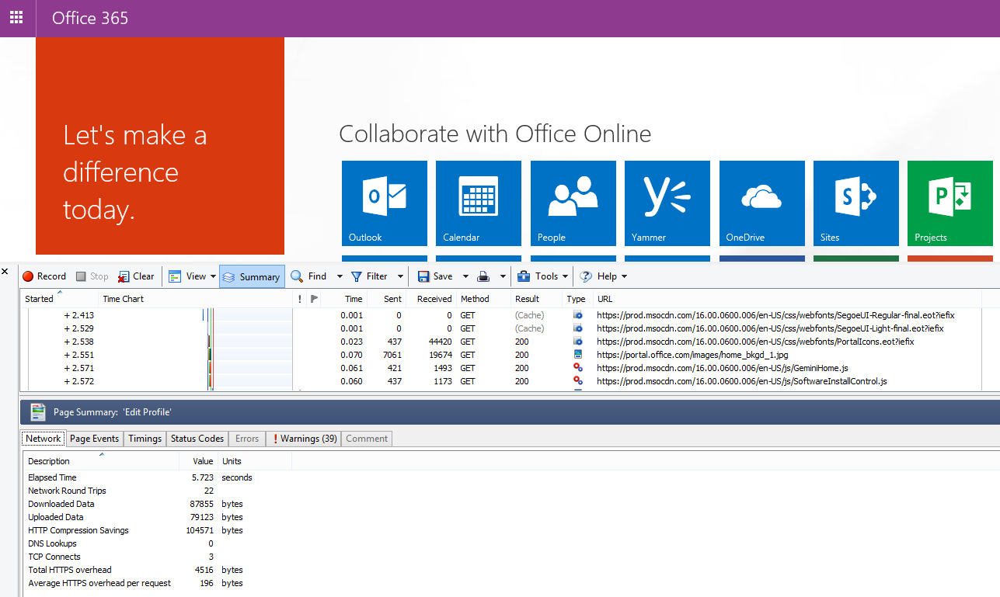
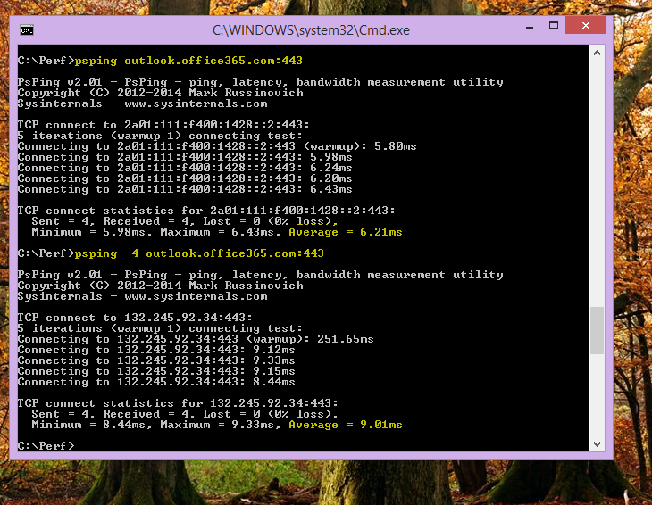

# <a name="performance-troubleshooting-plan-for-office-365"></a><span data-ttu-id="83af1-103">Piano di risoluzione dei problemi relativi alle prestazioni per Office 365</span><span class="sxs-lookup"><span data-stu-id="83af1-103">Performance troubleshooting plan for Office 365</span></span>

<span data-ttu-id="83af1-104">È necessario conoscere i passaggi da eseguire per identificare e correggere ritardi, blocchi e rallentamento delle prestazioni tra SharePoint Online, OneDrive for Business, Exchange Online o Skype for Business online e il computer client?</span><span class="sxs-lookup"><span data-stu-id="83af1-104">Do you need to know the steps to take to identify and fix lags, hangs, and slow performance between SharePoint Online, OneDrive for Business, Exchange Online, or Skype for Business Online, and your client computer?</span></span> <span data-ttu-id="83af1-105">Prima di chiamare il supporto, questo articolo consente di risolvere i problemi di prestazioni di Office 365 e anche risolvere alcuni dei problemi più comuni.</span><span class="sxs-lookup"><span data-stu-id="83af1-105">Before you call support, this article can help you troubleshoot Office 365 performance issues and even fix some of the most common issues.</span></span>

<span data-ttu-id="83af1-106">Questo articolo è in realtà un piano d'azione di esempio che puoi usare per acquisire dati importanti sul tuo problema di prestazioni mentre si verifica.</span><span class="sxs-lookup"><span data-stu-id="83af1-106">This article is actually a sample action plan that you can use to capture valuable data about your performance issue as it's happening.</span></span> <span data-ttu-id="83af1-107">In questo articolo sono inclusi anche alcuni problemi principali.</span><span class="sxs-lookup"><span data-stu-id="83af1-107">Some top issues are also included in this article.</span></span>

<span data-ttu-id="83af1-108">Se non si ha di che fare con le prestazioni di rete e si desidera creare un piano a lungo termine per monitorare le prestazioni tra i computer client e Office 365, vedere Ottimizzazione e risoluzione dei problemi delle prestazioni di [Office 365 - Amministratore](performance-tuning-using-baselines-and-history.md)e professionisti IT.</span><span class="sxs-lookup"><span data-stu-id="83af1-108">If you're new to network performance and want to make a long term plan to monitor performance between your client machines and Office 365, take a look at [Office 365 performance tuning and troubleshooting - Admin and IT Pro](performance-tuning-using-baselines-and-history.md).</span></span>

## <a name="sample-performance-troubleshooting-action-plan"></a><span data-ttu-id="83af1-109">Esempio di piano d'azione per la risoluzione dei problemi di prestazioni</span><span class="sxs-lookup"><span data-stu-id="83af1-109">Sample performance troubleshooting action plan</span></span>

<span data-ttu-id="83af1-110">Questo piano d'azione contiene due parti; una fase di preparazione e una fase di registrazione.</span><span class="sxs-lookup"><span data-stu-id="83af1-110">This action plan contains two parts; a preparation phase, and a logging phase.</span></span> <span data-ttu-id="83af1-111">Se al momento si verifica un problema di prestazioni ed è necessario eseguire la raccolta dei dati, è possibile iniziare subito a usare questo piano.</span><span class="sxs-lookup"><span data-stu-id="83af1-111">If you have a performance problem right now, and you need to do data collection, you can start using this plan right away.</span></span>

### <a name="prepare-the-client-computer"></a><span data-ttu-id="83af1-112">Preparare il computer client</span><span class="sxs-lookup"><span data-stu-id="83af1-112">Prepare the client computer</span></span>

- <span data-ttu-id="83af1-113">Individuare un computer client in grado di riprodurre il problema di prestazioni.</span><span class="sxs-lookup"><span data-stu-id="83af1-113">Find a client computer that can reproduce the performance problem.</span></span> <span data-ttu-id="83af1-114">Questo computer verrà utilizzato durante la risoluzione dei problemi.</span><span class="sxs-lookup"><span data-stu-id="83af1-114">This computer will be used during the course of troubleshooting.</span></span>
- <span data-ttu-id="83af1-115">Annota i passaggi che causano il problema di prestazioni in modo che tu sia pronto quando è il momento di testare.</span><span class="sxs-lookup"><span data-stu-id="83af1-115">Write down the steps that cause the performance problem to happen so you're ready when it comes time to test.</span></span>
- <span data-ttu-id="83af1-116">Installare gli strumenti per la raccolta e la registrazione delle informazioni:</span><span class="sxs-lookup"><span data-stu-id="83af1-116">Install tools for gathering and recording information:</span></span>
  - <span data-ttu-id="83af1-117">Installare [Netmon 3.4](https://www.microsoft.com/download/details.aspx?id=4865) (o usare uno strumento di traccia di rete equivalente).</span><span class="sxs-lookup"><span data-stu-id="83af1-117">Install [Netmon 3.4](https://www.microsoft.com/download/details.aspx?id=4865) (or use an equivalent network tracing tool).</span></span>
  - <span data-ttu-id="83af1-118">Installare l'edizione basica gratuita di [HTTPWatch](https://www.httpwatch.com/download/) (o usare uno strumento di traccia di rete equivalente).</span><span class="sxs-lookup"><span data-stu-id="83af1-118">Install the free Basic Edition of [HTTPWatch](https://www.httpwatch.com/download/) (or use an equivalent network Tracing tool).</span></span>
  - <span data-ttu-id="83af1-119">Usa un registratore dello schermo o esegui il registratore di passaggi (PSR.exe) fornito con Windows Vista e versioni successive, per tenere traccia dei passaggi da eseguire durante i test.</span><span class="sxs-lookup"><span data-stu-id="83af1-119">Use a screen recorder or run the Steps Recorder (PSR.exe) that comes with Windows Vista and later, in order to keep a record of the steps you take during testing.</span></span>

### <a name="log-the-performance-issue"></a><span data-ttu-id="83af1-120">Registrare il problema di prestazioni</span><span class="sxs-lookup"><span data-stu-id="83af1-120">Log the performance issue</span></span>

- <span data-ttu-id="83af1-121">Chiudere tutti i browser Internet estranei.</span><span class="sxs-lookup"><span data-stu-id="83af1-121">Close all extraneous Internet browsers.</span></span>
- <span data-ttu-id="83af1-122">Avviare il registratore di passaggi o un altro registratore dello schermo.</span><span class="sxs-lookup"><span data-stu-id="83af1-122">Start the Steps Recorder, or another screen recorder.</span></span>
- <span data-ttu-id="83af1-123">Avviare l'acquisizione Netmon (o lo strumento di traccia di rete).</span><span class="sxs-lookup"><span data-stu-id="83af1-123">Start your Netmon capture (or network tracing tool).</span></span>
- <span data-ttu-id="83af1-124">Cancellare la cache DNS nel computer client dalla riga di comando digitando ipconfig /flushdns.</span><span class="sxs-lookup"><span data-stu-id="83af1-124">Clear your DNS cache on the client computer from the command line by typing ipconfig /flushdns.</span></span>
- <span data-ttu-id="83af1-125">Avvia una nuova sessione del browser e attiva HTTPWatch.</span><span class="sxs-lookup"><span data-stu-id="83af1-125">Start a new browser session and turn on HTTPWatch.</span></span>
- <span data-ttu-id="83af1-126">Facoltativo: se si sta testando Exchange Online, eseguire lo strumento Exchange Client Performance Analyzer dalla console di amministrazione di Office 365.</span><span class="sxs-lookup"><span data-stu-id="83af1-126">Optional: If you are testing Exchange Online, run the Exchange Client Performance Analyzer tool from the Office 365 admin console.</span></span>
- <span data-ttu-id="83af1-127">Riprodurre i passaggi esatti che causano il problema di prestazioni.</span><span class="sxs-lookup"><span data-stu-id="83af1-127">Reproduce the exact steps that cause the performance issue.</span></span>
- <span data-ttu-id="83af1-128">Arrestare la traccia di Netmon o di un altro strumento.</span><span class="sxs-lookup"><span data-stu-id="83af1-128">Stop your Netmon or other tool's trace.</span></span>
- <span data-ttu-id="83af1-129">Nella riga di comando eseguire una route di traccia per l'abbonamento a Office 365 digitando il comando seguente e quindi premendo INVIO:</span><span class="sxs-lookup"><span data-stu-id="83af1-129">At the command line, run a trace route to your Office 365 subscription by typing the following command and then pressing ENTER:</span></span>

  ``` cmd
  tracert <subscriptionname>.onmicrosoft.com
  ```

- <span data-ttu-id="83af1-130">Arrestare Il registratore di passaggi e salvare il video.</span><span class="sxs-lookup"><span data-stu-id="83af1-130">Stop the Steps Recorder and save the video.</span></span> <span data-ttu-id="83af1-131">Assicurati di includere la data e l'ora dell'acquisizione e se dimostra prestazioni buone o non ottimali.</span><span class="sxs-lookup"><span data-stu-id="83af1-131">Be sure to include the date and time of the capture and whether it demonstrates good or bad performance.</span></span>
- <span data-ttu-id="83af1-132">Salvare i file di traccia.</span><span class="sxs-lookup"><span data-stu-id="83af1-132">Save the trace files.</span></span> <span data-ttu-id="83af1-133">Anche in questo caso, assicurati di includere la data e l'ora dell'acquisizione e se dimostra prestazioni buone o non ottimali.</span><span class="sxs-lookup"><span data-stu-id="83af1-133">Again, be sure to include the date and time of the capture and whether it demonstrates good or bad performance.</span></span>

<span data-ttu-id="83af1-134">Se non hai familiarità con l'esecuzione degli strumenti menzionati in questo articolo, non preoccuparti perché questi passaggi vengono forniti successivamente.</span><span class="sxs-lookup"><span data-stu-id="83af1-134">If you're not familiar with running the tools mentioned in this article, don't worry because we provide those steps next.</span></span> <span data-ttu-id="83af1-135">Se si è abituati a eseguire questo tipo di acquisizione di rete, è possibile passare a [Come](performance-tuning-using-baselines-and-history.md#how-to-collect-baselines)raccogliere le linee di base, che descrive il filtro e la lettura dei log.</span><span class="sxs-lookup"><span data-stu-id="83af1-135">If you're accustomed to doing this kind of network capturing, you can skip to [How to collect baselines](performance-tuning-using-baselines-and-history.md#how-to-collect-baselines), which describes filtering and reading the logs.</span></span>

### <a name="flush-the-dns-cache-first"></a><span data-ttu-id="83af1-136">Scaricare prima la cache DNS</span><span class="sxs-lookup"><span data-stu-id="83af1-136">Flush the DNS Cache first</span></span>

<span data-ttu-id="83af1-137">Perché?</span><span class="sxs-lookup"><span data-stu-id="83af1-137">Why?</span></span> <span data-ttu-id="83af1-138">Lo svuotamento della cache DNS consente di avviare i test con una lavagna pulita.</span><span class="sxs-lookup"><span data-stu-id="83af1-138">By flushing out the DNS cache you're starting your tests with a clean slate.</span></span> <span data-ttu-id="83af1-139">Cancellando la cache, si reimposta il contenuto del resolver DNS alle voci più aggiornate.</span><span class="sxs-lookup"><span data-stu-id="83af1-139">By clearing the cache, you're resetting the DNS resolver contents to the most up-to-date entries.</span></span> <span data-ttu-id="83af1-140">Tenere presente che uno scaricamento non rimuove le voci dei file HOTS.</span><span class="sxs-lookup"><span data-stu-id="83af1-140">Remember that a flush does not remove HOSTs file entries.</span></span> <span data-ttu-id="83af1-141">Se si utilizzano ampiamente le voci di file HOST, è consigliabile copiare tali voci in un file in un'altra directory e quindi svuotare il file HOST.</span><span class="sxs-lookup"><span data-stu-id="83af1-141">If you use HOST file entries extensively, you should copy those entries out to a file in another directory and then empty the HOST file.</span></span>

#### <a name="flush-your-dns-resolver-cache"></a><span data-ttu-id="83af1-142">Scaricare la cache del resolver DNS</span><span class="sxs-lookup"><span data-stu-id="83af1-142">Flush your DNS resolver cache</span></span>

1. <span data-ttu-id="83af1-143">Aprire il prompt dei comandi ( **start** \> **Run** \> **cmd** o **windows key** \> **cmd**).</span><span class="sxs-lookup"><span data-stu-id="83af1-143">Open the command prompt, (either **Start** \> **Run** \> **cmd** or **Windows key** \> **cmd**).</span></span>
2. <span data-ttu-id="83af1-144">Digitare il comando seguente e premere INVIO:</span><span class="sxs-lookup"><span data-stu-id="83af1-144">Type the following command and press ENTER:</span></span>

    ``` cmd
    ipconfig /flushdns
    ```

## <a name="netmon"></a><span data-ttu-id="83af1-145">Netmon</span><span class="sxs-lookup"><span data-stu-id="83af1-145">Netmon</span></span>

<span data-ttu-id="83af1-146">Lo strumento Di monitoraggio di rete di Microsoft ([Netmon](https://www.microsoft.com/download/details.aspx?id=4865)) analizza i pacchetti, ovvero il traffico, che passano tra computer in reti.</span><span class="sxs-lookup"><span data-stu-id="83af1-146">Microsoft's Network Monitoring tool ([Netmon](https://www.microsoft.com/download/details.aspx?id=4865)) analyzes packets, that is traffic, that passes between computers on networks.</span></span> <span data-ttu-id="83af1-147">Usando Netmon per tracciare il traffico con Office 365, è possibile acquisire, visualizzare e leggere le intestazioni dei pacchetti, identificare i dispositivi interessati, controllare le impostazioni importanti nell'hardware di rete, cercare i pacchetti eliminati e seguire il flusso di traffico tra i computer della rete aziendale e Office 365.</span><span class="sxs-lookup"><span data-stu-id="83af1-147">By using Netmon to trace traffic with Office 365 you can capture, view, and read packet headers, identify intervening devices, check important settings on network hardware, look for dropped packets, and follow the flow of traffic between computers on your corporate network and Office 365.</span></span> <span data-ttu-id="83af1-148">Poiché il corpo effettivo del traffico è crittografato, ovvero(viaggia sulla porta 443 tramite SSL/TLS, non è possibile leggere i file inviati.</span><span class="sxs-lookup"><span data-stu-id="83af1-148">Because the actual body of the traffic is encrypted, that is, it(travels on port 443 via SSL/TLS, you can't read the files being sent.</span></span> <span data-ttu-id="83af1-149">Al contrario, ottieni una traccia non filtrata del percorso che il pacchetto prende, che può aiutarti a tenere traccia del comportamento del problema.</span><span class="sxs-lookup"><span data-stu-id="83af1-149">Instead, you get an unfiltered trace of the path that the packet takes which can help you track down the problem behavior.</span></span>

<span data-ttu-id="83af1-150">Assicurarsi di non applicare un filtro in questo momento.</span><span class="sxs-lookup"><span data-stu-id="83af1-150">Be sure you don't apply a filter at this time.</span></span> <span data-ttu-id="83af1-151">Eseguire invece i passaggi e illustrare il problema prima di arrestare la traccia e il salvataggio.</span><span class="sxs-lookup"><span data-stu-id="83af1-151">Instead, run through the steps and demonstrate the problem before stopping the trace and saving.</span></span>

<span data-ttu-id="83af1-152">Dopo aver installato Netmon 3.4, aprire lo strumento ed eseguire la procedura seguente:</span><span class="sxs-lookup"><span data-stu-id="83af1-152">After you install Netmon 3.4, open the tool and take these steps:</span></span>

### <a name="take-a-netmon-trace-and-reproduce-the-issue"></a><span data-ttu-id="83af1-153">Eseguire una traccia Netmon e riprodurre il problema</span><span class="sxs-lookup"><span data-stu-id="83af1-153">Take a Netmon trace and reproduce the issue</span></span>

1. <span data-ttu-id="83af1-154">Avviare Netmon 3.4.</span><span class="sxs-lookup"><span data-stu-id="83af1-154">Launch Netmon 3.4.</span></span>
<span data-ttu-id="83af1-155">Nella pagina iniziale sono  disponibili tre riquadri: Acquisizioni **recenti,** Seleziona reti e Introduzione a Microsoft Network Monitor **3.4. Nota**.</span><span class="sxs-lookup"><span data-stu-id="83af1-155">There are three panes on the **Start** page: **Recent Captures**, **Select Networks**, and the **Getting Started with Microsoft Network Monitor 3.4. Notice**.</span></span> <span data-ttu-id="83af1-156">Il pannello Seleziona reti fornisce anche un elenco delle reti predefinite da cui è possibile acquisire.</span><span class="sxs-lookup"><span data-stu-id="83af1-156">The Select Networks panel will also give you a list of the default networks from which you can capture.</span></span> <span data-ttu-id="83af1-157">Assicurarsi che le schede di rete siano selezionate qui.</span><span class="sxs-lookup"><span data-stu-id="83af1-157">Be sure that network cards are selected here.</span></span>

2. <span data-ttu-id="83af1-158">Fai **clic su Nuova** acquisizione nella parte superiore della **pagina** iniziale.</span><span class="sxs-lookup"><span data-stu-id="83af1-158">Click **New Capture** at the top of the **Start** page.</span></span> <span data-ttu-id="83af1-159">Verrà aggiunta una nuova scheda accanto alla **scheda Pagina iniziale** denominata Acquisizione **1.**</span><span class="sxs-lookup"><span data-stu-id="83af1-159">This adds a new tab beside the **Start** page tab called **Capture 1**.</span></span>
<span data-ttu-id="83af1-160"></span><span class="sxs-lookup"><span data-stu-id="83af1-160"></span></span>

3. <span data-ttu-id="83af1-161">Per eseguire un'acquisizione semplice, fare clic **su Avvia** sulla barra degli strumenti.</span><span class="sxs-lookup"><span data-stu-id="83af1-161">To take a simple capture, click **Start** on the toolbar.</span></span>

4. <span data-ttu-id="83af1-162">Riprodurre i passaggi che presentano un problema di prestazioni.</span><span class="sxs-lookup"><span data-stu-id="83af1-162">Reproduce the steps that present a performance issue.</span></span>

5. <span data-ttu-id="83af1-163">Fare **clic su** \> **Interrompi salvataggio** file con \> **nome.**</span><span class="sxs-lookup"><span data-stu-id="83af1-163">Click **Stop** \> **File** \> **Save As**.</span></span> <span data-ttu-id="83af1-164">Ricordarsi di fornire la data e l'ora con il fuso orario e di menzionare se dimostra prestazioni buone o non buone.</span><span class="sxs-lookup"><span data-stu-id="83af1-164">Remember to give the date and time with the time zone and to mention if it demonstrates bad or good performance.</span></span>

## <a name="httpwatch"></a><span data-ttu-id="83af1-165">HTTPWatch</span><span class="sxs-lookup"><span data-stu-id="83af1-165">HTTPWatch</span></span>

<span data-ttu-id="83af1-166">[HTTPWatch](https://www.httpwatch.com/download/) viene addebitato e un'edizione gratuita.</span><span class="sxs-lookup"><span data-stu-id="83af1-166">[HTTPWatch](https://www.httpwatch.com/download/) comes in charged, and a free edition.</span></span> <span data-ttu-id="83af1-167">L'edizione Basic gratuita copre tutto ciò di cui hai bisogno per questo test.</span><span class="sxs-lookup"><span data-stu-id="83af1-167">The free Basic Edition covers everything you need for this test.</span></span> <span data-ttu-id="83af1-168">HTTPWatch monitora il traffico di rete e il tempo di caricamento delle pagine direttamente dalla finestra del browser.</span><span class="sxs-lookup"><span data-stu-id="83af1-168">HTTPWatch monitors network traffic and page load time right from your browser window.</span></span> <span data-ttu-id="83af1-169">HTTPWatch è un plug-in di Internet Explorer che descrive graficamente le prestazioni.</span><span class="sxs-lookup"><span data-stu-id="83af1-169">HTTPWatch is a plug-in to Internet Explorer that graphically describes performance.</span></span> <span data-ttu-id="83af1-170">L'analisi può essere salvata e visualizzata in HTTPWatch Studio.</span><span class="sxs-lookup"><span data-stu-id="83af1-170">The analysis can be saved and viewed in HTTPWatch Studio.</span></span>

> [!NOTE]
> <span data-ttu-id="83af1-171">Se usi un altro browser, ad esempio Firefox, Google Chrome o se non riesci a installare HTTPWatch in Internet Explorer, apri una nuova finestra del browser e premi F12 sulla tastiera.</span><span class="sxs-lookup"><span data-stu-id="83af1-171">If you use another browser, such as Firefox, Google Chrome, or if you can't install HTTPWatch in Internet Explorer, open a new browser window and press F12 on your keyboard.</span></span> <span data-ttu-id="83af1-172">Nella parte inferiore del browser dovrebbe essere visualizzato il popup Strumento di sviluppo.</span><span class="sxs-lookup"><span data-stu-id="83af1-172">You should see the Developer Tool pop-up at the bottom of your browser.</span></span> <span data-ttu-id="83af1-173">Se si utilizza Opera, premere CTRL+MAIUSC+I per Controllo Web, quindi fare clic sulla **scheda Rete** e completare il test descritto di seguito.</span><span class="sxs-lookup"><span data-stu-id="83af1-173">If you use Opera, press CTRL+SHIFT+I for Web Inspector, then click the **Network** tab and complete the testing outlined below.</span></span> <span data-ttu-id="83af1-174">Le informazioni saranno leggermente diverse, ma i tempi di caricamento verranno comunque visualizzati in millisecondi.</span><span class="sxs-lookup"><span data-stu-id="83af1-174">The information will be slightly different, but load times will still be displayed in milliseconds.</span></span> <span data-ttu-id="83af1-175">> HTTPWatch è molto utile anche per i problemi relativi ai tempi di caricamento delle pagine di SharePoint Online.</span><span class="sxs-lookup"><span data-stu-id="83af1-175">> HTTPWatch is also very useful for issues with SharePoint Online page load times.</span></span>

### <a name="run-httpwatch-and-reproduce-the-issue"></a><span data-ttu-id="83af1-176">Eseguire HTTPWatch e riprodurre il problema</span><span class="sxs-lookup"><span data-stu-id="83af1-176">Run HTTPWatch and reproduce the issue</span></span>

<span data-ttu-id="83af1-177">HTTPWatch è un plug-in del browser, quindi l'esposizione dello strumento nel browser è leggermente diversa per ogni versione di Internet Explorer.</span><span class="sxs-lookup"><span data-stu-id="83af1-177">HTTPWatch is a browser plug-in, so exposing the tool in the browser is slightly different for each version of Internet Explorer.</span></span> <span data-ttu-id="83af1-178">In genere, puoi trovare HTTPWatch sotto la barra dei comandi nel browser Internet Explorer.</span><span class="sxs-lookup"><span data-stu-id="83af1-178">Typically, you can find HTTPWatch under the Commands bar in the Internet Explorer browser.</span></span> <span data-ttu-id="83af1-179">Se il plug-in HTTPWatch non viene visualizzato nella finestra del browser, controllare la versione del browser facendo clic su **?** oppure nelle versioni successive di Internet Explorer fare clic sul simbolo dell'ingranaggio e su \>  **Internet Explorer.**</span><span class="sxs-lookup"><span data-stu-id="83af1-179">If you don't see the HTTPWatch plug-in in your browser window, check the version of your browser by clicking **Help** \> **About**, or in later versions of Internet Explorer, click the gear symbol and **About Internet Explorer**.</span></span> <span data-ttu-id="83af1-180">Per avviare la barra **dei** comandi, fare clic con il pulsante destro del mouse sulla barra dei menu in Internet Explorer e scegliere **Barra dei comandi.**</span><span class="sxs-lookup"><span data-stu-id="83af1-180">To launch the **Commands** bar, right-click the menu bar in Internet Explorer and click **Commands bar**.</span></span>

<span data-ttu-id="83af1-181">In passato, HTTPWatch è stato associato sia ai comandi che alle barre di Explorer, quindi dopo l'installazione, se non vedi immediatamente l'icona (anche dopo il riavvio) controlla Strumenti **e** le barre degli strumenti per l'icona.</span><span class="sxs-lookup"><span data-stu-id="83af1-181">In the past, HTTPWatch has been associated with both the Commands and the Explorer bars, so once you install, if you don't immediately see the icon (even after reboot) check **Tools**, and your toolbars for the icon.</span></span> <span data-ttu-id="83af1-182">Tenere presente che le barre degli strumenti possono essere personalizzate e le opzioni possono essere aggiunte.</span><span class="sxs-lookup"><span data-stu-id="83af1-182">Remember that toolbars can be customized and options can be added to them.</span></span>


1. <span data-ttu-id="83af1-184">Avvia HTTPWatch in una finestra del browser Internet Explorer.</span><span class="sxs-lookup"><span data-stu-id="83af1-184">Launch HTTPWatch in an Internet Explorer browser window.</span></span> <span data-ttu-id="83af1-185">Verrà visualizzato ancorato al browser nella parte inferiore della finestra.</span><span class="sxs-lookup"><span data-stu-id="83af1-185">It will appear docked to the browser at the bottom of that window.</span></span> <span data-ttu-id="83af1-186">Fare clic **su Record**.</span><span class="sxs-lookup"><span data-stu-id="83af1-186">Click **Record**.</span></span>

2. <span data-ttu-id="83af1-187">Riprodurre i passaggi esatti coinvolti nel problema di prestazioni.</span><span class="sxs-lookup"><span data-stu-id="83af1-187">Reproduce the exact steps involved in the performance issue.</span></span> <span data-ttu-id="83af1-188">Fai clic **sul pulsante** Interrompi in HTTPWatch.</span><span class="sxs-lookup"><span data-stu-id="83af1-188">Click the **Stop** button in HTTPWatch.</span></span>

3. <span data-ttu-id="83af1-189">**Salvare** HTTPWatch o **Send by Email**.</span><span class="sxs-lookup"><span data-stu-id="83af1-189">**Save** the HTTPWatch or **Send by Email**.</span></span> <span data-ttu-id="83af1-190">Ricordati di assegnare un nome al file in modo che includa informazioni su data e ora e un'indicazione se l'orologio contiene una dimostrazione di buone o non buone prestazioni.</span><span class="sxs-lookup"><span data-stu-id="83af1-190">Remember to name the file so that it includes date and time information and an indication of whether your Watch contains a demonstration of good or bad performance.</span></span>



<span data-ttu-id="83af1-192">Questa schermata è della versione Professional di HTTPWatch.</span><span class="sxs-lookup"><span data-stu-id="83af1-192">This screen shot is from the Professional version of HTTPWatch.</span></span> <span data-ttu-id="83af1-193">È possibile aprire le tracce nella versione di base in un computer con una versione Professional e leggerla qui.</span><span class="sxs-lookup"><span data-stu-id="83af1-193">You can open traces taken in the Basic Version on a computer with a Professional version and read it there.</span></span> <span data-ttu-id="83af1-194">Le informazioni aggiuntive possono essere disponibili dalla traccia tramite tale metodo.</span><span class="sxs-lookup"><span data-stu-id="83af1-194">Extra information may be available from the trace through that method.</span></span>

## <a name="problem-steps-recorder"></a><span data-ttu-id="83af1-195">Registrazione passaggi problema</span><span class="sxs-lookup"><span data-stu-id="83af1-195">Problem Steps Recorder</span></span>

<span data-ttu-id="83af1-196">Steps Recorder, o PSR.exe, consente di registrare i problemi mentre si verificano.</span><span class="sxs-lookup"><span data-stu-id="83af1-196">Steps Recorder, or PSR.exe, allows you to record issues as they are occurring.</span></span> <span data-ttu-id="83af1-197">È uno strumento molto utile e molto semplice da eseguire.</span><span class="sxs-lookup"><span data-stu-id="83af1-197">It's a very useful tool and very simple to run.</span></span>

### <a name="run-problem-steps-recorder-psrexe-to-record-your-work"></a><span data-ttu-id="83af1-198">Eseguire Problem Steps Recorder (PSR.exe) per registrare il lavoro</span><span class="sxs-lookup"><span data-stu-id="83af1-198">Run Problem Steps Recorder (PSR.exe) to record your work</span></span>

1. <span data-ttu-id="83af1-199">Utilizzare **Start** Run typePSR.exeOK oppure fare clic sul tipo di tasto WindowsPSR.exe\>  \> e  \> quindi  \> premere  \> INVIO.</span><span class="sxs-lookup"><span data-stu-id="83af1-199">Either use **Start** \> **Run** \> type **PSR.exe** \> **OK**, or, click the **Windows Key** \> type **PSR.exe** \> and then press ENTER.</span></span>

2. <span data-ttu-id="83af1-200">Quando viene visualizzata la finestra PSR.exe piccola finestra, fare clic su **Avvia record** e riprodurre i passaggi che riproducono il problema di prestazioni.</span><span class="sxs-lookup"><span data-stu-id="83af1-200">When the small PSR.exe window appears, click **Start Record** and reproduce the steps that reproduce the performance issue.</span></span> <span data-ttu-id="83af1-201">È possibile aggiungere commenti in base alle esigenze facendo clic **su Aggiungi commenti.**</span><span class="sxs-lookup"><span data-stu-id="83af1-201">You can add comments as needed, by clicking **Add Comments**.</span></span>

3. <span data-ttu-id="83af1-202">Dopo **aver completato i** passaggi, fare clic su Interrompi record.</span><span class="sxs-lookup"><span data-stu-id="83af1-202">Click **Stop Record** when you have completed the steps.</span></span> <span data-ttu-id="83af1-203">Se il problema di prestazioni è un rendering di pagina, attendere il rendering della pagina prima di interrompere la registrazione.</span><span class="sxs-lookup"><span data-stu-id="83af1-203">If the performance issue is a page render, wait for the page to render before you stop the recording.</span></span>

4. <span data-ttu-id="83af1-204">Fare clic su **Salva**.</span><span class="sxs-lookup"><span data-stu-id="83af1-204">Click **Save**.</span></span>


<span data-ttu-id="83af1-206">La data e l'ora vengono registrate per l'utente.</span><span class="sxs-lookup"><span data-stu-id="83af1-206">The date and time is recorded for you.</span></span> <span data-ttu-id="83af1-207">Questo collega psr alla traccia Netmon e HTTPWatch nel tempo e aiuta a risolvere i problemi di precisione.</span><span class="sxs-lookup"><span data-stu-id="83af1-207">This links your PSR to your Netmon trace and HTTPWatch in time, and helps with precision troubleshooting.</span></span> <span data-ttu-id="83af1-208">La data e l'ora nel record PSR possono mostrare, ad esempio, che è passato un minuto tra l'accesso e l'esplorazione dell'URL e il rendering parziale del sito di amministrazione.</span><span class="sxs-lookup"><span data-stu-id="83af1-208">The date and time in the PSR record can show that a minute passed between the login and browsing of the URL and the partial render of the admin site, for example.</span></span>

## <a name="read-your-traces"></a><span data-ttu-id="83af1-209">Leggere le tracce</span><span class="sxs-lookup"><span data-stu-id="83af1-209">Read your traces</span></span>

<span data-ttu-id="83af1-210">Non è possibile insegnare tutto sulla risoluzione dei problemi di rete e prestazioni che qualcuno dovrebbe conoscere tramite un articolo.</span><span class="sxs-lookup"><span data-stu-id="83af1-210">It isn't possible to teach everything about network and performance troubleshooting that someone would need to know via an article.</span></span> <span data-ttu-id="83af1-211">Ottenere prestazioni ottimali richiede esperienza e conoscenza del funzionamento e delle prestazioni della rete.</span><span class="sxs-lookup"><span data-stu-id="83af1-211">Getting good at performance takes experience, and knowledge of how your network works and usually performs.</span></span> <span data-ttu-id="83af1-212">Tuttavia, è possibile arrotondare un elenco dei problemi principali e mostrare come gli strumenti possano semplificare l'eliminazione dei problemi più comuni.</span><span class="sxs-lookup"><span data-stu-id="83af1-212">But it is possible to round up a list of top issues and show how tools can make it easier for you to eliminate the most common problems.</span></span>

<span data-ttu-id="83af1-213">Se si desidera acquisire competenze nella lettura delle tracce di rete per i siti di Office 365, non esiste un insegnante migliore che creare tracce di caricamenti di pagina regolarmente e acquisire esperienza nella lettura.</span><span class="sxs-lookup"><span data-stu-id="83af1-213">If you want to pick up skills reading network traces for your Office 365 sites, there is no better teacher than creating traces of page loads regularly and gaining experience reading them.</span></span> <span data-ttu-id="83af1-214">Ad esempio, quando è possibile, caricare un servizio di Office 365 e tracciare il processo.</span><span class="sxs-lookup"><span data-stu-id="83af1-214">For example, when you have a chance, load an Office 365 service and trace the process.</span></span> <span data-ttu-id="83af1-215">Filtrare la traccia per il traffico DNS oppure cercare in FrameData il nome del servizio visualizzato.</span><span class="sxs-lookup"><span data-stu-id="83af1-215">Filter the trace for DNS traffic, or search the FrameData for the name of the service you browsed.</span></span> <span data-ttu-id="83af1-216">Analizzare la traccia per avere un'idea dei passaggi che si verificano al caricamento del servizio.</span><span class="sxs-lookup"><span data-stu-id="83af1-216">Scan the trace to get an idea of the steps that occur when the service loads.</span></span> <span data-ttu-id="83af1-217">In questo modo è possibile scoprire l'aspetto normale del caricamento delle pagine e, nel caso della risoluzione dei problemi, in particolare per quanto riguarda le prestazioni, il confronto tra tracce buone e tracce non buone può essere molto utile.</span><span class="sxs-lookup"><span data-stu-id="83af1-217">This will help you learn what normal page load should look like, and in the case of troubleshooting, particularly around performance, comparing good to bad traces can teach you a lot.</span></span>

<span data-ttu-id="83af1-218">Netmon utilizza Microsoft Intellisense nel campo Filtro visualizzazione.</span><span class="sxs-lookup"><span data-stu-id="83af1-218">Netmon uses Microsoft Intellisense in the Display filter field.</span></span> <span data-ttu-id="83af1-219">Intellisense, o completamento intelligente del codice, è il trucco in cui si digita un punto e tutte le opzioni disponibili vengono visualizzate in una casella di selezione a discesa.</span><span class="sxs-lookup"><span data-stu-id="83af1-219">Intellisense, or intelligent code completion, is that trick where you type in a period and all available options are displayed in a drop-down selection box.</span></span> <span data-ttu-id="83af1-220">Se, ad esempio, si è preoccupati per il ridimensionamento della finestra TCP, è possibile trovare la strada per un filtro (ad esempio  `.protocol.tcp.window < 100` ) in questo modo.</span><span class="sxs-lookup"><span data-stu-id="83af1-220">If, for example, you are worried about TCP window scaling, you can find your way to a filter (such as  `.protocol.tcp.window < 100`) by this means.</span></span>


<span data-ttu-id="83af1-222">Le tracce Netmon possono contenere molto traffico.</span><span class="sxs-lookup"><span data-stu-id="83af1-222">Netmon traces can have a lot of traffic in them.</span></span> <span data-ttu-id="83af1-223">Se non si ha esperienza con la lettura, è probabile che si sarà sovraccaricato aprendo la traccia la prima volta.</span><span class="sxs-lookup"><span data-stu-id="83af1-223">If you aren't experienced with reading them, it's likely you will be overwhelmed opening the trace the first time.</span></span> <span data-ttu-id="83af1-224">La prima operazione da eseguire è separare il segnale dal rumore di fondo nella traccia.</span><span class="sxs-lookup"><span data-stu-id="83af1-224">The first thing to do is separate the signal from the background noise in the trace.</span></span> <span data-ttu-id="83af1-225">È stato testato con Office 365 e questo è il traffico che si desidera visualizzare.</span><span class="sxs-lookup"><span data-stu-id="83af1-225">You tested against Office 365, and that's the traffic you want to see.</span></span> <span data-ttu-id="83af1-226">Se si è utilizzati per spostarsi tra le tracce, potrebbe non essere necessario questo elenco.</span><span class="sxs-lookup"><span data-stu-id="83af1-226">If you are used to navigating through traces, you may not need this list.</span></span>

<span data-ttu-id="83af1-227">Il traffico tra il client e Office 365 viaggia tramite TLS, il che significa che il corpo del traffico verrà crittografato e non leggibile in una traccia Netmon generica.</span><span class="sxs-lookup"><span data-stu-id="83af1-227">Traffic between your client and Office 365 travels via TLS, which means that the body of the traffic will be encrypted and not readable in a generic Netmon trace.</span></span> <span data-ttu-id="83af1-228">L'analisi delle prestazioni non deve conoscere le specifiche delle informazioni nel pacchetto.</span><span class="sxs-lookup"><span data-stu-id="83af1-228">Your performance analysis doesn't need to know the specifics of the information in the packet.</span></span> <span data-ttu-id="83af1-229">Tuttavia, è molto interessato alle intestazioni dei pacchetti e alle informazioni che contengono.</span><span class="sxs-lookup"><span data-stu-id="83af1-229">It is, however, very interested in packet headers and the information that they contain.</span></span>

### <a name="tips-to-get-a-good-trace"></a><span data-ttu-id="83af1-230">Suggerimenti per ottenere una buona traccia</span><span class="sxs-lookup"><span data-stu-id="83af1-230">Tips to get a good trace</span></span>

- <span data-ttu-id="83af1-231">Conoscere il valore dell'indirizzo IPv4 o IPv6 del computer client.</span><span class="sxs-lookup"><span data-stu-id="83af1-231">Know the value of the IPv4 or IPv6 address of your client computer.</span></span> <span data-ttu-id="83af1-232">È possibile ottenere questa operazione dal prompt dei comandi **digitando IPConfig** e quindi premendo INVIO.</span><span class="sxs-lookup"><span data-stu-id="83af1-232">You can get this from the command prompt by typing **IPConfig** and then pressing ENTER.</span></span> <span data-ttu-id="83af1-233">Conoscere questo indirizzo ti permetterà di capire a colpo d'occhio se il traffico nella traccia coinvolge direttamente il computer client.</span><span class="sxs-lookup"><span data-stu-id="83af1-233">Knowing this address will let you tell at a glance whether the traffic in the trace directly involves your client computer.</span></span> <span data-ttu-id="83af1-234">Se è presente un proxy noto, eseguirne il ping e ottenere anche l'indirizzo IP.</span><span class="sxs-lookup"><span data-stu-id="83af1-234">If there is a known proxy, ping it and get its IP address as well.</span></span>

- <span data-ttu-id="83af1-235">Svuotare la cache del resolver DNS e, se possibile, chiudere tutti i browser ad eccezione di quello in cui si eseguono i test.</span><span class="sxs-lookup"><span data-stu-id="83af1-235">Flush your DNS resolver cache and, if possible, close all browsers except the one in which you are running your tests.</span></span> <span data-ttu-id="83af1-236">Se non si è in grado di eseguire questa operazione, ad esempio se il supporto utilizza uno strumento basato su browser per visualizzare il desktop del computer client, prepararsi a filtrare la traccia.</span><span class="sxs-lookup"><span data-stu-id="83af1-236">If you are not able to do this, for instance, if support is using some browser-based tool to see your client computer's desktop, be prepared to filter your trace.</span></span>

- <span data-ttu-id="83af1-237">In una traccia occupata individuare il servizio Office 365 in uso.</span><span class="sxs-lookup"><span data-stu-id="83af1-237">In a busy trace, locate the Office 365 service that you're using.</span></span> <span data-ttu-id="83af1-238">Se il traffico non è mai stato visto o raramente, questo è un passaggio utile per separare il problema di prestazioni da altri rumori di rete.</span><span class="sxs-lookup"><span data-stu-id="83af1-238">If you've never or seldom seen your traffic before, this is a helpful step in separating the performance issue from other network noise.</span></span> <span data-ttu-id="83af1-239">Esistono diversi modi per eseguire questa operazione.</span><span class="sxs-lookup"><span data-stu-id="83af1-239">There are a few ways to do this.</span></span> <span data-ttu-id="83af1-240">Direttamente prima del test, è possibile utilizzare _ping_ o _PsPing_ sull'URL del servizio specifico ( `ping outlook.office365.com` o , ad `psping -4 microsoft-my.sharepoint.com:443` esempio).</span><span class="sxs-lookup"><span data-stu-id="83af1-240">Directly before your test, you can use _ping_ or _PsPing_ against the URL of the specific service (`ping outlook.office365.com` or `psping -4 microsoft-my.sharepoint.com:443`, for example).</span></span> <span data-ttu-id="83af1-241">Puoi anche trovare facilmente il ping o PsPing in una traccia Netmon (in base al nome del processo).</span><span class="sxs-lookup"><span data-stu-id="83af1-241">You can also easily find that ping or PsPing in a Netmon trace (by its process name).</span></span> <span data-ttu-id="83af1-242">In questo modo è possibile iniziare a cercare.</span><span class="sxs-lookup"><span data-stu-id="83af1-242">That will give you a place to start looking.</span></span>

<span data-ttu-id="83af1-243">Se stai usando solo l'analisi Netmon al momento del problema, va bene anche questo.</span><span class="sxs-lookup"><span data-stu-id="83af1-243">If you're only using Netmon tracing at the time of the problem, that's okay too.</span></span> <span data-ttu-id="83af1-244">Per orientarsi, utilizzare un filtro come `ContainsBin(FrameData, ASCII, "office")` o `ContainsBin(FrameData, ASCII, "outlook")` .</span><span class="sxs-lookup"><span data-stu-id="83af1-244">To orient yourself, use a filter like `ContainsBin(FrameData, ASCII, "office")` or `ContainsBin(FrameData, ASCII, "outlook")`.</span></span> <span data-ttu-id="83af1-245">È possibile registrare il numero di fotogramma dal file di traccia.</span><span class="sxs-lookup"><span data-stu-id="83af1-245">You can record your frame number from the trace file.</span></span> <span data-ttu-id="83af1-246">Potresti anche voler scorrere il riquadro _Riepilogo_ frame fino a destra e cercare la colonna ID conversazione.</span><span class="sxs-lookup"><span data-stu-id="83af1-246">You may also want to scroll the _Frame Summary_ pane all the way to the right and look for the Conversation ID column.</span></span> <span data-ttu-id="83af1-247">È presente un numero per l'ID di questa conversazione specifica che è anche possibile registrare e osservare in isolamento in un secondo momento.</span><span class="sxs-lookup"><span data-stu-id="83af1-247">There is a number indicated there for the ID of this specific conversation that you can also record and look at in isolation later.</span></span> <span data-ttu-id="83af1-248">Ricordarsi di rimuovere questo filtro prima di applicare qualsiasi altro filtro.</span><span class="sxs-lookup"><span data-stu-id="83af1-248">Remember to remove this filter before applying any other filtering.</span></span>

> [!TIP]
> <span data-ttu-id="83af1-249">Netmon include molti filtri incorporati utili.</span><span class="sxs-lookup"><span data-stu-id="83af1-249">Netmon has a lot of helpful built-in filters.</span></span> <span data-ttu-id="83af1-250">Prova il **pulsante Carica** filtro nella parte superiore del _riquadro Filtro_ di visualizzazione.</span><span class="sxs-lookup"><span data-stu-id="83af1-250">Try the **Load Filter** button at the top of the _Display_ filter pane.</span></span>




<span data-ttu-id="83af1-253">Acquisire familiarità con il traffico e imparare a individuare le informazioni necessarie.</span><span class="sxs-lookup"><span data-stu-id="83af1-253">Get familiar with your traffic, and learn to locate the information you need.</span></span> <span data-ttu-id="83af1-254">Ad esempio, informazioni su come determinare quale pacchetto nella traccia contiene il primo riferimento al servizio Office 365 in uso (ad esempio "Outlook").</span><span class="sxs-lookup"><span data-stu-id="83af1-254">For example, learn to determine which packet in the trace has the first reference to the Office 365 service you're using (like "Outlook").</span></span>

<span data-ttu-id="83af1-255">Prendendo Office 365 Outlook Online come esempio, il traffico inizia come segue:</span><span class="sxs-lookup"><span data-stu-id="83af1-255">Taking Office 365 Outlook Online as an example, the traffic begins something like this:</span></span>

- <span data-ttu-id="83af1-256">Dns Standard Query e DNS Response per outlook.office365.com query con QueryIDs corrispondenti.</span><span class="sxs-lookup"><span data-stu-id="83af1-256">DNS Standard Query and DNS Response for outlook.office365.com with matching QueryIDs.</span></span> <span data-ttu-id="83af1-257">È importante notare lo scostamento temporale per questo turn-around, nonché dove nel mondo il DNS globale di Office 365 invia la richiesta di risoluzione dei nomi.</span><span class="sxs-lookup"><span data-stu-id="83af1-257">It's important to note the time offset for this turn-around, as well as where in the world the Office 365 Global DNS sends the request for name resolution.</span></span> <span data-ttu-id="83af1-258">Idealmente, nel modo più locale possibile, anziché a metà strada in tutto il mondo.</span><span class="sxs-lookup"><span data-stu-id="83af1-258">Ideally, as locally as possible, rather than halfway across the world.</span></span>

- <span data-ttu-id="83af1-259">Una richiesta HTTP GET la cui relazione sullo stato è stata spostata definitivamente (301)</span><span class="sxs-lookup"><span data-stu-id="83af1-259">A HTTP GET Request whose status report Moved Permanently (301)</span></span>

- <span data-ttu-id="83af1-260">Traffico RWS, incluse le richieste di Connessione RWS e le risposte Connect.</span><span class="sxs-lookup"><span data-stu-id="83af1-260">RWS Traffic including RWS Connect requests and Connect replies.</span></span> <span data-ttu-id="83af1-261">Si tratta di Winsock remoto che effettua una connessione.</span><span class="sxs-lookup"><span data-stu-id="83af1-261">(This is Remote Winsock making a connection for you.)</span></span>

- <span data-ttu-id="83af1-262">Una conversazione SYN TCP e TCP SYN/ACK.</span><span class="sxs-lookup"><span data-stu-id="83af1-262">A TCP SYN and TCP SYN/ACK conversation.</span></span> <span data-ttu-id="83af1-263">Molte impostazioni di questa conversazione influiscono sulle prestazioni.</span><span class="sxs-lookup"><span data-stu-id="83af1-263">A lot of the settings in this conversation impact your performance.</span></span>

- <span data-ttu-id="83af1-264">Quindi, una serie di traffico TLS:TLS che è dove si svolgono le conversazioni di handshake TLS e certificato TLS.</span><span class="sxs-lookup"><span data-stu-id="83af1-264">Then a series of TLS:TLS traffic which is where the TLS handshake and TLS certificate conversations take place.</span></span> <span data-ttu-id="83af1-265">Tenere presente che i dati vengono crittografati tramite SSL/TLS.</span><span class="sxs-lookup"><span data-stu-id="83af1-265">(Remember the data is encrypted via SSL/TLS.)</span></span>

<span data-ttu-id="83af1-266">Tutte le parti del traffico sono importanti e connesse, ma piccole parti della traccia contengono informazioni particolarmente importanti in termini di risoluzione dei problemi relativi alle prestazioni, quindi ci concentreremo su tali aree.</span><span class="sxs-lookup"><span data-stu-id="83af1-266">All parts of the traffic are important and connected, but small portions of the trace contain information particularly important in terms of performance troubleshooting, so we'll focus on those areas.</span></span> <span data-ttu-id="83af1-267">Inoltre, poiché è stata eseguita una sufficiente risoluzione dei problemi di prestazioni di Office 365 in Microsoft per compilare un elenco top ten di problemi comuni, ci concentreremo su questi problemi e su come usare gli strumenti necessari per radicarli successivamente.</span><span class="sxs-lookup"><span data-stu-id="83af1-267">Also, since we've done enough Office 365 performance troubleshooting at Microsoft to compile a Top Ten list of common problems, we'll focus on those issues and how to use the tools we have to root them out next.</span></span>

<span data-ttu-id="83af1-268">Se non sono stati installati tutti pronti, la matrice seguente usa diversi strumenti.</span><span class="sxs-lookup"><span data-stu-id="83af1-268">If you haven't installed them all ready, the matrix below makes use of several tools.</span></span> <span data-ttu-id="83af1-269">Ove possibile.</span><span class="sxs-lookup"><span data-stu-id="83af1-269">Where possible.</span></span> <span data-ttu-id="83af1-270">Vengono forniti collegamenti ai punti di installazione.</span><span class="sxs-lookup"><span data-stu-id="83af1-270">Links are provided to the installation points.</span></span> <span data-ttu-id="83af1-271">L'elenco include strumenti di traccia di rete comuni come [Netmon](https://www.microsoft.com/download/details.aspx?id=4865) e [Wireshark,](https://www.wireshark.org/)ma usa qualsiasi strumento di traccia con cui sei a tuo agio e in cui sei abituato a filtrare il traffico di rete.</span><span class="sxs-lookup"><span data-stu-id="83af1-271">The list includes common network tracing tools like [Netmon](https://www.microsoft.com/download/details.aspx?id=4865) and [Wireshark](https://www.wireshark.org/), but use any tracing tool you are comfortable with, and in which you're accustomed to filtering network traffic.</span></span> <span data-ttu-id="83af1-272">Quando si esegue il test, tenere presente quanto seguente:</span><span class="sxs-lookup"><span data-stu-id="83af1-272">When you're testing, remember:</span></span>

- <span data-ttu-id="83af1-273">*Chiudere i browser e testare con un solo browser*  in esecuzione: in questo modo si ridurrà il traffico complessivo che si acquisisce.</span><span class="sxs-lookup"><span data-stu-id="83af1-273">*Close your browsers, and test with only one browser running*  - This will reduce the overall traffic you capture.</span></span> <span data-ttu-id="83af1-274">Rende una traccia meno occupata.</span><span class="sxs-lookup"><span data-stu-id="83af1-274">It makes for a less busy trace.</span></span>
- <span data-ttu-id="83af1-275">*Svuotare la cache del resolver DNS*  nel computer client: in questo modo, quando si inizia a acquisire l'acquisizione, si avrà una traccia più pulita.</span><span class="sxs-lookup"><span data-stu-id="83af1-275">*Flush your DNS resolver cache on the client computer*  - This will give you a clean slate when you start to take your capture, for a cleaner trace.</span></span>

## <a name="common-issues"></a><span data-ttu-id="83af1-276">Problemi comuni</span><span class="sxs-lookup"><span data-stu-id="83af1-276">Common issues</span></span>

<span data-ttu-id="83af1-277">Alcuni problemi comuni che possono verificarsi e come trovarli nella traccia di rete.</span><span class="sxs-lookup"><span data-stu-id="83af1-277">Some common issues you may face and how to find them in your Network trace.</span></span>

### <a name="tcp-windows-scaling"></a><span data-ttu-id="83af1-278">Ridimensionamento di Windows TCP</span><span class="sxs-lookup"><span data-stu-id="83af1-278">TCP Windows Scaling</span></span>

<span data-ttu-id="83af1-279">Trovato nel SYN - SYN/ACK.</span><span class="sxs-lookup"><span data-stu-id="83af1-279">Found in the SYN - SYN/ACK.</span></span> <span data-ttu-id="83af1-280">L'hardware legacy o obsoleto potrebbe non sfruttare il ridimensionamento delle finestre TCP.</span><span class="sxs-lookup"><span data-stu-id="83af1-280">Legacy or aging hardware may not take advantage of TCP windows scaling.</span></span>  <span data-ttu-id="83af1-281">Senza le impostazioni di ridimensionamento delle finestre TCP appropriate, il buffer predefinito a 16 bit nelle intestazioni TCP viene riempito in millisecondi.</span><span class="sxs-lookup"><span data-stu-id="83af1-281">Without proper TCP windows scaling settings, the default 16-bit buffer in TCP headers fills in milliseconds.</span></span>  <span data-ttu-id="83af1-282">Il traffico non può continuare a inviare fino a quando il client non riceve un riconoscimento che i dati originali sono stati ricevuti, causando ritardi.</span><span class="sxs-lookup"><span data-stu-id="83af1-282">Traffic cannot continue to send until the client receives an acknowledgment that the original data has been received, causing delays.</span></span>

#### <a name="tools"></a><span data-ttu-id="83af1-283">Strumenti</span><span class="sxs-lookup"><span data-stu-id="83af1-283">Tools</span></span>

- <span data-ttu-id="83af1-284">Netmon</span><span class="sxs-lookup"><span data-stu-id="83af1-284">Netmon</span></span>
- <span data-ttu-id="83af1-285">Wireshark</span><span class="sxs-lookup"><span data-stu-id="83af1-285">Wireshark</span></span>

#### <a name="what-to-look-for"></a><span data-ttu-id="83af1-286">Cosa cercare</span><span class="sxs-lookup"><span data-stu-id="83af1-286">What to look for</span></span>

<span data-ttu-id="83af1-287">Cerca il traffico SYN - SYN/ACK nella traccia di rete.</span><span class="sxs-lookup"><span data-stu-id="83af1-287">Look for the SYN - SYN/ACK traffic in your network trace.</span></span>  <span data-ttu-id="83af1-288">In Netmon usa un filtro come  `tcp.flags.syn == 1` .</span><span class="sxs-lookup"><span data-stu-id="83af1-288">In Netmon, use a filter like  `tcp.flags.syn == 1`.</span></span> <span data-ttu-id="83af1-289">Questo filtro è lo stesso in Wireshark.</span><span class="sxs-lookup"><span data-stu-id="83af1-289">This filter is the same in Wireshark.</span></span>


<span data-ttu-id="83af1-291">Si noti che per ogni SYN è presente un numero di porta di origine (SrcPort) corrispondente nella porta di destinazione (DstPort) del riconoscimento correlato (SYN/ACK).</span><span class="sxs-lookup"><span data-stu-id="83af1-291">Notice that for every SYN there is a source port (SrcPort) number that is matched in the destination port (DstPort) of the related Acknowledgment (SYN/ACK).</span></span>

<span data-ttu-id="83af1-292">Per visualizzare il valore di ridimensionamento di Windows utilizzato dalla connessione di rete, espandi prima SYN e quindi syn/ACK correlato.</span><span class="sxs-lookup"><span data-stu-id="83af1-292">To see the Windows Scaling value that is used by your network connection, expand first the SYN, and then the related SYN/ACK.</span></span>


### <a name="tcp-idle-time-settings"></a><span data-ttu-id="83af1-294">Impostazioni tempo di inattività TCP</span><span class="sxs-lookup"><span data-stu-id="83af1-294">TCP Idle Time Settings</span></span>

<span data-ttu-id="83af1-295">Storicamente, la maggior parte delle reti perimetrali è configurata per le connessioni temporanee, il che significa che le connessioni inattive vengono in genere terminate.</span><span class="sxs-lookup"><span data-stu-id="83af1-295">Historically, most perimeter networks are configured for transient connections, meaning idle connections are generally terminated.</span></span> <span data-ttu-id="83af1-296">Le sessioni TCP inattive possono essere terminate da proxy e firewall a più di 100-300 secondi.</span><span class="sxs-lookup"><span data-stu-id="83af1-296">Idle TCP sessions can be terminated by proxies and firewalls at greater than 100 to 300 seconds.</span></span> <span data-ttu-id="83af1-297">Ciò è problematico per Outlook Online perché crea e utilizza connessioni a lungo termine, indipendentemente dal fatto che siano inattive o meno.</span><span class="sxs-lookup"><span data-stu-id="83af1-297">This is problematic for Outlook Online because it creates and uses long-term connections, whether they are idle or not.</span></span>

<span data-ttu-id="83af1-298">Quando le connessioni vengono terminate da dispositivi proxy o firewall, il client non viene informato e un tentativo di utilizzare Outlook Online significa che un computer client tenterà ripetutamente di riannomare la connessione prima di crearne una nuova.</span><span class="sxs-lookup"><span data-stu-id="83af1-298">When connections are terminated by proxy or firewall devices, the client is not informed, and an attempt to use Outlook Online will mean a client computer will try, repeatedly, to revive the connection before making a new one.</span></span> <span data-ttu-id="83af1-299">Potrebbero verificarsi blocchi nel prodotto, richieste o rallentamento delle prestazioni durante il caricamento della pagina.</span><span class="sxs-lookup"><span data-stu-id="83af1-299">You may see hangs in the product, prompts, or slow performance on page load.</span></span>

#### <a name="tools"></a><span data-ttu-id="83af1-300">Strumenti</span><span class="sxs-lookup"><span data-stu-id="83af1-300">Tools</span></span>

- <span data-ttu-id="83af1-301">Netmon</span><span class="sxs-lookup"><span data-stu-id="83af1-301">Netmon</span></span>
- <span data-ttu-id="83af1-302">Wireshark</span><span class="sxs-lookup"><span data-stu-id="83af1-302">Wireshark</span></span>

#### <a name="what-to-look-for"></a><span data-ttu-id="83af1-303">Cosa cercare</span><span class="sxs-lookup"><span data-stu-id="83af1-303">What to look for</span></span>

<span data-ttu-id="83af1-304">In Netmon, esaminare il campo Time Offset per un round trip.</span><span class="sxs-lookup"><span data-stu-id="83af1-304">In Netmon, look at the Time Offset field for a round-trip.</span></span> <span data-ttu-id="83af1-305">Un round trip è il tempo tra l'invio di una richiesta al server da parte del client e la ricezione di una risposta.</span><span class="sxs-lookup"><span data-stu-id="83af1-305">A round-trip is the time between client sending a request to the server and receiving a response back.</span></span> <span data-ttu-id="83af1-306">Verificare tra il client e il punto di uscita (ad esempio,</span><span class="sxs-lookup"><span data-stu-id="83af1-306">Check between the Client and the egress point (ex.</span></span> <span data-ttu-id="83af1-307">Client -- \> Proxy) o da Client a Office 365 (client -- \> Office 365).</span><span class="sxs-lookup"><span data-stu-id="83af1-307">Client --\> Proxy), or the Client to Office 365 (Client --\> Office 365).</span></span> <span data-ttu-id="83af1-308">Puoi vederlo in molti tipi di pacchetti.</span><span class="sxs-lookup"><span data-stu-id="83af1-308">You can see this in many types of packets.</span></span>

<span data-ttu-id="83af1-309">Ad esempio, il filtro in Netmon può essere  `.Protocol.IPv4.Address == 10.102.14.112 AND .Protocol.IPv4.Address == 10.201.114.12` simile a o, in Wireshark,  `ip.addr == 10.102.14.112 &amp;&amp; ip.addr == 10.201.114.12` .</span><span class="sxs-lookup"><span data-stu-id="83af1-309">As an example, the filter in Netmon may look like  `.Protocol.IPv4.Address == 10.102.14.112 AND .Protocol.IPv4.Address == 10.201.114.12`, or, in Wireshark,  `ip.addr == 10.102.14.112 &amp;&amp; ip.addr == 10.201.114.12`.</span></span>

> [!TIP]
> <span data-ttu-id="83af1-310">Non sai se l'indirizzo IP nella traccia appartiene al server DNS?</span><span class="sxs-lookup"><span data-stu-id="83af1-310">Don't know if the IP address in your trace belongs to your DNS server?</span></span> <span data-ttu-id="83af1-311">Provare a cercarlo nella riga di comando.</span><span class="sxs-lookup"><span data-stu-id="83af1-311">Try looking it up at the command line.</span></span> <span data-ttu-id="83af1-312">Fare **clic sul pulsante** \> **Start** \> Esegui e digitare **cmd** oppure premere Il **tasto Windows** e \> digitare **cmd.**</span><span class="sxs-lookup"><span data-stu-id="83af1-312">Click **Start** \> **Run** \> and type **cmd**, or press **Windows Key** \> and type **cmd**.</span></span> <span data-ttu-id="83af1-313">Al prompt dei comandi digitare  `nslookup <the IP address from the network trace>` .</span><span class="sxs-lookup"><span data-stu-id="83af1-313">At the prompt, type  `nslookup <the IP address from the network trace>`.</span></span> <span data-ttu-id="83af1-314">Per eseguire il test, utilizzare nslookup con l'indirizzo IP del proprio computer.</span><span class="sxs-lookup"><span data-stu-id="83af1-314">To test, use nslookup against your own computer's IP address.</span></span> <span data-ttu-id="83af1-315">> Per visualizzare un elenco degli intervalli IP di Microsoft, vedere URL di [Office 365 e intervalli di indirizzi IP.](./urls-and-ip-address-ranges.md)</span><span class="sxs-lookup"><span data-stu-id="83af1-315">> To see a list of Microsoft's IP ranges, see [Office 365 URLs and IP address ranges](./urls-and-ip-address-ranges.md).</span></span>

<span data-ttu-id="83af1-316">In caso di problemi, è necessario prevedere che vengano visualizzati scostamenti di tempo lunghi, in questo caso (Outlook Online), in particolare nei pacchetti TLS:TLS che mostrano il passaggio dei dati dell'applicazione (ad esempio, in Netmon è possibile trovare pacchetti di dati dell'applicazione tramite  `.Protocol.TLS AND Description == "TLS:TLS Rec Layer-1 SSL Application Data"` ).</span><span class="sxs-lookup"><span data-stu-id="83af1-316">If there is a problem, expect long Time Offsets to appear, in this case (Outlook Online), particularly in TLS:TLS packets that show the passage of Application Data (for example, in Netmon you can find application data packets via  `.Protocol.TLS AND Description == "TLS:TLS Rec Layer-1 SSL Application Data"`).</span></span> <span data-ttu-id="83af1-317">Dovrebbe essere visualizzata una progressione uniforme nel tempo durante la sessione.</span><span class="sxs-lookup"><span data-stu-id="83af1-317">You should see a smooth progression in the time across the session.</span></span> <span data-ttu-id="83af1-318">Se si verificano lunghi ritardi durante l'aggiornamento di Outlook Online, ciò potrebbe essere causato da un elevato grado di reimpostazioni inviate.</span><span class="sxs-lookup"><span data-stu-id="83af1-318">If you see long delays when refreshing your Outlook Online, this could be caused by a high degree of resets being sent.</span></span>

### <a name="latencyround-trip-time"></a><span data-ttu-id="83af1-319">Latenza/Round Trip Time</span><span class="sxs-lookup"><span data-stu-id="83af1-319">Latency/Round Trip Time</span></span>

<span data-ttu-id="83af1-320">La latenza è una misura che può cambiare molto a seconda di molte variabili, ad esempio l'aggiornamento dei dispositivi obsoleti, l'aggiunta di un numero elevato di utenti a una rete e la percentuale di larghezza di banda complessiva utilizzata da altre attività in una connessione di rete.</span><span class="sxs-lookup"><span data-stu-id="83af1-320">Latency is a measure that can change a lot depending on many variables, such upgrading aging devices, adding a large number of users to a network, and the percentage of overall bandwidth consumed by other tasks on a network connection.</span></span>

<span data-ttu-id="83af1-321">Sono disponibili strumenti di calcolo della larghezza di banda per Office 365 in questa pagina Pianificazione della rete e ottimizzazione delle prestazioni per [Office 365.](network-planning-and-performance.md)</span><span class="sxs-lookup"><span data-stu-id="83af1-321">There are bandwidth calculators for Office 365 available from this [Network planning and performance tuning for Office 365](network-planning-and-performance.md) page.</span></span>

<span data-ttu-id="83af1-322">È necessario misurare la velocità della connessione o la larghezza di banda della connessione ISP?</span><span class="sxs-lookup"><span data-stu-id="83af1-322">Need to measure the speed of your connection, or your ISP connection's bandwidth?</span></span> <span data-ttu-id="83af1-323">Prova questo sito (o siti simili): [Speedtest Official Site](https://www.speedtest.net/)o interroga il motore di ricerca preferito per la frase **speed test.**</span><span class="sxs-lookup"><span data-stu-id="83af1-323">Try this site (or sites like it): [Speedtest Official Site](https://www.speedtest.net/), or query your favorite search engine for the phrase **speed test**.</span></span>

#### <a name="tools"></a><span data-ttu-id="83af1-324">Strumenti</span><span class="sxs-lookup"><span data-stu-id="83af1-324">Tools</span></span>

- <span data-ttu-id="83af1-325">Ping</span><span class="sxs-lookup"><span data-stu-id="83af1-325">Ping</span></span>
- <span data-ttu-id="83af1-326">PsPing</span><span class="sxs-lookup"><span data-stu-id="83af1-326">PsPing</span></span>
- <span data-ttu-id="83af1-327">Netmon</span><span class="sxs-lookup"><span data-stu-id="83af1-327">Netmon</span></span>
- <span data-ttu-id="83af1-328">Wireshark</span><span class="sxs-lookup"><span data-stu-id="83af1-328">Wireshark</span></span>

#### <a name="what-to-look-for"></a><span data-ttu-id="83af1-329">Cosa cercare</span><span class="sxs-lookup"><span data-stu-id="83af1-329">What to look for</span></span>

<span data-ttu-id="83af1-330">Per tenere traccia della latenza in una traccia, si trarrà vantaggio dall'aver registrato l'indirizzo IP del computer client e l'indirizzo IP del server DNS in Office 365.</span><span class="sxs-lookup"><span data-stu-id="83af1-330">To track latency in a trace, you will benefit from having recorded the client computer IP address and the IP address of the DNS server in Office 365.</span></span> <span data-ttu-id="83af1-331">Questo è allo scopo di semplificare il filtro di traccia.</span><span class="sxs-lookup"><span data-stu-id="83af1-331">This is for the purpose of easier trace filtering.</span></span> <span data-ttu-id="83af1-332">Se ci si connette tramite un proxy, sarà necessario l'indirizzo IP del computer client, l'indirizzo IP proxy/in uscita e l'indirizzo IP DNS di Office 365 per semplificare il lavoro.</span><span class="sxs-lookup"><span data-stu-id="83af1-332">If you connect through a proxy, you will need your client computer IP address, the proxy/egress IP address, and the Office 365 DNS IP address, to make the work easier.</span></span>

<span data-ttu-id="83af1-333">Una richiesta ping inviata a outlook.office365.com ti dirà il nome del datacenter che riceve la richiesta, anche se  *il*  ping potrebbe non essere in grado di connettersi per inviare i pacchetti ICMP consecutivi del marchio.</span><span class="sxs-lookup"><span data-stu-id="83af1-333">A ping request sent to outlook.office365.com will tell you the name of the datacenter receiving the request, even if ping  *may*  not be able to connect to send the trademark consecutive ICMP packets.</span></span> <span data-ttu-id="83af1-334">Se si utilizza PsPing (uno strumento gratuito per il download) e si specifica la porta (443) e magari per utilizzare IPv4 (-4) si otterrà un tempo medio di andata e ritorno per i pacchetti inviati.</span><span class="sxs-lookup"><span data-stu-id="83af1-334">If you use PsPing (a free tool for download), and specific the port (443) and perhaps to use IPv4 (-4) you will get an average round-trip-time for packets sent.</span></span> <span data-ttu-id="83af1-335">Questa operazione funziona per altri URL nei servizi di Office 365, ad esempio `psping -4 yourSite.sharepoint.com:443` .</span><span class="sxs-lookup"><span data-stu-id="83af1-335">This will work this for other URLs in the Office 365 services, like `psping -4 yourSite.sharepoint.com:443`.</span></span> <span data-ttu-id="83af1-336">In realtà, è possibile specificare un numero di ping per ottenere un campione più grande per la media, provare qualcosa come `psping -4 -n 20 yourSite-my.sharepoint.com:443` .</span><span class="sxs-lookup"><span data-stu-id="83af1-336">In fact, you can specify a number of pings to get a larger sample for your average, try something like `psping -4 -n 20 yourSite-my.sharepoint.com:443`.</span></span>

> [!NOTE]
> <span data-ttu-id="83af1-337">PsPing non invia pacchetti ICMP.</span><span class="sxs-lookup"><span data-stu-id="83af1-337">PsPing doesn't send ICMP packets.</span></span> <span data-ttu-id="83af1-338">Esegue il ping con i pacchetti TCP su una porta specifica, in modo da poter usare qualsiasi pacchetto che si sa essere aperto.</span><span class="sxs-lookup"><span data-stu-id="83af1-338">It pings with TCP packets over a specific port, so you can use any one you know to be open.</span></span> <span data-ttu-id="83af1-339">In Office 365, che usa SSL/TLS, provare a collegare la porta :443 a PsPing.</span><span class="sxs-lookup"><span data-stu-id="83af1-339">In Office 365, which uses SSL/TLS, try attaching port :443 to your PsPing.</span></span>


<span data-ttu-id="83af1-341">Se è stata caricata la pagina di Office 365 con prestazioni lente durante l'esecuzione di una traccia di rete, è consigliabile filtrare una traccia Netmon o Wireshark per `DNS` .</span><span class="sxs-lookup"><span data-stu-id="83af1-341">If you loaded the slow performing Office 365 page while doing a network trace, you should filter a Netmon or Wireshark trace for `DNS`.</span></span> <span data-ttu-id="83af1-342">Questo è uno degli IP che stiamo cercando.</span><span class="sxs-lookup"><span data-stu-id="83af1-342">This is one of the IPs we're looking for.</span></span>

<span data-ttu-id="83af1-343">Ecco i passaggi da eseguire per filtrare Netmon per ottenere l'indirizzo IP (e dare un'occhiata a Latenza DNS).</span><span class="sxs-lookup"><span data-stu-id="83af1-343">Here are the steps to take to filter your Netmon to get the IP address (and take a look at DNS Latency).</span></span> <span data-ttu-id="83af1-344">Questo esempio usa outlook.office365.com, ma può anche usare l'URL di un tenant di SharePoint Online (hithere.sharepoint.com ad esempio).</span><span class="sxs-lookup"><span data-stu-id="83af1-344">This example uses outlook.office365.com, but may also use the URL of a SharePoint Online tenant (hithere.sharepoint.com for example).</span></span>

1. <span data-ttu-id="83af1-345">Eseguire il ping `ping outlook.office365.com` dell'URL e, nei risultati, registrare il nome e l'indirizzo IP del server DNS a cui è stata inviata la richiesta ping.</span><span class="sxs-lookup"><span data-stu-id="83af1-345">Ping the URL `ping outlook.office365.com` and, in the results, record the name and IP address of the DNS server the ping request was sent to.</span></span>
2. <span data-ttu-id="83af1-346">Traccia di rete che apre la pagina o esegue l'azione che causa il problema di prestazioni oppure, se viene visualizzata una latenza elevata sul ping, la traccia di rete stessa.</span><span class="sxs-lookup"><span data-stu-id="83af1-346">Network trace opening the page, or doing the action that gives you the performance problem, or, if you see a high latency on the ping, itself, network trace it.</span></span>
3. <span data-ttu-id="83af1-347">Aprire la traccia in Netmon e filtrare per DNS (questo filtro funziona anche in Wireshark, ma è sensibile alla distinzione tra maiuscole e `-- dns` minuscole).</span><span class="sxs-lookup"><span data-stu-id="83af1-347">Open the trace in Netmon and filter for DNS (this filter also works in Wireshark, but is sensitive to case `-- dns`).</span></span> <span data-ttu-id="83af1-348">Poiché conosci il nome del server DNS dal ping, puoi anche filtrare più rapidamente in Netmon in questo modo: , che è simile al seguente `DNS AND ContainsBin(FrameData, ASCII, "namnorthwest")` in Wireshark dns e frame contiene "namnorthwest".</span><span class="sxs-lookup"><span data-stu-id="83af1-348">Since you know the name of the DNS server from your ping you may also filter more speedily in Netmon like this: `DNS AND ContainsBin(FrameData, ASCII, "namnorthwest")`, which looks like this in Wireshark dns and frame contains "namnorthwest".</span></span><br/><span data-ttu-id="83af1-349">Aprire il pacchetto di risposta e, nella finestra Dettagli **frame** Netmon, fare clic su **DNS** per espandere per ulteriori informazioni.</span><span class="sxs-lookup"><span data-stu-id="83af1-349">Open the response packet and, in the Netmon **Frame Details** window, click **DNS** to expand for more information.</span></span> <span data-ttu-id="83af1-350">Nelle informazioni DNS è possibile trovare l'indirizzo IP del server DNS a cui è stata inviata la richiesta in Office 365.</span><span class="sxs-lookup"><span data-stu-id="83af1-350">In the DNS information you'll find the IP address of the DNS server the request went to in Office 365.</span></span> <span data-ttu-id="83af1-351">Questo indirizzo IP è necessario per il passaggio successivo (lo strumento PsPing).</span><span class="sxs-lookup"><span data-stu-id="83af1-351">You'll need this IP address for the next step (the PsPing tool).</span></span> <span data-ttu-id="83af1-352">Rimuovere il filtro, fare clic con il pulsante destro del mouse sulla risposta DNS in Netmon (**Frame Summary** Find Conversations DNS ) per visualizzare la query DNS e \>  \> la risposta affiancate.</span><span class="sxs-lookup"><span data-stu-id="83af1-352">Remove the filter, right-click on the DNS Response in Netmon (**Frame Summary** \> **Find Conversations** \> **DNS**) to see the DNS Query and Response side-by-side.</span></span>
4. <span data-ttu-id="83af1-353">In Netmon, nota anche la colonna Time Offset tra la richiesta DNS e la risposta.</span><span class="sxs-lookup"><span data-stu-id="83af1-353">In Netmon, also note the Time Offset  column between the DNS Request and Response.</span></span> <span data-ttu-id="83af1-354">Nel passaggio successivo, lo strumento [PsPing](/sysinternals/downloads/psping) facile da installare e usare è molto utile, sia perché ICMP è spesso bloccato nei firewall, sia perché PsPing tiene traccia della latenza in millisecondi.</span><span class="sxs-lookup"><span data-stu-id="83af1-354">In the next step, the easy-to-install and use [PsPing](/sysinternals/downloads/psping) tool comes in very handy, both because ICMP is often blocked on Firewalls, and because PsPing elegantly tracks latency in milliseconds.</span></span> <span data-ttu-id="83af1-355">PsPing completa una connessione TCP a un indirizzo e a una porta (nel nostro caso, aprire la porta 443).</span><span class="sxs-lookup"><span data-stu-id="83af1-355">PsPing completes a TCP connection to an address and port (in our case open port 443).</span></span>
5. <span data-ttu-id="83af1-356">Installare PsPing.</span><span class="sxs-lookup"><span data-stu-id="83af1-356">Install PsPing.</span></span>
6. <span data-ttu-id="83af1-357">Aprire un prompt dei comandi (Start Run type cmd o Windows Key type cmd) e passare alla directory in cui è stato installato PsPing per eseguire il \> \> comando \> PsPing.</span><span class="sxs-lookup"><span data-stu-id="83af1-357">Open a command prompt (Start \> Run \> type cmd, or Windows Key \> type cmd) and change directory to the directory where you installed PsPing to run the PsPing command.</span></span> <span data-ttu-id="83af1-358">Nei miei esempi puoi vedere che ho creato una cartella "Perf" nella radice di C. È possibile eseguire la stessa operazione per l'accesso rapido.</span><span class="sxs-lookup"><span data-stu-id="83af1-358">In my examples you can see I made a 'Perf' folder on the root of C. You can do the same for quick access.</span></span>
7. <span data-ttu-id="83af1-359">Digitare il comando in modo da eseguire psPing sull'indirizzo IP del server DNS di Office 365 dalla traccia Netmon precedente, incluso il numero di porta, ad esempio `psping -n 20 132.245.24.82:445` .</span><span class="sxs-lookup"><span data-stu-id="83af1-359">Type the command so that you're making your PsPing against the IP address of the Office 365 DNS server from your earlier Netmon trace, including the port number, like `psping -n 20 132.245.24.82:445`.</span></span> <span data-ttu-id="83af1-360">Questo ti darà un campionamento di 20 ping e la latenza media quando PsPing si arresta.</span><span class="sxs-lookup"><span data-stu-id="83af1-360">This will give you a sampling of 20 pings and average the latency when PsPing stops.</span></span>

<span data-ttu-id="83af1-361">Se si passa a Office 365 tramite un server proxy, i passaggi sono leggermente diversi.</span><span class="sxs-lookup"><span data-stu-id="83af1-361">If you're going to Office 365 through a proxy server, the steps are a little different.</span></span> <span data-ttu-id="83af1-362">È necessario prima psPing al server proxy per ottenere un valore medio di latenza in millisecondi per proxy/uscita e ritorno, quindi eseguire PsPing nel proxy o in un computer con una connessione Internet diretta per ottenere il valore mancante (quello per Office 365 e ritorno).</span><span class="sxs-lookup"><span data-stu-id="83af1-362">You would first PsPing to your proxy server to get an average latency value in milliseconds to proxy/egress and back, and then either run PsPing on the proxy, or on a computer with a direct Internet connection to get the missing value (the one to Office 365 and back).</span></span>

<span data-ttu-id="83af1-363">Se si sceglie di eseguire PsPing dal proxy, saranno disponibili due valori di millisecondi: da computer client a server proxy o punto di uscita e server proxy a Office 365.</span><span class="sxs-lookup"><span data-stu-id="83af1-363">If you choose to run PsPing from the proxy, you'll have two millisecond values: Client computer to proxy server or egress point, and proxy server to Office 365.</span></span> <span data-ttu-id="83af1-364">E hai finito!</span><span class="sxs-lookup"><span data-stu-id="83af1-364">And you're done!</span></span> <span data-ttu-id="83af1-365">Beh, registrare i valori, comunque.</span><span class="sxs-lookup"><span data-stu-id="83af1-365">Well, recording values, anyway.</span></span>

<span data-ttu-id="83af1-366">Se si esegue PsPing in un altro computer client che dispone di una connessione diretta a Internet, cio? senza proxy, si avranno due valori di millisecondi: da computer client a server proxy o punto di uscita e computer client a Office 365.</span><span class="sxs-lookup"><span data-stu-id="83af1-366">If you run PsPing on another client computer that has a direct connection to the Internet, that is, without a proxy, you will have two millisecond values: Client computer to proxy server or egress point, and client computer to Office 365.</span></span> <span data-ttu-id="83af1-367">In questo caso, sottrarre il valore del computer client al server proxy o al punto di uscita dal valore del computer client a Office 365 e si avranno i numeri RTT dal computer client al server proxy o al punto di uscita e dal server proxy o dal punto di uscita a Office 365.</span><span class="sxs-lookup"><span data-stu-id="83af1-367">In this case, subtract the value of client computer to proxy server or egress point from the value of client computer to Office 365, and you will have the RTT numbers from your client computer to the proxy server or egress point, and from proxy server or egress point to Office 365.</span></span>

<span data-ttu-id="83af1-368">Tuttavia, se è possibile trovare un computer client nella posizione mittente direttamente connessa o ignorare il proxy, è possibile scegliere di verificare se il problema si riproduce in tale posizione per iniziare e di testarlo successivamente.</span><span class="sxs-lookup"><span data-stu-id="83af1-368">However, if you can find a client computer in the impacted location that is directly connected, or bypasses the proxy, you may choose to see if the issue reproduces there to begin with, and test using it thereafter.</span></span>

<span data-ttu-id="83af1-369">La latenza, come si vede in una traccia Netmon, questi millisecondi aggiuntivi possono sommarsi, se sono sufficienti in una determinata sessione.</span><span class="sxs-lookup"><span data-stu-id="83af1-369">Latency, as seen in a Netmon trace, those extra milliseconds can add up, if there are enough of them in any given session.</span></span>


> [!NOTE]
> <span data-ttu-id="83af1-371">Il tuo indirizzo IP potrebbe essere diverso da quello mostrato qui, ad esempio, il ping potrebbe restituire qualcosa di più simile a 157.56.0.0/16 o a un intervallo simile.</span><span class="sxs-lookup"><span data-stu-id="83af1-371">Your IP address may be different than the IPs shown here, for example, your ping may return something more like 157.56.0.0/16 or a similar range.</span></span> <span data-ttu-id="83af1-372">Per un elenco degli intervalli utilizzati da Office 365, vedere URL di [Office 365 e intervalli di indirizzi IP.](./urls-and-ip-address-ranges.md)</span><span class="sxs-lookup"><span data-stu-id="83af1-372">For a list of ranges used by Office 365, check out [Office 365 URLs and IP address ranges](./urls-and-ip-address-ranges.md).</span></span>

<span data-ttu-id="83af1-373">Ricordarsi di espandere tutti i nodi (c'è un pulsante nella parte superiore) se si desidera cercare, ad esempio, 132.245.</span><span class="sxs-lookup"><span data-stu-id="83af1-373">Remember to expand all the nodes (there's a button at the top for this) if you want to search for, for example, 132.245.</span></span>

### <a name="proxy-authentication"></a><span data-ttu-id="83af1-374">Autenticazione proxy</span><span class="sxs-lookup"><span data-stu-id="83af1-374">Proxy Authentication</span></span>

<span data-ttu-id="83af1-375">Questo vale solo per l'utente che sta passando attraverso un server proxy.</span><span class="sxs-lookup"><span data-stu-id="83af1-375">This only applies to you if you're going through a proxy server.</span></span> <span data-ttu-id="83af1-376">In caso contrario, è possibile ignorare questi passaggi.</span><span class="sxs-lookup"><span data-stu-id="83af1-376">If not, you can skip these steps.</span></span> <span data-ttu-id="83af1-377">Quando funziona correttamente, l'autenticazione proxy deve essere eseguito in millisecondi, in modo coerente.</span><span class="sxs-lookup"><span data-stu-id="83af1-377">When working properly, proxy authentication should take place in milliseconds, consistently.</span></span> <span data-ttu-id="83af1-378">Non dovresti vedere prestazioni non ottimali intermittenti durante i periodi di utilizzo di picco (ad esempio).</span><span class="sxs-lookup"><span data-stu-id="83af1-378">You shouldn't see intermittent bad performance during peak usage periods (for example).</span></span>

<span data-ttu-id="83af1-379">Se l'autenticazione proxy è attivata, ogni volta che si effettua una nuova connessione TCP a Office 365 per ottenere informazioni, è necessario passare attraverso un processo di autenticazione dietro le quinte.</span><span class="sxs-lookup"><span data-stu-id="83af1-379">If Proxy authentication is on, each time you make a new TCP connection to Office 365 to get information, you need to pass through an authentication process behind the scenes.</span></span> <span data-ttu-id="83af1-380">Ad esempio, quando si passa da Calendario a Posta in Outlook Online, si esegue l'autenticazione.</span><span class="sxs-lookup"><span data-stu-id="83af1-380">So, for example, when switching from Calendar to Mail in Outlook Online, you will authenticate.</span></span> <span data-ttu-id="83af1-381">In SharePoint Online, se in una pagina vengono visualizzati elementi multimediali o dati da più siti o posizioni, si eseguirà l'autenticazione per ogni connessione TCP diversa necessaria per eseguire il rendering dei dati.</span><span class="sxs-lookup"><span data-stu-id="83af1-381">And in SharePoint Online, if a page displays media or data from multiple sites or locations, you will authenticate for each different TCP connection that is needed in order to render the data.</span></span>

<span data-ttu-id="83af1-382">In Outlook Online, è possibile che si verifichino tempi di caricamento lenti ogni volta che si passa dal calendario alla cassetta postale o si rallenta il caricamento delle pagine in SharePoint Online.</span><span class="sxs-lookup"><span data-stu-id="83af1-382">In Outlook Online, you may experience slow load times whenever you switch between Calendar and your mailbox, or slow page loads in SharePoint Online.</span></span> <span data-ttu-id="83af1-383">Tuttavia, ci sono altri sintomi non elencati qui.</span><span class="sxs-lookup"><span data-stu-id="83af1-383">However, there are other symptoms not listed here.</span></span>

<span data-ttu-id="83af1-384">L'autenticazione proxy è un'impostazione nel server proxy in uscita.</span><span class="sxs-lookup"><span data-stu-id="83af1-384">Proxy authentication is a setting on your egress proxy server.</span></span> <span data-ttu-id="83af1-385">Se causa un problema di prestazioni con Office 365, è necessario consultare il team di rete.</span><span class="sxs-lookup"><span data-stu-id="83af1-385">If it is causing a performance issue with Office 365, you must consult your networking team.</span></span>

#### <a name="tools"></a><span data-ttu-id="83af1-386">Strumenti</span><span class="sxs-lookup"><span data-stu-id="83af1-386">Tools</span></span>

- <span data-ttu-id="83af1-387">Netmon</span><span class="sxs-lookup"><span data-stu-id="83af1-387">Netmon</span></span>
- <span data-ttu-id="83af1-388">Wireshark</span><span class="sxs-lookup"><span data-stu-id="83af1-388">Wireshark</span></span>

#### <a name="what-to-look-for"></a><span data-ttu-id="83af1-389">Cosa cercare</span><span class="sxs-lookup"><span data-stu-id="83af1-389">What to look for</span></span>

<span data-ttu-id="83af1-390">L'autenticazione proxy avviene ogni volta che deve essere attivata una nuova sessione TCP, in genere per richiedere file o informazioni al server o per fornire informazioni.</span><span class="sxs-lookup"><span data-stu-id="83af1-390">Proxy authentication takes place whenever a new TCP session must be spun up, commonly to request files or info from the server, or to supply info.</span></span> <span data-ttu-id="83af1-391">Ad esempio, è possibile che venga visualizzata l'autenticazione proxy per le richieste HTTP GET o HTTP POST.</span><span class="sxs-lookup"><span data-stu-id="83af1-391">For example, you may see proxy authentication around HTTP GET or HTTP POST requests.</span></span> <span data-ttu-id="83af1-392">Se vuoi visualizzare i fotogrammi in cui stai autenticando le richieste nella traccia, aggiungi la colonna "Riepilogo NTLMSSP" a Netmon e filtra per  `.property.NTLMSSPSummary` .</span><span class="sxs-lookup"><span data-stu-id="83af1-392">If you want to see the frames where you are authenticating requests in your trace, add the 'NTLMSSP Summary' column to Netmon and filter for  `.property.NTLMSSPSummary`.</span></span> <span data-ttu-id="83af1-393">Per vedere il tempo necessario per l'autenticazione, aggiungi la colonna Time Delta.</span><span class="sxs-lookup"><span data-stu-id="83af1-393">To see how long the authentication is taking, add the Time Delta column.</span></span>

<span data-ttu-id="83af1-394">Per aggiungere una colonna a Netmon:</span><span class="sxs-lookup"><span data-stu-id="83af1-394">To add a column to Netmon:</span></span>

1. <span data-ttu-id="83af1-395">Fare clic con il pulsante destro del mouse su una colonna, ad esempio **Descrizione.**</span><span class="sxs-lookup"><span data-stu-id="83af1-395">Right-click on a column such as **Description**.</span></span>
2. <span data-ttu-id="83af1-396">Fare **clic su Scegli colonne.**</span><span class="sxs-lookup"><span data-stu-id="83af1-396">Click **Choose Columns**.</span></span>
3. <span data-ttu-id="83af1-397">Individuare _Riepilogo NTLMSSP e_ Time _Delta_ nell'elenco e fare clic su **Aggiungi**.</span><span class="sxs-lookup"><span data-stu-id="83af1-397">Locate _NTLMSSP Summary_ and _Time Delta_ in the list and click **Add**.</span></span>
4. <span data-ttu-id="83af1-398">Spostare le nuove colonne in posizione prima o dietro la colonna _Descrizione_ in modo da poterle leggere affiancate.</span><span class="sxs-lookup"><span data-stu-id="83af1-398">Move the new columns into place before or behind the _Description_ column so you can read them side-by-side.</span></span>
5. <span data-ttu-id="83af1-399">Fare clic su **OK**.</span><span class="sxs-lookup"><span data-stu-id="83af1-399">Click **OK**.</span></span>

<span data-ttu-id="83af1-400">Anche se non si aggiunge la colonna, il filtro Netmon funzionerà.</span><span class="sxs-lookup"><span data-stu-id="83af1-400">Even if you don't add the column, the Netmon filter will work.</span></span> <span data-ttu-id="83af1-401">Tuttavia, la risoluzione dei problemi sarà molto più semplice se è possibile vedere in quale fase di autenticazione si è in uso.</span><span class="sxs-lookup"><span data-stu-id="83af1-401">But your troubleshooting will be much easier if you can see what stage of authentication you're in.</span></span>

<span data-ttu-id="83af1-402">Quando cerchi istanze dell'autenticazione proxy, assicurati di studiare tutti i fotogrammi in cui è presente un challenge NTLM o un messaggio di autenticazione.</span><span class="sxs-lookup"><span data-stu-id="83af1-402">When looking for instances of Proxy Authentication, be sure to study all frames where there is an NTLM Challenge, or an Authenticate Message is present.</span></span> <span data-ttu-id="83af1-403">Se necessario, fare clic con il pulsante destro del mouse sul traffico specifico e scegliere Trova conversazioni \> TCP.</span><span class="sxs-lookup"><span data-stu-id="83af1-403">If necessary, right-click the specific piece of traffic and Find Conversations \> TCP.</span></span> <span data-ttu-id="83af1-404">Tenere presente i valori time delta in queste conversazioni.</span><span class="sxs-lookup"><span data-stu-id="83af1-404">Be aware of the Time Delta values in these Conversations.</span></span>


<span data-ttu-id="83af1-406">Un ritardo di quattro secondi nell'autenticazione proxy, come illustrato in Wireshark.</span><span class="sxs-lookup"><span data-stu-id="83af1-406">A four second delay in proxy authentication as seen in Wireshark.</span></span> <span data-ttu-id="83af1-407">Il **delta temporale rispetto alla** colonna della cornice visualizzata in precedenza è stato effettuato facendo clic con il pulsante destro del mouse sul campo con lo stesso nome nei dettagli della cornice e selezionando Aggiungi come colonna.</span><span class="sxs-lookup"><span data-stu-id="83af1-407">The **Time delta from previous displayed frame** column was made via right-clicking the field of the same name in the frame details and selecting Add as Column.</span></span>  <br/> <span data-ttu-id="83af1-408"></span><span class="sxs-lookup"><span data-stu-id="83af1-408"></span></span>

### <a name="dns-performance"></a><span data-ttu-id="83af1-409">Prestazioni DNS</span><span class="sxs-lookup"><span data-stu-id="83af1-409">DNS Performance</span></span>

<span data-ttu-id="83af1-410">La risoluzione dei nomi funziona al meglio e più rapidamente quando avviene il più vicino possibile al paese del cliente.</span><span class="sxs-lookup"><span data-stu-id="83af1-410">Name resolution works best and most quickly when it takes place as close to the client's country as possible.</span></span>

<span data-ttu-id="83af1-411">Se la risoluzione dei nomi DNS avviene oltreoceano, può aggiungere secondi ai caricamenti delle pagine.</span><span class="sxs-lookup"><span data-stu-id="83af1-411">If DNS name resolution is taking place overseas, it can add seconds to page loads.</span></span> <span data-ttu-id="83af1-412">Idealmente, la risoluzione dei nomi si verifica in meno di 100 ms.</span><span class="sxs-lookup"><span data-stu-id="83af1-412">Ideally, name resolution happens in under 100ms.</span></span> <span data-ttu-id="83af1-413">In caso contrario, è consigliabile eseguire ulteriori indagini.</span><span class="sxs-lookup"><span data-stu-id="83af1-413">If not, you should do further investigation.</span></span>

> [!TIP]
> <span data-ttu-id="83af1-414">Non si sa come funziona la connettività client in Office 365?</span><span class="sxs-lookup"><span data-stu-id="83af1-414">Not sure how Client Connectivity works in Office 365?</span></span> <span data-ttu-id="83af1-415">Esaminare il documento di riferimento sulla connettività client [qui](/previous-versions//dn741250(v=technet.10)).</span><span class="sxs-lookup"><span data-stu-id="83af1-415">Take a look at the Client Connectivity Reference document [here](/previous-versions//dn741250(v=technet.10)).</span></span>

#### <a name="tools"></a><span data-ttu-id="83af1-416">Strumenti</span><span class="sxs-lookup"><span data-stu-id="83af1-416">Tools</span></span>

- <span data-ttu-id="83af1-417">Netmon</span><span class="sxs-lookup"><span data-stu-id="83af1-417">Netmon</span></span>
- <span data-ttu-id="83af1-418">Wireshark</span><span class="sxs-lookup"><span data-stu-id="83af1-418">Wireshark</span></span>
- <span data-ttu-id="83af1-419">PsPing</span><span class="sxs-lookup"><span data-stu-id="83af1-419">PsPing</span></span>

#### <a name="what-to-look-for"></a><span data-ttu-id="83af1-420">Cosa cercare</span><span class="sxs-lookup"><span data-stu-id="83af1-420">What to look for</span></span>

<span data-ttu-id="83af1-421">L'analisi delle prestazioni DNS è in genere un altro processo per una traccia di rete.</span><span class="sxs-lookup"><span data-stu-id="83af1-421">Analyzing DNS performance is typically another job for a network trace.</span></span> <span data-ttu-id="83af1-422">Tuttavia, PsPing è utile anche per escludere o escludere una possibile causa.</span><span class="sxs-lookup"><span data-stu-id="83af1-422">However, PsPing is also helpful in ruling in, or out, a possible cause.</span></span>

<span data-ttu-id="83af1-423">Il traffico DNS si basa sulle richieste TCP e UDP e le risposte sono chiaramente contrassegnate con un ID che consente di associare una richiesta specifica alla relativa risposta specifica.</span><span class="sxs-lookup"><span data-stu-id="83af1-423">DNS traffic is based on TCP and UDP requests and responses are clearly marked with an ID that will help to match a specific request with its specific response.</span></span> <span data-ttu-id="83af1-424">Il traffico DNS verrà visualizzato quando, ad esempio, SharePoint Online utilizza un nome di rete o un URL in una pagina Web.</span><span class="sxs-lookup"><span data-stu-id="83af1-424">You'll see DNS traffic when, for example, SharePoint Online uses a network name or URL on a web page.</span></span> <span data-ttu-id="83af1-425">Come regola generale, la maggior parte di questo traffico, ad eccezione del trasferimento delle zone, viene eseguito su UDP.</span><span class="sxs-lookup"><span data-stu-id="83af1-425">As a rule of thumb, most of this traffic, except when transferring Zones, runs over UDP.</span></span>

<span data-ttu-id="83af1-426">Sia in Netmon che in Wireshark, il filtro di base che consente di esaminare il traffico DNS è semplicemente `dns` .</span><span class="sxs-lookup"><span data-stu-id="83af1-426">In both Netmon and Wireshark, the most basic filter that will let you look at DNS traffic is simply `dns`.</span></span> <span data-ttu-id="83af1-427">Assicurarsi di utilizzare le lettere minuscole quando si specifica il filtro.</span><span class="sxs-lookup"><span data-stu-id="83af1-427">Be sure to use lower case when specifying the filter.</span></span> <span data-ttu-id="83af1-428">Ricordarsi di scaricare la cache del resolver DNS prima di iniziare a riprodurre il problema nel computer client.</span><span class="sxs-lookup"><span data-stu-id="83af1-428">Remember to flush your DNS resolver cache before you begin to reproduce the issue on your client computer.</span></span> <span data-ttu-id="83af1-429">Ad esempio, se si dispone di un caricamento lento della pagina di SharePoint Online per la home page, è consigliabile chiudere tutti i browser, aprire un nuovo browser, avviare la traccia, svuotare la cache del resolver DNS e passare al sito di SharePoint Online.</span><span class="sxs-lookup"><span data-stu-id="83af1-429">For example, if you have a slow SharePoint Online page load for the Home page, you should close all browsers, open a new browser, start tracing, flush your DNS resolver cache, and browse to your SharePoint Online site.</span></span> <span data-ttu-id="83af1-430">Una volta risolta l'intera pagina, è consigliabile arrestare e salvare la traccia.</span><span class="sxs-lookup"><span data-stu-id="83af1-430">Once the entire page resolves, you should stop and save the trace.</span></span>


<span data-ttu-id="83af1-432">Si desidera esaminare lo scostamento temporale qui.</span><span class="sxs-lookup"><span data-stu-id="83af1-432">You want to look at the time offset here.</span></span> <span data-ttu-id="83af1-433">Inoltre, può essere utile aggiungere la colonna **Time Delta** a Netmon, che è possibile eseguire completando la procedura seguente:</span><span class="sxs-lookup"><span data-stu-id="83af1-433">And it may be helpful to add the **Time Delta** column to Netmon which you can do by completing these steps:</span></span>

1. <span data-ttu-id="83af1-434">Fare clic con il pulsante destro del mouse su una colonna, ad esempio **Descrizione.**</span><span class="sxs-lookup"><span data-stu-id="83af1-434">Right-click on a column such as **Description**.</span></span>
2. <span data-ttu-id="83af1-435">Fare **clic su Scegli colonne.**</span><span class="sxs-lookup"><span data-stu-id="83af1-435">Click **Choose Columns**.</span></span>
3. <span data-ttu-id="83af1-436">Individuare _Time Delta_ nell'elenco e fare clic su **Aggiungi.**</span><span class="sxs-lookup"><span data-stu-id="83af1-436">Locate _Time Delta_ in the list and click **Add**.</span></span>
4. <span data-ttu-id="83af1-437">Spostare la nuova colonna in posizione prima o dietro la colonna _Descrizione_ in modo da poterle leggere affiancate.</span><span class="sxs-lookup"><span data-stu-id="83af1-437">Move the new column into place before or behind the _Description_ column so you can read them side-by-side.</span></span>
5. <span data-ttu-id="83af1-438">Fare clic su **OK**.</span><span class="sxs-lookup"><span data-stu-id="83af1-438">Click **OK**.</span></span>

<span data-ttu-id="83af1-439">Se si trova una query di interesse, è consigliabile isolarla facendo clic con il pulsante destro del mouse sulla query nel riquadro dei dettagli del frame, scegliendo **Trova** DNS conversazioni \> .</span><span class="sxs-lookup"><span data-stu-id="83af1-439">If you find a query of interest, consider isolating it by right-clicking that query in the frame details panel, choosing **Find Conversations** \> **DNS**.</span></span> <span data-ttu-id="83af1-440">Si noti che il pannello Conversazioni di rete passa direttamente alla conversazione specifica nel relativo registro del traffico UDP.</span><span class="sxs-lookup"><span data-stu-id="83af1-440">Notice that the Network Conversations panel jumps right to the specific conversation in its log of UDP traffic.</span></span>


<span data-ttu-id="83af1-442">In Wireshark puoi creare una colonna per l'ora DNS.</span><span class="sxs-lookup"><span data-stu-id="83af1-442">In Wireshark you can make a column for DNS time.</span></span> <span data-ttu-id="83af1-443">Prendere la traccia (o aprire una traccia) in Wireshark e filtrare in base `dns` a o, più utile,  `dns.time` .</span><span class="sxs-lookup"><span data-stu-id="83af1-443">Take your trace (or open a trace) in Wireshark and filter by `dns`, or, more helpfully,  `dns.time`.</span></span> <span data-ttu-id="83af1-444">Fare clic su qualsiasi query DNS e, nel riquadro che mostra i dettagli, espandere i  `Domain Name System (response)` dettagli.</span><span class="sxs-lookup"><span data-stu-id="83af1-444">Click on any DNS query, and, in the panel showing details, expand the  `Domain Name System (response)` details.</span></span> <span data-ttu-id="83af1-445">Verrà visualizzato un campo per l'ora, ad esempio `[Time: 0.001111100 seconds]` .</span><span class="sxs-lookup"><span data-stu-id="83af1-445">You'll see a field for time (for example, `[Time: 0.001111100 seconds]`.</span></span> <span data-ttu-id="83af1-446">Fare clic con il pulsante destro del mouse questa volta e **scegliere Applica come colonna.**</span><span class="sxs-lookup"><span data-stu-id="83af1-446">Right-click this time and select **Apply as Column**.</span></span> <span data-ttu-id="83af1-447">In questo modo verrà visualizzato un **intervallo di** tempo per un ordinamento più rapido della traccia.</span><span class="sxs-lookup"><span data-stu-id="83af1-447">This will give you a **Time** column for quicker sorting of your trace.</span></span> <span data-ttu-id="83af1-448">Fare clic sulla nuova colonna per eseguire l'ordinamento in base a valori decrescenti per vedere quale chiamata DNS ha impiegato più tempo per la risoluzione.</span><span class="sxs-lookup"><span data-stu-id="83af1-448">Click on the new column to sort by descending values to see which DNS call took the longest to resolve.</span></span>

[<span data-ttu-id="83af1-449">Una ricerca di SharePoint Online filtrata in Wireshark da (tutto minuscolo) dns.time, con il tempo dei dettagli realizzato in una colonna e classificato in ordine crescente.</span><span class="sxs-lookup"><span data-stu-id="83af1-449">A browse of SharePoint Online filtered in Wireshark by (lowercase) dns.time, with the time from the details made into a column and sorted ascending.</span></span>](../media/1439dcc2-12ff-4ee2-9ef3-1484cf79c384.PNG)

<span data-ttu-id="83af1-450">Se si desidera eseguire ulteriori indagini sul tempo di risoluzione DNS, provare un psPing sulla porta DNS utilizzata da TCP (ad esempio,  `psping <IP address of DNS server>:53` ) .</span><span class="sxs-lookup"><span data-stu-id="83af1-450">If you would like to do more investigation of the DNS resolution time, try a PsPing against the DNS port used by TCP (for example,  `psping <IP address of DNS server>:53`) .</span></span> <span data-ttu-id="83af1-451">Si verifica ancora un problema di prestazioni?</span><span class="sxs-lookup"><span data-stu-id="83af1-451">Do you still see a performance issue?</span></span> <span data-ttu-id="83af1-452">In questo caso, il problema è più probabile che si tratta di un problema di rete più ampio rispetto a un problema specifico dell'applicazione DNS che si sta verificando per eseguire la risoluzione.</span><span class="sxs-lookup"><span data-stu-id="83af1-452">If you do, then the problem is more likely to be a broader network issue than an issue of specific the DNS application you're hitting to do resolution.</span></span> <span data-ttu-id="83af1-453">Vale anche la pena ricordare, ancora una volta, che un ping a outlook.office365.com ti dirà dove è in corso la risoluzione dei nomi DNS per Outlook Online (ad esempio, outlook-namnorthwest.office365.com).</span><span class="sxs-lookup"><span data-stu-id="83af1-453">It's also worth mentioning, again, that a ping to outlook.office365.com will tell you where DNS name resolution for Outlook Online is taking place (for example, outlook-namnorthwest.office365.com).</span></span>

<span data-ttu-id="83af1-454">Se il problema sembra essere specifico di DNS, potrebbe essere necessario contattare il reparto IT per esaminare le configurazioni DNS e i server d'inoltro DNS per analizzare ulteriormente il problema.</span><span class="sxs-lookup"><span data-stu-id="83af1-454">If the issue looks to be DNS specific, it may be necessary to contact your IT department to look at DNS configurations and DNS Forwarders to further investigate this issue.</span></span>

### <a name="proxy-scalability"></a><span data-ttu-id="83af1-455">Scalabilità proxy</span><span class="sxs-lookup"><span data-stu-id="83af1-455">Proxy Scalability</span></span>

<span data-ttu-id="83af1-456">Servizi come Outlook Online in Office 365 concedono ai client più connessioni a lungo termine.</span><span class="sxs-lookup"><span data-stu-id="83af1-456">Services like Outlook Online in Office 365 grant clients multiple long-term connections.</span></span> <span data-ttu-id="83af1-457">Pertanto, ogni utente può usare più connessioni che richiedono una durata più lunga.</span><span class="sxs-lookup"><span data-stu-id="83af1-457">Therefore, each user may use more connections that require a longer life.</span></span>

#### <a name="tools"></a><span data-ttu-id="83af1-458">Strumenti</span><span class="sxs-lookup"><span data-stu-id="83af1-458">Tools</span></span>

<span data-ttu-id="83af1-459">Matematica</span><span class="sxs-lookup"><span data-stu-id="83af1-459">Math</span></span>

#### <a name="what-to-look-for"></a><span data-ttu-id="83af1-460">Cosa cercare</span><span class="sxs-lookup"><span data-stu-id="83af1-460">What to look for</span></span>

<span data-ttu-id="83af1-461">Non esiste alcun strumento di traccia di rete o di risoluzione dei problemi specifico.</span><span class="sxs-lookup"><span data-stu-id="83af1-461">There is no network trace or troubleshooting tool specific to this.</span></span> <span data-ttu-id="83af1-462">Al contrario, si basa sui calcoli della larghezza di banda date limitazioni e altre variabili.</span><span class="sxs-lookup"><span data-stu-id="83af1-462">Instead, it's based upon bandwidth calculations given limitations and other variables.</span></span>

### <a name="tcp-max-segment-size"></a><span data-ttu-id="83af1-463">TCP Max Segment Size</span><span class="sxs-lookup"><span data-stu-id="83af1-463">TCP Max Segment Size</span></span>

<span data-ttu-id="83af1-464">Trovato nel SYN - SYN/ACK.</span><span class="sxs-lookup"><span data-stu-id="83af1-464">Found in the SYN - SYN/ACK.</span></span>  <span data-ttu-id="83af1-465">Eseguire questa verifica in qualsiasi traccia di rete delle prestazioni eseguita per verificare che i pacchetti TCP siano configurati in modo da ottenere la massima quantità di dati possibile.</span><span class="sxs-lookup"><span data-stu-id="83af1-465">Do this check in any performance network trace you've taken to ensure that TCP packets are configured to carry the maximum amount of data possible.</span></span>

<span data-ttu-id="83af1-466">L'obiettivo è visualizzare un MSS di 1460 byte per la trasmissione dei dati.</span><span class="sxs-lookup"><span data-stu-id="83af1-466">The goal is to see a MSS of 1460 bytes for transmission of data.</span></span> <span data-ttu-id="83af1-467">Se si è dietro un proxy o si utilizza un NAT, ricordarsi di eseguire questo test dal client a proxy/egress/NAT e da proxy/egress/NAT a Office 365 per ottenere risultati ottimali.</span><span class="sxs-lookup"><span data-stu-id="83af1-467">If you're behind a proxy, or you are using a NAT, remember to run this test from client to proxy/egress/NAT, and from proxy/egress/NAT to Office 365 for best results!</span></span> <span data-ttu-id="83af1-468">Si tratta di sessioni TCP diverse.</span><span class="sxs-lookup"><span data-stu-id="83af1-468">These are different TCP sessions.</span></span>

#### <a name="tools"></a><span data-ttu-id="83af1-469">Strumenti</span><span class="sxs-lookup"><span data-stu-id="83af1-469">Tools</span></span>

<span data-ttu-id="83af1-470">Netmon</span><span class="sxs-lookup"><span data-stu-id="83af1-470">Netmon</span></span>

#### <a name="what-to-look-for"></a><span data-ttu-id="83af1-471">Cosa cercare</span><span class="sxs-lookup"><span data-stu-id="83af1-471">What to look for</span></span>

<span data-ttu-id="83af1-472">TCP Max Segment Size (MSS) è un altro parametro dell'handshake a tre senso nella traccia di rete, quindi troverai i dati necessari nel pacchetto SYN - SYN/ACK.</span><span class="sxs-lookup"><span data-stu-id="83af1-472">TCP Max Segment Size (MSS) is another parameter of the three-way handshake in your network trace, that means you'll find the data you need in the SYN - SYN/ACK packet.</span></span> <span data-ttu-id="83af1-473">MSS è in realtà piuttosto semplice da vedere.</span><span class="sxs-lookup"><span data-stu-id="83af1-473">MSS is actually pretty simple to see.</span></span>

<span data-ttu-id="83af1-474">Aprire qualsiasi traccia di rete delle prestazioni di cui si dispone e individuare la connessione di cui si è curiosi o che dimostra il problema delle prestazioni.</span><span class="sxs-lookup"><span data-stu-id="83af1-474">Open any performance network trace you have and find the connection you're curious about, or that demonstrates the performance problem.</span></span>

> [!NOTE]
> <span data-ttu-id="83af1-475">Se si sta esaminando una traccia ed è necessario trovare il traffico rilevante per la conversazione, filtrare in base all'IP del client, all'IP del server proxy o al punto di uscita o a entrambi.</span><span class="sxs-lookup"><span data-stu-id="83af1-475">If you are looking at a trace and need to find the traffic relevant to your conversation, filter by the IP of the Client, or the IP of the proxy server or egress point, or both.</span></span> <span data-ttu-id="83af1-476">Andando direttamente, sarà necessario eseguire il ping dell'URL che si sta testando per l'indirizzo IP di Office 365 nella traccia e filtrarlo in base a esso.</span><span class="sxs-lookup"><span data-stu-id="83af1-476">Going directly, you will need to ping the URL that you're testing for the IP address of Office 365 in the trace, and filter by it.</span></span>

<span data-ttu-id="83af1-477">Guardando la traccia di seconda mano?</span><span class="sxs-lookup"><span data-stu-id="83af1-477">Looking at the trace second-hand?</span></span> <span data-ttu-id="83af1-478">Prova a usare i filtri per orientarti.</span><span class="sxs-lookup"><span data-stu-id="83af1-478">Try using filters to orient yourself.</span></span> <span data-ttu-id="83af1-479">In Netmon, eseguire una ricerca in base all'URL, ad esempio `Containsbin(framedata, ascii, "sphybridExample")` , prendere nota del numero di fotogramma.</span><span class="sxs-lookup"><span data-stu-id="83af1-479">In Netmon, run a search based on the URL, such as `Containsbin(framedata, ascii, "sphybridExample")`, take note of the frame number.</span></span>

<span data-ttu-id="83af1-480">In Wireshark usare qualcosa di simile  `frame contains "sphybridExample"` a .</span><span class="sxs-lookup"><span data-stu-id="83af1-480">In Wireshark use something like  `frame contains "sphybridExample"`.</span></span> <span data-ttu-id="83af1-481">Se si nota che è stato rilevato traffico RWS (Remote Winsock) (potrebbe apparire come un [PSH, ACK] in Wireshark), tenere presente che le connessioni RWS possono essere visualizzate poco prima di syn - SYN/AK pertinenti, come descritto in precedenza.</span><span class="sxs-lookup"><span data-stu-id="83af1-481">If you notice that you've found Remote Winsock (RWS) traffic (it may appear as a [PSH, ACK] in Wireshark), remember that RWS connects can be seen shortly before relevant SYN - SYN/ACKs, as discussed earlier.</span></span>

<span data-ttu-id="83af1-482">A questo punto, è possibile registrare il  numero di fotogramma, rilasciare il filtro, fare clic su Tutto il traffico nella finestra Conversazioni di rete in Netmon per osservare il SYN più vicino.</span><span class="sxs-lookup"><span data-stu-id="83af1-482">At this point, you can record the frame number, drop the filter, click **All Traffic** in the Network Conversations window in Netmon to look at the nearest SYN.</span></span>

<span data-ttu-id="83af1-483">È importante ricordare che se al momento della traccia non hai ricevuto alcuna informazione sull'indirizzo IP, trovando l'URL nella traccia (ad esempio, parte di ), verranno visualizzati gli indirizzi IP in base a cui `sphybridExample-my.sharepoint.com` filtrare.</span><span class="sxs-lookup"><span data-stu-id="83af1-483">Importantly, if you didn't receive any of the IP address information at the time of the trace, finding your URL in the trace (part of `sphybridExample-my.sharepoint.com`, for example), will give you IP addresses to filter by.</span></span>

<span data-ttu-id="83af1-484">Individuare la connessione nella traccia che si desidera visualizzare.</span><span class="sxs-lookup"><span data-stu-id="83af1-484">Locate the connection in the trace that you're interested in seeing.</span></span> <span data-ttu-id="83af1-485">È possibile eseguire questa operazione eseguendo l'analisi della traccia, filtrando in base agli indirizzi IP o selezionando ID di conversazione specifici tramite la finestra Conversazioni di rete in Netmon.</span><span class="sxs-lookup"><span data-stu-id="83af1-485">You may do this by either scanning the trace, by filtering by IP addresses, or by selecting specific Conversation IDs using the Network Conversations window in Netmon.</span></span> <span data-ttu-id="83af1-486">Dopo aver trovato il pacchetto SYN, espandi TCP (in Netmon) o Transmission Control Protocol (in Wireshark) nel pannello Frame Details.</span><span class="sxs-lookup"><span data-stu-id="83af1-486">Once you've found the SYN packet, expand TCP (in Netmon), or Transmission Control Protocol (in Wireshark) in the Frame Details panel.</span></span> <span data-ttu-id="83af1-487">Espandere Opzioni TCP e MaxSegmentSize.</span><span class="sxs-lookup"><span data-stu-id="83af1-487">Expand TCP Options and MaxSegmentSize.</span></span> <span data-ttu-id="83af1-488">Individuare il frame SYN-ACK correlato ed espandere Opzioni TCP e MaxSegmentSize.</span><span class="sxs-lookup"><span data-stu-id="83af1-488">Locate the related SYN-ACK frame and Expand TCP Options and MaxSegmentSize.</span></span> <span data-ttu-id="83af1-489">Il più piccolo dei due valori sarà la dimensione massima del segmento.</span><span class="sxs-lookup"><span data-stu-id="83af1-489">The smaller of the two values will be your Maximum Segment Size.</span></span> <span data-ttu-id="83af1-490">In questa immagine, uso l'oggetto Column incorporato in Netmon denominato TCP Troubleshoot.</span><span class="sxs-lookup"><span data-stu-id="83af1-490">In this picture, I make use of the built-in Column in Netmon called TCP Troubleshoot.</span></span>


<span data-ttu-id="83af1-492">La colonna incorporata si trova nella parte superiore del **riquadro Dettagli** frame.</span><span class="sxs-lookup"><span data-stu-id="83af1-492">The built-in column is at the top of the **Frame Details** panel.</span></span> <span data-ttu-id="83af1-493">Per tornare alla visualizzazione normale, fare di nuovo clic su **Colonne** e quindi scegliere **Fuso orario.**</span><span class="sxs-lookup"><span data-stu-id="83af1-493">(To switch back to your normal view, click **Columns** again, and then choose **Time Zone**.)</span></span>


<span data-ttu-id="83af1-495">Ecco una traccia filtrata in Wireshark.</span><span class="sxs-lookup"><span data-stu-id="83af1-495">Here's a filtered trace in Wireshark.</span></span> <span data-ttu-id="83af1-496">Esiste un filtro specifico per il valore MSS ( `tcp.options.mss` ).</span><span class="sxs-lookup"><span data-stu-id="83af1-496">There is a filter specific to the MSS value ( `tcp.options.mss`).</span></span> <span data-ttu-id="83af1-497">I fotogrammi di un handshake SYN, SYN/ACK, ACK sono collegati nella parte inferiore di Wireshark equivalente a Frame Details (quindi fotogramma 47 ACK, collegamenti a 46 SYN/ACK, collegamenti a 43 SYN) per semplificare questo tipo di lavoro.</span><span class="sxs-lookup"><span data-stu-id="83af1-497">The frames of a SYN, SYN/ACK, ACK handshake are linked at the bottom of the Wireshark equivalent to Frame Details (so frame 47 ACK, links to 46 SYN/ACK, links to 43 SYN) to make this kind of work easier.</span></span>


<span data-ttu-id="83af1-499">Se è necessario controllare **il riconoscimento selettivo** (argomento successivo in questa matrice), non chiudere la traccia.</span><span class="sxs-lookup"><span data-stu-id="83af1-499">If you need to check **Selective Acknowledgment** (next topic in this matrix), don't close your trace!</span></span>

### <a name="selective-acknowledgment"></a><span data-ttu-id="83af1-500">Riconoscimento selettivo</span><span class="sxs-lookup"><span data-stu-id="83af1-500">Selective Acknowledgment</span></span>

<span data-ttu-id="83af1-501">Trovato nel SYN - SYN/ACK.</span><span class="sxs-lookup"><span data-stu-id="83af1-501">Found in the SYN - SYN/ACK.</span></span> <span data-ttu-id="83af1-502">Deve essere segnalato come Consentito sia in SYN che in SYN/ACK.</span><span class="sxs-lookup"><span data-stu-id="83af1-502">Must be reported as Permitted in both SYN and SYN/ACK.</span></span> <span data-ttu-id="83af1-503">Il riconoscimento selettivo (SACK) consente una ritrasmissione più agevole dei dati quando manca uno o più pacchetti.</span><span class="sxs-lookup"><span data-stu-id="83af1-503">Selective Acknowledgment (SACK) allows for smoother retransmission of data when a packet or packets go missing.</span></span> <span data-ttu-id="83af1-504">I dispositivi possono disabilitare questa funzionalità, che può causare problemi di prestazioni.</span><span class="sxs-lookup"><span data-stu-id="83af1-504">Devices can disable this feature, which can lead to performance problems.</span></span>

<span data-ttu-id="83af1-505">Se si è dietro un proxy o si utilizza un NAT, ricordarsi di eseguire questo test dal client a proxy/egress/NAT e da proxy/egress/NAT a Office 365 per ottenere risultati ottimali.</span><span class="sxs-lookup"><span data-stu-id="83af1-505">If you're behind a proxy, or you are using a NAT, remember to run this test from client to proxy/egress/NAT, and from proxy/egress/NAT to Office 365 for best results!</span></span> <span data-ttu-id="83af1-506">Si tratta di sessioni TCP diverse.</span><span class="sxs-lookup"><span data-stu-id="83af1-506">These are different TCP sessions.</span></span>

#### <a name="tools"></a><span data-ttu-id="83af1-507">Strumenti</span><span class="sxs-lookup"><span data-stu-id="83af1-507">Tools</span></span>

<span data-ttu-id="83af1-508">Netmon</span><span class="sxs-lookup"><span data-stu-id="83af1-508">Netmon</span></span>

#### <a name="what-to-look-for"></a><span data-ttu-id="83af1-509">Cosa cercare</span><span class="sxs-lookup"><span data-stu-id="83af1-509">What to look for</span></span>

<span data-ttu-id="83af1-510">Il riconoscimento selettivo (SACK) è un altro parametro nell'handshake SYN-SYN/ACK.</span><span class="sxs-lookup"><span data-stu-id="83af1-510">Selective Acknowledgment (SACK) is another parameter in the SYN-SYN/ACK handshake.</span></span> <span data-ttu-id="83af1-511">Puoi filtrare la traccia per SYN - SYN/ACK in molti modi.</span><span class="sxs-lookup"><span data-stu-id="83af1-511">You can filter your trace for SYN - SYN/ACK many ways.</span></span>

<span data-ttu-id="83af1-512">Individuare la connessione nella traccia che si desidera visualizzare eseguendo l'analisi della traccia, filtrando in base agli indirizzi IP o facendo clic su un ID conversazione utilizzando la finestra Conversazioni di rete in Netmon.</span><span class="sxs-lookup"><span data-stu-id="83af1-512">Locate the connection in the trace that you're interested in seeing either by scanning the trace, filtering by IP addresses, or by clicking a Conversation ID using the Network Conversations window in Netmon.</span></span> <span data-ttu-id="83af1-513">Dopo aver trovato il pacchetto SYN, espandi TCP in Netmon o Transmission Control Protocol in Wireshark nella sezione Frame Details.</span><span class="sxs-lookup"><span data-stu-id="83af1-513">Once you've found the SYN packet, expand TCP in Netmon, or Transmission Control Protocol in Wireshark in the Frame Details section.</span></span> <span data-ttu-id="83af1-514">Espandere Opzioni TCP e quindi SACK.</span><span class="sxs-lookup"><span data-stu-id="83af1-514">Expand TCP Options and then SACK.</span></span> <span data-ttu-id="83af1-515">Individuare il frame SYN-ACK correlato ed espandere Opzioni TCP e il relativo campo SACK.</span><span class="sxs-lookup"><span data-stu-id="83af1-515">Locate the related SYN-ACK frame and Expand TCP Options and its SACK field.</span></span> <span data-ttu-id="83af1-516">Assicurarsi che SACK sia consentito sia in SYN che in SYN/ACK.</span><span class="sxs-lookup"><span data-stu-id="83af1-516">Make certain SACK is permitted in both SYN and SYN/ACK.</span></span> <span data-ttu-id="83af1-517">Ecco i valori DI SACK, come si vede sia in Netmon che in Wireshark.</span><span class="sxs-lookup"><span data-stu-id="83af1-517">Here are SACK values as seen in both Netmon and Wireshark.</span></span>


### <a name="dns-geolocation"></a><span data-ttu-id="83af1-520">Georilevazione DNS</span><span class="sxs-lookup"><span data-stu-id="83af1-520">DNS Geolocation</span></span>

<span data-ttu-id="83af1-521">Dove nel mondo Office 365 tenta di risolvere la chiamata DNS ha effetti sulla velocità della connessione.</span><span class="sxs-lookup"><span data-stu-id="83af1-521">Where in the world Office 365 tries to resolve your DNS call effects your connection speed.</span></span>

<span data-ttu-id="83af1-522">In Outlook Online, al termine della prima ricerca DNS, verrà utilizzata la posizione di tale DNS per connettersi al datacenter più vicino.</span><span class="sxs-lookup"><span data-stu-id="83af1-522">In Outlook Online, after the first DNS lookup is completed, the location of that DNS will be used to connect to your nearest datacenter.</span></span> <span data-ttu-id="83af1-523">Si verrà connessi a un server Cas di Outlook Online, che utilizzerà la rete backbone per connettersi al datacenter (dC) in cui sono archiviati i dati.</span><span class="sxs-lookup"><span data-stu-id="83af1-523">You will be connected to an Outlook Online CAS server, which will use the backbone network to connect to the datacenter (dC) where your data is stored.</span></span> <span data-ttu-id="83af1-524">Questo è più veloce.</span><span class="sxs-lookup"><span data-stu-id="83af1-524">This is faster.</span></span>

<span data-ttu-id="83af1-525">Quando si accede a SharePoint Online, un utente in viaggio all'estero verrà indirizzato al proprio datacenter attivo, ovvero al DC la cui posizione si basa sulla base di casa del tenant di SharePoint Online (quindi, un dC negli Stati Uniti se l'utente è basato su USA).</span><span class="sxs-lookup"><span data-stu-id="83af1-525">When accessing SharePoint Online, a user traveling abroad will be directed to their active datacenter -- that's the dC whose location is based on their SPO tenant's home-base (so, a dC in the USA if the user if USA-based).</span></span>

<span data-ttu-id="83af1-526">Lync online dispone di nodi attivi in più di un dC alla volta.</span><span class="sxs-lookup"><span data-stu-id="83af1-526">Lync online has active nodes in more than one dC at a time.</span></span> <span data-ttu-id="83af1-527">Quando le richieste vengono inviate per le istanze di Lync online, il DNS di Microsoft determinerà la destinazione della richiesta e restituirà gli indirizzi IP dal DC regionale più vicino in cui è attivo Lync online.</span><span class="sxs-lookup"><span data-stu-id="83af1-527">When requests are sent for Lync online instances, Microsoft's DNS will determine where in the world the request came from, and return IP addresses from the nearest regional dC where Lync online is active.</span></span>

> [!TIP]
> <span data-ttu-id="83af1-528">Per saperne di più su come i client si connettono a Office 365?</span><span class="sxs-lookup"><span data-stu-id="83af1-528">Need to know more about how clients connect to Office 365?</span></span> <span data-ttu-id="83af1-529">Dai un'occhiata [all'articolo di](/previous-versions//dn741250(v=technet.10)) riferimento sulla connettività client (e la relativa grafica utile).</span><span class="sxs-lookup"><span data-stu-id="83af1-529">Take a look at the [Client Connectivity](/previous-versions//dn741250(v=technet.10)) reference article (and its helpful graphics).</span></span>

#### <a name="tools"></a><span data-ttu-id="83af1-530">Strumenti</span><span class="sxs-lookup"><span data-stu-id="83af1-530">Tools</span></span>

- <span data-ttu-id="83af1-531">Ping</span><span class="sxs-lookup"><span data-stu-id="83af1-531">Ping</span></span>
- <span data-ttu-id="83af1-532">PsPing</span><span class="sxs-lookup"><span data-stu-id="83af1-532">PsPing</span></span>

#### <a name="what-to-look-for"></a><span data-ttu-id="83af1-533">Cosa cercare</span><span class="sxs-lookup"><span data-stu-id="83af1-533">What to look for</span></span>

<span data-ttu-id="83af1-534">Nella maggior parte dei casi, le richieste di risoluzione dei nomi dai server DNS del client ai server DNS di Microsoft dovrebbero comportare la restituzione dell'indirizzo IP di un centro dati regionale (dC).</span><span class="sxs-lookup"><span data-stu-id="83af1-534">Requests for name resolution from the client's DNS servers to Microsoft's DNS servers should in most cases result in Microsoft DNS returning the IP address of a regional datacenter (dC).</span></span> <span data-ttu-id="83af1-535">Cosa significa per te?</span><span class="sxs-lookup"><span data-stu-id="83af1-535">What does this mean for you?</span></span> <span data-ttu-id="83af1-536">Se la sede principale è a Bangalore, In India, ma si è in viaggio negli Stati Uniti, quando il browser effettua una richiesta per Outlook Online, i server DNS di Microsoft dovrebbero consegnare gli indirizzi IP ai datacenter negli Stati Uniti, un datacenter regionale.</span><span class="sxs-lookup"><span data-stu-id="83af1-536">If your headquarters are in Bangalore, India, but you are traveling in the United States, when your browser makes a request for Outlook Online, Microsoft's DNS servers should hand you IP addresses to datacenters in the United States -- a regional datacenter.</span></span> <span data-ttu-id="83af1-537">Se la posta è necessaria da Outlook, questi dati attraversano la rete backbone rapida di Microsoft tra i datacenter.</span><span class="sxs-lookup"><span data-stu-id="83af1-537">If mail is needed from Outlook, that data will travel across Microsoft's quick backbone network between the datacenters.</span></span>

<span data-ttu-id="83af1-538">DNS funziona più velocemente quando la risoluzione dei nomi viene eseguita il più vicino possibile alla posizione dell'utente.</span><span class="sxs-lookup"><span data-stu-id="83af1-538">DNS works fastest when name resolution is done as close to the user location as possible.</span></span> <span data-ttu-id="83af1-539">Se si è in Europa, si desidera passare a un DNS Microsoft in Europa e (idealmente) gestire un datacenter in Europa.</span><span class="sxs-lookup"><span data-stu-id="83af1-539">If you're in Europe, you want to go to a Microsoft DNS in Europe, and (ideally) deal with a datacenter in Europe.</span></span> <span data-ttu-id="83af1-540">Le prestazioni di un client in Europa verso DNS e un datacenter in America saranno più lente.</span><span class="sxs-lookup"><span data-stu-id="83af1-540">Performance from a client in Europe going to DNS and a datacenter in America will be slower.</span></span>

<span data-ttu-id="83af1-541">Eseguire lo strumento Ping su outlook.office365.com per determinare la posizione nel mondo in cui viene instradata la richiesta DNS.</span><span class="sxs-lookup"><span data-stu-id="83af1-541">Run the Ping tool against outlook.office365.com to determine where in the world your DNS request is being routed.</span></span> <span data-ttu-id="83af1-542">Se sei in Europa, dovresti vedere una risposta da qualcosa come outlook-emeawest.office365.com.</span><span class="sxs-lookup"><span data-stu-id="83af1-542">If you are in Europe, you should see a reply from something like outlook-emeawest.office365.com.</span></span> <span data-ttu-id="83af1-543">Nelle Americhe, aspettati qualcosa di simile outlook-namnorthwest.office365.com.</span><span class="sxs-lookup"><span data-stu-id="83af1-543">In the Americas, expect something like outlook-namnorthwest.office365.com.</span></span>

<span data-ttu-id="83af1-544">Aprire il prompt dei comandi nel computer client (tramite Start Esegui cmd o il tipo \> di chiave di Windows \> \> cmd).</span><span class="sxs-lookup"><span data-stu-id="83af1-544">Open the command prompt on the client computer (via Start \> Run \> cmd or Windows key \> type cmd).</span></span> <span data-ttu-id="83af1-545">Digitare ping outlook.office365.com e premere INVIO.</span><span class="sxs-lookup"><span data-stu-id="83af1-545">Type ping outlook.office365.com and press ENTER.</span></span> <span data-ttu-id="83af1-546">Ricordarsi di specificare -4 se si desidera specificare di eseguire il ping tramite IPv4.</span><span class="sxs-lookup"><span data-stu-id="83af1-546">Remember, to specify -4 if you want to specify to ping via IPv4.</span></span> <span data-ttu-id="83af1-547">Potrebbe non essere possibile ottenere una risposta dai pacchetti ICMP, ma dovrebbe essere visualizzato il nome del DNS a cui è stata instradata la richiesta.</span><span class="sxs-lookup"><span data-stu-id="83af1-547">You may fail to get a reply from the ICMP packets, but you should see the name of the DNS to which the request was routed.</span></span> <span data-ttu-id="83af1-548">Se si desidera visualizzare i numeri di latenza per questa connessione, provare PsPing all'indirizzo IP del server restituito da ping.</span><span class="sxs-lookup"><span data-stu-id="83af1-548">If you want to see the latency numbers for this connection try PsPing to the IP address of the server that is returned by ping.</span></span>


### <a name="office-365-application-troubleshooting"></a><span data-ttu-id="83af1-551">Risoluzione dei problemi delle applicazioni di Office 365</span><span class="sxs-lookup"><span data-stu-id="83af1-551">Office 365 Application Troubleshooting</span></span>

#### <a name="tools"></a><span data-ttu-id="83af1-552">Strumenti</span><span class="sxs-lookup"><span data-stu-id="83af1-552">Tools</span></span>

- <span data-ttu-id="83af1-553">Netmon</span><span class="sxs-lookup"><span data-stu-id="83af1-553">Netmon</span></span>
- <span data-ttu-id="83af1-554">HTTPWatch</span><span class="sxs-lookup"><span data-stu-id="83af1-554">HTTPWatch</span></span>
- <span data-ttu-id="83af1-555">Console F12 nel browser</span><span class="sxs-lookup"><span data-stu-id="83af1-555">F12 Console in the browser</span></span>

<span data-ttu-id="83af1-556">In questo articolo specifico di rete non vengono trattati gli strumenti utilizzati per la risoluzione dei problemi specifici delle applicazioni.</span><span class="sxs-lookup"><span data-stu-id="83af1-556">We don't cover tools used in application-specific troubleshooting in this network-specific article.</span></span> <span data-ttu-id="83af1-557">Ma troverai le risorse *che puoi* usare in [questa pagina.](https://support.office.com/article/Network-planning-and-performance-tuning-for-Office-365-e5f1228c-da3c-4654-bf16-d163daee8848)</span><span class="sxs-lookup"><span data-stu-id="83af1-557">But you'll find resources you  *can*  use [on this page](https://support.office.com/article/Network-planning-and-performance-tuning-for-Office-365-e5f1228c-da3c-4654-bf16-d163daee8848).</span></span>

## <a name="related-topics"></a><span data-ttu-id="83af1-558">Argomenti correlati</span><span class="sxs-lookup"><span data-stu-id="83af1-558">Related Topics</span></span>

[<span data-ttu-id="83af1-559">Gestione degli endpoint di Office 365</span><span class="sxs-lookup"><span data-stu-id="83af1-559">Managing Office 365 endpoints</span></span>](https://support.office.com/article/99cab9d4-ef59-4207-9f2b-3728eb46bf9a)

[<span data-ttu-id="83af1-560">Domande frequenti sugli endpoint di Office 365</span><span class="sxs-lookup"><span data-stu-id="83af1-560">Office 365 endpoints FAQ</span></span>](https://support.office.com/article/d4088321-1c89-4b96-9c99-54c75cae2e6d)