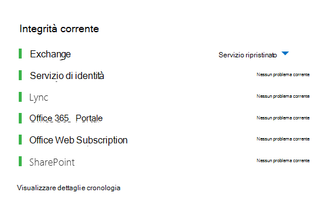
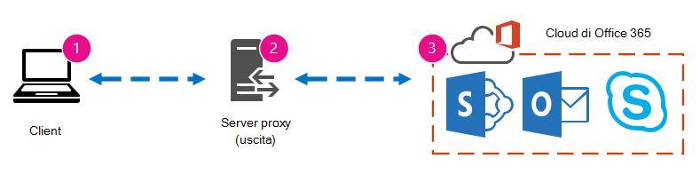
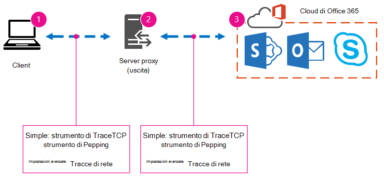
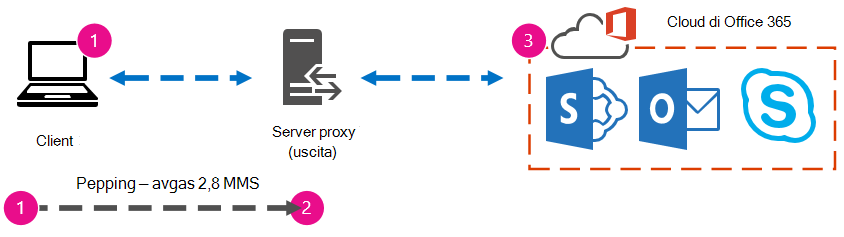
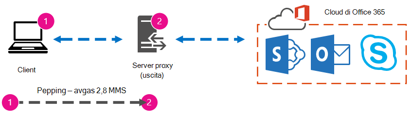

# Ottimizzazione delle prestazioni di Office 365 con le linee di base e la cronologia delle prestazioniOffice 365 performance tuning using baselines and performance history

Esistono alcuni semplici modi per verificare le prestazioni della connessione tra Office 365 e l'azienda, che consentono di stabilire una linea di base approssimativa della connettività.There are some simple ways to check the connection performance between Office 365 and your business that will let you establish a rough baseline of your connectivity. Conoscere la cronologia delle prestazioni delle connessioni ai computer client consente di rilevare i problemi emergenti in anticipo, identificare e prevedere i problemi.Knowing the performance history of your client computer connections can help you detect emerging issues early, identify, and predict problems.
  
Se non si è abituati a lavorare su problemi di prestazioni, questo articolo è stato progettato per aiutare l'utente a prendere in considerazione alcune domande comuni, ad esempio come verificare se il problema che si verifica è un problema di prestazioni e non un incidente di servizio di Office 365?If you're not used to working on performance issues, this article is designed to help you consider some common questions, like How do you know the problem you're seeing is a performance issue and not an Office 365 service incident? Come è possibile pianificare buone prestazioni a lungo termine?How can you plan for good performance, long term? Come è possibile tenere sotto controllo le prestazioni?How can you keep an eye on performance? Se il team o i client vedono prestazioni lente durante l'uso di Office 365 e ci si chiede se si tratta di una di queste domande, leggere.If your team or clients are seeing slow performance while using Office 365, and you wonder about any of these questions, read on.
  
> [!IMPORTANT]
> **Si è verificato un problema di prestazioni tra il client e Office 365 in questo momento?****Have a performance issue between your client and Office 365 right now?** Seguire i passaggi descritti nel piano di risoluzione dei problemi [relativi alle prestazioni per Office 365.](performance-troubleshooting-plan.md)Follow the steps outlined in the [Performance troubleshooting plan for Office 365](performance-troubleshooting-plan.md). 
    
## Informazioni da conoscere sulle prestazioni di Office 365Something you should know about Office 365 performance

Office 365 si trova all'interno di una rete Microsoft dedicata ad alta capacità, costantemente monitorata non solo dall'automazione, ma anche da persone reali.Office 365 lives inside a high-capacity, dedicated Microsoft network that is steadily monitored not just by automation, but by real people. Parte del ruolo della gestione del cloud di Office 365 è l'ottimizzazione delle prestazioni e la snellizione delle prestazioni laddove possibile.Part of the role of maintaining the Office 365 cloud is building-in performance tuning and streamlining where it's possible. Poiché i client del cloud di Office 365 devono connettersi tramite Internet, esiste un impegno continuo per ottimizzare le prestazioni anche tra i servizi di Office 365.Since clients of the Office 365 cloud have to connect across the Internet, there is a continuous effort to fine-tune the performance across Office 365 services too. I miglioramenti delle prestazioni non si arrestano mai nel cloud e l'esperienza accumulata per mantenere il cloud integro e rapido.Performance improvements never really stop in the cloud, and there is a lot of accumulated experience with keeping the cloud healthy and quick. Se si verifica un problema di prestazioni durante la connessione dalla posizione a Office 365, è consigliabile non iniziare e attendere un caso di supporto.Should you experience a performance issue connecting from your location to Office 365, it's best not to start with, and wait on, a Support case. Al contrario, è consigliabile iniziare a analizzare il problema dall'interno all'esterno.Instead, you should begin investigating the problem from 'the inside out'. In altri modi, iniziare all'interno della rete e accedere a Office 365.That is, start inside of your network, and work your way out to Office 365. Prima di aprire un caso con il supporto di Office 365, è possibile raccogliere dati ed eseguire azioni che esploreranno e risolveranno il problema.Before you open a case with Office 365 Support, you can gather data and take actions that will explore, and may resolve, your problem.
  
> [!IMPORTANT]
> Tenere presente la pianificazione della capacità e i limiti in Office 365.Be aware of capacity planning and limits in Office 365. Queste informazioni ti permetteranno di anticipare la curva quando cerchi di risolvere un problema di prestazioni.That information will put you ahead of the curve when trying to resolve a performance issue. Ecco un collegamento alle descrizioni dei servizi [di Microsoft 365 e Office 365.](https://docs.microsoft.com/office365/servicedescriptions/office-365-service-descriptions-technet-library)Here's a link to the [Microsoft 365 and Office 365 service descriptions](https://docs.microsoft.com/office365/servicedescriptions/office-365-service-descriptions-technet-library). Si tratta di un hub centrale e tutti i servizi offerti da Office 365 dispongono di un collegamento che consente di accedere alle proprie descrizioni dei servizi da qui.This is a central hub, and all the services offered by Office 365 have a link that goes to their own Service Descriptions from here. Ciò significa che, se è necessario visualizzare i limiti standard per SharePoint Online, ad esempio, fare clic su Descrizione servizio [SharePoint Online](https://technet.microsoft.com/library/sharepoint-online-service-description.aspx) e individuare la relativa sezione [Limiti di SharePoint Online.](https://go.microsoft.com/fwlink/p/?LinkID=856113)That means, should you need to see the standard limits for SharePoint Online, for example, you would click [SharePoint Online Service Description](https://technet.microsoft.com/library/sharepoint-online-service-description.aspx) and locate its [SharePoint Online Limits section](https://go.microsoft.com/fwlink/p/?LinkID=856113). 
  
Assicurarsi di passare alla risoluzione dei problemi con la consapevolezza che le prestazioni sono una scala scorrevole, non si tratta di raggiungere un valore idealizzato e mantenerlo in modo permanente (se si ritiene che sia così, occasionalmente attività con larghezza di banda elevata come l'on-boarding di un numero elevato di utenti o l'esecuzione di migrazioni di dati di grandi dimensioni saranno molto stressanti, quindi pianificare l'impatto sulle prestazioni).Make sure you go into your troubleshooting with the understanding that performance is a sliding scale, it's not about achieving an idealized value and maintaining it permanently (if you believe this is so, then occasional high-bandwidth tasks like on-boarding a large number of users, or doing large data migrations will be very stressful -- so do plan for performance impacts then). Puoi e dovresti avere un'idea approssimativa dei target di prestazioni, ma molte variabili giocano sulle prestazioni, pertanto le prestazioni variano.You can, and should, have a rough idea of your performance targets, but a lot of variables play into performance, therefore, performance varies. Questa è la natura delle prestazioni.That's the nature of performance. 
  
La risoluzione dei problemi relativi alle prestazioni non si tratta di raggiungere obiettivi specifici e di mantenere tali numeri a tempo indeterminato, ma di migliorare le attività esistenti, date tutte le variabili.Performance troubleshooting isn't about meeting specific goals and maintaining those numbers indefinitely, it's about improving existing activities, given all the variables. 
  
## Ok, che aspetto ha un problema di prestazioni?Okay, what does a performance problem look like?

Prima di tutto, è necessario verificare che ciò che si sta verificando sia effettivamente un problema di prestazioni e non un incidente di servizio.First, you need to make sure that what you are experiencing is indeed a performance issue and not a service incident. Un problema di prestazioni è diverso da un incidente di servizio in Office 365.A performance problem is different from a service incident in Office 365. Ecco come distinguerli.Here's how to tell them apart.
  
Se si verificano problemi con il servizio Office 365, si tratta di un incidente di servizio.If the Office 365 service is having issues, that's a service incident. Nell'interfaccia di amministrazione di Microsoft 365 verranno visualizzate icone rosse o gialle **in** Integrità corrente. È inoltre possibile notare un rallentamento delle prestazioni nei computer client che si connettono a Office 365.You will see red or yellow icons under **Current health** in the Microsoft 365 admin center, you may also notice slow performance on client computers connecting to Office 365. Ad esempio, se l'integrità corrente  segnala un'icona rossa e viene visualizzata l'analisi accanto a Exchange, è possibile che si ricevano anche alcune chiamate da parte di persone dell'organizzazione che si lamentano del fatto che le cassette postali client che utilizzano Exchange Online hanno prestazioni non migliori.For example, if Current health reports a red icon and you see **Investigating** beside Exchange, you might then also receive a bunch of calls from people in your organization who complain that client mailboxes that use Exchange Online are performing badly. In tal caso, è ragionevole presumere che le prestazioni di Exchange Online siano diventate una vittima di problemi all'interno del servizio.In that case, it's reasonable to assume that your Exchange Online performance just became a victim of issues within the Service. 
  

  
A questo punto, l'amministratore di Office 365 deve controllare l'integrità corrente e quindi visualizzare i dettagli e la **cronologia,** spesso, per mantenersi aggiornati sulle attività di manutenzione eseguite nel sistema. At this point, you, the Office 365 admin, should check **Current health** and then **View details and history**, frequently, to keep up to date on maintenance we perform on the system. Il **dashboard sull'integrità** corrente è stato creato per aggiornare l'utente in caso di modifiche e problemi nel servizio.The **Current health** dashboard was made to update you about changes to, and problems in, the service. Le note e le spiegazioni scritte nella cronologia dell'integrità, da amministratore ad amministratore, sono utili per valutare l'impatto e per mantenerti pubblicato sul lavoro in corso.The notes and explanations written to health history, admin to admin, are there to help you gauge your impact, and to keep you posted about ongoing work. 
  

  
Un problema di prestazioni non è un evento imprevisto del servizio, anche se gli incidenti possono causare un rallentamento delle prestazioni.A performance issue isn't a service incident, even though incidents can cause slow performance. Un problema di prestazioni è simile al seguente:A performance issue looks like this:
  
- Si verifica un problema di prestazioni indipendentemente da quale interfaccia di amministrazione **viene segnalata** l'integrità corrente per il servizio.A performance issue occurs no matter what the admin center **Current health** is reporting for the service. 
    
-  Un comportamento che in un tempo era relativamente semplice richiede molto tempo per essere completato o non viene mai completato.A behavior that used to be relatively seamless takes a long time to complete or never completes. 
    
- È anche possibile replicare il problema o, almeno, sapere che accadrà se si esegue la serie di passaggi giusta.You can replicate the problem too, or, at least, you know it will happen if you do the right series of steps.
    
-  Se il problema è intermittente, esiste ancora un modello, ad esempio, si sa che entro le 10.00 si riceveranno chiamate da utenti che non possono accedere in modo affidabile a Office 365 e che le chiamate verranno perse verso le 12.00.If the problem is intermittent, there is still a pattern, for example, you know that by 10:00 AM you will have calls from users who can't reliably access Office 365, and that the calls will die down around noon. 
    
Probabilmente sembra familiare; forse troppo familiare.This probably sounds familiar; maybe too familiar. Una volta che sai che si tratta di un problema di prestazioni, la domanda diventa "Cosa fare dopo?"Once you know it's a performance problem, the question becomes, "What do you do next?" Il resto di questo articolo consente di determinare esattamente questo.The rest of this article helps you determine exactly that.
  
## Come definire e testare il problema di prestazioniHow to define and test the performance problem

I problemi di prestazioni spesso emergono nel tempo, quindi può essere difficile definire il problema effettivo.Performance issues often emerge over time, so it can be challenging to define the actual problem. È necessario creare una buona dichiarazione del problema e una buona idea del contesto del problema e quindi è necessario ripetere passaggi di test per ottenere risultati.You need to create a good problem statement and a good idea of issue context, and then you need to repeatable testing steps to win the day. In caso contrario, senza alcun errore, potresti perderti.Otherwise, through no fault of your own, you may be lost. Perché?Why? Ecco alcuni esempi di istruzioni sui problemi che non forniscono informazioni sufficienti:Well, here are some examples of problems statements that don't provide enough information:
  
- Il passaggio dalla posta in arrivo al calendario era qualcosa che non notavo e ora è una pausa caffè.Switching from my Inbox to my Calendar used to be something I didn't notice, and now it's a coffee-break. Puoi fare in modo che funzioni come prima?Can you make it act like it used to?
    
- Il caricamento dei file in SharePoint Online sta prendendo sempre tempo.Uploading my files to SharePoint Online is taking forever. Perché è lento nel pomeriggi, ma in qualsiasi altro momento è veloce?Why is it slow in the afternoon, but any other time, it's fast? Non può essere semplicemente veloce?Can't it just be fast?
    
Le affermazioni del problema sopra poste in precedenza ponevano numerose sfide.There are several large challenges posed by the problem statements above. In particolare, esistono molte ambiguità da gestire.Specifically, there are a lot of ambiguities to deal with. Per esempio:for example:
  
- Non è chiaro come il passaggio tra Posta in arrivo e Calendario abbia usato per agire sul portatile.It's unclear how switching between Inbox and Calendar used to act on the laptop.
    
- Quando l'utente dice "Non può essere semplicemente veloce", che cos'è "veloce"?When the user says, "Can't it just be fast", what's "fast"?
    
- Quanto tempo è "per sempre"?How long is "forever"? Si tratta di alcuni secondi o minuti oppure l'utente potrebbe andare a pranzo e finirebbe dieci minuti dopo il ritorno dell'utente?Is that several seconds, or minutes, or could the user go to lunch and it would finish up ten minutes after the user got back?
    
Tutto ciò è senza considerare che l'amministratore e lo strumento di risoluzione dei problemi non possono essere a conoscenza di molti dettagli da dichiarazioni di problemi come queste.All of this is without considering that the admin and troubleshooter can't be aware of many details from problem statements like these. Ad esempio, quando il problema ha iniziato a verificarsi; Che l'utente lavori da casa e vede solo il passaggio lento in una rete domestica; Che l'utente deve eseguire diverse altre applicazioni con utilizzo intensivo della RAM nel client locale oppure che l'utente esegue un sistema operativo precedente o non ha eseguito aggiornamenti recenti.For example, when the problem started happening; That the user works from home and only ever sees slow switching while on a home network; That the user must run several other RAM intensive applications on the local client, or the user is running an older operating system or hasn't run recent updates.
  
Quando gli utenti segnalano un problema di prestazioni, sono disponibili molte informazioni da raccogliere.When users report a performance problem, there's a lot of information to collect. La raccolta di queste informazioni fa parte di un processo denominato ambito del problema o analisi.Collecting this information is part of a process called scoping the issue, or investigating it. Di seguito è riportato un elenco di ambito di base che è possibile utilizzare per raccogliere informazioni sul problema di prestazioni.The following is a basic scoping list you can use to collect information about your performance issue. Questo elenco non è esaustivo, ma è un punto in cui iniziare una delle seguenti attività:This list is not exhaustive, but it's a place to start one of your own: 
  
- In quale data si è verificato il problema e in quale ora del giorno o della notte?On what date did the issue happen, and around what time of day or night?
    
- Che tipo di computer client si usava e come si connette alla rete aziendale (VPN, cablata, wireless)?What kind of client computer were you using, and how does it connect to the business network (VPN, Wired, Wireless)?
    
- Si lavorava in remoto o si era in ufficio?Were you working remotely or were you in the office?
    
- Hai provato le stesse azioni in un altro computer e hai visualizzato lo stesso comportamento?Did you try the same actions on another computer and see the same behavior?
    
- Illustra i passaggi che ti danno problemi in modo da poter scrivere le azioni da intraprendere.Walk through the steps that are giving you the trouble so that you can write the actions you take down.
    
- Quanto sono lente in secondi o minuti le prestazioni?How slow in seconds or minutes is the performance?
    
- Dove si trova il mondo?Where in the world are you located?
    
Alcune di queste domande sono più ovvie di altre.Some of these questions are more obvious than others. La maggior parte di tutti capirà che uno strumento di risoluzione dei problemi richiede i passaggi esatti per riprodurre il problema.Most everyone will understand a troubleshooter needs the exact steps to reproduce the issue. Dopo tutto, in che altro modo è possibile registrare il problema e in che altro modo è possibile verificare se il problema è stato risolto?After all, how else can you record what's wrong, and how else can you test if the issue is fixed? Meno ovvie sono informazioni come "Quale data e ora hai visto il problema?", e "Dove ti trovi nel mondo?", informazioni che possono essere usate insieme.Less obvious are things like "What date and time did you see the issue?", and "Where in the world are you located?", information that can be used in tandem. A seconda di quando l'utente stava lavorando, alcune ore di differenza di tempo potrebbero indicare che la manutenzione è già in corso su parti della rete aziendale.Depending on when the user was working, a few hours of time difference may mean maintenance is already underway on parts of your company's network. Se, ad esempio, l'azienda dispone di un'implementazione ibrida, come una ricerca ibrida di SharePoint, che può eseguire query sugli indici di ricerca sia in SharePoint Online che in un'istanza di SharePoint Server 2013 locale, gli aggiornamenti potrebbero essere in corso nella farm locale.If, for example, your company has a hybrid implementation, like a hybrid SharePoint Search, which can query search indexes in both SharePoint Online and an On-premises SharePoint Server 2013 instance, updates may be underway in the on-premises farm. Se l'azienda è tutto nel cloud, la manutenzione del sistema può includere l'aggiunta o la rimozione di hardware di rete, l'implementazione di aggiornamenti a livello aziendale o l'esecuzione di modifiche al DNS o a un'altra infrastruttura di base.If your company is all in the cloud, system maintenance may include adding or removing network hardware, rolling out updates that are company-wide, or making changes to DNS, or other core infrastructure.
  
Quando si sta cercando di risolvere un problema di prestazioni, è un po' come una scena del delitto, è necessario essere precisi e osservanti per trarre conclusioni dalle prove.When you're troubleshooting a performance problem, it's a bit like a crime scene, you need to be precise and observant to draw any conclusions from the evidence. A tale scopo, è necessario ottenere una buona dichiarazione del problema raccogliendo le prove.In order to do this, you must get a good problem statement by gathering evidence. Deve includere il contesto del computer, il contesto dell'utente, l'inizio del problema e i passaggi esatti che hanno esposto il problema di prestazioni.It should include the computer's context, the user's context, when the problem began, and the exact steps that exposed the performance issue. Questa dichiarazione del problema deve essere e rimanere la pagina più in alto nelle note.This problem statement should be, and stay, the topmost page in your notes. Tornando all'istruzione del problema dopo aver risolto il problema, è necessario eseguire i passaggi per verificare e dimostrare se le azioni intraprese hanno risolto il problema.By walking through the problem statement again after you work on the resolution, you are taking the steps to test and prove whether the actions you take have resolved the issue. Questo è fondamentale per sapere quando viene svolto il tuo lavoro.This is critical to knowing when your work, there, is done.
  
## Si conosce l'aspetto delle prestazioni quando le prestazioni sono buone?Do you know how performance used to look when it was good?

Se non sei un'inforcabile, nessuno lo sa.If you're unlucky, nobody knows. Nessuno aveva numeri.Nobody had numbers. Ciò significa che nessuno può rispondere alla semplice domanda "Quanti secondi sono stati utilizzati per visualizzare una cartella Posta in arrivo in Office 365?" o "Quanto tempo è stato necessario quando i dirigenti hanno avuto una riunione in Lync Online?", che è uno scenario comune per molte aziende.That means nobody can answer the simple question "About how many seconds did it used to take to bring up an Inbox in Office 365?", or "How long did it used to take when the Executives had a Lync Online meeting?", which is a common scenario for many companies.
  
Ciò che manca qui è una linea di base per le prestazioni.What's missing here is a performance baseline.
  
Le linee di base forniscono un contesto per le prestazioni.Baselines give you a context for your performance. È consigliabile prendere spesso una linea di base, a seconda delle esigenze dell'azienda.You should take a baseline occasionally to frequently, depending on the needs of your company. Se si è un'azienda di grandi dimensioni, il team operativo potrebbe già prendere le linee di base per l'ambiente locale.If you are a larger company, your Operations team may take baselines for your on-premises environment already. Ad esempio, se si esegue la patch di tutti i server Exchange il primo lunedì del mese e di tutti i server di SharePoint il terzo lunedì, è probabile che il team operativo abbia un elenco di attività e scenari eseguiti dopo l'applicazione di patch, per dimostrare che le funzioni critiche sono operative.For example, if you patch all the Exchange servers on the first Monday of the month, and all your SharePoint servers on the third Monday, your Operations team probably has a list of tasks and scenarios it runs post-patching, to prove that critical functions are operational. Ad esempio, aprendo la cartella Posta in arrivo, facendo clic su Invia/Ricevi e verificando l'aggiornamento delle cartelle oppure, in SharePoint, esplorando la pagina principale del sito, andando nella pagina Ricerca organizzazione ed eseguendo una ricerca che restituisca risultati.For example, opening the Inbox, clicking Send/Receive, and making sure the folders update, or, in SharePoint, browsing the main page of the site, going into the enterprise Search page, and doing a search that returns results.
  
Se le applicazioni si trova in Office 365, alcune delle linee di base più fondamentali possono essere misurate in millisecondi da un computer client all'interno della rete, da un punto di uscita o dal punto in cui si esce dalla rete e si esce da Office 365.If your applications are in Office 365, some of the most fundamental baselines you can take measure the time (in milliseconds) from a client computer inside your network, to an egress point, or the point where you leave your network and go out to Office 365. Ecco alcune linee di base utili che è possibile analizzare e registrare:Here are some helpful baselines that you can investigate and record:
  
- Identificare i dispositivi tra il computer client e il punto di uscita, ad esempio il server proxy.Identify the devices between your client computer and your egress point, for example, your proxy server.
    
  - Devi conoscere i dispositivi in modo da avere il contesto (indirizzi IP, tipo di dispositivo, ecc.) per i problemi di prestazioni che si verificano.You need to know your devices so that you have context (IP addresses, type of device, et cetera) for performance problems that arise.
    
  - I server proxy sono punti di uscita comuni, quindi puoi controllare il web browser per vedere quale server proxy è impostato per l'uso, se presente.Proxy servers are common egress points, so you can check your web browser to see what proxy server it is set to use, if any.
    
  - Esistono strumenti di terze parti in grado di individuare e mappare la rete, ma il modo più sicuro per conoscere i dispositivi è chiedere a un membro del team di rete.There are third party tools that can discover and map your network, but the safest way to know your devices is to ask a member of your network team.
    
- Identificare il provider di servizi Internet (ISP), annotarne le informazioni di contatto e chiedere al numero di circuiti la larghezza di banda disponibile.Identify your Internet service provider (ISP), write down their contact information, and ask how many circuits how much bandwidth you have.
    
- All'interno dell'azienda, identificare le risorse per i dispositivi tra il client e il punto di uscita oppure identificare un contatto di emergenza con cui parlare di problemi di rete.Inside your company, identify resources for the devices between your client and the egress point, or identify an emergency contact to talk to about networking issues.
    
Ecco alcune linee di base che possono essere calcolate automaticamente da semplici test con strumenti:Here are some baselines that simple testing with tools can calculate for you:
  
- Tempo dal computer client al punto di uscita in millisecondiTime from your client computer to your egress point in milliseconds
    
- Tempo dal punto di uscita a Office 365 in millisecondiTime from your egress point to Office 365 in milliseconds
    
- Posizione nel mondo del server che risolve gli URL per Office 365 quando si sfogliaLocation in the world of the server that resolves the URLS for Office 365 when you browse
    
- Velocità della risoluzione DNS dell'ISP in millisecondi, incoerenze nell'arrivo dei pacchetti (instabilità di rete), tempi di caricamento e download in millisecondiThe speed of your ISP's DNS resolution in milliseconds, inconsistencies in packet arrival (network jitter), upload and download times in milliseconds
    
Se non si ha familiarità con la procedura, verranno fornite informazioni più dettagliate in questo articolo.If you're unfamiliar with how to carry out these steps, we'll go into more detail in this article. 
  
## Che cos'è una linea di base?What is a baseline?

Si conoscerà l'impatto quando si verificano problemi, ma se non si conoscono i dati cronologici sulle prestazioni, non è possibile avere un contesto per quanto male potrebbe essere diventato e quando.You'll know the impact when it goes bad, but if you don't know your historical performance data, it's not possible to have a context for how bad it may have become, and when. Quindi, senza una linea di base, ti manca l'indicazione chiave per risolvere il puzzle: l'immagine nella casella del puzzle.So without a baseline, you're missing the key clue to solve the puzzle: the picture on the puzzle box. Per la risoluzione dei problemi relativi alle prestazioni, è necessario un punto di *confronto.*In performance troubleshooting, you need a point of  *comparison*  . Le semplici linee di base delle prestazioni non sono difficili da prendere.Simple performance baselines aren't difficult to take. Il team operativo può avere il compito di eseguire queste operazioni in base a una pianificazione.Your Operations team can be tasked with carrying these out on a schedule. Si supponga, ad esempio, che la connessione sia simile alla seguente:For example, let's say your connection looks like this: 
  

  
Ciò significa che hai controllato con il team di rete e hai scoperto che lasci la tua azienda per Internet tramite un server proxy e che il proxy gestisce tutte le richieste inviate dal computer client al cloud.That means you've checked with your network team and found out that you leave your company for the Internet through a proxy server, and that proxy handles all the requests your client computer sends to the cloud. In questo caso, devi disegnare una versione semplificata della connessione in cui sono elencati tutti i dispositivi che intervengono.In this case, you should draw a simplified version of your connection that lists all the intervening devices. A questo punto, inserire gli strumenti che è possibile utilizzare per testare le prestazioni tra il client, il punto di uscita (dove si lascia la rete per Internet) e il cloud di Office 365.Now, insert tools that you can use to test the performance between the client, the egress point (where you leave your network for the Internet), and the Office 365 cloud.
  

  
Le opzioni sono elencate **come Semplici** **e** Avanzate a causa della quantità di competenze necessarie per trovare i dati sulle prestazioni.The options are listed as **Simple** and **Advanced** because of the amount of expertise you need in order to find the performance data. Una traccia di rete richiederà molto tempo, rispetto all'esecuzione di strumenti da riga di comando come PsPing e TraceTCP.A network trace will take a lot of time, compared to running command-line tools like PsPing and TraceTCP. Questi due strumenti della riga di comando sono stati scelti perché non utilizzano pacchetti ICMP, che verranno bloccati da Office 365, e perché forniscono il tempo in millisecondi necessario per lasciare il computer client o il server proxy (se si dispone dell'accesso) e arrivare a Office 365.These two command-line tools were chosen because they don't use ICMP packets, which will be blocked by Office 365, and because they give the time in milliseconds that it takes to leave the client computer, or proxy server (if you have access) and arrive at Office 365. Ogni singolo passaggio da un computer a un altro finirà con un valore di tempo ed è ideale per le linee di base.Each individual hop from one computer to another will end up with a time value, and that's great for baselines! Come importante, questi strumenti della riga di comando consentono di aggiungere un numero di porta al comando, ciò è utile perché Office 365 comunica sulla porta 443, ovvero la porta utilizzata da Secure Sockets Layer e Transport Layer Security (SSL e TLS).Just as importantly, these command-line tools allow you to add a port number onto the command, this is useful because Office 365 communicates over port 443, which is the port used by Secure Sockets Layer and Transport Layer Security (SSL and TLS). Tuttavia, altri strumenti di terze parti potrebbero essere soluzioni migliori per la propria situazione.However, other third-party tools may be better solutions for your situation. Microsoft non supporta tutti questi strumenti, quindi se, per qualche motivo, non è possibile far funzionare PsPing e TraceTCP, passare a una traccia di rete con uno strumento come Netmon.Microsoft doesn't support all of these tools, so if, for some reason, you can't get PsPing and TraceTCP working, move on to a network trace with a tool like Netmon. 
  
È possibile prendere una previsione prima dell'orario di ufficio, di nuovo durante un utilizzo intenso e quindi di nuovo dopo l'orario di ufficio.You can take a baseline before business hours, again during heavy use, and then again after hours. Questo significa che potresti avere una struttura di cartelle un po' simile alla seguente alla fine:This means you may have a folder structure that looks a bit like this in the end:
  

  
È inoltre consigliabile selezionare una convenzione di denominazione per i file.You should also pick a naming convention your files. Ecco alcuni esempi:Here are some examples:
  
- Feb_09_2015_9amPST_PerfBaseline_Netmon_ClientToEgress_NormalFeb_09_2015_9amPST_PerfBaseline_Netmon_ClientToEgress_Normal
    
- Jan_10_2015_3pmCST_PerfBaseline_PsPing_ClientToO365_bypassProxy_SLOWJan_10_2015_3pmCST_PerfBaseline_PsPing_ClientToO365_bypassProxy_SLOW
    
- Feb_08_2015_2pmEST_PerfBaseline_BADPerfFeb_08_2015_2pmEST_PerfBaseline_BADPerf
    
- Feb_08_2015_8-30amEST_PerfBaseline_GoodPerfFeb_08_2015_8-30amEST_PerfBaseline_GoodPerf
    
Esistono molti modi diversi per eseguire questa operazione, ma l'uso del formato **\<dateTime\>\<what's happening in the test\>** è un buon punto di partenza.There are lots of different ways to do this, but using the format **\<dateTime\>\<what's happening in the test\>** is a good place to start. La diligenza su questo argomento è molto utile quando si tenta di risolvere i problemi in un secondo momento.Being diligent about this will help a lot when you are trying to troubleshoot issues later. In seguito, sarà possibile dire "L'8 febbraio ho preso due tracce, una ha mostrato buone prestazioni e una ha mostrato risultati non ottimali, quindi possiamo confrontarle".Later, you'll be able to say "I took two traces on February 8th, one showed good performance and one showed bad, so we can compare them". Ciò è estremamente utile per la risoluzione dei problemi.This is extremely helpful for troubleshooting. 
  
È necessario disporre di un modo organizzato per mantenere le baseline cronologiche.You need to have an organized way to keep your historical baselines. In questo esempio, i semplici metodi generavano tre output della riga di comando e i risultati sono stati raccolti come screenshot, ma potresti avere invece file di acquisizione di rete.In this example, the simple methods produced three command line outputs and the results were collected as screen shots, but you may have network capture files instead. Usa il metodo più adatto per te.Use the method that works best for you. Archiviare le baseline cronologiche e fare riferimento a tali elementi nei punti in cui si notano cambiamenti nel comportamento dei servizi online.Store your historical baselines and refer to them at points where you notice changes in the behavior of online services. 
  
## Perché raccogliere dati sulle prestazioni durante un progetto pilota?Why collect performance data during a pilot?

Non c'è tempo migliore per iniziare a creare linee di base rispetto a una distribuzione pilota del servizio Office 365.There is no better time to start making baselines than during a pilot of the Office 365 service. L'ufficio può avere migliaia di utenti, centinaia di migliaia o cinque, ma anche con un numero limitato di utenti, è possibile eseguire test per misurare le fluttuazioni delle prestazioni.Your office may have thousands of users, hundreds of thousands, or it may have five, but even with a small number of users, you can perform tests to measure fluctuations in performance. Nel caso di una società di grandi dimensioni, un campione rappresentativo di diverse centinaia di utenti che hanno pilotato Office 365 può essere proiettato verso l'esterno a diverse migliaia, in modo da sapere dove potrebbero verificarsi i problemi prima che si verificano.In the case of a large company, a representative sample of several hundred users piloting Office 365 can be projected outward to several thousands so you know where issues might arise before they happen.
  
Nel caso di una piccola azienda, in cui l'on-boarding significa che tutti gli utenti passano al servizio contemporaneamente e non è disponibile alcuna soluzione pilota, mantenere le misure delle prestazioni in modo da disporre di dati da mostrare a chiunque possa avere la richiesta di risolvere i problemi di un'operazione con prestazioni non ottimali.In the case of a small company, where on-boarding means that all users go to the service at the same time and there is no pilot, keep performance measures so that you have data to show to anyone who may have to troubleshoot a badly performing operation. Ad esempio, se si nota che all'improvviso è possibile spostarsi all'interno dell'edificio nel tempo necessario per caricare un elemento grafico di medie dimensioni in cui si verificava molto rapidamente.For example, if you notice that all of a sudden you can walk around your building in the time it takes to upload a medium-sized graphic where it used to happen very quickly.
  
## Come raccogliere le linee di baseHow to collect baselines

Per tutti i piani di risoluzione dei problemi, è necessario identificare almeno questi elementi:For all troubleshooting plans you need to identify these things at a minimum:
  
- Il computer client in uso (il tipo di computer o dispositivo, un indirizzo IP e le azioni che hanno causato il problema)The client computer you're using (the type of computer or device, an IP address, and the actions that caused the issue)
    
- Posizione in cui si trova il computer client nel mondo (ad esempio, se l'utente si trova in una rete VPN, lavora in remoto o nella rete Intranet aziendale)Where the client computer is located in the world (for example, whether this user on a VPN to the network, working remotely, or on the company intranet)
    
- Il punto di uscita utilizzato dal computer client dalla rete (il punto in cui il traffico lascia l'azienda per un ISP o Internet)The egress point the client computer uses from your network (the point at which traffic leaves your business for an ISP or the Internet)
    
 È possibile trovare il layout della rete dall'amministratore di rete.You can find out the layout of your network from the network administrator. Se si è in una rete di piccole dimensioni, esaminare i dispositivi che si connettono a Internet e chiamare l'ISP in caso di domande sul layout.If you're on a small network, take a look at the devices connecting you to the Internet, and call your ISP if you have questions about the layout. Crea un elemento grafico del layout finale per il riferimento.Create a graphic of the final layout for your reference. 
  
Questa sezione è suddivisa in semplici strumenti e metodi della riga di comando e opzioni degli strumenti più avanzate.This section is broken into simple command-line tools and methods, and more advanced tools options. Verranno descritti prima i metodi semplici.We'll cover simple methods first. Tuttavia, se al momento si verifica un problema di prestazioni, è consigliabile passare a metodi avanzati e provare il piano di azione per la risoluzione dei problemi di prestazioni di esempio.But if you've got a performance problem right now, you should jump to advanced methods and try out the sample performance-troubleshooting action plan.
  
### Metodi sempliciSimple methods

L'obiettivo di questi semplici metodi è quello di imparare a prendere, comprendere e archiviare correttamente semplici baseline delle prestazioni nel tempo in modo da essere informati sulle prestazioni di Office 365.The objective of these simple methods is to learn to take, understand, and properly store simple performance baselines over time so that you are informed about Office 365 performance. Ecco il diagramma molto semplice per semplici, come hai visto prima:Here's the very simple diagram for simple, as you've seen before:
  

  
> [!NOTE]
> TraceTCP è incluso in questa cattura di schermata perché è uno strumento utile per visualizzare, in millisecondi, il tempo necessario per elaborare una richiesta e il numero di hop di rete o connessioni da un computer all'altro, che la richiesta richiede per raggiungere una destinazione.TraceTCP is included in this screen shot because it's a useful tool for showing, in milliseconds, how long a request takes to process, and how many network hops, or connections from one computer to the next, that the request takes to reach a destination. TraceTCP può anche fornire i nomi dei server utilizzati durante gli hop, che possono essere utili per uno strumento di risoluzione dei problemi di Microsoft Office 365 nel supporto.TraceTCP can also give the names of servers used during hops, which can be useful to a Microsoft Office 365 troubleshooter in Support. > comandi TraceTCP possono essere molto semplici, ad esempio: >> ricordarsi di includere il numero di porta  `tracetcp.exe outlook.office365.com:443` nel comando.> TraceTCP commands can be very simple, such as: >  `tracetcp.exe outlook.office365.com:443`> Remember to include the port number in the command! > [TraceTCP](https://simulatedsimian.github.io/tracetcp_download.html) è un download gratuito, ma si basa su Wincap. > [TraceTCP](https://simulatedsimian.github.io/tracetcp_download.html) is a free download, but relies on Wincap. Wincap è uno strumento utilizzato e installato anche da Netmon.Wincap is a tool that is also used and installed by Netmon. Usiamo anche Netmon nella sezione dei metodi avanzati.We also use Netmon in the advanced methods section. 
  
 Se si dispone di più uffici, sarà necessario conservare un set di dati da un client anche in ognuna di queste posizioni.If you have multiple offices, you'll need to keep a set of data from a client in each of those locations as well. Questo test misura la latenza, che, in questo caso, è un valore numerico che descrive la quantità di tempo tra un client che invia una richiesta a Office 365 e Office 365 che risponde alla richiesta.This test measures latency, which, in this case, is a number value that describes the amount of time between a client sending a request to Office 365, and Office 365 responding to the request. Il test ha origine all'interno del dominio in un computer client e cerca di misurare un round trip dall'interno della rete, da un punto di uscita, da Internet a Office 365 e così via.The testing originates inside your domain on a client computer, and looks to measure a round trip from inside your network, out through an egress point, across the Internet to Office 365, and back. 
  
Esistono alcuni modi per gestire il punto di uscita, in questo caso il server proxy.There are a few ways to deal with the egress point, in this case, the proxy server. Puoi tracciare da 1 a 2 e quindi da 2 a 3 e quindi aggiungere i numeri in millisecondi per ottenere un totale finale al perimetro della rete.You can either trace from 1 to 2 and then 2 to 3, and then add the numbers in milliseconds to get a final total to the edge of your network. In caso contrario, è possibile configurare la connessione per ignorare il proxy per gli indirizzi di Office 365.Or, you can configure the connection to bypass the proxy for Office 365 addresses. In una rete più grande con un firewall, un proxy inverso o una combinazione di queste due, potrebbe essere necessario creare eccezioni nel server proxy che consentiranno il passaggio del traffico per molti URL.In a larger network with a firewall, reverse proxy, or some combination of the two, you may need to make exceptions on the proxy server that will allow traffic to pass for a lot of URLs. Per l'elenco degli endpoint usati da Office 365, vedere URL e intervalli di indirizzi [IP di Office 365.](https://support.office.com/article/8548a211-3fe7-47cb-abb1-355ea5aa88a2)For the list of endpoints used by Office 365, see [Office 365 URLs and IP address ranges](https://support.office.com/article/8548a211-3fe7-47cb-abb1-355ea5aa88a2). Se si dispone di un proxy di autenticazione, iniziare verificando le eccezioni per gli elementi seguenti:If you have an authenticating proxy, begin by testing exceptions for the following:
  
- Porte 80 e 443Ports 80 and 443
    
- TCP e HTTPTCP and HTTPs
    
- Connessioni in uscita verso uno qualsiasi di questi URL:Connections that are outbound to any of these URLs:
    
- \*.microsoftonline.com\*.microsoftonline.com
    
- \*.microsoftonline-p.com\*.microsoftonline-p.com
    
- \*.sharepoint.com\*.sharepoint.com
    
- \*.outlook.com\*.outlook.com
    
- \*.lync.com\*.lync.com
    
- osub.microsoft.comosub.microsoft.com
    
A tutti gli utenti deve essere consentito accedere a questi indirizzi senza alcuna interferenza proxy o autenticazione.All users need to be allowed to get to these addresses without any proxy interference or authentication. In una rete più piccola, devi aggiungerli all'elenco di bypass proxy nel web browser.On a smaller network, you should add these to your proxy bypass list in your web browser. 
  
Per aggiungerli all'elenco di bypass proxy in Internet Explorer, passare **a** Strumenti \> **Opzioni Internet** \> **Connessioni** \> **LAN impostazioni** \> **avanzate.**To add these to your proxy bypass list in Internet Explorer, go to **Tools** \> **Internet Options** \> **Connections** \> **LAN settings** \> **Advanced**. La scheda avanzata è anche dove troverai il server proxy e la porta del server proxy.The advanced tab is also where you will find your proxy server and proxy server port. Potrebbe essere necessario fare clic sulla casella di controllo Usa un server proxy per la **rete LAN** per accedere al **pulsante** Avanzate.You may need to click the checkbox **Use a proxy server for your LAN**, to access the **Advanced** button. È necessario verificare che sia selezionata l'opzione **Ignora server proxy** per gli indirizzi locali.You'll want to make sure that **Bypass proxy server for local addresses** is checked. Dopo aver fatto **clic su Avanzate,** verrà visualizzata una casella di testo in cui è possibile immettere le eccezioni.Once you click **Advanced**, you'll see a text box where you can enter exceptions. Separare gli URL con caratteri jolly elencati in precedenza con un punto e virgola, ad esempio:Separate the wildcard URLs listed above with semi-colons, for example:
  
\*.microsoftonline.com; \*.sharepoint.com\*.microsoftonline.com; \*.sharepoint.com
  
Dopo aver ignorato il proxy, dovrebbe essere possibile usare il ping o PsPing direttamente su un URL di Office 365.Once you bypass your proxy, you should be able to use ping or PsPing directly on an Office 365 URL. Il passaggio successivo consisterà nel testare il ping **outlook.office365.com**.The next step will be to test ping **outlook.office365.com**. In caso contrario, se si usa PsPing o un altro strumento che consente di specificare un numero di porta per il comando, PsPing su **portal.microsoftonline.com:443** per visualizzare il tempo medio di round trip in millisecondi.Or, if you're using PsPing or another tool that will let you supply a port number to the command, PsPing against **portal.microsoftonline.com:443** to see the average round trip time in milliseconds. 
  
Il tempo di andata e ritorno, o RTT, è un valore numerico che misura il tempo necessario per inviare una richiesta HTTP a un server come outlook.office365.com e ottenere una risposta che riconosca che il server è a conoscenza dell'operazione.The round trip time, or RTT, is a number value that measures how long it takes to send a HTTP request to a server like outlook.office365.com and get a response back that acknowledges the server knows that you did it. A volte questa opzione è abbreviata come RTT.You'll sometimes see this abbreviated as RTT. Dovrebbe trattarsi di un periodo di tempo relativamente breve.This should be a relatively short amount of time.
  
Per eseguire questo test, è necessario utilizzare [PSPing](https://technet.microsoft.com/sysinternals/jj729731.aspx) o un altro strumento che non utilizza pacchetti ICMP bloccati da Office 365.You have to use [PSPing](https://technet.microsoft.com/sysinternals/jj729731.aspx) or another tool that does not use ICMP packets which are blocked by Office 365 in order to do this test. 
  
 **Come usare PsPing per ottenere un tempo di andata e ritorno complessivo in millisecondi direttamente da un URL di Office 365****How to use PsPing to get an overall round trip time in milliseconds directly from an Office 365 URL**
  
1. Eseguire un prompt dei comandi con privilegi elevati completando la procedura seguente:Run an elevated command prompt by completing these steps:
    
1. Fare clic su **Avvia**.Click **Start**.
    
2. Nella casella **Inizia ricerca** digitare cmd e quindi premere CTRL+MAIUSC+INVIO.In the **Start Search** box, type cmd, and then press CTRL+SHIFT+ENTER.
    
3. Se viene visualizzata la finestra di dialogo **Controllo account utente**, confermare che l'azione visualizzata è quella desiderata e scegliere **Continua**.If the **User Account Control** dialog box appears, confirm that the action it displays is what you want, and then click **Continue**.
    
2. Passare alla cartella in cui è installato lo strumento (in questo caso PsPing) e testare questi URL di Office 365:Navigate to the folder where the tool (in this case PsPing) is installed and test these Office 365 URLs:
    
  - psping portal.office.com:443psping portal.office.com:443
    
  - psping microsoft-my.sharepoint.com:443psping microsoft-my.sharepoint.com:443
    
  - psping outlook.office365.com:443psping outlook.office365.com:443
    
  - psping www.yammer.com:443psping www.yammer.com:443
    
    
  
Assicurarsi di includere il numero di porta 443.Be sure to include the port number of 443. Tenere presente che Office 365 funziona su un canale crittografato.Remember that Office 365 works on an encrypted channel. Se psPing senza il numero di porta, la richiesta avrà esito negativo.If you PsPing without the port number, your request will fail. Dopo aver evaso il ping dell'elenco breve, cercare il tempo medio in millisecondi (ms).Once you've pinged your short list, look for the Average time in milliseconds (ms). Questo è ciò che si desidera registrare.That is what you want to record!
  

  
Se non hai familiarità con il bypass proxy e preferisci eseguire operazioni dettagliate, devi prima trovare il nome del server proxy.If you're not familiar with proxy bypass, and prefer to take things step-by-step, you need to first find out the name of your proxy server. In Internet Explorer passare a **Strumenti** \> **Opzioni Internet** \> **Connessioni** \> **IMPOSTAZIONI LAN** \> **Avanzate.**In Internet Explorer go to **Tools** \> **Internet Options** \> **Connections** \> **LAN settings** \> **Advanced**. Nella **scheda Avanzate** viene visualizzato il server proxy elencato.The **Advanced** tab is where you will see your proxy server listed. Eseguire il ping del server proxy al prompt dei comandi completando questa attività:Ping that proxy server at a command prompt by completing this task: 
  
 **Per eseguire il ping del server proxy e ottenere un valore di round trip in millisecondi per la fase 1-2****To ping the proxy server and get a round trip value in milliseconds for stage 1 to 2**
  
1. Eseguire un prompt dei comandi con privilegi elevati completando la procedura seguente:Run an elevated command prompt by completing these steps:
    
1. Fare clic su **Avvia**.Click **Start**.
    
2. Nella casella **Inizia ricerca** digitare cmd e quindi premere CTRL+MAIUSC+INVIO.In the **Start Search** box, type cmd, and then press CTRL+SHIFT+ENTER.
    
3. Se viene visualizzata la finestra di dialogo **Controllo account utente**, confermare che l'azione visualizzata è quella desiderata e scegliere **Continua**.If the **User Account Control** dialog box appears, confirm that the action it displays is what you want, and then click **Continue**.
    
2. Digitare ping \<the name of the proxy server your browser uses, or the IP address of the proxy server\> e quindi premere INVIO.Type ping \<the name of the proxy server your browser uses, or the IP address of the proxy server\> and then press ENTER. Se hai installato PsPing o un altro strumento, puoi scegliere di usare lo strumento.If you have PsPing, or some other tool, installed, you can choose to use that tool instead. 
    
    Il comando può essere simile a uno di questi esempi:Your command may look like any of these examples: 
    
  - ping ourproxy.ourdomain.industry.business.comping ourproxy.ourdomain.industry.business.com
    
  - ping 155.55.121.55ping 155.55.121.55
    
  - ping ourproxyping ourproxy
    
  - psping ourproxy.ourdomain.industry.business.com:80psping ourproxy.ourdomain.industry.business.com:80
    
  - psping 155.55.121.55:80psping 155.55.121.55:80
    
  - psping ourproxy:80psping ourproxy:80
    
3. Quando la traccia smette di inviare pacchetti di test, si otterrà un piccolo riepilogo che elenca una media, in millisecondi, e questo è il valore che si desidera ottenere.When the trace stops sending test packets, you'll get a small summary that lists an average, in milliseconds, and that's the value you're after. Fai una cattura di schermata del prompt e salvala usando la convenzione di denominazione.Take a screen shot of the prompt and save it using your naming convention. A questo punto può essere utile anche compilare il diagramma con il valore.At this point it may also help to fill in the diagram with the value.
    
Forse è stata tracciata la mattina presto e il client può accedere rapidamente al proxy (o a qualsiasi altro server in uscita da Internet).Maybe you've taken a trace in the early morning, and your client can get to the proxy (or whatever egress server exits to the Internet) quickly. In questo caso, i numeri potrebbero essere simili al seguente:In this case, your numbers may look like this:
  

  
Se il computer client è uno dei pochi selezionati con accesso al server proxy (o in uscita), è possibile eseguire la fase successiva del test connettendosi in remoto a tale computer, eseguendo il prompt dei comandi per PsPing a un URL di Office 365 da qui.If your client computer is one of the select few with access to the proxy (or egress) server, you can run the next leg of the test by remotely connecting to that computer, running the command prompt to PsPing to an Office 365 URL from there. Se non si ha accesso a tale computer, è possibile contattare le risorse di rete per assistenza con la prossima fase e ottenere numeri esatti in questo modo.If you don't have access to that computer, you can contact your network resources for help with the next leg and get exact numbers that way. Se non è possibile, eseguire un psping sull'URL di Office 365 in questione e confrontarlo con il tempo PsPing o Ping rispetto al server proxy.If that's not possible, take a PsPing against the Office 365 URL in question and compare it to the PsPing or Ping time against your proxy server. 
  
Ad esempio, se si hanno 51,84 millisecondi dal client all'URL di Office 365 e si hanno 2,8 millisecondi dal client al proxy (o punto di uscita), si hanno 49,04 millisecondi dall'uscita a Office 365.For example, if you have 51.84 milliseconds from the client to the Office 365 URL, and you have 2.8 milliseconds from the client to the proxy (or egress point), then you have 49.04 milliseconds from the egress to Office 365. Analogamente, se si dispone di un psPing di 12,25 millisecondi dal client al proxy durante l'altezza del giorno e di 62,01 millisecondi dal client all'URL di Office 365, il valore medio per l'uscita del proxy all'URL di Office 365 è 49,76 millisecondi.Likewise, if you have a PsPing of 12.25 milliseconds from the client to the proxy during the height of the day, and 62.01 milliseconds from the client to the Office 365 URL, then your average value for the proxy egress to the Office 365 URL is 49.76 milliseconds.
  

  
Per quanto riguarda la risoluzione dei problemi, potresti trovare qualcosa di interessante solo nel mantenere queste linee di base.In terms of troubleshooting, you may find something interesting just from keeping these baselines. Ad esempio, Se in genere si hanno da 40 a 59 millisecondi di latenza dal proxy o dal punto di uscita all'URL di Office 365 e si dispone di un client per eseguire il proxy o la latenza del punto di uscita di circa 3-7 millisecondi (a seconda della quantità di traffico di rete che si sta visualizzando durante l'ora del giorno), si saprà sicuramente che qualcosa è problematico se gli ultimi tre client per eseguire il proxy o l'uscita dalle linee di base mostrano una latenza di 45 millisecondi.For example, if you find that you generally have about 40 to 59 milliseconds of latency from the proxy or egress point to the Office 365 URL, and have a client to proxy or egress point latency of about 3 to 7 milliseconds (depending on the amount network traffic you're seeing during that time of day) then you will surely know something is problematic if your last three client to proxy or egress baselines show a latency of 45 milliseconds.
  
### Metodi avanzatiAdvanced methods

Se si vuole sapere cosa accade con le richieste Internet a Office 365, è necessario acquisire familiarità con le tracce di rete.If you really want to know what is happening with your Internet requests to Office 365, you need to become familiar with network traces. Non importa quali strumenti preferisci per queste tracce, HTTPWatch, Netmon, Message Analyzer, Wireshark, Fiddler, Developer Dashboard tool o qualsiasi altro strumento farà tutto il tempo che lo strumento può acquisire e filtrare il traffico di rete.It does not matter which tools you prefer for these traces, HTTPWatch, Netmon, Message Analyzer, Wireshark, Fiddler, Developer Dashboard tool or any other will do as long as that tool can capture and filter network traffic. You'll see in this section that it's beneficial to run more than one of these tools to get a more complete picture of the problem.You'll see in this section that it's beneficial to run more than one of these tools to get a more complete picture of the problem. Durante i test, alcuni di questi strumenti fungono anche da proxy in proprio diritto.When you're testing, some of these tools also act as proxies in their own right. Gli strumenti utilizzati nell'articolo complementare, Piano di risoluzione dei problemi relativi alle prestazioni per [Office 365,](performance-troubleshooting-plan.md)includono [Netmon 3.4,](https://www.microsoft.com/download/details.aspx?id=4865) [HTTPWatch](https://www.httpwatch.com/download/)o [WireShark.](https://www.wireshark.org/)Tools used in the companion article, [Performance troubleshooting plan for Office 365](performance-troubleshooting-plan.md), include [Netmon 3.4](https://www.microsoft.com/download/details.aspx?id=4865), [HTTPWatch](https://www.httpwatch.com/download/), or [WireShark](https://www.wireshark.org/).
  
L'esecuzione di una previsione delle prestazioni è la parte semplice di questo metodo e molti dei passaggi sono gli stessi di quando si risolve un problema di prestazioni.Taking a performance baseline is the simple part of this method, and many of the steps are the same as when you troubleshoot a performance issue. I metodi più avanzati per la creazione di linee di base per le prestazioni richiedono l'utilizzo e l'archiviazione delle tracce di rete.The more advanced methods of creating baselines for performance requires you to take and store network traces. La maggior parte degli esempi in questo articolo usa SharePoint Online, ma è consigliabile sviluppare un elenco di azioni comuni tra i servizi di Office 365 a cui si sottoscrive il test e la registrazione.Most of the examples in this article use SharePoint Online, but you should develop a list of common actions across the Office 365 services to which you subscribe to test and record. Ecco un esempio di base:Here is a baseline example:
  
- Elenco di base per SpO - \*\* Passaggio 1: \*\* Esplorare la home page del sito Web di SpO ed eseguire una traccia di rete.Baseline list for SPO - \*\* Step 1: \*\* Browse the home page of the SPO website and do a network trace. Salvare la traccia.Save the trace. 
    
- Elenco di base per SpO - **Passaggio 2:** cercare un termine ,ad esempio il nome della società, tramite Ricerca contenuti organizzazione ed eseguire una traccia di rete.Baseline list for SPO - **Step 2:** Search for a term (such as your company name) via Enterprise Search and do a network trace. Salvare la traccia.Save the trace. 
    
- Elenco di base per SharePoint Online - **Passaggio 3:** Caricare un file di grandi dimensioni in una raccolta documenti di SharePoint Online ed eseguire una traccia di rete.Baseline list for SPO - **Step 3:** Upload a large file to a SharePoint Online document library and do a network trace. Salvare la traccia.Save the trace. 
    
- Elenco di base per SpO - **Passaggio 4:** Esplorare la home page del sito Web di OneDrive ed eseguire una traccia di rete.Baseline list for SPO - **Step 4:** Browse the home page of the OneDrive website and do a network trace. Salvare la traccia.Save the trace. 
    
Questo elenco deve includere le azioni comuni più importanti eseguite dagli utenti in SharePoint Online.This list should include the most important common actions that users take against SharePoint Online. Si noti che l'ultimo passaggio, per tenere traccia di OneDrive for Business, crea un confronto tra il carico della home page di SharePoint Online (spesso personalizzata dalle aziende) e la home page di OneDrive for Business, raramente personalizzata.Notice that the last step, to trace going to OneDrive for Business, builds-in a comparison between the load of the SharePoint Online home page (which is often customized by companies) and OneDrive for Business home page, which is seldom customized. Si tratta di un test molto semplice quando si tratta di un sito di SharePoint Online con caricamento lento.This is a very basic test when it comes to a slow-loading SharePoint Online site. È possibile creare un record di questa differenza nei test.You can build a record of this difference into your testing.
  
Se ci si sta occupando di un problema di prestazioni, molti dei passaggi sono gli stessi di quando si prende una linea di base.If you are in the middle of a performance problem, many of the steps are the same as when taking a baseline. Le tracce di rete diventano fondamentali, quindi  *gestiremo*  come prendere le tracce importanti successivamente.Network traces become critical, so we'll handle  *how*  to take the important traces next. 
  
Per risolvere un problema di  *prestazioni,*  al momento è necessario prendere una traccia nel momento in cui si verifica il problema di prestazioni.To tackle a performance problem,  *right now*  , you need to be taking a trace at the time you are experiencing the performance issue. È necessario disporre degli strumenti adeguati per raccogliere i registri ed è necessario un piano d'azione, cio? un elenco di azioni per la risoluzione dei problemi da eseguire per raccogliere le informazioni migliori che è possibile eseguire.You need to have the proper tools available to gather logs, and you need an action plan, that is, a list of troubleshooting actions to take to gather the best information that you can. La prima operazione da eseguire è registrare la data e l'ora del test in modo che i file possano essere salvati in una cartella che rifletta l'intervallo di tempo.The first thing to do is record the date and time of the test so that the files can be saved in a folder that reflect the timing. Successivamente, restringersi ai passaggi del problema.Next, narrow down to the problem steps themselves. Questi sono i passaggi esatti che userai per i test.These are the exact steps you will use for testing. Non dimenticare le nozioni di base: se il problema riguarda solo Outlook, assicurarsi di registrare che il comportamento del problema si verifica in un solo servizio di Office 365.Don't forget the basics: if the issue is only with Outlook, make sure to record that the problem behavior happens in only one Office 365 service. Restringere l'ambito di questo problema ti aiuterà a concentrarti su qualcosa che puoi risolvere.Narrowing down the scope of this issue will help you to focus on something you can resolve. 
  
## Vedere ancheSee also

[Gestione degli endpoint di Office 365Managing Office 365 endpoints](https://support.office.com/article/99cab9d4-ef59-4207-9f2b-3728eb46bf9a)

