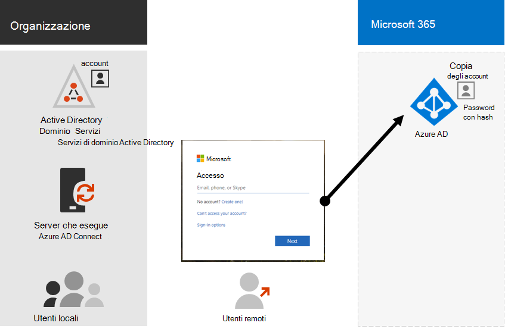
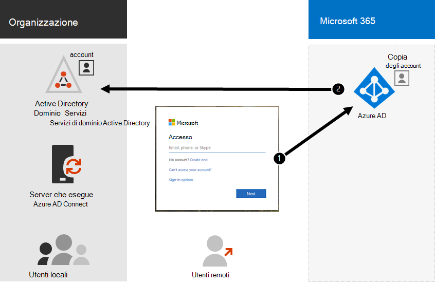

# Identità ibrida e sincronizzazione della directory per Microsoft 365Hybrid identity and directory synchronization for Microsoft 365

*Questo articolo si applica sia a Microsoft 365 Enterprise che a Office 365 Enterprise*.*This article applies to both Microsoft 365 Enterprise and Office 365 Enterprise.*

A seconda delle esigenze aziendali e dei requisiti tecnici, il modello di identità ibrido e la sincronizzazione della directory sono la scelta più comune per i clienti aziendali che adottano Microsoft 365.Depending on your business needs and technical requirements, the hybrid identity model and directory synchronization is the most common choice for enterprise customers who are adopting Microsoft 365. La sincronizzazione della directory consente di gestire le identità in Servizi di dominio Active Directory e tutti gli aggiornamenti agli account utente, ai gruppi e ai contatti vengono sincronizzati con il tenant di Azure Active Directory (Azure AD) della sottoscrizione di Microsoft 365.Directory synchronization allows you to manage identities in your Active Directory Domain Services (AD DS) and all updates to user accounts, groups, and contacts are synchronized to the Azure Active Directory (Azure AD) tenant of your Microsoft 365 subscription.

>[!Note]
>Quando gli account utente di Servizi di dominio Active Directory vengono sincronizzati per la prima volta, non vengono assegnati automaticamente a una licenza Microsoft 365 e non possono accedere ai servizi Microsoft 365, ad esempio la posta elettronica.When AD DS user accounts are synchronized for the first time, they are not automatically assigned a Microsoft 365 license and cannot access Microsoft 365 services, such as email. È innanzitutto necessario assegnare loro una posizione di utilizzo.You must first assign them a usage location. Assegnare quindi una licenza a questi account utente, singolarmente o dinamicamente tramite l'appartenenza al gruppo.Then, assign a license to these user accounts, either individually or dynamically through group membership.
>

## Autenticazione per l'identità ibridaAuthentication for hybrid identity

Quando si utilizza il modello di identità ibrido, esistono due tipi di autenticazione:There are two types of authentication when using the hybrid identity model:

- Autenticazione gestitaManaged authentication

  Azure AD gestisce il processo di autenticazione utilizzando una versione con hash archiviata localmente della password o invia le credenziali a un agente software locale per essere autenticato da Servizi di dominio Active Directory locale.Azure AD handles the authentication process by using a locally-stored hashed version of the password or sends the credentials to an on-premises software agent to be authenticated by the on-premises AD DS.

- Autenticazione federataFederated authentication

  Azure AD reindirizza il computer client che richiede l'autenticazione a un altro provider di identità.Azure AD redirects the client computer requesting authentication to another identity provider.

### Autenticazione gestitaManaged authentication

Esistono due tipi di autenticazione gestita:There are two types of managed authentication:

- Sincronizzazione dell'hash delle password (PHS)Password hash synchronization (PHS)

  L'autenticazione viene eseguita direttamente da Azure AD.Azure AD performs the authentication itself.

- Autenticazione pass-through (PTA)Pass-through authentication (PTA)

  L'autenticazione di Azure AD viene eseguita da AD DS.Azure AD has AD DS perform the authentication.

#### Sincronizzazione dell'hash delle password (PHS)Password hash synchronization (PHS)

Con PHS, sincronizzare gli account utente di Servizi di dominio Active Directory con Microsoft 365 e gestire gli utenti in locale.With PHS, you synchronize your AD DS user accounts with Microsoft 365 and manage your users on-premises. Gli hash delle password utente vengono sincronizzati da Servizi di dominio Active Directory ad Azure AD in modo che gli utenti hanno la stessa password in locale e nel cloud.Hashes of user passwords are synchronized from your AD DS to Azure AD so that the users have the same password on-premises and in the cloud. Questo è il modo più semplice per abilitare l'autenticazione per le identità di Servizi di dominio Active Directory in Azure AD.This is the simplest way to enable authentication for AD DS identities in Azure AD. 

Quando le password vengono modificate o reimpostate in locale, i nuovi hash delle password vengono sincronizzati con Azure AD in modo che gli utenti possano sempre usare la stessa password per le risorse cloud e le risorse locali.When passwords are changed or reset on-premises, the new password hashes are synchronized to Azure AD so that your users can always use the same password for cloud resources and on-premises resources. Le password utente non vengono mai inviate ad Azure AD o archiviate in Azure AD in testo non crittografato.The user passwords are never sent to Azure AD or stored in Azure AD in clear text. Alcune funzionalità premium di Azure AD, ad esempio Identity Protection, richiedono PHS indipendentemente dal metodo di autenticazione selezionato.Some premium features of Azure AD, such as Identity Protection, require PHS regardless of which authentication method is selected.
  
Vedi [la scelta del metodo di autenticazione giusto](/azure/active-directory/hybrid/choose-ad-authn) per altre informazioni.See [choosing the right authentication method](/azure/active-directory/hybrid/choose-ad-authn) to learn more.
  
#### Autenticazione pass-through (PTA)Pass-through authentication (PTA)

PTA fornisce una semplice convalida delle password per i servizi di autenticazione di Azure AD usando un agente software in esecuzione su uno o più server locali per convalidare gli utenti direttamente con Servizi di dominio Active Directory.PTA provides a simple password validation for Azure AD authentication services using a software agent running on one or more on-premises servers to validate the users directly with your AD DS. Con PTA, sincronizzare gli account utente di Servizi di dominio Active Directory con Microsoft 365 e gestire gli utenti in locale.With PTA, you synchronize AD DS user accounts with Microsoft 365 and manage your users on-premises. 

PTA consente agli utenti di accedere alle risorse e alle Microsoft 365 locali e alle applicazioni usando l'account e la password locali.PTA allows your users to sign in to both on-premises and Microsoft 365 resources and applications using their on-premises account and password. Questa configurazione convalida le password degli utenti direttamente rispetto a Servizi di dominio Active Directory locale senza archiviare gli hash delle password in Azure AD.This configuration validates users passwords directly against your on-premises AD DS without storing password hashes in Azure AD. 

PTA è anche per le organizzazioni con un requisito di sicurezza per applicare immediatamente gli stati degli account utente locali, i criteri password e le ore di accesso.PTA is also for organizations with a security requirement to immediately enforce on-premises user account states, password policies, and logon hours. 
  
Vedi [la scelta del metodo di autenticazione giusto](/azure/active-directory/hybrid/choose-ad-authn) per altre informazioni.See [choosing the right authentication method](/azure/active-directory/hybrid/choose-ad-authn) to learn more.
  
### Autenticazione federataFederated authentication

L'autenticazione federata è principalmente per organizzazioni aziendali di grandi dimensioni con requisiti di autenticazione più complessi.Federated authentication is primarily for large enterprise organizations with more complex authentication requirements. Le identità di Servizi di dominio Active Directory vengono sincronizzate con Microsoft 365 e gli account utente vengono gestiti in locale.AD DS identities are synchronized with Microsoft 365 and users accounts are managed on-premises. Con l'autenticazione federata, gli utenti hanno la stessa password in locale e nel cloud e non devono accedere di nuovo per usare Microsoft 365.With federated authentication, users have the same password on-premises and in the cloud and they do not have to sign in again to use Microsoft 365. 

L'autenticazione federata può supportare ulteriori requisiti di autenticazione, ad esempio l'autenticazione basata su smart card o un'autenticazione a più fattori di terze parti ed è in genere necessaria quando le organizzazioni hanno un requisito di autenticazione non supportato in modo nativo da Azure AD.Federated authentication can support additional authentication requirements, such as smartcard-based authentication or a third-party multi-factor authentication and is typically required when organizations have an authentication requirement not natively supported by Azure AD.
 
Vedi [la scelta del metodo di autenticazione giusto](/azure/active-directory/hybrid/choose-ad-authn) per altre informazioni.See [choosing the right authentication method](/azure/active-directory/hybrid/choose-ad-authn) to learn more.
  
#### Provider di identità e autenticazione di terze partiThird-party authentication and identity providers

Gli oggetti directory locali possono essere sincronizzati con Microsoft 365 e l'accesso alle risorse cloud è gestito principalmente da un provider di identità di terze parti.On-premises directory objects may be synchronized to Microsoft 365 and cloud resource access is primarily managed by a third-party identity provider (IdP).On-premises directory objects may be synchronized to Microsoft 365 and cloud resource access is primarily managed by a third-party identity provider (IdP). Se l'organizzazione usa una soluzione di federazione di terze parti, è possibile configurare l'accesso con tale soluzione per Microsoft 365 purché la soluzione di federazione di terze parti sia compatibile con Azure AD.If your organization uses a third-party federation solution, you can configure sign-on with that solution for Microsoft 365 provided that the third-party federation solution is compatible with Azure AD.
  
Per altre informazioni, [vedi l'elenco di compatibilità](/azure/active-directory/connect/active-directory-aadconnect-federation-compatibility) della federazione di Azure AD.See the [Azure AD federation compatibility list](/azure/active-directory/connect/active-directory-aadconnect-federation-compatibility) to learn more.
  
## Preparazione di Servizi di dominio Active DirectoryAD DS Preparation

Per garantire una transizione senza problemi a Microsoft 365 tramite la sincronizzazione, è necessario preparare la foresta di Servizi di dominio Active Directory prima di iniziare la Microsoft 365 di sincronizzazione della directory.To help ensure a seamless transition to Microsoft 365 by using synchronization, you must prepare your AD DS forest before you begin your Microsoft 365 directory synchronization deployment.
  
La preparazione della directory deve concentrarsi sulle attività seguenti:Your directory preparation should focus on the following tasks:

- Rimuovere gli **attributi proxyAddress** e **userPrincipalName** duplicati.Remove duplicate **proxyAddress** and **userPrincipalName** attributes.
- Aggiornare gli attributi **userPrincipalName vuoti** e non validi con **attributi userPrincipalName** validi.Update blank and invalid **userPrincipalName** attributes with valid **userPrincipalName** attributes.
- Rimuovere i caratteri non validi e discutibile negli attributi **givenName**, surname ( **sn** ), **sAMAccountName**, **displayName**, **mail**, **proxyAddresses,** **mailNickname** e **userPrincipalName.**Remove invalid and questionable characters in the **givenName**, surname ( **sn** ), **sAMAccountName**, **displayName**, **mail**, **proxyAddresses**, **mailNickname**, and **userPrincipalName** attributes. Per informazioni dettagliate sulla preparazione degli attributi, vedere [List of attributes that are synced by the Azure Active Directory Sync Tool](https://go.microsoft.com/fwlink/p/?LinkId=396719).For details about preparing attributes, see [List of attributes that are synced by the Azure Active Directory Sync Tool](https://go.microsoft.com/fwlink/p/?LinkId=396719).

    > [!NOTE]
    > Questi sono gli stessi attributi che Azure AD Connessione sincronizza.These are the same attributes that Azure AD Connect synchronizes. 
  
## Considerazioni sulla distribuzione a più foresteMulti-forest deployment considerations

Per più foreste e opzioni SSO, usare [un'installazione personalizzata di Azure AD Connessione](/azure/active-directory/hybrid/how-to-connect-install-custom).For multiple forests and SSO options, use a [Custom Installation of Azure AD Connect](/azure/active-directory/hybrid/how-to-connect-install-custom).
  
Se l'organizzazione dispone di più foreste per l'autenticazione (foreste di accesso), è consigliabile eseguire le operazioni seguenti:If your organization has multiple forests for authentication (logon forests), we highly recommend the following:
  
- **Valutare la possibilità di consolidare le foreste.****Consider consolidating your forests.** In generale, è necessario un maggiore sovraccarico per la gestione di più foreste.In general, there's more overhead required to maintain multiple forests. A meno che l'organizzazione non abbia vincoli di sicurezza che impongono la necessità di foreste separate, è consigliabile semplificare l'ambiente locale.Unless your organization has security constraints that dictate the need for separate forests, consider simplifying your on-premises environment.
- **Utilizzare solo nella foresta di accesso principale.****Use only in your primary logon forest.** Prendere in considerazione la Microsoft 365 solo nella foresta di accesso principale per l'implementazione iniziale di Microsoft 365.Consider deploying Microsoft 365 only in your primary logon forest for your initial rollout of Microsoft 365. 

Se non è possibile consolidare la distribuzione di Servizi di dominio Active Directory a più foreste o si utilizzano altri servizi directory per gestire le identità, è possibile sincronizzarli con l'aiuto di Microsoft o di un partner.If you can't consolidate your multi-forest AD DS deployment or are using other directory services to manage identities, you may be able to synchronize these with the help of Microsoft or a partner.
  
Per ulteriori informazioni, vedere [Topologies for Azure AD Connessione.](/azure/active-directory/hybrid/plan-connect-topologies)See [Topologies for Azure AD Connect](/azure/active-directory/hybrid/plan-connect-topologies) for more information.
  
## Funzionalità che dipendono dalla sincronizzazione della directoryFeatures that are dependent on directory synchronization
  
La sincronizzazione della directory è necessaria per le caratteristiche e le funzionalità seguenti:Directory synchronization is required for the following features and functionality:
  
- Azure AD Seamless Single Sign-On (SSO)Azure AD Seamless Single Sign-On (SSO)
- Skype coesistenzaSkype coexistence
- Exchange distribuzione ibrida, tra cui:Exchange hybrid deployment, including:
  - Elenco indirizzi globale (GAL) completamente condiviso tra l'ambiente Exchange locale e Microsoft 365.Fully shared global address list (GAL) between your on-premises Exchange environment and Microsoft 365.
  - Sincronizzazione delle informazioni dell'elenco indirizzi globale da sistemi di posta diversi.Synchronizing GAL information from different mail systems.
  - Possibilità di aggiungere e rimuovere utenti da Microsoft 365 offerte di servizi.The ability to add users to and remove users from Microsoft 365 service offerings. A tale scopo, è necessario quanto segue:This requires the following:
  - La sincronizzazione bidirezionale deve essere configurata durante l'installazione della sincronizzazione della directory.Two-way synchronization must be configured during directory synchronization setup. Per impostazione predefinita, gli strumenti di sincronizzazione della directory scrivono le informazioni della directory solo nel cloud.By default, directory synchronization tools write directory information only to the cloud. Quando si configura la sincronizzazione bidirezionale, si abilita la funzionalità di write-back in modo che un numero limitato di attributi dell'oggetto viene copiato dal cloud e quindi li si scrive di nuovo nel Servizio di dominio Active Directory locale.When you configure two-way synchronization, you enable write-back functionality so that a limited number of object attributes are copied from the cloud, and then written them back to your local AD DS. Il write-back viene anche definito Exchange ibrida.Write-back is also referred to as Exchange hybrid mode. 
  - Una distribuzione ibrida Exchange localeAn on-premises Exchange hybrid deployment
  - Possibilità di spostare alcune cassette postali utente in Microsoft 365 mantenendo altre cassette postali utente in locale.The ability to move some user mailboxes to Microsoft 365 while keeping other user mailboxes on-premises.
  - I mittenti attendibili e i mittenti bloccati in locale vengono replicati in Microsoft 365.Safe senders and blocked senders on-premises are replicated to Microsoft 365.
  - Delega di base e funzionalità di invio per conto di posta elettronica.Basic delegation and send-on-behalf-of email functionality.
  - Si dispone di una soluzione di autenticazione a più fattori o smart card locale integrata.You have an integrated on-premises smart card or multi-factor authentication solution.
- Sincronizzazione di foto, anteprime, sale riunioni e gruppi di sicurezzaSynchronization of photos, thumbnails, conference rooms, and security groups

## Passaggio successivoNext step

Quando si è pronti per distribuire l'identità ibrida, vedere [Prepare for directory synchronization](prepare-for-directory-synchronization.md).When you are ready to deploy hybrid identity, see [prepare for directory synchronization](prepare-for-directory-synchronization.md).
