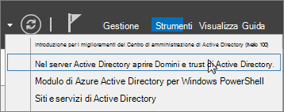
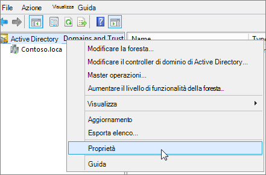
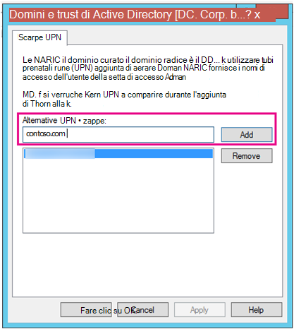
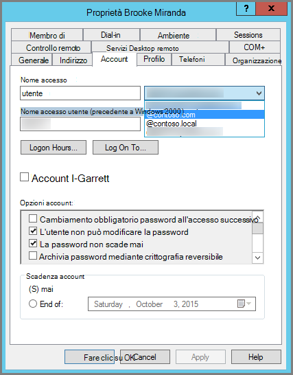

# <a name="prepare-a-non-routable-domain-for-directory-synchronization"></a><span data-ttu-id="804d1-103">Preparare un dominio non instradabile per la sincronizzazione della directory</span><span class="sxs-lookup"><span data-stu-id="804d1-103">Prepare a non-routable domain for directory synchronization</span></span>

<span data-ttu-id="804d1-104">Quando si sincronizza la directory locale con Microsoft 365, è necessario disporre di un dominio verificato in Azure Active Directory (Azure AD).</span><span class="sxs-lookup"><span data-stu-id="804d1-104">When you synchronize your on-premises directory with Microsoft 365, you have to have a verified domain in Azure Active Directory (Azure AD).</span></span> <span data-ttu-id="804d1-105">Vengono sincronizzati solo i nomi dell'entità utente (UPN) associati al dominio di Servizi di dominio Active Directory locale.</span><span class="sxs-lookup"><span data-stu-id="804d1-105">Only the User Principal Names (UPNs) that are associated with the on-premises Active Directory Domain Services (AD DS) domain are synchronized.</span></span> <span data-ttu-id="804d1-106">Tuttavia, qualsiasi UPN contenente un dominio non instradabile, ad esempio ".local" (ad esempio, billa@contoso.local), verrà sincronizzato con un dominio .onmicrosoft.com (ad esempio: billa@contoso.onmicrosoft.com).</span><span class="sxs-lookup"><span data-stu-id="804d1-106">However, any UPN that contains a non-routable domain, such as ".local" (example: billa@contoso.local), will be synchronized to an .onmicrosoft.com domain (example: billa@contoso.onmicrosoft.com).</span></span> 

<span data-ttu-id="804d1-107">Se attualmente si usa un dominio ".local" per gli account utente in Servizi di dominio Active Directory, è consigliabile modificarli per usare un dominio verificato, ad esempio billa@contoso.com, per eseguire correttamente la sincronizzazione con il dominio di Microsoft 365.</span><span class="sxs-lookup"><span data-stu-id="804d1-107">If you currently use a ".local" domain for your user accounts in AD DS, it's recommended that you change them to use a verified domain, such as billa@contoso.com, in order to properly synchronize with your Microsoft 365 domain.</span></span>
  
## <a name="what-if-i-only-have-a-local-on-premises-domain"></a><span data-ttu-id="804d1-108">Cosa succede se si dispone solo di un dominio locale ".local"?</span><span class="sxs-lookup"><span data-stu-id="804d1-108">What if I only have a ".local" on-premises domain?</span></span>

<span data-ttu-id="804d1-109">Si usa Azure AD Connect per sincronizzare Servizi di dominio Active Directory con il tenant di Azure AD del tenant di Microsoft 365.</span><span class="sxs-lookup"><span data-stu-id="804d1-109">You use Azure AD Connect for synchronizing your AD DS to the Azure AD tenant of your Microsoft 365 tenant.</span></span> <span data-ttu-id="804d1-110">Per ulteriori informazioni, vedere [Integrazione delle identità locali con Azure AD.](https://docs.microsoft.com/azure/architecture/reference-architectures/identity/azure-ad)</span><span class="sxs-lookup"><span data-stu-id="804d1-110">For more information, see [Integrating your on-premises identities with Azure AD](https://docs.microsoft.com/azure/architecture/reference-architectures/identity/azure-ad).</span></span>
  
<span data-ttu-id="804d1-111">Azure AD Connect sincronizza l'UPN e la password degli utenti in modo che gli utenti possano accedere con le stesse credenziali usate in locale.</span><span class="sxs-lookup"><span data-stu-id="804d1-111">Azure AD Connect synchronizes your users' UPN and password so that users can sign in with the same credentials they use on-premises.</span></span> <span data-ttu-id="804d1-112">Tuttavia, Azure AD Connect sincronizza solo gli utenti con i domini verificati da Microsoft 365.</span><span class="sxs-lookup"><span data-stu-id="804d1-112">However, Azure AD Connect only synchronizes users to domains that are verified by Microsoft 365.</span></span> <span data-ttu-id="804d1-113">Ciò significa che il dominio viene verificato anche da Azure AD perché le identità di Microsoft 365 sono gestite da Azure AD.</span><span class="sxs-lookup"><span data-stu-id="804d1-113">This means that the domain also is verified by Azure AD because Microsoft 365 identities are managed by Azure AD.</span></span> <span data-ttu-id="804d1-114">In altre parole, il dominio deve essere un dominio Internet valido (ad esempio, .com, .org, .net, .us).</span><span class="sxs-lookup"><span data-stu-id="804d1-114">In other words, the domain has to be a valid Internet domain (such as, .com, .org, .net, .us).</span></span> <span data-ttu-id="804d1-115">Se Servizi di dominio Active Directory interno usa solo un dominio non instradabile (ad esempio, ".local"), questo non può corrispondere al dominio verificato di cui si dispone per il tenant di Microsoft 365.</span><span class="sxs-lookup"><span data-stu-id="804d1-115">If your internal AD DS only uses a non-routable domain (for example, ".local"), this can't possibly match the verified domain you have for your Microsoft 365 tenant.</span></span> <span data-ttu-id="804d1-116">È possibile risolvere questo problema modificando il dominio principale in Servizi di dominio Active Directory locale oppure aggiungendo uno o più suffissi UPN.</span><span class="sxs-lookup"><span data-stu-id="804d1-116">You can fix this issue by either changing your primary domain in your on-premises AD DS, or by adding one or more UPN suffixes.</span></span>
  
### <a name="change-your-primary-domain"></a><span data-ttu-id="804d1-117">Modificare il dominio principale</span><span class="sxs-lookup"><span data-stu-id="804d1-117">Change your primary domain</span></span>

<span data-ttu-id="804d1-118">Modificare il dominio principale in un dominio verificato in Microsoft 365, ad esempio contoso.com.</span><span class="sxs-lookup"><span data-stu-id="804d1-118">Change your primary domain to a domain you have verified in Microsoft 365, for example, contoso.com.</span></span> <span data-ttu-id="804d1-119">Ogni utente con il dominio contoso.local viene quindi aggiornato a contoso.com.</span><span class="sxs-lookup"><span data-stu-id="804d1-119">Every user that has the domain contoso.local is then updated to contoso.com.</span></span> <span data-ttu-id="804d1-120">Si tratta tuttavia di un processo molto coinvolto e nella sezione seguente viene descritta una soluzione più semplice.</span><span class="sxs-lookup"><span data-stu-id="804d1-120">This is a very involved process, however, and an easier solution is described in the following section.</span></span>
  
### <a name="add-upn-suffixes-and-update-your-users-to-them"></a><span data-ttu-id="804d1-121">Aggiungere suffissi UPN e aggiornarvi gli utenti</span><span class="sxs-lookup"><span data-stu-id="804d1-121">Add UPN suffixes and update your users to them</span></span>

<span data-ttu-id="804d1-122">È possibile risolvere il problema ".local" registrando nuovi suffissi UPN in Servizi di dominio Active Directory in modo che corrispondano al dominio (o ai domini) verificato in Microsoft 365.</span><span class="sxs-lookup"><span data-stu-id="804d1-122">You can solve the ".local" problem by registering new UPN suffix or suffixes in AD DS to match the domain (or domains) you verified in Microsoft 365.</span></span> <span data-ttu-id="804d1-123">Dopo aver registrato il nuovo suffisso, si aggiornano gli UPN degli utenti per sostituire ".local" con il nuovo nome di dominio, ad esempio, in modo che un account utente sia simile a billa@contoso.com.</span><span class="sxs-lookup"><span data-stu-id="804d1-123">After you register the new suffix, you update the user UPNs to replace the ".local" with the new domain name, for example, so that a user account looks like billa@contoso.com.</span></span>
  
<span data-ttu-id="804d1-124">Dopo aver aggiornato gli UPN per usare il dominio verificato, si è pronti per sincronizzare Ad DS locale con Microsoft 365.</span><span class="sxs-lookup"><span data-stu-id="804d1-124">After you have updated the UPNs to use the verified domain, you are ready to synchronize your on-premises AD DS with Microsoft 365.</span></span>
  
#### <a name="step-1-add-the-new-upn-suffix"></a><span data-ttu-id="804d1-125">Passaggio 1: Aggiungere il nuovo suffisso UPN\*\*</span><span class="sxs-lookup"><span data-stu-id="804d1-125">Step 1: Add the new UPN suffix\*\*</span></span>
  
1. <span data-ttu-id="804d1-126">Nel controller di dominio di Servizi di dominio Active Directory, in Server Manager scegliere **Strumenti** \> **Domini e trust di Active Directory.**</span><span class="sxs-lookup"><span data-stu-id="804d1-126">On the AD DS domain controller, in the Server Manager choose **Tools** \> **Active Directory Domains and Trusts**.</span></span>
    
    <span data-ttu-id="804d1-127">**In caso contrario, se non si dispone di Windows Server 2012**</span><span class="sxs-lookup"><span data-stu-id="804d1-127">**Or, if you don't have Windows Server 2012**</span></span>
    
    <span data-ttu-id="804d1-128">Premere **il tasto Windows + R** per aprire la finestra di dialogo **Esegui,** quindi digitare Domain.msc e quindi scegliere **OK.**</span><span class="sxs-lookup"><span data-stu-id="804d1-128">Press **Windows key + R** to open the **Run** dialog, and then type in Domain.msc, and then choose **OK**.</span></span>
    
    
  
2. <span data-ttu-id="804d1-130">Nella finestra **Domini e trust** di Active Directory fare clic con il pulsante destro del mouse su Domini e trust di Active **Directory** e quindi scegliere **Proprietà.**</span><span class="sxs-lookup"><span data-stu-id="804d1-130">In the **Active Directory Domains and Trusts** window, right-click **Active Directory Domains and Trusts**, and then choose **Properties**.</span></span>
    
    
  
3. <span data-ttu-id="804d1-132">Nella casella **Suffissi UPN** alternativi della scheda Suffissi UPN digitare il nuovo suffisso o suffissi **UPN** e quindi scegliere  \> **Aggiungi applica.**</span><span class="sxs-lookup"><span data-stu-id="804d1-132">On the **UPN Suffixes** tab, in the **Alternative UPN Suffixes** box, type your new UPN suffix or suffixes, and then choose **Add** \> **Apply**.</span></span>
    
    
  
    <span data-ttu-id="804d1-134">Al termine dell'aggiunta dei suffissi, scegliere **OK.**</span><span class="sxs-lookup"><span data-stu-id="804d1-134">Choose **OK** when you're done adding suffixes.</span></span> 
    
 #### <a name="step-2-change-the-upn-suffix-for-existing-users"></a><span data-ttu-id="804d1-135">Passaggio 2: Modificare il suffisso UPN per gli utenti esistenti</span><span class="sxs-lookup"><span data-stu-id="804d1-135">Step 2: Change the UPN suffix for existing users</span></span>
  
1. <span data-ttu-id="804d1-136">Nel controller di dominio di Servizi di dominio Active Directory, in Server Manager scegliere **Strumenti** \> **Utenti e computer di Active Directory.**</span><span class="sxs-lookup"><span data-stu-id="804d1-136">On the AD DS domain controller, in the Server Manager choose **Tools** \> **Active Directory Users and Computers**.</span></span>
    
    <span data-ttu-id="804d1-137">**In caso contrario, se non si dispone di Windows Server 2012**</span><span class="sxs-lookup"><span data-stu-id="804d1-137">**Or, if you don't have Windows Server 2012**</span></span>
    
    <span data-ttu-id="804d1-138">Premere **il tasto Windows + R** per aprire la finestra di dialogo **Esegui,** quindi digitare Dsa.msc e quindi fare clic su **OK**</span><span class="sxs-lookup"><span data-stu-id="804d1-138">Press **Windows key + R** to open the **Run** dialog, and then type in Dsa.msc, and then click **OK**</span></span>
    
2. <span data-ttu-id="804d1-139">Selezionare un utente, fare clic con il pulsante destro del mouse e scegliere **Proprietà.**</span><span class="sxs-lookup"><span data-stu-id="804d1-139">Select a user, right-click, and then choose **Properties**.</span></span>
    
3. <span data-ttu-id="804d1-140">**Nell'elenco a** discesa Suffisso UPN della scheda Account scegliere il nuovo suffisso UPN e quindi fare clic su **OK.**</span><span class="sxs-lookup"><span data-stu-id="804d1-140">On the **Account** tab, in the UPN suffix drop-down list, choose the new UPN suffix, and then choose **OK**.</span></span>
    
    
  
4. <span data-ttu-id="804d1-142">Completare questi passaggi per ogni utente.</span><span class="sxs-lookup"><span data-stu-id="804d1-142">Complete these steps for every user.</span></span>
    
   
### <a name="use-powershell-to-change-the-upn-suffix-for-all-of-your-users"></a><span data-ttu-id="804d1-143">Utilizzare PowerShell per modificare il suffisso UPN per tutti gli utenti</span><span class="sxs-lookup"><span data-stu-id="804d1-143">Use PowerShell to change the UPN suffix for all of your users</span></span>

<span data-ttu-id="804d1-144">Se si dispone di molti account utente da aggiornare, è più facile usare PowerShell.</span><span class="sxs-lookup"><span data-stu-id="804d1-144">If you have a lot of user accounts to update, it's easier to use PowerShell.</span></span> <span data-ttu-id="804d1-145">Nell'esempio seguente vengono utilizzati i cmdlet [Get-ADUser](https://go.microsoft.com/fwlink/p/?LinkId=624312) e [Set-ADUser](https://go.microsoft.com/fwlink/p/?LinkId=624313) per modificare tutti i suffissi contoso.local in contoso.com in Servizi di dominio Active Directory.</span><span class="sxs-lookup"><span data-stu-id="804d1-145">The following example uses the cmdlets [Get-ADUser](https://go.microsoft.com/fwlink/p/?LinkId=624312) and [Set-ADUser](https://go.microsoft.com/fwlink/p/?LinkId=624313) to change all contoso.local suffixes to contoso.com in AD DS.</span></span> 

<span data-ttu-id="804d1-146">Ad esempio, è possibile eseguire i comandi di PowerShell seguenti per aggiornare tutti i suffissi contoso.local a contoso.com:</span><span class="sxs-lookup"><span data-stu-id="804d1-146">For example, you could run the following PowerShell commands to update all contoso.local suffixes to contoso.com:</span></span>
    
  ```powershell
  $LocalUsers = Get-ADUser -Filter "UserPrincipalName -like '*contoso.local'" -Properties userPrincipalName -ResultSetSize $null
  $LocalUsers | foreach {$newUpn = $_.UserPrincipalName.Replace("@contoso.local","@contoso.com"); $_ | Set-ADUser -UserPrincipalName $newUpn}
  ```

<span data-ttu-id="804d1-147">Per ulteriori informazioni sull'Windows PowerShell active directory in Servizi di dominio Active [Directory,](https://go.microsoft.com/fwlink/p/?LinkId=624314) Windows PowerShell active directory.</span><span class="sxs-lookup"><span data-stu-id="804d1-147">See [Active Directory Windows PowerShell module](https://go.microsoft.com/fwlink/p/?LinkId=624314) to learn more about using Windows PowerShell in AD DS.</span></span> 

