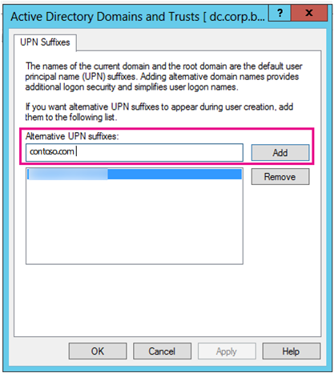

# <a name="prepare-a-non-routable-domain-for-directory-synchronization"></a>Preparare un dominio non instradabile per la sincronizzazione della directory

Quando si sincronizza la directory locale con Microsoft 365, è necessario disporre di un dominio verificato in Azure Active Directory (Azure AD). Vengono sincronizzati solo i nomi delle entità utente (UPN) associati al dominio di Servizi di dominio Active Directory locale. Tuttavia, qualsiasi UPN contenente un dominio non instradabile, ad esempio ".local" (ad esempio: billa@contoso.local), verrà sincronizzato con un dominio .onmicrosoft.com (ad esempio: billa@contoso.onmicrosoft.com). 

Se attualmente si utilizza un dominio ".local" per gli account utente in Servizi di dominio Active Directory, è consigliabile modificarli per utilizzare un dominio verificato, ad esempio billa@contoso.com, per sincronizzare correttamente con il dominio di Microsoft 365.
  
## <a name="what-if-i-only-have-a-local-on-premises-domain"></a>Cosa succede se si dispone solo di un dominio locale ".local"?

Si usa Azure AD Connect per sincronizzare Servizi di dominio Active Directory con il tenant di Azure AD del tenant di Microsoft 365. Per ulteriori informazioni, vedere Integrazione delle identità [locali con Azure AD.](/azure/architecture/reference-architectures/identity/azure-ad)
  
Azure AD Connect sincronizza l'UPN e la password degli utenti in modo che gli utenti possano accedere con le stesse credenziali usate in locale. Tuttavia, Azure AD Connect sincronizza solo gli utenti con i domini verificati da Microsoft 365. Ciò significa che il dominio viene verificato anche da Azure AD perché le identità di Microsoft 365 sono gestite da Azure AD. In altre parole, il dominio deve essere un dominio Internet valido (ad esempio, .com, .org, .net, .us). Se servizi di dominio Active Directory interni usa solo un dominio non instradabile ,ad esempio ".local", non può corrispondere al dominio verificato per il tenant di Microsoft 365. È possibile risolvere questo problema modificando il dominio principale in Servizi di dominio Active Directory locale oppure aggiungendo uno o più suffissi UPN.
  
### <a name="change-your-primary-domain"></a>Modificare il dominio principale

Modificare il dominio principale in un dominio verificato in Microsoft 365, ad esempio, contoso.com. Ogni utente con il dominio contoso.local viene quindi aggiornato a contoso.com. Si tratta tuttavia di un processo molto coinvolto e nella sezione seguente viene descritta una soluzione più semplice.
  
### <a name="add-upn-suffixes-and-update-your-users-to-them"></a>Aggiungere suffissi UPN e aggiornarvi gli utenti

È possibile risolvere il problema ".local" registrando nuovi suffissi UPN o suffissi in Servizi di dominio Active Directory in modo che corrispondano al dominio (o ai domini) verificati in Microsoft 365. Dopo aver registrato il nuovo suffisso, si aggiornano gli UPN degli utenti per sostituire ".local" con il nuovo nome di dominio, ad esempio, in modo che un account utente sia simile a billa@contoso.com.
  
Dopo aver aggiornato gli UPN per usare il dominio verificato, si è pronti per sincronizzare Servizi di dominio Active Directory locale con Microsoft 365.
  
#### <a name="step-1-add-the-new-upn-suffix"></a>Passaggio 1: Aggiungere il nuovo suffisso UPN**
  
1. Nel controller di dominio di Servizi di dominio Active Directory scegliere **Strumenti** Domini e trust di Active Directory in Server \> Manager.
    
    **In caso contrario, se non si dispone di Windows Server 2012**
    
    Premere **il tasto Windows + R** per aprire la finestra di dialogo **Esegui,** quindi digitare Domain.msc e quindi scegliere **OK**.
    
    
  
2. Nella finestra **Domini e trust** di Active Directory fare clic con il pulsante destro del mouse su Domini e trust di Active **Directory** e quindi scegliere **Proprietà**.
    
    
  
3. Nella casella **Suffissi UPN** alternativi della scheda Suffissi **UPN** digitare il nuovo suffisso o suffissi UPN e quindi scegliere **Aggiungi** \> **Applica**.
    
    
  
    Al termine dell'aggiunta dei suffissi, scegliere **OK.** 
    
 #### <a name="step-2-change-the-upn-suffix-for-existing-users"></a>Passaggio 2: Modificare il suffisso UPN per gli utenti esistenti
  
1. Nel controller di dominio Servizi di dominio Active Directory scegliere **Strumenti** Utenti e computer di Active Directory in Server \> Manager.
    
    **In caso contrario, se non si dispone di Windows Server 2012**
    
    Premere **il tasto Windows + R** per aprire la finestra di dialogo **Esegui,** quindi digitare Dsa.msc e quindi fare clic su **OK**
    
2. Selezionare un utente, fare clic con il pulsante destro del mouse e scegliere **Proprietà**.
    
3. **Nell'elenco** a discesa Suffisso UPN della scheda Account scegliere il nuovo suffisso UPN e quindi fare clic su **OK.**
    
    
  
4. Completare questi passaggi per ogni utente.
    
   
### <a name="use-powershell-to-change-the-upn-suffix-for-all-of-your-users"></a>Utilizzare PowerShell per modificare il suffisso UPN per tutti gli utenti

Se si dispone di molti account utente da aggiornare, è più facile usare PowerShell. Nell'esempio seguente vengono utilizzati i cmdlet [Get-ADUser](/previous-versions/windows/it-pro/windows-server-2008-R2-and-2008/ee617241(v=technet.10)) e [Set-ADUser](/previous-versions/windows/it-pro/windows-server-2008-R2-and-2008/ee617215(v=technet.10)) per modificare tutti i suffissi contoso.local in contoso.com in Servizi di dominio Active Directory. 

Ad esempio, è possibile eseguire i seguenti comandi di PowerShell per aggiornare tutti i suffissi contoso.local a contoso.com:
    
  ```powershell
  $LocalUsers = Get-ADUser -Filter "UserPrincipalName -like '*contoso.local'" -Properties userPrincipalName -ResultSetSize $null
  $LocalUsers | foreach {$newUpn = $_.UserPrincipalName.Replace("@contoso.local","@contoso.com"); $_ | Set-ADUser -UserPrincipalName $newUpn}
  ```

Per ulteriori informazioni sull'Windows PowerShell in Servizi di dominio Active [Directory,](/previous-versions/windows/it-pro/windows-server-2008-R2-and-2008/ee617195(v=technet.10)) vedere Active Directory Windows PowerShell module.