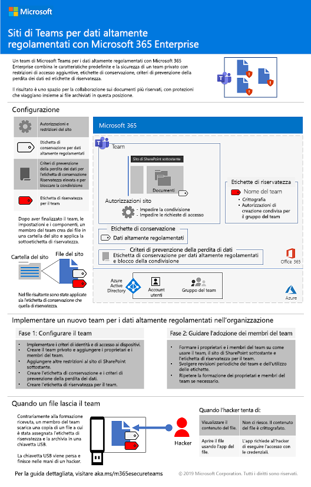
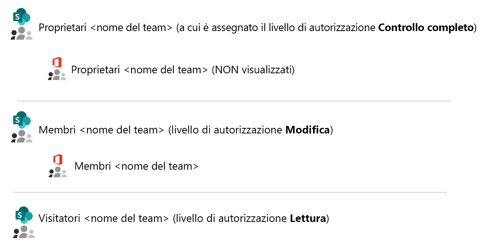
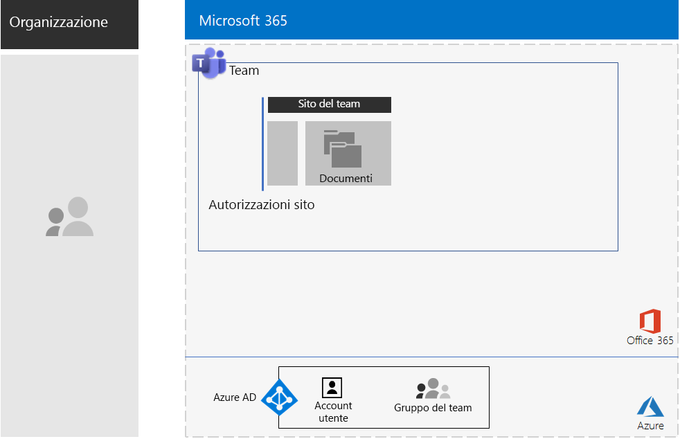
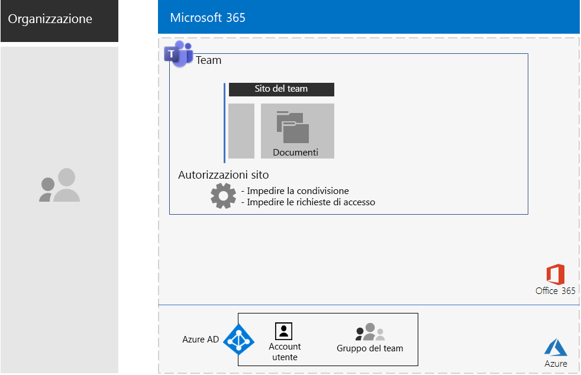
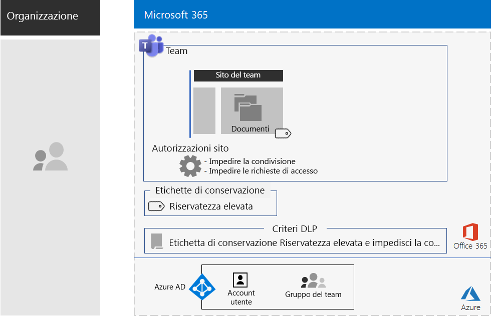
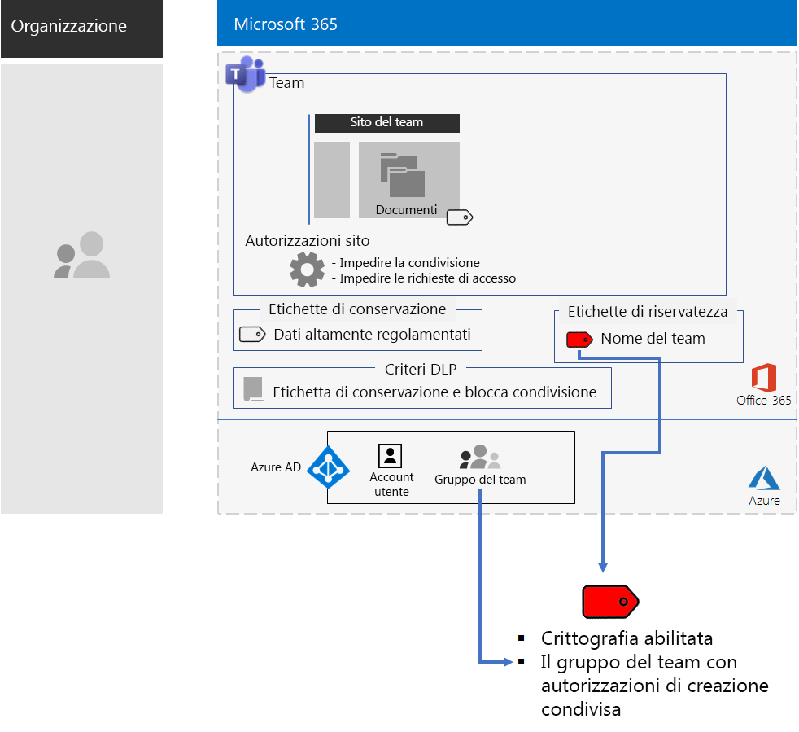
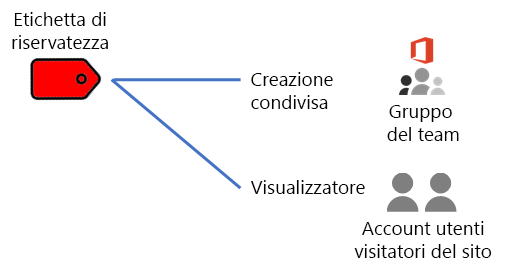
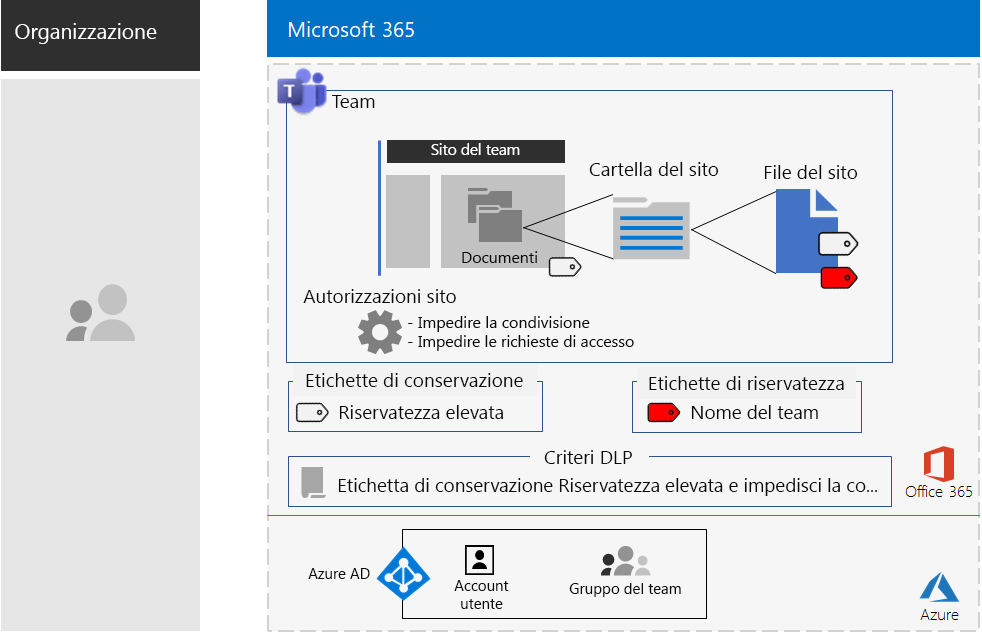

# Team per dati altamente regolamentati

Questo articolo contiene suggerimenti e procedure per la configurazione di un team privato in Microsoft Teams che limiti l'accesso alle funzionalità di Teams, ad esempio chat, riunioni e file, ai soli membri e ai proprietari del gruppo di Office 365 per il team. 

Oltre all'accesso privato basato sul gruppo Office 365, questo articolo descrive come configurare il sito del team di SharePoint privato sottostante, a cui è possibile accedere dalla sezione **File** di un canale del team, per implementare la sicurezza aggiuntiva necessaria per archiviare dati altamente regolamentati. In questo sito del team di SharePoint è possibile archiviare e collaborare su file, pagine, un calendario condiviso, attività, un blocco appunti ed elenchi.

>[!Note]
> Uno scenario analogo con SharePoint è disponibile [qui](teams-sharepoint-online-sites-highly-regulated-data.md).
>

Gli elementi della configurazione di un team per dati altamente regolamentati sono:

- Un team privato con un gruppo di Office 365 corrispondente che include gli account utente di proprietari e membri.
- Sicurezza aggiuntiva nel sito di SharePoint sottostante per il team che:
  - Impedisce ai membri del sito di concedere accesso ad altri utenti.
  - Impedisce ai non-membri del sito di richiedere accesso al sito.
- Un'etichetta di conservazione di Office 365 per il sito di SharePoint sottostante che viene applicata automaticamente ai nuovi file nel sito come strumento predefinito per definire i criteri di conservazione.
- Criteri di prevenzione della perdita dei dati che usano l'etichetta di conservazione e impediscono agli utenti di condividere o inviare file all'esterno dell'organizzazione.
- Un'etichetta di riservatezza di Office 365 o una sottoetichetta di un'etichetta per dati altamente regolamentati con crittografia abilitata e autorizzazioni di creazione condivisa per il gruppo di Office 365 del team. Gli utenti applicano l'etichetta o la sottoetichetta ai file archiviati nella sezione **File** del team dall'opzione della barra dei menu **Riservatezza** in Word, Excel e PowerPoint.

Ecco la configurazione risultante con un'etichetta di riservatezza.

Per una rapida panoramica, guardare questo breve video.

> [!VIDEO https://www.microsoft.com/videoplayer/embed/RE4mGHf]

 Per un riepilogo di una pagina per questo scenario, vedere il [poster Team per dati altamente regolamentati](./media/secure-teams-highly-regulated-data-scenario/TeamsHighlyRegulatedData.pdf).

È anche possibile scaricare il poster in formato [PDF](https://github.com/MicrosoftDocs/microsoft-365-docs/raw/public/microsoft-365/enterprise/media/secure-teams-highly-regulated-data-scenario/TeamsHighlyRegulatedData.pdf) o [PowerPoint](https://github.com/MicrosoftDocs/microsoft-365-docs/raw/public/microsoft-365/enterprise/media/secure-teams-highly-regulated-data-scenario/Teams-Highly-Regulated-Data-Poster.pptx) e stamparlo in formato lettera, legale o tabloid (27,9 x 43,2 cm).

## Fase 1: Configurare un team per i dati altamente regolamentati

La configurazione end-to-end prevede questi passaggi:

1. Configurare le identità e l'accesso ai dispositivi.
2. Creare un team privato.
3. Configurare il sito di SharePoint sottostante per aumentare la sicurezza.
4. Creare un'etichetta di conservazione e i criteri DLP.
5. Creare l'etichetta o la sottoetichetta dell'etichetta per dati altamente regolamentati.

### Passaggio1: Configurare le identità e l'accesso ai dispositivi

Per proteggere l'accesso al team e al sito di SharePoint sottostante, assicurarsi di aver configurato i [criteri di identità e accesso dei dispositivi](https://docs.microsoft.com/microsoft-365/enterprise/identity-access-policies) e i [criteri di accesso a SharePoint Online](https://docs.microsoft.com/microsoft-365/enterprise/sharepoint-file-access-policies) consigliati.

### Passaggio 2: Creare un team privato

Seguire [queste istruzioni](https://support.office.com/article/create-a-team-from-scratch-174adf5f-846b-4780-b765-de1a0a737e2b) per creare un team privato.

Quando si crea un team privato, le autorizzazioni predefinite sono le seguenti:

- Il gruppo di Office 365 per il team (gruppo del team) ha proprietari del gruppo e membri del gruppo
- Per il sito di SharePoint sottostante per il team (sito del team):
  - Amministratori raccolta siti è configurato per Proprietari del gruppo del team
  - Per il sito del team: 
    - Il gruppo di SharePoint Proprietari del sito del team, con il livello di autorizzazione Controllo completo, è impostato su Proprietari del gruppo del team
    - Il gruppo di SharePoint Membri del sito del team, con il livello di autorizzazione Modifica, è impostato su Membri del gruppo del team
    - Il gruppo di SharePoint Visitatori del sito del team, con il livello di autorizzazione Lettura, non ha gruppi o account utente

Ecco le autorizzazioni predefinite per il sito del team.

 
>[!Note]
>Se si visualizza il \<gruppo di SharePoint nome team > Proprietari per il livello di autorizzazione Modifica, non compare \<nome team > Proprietari.
>

Le autorizzazioni risultanti consentono:

- Ai proprietari del gruppo del team di amministrare il sito e avere il controllo completo sul contenuto del sito.
- Ai membri del gruppo del team di creare e modificare i file nel sito. 

La manutenzione delle autorizzazioni è uguale alla manutenzione di membri del team e proprietari.

Ecco la configurazione risultante finora.

 
### Passaggio 3: Configurare il sito di SharePoint sottostante per aumentare la sicurezza

Nel sito del team configurare queste impostazioni per le autorizzazioni.

1. Nella barra degli strumenti fare clic sull'icona delle impostazioni, quindi su **Autorizzazioni sito**.
2. Nel riquadro **Autorizzazioni sito** fare clic su **Modifica impostazioni di condivisione** in **Impostazioni di condivisione**.
3. In **Impostazioni di condivisione** scegliere **Solo i proprietari del sito possono condividere file, cartelle e il sito**.
4. Disattivare **Consenti richieste di accesso** e quindi fare clic su **Salva**.

Con queste impostazioni, la possibilità per i membri del gruppo del team di condividere il sito con altri membri o per i non membri di richiedere l'accesso al sito del team è disabilitata.

Ecco la configurazione risultante finora.

 
### Passaggio 4: Creare un'etichetta di conservazione e i criteri DLP

Seguire [queste istruzioni](https://docs.microsoft.com/microsoft-365/security/office-365-security/deploy-teams-retention-dlp) per:

1. Creare e pubblicare un'etichetta di conservazione per i dati altamente regolamentati, se necessario.
2. Configurare il sito del team per l'etichetta di conservazione creata nel passaggio 1.
3. Creare un criterio DLP per i dati altamente regolamentati che usi l'etichetta di conservazione creata nel passaggio 2 e impedisca agli utenti di inviare file all'esterno dell'organizzazione. È anche possibile configurare il criterio per altri requisiti, ad esempio quelli delle normative per il settore sanitario o finanziario, in base ai [modelli di criteri DLP](https://docs.microsoft.com/microsoft-365/compliance/data-loss-prevention-policies#dlp-policy-templates).

Ecco la configurazione risultante finora.

 
### Passaggio 5: Creare un'etichetta di riservatezza o una sottoetichetta dell'etichetta di riservatezza per dati altamente regolamentati

Diversamente da un'etichetta di riservatezza per dati altamente regolamentati, che chiunque può applicare a qualsiasi file, un team sicuro deve avere una propria etichetta o sottoetichetta, in modo che i file a cui è assegnata:

- Siano crittografati e la crittografia segua il file.
- Contengano autorizzazioni personalizzate in modo che solo i membri del gruppo del team possano aprirli.

Per implementare questo ulteriore livello di sicurezza per i file archiviati nel sito del team, è necessario configurare una nuova etichetta di riservatezza, autonoma o come sottoetichetta dell'etichetta generale per i file altamente regolamentati. Solo i membri del gruppo del team la vedranno nell'elenco di etichette.

Usare un'etichetta di riservatezza quando è necessario un numero limitato di etichette sia per l'uso globale che per i singoli team privati. Usare una sottoetichetta di riservatezza se si ha un numero elevato di etichette o se si vogliono organizzare le etichette per i team privati sotto l'etichetta per i dati altamente regolamentati.

[Seguire queste istruzioni ](https://docs.microsoft.com/microsoft-365/compliance/encryption-sensitivity-labels) per configurare un'etichetta separata o una sottoetichetta con le impostazioni seguenti:

- Il nome dell'etichetta contiene il nome del team
- La crittografia è abilitata
- Il gruppo del team ha autorizzazioni di creazione condivisa

Ecco la configurazione risultante con la nuova etichetta.

Ecco la relazione tra l'etichetta di riservatezza e il gruppo del team.

>[!Note]
>Se si configura l'etichetta o la sottoetichetta di riservatezza per le autorizzazioni definite dall'utente o con una data di scadenza, non è possibile aprire il file da Teams o SharePoint. È necessario usare un'app di Office.
>

### Autorizzazioni personalizzate

È anche possibile configurare autorizzazioni del sito di SharePoint personalizzate per il sito del team e, se necessario, l'etichetta di riservatezza corrispondente. Ecco due esempi.

#### Esempio 1: Delega dell'amministrazione del sito di SharePoint

Se il proprietario del team non ha esperienza nell'amministrazione di SharePoint o vuole delegare l'amministrazione del sito del team, può aggiungere l'account utente di un amministratore di SharePoint all'elenco dei proprietari del team. L'amministratore di SharePoint, tuttavia, avrà accesso completo al team e a tutte le risorse e potrà aprire un file a cui è applicata l'etichetta di riservatezza. 

Per evitare questa assegnazione eccessiva di privilegi, aggiungere l'account utente dell'amministratore di SharePoint al gruppo di SharePoint Proprietari del sito del team nelle impostazioni avanzate di autorizzazione del sito. L'amministratore di SharePoint potrà amministrare il sito, ma non potrà accedere al team o alle relative risorse, né aprire file con l'etichetta di riservatezza assegnata.

#### Esempio 2: Consentire l'accesso in sola visualizzazione ai file con etichetta

Se alcuni membri del personale devono esclusivamente visualizzare il contenuto dei file con etichetta nel sito del team, aggiungere i singoli account utente al:

- \<gruppo di SharePoint nome team > Visitatori, che per impostazione predefinita ha il livello di autorizzazione Lettura. 
- Etichetta di riservatezza con le autorizzazioni di visualizzazione.

Ecco le autorizzazioni risultanti nell'etichetta.

 
I visitatori del sito potranno accedere direttamente al sito del team e visualizzare il contenuto dei file ai quali è applicata la sottoetichetta. Tuttavia, dato che non sono membri del gruppo del team, non saranno in grado di accedere al team o alle relative risorse.

## Fase 2: Incoraggiare l'adozione da parte dei membri del team

Dopo aver predisposto il team è opportuno incoraggiare i membri dei team ad adottare il team e le relative misure di sicurezza aggiuntive.

### Passaggio 1: Formare gli utenti

I membri del gruppo del team possono accedere al team e a tutte le relative risorse, tra cui chat, riunioni e altre app. Quando usano file dalla sezione **File** di un canale, i membri del gruppo del team devono assegnare l'etichetta o la sottoetichetta di riservatezza ai file creati per il team sicuro. Ecco un esempio.

 
Quando l'etichetta viene applicata al file, viene protetto. I membri del gruppo del team possono aprirlo in Teams e collaborare in tempo reale. È crittografato e include le autorizzazioni di creazione condivisa impostate sui membri del gruppo del team. Se il file esce dal sito e viene inviato a un utente malintenzionato, quest'ultimo dovrà specificare le credenziali di un account utente membro del gruppo del team per aprire il file e visualizzarne il contenuto. 

Formare i membri del team sugli aspetti seguenti:

- Sull'importanza di usare il nuovo sito per chat, riunioni, file e altre risorse del sito del team e sulle conseguenze di una perdita di dati altamente regolamentati, come implicazioni legali, sanzioni per inadempimento alle normative, ransomware o perdita di vantaggi competitivi.
- Come accedere al team.
- Come creare nuovi file sul sito e caricare nuovi file memorizzati localmente.
- In che modo i criteri DLP impediscono di condividere i file esternamente.
- Come contrassegnare i file con l'etichetta o la sottoetichetta personalizzata del team.
- In che modo l'etichetta o la sottoetichetta protegge i file anche se vengono diffusi all'esterno del sito.

Questa formazione deve includere esercizi pratici in modo che i membri del team possano sperimentare queste funzionalità e i relativi risultati.

### Passaggio 2: Effettuare revisioni periodiche dell'utilizzo e rispondere al feedback dei membri del team

Nelle settimane successive alla formazione:

- Rispondere rapidamente al feedback dei membri del team e ottimizzare i criteri e le configurazioni.
- Analizzare l'utilizzo del team e confrontarlo con le aspettative di utilizzo.
- Verificare che i file altamente regolamentati siano stati etichettati correttamente con l'etichetta o la sottoetichetta di riservatezza personalizzata.

  È possibile vedere i file a cui è assegnata un'etichetta visualizzando una cartella in SharePoint e aggiungendo la colonna **Riservatezza** con l'opzione **Aggiungi colonna** in **Mostra/Nascondi colonne**.

Ripetere la formazione degli utenti se necessario.

## Eseguire una dimostrazione in un ambiente di test

Per creare il proprio ambiente di test per testare i team per i file sensibili e altamente riservati, vedere [queste istruzioni](https://docs.microsoft.com/microsoft-365/security/office-365-security/secure-team-for-files-in-a-dev-test-environment). 

## Utilizzo di un team sicuro per un progetto interno di Contoso Corporation

Contoso Corporation è un conglomerato industriale fittizio ma rappresentativo a livello internazionale. Usare l'esempio di Contoso per scoprire in che modo configurare e incoraggiare l'adozione di un [team sicuro](contoso-team-for-top-secret-project.md) per un progetto interno allo scopo di sviluppare e commercializzare un nuovo set di prodotti e servizi. 

## Vedere anche

[Siti di SharePoint per dati altamente regolamentati](teams-sharepoint-online-sites-highly-regulated-data.md)

[Carichi di lavoro e scenari di Microsoft 365 Enterprise](deploy-workloads.md)

[Raccolta di produttività di Microsoft 365](https://aka.ms/productivitylibrary)https://aka.ms/productivitylibrary)

[Guida alla distribuzione](deploy-microsoft-365-enterprise.md)
