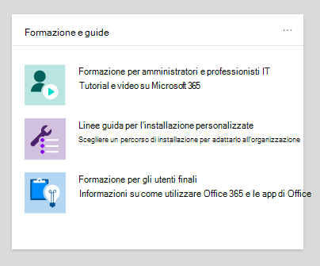
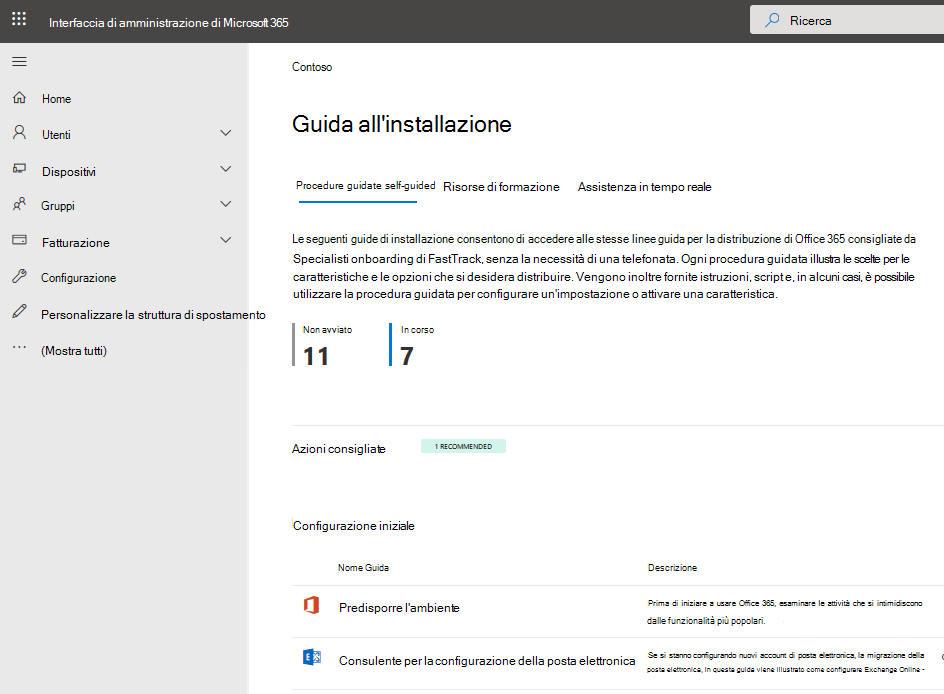
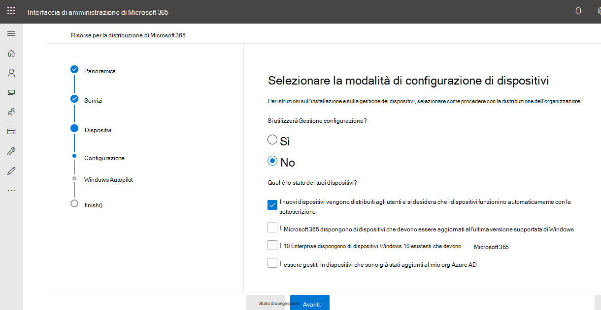

# Guide alla configurazione per i servizi di Office 365 e Microsoft 365

Microsoft 365 e Office 365 di configurazione forniscono indicazioni e risorse personalizzate per la pianificazione e la distribuzione di tenant, app e servizi. Queste guide Microsoft 365 vengono create usando le stesse procedure consigliate che gli esperti di onboarding [di FastTrack](https://www.microsoft.com/fasttrack/microsoft-365) condividono nelle singole interazioni e sono disponibili per tutti gli amministratori all'interno del interfaccia di amministrazione di Microsoft 365. Forniscono informazioni sulla configurazione del prodotto, abilitano le funzionalità di sicurezza, distribuiscono strumenti di collaborazione e forniscono script per velocizzare le distribuzioni avanzate.

## Come accedere alle guide alla configurazione nella interfaccia di amministrazione di Microsoft 365

Le guide all'installazione sono accessibili dalla pagina Delle indicazioni per [l'installazione](https://aka.ms/setupguidance) nella interfaccia di amministrazione di Microsoft 365. Puoi tenere traccia dello stato del tuo stato di avanzamento e puoi tornare in qualsiasi momento per completare una guida. Per accedere alla **pagina Delle indicazioni per l'installazione:**

1. Nel [interfaccia di amministrazione di Microsoft 365](https://admin.microsoft.com/), passare alla **home** page.

2. Trova la **scheda Guide & formazione.**

   

3. Selezionare **Guida all'installazione personalizzata**.

   

>[!NOTE]
>Le autorizzazioni di amministratore tenant sono necessarie per accedere al interfaccia di amministrazione di Microsoft 365.

## Come funzionano le guide all'installazione nella interfaccia di amministrazione di Microsoft 365?

Ogni guida fornisce istruzioni dettagliate, risorse, articoli e, se necessario, script che è possibile utilizzare per apportare modifiche alla configurazione. Queste guide offrono scelte che riflettono le esigenze specifiche delle organizzazioni di piccole e grandi dimensioni. Inoltre, la guida include assistenza sia per gli amministratori nuovi che per gli amministratori più esperti.

È possibile utilizzare le guide per ulteriori informazioni su specifiche funzionalità di Microsoft 365 e Office 365 durante la fase di pianificazione, durante la distribuzione e l'implementazione oppure per rivisitare le funzionalità dopo aver completato una distribuzione per modificare un'impostazione.

## Guide per la configurazione iniziale

### Predisporre l'ambiente

La [guida Preparare l'ambiente](https://aka.ms/prepareyourenvironment) consente di preparare l'ambiente dell'organizzazione per Microsoft 365 e Office 365 servizi. Indipendentemente dall'obiettivo, è necessario completare alcune attività per garantire la corretta distribuzione. Per evitare errori durante la preparazione dell'ambiente, vengono fornite istruzioni dettagliate per connettere il dominio, aggiungere utenti, assegnare licenze, configurare la posta elettronica con Exchange Online e installare o distribuire app Office.

### Advisor per la configurazione della posta elettronica

[L'advisor per la](https://aka.ms/office365setup) configurazione della posta elettronica fornisce le istruzioni dettagliate necessarie per configurare Exchange Online per l'organizzazione. Ciò include la configurazione di nuovi account di posta elettronica, la migrazione della posta elettronica e la configurazione della protezione della posta elettronica. Per una corretta configurazione della posta elettronica, utilizzare questo advisor e si riceverà il metodo di migrazione consigliato in base al sistema di posta corrente dell'organizzazione, al numero di cassette postali di cui viene eseguita la migrazione e alla modalità di gestione degli utenti e del relativo accesso.

### Eseguire la migrazione dei contatti e degli elementi del calendario di Gmail

Quando si esegue la migrazione della cassetta postale di un utente Gmail a Microsoft 365, viene eseguita la migrazione dei messaggi di posta elettronica, ma i contatti e gli elementi del calendario non lo sono. L'advisor contatti e calendario di [Gmail](https://aka.ms/gmailcontactscalendar) illustra la procedura per importare i contatti di Google e gli elementi del calendario di Google in Microsoft 365 utilizzando i metodi di importazione ed esportazione con Outlook.com, il client Outlook o PowerShell.

### Microsoft 365 advisor per la distribuzione

[L Microsoft 365 advisor per la](https://aka.ms/microsoft365setupguide) distribuzione fornisce indicazioni per la configurazione di strumenti di produttività, criteri di sicurezza e funzionalità di gestione dei dispositivi. Con un Microsoft 365 Business Premium o Microsoft 365 per enterprise, è possibile utilizzare questo advisor per configurare e configurare i dispositivi dell'organizzazione.

Riceverai indicazioni e accesso alle risorse per abilitare i servizi cloud, aggiornare i dispositivi alla versione più recente supportata di Windows 10 e aggiungere i dispositivi a Azure Active Directory (Azure AD), il tutto in un'unica posizione centrale.

### Guida alla configurazione del lavoro remoto

La [guida alla](https://aka.ms/remoteworksetup) configurazione del lavoro remoto fornisce alle organizzazioni i suggerimenti e le risorse necessari per garantire che gli utenti possano lavorare in remoto, che i dati siano sicuri e che le credenziali degli utenti siano protette.

Riceverai indicazioni per ottimizzare il traffico dei dispositivi dei lavoratori remoti verso le risorse Microsoft 365 nel cloud e nella rete dell'organizzazione, riducendo così l'affaticamento dell'infrastruttura VPN di accesso remoto.

### Windows Guida alla configurazione di Desktop virtuale

Windows Virtual Desktop è un servizio completo di virtualizzazione di desktop e app in esecuzione nel cloud. È l'unica infrastruttura desktop virtuale (VDI) a offrire gestione semplificata, Windows 10 multi-sessione, ottimizzazioni per Microsoft 365 Apps e supporto per ambienti RdS (Remote Desktop Services). Distribuisci e adatta i Windows desktop e le app ad Azure in pochi minuti e ottieni funzionalità di sicurezza e conformità predefinite.

La [Windows di installazione di Desktop](https://aka.ms/wvdsetupguide) virtuale fornisce agli amministratori le risorse di pianificazione e i prerequisiti per la distribuzione, le indicazioni per l'installazione e risorse aggiuntive.

### Microsoft Edge guida alla configurazione

Microsoft Edge è stato ricostruito da zero per garantire la compatibilità e le prestazioni di livello mondiale, la sicurezza e la privacy che ti meriti e le nuove funzionalità progettate per garantire il meglio del Web.

La [guida all'installazione](https://aka.ms/edgeadvisor) di Microsoft Edge consente di configurare l'individuazione siti di Enterprise per vedere quali siti a cui si accede nell'organizzazione potrebbe dover utilizzare la modalità IE, esaminare e configurare caratteristiche di sicurezza importanti, configurare criteri di privacy e criteri aggiuntivi per soddisfare i requisiti dell'organizzazione e gestire l'accesso Web nei dispositivi. Puoi scaricare Microsoft Edge in singoli dispositivi o ti mostreremo come eseguire la distribuzione a più utenti dell'organizzazione con Configuration Manager o Microsoft Intune.

### Microsoft Search guida alla configurazione

Microsoft Search aiuta l'organizzazione a trovare ciò di cui ha bisogno per completare ciò su cui sta lavorando. Sia che si cerchino persone, file, organigrammi, siti o risposte a domande comuni, l'organizzazione può usare Microsoft Search per tutta la giornata lavorativa per ottenere risposte.

La [Microsoft Search di](https://aka.ms/MicrosoftSearchSetup) configurazione consente di configurare Microsoft Search se si desidera eseguire la distribuzione pilota a un gruppo di utenti o stenderla a tutti gli utenti dell'organizzazione. Dovrai assegnare gli amministratori della ricerca e gli editor di ricerca e quindi personalizzare l'esperienza di ricerca per gli utenti con risposte e opzioni aggiuntive, ad esempio l'aggiunta dell'estensione Bing a Chrome o l'impostazione di Bing come motore di ricerca predefinito.

### Guida alla configurazione della co-gestione di Intune Configuration Manager

Usa la guida alla configurazione della [co-gestione](https://aka.ms/comanagementsetup) di Intune Configuration Manager per i dispositivi client esistenti di Configuration Manager e i nuovi dispositivi basati su Internet che l'organizzazione vuole gestire insieme a Microsoft Intune e Configuration Manager. Questa guida alla distribuzione della co-gestione consente di gestire i dispositivi Windows 10 e di aggiungere nuove funzionalità ai dispositivi dell'organizzazione, ricevendo al contempo i vantaggi di entrambe le soluzioni.

## Guide per l'autenticazione e l'accesso

### Guida alla configurazione di Azure AD

La [guida alla configurazione di Azure AD](https://aka.ms/aadpguidance) fornisce informazioni per garantire che l'organizzazione abbia una solida base di sicurezza. In questa guida verranno impostate funzionalità iniziali, come il controllo dell'accesso basato sui ruoli di Azure (RBAC di Azure) per gli amministratori, Azure AD Connessione per la directory locale e Azure AD Connessione Health, in modo da poter monitorare l'integrità dell'identità ibrida durante le sincronizzazioni automatizzate.

Include inoltre informazioni essenziali sull'abilitazione delle reimpostazioni delle password self-service, sull'accesso condizionale e sull'accesso integrato di terze parti, tra cui la protezione avanzata delle identità facoltativa e l'automazione del provisioning degli utenti.

### Sincronizzare gli utenti dalla directory dell'organizzazione

La [procedura guidata Sincronizza utenti dalla directory dell'organizzazione](https://aka.ms/directorysyncsetup) illustra come attivare la sincronizzazione della directory. In questo modo, le identità locali e cloud vengono riunite per semplificare l'accesso e semplificare la gestione. Sblocca nuove funzionalità, come single sign-on, opzioni self-service, provisioning automatico degli account, controlli di accesso condizionale e criteri di conformità. In questo modo gli utenti hanno accesso alle risorse necessarie da qualsiasi luogo.

### Pianificare la distribuzione senza password

Eseguire l'aggiornamento a un approccio di accesso alternativo che consenta agli utenti di accedere in modo sicuro ai propri dispositivi con uno dei metodi di autenticazione senza password seguenti:

- Windows Hello for Business
- L'app Microsoft Authenticator
- Chiavi di sicurezza

Utilizzare la [procedura guidata Plan your passwordless deployment wizard](https://aka.ms/passwordlesssetup) per individuare i metodi di autenticazione senza password migliori da utilizzare e ricevere indicazioni su come distribuirli.

### Pianificare la distribuzione della reimpostazione della password self-service

Offrire agli utenti la possibilità di modificare o reimpostare la password in modo indipendente, se l'account è bloccato o dimenticano la password senza dover contattare un tecnico dell'helpdesk.

Usare la procedura guidata Plan [your self-service password reset deployment wizard](https://aka.ms/SSPRSetupGuide) per ricevere articoli e istruzioni pertinenti per la configurazione delle opzioni del portale di Azure appropriate per la distribuzione di SSPR nell'ambiente.

### Advisor per la distribuzione di Active Directory Federation Services (AD FS)

L'advisor per la distribuzione di [AD FS](https://aka.ms/adfsguidance) fornisce istruzioni dettagliate sulla distribuzione di un'infrastruttura AD FS locale che autentica gli utenti per i servizi Microsoft 365 e Office 365. Con questa guida, l'organizzazione può esaminare i componenti e i requisiti di AD FS, acquisire e installare i certificati SSL necessari per la distribuzione e installare un server proxy dell'applicazione Web necessario.

## Guide per la sicurezza e la conformità

### Microsoft Intune guida alla configurazione

Configurare i Microsoft Intune per gestire i dispositivi nell'organizzazione. Per il controllo completo dei dispositivi aziendali, userai le funzionalità di gestione dei dispositivi mobili (MDM) di Intune. Per gestire i dati dell'organizzazione su dispositivi condivisi e personali, puoi usare le funzionalità di gestione delle applicazioni mobili (MAM) di Intune.

Con la [Microsoft Intune](https://aka.ms/intunesetupguide)di configurazione, dovrai configurare i criteri di conformità di dispositivi e app, assegnare criteri di protezione delle app e monitorare lo stato di protezione del dispositivo e dell'app.

### Microsoft Defender for Endpoint Advisor

[Microsoft Defender for Endpoint Advisor](https://aka.ms/mdatpsetup) fornisce istruzioni che consentono alla rete aziendale di prevenire, rilevare, analizzare e rispondere alle minacce avanzate. Effettuare una valutazione informata della vulnerabilità dell'organizzazione e decidere quali pacchetti di distribuzione e metodi di configurazione sono i migliori.

>[!NOTE]
>Per Microsoft Defender for Endpoint è necessario un contratto multilicenza Microsoft.

### Exchange Online Protection guida alla configurazione

Microsoft Exchange Online Protection (EOP) è un servizio di filtro della posta elettronica basato su cloud per la protezione da posta indesiderata e malware, con funzionalità per proteggere l'organizzazione dalle violazioni dei criteri di messaggistica.

Utilizzare la [guida alla configurazione](https://aka.ms/EOPguidance) di Exchange Online Protection per configurare EOP selezionando quale dei tre scenari di distribuzione si adatta alle cassette postali locali, alle cassette postali ibride (combinazione di locale e cloud) o a tutte le cassette postali cloud che si adattano all'organizzazione. &mdash; &mdash; La guida fornisce informazioni e risorse per configurare ed esaminare le licenze dell'utente, assegnare autorizzazioni nel interfaccia di amministrazione di Microsoft 365 e configurare i criteri antimalware e di posta indesiderata dell'organizzazione nel Centro sicurezza & conformità.

### Microsoft Defender per Office 365 advisor

[Microsoft Defender for Office 365 advisor](https://aka.ms/oatpsetup) protegge l'organizzazione dalle minacce dannose che l'ambiente potrebbe incontrare tramite messaggi di posta elettronica, collegamenti e strumenti di collaborazione di terze parti. Questa guida fornisce le risorse e le informazioni necessarie per preparare e identificare defender per Office 365 piano per soddisfare le esigenze dell'organizzazione.

### Microsoft Information Protection guida alla configurazione

Ottenere una panoramica delle funzionalità che è possibile applicare alla strategia di Protezione delle informazioni in modo da essere certi che le informazioni riservate siano protette. È possibile usare un approccio basato su un ciclo di vita in quattro fasi per individuare, classificare, proteggere e monitorare le informazioni sensibili. La [guida Configurazione di Microsoft Information Protection](https://aka.ms/mipsetupguide) fornisce indicazioni per completare ognuna di queste fasi.

### Guida alla configurazione della governance delle informazioni Microsoft

La guida alla configurazione della governance di [Microsoft Information](https://aka.ms/migsetupguide) fornisce le informazioni necessarie per configurare e gestire la strategia di governance dell'organizzazione, per garantire che i dati siano classificati e gestiti in base alle linee guida specifiche del ciclo di vita impostate. Questa guida illustra come creare, applicare automaticamente o pubblicare etichette, criteri di etichetta e criteri di conservazione applicati ai record di conformità e al contenuto riutilizzabile dell'organizzazione. Verranno inoltre fornite informazioni sull'importazione di file CSV con un piano di file per scenari in blocco o per applicarli manualmente a singoli documenti.

## Guide per la collaborazione

### Microsoft 365 Apps advisor per la distribuzione

[L Microsoft 365 Apps advisor](https://aka.ms/OPPquickstartguide) per la distribuzione di Office consente di ottenere i dispositivi degli utenti che eseguono la versione più recente di prodotti Office come Word, Excel, PowerPoint e OneNote. Verranno fornite indicazioni sui vari metodi di distribuzione che includono opzioni di installazione automatica semplici per le distribuzioni aziendali con strumenti di gestione. Le istruzioni ti aiuteranno a valutare l'ambiente, a stabilire i requisiti di distribuzione specifici e a implementare gli strumenti di supporto necessari per garantire un'installazione corretta.

### Guida alla configurazione delle app per dispositivi mobili

La [guida alla configurazione delle app](https://aka.ms/officeappguidance) per dispositivi mobili fornisce istruzioni per il download e l'installazione di app Office nei dispositivi mobili Windows, iOS e Android. Questa guida fornisce informazioni dettagliate per scaricare e installare app Microsoft 365 e Office 365 nei dispositivi telefonici e tablet.

### Microsoft Teams guida alla configurazione

La [guida alla](https://aka.ms/teamsguidance) configurazione Microsoft Teams fornisce all'organizzazione indicazioni per configurare aree di lavoro del team che ospitano conversazioni in tempo reale tramite messaggistica, chiamate e riunioni audio o video sia per le comunicazioni del team che per le comunicazioni private. Riceverai le istruzioni per determinare i requisiti di rete dell'organizzazione usando lo strumento Network Planner e l'Teams advisor all'interno dell'Teams di amministrazione. Una volta completata l'implementazione, la guida includerà risorse utili per iniziare a usare Teams.

### SharePoint guida alla configurazione

La [guida alla configurazione](https://aka.ms/spoguidance) di SharePoint consente di configurare l'archiviazione dei documenti e la gestione del contenuto di SharePoint, creare siti, configurare la condivisione esterna, eseguire la migrazione dei dati e configurare impostazioni avanzate e guidare il coinvolgimento degli utenti e le comunicazioni all'interno dell'organizzazione. Seguirai la procedura per configurare i criteri di autorizzazione per la condivisione del contenuto, scegliere gli strumenti di sincronizzazione della migrazione e abilitare le impostazioni di sicurezza per l'ambiente SharePoint locale.

### OneDrive guida alla configurazione

Usa la [guida OneDrive configurazione](https://aka.ms/ODfBquickstartguide) per iniziare a usare OneDrive di archiviazione, condivisione, collaborazione e sincronizzazione dei file. OneDrive offre una posizione centrale in cui gli utenti possono sincronizzare i file Microsoft 365 Apps, configurare la condivisione esterna, eseguire la migrazione dei dati utente e configurare impostazioni avanzate di sicurezza e accesso ai dispositivi. La OneDrive di installazione può essere distribuita utilizzando una sottoscrizione OneDrive o un piano OneDrive autonomo.

### Yammer advisor per la distribuzione

Connessione e coinvolgere tutta l'organizzazione con Yammer. [L Yammer advisor per](https://aka.ms/yammerdeploymentguide) la distribuzione prepara la rete Yammer aggiungendo domini, definendo gli amministratori e combinando Yammer reti. Verranno fornite indicazioni per distribuire Yammer e quindi personalizzare l'aspetto, configurare la sicurezza e la conformità e perfezionare le impostazioni.

## Procedure guidate avanzate

### Aggiornamento sul posto con Configuration Manager

Usa la [guida all'aggiornamento](https://aka.ms/win10upgradedemo) sul posto con Configuration Manager durante l'aggiornamento dei dispositivi Windows 7 e Windows 8.1 alla versione più recente di Windows 10. Verrà utilizzato lo script fornito per controllare i prerequisiti e configurare automaticamente un aggiornamento sul posto.

### Distribuire Office agli utenti

Distribuisci Office app dal cloud con la possibilità di personalizzare l'installazione usando lo Office Deployment Tool. La [guida Distribuisci Office](https://aka.ms/proplusodt) agli utenti consente di creare una configurazione di Office personalizzata con impostazioni avanzate oppure di utilizzare una configurazione consigliata predefinita. Indipendentemente dal fatto che gli utenti esercitino un'installazione automatica o si distribuisca agli utenti singolarmente o in blocco, questa procedura guidata avanzata fornisce istruzioni dettagliate per offrire agli utenti un'installazione di Office personalizzata per l'organizzazione.

### Distribuire Office utenti remoti

Ora che lavorare in remoto è la norma, gli utenti devono ricevere le impostazioni di Office dell'organizzazione quando non sono connessi alla rete interna o quando usano i propri dispositivi.

Usare la guida Deploy [Office to remote users](https://aka.ms/officeremoteinstall) per creare un'installazione di Office personalizzata e quindi inviare agli utenti uno script di PowerShell generato che installerà Office con la configurazione.

### Distribuire e aggiornare Microsoft 365 Apps con Configuration Manager

Per le organizzazioni che usano Configuration Manager, è possibile utilizzare l'advisor Distribuire e aggiornare Microsoft 365 Apps con [Configuration Manager](https://aka.ms/oppinstall) per generare uno script che configurerà automaticamente la distribuzione di Microsoft 365 Apps usando le procedure consigliate dai tecnici di FastTrack. Usa questa guida per creare i gruppi di distribuzione, personalizzare le app e le funzionalità di Office, configurare installazioni dinamiche o snelle ed eseguire lo script per creare le applicazioni, le regole di distribuzione automatica e le raccolte di dispositivi necessarie per la distribuzione.
