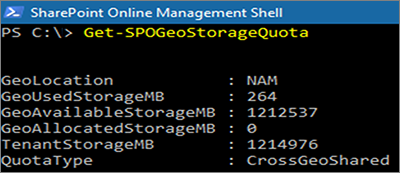

# <a name="sharepoint-storage-quotas-in-multi-geo-environments"></a>Quote di archiviazione di SharePoint in ambienti multi-geo

Per impostazione predefinita, tutti i percorsi di un ambiente multi-geo condividono la Quota di archiviazione disponibile per il tenant.

Con l'impostazione di quota di archiviazione geografica di SharePoint, è possibile gestire la Quota di archiviazione per ogni posizione geografica. Quando si assegna una quota di archiviazione per una posizione geografica, diventa la quantità massima di spazio di archiviazione disponibile per quella posizione geografica e viene sottratta dalla Quota di archiviazione disponibile per il tenant. La Quota di archiviazione disponibile per il tenant rimanente verrà quindi condivisa tra le posizioni geografiche configurate a cui non è stata assegnata una quota di archiviazione.

La Quota di archiviazione di SharePoint per qualsiasi posizione geografica può essere assegnata dall'amministratore di SharePoint Online connettendosi alla posizione centrale. Gli amministratori di posizioni geografiche satellitari possono visualizzare la Quota di archiviazione, ma non possono assegnarla.

## <a name="configure-a-storage-quota-for-a-geo-location"></a>Configurare una quota di archiviazione per una posizione geografica.

Usare il [Modulo di Microsoft Office SharePoint Online](https://www.microsoft.com/download/details.aspx?id=35588) e connettersi alla posizione centrale per assegnare la Quota di archiviazione ad una posizione geografica.

Per assegnare una Quota di archiviazione ad un percorso, eseguire il cmdlet:

```powershell
Set-SPOGeoStorageQuota -GeoLocation <geolocationcode> -StorageQuotaMB <value>
```

Per visualizzare la Quota di archiviazione della posizione geografica attuale, eseguire:

```powershell
Get-SPOGeoStorageQuota
```



Per visualizzare la Quota di archiviazione per tutte le posizioni geografiche attuali, eseguire:

```powershell
Get-SPOGeoStorageQuota -AllLocations
```

Per rimuovere la quota di archiviazione assegnata ad una posizione geografica, impostare `StorageQuota value = 0`:

```powershell
Set-SPOGeoStorageQuota -GeoLocation <geolocationcode> -StorageQuotaMB 0
```
