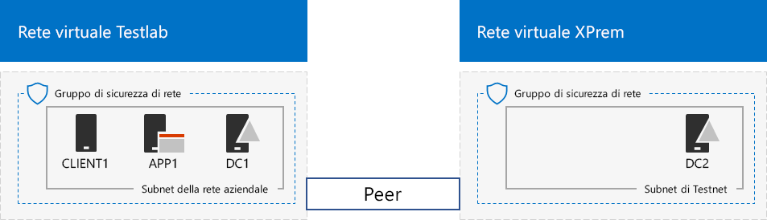
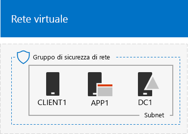
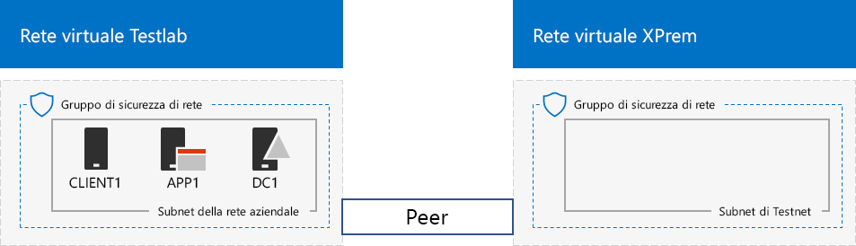

# <a name="simulated-cross-premises-virtual-network-in-a-microsoft-365-test-environment"></a>Rete virtuale cross-premise simulata in un ambiente di testing di Microsoft 365

*Questa guida al lab di test può essere usata sia per ambienti di testing di Microsoft 365 Enterprise che Office 365 Enterprise.*

This article steps you through creating a simulated hybrid cloud environment with Microsoft Azure using two Azure virtual networks. Here is the resulting configuration. 
  

  
Questa simula un ambiente di produzione cloud ibrido in IaaS di Azure ed è costituita da:
  
- Una rete locale simulata e semplificata, ospitata in una rete virtuale di Azure (la rete virtuale TestLab).
    
- Una rete virtuale cross-premise simulata ospitata in Azure (XPrem).
    
- Una relazione peering di rete virtuale tra le due reti virtuali.
    
- Un controller di dominio secondario nella rete virtuale XPrem.
    
Tale configurazione fornisce una base e un punto di partenza comune da cui è possibile: 
  
- Sviluppare e testare applicazioni in un ambiente cloud ibrido simulato in IaaS di Azure.
    
- Creare configurazioni di test dei computer, alcune all'interno della rete virtuale TestLab e alcune all'interno della rete virtuale XPrem, per simulare carichi di lavoro IT basati su cloud ibridi.
    
Le fasi principali della configurazione dell'ambiente di testing sono tre:
  
1. Configurare la rete virtuale TestLab.
    
2. Creare la rete virtuale cross-premise.
    
3. Configurare DC2.
    
> [!NOTE]
> Questa configurazione richiede una sottoscrizione a pagamento di Azure. 

È possibile utilizzare l'ambiente risultante per testare le funzionalità di [Microsoft 365 Enterprise](https://www.microsoft.com/microsoft-365/enterprise), con altre [guide al lab di test](m365-enterprise-test-lab-guides.md) o quelle disponibili.


> [!TIP]
> Cliccare sulla [Guida al lab di test di Microsoft 365 Enterprise](../media/m365-enterprise-test-lab-guides/Microsoft365EnterpriseTLGStack.pdf) per consultare una mappa di tutti gli articoli della guida al lab di test di Microsoft 365 Enterprise.

## <a name="phase-1-configure-the-testlab-virtual-network"></a>Fase 1: configurare la rete virtuale TestLab

Usare le istruzioni presenti nella **Fase 1** della [configurazione di base per l'organizzazione simulata](simulated-ent-base-configuration-microsoft-365-enterprise.md) per configurare i computer DC1, APP1 e CLIENT1 nella rete virtuale di Azure denominata TestLab.
  
Questa è la configurazione corrente. 
  

  
## <a name="phase-2-create-the-xprem-virtual-network"></a>Fase 2: creare la rete virtuale XPrem

In questa fase, viene creata e configurata la nuova rete virtuale XPrem, viene quindi eseguita la connessione alla rete virtuale TestLab con peering di rete virtuale.
  
Innanzitutto, avviare un prompt dei comandi di Azure PowerShell sul computer locale.
  
> [!NOTE]
> The following command sets use the latest version of Azure PowerShell. See [Get started with Azure PowerShell cmdlets](https://docs.microsoft.com/powershell/azureps-cmdlets-docs/). 
  
Accedere al proprio account di Azure con questo comando.
  
```powershell
Connect-AzAccount
```

Ottenere il nome della sottoscrizione con questo comando.
  
```powershell
Get-AzSubscription | Sort Name | Select Name
```

Set your Azure subscription. Replace everything within the quotes, including the \< and > characters, with the correct names.
  
```powershell
$subscrName="<subscription name>"
Select-AzSubscription -SubscriptionName $subscrName
```

Successivamente, creare la rete virtuale XPrem e proteggerla con un gruppo di sicurezza di rete con questi comandi.
  
```powershell
$rgName="<name of the resource group that you used for your TestLab virtual network>"
$locName=(Get-AzResourceGroup -Name $rgName).Location
$Testnet=New-AzVirtualNetworkSubnetConfig -Name "Testnet" -AddressPrefix 192.168.0.0/24
New-AzVirtualNetwork -Name "XPrem" -ResourceGroupName $rgName -Location $locName -AddressPrefix 192.168.0.0/16 -Subnet $Testnet -DNSServer 10.0.0.4
$rule1=New-AzNetworkSecurityRuleConfig -Name "RDPTraffic" -Description "Allow RDP to all VMs on the subnet" -Access Allow -Protocol Tcp -Direction Inbound -Priority 100 -SourceAddressPrefix Internet -SourcePortRange * -DestinationAddressPrefix * -DestinationPortRange 3389
New-AzNetworkSecurityGroup -Name "Testnet" -ResourceGroupName $rgName -Location $locName -SecurityRules $rule1
$vnet=Get-AzVirtualNetwork -ResourceGroupName $rgName -Name XPrem
$nsg=Get-AzNetworkSecurityGroup -Name "Testnet" -ResourceGroupName $rgName
Set-AzVirtualNetworkSubnetConfig -VirtualNetwork $vnet -Name "Testnet" -AddressPrefix 192.168.0.0/24 -NetworkSecurityGroup $nsg
$vnet | Set-AzVirtualNetwork
```

Creare quindi la relazione peering di rete virtuale tra le reti virtuali TestLab e XPrem con questi comandi.
  
```powershell
$rgName="<name of the resource group that you used for your TestLab virtual network>"
$vnet1=Get-AzVirtualNetwork -ResourceGroupName $rgName -Name TestLab
$vnet2=Get-AzVirtualNetwork -ResourceGroupName $rgName -Name XPrem
Add-AzVirtualNetworkPeering -Name TestLab2XPrem -VirtualNetwork $vnet1 -RemoteVirtualNetworkId $vnet2.Id
Add-AzVirtualNetworkPeering -Name XPrem2TestLab -VirtualNetwork $vnet2 -RemoteVirtualNetworkId $vnet1.Id
```

Questa è la configurazione corrente. 
  

  
## <a name="phase-3-configure-dc2"></a>Fase 3: configurare DC2

In questa fase, viene creata la macchina virtuale DC2 nella rete virtuale XPrem e viene configurata come controller di dominio di replica.
  
First, create a virtual machine for DC2. Run these commands at the Azure PowerShell command prompt on your local computer.
  
```powershell
$rgName="<your resource group name>"
$locName=(Get-AzResourceGroup -Name $rgName).Location
$vnet=Get-AzVirtualNetwork -Name XPrem -ResourceGroupName $rgName
$pip=New-AzPublicIpAddress -Name DC2-PIP -ResourceGroupName $rgName -Location $locName -AllocationMethod Dynamic
$nic=New-AzNetworkInterface -Name DC2-NIC -ResourceGroupName $rgName -Location $locName -SubnetId $vnet.Subnets[0].Id -PublicIpAddressId $pip.Id -PrivateIpAddress 192.168.0.4
$vm=New-AzVMConfig -VMName DC2 -VMSize Standard_A2_V2
$cred=Get-Credential -Message "Type the name and password of the local administrator account for DC2."
$vm=Set-AzVMOperatingSystem -VM $vm -Windows -ComputerName DC2 -Credential $cred -ProvisionVMAgent -EnableAutoUpdate
$vm=Set-AzVMSourceImage -VM $vm -PublisherName MicrosoftWindowsServer -Offer WindowsServer -Skus 2016-Datacenter -Version "latest"
$vm=Add-AzVMNetworkInterface -VM $vm -Id $nic.Id
$vm=Set-AzVMOSDisk -VM $vm -Name "DC2-OS" -DiskSizeInGB 128 -CreateOption FromImage -StorageAccountType "Standard_LRS"
$diskConfig=New-AzDiskConfig -AccountType "Standard_LRS" -Location $locName -CreateOption Empty -DiskSizeGB 20
$dataDisk1=New-AzDisk -DiskName "DC2-DataDisk1" -Disk $diskConfig -ResourceGroupName $rgName
$vm=Add-AzVMDataDisk -VM $vm -Name "DC2-DataDisk1" -CreateOption Attach -ManagedDiskId $dataDisk1.Id -Lun 1
New-AzVM -ResourceGroupName $rgName -Location $locName -VM $vm
```

Successivamente, eseguire la connessione alla nuova macchina virtuale DC2 dal [portale Azure](https://portal.azure.com) tramite nome dell’account e password dell’amministratore locale. 
  
Next, configure a Windows Firewall rule to allow traffic for basic connectivity testing. From an administrator-level Windows PowerShell command prompt on DC2, run these commands. 
  
```powershell
Set-NetFirewallRule -DisplayName "File and Printer Sharing (Echo Request - ICMPv4-In)" -enabled True
ping dc1.corp.contoso.com
```

The ping command should result in four successful replies from IP address 10.0.0.4. This is a test of traffic across the VNet peering relationship. 
  
Successivamente, aggiungere un ulteriore disco dati come nuovo volume con lettera di unità F: con questo comando in DC2 al prompt dei comandi di Windows PowerShell.
  
```powershell
Get-Disk | Where PartitionStyle -eq "RAW" | Initialize-Disk -PartitionStyle MBR -PassThru | New-Partition -AssignDriveLetter -UseMaximumSize | Format-Volume -FileSystem NTFS -NewFileSystemLabel "WSAD Data"
```

Next, configure DC2 as a replica domain controller for the corp.contoso.com domain. Run these commands from the Windows PowerShell command prompt on DC2.
  
```powershell
Install-WindowsFeature AD-Domain-Services -IncludeManagementTools
Install-ADDSDomainController -Credential (Get-Credential CORP\User1) -DomainName "corp.contoso.com" -InstallDns:$true -DatabasePath "F:\NTDS" -LogPath "F:\Logs" -SysvolPath "F:\SYSVOL"
```

Tenere presente che viene richiesto di fornire sia la password CORP\\User1 che una password per la modalità ripristino servizi directory, nonché di riavviare DC2.  
  
Now that the XPrem virtual network has its own DNS server (DC2), you must configure the XPrem virtual network to use this DNS server. Run these commands from the Azure PowerShell command prompt on your local computer.
  
```powershell
$vnet=Get-AzVirtualNetwork -ResourceGroupName $rgName -name "XPrem"
$vnet.DhcpOptions.DnsServers="192.168.0.4" 
Set-AzVirtualNetwork -VirtualNetwork $vnet
Restart-AzVM -ResourceGroupName $rgName -Name "DC2"
```

From the Azure portal on your local computer, connect to DC1 with the CORP\\User1 credentials. To configure the CORP domain so that computers and users use their local domain controller for authentication, run these commands from an administrator-level Windows PowerShell command prompt on DC1.
  
```powershell
New-ADReplicationSite -Name "TestLab" 
New-ADReplicationSite -Name "XPrem"
New-ADReplicationSubnet -Name "10.0.0.0/8" -Site "TestLab"
New-ADReplicationSubnet -Name "192.168.0.0/16" -Site "XPrem"
```

Questa è la configurazione corrente. 
  

  
L’ambiente cloud ibrido di Azure simulato è ora pronto per eseguire test.
  
A questo punto è possibile sperimentare le funzionalità aggiuntive di [Microsoft 365 Enterprise](https://www.microsoft.com/microsoft-365/enterprise).
  
## <a name="next-steps"></a>Passaggi successivi

Esplorare questi altri insiemi di guide al lab test:
  
- [Identità](m365-enterprise-test-lab-guides.md#identity)
- [Gestione dei dispositivi mobili](m365-enterprise-test-lab-guides.md#mobile-device-management)
- [Protezione delle informazioni](m365-enterprise-test-lab-guides.md#information-protection)

## <a name="see-also"></a>Vedere anche

[Guide al lab di test di Microsoft 365 Enterprise](m365-enterprise-test-lab-guides.md)

[Distribuzione di Microsoft 365 Enterprise](deploy-microsoft-365-enterprise.md)

[Documentazione di Microsoft 365 Enterprise](https://docs.microsoft.com/microsoft-365-enterprise/)
