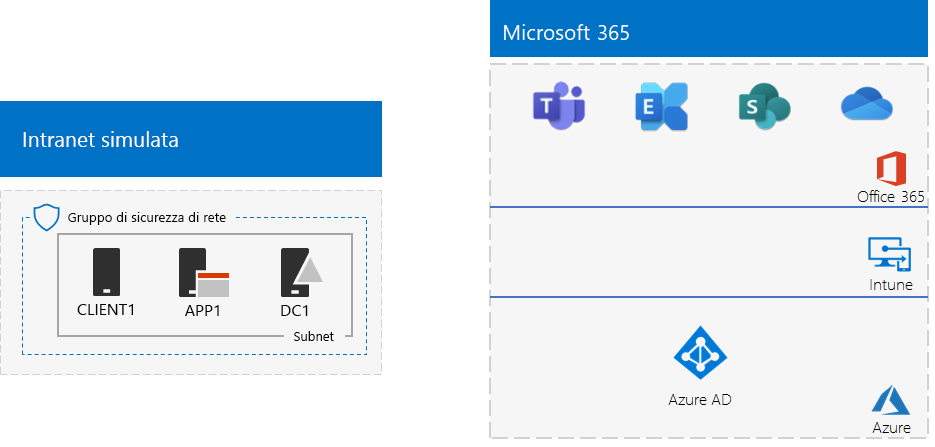
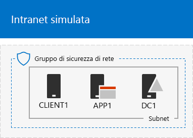
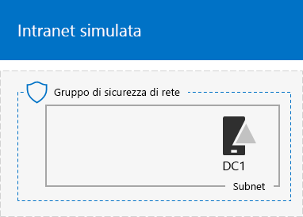
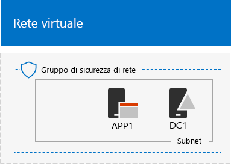

# <a name="the-simulated-enterprise-base-configuration"></a>La configurazione di base per l'organizzazione simulata

In questo articolo vengono fornite istruzioni dettagliate per creare un ambiente semplificato per Microsoft 365 Enterprise che include:

- Un abbonamento di valutazione o a pagamento a Microsoft 365 E5.
- Una intranet dell’organizzazione semplificata connessa a Internet e costituita da tre macchine virtuali in una rete virtuale Azure (DC1 APP1 e CLIENT1).
 


È possibile utilizzare l'ambiente risultante per testare le funzionalità di [Microsoft 365 Enterprise](https://www.microsoft.com/microsoft-365/enterprise), con altre [guide al lab di test](m365-enterprise-test-lab-guides.md) o quelle disponibili.


> [!TIP]
> Fare clic [qui](https://aka.ms/m365etlgstack) per consultare una mappa di tutti gli articoli relativi alla guida al lab test di Microsoft 365 Enterprise.

## <a name="phase-1-create-a-simulated-intranet"></a>Fase 1: creare una rete intranet simulata

In questa fase, verrà creata una rete intranet simulata nei servizi di infrastruttura di Azure che include un controller di dominio di Active Directory Domain Services, un server applicazioni e un computer client. 

Questi computer saranno usati nelle [Guide al lab di test di Microsoft 365 Enterprise](m365-enterprise-test-lab-guides.md) aggiuntive per configurare e dimostrare l'identità ibrida e altre funzionalità.

### <a name="method-1-build-your-simulated-intranet-with-an-azure-resource-manager-template"></a>Metodo 1: creare una rete intranet simulata con un modello di Azure Resource Manager

Con questo metodo si utilizza un modello Azure Resource Manager (ARM) per creare la rete intranet simulata. I modelli ARM contengono tutte le istruzioni per creare l’infrastruttura di rete Azure, le macchine virtuali e la loro configurazione.

Prima di distribuire il modello, consultare la [pagina Leggimi del modello](https://github.com/maxskunkworks/TLG/tree/master/tlg-base-config_3-vm.m365-ems) e avere a disposizione le informazioni seguenti:

- Il nome di dominio DNS pubblico dell'ambiente di test (testlab.\< dominio pubblico>). È necessario immettere questo nome nel **campo nome di dominio** della pagina **Distribuzione personalizzata**.
- Un prefisso etichetta DNS per gli URL degli indirizzi IP pubblici delle macchine virtuali. È necessario immettere l'etichetta nel campo **Prefisso etichetta DNS** della pagina **Distribuzione personalizzata**.

Dopo aver letto con le istruzioni, fare clic su **Distribuisci in Azure** nella [pagina Leggimi del modello](https://github.com/maxskunkworks/TLG/tree/master/tlg-base-config_3-vm.m365-ems) per iniziare.

>[!Note]
>La rete intranet simulata creata dal modello ARM richiede una sottoscrizione a pagamento ad Azure.
>

Ecco la configurazione una volta completato il modello.



### <a name="method-2-build-your-simulated-intranet-with-azure-powershell"></a>Metodo 2: creare la rete intranet simulata con Azure PowerShell

Con questo metodo si utilizza Windows PowerShell e il modulo di Azure PowerShell per creare l'infrastruttura di rete, le macchine virtuali e la loro configurazione.

Utilizzare questo metodo per acquisire esperienza nella creazione di elementi dell'infrastruttura di Azure un passo alla volta con PowerShell. È quindi possibile personalizzare i blocchi di comandi di PowerShell per una distribuzione personalizzata delle altre macchine virtuali in Azure.

#### <a name="step-1-create-dc1"></a>Passaggio 1: creare DC1

In questo passaggio viene creata una rete virtuale Azure e viene aggiunto DC1, una macchina virtuale che è un controller di dominio per un dominio di Active Directory Domain Services.

Innanzitutto, avviare un prompt dei comandi di Windows PowerShell sul computer locale.
  
> [!NOTE]
> I seguenti comandi consentono di utilizzare la versione più recente di Azure PowerShell. Vedere [Panoramica dei cmdlet di Azure PowerShell](https://docs.microsoft.com/powershell/azureps-cmdlets-docs/). 
  
Accedere al proprio account Azure con il seguente comando.
  
```
Connect-AzAccount
```

Ottenere il nome della sottoscrizione utilizzando il comando seguente.
  
```
Get-AzSubscription | Sort Name | Select Name
```

Impostare la sottoscrizione di Azure. Sostituire tutto il testo racchiuso tra virgolette, compresi i caratteri < e >, con il nome corretto.
  
```
$subscr="<subscription name>"
Get-AzSubscription -SubscriptionName $subscr | Select-AzSubscription
```

Successivamente, creare un nuovo gruppo di risorse per il lab di test dell'organizzazione simulata. Per determinare un nome del gruppo di risorse univoco, utilizzare questo comando per creare un elenco dei gruppi di risorse esistenti.
  
```
Get-AzResourceGroup | Sort ResourceGroupName | Select ResourceGroupName
```

Creare il nuovo gruppo di risorse con questi comandi. Sostituire tutto il testo racchiuso tra virgolette, compresi i caratteri < e >, con i nomi corretti.
  
```
$rgName="<resource group name>"
$locName="<location name, such as West US>"
New-AzResourceGroup -Name $rgName -Location $locName
```

Successivamente, creare la rete virtuale TestLa che ospiterà la sottorete Corpnet dell'ambiente dell'organizzazione simulata e proteggerla con un gruppo di sicurezza di rete. Inserire il nome del gruppo di risorse ed eseguire questi comandi al prompt dei comandi di PowerShell nel computer locale.
  
```
$rgName="<name of your new resource group>"
$locName=(Get-AzResourceGroup -Name $rgName).Location
$corpnetSubnet=New-AzVirtualNetworkSubnetConfig -Name Corpnet -AddressPrefix 10.0.0.0/24
New-AzVirtualNetwork -Name TestLab -ResourceGroupName $rgName -Location $locName -AddressPrefix 10.0.0.0/8 -Subnet $corpnetSubnet -DNSServer 10.0.0.4
$rule1=New-AzNetworkSecurityRuleConfig -Name "RDPTraffic" -Description "Allow RDP to all VMs on the subnet" -Access Allow -Protocol Tcp -Direction Inbound -Priority 100 -SourceAddressPrefix Internet -SourcePortRange * -DestinationAddressPrefix * -DestinationPortRange 3389
New-AzNetworkSecurityGroup -Name Corpnet -ResourceGroupName $rgName -Location $locName -SecurityRules $rule1
$vnet=Get-AzVirtualNetwork -ResourceGroupName $rgName -Name TestLab
$nsg=Get-AzNetworkSecurityGroup -Name Corpnet -ResourceGroupName $rgName
Set-AzVirtualNetworkSubnetConfig -VirtualNetwork $vnet -Name Corpnet -AddressPrefix "10.0.0.0/24" -NetworkSecurityGroup $nsg
$vnet | Set-AzVirtualNetwork
```

Successivamente, creare la macchina virtuale DC1 e configurarla come controller di dominio per il dominio di AD DS **testlab.**\<dominio pubblico> e come server DNS per le macchine virtuali della rete virtuale TestLab. Ad esempio, se il nome di dominio pubblico è **<span>contoso</span>.com**, la macchina virtuale DC1 sarà un controller di dominio per il dominio **<span>testlab</span>.contoso.com**.
  
Inserire il nome del gruppo di risorse ed eseguire questi comandi al prompt dei comandi di PowerShell nel computer locale per creare una macchina virtuale di Azure per DC1.
  
```
$rgName="<resource group name>"
$locName=(Get-AzResourceGroup -Name $rgName).Location
$vnet=Get-AzVirtualNetwork -Name TestLab -ResourceGroupName $rgName
$pip=New-AzPublicIpAddress -Name DC1-PIP -ResourceGroupName $rgName -Location $locName -AllocationMethod Dynamic
$nic=New-AzNetworkInterface -Name DC1-NIC -ResourceGroupName $rgName -Location $locName -SubnetId $vnet.Subnets[0].Id -PublicIpAddressId $pip.Id -PrivateIpAddress 10.0.0.4
$vm=New-AzVMConfig -VMName DC1 -VMSize Standard_A1
$cred=Get-Credential -Message "Type the name and password of the local administrator account for DC1."
$vm=Set-AzVMOperatingSystem -VM $vm -Windows -ComputerName DC1 -Credential $cred -ProvisionVMAgent -EnableAutoUpdate
$vm=Set-AzVMSourceImage -VM $vm -PublisherName MicrosoftWindowsServer -Offer WindowsServer -Skus 2016-Datacenter -Version "latest"
$vm=Add-AzVMNetworkInterface -VM $vm -Id $nic.Id
$vm=Set-AzVMOSDisk -VM $vm -Name "DC1-OS" -DiskSizeInGB 128 -CreateOption FromImage
$diskConfig=New-AzDiskConfig -AccountType "Standard_LRS" -Location $locName -CreateOption Empty -DiskSizeGB 20
$dataDisk1=New-AzDisk -DiskName "DC1-DataDisk1" -Disk $diskConfig -ResourceGroupName $rgName
$vm=Add-AzVMDataDisk -VM $vm -Name "DC1-DataDisk1" -CreateOption Attach -ManagedDiskId $dataDisk1.Id -Lun 1
New-AzVM -ResourceGroupName $rgName -Location $locName -VM $vm
```

Verrà richiesto nome utente e password dell'account Administrator locale su DC1. Utilizzare una password complessa e annotare nome e password in una posizione sicura.
  
Eseguire quindi la connessione alla macchina virtuale DC1.
  
1. Nel [Portale di Azure](https://portal.azure.com), fare clic su **Gruppi di risorse >** [nome del nuovo gruppo di risorse] **> DC1 > Connetti**.
    
2. Nel riquadro aperto, fare clic su **Scarica file RDP**. Aprire il file DC1.rdp che viene scaricato e quindi fare clic su **Connetti**.
    
3. Specificare il nome dell'account Administrator locale DC1:
    
   - Per Windows 7:
    
     Nella finestra di dialogo **Protezione di Windows**, fare clic su **Utilizza un altro account**. In **Nome utente**, digitare **DC1\\**[nome dell'account Administrator locale].
    
   - Per Windows 8 o Windows 10:
    
     Nella finestra di dialogo **Sicurezza di Windows**, fare clic su **Ulteriori scelte**, quindi fare clic su **Utilizzare un altro account**. In **Nome utente**, digitare **DC1\\**[nome dell'account Administrator locale].
    
4. In **Password**, digitare la password dell’account Administrator locale, quindi fare clic su **OK**.
    
5. Quando viene richiesto, fare clic su **Sì**.
    
Aggiungere un ulteriore disco dati come nuovo volume con lettera di unità F: immettendo questo comando al prompt dei comandi di Windows PowerShell a livello di amministratore in DC1.
  
```
Get-Disk | Where PartitionStyle -eq "RAW" | Initialize-Disk -PartitionStyle MBR -PassThru | New-Partition -AssignDriveLetter -UseMaximumSize | Format-Volume -FileSystem NTFS -NewFileSystemLabel "WSAD Data"
```

Successivamente, configurare DC1 come controller di dominio e i server DNS per il dominio **testlab.**\<dominio pubblico>. Specificare il nome di dominio pubblico, rimuovere \< e i caratteri >, quindi eseguire questi comandi al prompt dei comandi di Windows PowerShell a livello di amministratore nel DC1.
  
```
$yourDomain="<your public domain>"
Install-WindowsFeature AD-Domain-Services -IncludeManagementTools
Install-ADDSForest -DomainName testlab.$yourDomain -DatabasePath "F:\NTDS" -SysvolPath "F:\SYSVOL" -LogPath "F:\Logs"
```
Sarà necessario specificare una password di amministratore in modalità provvisoria. Archiviare la password in un percorso sicuro.
  
Si tenga presente che il completamento di questi comandi potrebbe richiedere alcuni minuti.
  
Dopo il riavvio di DC1, riconnettersi al computer virtuale DC1.
  
1. Nel [Portale di Azure](https://portal.azure.com), fare clic su **Gruppi di risorse >** [nome del nuovo gruppo di risorse] **> DC1 > Connetti**.
    
2. Eseguire il file DC1.rdp che viene scaricato e quindi fare clic su **Connetti**.
    
3. In **Sicurezza di Windows**, fare clic su **Utilizza un altro account**. In **Nome utente**, digitare **TESTLAB\\**[nome dell'account Administrator locale].
    
4. In **Password**, digitare la password dell’account Administrator locale, quindi fare clic su **OK**.
    
5. Quando viene richiesto, fare clic su **Sì**.
    
Successivamente, creare un account utente in Active Directory che verrà utilizzato quando si accede a computer membri del dominio TESTLAB. Eseguire questo comando al prompt dei comandi di Windows PowerShell a livello di amministratore.
  
```
New-ADUser -SamAccountName User1 -AccountPassword (read-host "Set user password" -assecurestring) -name "User1" -enabled $true -PasswordNeverExpires $true -ChangePasswordAtLogon $false
```

Tenere presente che questo comando chiede di specificare la password dell'account User1. Poiché questo account verrà utilizzato per le connessioni desktop remote per tutti i computer membri del dominio TESTLAB, scegliere una password complessa. Registrare la password dell'account User1 e archiviarla in una posizione sicura.
  
Configurare quindi il nuovo account User1 come amministratore del dominio, dell'organizzazione e dello schema. Eseguire questo comando al prompt dei comandi di Windows PowerShell a livello di amministratore.
  
```
$yourDomain="<your public domain>"
$domainName = "testlab"+$yourDomain
$userName="user1@" + $domainName
$userSID=(New-Object System.Security.Principal.NTAccount($userName)).Translate([System.Security.Principal.SecurityIdentifier]).Value
$groupNames=@("Domain Admins","Enterprise Admins","Schema Admins")
ForEach ($name in $groupNames) {Add-ADPrincipalGroupMembership -Identity $userSID -MemberOf (Get-ADGroup -Identity $name).SID.Value}
```

Chiudere la sessione Desktop remoto con DC1, quindi riconnettersi usando l'account TESTLAB\\User1.
  
Successivamente, per consentire il traffico per lo strumento Ping, eseguire questo comando al prompt dei comandi di Windows PowerShell a livello di amministratore.
  
```
Set-NetFirewallRule -DisplayName "File and Printer Sharing (Echo Request - ICMPv4-In)" -enabled True
```

Questa è la configurazione corrente.
  

  
#### <a name="step-2-configure-app1"></a>Passaggio 2: configurare APP1

In questo passaggio, creare e configurare APP1, ovvero un server applicazioni che inizialmente fornisce servizi di condivisione file e Web.

Inserire il nome del gruppo di risorse ed eseguire questi comandi al prompt dei comandi nel computer locale per creare una macchina virtuale di Azure per APP1.
  
```
$rgName="<resource group name>"
$locName=(Get-AzResourceGroup -Name $rgName).Location
$vnet=Get-AzVirtualNetwork -Name TestLab -ResourceGroupName $rgName
$pip=New-AzPublicIpAddress -Name APP1-PIP -ResourceGroupName $rgName -Location $locName -AllocationMethod Dynamic
$nic=New-AzNetworkInterface -Name APP1-NIC -ResourceGroupName $rgName -Location $locName -SubnetId $vnet.Subnets[0].Id -PublicIpAddressId $pip.Id
$vm=New-AzVMConfig -VMName APP1 -VMSize Standard_A1
$cred=Get-Credential -Message "Type the name and password of the local administrator account for APP1."
$vm=Set-AzVMOperatingSystem -VM $vm -Windows -ComputerName APP1 -Credential $cred -ProvisionVMAgent -EnableAutoUpdate
$vm=Set-AzVMSourceImage -VM $vm -PublisherName MicrosoftWindowsServer -Offer WindowsServer -Skus 2016-Datacenter -Version "latest"
$vm=Add-AzVMNetworkInterface -VM $vm -Id $nic.Id
$vm=Set-AzVMOSDisk -VM $vm -Name "APP1-OS" -DiskSizeInGB 128 -CreateOption FromImage
New-AzVM -ResourceGroupName $rgName -Location $locName -VM $vm
```

Successivamente, connettersi alla macchina virtuale APP1 usando il nome e la password dell'account Administrator locale di APP1, quindi aprire un prompt dei comandi di Windows PowerShell.
  
Per controllare la risoluzione del nome e la comunicazione della rete tra APP1 e DC1, eseguire il comando **ping dc1.testlab.**\<nome dominio pubblico> e verificare che siano presenti quattro risposte.
  
Unire quindi la macchina virtuale APP1 al dominio TESTLAB immettendo questi comandi nel prompt dei comandi di Windows PowerShell.
  
```
$yourDomain="<your public domain name>"
Add-Computer -DomainName ("testlab" + $yourDomain)
Restart-Computer
```

È necessario fornire le credenziali di un account di dominio TESTLAB\\User1 dopo aver eseguito il comando **Add-Computer**.
  
Dopo il riavvio di APP1, connettersi utilizzando l'account TESTLAB\\User1 e quindi aprire un prompt dei comandi di Windows PowerShell a livello di amministratore.
  
Successivamente, modificare APP1 in server Web con questo comando al prompt dei comandi di Windows PowerShell in APP1 a livello di amministratore.
  
```
Install-WindowsFeature Web-WebServer -IncludeManagementTools
```

Creare quindi una cartella condivisa e un file di testo all'interno della cartella in APP1 con i comandi di PowerShell.
  
```
New-Item -path c:\files -type directory
Write-Output "This is a shared file." | out-file c:\files\example.txt
New-SmbShare -name files -path c:\files -changeaccess TESTLAB\User1
```

Questa è la configurazione corrente.
  

  
#### <a name="step-3-configure-client1"></a>Passaggio 3: configurare CLIENT1.

In questo passaggio, viene creato e configurato CLIENT1 che si comporta come un tipico portatile, tablet o computer desktop nella rete intranet.

> [!NOTE]  
> Il seguente set di comandi crea CLIENT1 che esegue Windows Server 2016 Data Center. Tale operazione è possibile per tutti i tipi di sottoscrizioni di Azure. Se si dispone di una sottoscrizione di Azure basata su Visual Studio, è possibile creare CLIENT1 che esegue Windows 10 con il [Portale di Azure](https://portal.azure.com). 
  
Inserire il nome del gruppo di risorse ed eseguire questi comandi al prompt dei comandi nel computer locale per creare una macchina virtuale di Azure per CLIENT1.
  
```
$rgName="<resource group name>"
$locName=(Get-AzResourceGroup -Name $rgName).Location
$vnet=Get-AzVirtualNetwork -Name TestLab -ResourceGroupName $rgName
$pip=New-AzPublicIpAddress -Name CLIENT1-PIP -ResourceGroupName $rgName -Location $locName -AllocationMethod Dynamic
$nic=New-AzNetworkInterface -Name CLIENT1-NIC -ResourceGroupName $rgName -Location $locName -SubnetId $vnet.Subnets[0].Id -PublicIpAddressId $pip.Id
$vm=New-AzVMConfig -VMName CLIENT1 -VMSize Standard_A1
$cred=Get-Credential -Message "Type the name and password of the local administrator account for CLIENT1."
$vm=Set-AzVMOperatingSystem -VM $vm -Windows -ComputerName CLIENT1 -Credential $cred -ProvisionVMAgent -EnableAutoUpdate
$vm=Set-AzVMSourceImage -VM $vm -PublisherName MicrosoftWindowsServer -Offer WindowsServer -Skus 2016-Datacenter -Version "latest"
$vm=Add-AzVMNetworkInterface -VM $vm -Id $nic.Id
$vm=Set-AzVMOSDisk -VM $vm -Name "CLIENT1-OS" -DiskSizeInGB 128 -CreateOption FromImage
New-AzVM -ResourceGroupName $rgName -Location $locName -VM $vm
```

Successivamente, connettersi alla macchina virtuale CLIENT1 usando il nome e la password dell'account Administrator locale di CLIENT1, quindi aprire un prompt dei comandi di Windows PowerShell a livello di amministratore.
  
Per controllare la risoluzione del nome e la comunicazione della rete tra CLIENT1 e DC1, eseguire il comando **ping dc1.testlab.**\<nome dominio pubblico> al prompt dei comandi di Windows PowerShell e verificare che siano presenti quattro risposte.
  
Unire quindi la macchina virtuale CLIENT1 al dominio TESTLAB immettendo questi comandi nel prompt dei comandi di Windows PowerShell.
  
```
$yourDomain="<your public domain name>"
Add-Computer -DomainName ("testlab" + $yourDomain)
Restart-Computer
```

È necessario fornire le credenziali di un account di dominio TESTLAB\\User1 dopo aver eseguito il comando **Add-Computer**.
  
Dopo il riavvio di CLIENT1, connettersi utilizzando nome e password dell'account TESTLAB\\User1 e quindi aprire un prompt dei comandi di Windows PowerShell a livello di amministratore.
  
Successivamente, verificare che sia possibile accedere alle risorse Web e di condivisione file in APP1 da CLIENT1.
  
1. In Server Manager, nel riquadro della struttura, fare clic su **Server locale**.
    
2. In **Proprietà per CLIENT1**, fare clic su **Attiva** accanto a **Configurazione sicurezza avanzata IE**.
    
3. In **Configurazione sicurezza avanzata IE**, fare clic su **Disattiva** per **Amministratori** e **Utenti**, quindi fare clic su **OK**.
    
4. Dalla schermata Start, fare clic su **Internet Explorer**, quindi fare clic su **OK**.
    
5. Nella barra degli indirizzi digitare **http<span>://</span>app1.testab.**\<nome dominio pubblico>**/**, quindi premere INVIO. Dovrebbe essere possibile visualizzare la pagina Web predefinita di Internet Information Services per APP1.
    
6. Dalla barra delle applicazioni del desktop, fare clic sull'icona Esplora File.
    
7. Nella barra degli indirizzi, digitare **\\\\app1\\Files**, quindi premere INVIO. Verrà visualizzata una finestra della cartella con il contenuto della cartella File condivisi.
    
8. Nella finestra della cartella **File** condivisi, fare doppio clic sul file **Example.txt**. Verrà visualizzato il contenuto del file Example.txt.
    
9. Chiudere **example.txt - Blocco note** e la finestra della cartella **File** condivisi.
    
Questa è la configurazione corrente.
  


## <a name="phase-2-create-your-microsoft-365-e5-subscriptions"></a>Fase 2: Creare gli abbonamenti a Microsoft 365 E5

In questa fase viene creato un nuovo abbonamento a Microsoft 365 E5 che usa un nuovo tenant Azure Active Directory, separato dall'abbonamento di produzione. L'operazione può essere eseguita in due modi:

- Usare un abbonamento di valutazione a Microsoft 365 E5. 

  L'abbonamento di valutazione a Microsoft 365 E5 è di 30 giorni e può essere esteso facilmente a 60 giorni. Quando l'abbonamento di valutazione scade, è necessario convertirlo in un abbonamento a pagamento o creare un nuovo abbonamento di valutazione. Con la creazione di nuovi abbonamenti di valutazione, la configurazione esistente, che può contenere scenari complessi, viene abbandonata.  
- Usare un abbonamento di produzione separato a Microsoft 365 E5 con un numero limitato di licenze.

  Questo comporta un costo aggiuntivo, ma consente di disporre di un ambiente di testing di base per provare funzioni, configurazioni e scenari senza scadenza. È possibile usare lo stesso ambiente di testing durante il lungo periodo per prove di funzionamento, dimostrazioni a colleghi, gestione, nonché sviluppo e test delle applicazioni. Questo è il metodo consigliato.

### <a name="use-trial-subscriptions"></a>Utilizzare gli abbonamenti di valutazione

Seguire innanzitutto i passaggi della fase 2 e della fase 3 dell'[ambiente di sviluppo/test di Office 365](https://docs.microsoft.com/office365/enterprise/office-365-dev-test-environment) per creare un ambiente di sviluppo/test semplificato di Office 365.

>[!Note]
>È stato creato un abbonamento di valutazione a Office 365 in modo che l'ambiente di sviluppo/test includa un tenant di Azure AD diverso da quelli a pagamento attualmente in uso. Questa separazione indica che è possibile aggiungere e rimuovere utenti e gruppi nel tenant di test senza alcun effetto sulle sottoscrizioni di produzione.
>

Aggiungere quindi l'abbonamento di valutazione a Microsoft 365 E5 e assegnare una licenza di Microsoft 365 al proprio account di amministratore globale.

1. Con un'istanza privata di un browser Internet, accedere all'interfaccia di amministrazione di Microsoft 365 all'indirizzo [https://admin.microsoft.com](https://admin.microsoft.com) con le credenziali dell'account di amministratore globale.
    
2. Nella pagina dell'**interfaccia di amministrazione di Microsoft 365** fare clic su **Fatturazione > Acquisto di servizi** nella barra di spostamento sinistra.
    
3. Nella pagina **Acquisto di servizi** individuare la voce **Microsoft 365 E5**. Posizionare il puntatore del mouse su di essa e fare clic su **Avvia valutazione gratuita**.

4. Nella pagina **Valutazione di Microsoft 365 E5** scegliere di ricevere una chiamata o un SMS, immettere il numero di telefono, quindi fare clic su **Inviami un SMS** o **Chiamami**.

5. Nella pagina **Conferma l'ordine**, fare clic su **Prova adesso**.

6. Nella pagina **Ricevuta ordine**, fare clic su **Continua**.

7. Nell'interfaccia di amministrazione di Microsoft 365 fare clic su **Utenti attivi**, quindi sull'account dell'amministratore.

8. Per **Licenze di prodotti** fare clic su **Modifica**.

9. Disattivare la licenza per Office 365 Enterprise E5 e attivare la licenza per Microsoft 365 E5.

10. Fare clic su **Salva > Chiudi > Chiudi**.

 In seguito, ***se è stata completata la fase 3 dell'***[ambiente di sviluppo/test di Office 365](https://docs.microsoft.com/office365/enterprise/office-365-dev-test-environment), ripetere i passaggi da 8 a 11 della procedura precedente per tutti gli altri account (Utente 2, Utente 3, Utente 4 e Utente 5).
  
> [!NOTE]
> L'abbonamento di valutazione a Microsoft 365 E5 dura 30 giorni. Per un ambiente di test permanente, convertire questo abbonamento di valutazione in uno a pagamento con un numero limitato di licenze.
  
A questo punto, l'ambiente di test include:
  
- Un abbonamento di valutazione a Microsoft 365 E5.
- Tutti gli account utente appropriati (solo l'amministratore globale o tutti e cinque gli account utente) sono abilitati per l'uso di Microsoft 365 E5.
    
### <a name="results"></a>Risultati

A questo punto, l'ambiente di test dispone di:
  
- Abbonamento di valutazione a Microsoft 365 E5.
- Tutti gli account utente appropriati (solo l'amministratore globale o tutti e cinque gli account utente) sono abilitati per l'uso di Microsoft 365 E5.
    
Questa è la configurazione finale.
  

  
A questo punto è possibile sperimentare le funzionalità aggiuntive di [Microsoft 365 Enterprise](https://www.microsoft.com/microsoft-365/enterprise).
  
## <a name="next-steps"></a>Passaggi successivi

Esplorare questi altri insiemi di guide al lab test:
  
- [Identità](m365-enterprise-test-lab-guides.md#identity)
- [Gestione dei dispositivi mobili](m365-enterprise-test-lab-guides.md#mobile-device-management)
- [Protezione delle informazioni](m365-enterprise-test-lab-guides.md#information-protection)

## <a name="see-also"></a>Vedere anche

[Guide al lab di test di Microsoft 365 Enterprise](m365-enterprise-test-lab-guides.md)

[Distribuzione di Microsoft 365 Enterprise](deploy-microsoft-365-enterprise.md)

[Documentazione di Microsoft 365 Enterprise](https://docs.microsoft.com/microsoft-365-enterprise/)
